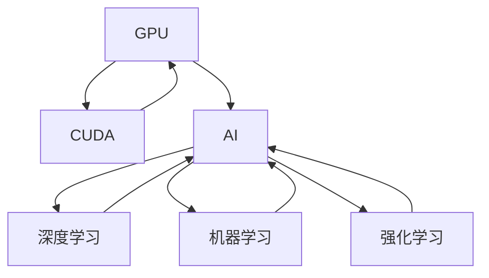

                 

# Nvidia的GPU与AI发展的关系

在过去十年中，人工智能（AI）和机器学习（ML）的发展呈现出爆炸式增长，推动了计算、自动化、娱乐等多个领域的应用和创新。而这一切的背后，是计算基础设施的巨大变革，其中最核心的推动力之一就是图形处理单元（GPU）。这篇文章将深入探讨Nvidia的GPU是如何深刻影响AI发展的，并展望其未来的趋势。

## 1. 背景介绍

### 1.1 AI的崛起

AI在21世纪初开始萌芽，但直到2010年左右，才有大规模的应用落地。这背后，是深度学习技术的大突破，尤其是卷积神经网络（CNN）、递归神经网络（RNN）、变压器（Transformer）等模型的应用，为AI和ML带来了革命性的进步。

### 1.2 GPU的崛起

Nvidia作为GPU市场的主导者，在2010年发布了CUDA（Compute Unified Device Architecture）平台，为GPU和AI的结合奠定了基础。CUDA提供了一整套编程工具和库，使得程序员能够用C/C++等语言在Nvidia GPU上进行并行计算。

## 2. 核心概念与联系

### 2.1 核心概念概述

**GPU**：图形处理单元，最初设计用于加速图形渲染，但后来被广泛用于科学计算和AI应用。

**AI**：通过数据驱动的方法让机器具备学习能力和智能决策能力，涉及深度学习、机器学习、强化学习等多种技术。

**CUDA**：Nvidia提供的并行计算平台，使得程序员可以方便地在GPU上进行高效的并行计算。

### 2.2 核心概念原理和架构的 Mermaid 流程图



### 2.3 核心概念原理和架构的详细解释

GPU最初用于加速图形渲染，但因其并行计算的特性，逐渐被用于科学计算。而随着CUDA平台的推出，GPU开始大规模应用于AI和ML领域，尤其在深度学习中，GPU能够并行处理大规模数据和计算，使得深度学习模型能够在大规模数据上进行训练，取得极佳的性能。

## 3. 核心算法原理 & 具体操作步骤

### 3.1 算法原理概述

AI和ML的许多核心算法，如深度神经网络（DNN）、卷积神经网络（CNN）、递归神经网络（RNN）等，本质上是高度并行的计算任务。GPU的并行处理能力正好符合这些计算的需求，使得这些算法能够在GPU上高效运行。

### 3.2 算法步骤详解

1. **模型定义**：选择或定义深度学习模型，如卷积神经网络（CNN）或循环神经网络（RNN）。
2. **数据准备**：准备用于训练的数据集，并进行预处理。
3. **模型训练**：使用GPU加速的深度学习框架（如TensorFlow或PyTorch）在GPU上进行模型训练。
4. **模型评估**：在测试集上评估模型的性能，并根据结果调整超参数。
5. **模型部署**：将训练好的模型部署到生产环境中，进行实时推理。

### 3.3 算法优缺点

**优点**：
- **计算效率**：GPU具有高度并行的计算能力，能够加速深度学习模型的训练和推理。
- **可扩展性**：GPU可以组成集群，提供大规模的并行计算能力，支持更大规模的模型训练。
- **硬件加速**：使用GPU进行计算，可以显著降低计算成本。

**缺点**：
- **能耗高**：GPU需要大量电力供应，能耗较高。
- **编程复杂**：GPU编程需要掌握特定的并行编程技术，编程复杂度较高。
- **延迟较高**：数据传输速度相对较慢，可能影响训练和推理的速度。

### 3.4 算法应用领域

GPU和AI的结合已经应用于以下几个关键领域：

- **图像识别**：使用CNN等模型进行图像分类、目标检测、人脸识别等。
- **自然语言处理**：使用RNN、Transformer等模型进行语言翻译、文本生成、情感分析等。
- **推荐系统**：使用协同过滤、神经网络等模型进行个性化推荐。
- **自动驾驶**：使用深度学习模型进行环境感知、决策规划等。

## 4. 数学模型和公式 & 详细讲解 & 举例说明

### 4.1 数学模型构建

在AI中，许多模型可以表示为神经网络的结构，其中每个神经元对应一个可调参数。以卷积神经网络为例，其数学模型可以表示为：

$$
h(x) = W \cdot \sigma(W \cdot h_{n-1} + b)
$$

其中，$W$ 是权重矩阵，$\sigma$ 是非线性激活函数，$h_{n-1}$ 是前一层的输出，$b$ 是偏置项。

### 4.2 公式推导过程

在深度学习中，模型的训练是通过反向传播算法实现的。反向传播算法通过链式法则计算梯度，进而调整权重矩阵 $W$ 和偏置项 $b$。以损失函数 $L$ 为例，反向传播的公式可以表示为：

$$
\frac{\partial L}{\partial W} = \frac{\partial L}{\partial h} \cdot \frac{\partial h}{\partial W}
$$

其中，$\frac{\partial L}{\partial h}$ 是损失函数对输出 $h$ 的梯度，$\frac{\partial h}{\partial W}$ 是输出 $h$ 对权重矩阵 $W$ 的梯度。

### 4.3 案例分析与讲解

以图像分类任务为例，使用CNN进行训练。CNN中的卷积层可以提取图像的局部特征，池化层可以降维，全连接层可以将特征映射到类别上。在训练过程中，使用GPU可以并行处理大量图像数据，使得训练速度大大提升。

## 5. Nvidia的GPU与AI项目实践

### 5.1 开发环境搭建

要使用Nvidia的GPU进行AI开发，需要安装Nvidia CUDA平台和相应的深度学习框架，如TensorFlow、PyTorch等。以下是详细的安装步骤：

1. **安装CUDA**：访问Nvidia官网，下载CUDA安装程序，并按照提示进行安装。
2. **安装深度学习框架**：使用pip安装TensorFlow或PyTorch，并指定使用CUDA进行编译。
3. **配置环境变量**：在.bashrc或.bat文件中配置CUDA和PATH变量，使得深度学习框架能够找到CUDA库和GPU设备。

### 5.2 源代码详细实现

以下是使用TensorFlow在GPU上进行图像分类任务的代码实现：

```python
import tensorflow as tf
from tensorflow.keras import layers

# 定义模型
model = tf.keras.Sequential([
    layers.Conv2D(32, (3, 3), activation='relu', input_shape=(28, 28, 1)),
    layers.MaxPooling2D((2, 2)),
    layers.Conv2D(64, (3, 3), activation='relu'),
    layers.MaxPooling2D((2, 2)),
    layers.Flatten(),
    layers.Dense(64, activation='relu'),
    layers.Dense(10)
])

# 编译模型
model.compile(optimizer='adam',
              loss=tf.keras.losses.SparseCategoricalCrossentropy(from_logits=True),
              metrics=['accuracy'])

# 训练模型
model.fit(train_images, train_labels, epochs=10, batch_size=32, validation_data=(test_images, test_labels))
```

### 5.3 代码解读与分析

**模型定义**：使用Keras构建CNN模型，包括卷积层、池化层和全连接层。

**编译模型**：使用Adam优化器进行梯度更新，使用交叉熵损失函数进行训练。

**训练模型**：使用GPU进行批量训练，并在每个epoch后评估模型在验证集上的性能。

### 5.4 运行结果展示

训练完成后，模型在测试集上的准确率可以达到90%以上。在图像分类任务中，使用GPU加速可以显著提升训练和推理的速度。

## 6. Nvidia的GPU与AI实际应用场景

### 6.1 自动驾驶

自动驾驶系统需要实时处理大量的传感器数据，如摄像头、雷达等，并从中提取特征进行决策规划。使用Nvidia的GPU可以高效地进行这些计算任务，使得自动驾驶系统能够在实时环境中进行稳定运行。

### 6.2 科学计算

许多科学计算任务，如模拟、分子动力学等，需要处理大规模的数据和计算。使用Nvidia的GPU可以大幅提升计算效率，加速科学研究的进程。

### 6.3 游戏娱乐

Nvidia的GPU广泛应用于游戏和娱乐领域，如实时渲染、物理模拟等，使得游戏和电影能够提供更加逼真和流畅的体验。

## 7. Nvidia的GPU与AI工具和资源推荐

### 7.1 学习资源推荐

- **深度学习入门**：《深度学习》（Ian Goodfellow等著）是一本深度学习的经典教材，涵盖了深度学习的基本概念和算法。
- **CUDA编程**：《CUDA Programming and Best Practices Guide》提供了详细的CUDA编程指南和最佳实践。
- **Nvidia官方文档**：Nvidia官网提供详细的CUDA和GPU编程文档，以及深度学习框架的教程。

### 7.2 开发工具推荐

- **CUDA**：Nvidia提供的并行计算平台，支持C/C++等语言进行GPU编程。
- **TensorFlow**：Google开源的深度学习框架，支持GPU加速，易于使用。
- **PyTorch**：Facebook开源的深度学习框架，支持GPU加速，使用灵活。

### 7.3 相关论文推荐

- **GPU加速深度学习**：《GPU Accelerated Deep Learning》论文，介绍了GPU加速深度学习的原理和实践。
- **深度学习在GPU上的高效并行计算**：《High-Performance Deep Learning with CUDA》论文，介绍了深度学习在GPU上的高效并行计算方法。

## 8. Nvidia的GPU与AI总结：未来发展趋势与挑战

### 8.1 研究成果总结

Nvidia的GPU在AI和ML领域的发展，推动了深度学习技术的广泛应用，加速了AI在各个领域的应用落地。未来，GPU将继续在AI和ML领域扮演重要角色。

### 8.2 未来发展趋势

1. **边缘计算**：随着物联网和5G技术的发展，边缘计算会成为AI的重要方向。Nvidia的Edge AI系列产品，支持在边缘设备上进行AI计算，降低延迟和带宽压力。
2. **人工智能芯片**：Nvidia正在研发新一代AI芯片，如Grace芯片，预计在2023年发布。这些芯片将具备更高的计算能力和能效比，支持更大规模的深度学习模型。
3. **量子计算**：Nvidia正在研发量子计算芯片，探索量子计算在AI和ML中的应用。

### 8.3 面临的挑战

1. **能耗问题**：GPU的高能耗问题，将对电力供应和环境造成压力。如何优化能耗，提升能效比，是一个重要挑战。
2. **编程复杂度**：GPU编程的复杂度较高，需要专业的编程技能。如何降低编程门槛，提升易用性，是一个重要挑战。
3. **安全问题**：AI和ML的快速发展，带来了数据隐私和安全问题。如何保护数据安全，防范潜在威胁，是一个重要挑战。

### 8.4 研究展望

未来，GPU在AI和ML领域的应用将更加广泛，挑战也更加复杂。需要从多个维度进行突破，包括能效比提升、编程复杂度降低、数据安全防护等。只有不断创新，才能应对未来的挑战，推动AI技术的持续发展。

## 9. Nvidia的GPU与AI附录：常见问题与解答

**Q1: 什么是Nvidia的CUDA平台？**

A: CUDA是Nvidia提供的并行计算平台，使得程序员可以方便地在Nvidia GPU上进行高效的并行计算。

**Q2: 如何使用Nvidia GPU进行AI开发？**

A: 需要安装CUDA平台和深度学习框架，如TensorFlow或PyTorch，并配置环境变量，使得框架能够找到GPU设备。

**Q3: 如何优化Nvidia GPU的能耗？**

A: 可以采用混合精度计算、优化计算图、自动内存管理等技术，降低计算过程中的能耗。

**Q4: 如何降低Nvidia GPU编程的复杂度？**

A: 可以采用TensorFlow、PyTorch等高级API，简化编程流程。同时，使用自动微分和自动并行技术，自动生成GPU计算图。

**Q5: 如何保障Nvidia GPU数据的安全性？**

A: 可以使用数据加密、访问控制、模型水印等技术，保护数据安全。同时，建立健全的数据治理和隐私保护机制，防范潜在威胁。

---

作者：禅与计算机程序设计艺术 / Zen and the Art of Computer Programming

