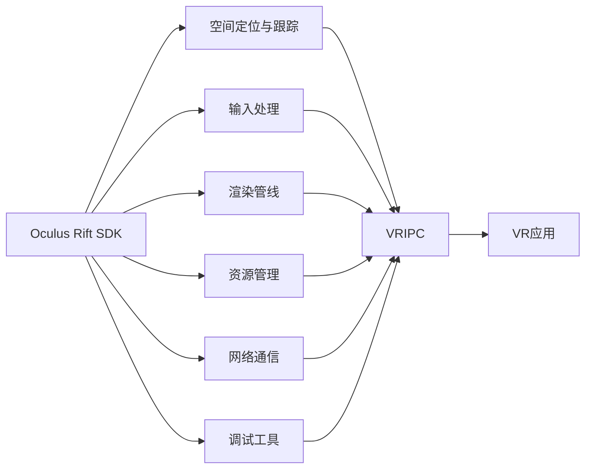

                 

# Oculus Rift SDK 集成：在 Rift 平台上开发 VR 应用

> 关键词：Oculus Rift, SDK, VR, 游戏开发, 模拟环境

## 1. 背景介绍

### 1.1 问题由来

虚拟现实(VR)技术的迅猛发展，带来了沉浸式体验的革命性提升。Facebook旗下Oculus Rift是市场上目前最流行的VR设备之一，凭借其先进的硬件和软件技术，为用户提供了近乎完美的沉浸体验。因此，在Rift平台上开发VR应用成为了许多开发者和游戏公司的首要任务。本文将详细阐述如何在Rift平台上集成SDK，实现高性能、沉浸式的VR应用开发。

### 1.2 问题核心关键点

Oculus Rift SDK是Rift平台的核心，集成了各种功能和工具，允许开发者在Rift上开发、调试和发布VR应用。通过SDK，开发者可以实现以下核心功能：

- **空间定位与跟踪**：通过SDK提供的光学定位和惯性测量技术，实现头显和手柄的空间定位与跟踪。
- **输入处理**：对用户的头部和手柄动作进行采集、处理和响应，实现交互式体验。
- **渲染管线**：提供高效、灵活的图形渲染管线，支持实时光效和纹理映射。
- **资源管理**：管理VR应用的资源加载与卸载，优化内存使用。
- **网络通信**：支持多人联网功能，实现不同用户间的实时互动。
- **调试工具**：集成调试工具，帮助开发者诊断和修复问题。

这些核心功能是Rift平台开发的基础，通过它们，开发者可以构建出高质量、交互性强的VR应用。

## 2. 核心概念与联系

### 2.1 核心概念概述

在Rift平台上开发VR应用，需要对以下核心概念有深入理解：

- **Oculus Rift SDK**：Rift平台提供的软件开发工具包，包括图形API、输入API、物理引擎、资源管理等功能。
- **OpenXR**：由Oculus主导的跨平台VR标准，用于统一VR硬件接口，支持多种设备。
- **GLSL**：Oculus Rift平台的图形编程语言，基于OpenGL ES。
- **Unity或Unreal Engine**：常用的VR游戏开发引擎，提供强大的可视化编程工具和资源库。
- **VRIPC**：用于渲染管线的物理引擎，实现实时光效和纹理映射。

这些概念构成了Rift平台开发的基础框架，开发者需要掌握它们，才能进行有效的VR应用开发。

### 2.2 核心概念原理和架构的 Mermaid 流程图(Mermaid 流程节点中不要有括号、逗号等特殊字符)



这个图展示了Rift平台的核心组件和它们之间的关联。

## 3. 核心算法原理 & 具体操作步骤
### 3.1 算法原理概述

在Rift平台上开发VR应用，涉及到多种算法和技术的综合应用。以下是对核心算法的概述：

- **空间定位与跟踪算法**：使用惯性测量单元(IMU)和摄像头获取用户的手柄和头显的位置和方向信息，结合物理引擎进行空间定位和跟踪。
- **输入处理算法**：对用户的手柄动作进行检测、识别和响应，实现交互式体验。
- **渲染管线算法**：根据用户和环境的变化，实时调整渲染管线，实现动态光照和纹理映射。
- **资源管理算法**：在应用运行过程中，高效加载和卸载资源，优化内存使用。
- **网络通信算法**：建立和维护多用户之间的网络连接，实现实时数据交换。
- **调试工具算法**：提供实时调试和性能监测功能，帮助开发者调试和优化应用。

### 3.2 算法步骤详解

以下是对上述算法步骤的详细介绍：

**Step 1: SDK安装与配置**

- 下载并安装Oculus Rift SDK。
- 配置SDK的开发环境，包括编译器、库文件和头文件。
- 创建虚拟现实项目，初始化SDK功能模块。

**Step 2: 创建VR应用**

- 使用Unity或Unreal Engine等游戏引擎创建VR应用。
- 设置应用的基本参数，如分辨率、渲染管线等。
- 连接Oculus Rift设备，初始化空间定位与跟踪功能。

**Step 3: 输入处理与交互**

- 设置输入API，获取用户的手柄和头显动作。
- 根据动作信息，更新场景和对象的位置和旋转。
- 实现交互式体验，如点击、拖拽、旋转等。

**Step 4: 渲染与优化**

- 设置渲染管线和纹理映射，实现实时光效。
- 对场景进行分块渲染，优化渲染性能。
- 实时采集性能数据，进行性能调优。

**Step 5: 网络与通信**

- 设置网络API，建立多用户连接。
- 实现数据同步和实时通信，确保不同用户间的数据一致性。

**Step 6: 调试与优化**

- 使用SDK提供的调试工具，诊断和修复问题。
- 实时监测性能指标，进行性能调优。

### 3.3 算法优缺点

使用Oculus Rift SDK进行VR应用开发，有以下优缺点：

**优点**

- **功能丰富**：SDK集成了多种功能，包括空间定位、输入处理、渲染管线、资源管理、网络通信等，满足各种需求。
- **开发高效**：使用游戏引擎进行开发，提高开发效率和可视化效果。
- **跨平台支持**：支持Windows、macOS、Linux等多个操作系统，方便在不同平台上部署。

**缺点**

- **学习曲线陡峭**：SDK功能复杂，需要一定的学习和调试经验。
- **硬件限制**：依赖Oculus Rift设备，不适用于其他VR设备。
- **性能瓶颈**：处理大规模场景和实时光效时，性能可能受限。

### 3.4 算法应用领域

Oculus Rift SDK广泛应用于以下领域：

- **游戏开发**：构建虚拟现实游戏，提供沉浸式游戏体验。
- **虚拟培训**：用于军事、航空、医疗等领域的专业训练。
- **教育应用**：开发虚拟教室，提供交互式学习体验。
- **模拟环境**：创建虚拟模拟环境，用于建筑、城市规划、产品设计等。

## 4. 数学模型和公式 & 详细讲解 & 举例说明（备注：数学公式请使用latex格式，latex嵌入文中独立段落使用 $$，段落内使用 $)
### 4.1 数学模型构建

在Rift平台上开发VR应用，涉及到大量的数学计算。以下是一个简单的数学模型构建示例：

假设用户在Rift中的位置为$(x, y, z)$，设备的传感器读数为$(ax, ay, az)$，则可以通过以下公式计算位置偏差：

$$
\Delta x = x - ax, \quad \Delta y = y - ay, \quad \Delta z = z - az
$$

其中$a$为传感器的加速度计常数。

### 4.2 公式推导过程

根据上述公式，我们可以推导出用户位置相对于设备的偏差向量为：

$$
\vec{\Delta r} = \begin{bmatrix}
\Delta x \\
\Delta y \\
\Delta z
\end{bmatrix} = \begin{bmatrix}
x - ax \\
y - ay \\
z - az
\end{bmatrix}
$$

通过对偏差向量进行处理，可以实现空间定位和跟踪。

### 4.3 案例分析与讲解

以Oculus Rift SDK的空间定位算法为例，解释其核心原理和应用场景。

假设用户在Rift中的位置为$(x, y, z)$，设备的传感器读数为$(ax, ay, az)$，则可以通过以下公式计算位置偏差：

$$
\Delta x = x - ax, \quad \Delta y = y - ay, \quad \Delta z = z - az
$$

其中$a$为传感器的加速度计常数。通过对偏差向量进行处理，可以实现空间定位和跟踪。

## 5. 项目实践：代码实例和详细解释说明
### 5.1 开发环境搭建

开发Rift平台VR应用，需要以下开发环境：

- **Oculus Rift SDK**：安装和配置SDK。
- **Unity或Unreal Engine**：创建VR应用。
- **Oculus Rift设备**：连接并初始化设备。
- **图形渲染硬件**：支持OpenGL ES的显卡。
- **开发工具**：如Visual Studio、Code等IDE。

### 5.2 源代码详细实现

以下是一个简单的Unity VR应用代码实现示例：

```csharp
using UnityEngine;
using UnityEngine.XR.Oculus;

public class VRApplication : MonoBehaviour
{
    private XRController controller;

    void Start()
    {
        controller = XRController.Instance;
        controller.SetHandsControllerMode(XRControllerHandMode.Unified);
        controller.SetHandControllerMode(XRControllerHandMode.Unified);
    }

    void Update()
    {
        // 获取手柄位置
        var handPosition = controller.GetHandPosition(XRControllerHandType.LeftHand, XRControllerControllerMode.Following);

        // 获取手柄旋转角度
        var handRotation = controller.GetHandRotation(XRControllerHandType.LeftHand, XRControllerControllerMode.Following);

        // 渲染场景
        RenderScene(handPosition, handRotation);
    }

    void RenderScene(Vector3 position, Quaternion rotation)
    {
        // 根据位置和旋转更新场景
        transform.position = position;
        transform.rotation = rotation;

        // 渲染场景对象
        Mesh mesh = MeshCache.GetMesh("Cube");
        Material material = MeshCache.GetMaterial("CubeMaterial");
        mesh.transform.position = position;
        mesh.transform.rotation = rotation;
        mesh.transform.localScale = new Vector3(1, 1, 1);
        material.color = Color.Red;
        Graphics.DrawMesh(mesh, camera.main, material);
    }
}
```

### 5.3 代码解读与分析

以上代码实现了一个简单的Unity VR应用，通过Oculus Rift SDK进行空间定位和跟踪。

**代码说明**

- **XRController类**：提供与Oculus Rift设备交互的功能。
- **Start方法**：初始化控制器并设置手柄模式。
- **Update方法**：在每一帧中更新手柄位置和旋转角度，并渲染场景。
- **RenderScene方法**：根据手柄位置和旋转更新场景对象，并渲染。

### 5.4 运行结果展示

在运行上述代码后，可以看到手柄的位置和旋转实时影响场景对象的位置和旋转。

## 6. 实际应用场景

### 6.1 智能训练系统

在军事、航空、医疗等领域，虚拟现实训练系统已经广泛应用于专业技能培训。通过Rift平台，可以构建高度逼真的训练环境，提供沉浸式的训练体验。例如，可以通过虚拟现实模拟战场环境，进行军事战术演练；或者通过虚拟现实模拟手术操作，提高医生的手术技能。

### 6.2 虚拟会议

虚拟现实技术可以用于远程会议和远程办公，提供沉浸式体验。通过Rift平台，可以在虚拟会议室中实时互动，进行远程会议、培训和研讨。例如，在虚拟会议上，可以通过手势控制演示材料，实现高效交流。

### 6.3 虚拟商店

在零售领域，虚拟现实技术可以用于创建虚拟商店，提供沉浸式购物体验。通过Rift平台，用户可以进入虚拟商店，体验虚拟试衣、虚拟导购、虚拟购物等服务。例如，可以通过虚拟试衣镜试穿衣服，了解效果。

### 6.4 未来应用展望

未来，VR技术将进一步普及，与AR、MR等技术融合，带来更丰富的应用场景。以下是对未来应用的展望：

- **虚拟办公**：通过虚拟现实技术，实现远程协作和会议，提高工作效率。
- **虚拟旅游**：创建虚拟旅游景区，提供沉浸式旅游体验。
- **虚拟赛事**：模拟体育赛事，提供观赛体验。
- **虚拟学习**：创建虚拟教室，提供互动式学习体验。

## 7. 工具和资源推荐
### 7.1 学习资源推荐

- **Oculus Rift官方文档**：详细介绍了Rift平台的SDK和开发环境配置。
- **Unity VR官方文档**：提供了在Unity中开发VR应用的详细教程和示例。
- **Unreal Engine VR官方文档**：提供了在Unreal Engine中开发VR应用的详细教程和示例。
- **VR开发论坛**：如Oculus Developer Forum，可以交流学习经验和解决问题。
- **VR开发者社区**：如VRChat，可以分享开发经验和学习资源。

### 7.2 开发工具推荐

- **Unity**：提供强大的可视化编程工具和资源库，支持VR应用开发。
- **Unreal Engine**：提供强大的引擎，支持高性能的VR应用开发。
- **Oculus Rift SDK**：提供SDK工具包，支持Rift平台开发。
- **Visual Studio**：提供强大的IDE，支持VR应用开发和调试。
- **Code**：提供灵活的代码编辑器，支持VR应用开发。

### 7.3 相关论文推荐

- **Oculus Rift技术白皮书**：详细介绍了Rift平台的硬件和软件技术。
- **Unity VR开发手册**：提供了在Unity中开发VR应用的详细教程和示例。
- **Unreal Engine VR开发手册**：提供了在Unreal Engine中开发VR应用的详细教程和示例。
- **VR开发技术综述**：综述了当前VR技术的发展现状和未来趋势。

## 8. 总结：未来发展趋势与挑战

### 8.1 研究成果总结

本文对Oculus Rift SDK进行了详细阐述，介绍了Rift平台的核心功能和技术。通过SDK，可以在Rift平台上开发高性能、沉浸式的VR应用，满足各种需求。

### 8.2 未来发展趋势

未来，VR技术将进一步普及，与AR、MR等技术融合，带来更丰富的应用场景。以下是未来发展的趋势：

- **多模态交互**：实现语音、手势、触觉等多模态交互，提高用户体验。
- **实时渲染**：实现实时光效和纹理映射，提供更逼真的视觉体验。
- **虚拟现实和增强现实融合**：实现VR和AR的融合，提供更丰富的应用场景。
- **大规模应用**：VR技术将广泛应用于游戏、教育、医疗等领域，带来更多应用场景。

### 8.3 面临的挑战

在Rift平台开发VR应用，仍面临以下挑战：

- **性能瓶颈**：处理大规模场景和实时光效时，性能可能受限。
- **硬件限制**：依赖Oculus Rift设备，不适用于其他VR设备。
- **用户接受度**：用户对VR设备的接受度和使用习惯尚未普及。
- **技术门槛**：VR开发技术门槛高，需要较高的技术储备和经验。

### 8.4 研究展望

未来的研究需要在以下几个方面寻求新的突破：

- **提升性能**：优化渲染管线，提升渲染性能和实时光效。
- **降低成本**：开发低成本的VR设备和硬件，提高用户接受度。
- **增强易用性**：简化VR应用的开发流程，降低技术门槛。
- **探索新场景**：拓展VR应用的场景和应用领域，提升用户粘性。

## 9. 附录：常见问题与解答

**Q1: Oculus Rift SDK需要什么硬件支持？**

A: Oculus Rift SDK需要支持OpenGL ES的显卡，Oculus Rift设备，以及Windows、macOS、Linux等多个操作系统。

**Q2: 如何安装Oculus Rift SDK？**

A: 从Oculus官网下载SDK安装文件，按照官方指导完成安装和配置。

**Q3: Unity和Unreal Engine如何选择？**

A: Unity和Unreal Engine都是强大的游戏引擎，可以根据项目需求和开发经验选择使用。

**Q4: VR应用开发有哪些挑战？**

A: 性能瓶颈、硬件限制、用户接受度和技术门槛都是VR应用开发面临的挑战。

**Q5: 未来VR技术发展趋势是什么？**

A: 多模态交互、实时渲染、VR和AR融合、大规模应用等将是未来VR技术的主要发展趋势。

作者：禅与计算机程序设计艺术 / Zen and the Art of Computer Programming

