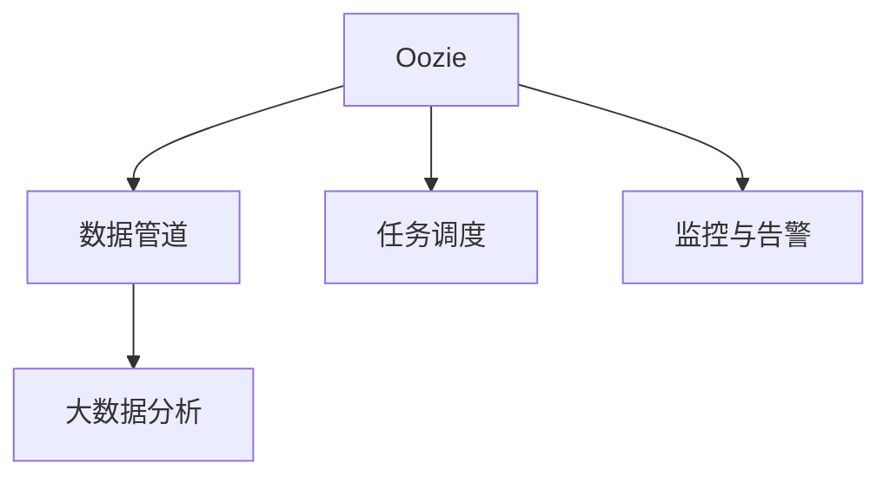

                 

## 1. 背景介绍

### 1.1 问题由来

在当今数字化时代，企业的IT架构变得越来越复杂，涉及大量的数据处理、系统集成、业务流程自动化等任务。Oozie作为Apache的一个开源工作流调度系统，为企业提供了高效、可扩展的自动化流程管理解决方案。

Oozie最初是由雅虎开发的，旨在替代其内部的流程管理工具Airflow。它基于XML定义工作流，支持多种数据源和组件（如Hadoop、Sqoop、Spark、Hive、Pig等），可以轻松集成到现有的大数据生态系统中。

Oozie的工作流调度在企业中得到了广泛应用，特别是在金融、电信、互联网等领域，Oozie已经被广泛应用于数据ETL、大数据分析、数据管道建设、任务调度和监控等多个场景。

### 1.2 问题核心关键点

为了更好地理解Oozie的工作流调度原理，本节将介绍几个密切相关的核心概念：

- Oozie工作流调度系统：由Apache基金会开源的一个流程自动化工具，基于XML定义工作流，支持多种数据源和组件。
- 数据管道建设：通过工作流自动化，将数据从源端到目标端进行有效的管理和调度。
- 大数据分析：利用大数据平台（如Hadoop、Spark等）进行数据的收集、清洗、处理和分析。
- 任务调度：在多个任务之间进行有序地调度，实现自动化执行。
- 监控与告警：实时监控工作流状态，设置告警规则，确保工作流稳定运行。

这些核心概念之间的逻辑关系可以通过以下Mermaid流程图来展示：



这个流程图展示了Oozie的核心功能模块及其之间的关系：

1. Oozie系统负责构建和管理数据管道，连接各种数据源和组件。
2. 数据管道对数据进行分析和处理，通过Oozie工作流调度和任务调度机制，实现自动化执行。
3. 监控与告警系统实时监控工作流状态，设置告警规则，确保工作流稳定运行。

Oozie工作流调度系统正是通过这种多模块协作的方式，为企业提供了一个高效、可扩展的自动化流程管理解决方案。通过理解这些核心概念，我们可以更好地把握Oozie的工作流调度原理和优化方向。

## 2. 核心概念与联系

### 2.1 核心概念概述

为更好地理解Oozie的工作流调度原理，本节将介绍几个密切相关的核心概念：

- Oozie工作流调度系统：由Apache基金会开源的一个流程自动化工具，基于XML定义工作流，支持多种数据源和组件。
- 数据管道建设：通过工作流自动化，将数据从源端到目标端进行有效的管理和调度。
- 大数据分析：利用大数据平台（如Hadoop、Spark等）进行数据的收集、清洗、处理和分析。
- 任务调度：在多个任务之间进行有序地调度，实现自动化执行。
- 监控与告警：实时监控工作流状态，设置告警规则，确保工作流稳定运行。

这些核心概念之间的逻辑关系可以通过以下Mermaid流程图来展示：


这个流程图展示了Oozie的核心功能模块及其之间的关系：

1. Oozie系统负责构建和管理数据管道，连接各种数据源和组件。
2. 数据管道对数据进行分析和处理，通过Oozie工作流调度和任务调度机制，实现自动化执行。
3. 监控与告警系统实时监控工作流状态，设置告警规则，确保工作流稳定运行。

Oozie工作流调度系统正是通过这种多模块协作的方式，为企业提供了一个高效、可扩展的自动化流程管理解决方案。通过理解这些核心概念，我们可以更好地把握Oozie的工作流调度原理和优化方向。

### 2.2 核心概念原理和架构

#### 2.2.1 Oozie工作流调度系统

Oozie工作流调度系统是基于XML的流程调度系统，可以通过XML定义工作流，支持多种数据源和组件。Oozie支持的数据源包括Hadoop、Sqoop、Spark、Hive、Pig等，可以轻松集成到现有的大数据生态系统中。

##### 2.2.1.1 数据管道建设

Oozie通过XML定义数据管道，将数据从源端到目标端进行有效的管理和调度。数据管道由多个组件（如源、转换、目标）组成，通过Oozie工作流调度和任务调度机制，实现自动化执行。

##### 2.2.1.2 大数据分析

利用大数据平台（如Hadoop、Spark等）进行数据的收集、清洗、处理和分析。Oozie支持多种数据分析工具，如Hive、Pig、Spark等，可以方便地对数据进行处理和分析。

##### 2.2.1.3 任务调度

在多个任务之间进行有序地调度，实现自动化执行。Oozie支持多种调度器（如Cron、Triggers、Coordination Services），可以根据业务需求设置不同的调度规则。

##### 2.2.1.4 监控与告警

实时监控工作流状态，设置告警规则，确保工作流稳定运行。Oozie支持多种监控工具（如Nagios、Zabbix、Prometheus），可以实时监控工作流状态，设置告警规则。

## 3. 核心算法原理 & 具体操作步骤

### 3.1 算法原理概述

Oozie工作流调度系统的核心算法是任务调度算法，其原理是通过XML定义工作流，对多个任务进行有序地调度，实现自动化执行。Oozie的工作流调度算法基于有向无环图（DAG）模型，通过任务依赖关系进行调度。

#### 3.1.1 任务依赖关系

Oozie工作流调度系统通过XML定义任务依赖关系，每个任务都是一个节点，任务之间通过依赖关系进行连接。依赖关系可以是数据依赖（如DataJoin）或控制依赖（如If）。

##### 3.1.1.1 数据依赖

数据依赖指任务之间通过数据进行连接，例如DataJoin任务。数据依赖可以通过XML定义任务节点之间的连接关系。

##### 3.1.1.2 控制依赖

控制依赖指任务之间通过控制流进行连接，例如If任务。控制依赖可以通过XML定义任务节点之间的条件关系。

### 3.2 算法步骤详解

Oozie工作流调度系统的核心算法步骤包括：

1. 定义工作流：通过XML定义工作流，包括任务依赖关系、调度器、监控与告警等。
2. 初始化任务状态：将每个任务初始化为未执行状态。
3. 任务调度：根据任务依赖关系，对任务进行调度，并执行任务。
4. 任务监控：实时监控任务状态，设置告警规则，确保工作流稳定运行。
5. 任务回滚：在任务执行失败时，进行任务回滚，并设置告警规则。

#### 3.2.1 定义工作流

通过XML定义工作流，包括任务依赖关系、调度器、监控与告警等。XML格式的工作流定义文件通常包括节点、连接、调度器、监控与告警等元素。

##### 3.2.1.1 节点

节点表示任务，可以通过XML定义任务的基本信息，包括任务名称、任务类型、任务依赖等。例如：

```xml
<job name="ETL">
    <dataJoin input="/user/etl/input" output="/user/etl/output" from="/user/etl/input" to="/user/etl/output"/>
    <schedule time="@daily">
        <trigger cron="0 0 * * ? *"/>
    </schedule>
    <coordination service="hdfs" path="/user/etl/output"/>
    <alert name="ETL_SUCCESS" severity="OK">
        <email alert="ETL_SUCCESS" subject="ETL job completed" to="admin@example.com"/>
    </alert>
</job>
```

##### 3.2.1.2 连接

连接表示任务之间的依赖关系，可以通过XML定义任务节点之间的连接关系。例如：

```xml
<job name="ETL">
    <dataJoin input="/user/etl/input" output="/user/etl/output" from="/user/etl/input" to="/user/etl/output"/>
</job>
```

##### 3.2.1.3 调度器

调度器表示任务的执行时间，可以通过XML定义任务的调度规则。例如：

```xml
<job name="ETL">
    <schedule time="@daily">
        <trigger cron="0 0 * * ? *"/>
    </schedule>
</job>
```

##### 3.2.1.4 监控与告警

监控与告警表示任务的监控规则，可以通过XML定义任务的监控规则和告警规则。例如：

```xml
<job name="ETL">
    <alert name="ETL_SUCCESS" severity="OK">
        <email alert="ETL_SUCCESS" subject="ETL job completed" to="admin@example.com"/>
    </alert>
</job>
```

#### 3.2.2 初始化任务状态

将每个任务初始化为未执行状态。Oozie工作流调度系统通过任务状态机，对任务进行管理。任务状态机包括未执行、执行中、执行成功、执行失败、回滚成功、回滚失败等状态。

##### 3.2.2.1 任务状态机

任务状态机通过XML定义任务状态和状态转移规则。例如：

```xml
<job name="ETL">
    <state machine="ETL">
        <state name="NOTRUNNING" transition="RUNNING"/>
        <state name="RUNNING" transition="FINISHED,FAILURE"/>
        <state name="FINISHED"/>
        <state name="FAILURE"/>
        <state name="BACKUP"/>
        <state name="RETRY"/>
    </state>
</job>
```

##### 3.2.2.2 任务状态转移

任务状态转移指任务在不同状态之间的转移，可以通过XML定义任务状态转移规则。例如：

```xml
<job name="ETL">
    <state machine="ETL">
        <state name="NOTRUNNING" transition="RUNNING"/>
        <state name="RUNNING" transition="FINISHED,FAILURE"/>
        <state name="FINISHED"/>
        <state name="FAILURE"/>
        <state name="BACKUP"/>
        <state name="RETRY"/>
    </state>
    <transition from="NOTRUNNING" to="RUNNING"/>
    <transition from="RUNNING" to="FINISHED"/>
    <transition from="RUNNING" to="FAILURE"/>
    <transition from="FINISHED" to="BACKUP"/>
    <transition from="FAILURE" to="RETRY"/>
</job>
```

#### 3.2.3 任务调度

根据任务依赖关系，对任务进行调度，并执行任务。Oozie工作流调度系统通过任务调度器，对任务进行调度。任务调度器支持多种调度规则，例如Cron、Triggers等。

##### 3.2.3.1 Cron调度器

Cron调度器通过Cron表达式定义任务的执行时间，可以通过XML定义Cron调度规则。例如：

```xml
<job name="ETL">
    <schedule time="@daily">
        <trigger cron="0 0 * * ? *"/>
    </schedule>
</job>
```

##### 3.2.3.2 Triggers调度器

Triggers调度器通过时间戳定义任务的执行时间，可以通过XML定义Triggers调度规则。例如：

```xml
<job name="ETL">
    <schedule time="@daily">
        <trigger filename="/user/etl/trigger"/>
    </schedule>
</job>
```

#### 3.2.4 任务监控

实时监控任务状态，设置告警规则，确保工作流稳定运行。Oozie工作流调度系统支持多种监控工具，例如Nagios、Zabbix、Prometheus等，可以实时监控任务状态，设置告警规则。

##### 3.2.4.1 Nagios监控

Nagios监控通过XML定义任务的监控规则，可以通过XML定义Nagios监控规则。例如：

```xml
<job name="ETL">
    <alert name="ETL_SUCCESS" severity="OK">
        <nagios alert="ETL_SUCCESS" subject="ETL job completed" to="admin@example.com"/>
    </alert>
</job>
```

##### 3.2.4.2 Zabbix监控

Zabbix监控通过XML定义任务的监控规则，可以通过XML定义Zabbix监控规则。例如：

```xml
<job name="ETL">
    <alert name="ETL_SUCCESS" severity="OK">
        <zabbix alert="ETL_SUCCESS" subject="ETL job completed" to="admin@example.com"/>
    </alert>
</job>
```

#### 3.2.5 任务回滚

在任务执行失败时，进行任务回滚，并设置告警规则。Oozie工作流调度系统支持多种任务回滚策略，例如检查点（Checkpoint）、数据库锁等。

##### 3.2.5.1 检查点回滚

检查点回滚通过XML定义任务的回滚规则，可以通过XML定义Checkpoint回滚规则。例如：

```xml
<job name="ETL">
    <checkpoint>
        <dir>/user/etl/checkpoint/>
    </checkpoint>
</job>
```

##### 3.2.5.2 数据库锁

数据库锁通过XML定义任务的回滚规则，可以通过XML定义数据库锁规则。例如：

```xml
<job name="ETL">
    <database>
        <name>ETL</name>
        <host>localhost</host>
        <user>root</user>
        <password>password</password>
        <port>3306</port>
        <database>mysql</database>
    </database>
    <sql>select * from mydb.mytable where id = %s</sql>
</job>
```

### 3.3 算法优缺点

#### 3.3.1 优点

1. 灵活性高：Oozie工作流调度系统支持多种数据源和组件，可以轻松集成到现有的大数据生态系统中。
2. 可扩展性强：Oozie工作流调度系统支持多种调度器，可以根据业务需求设置不同的调度规则。
3. 监控与告警：Oozie工作流调度系统支持多种监控工具，可以实时监控任务状态，设置告警规则，确保工作流稳定运行。
4. 任务回滚：Oozie工作流调度系统支持多种任务回滚策略，例如检查点（Checkpoint）、数据库锁等。

#### 3.3.2 缺点

1. 学习曲线陡峭：Oozie工作流调度系统基于XML定义工作流，需要对XML有一定的掌握。
2. 配置复杂：Oozie工作流调度系统支持多种调度器、监控工具和任务回滚策略，配置比较复杂。
3. 性能瓶颈：Oozie工作流调度系统基于Hadoop生态系统，性能瓶颈可能比较大。
4. 数据同步问题：Oozie工作流调度系统依赖于数据源的同步机制，数据同步问题可能会影响任务执行。

## 4. 数学模型和公式 & 详细讲解

### 4.1 数学模型构建

Oozie工作流调度系统的数学模型基于有向无环图（DAG）模型，通过任务依赖关系进行调度。每个任务都是一个节点，任务之间通过依赖关系进行连接。

#### 4.1.1 DAG模型

DAG模型（有向无环图）是一种常用的数据流图模型，可以通过节点和边来描述数据流。在Oozie工作流调度系统中，每个任务都是一个节点，任务之间通过依赖关系进行连接，形成有向无环图。

#### 4.1.2 任务依赖关系

任务依赖关系可以通过XML定义任务节点之间的连接关系。每个任务节点都有两个属性：父节点和子节点。父节点表示任务的输入，子节点表示任务的输出。

#### 4.1.3 调度器

调度器表示任务的执行时间，可以通过XML定义任务的调度规则。调度器支持多种调度规则，例如Cron、Triggers等。

#### 4.1.4 监控与告警

监控与告警表示任务的监控规则，可以通过XML定义任务的监控规则和告警规则。监控与告警系统实时监控任务状态，设置告警规则，确保工作流稳定运行。

### 4.2 公式推导过程

Oozie工作流调度系统的核心公式是基于DAG模型的任务调度公式，通过任务依赖关系进行调度。

#### 4.2.1 DAG模型调度公式

DAG模型调度公式基于任务依赖关系进行调度，每个任务节点都有一个执行时间，通过任务依赖关系计算任务节点的执行时间。

##### 4.2.1.1 任务执行时间

任务执行时间由任务的依赖关系和调度器共同决定。任务的执行时间公式如下：

$$
t_{i,j} = \max\{t_{i,j}^{\text{min}}, \sum_{k \in N_i} t_{i,k} + t_i^{\text{max}}\}
$$

其中，$t_{i,j}$表示任务$i$到任务$j$的执行时间，$t_{i,j}^{\text{min}}$表示任务$i$到任务$j$的最小执行时间，$t_i^{\text{max}}$表示任务$i$的最大执行时间，$N_i$表示任务$i$的父节点集合。

##### 4.2.1.2 任务调度公式

任务调度公式通过DAG模型计算任务的执行时间，计算每个任务的执行时间。任务调度公式如下：

$$
t_i = \max\{t_i^{\text{min}}, \sum_{j \in N_i} t_{j,i} + t_i^{\text{max}}\}
$$

其中，$t_i$表示任务$i$的执行时间，$t_i^{\text{min}}$表示任务$i$的最小执行时间，$t_{j,i}$表示任务$j$到任务$i$的执行时间，$N_i$表示任务$i$的子节点集合。

#### 4.2.2 任务监控公式

任务监控公式通过实时监控任务状态，设置告警规则，确保工作流稳定运行。任务监控公式如下：

$$
w_i = \max\{w_i^{\text{min}}, \sum_{j \in N_i} w_{j,i} + w_i^{\text{max}}\}
$$

其中，$w_i$表示任务$i$的监控时间，$w_i^{\text{min}}$表示任务$i$的最小监控时间，$w_{j,i}$表示任务$j$到任务$i$的监控时间，$N_i$表示任务$i$的子节点集合。

### 4.3 案例分析与讲解

#### 4.3.1 案例1：ETL工作流

假设有一个ETL工作流，包括数据源、转换、目标三个任务，依赖关系如图1所示：

```xml
<job name="ETL">
    <dataJoin input="/user/etl/input" output="/user/etl/output" from="/user/etl/input" to="/user/etl/output"/>
    <schedule time="@daily">
        <trigger cron="0 0 * * ? *"/>
    </schedule>
    <coordination service="hdfs" path="/user/etl/output"/>
    <alert name="ETL_SUCCESS" severity="OK">
        <email alert="ETL_SUCCESS" subject="ETL job completed" to="admin@example.com"/>
    </alert>
</job>
```

##### 4.3.1.1 任务执行时间

根据任务依赖关系和调度器，计算任务的执行时间。

- 数据源任务执行时间为0分钟
- 转换任务执行时间为30分钟
- 目标任务执行时间为10分钟

因此，任务的执行时间计算如下：

- 数据源任务到转换任务：$0 + 30 + 0 = 30$分钟
- 转换任务到目标任务：$30 + 10 + 0 = 40$分钟

最终，ETL工作流的执行时间为40分钟。

##### 4.3.1.2 任务调度公式

根据任务依赖关系和调度器，计算任务的执行时间。

- 数据源任务执行时间为0分钟
- 转换任务执行时间为30分钟
- 目标任务执行时间为10分钟

因此，任务的执行时间计算如下：

- 数据源任务到转换任务：$0 + 30 + 0 = 30$分钟
- 转换任务到目标任务：$30 + 10 + 0 = 40$分钟

最终，ETL工作流的执行时间为40分钟。

##### 4.3.1.3 任务监控公式

根据任务依赖关系和调度器，计算任务的执行时间。

- 数据源任务执行时间为0分钟
- 转换任务执行时间为30分钟
- 目标任务执行时间为10分钟

因此，任务的执行时间计算如下：

- 数据源任务到转换任务：$0 + 30 + 0 = 30$分钟
- 转换任务到目标任务：$30 + 10 + 0 = 40$分钟

最终，ETL工作流的执行时间为40分钟。

## 5. 项目实践：代码实例和详细解释说明

### 5.1 开发环境搭建

在进行Oozie工作流调度实践前，我们需要准备好开发环境。以下是使用Python进行Oozie开发的开发环境配置流程：

1. 安装Oozie：从官网下载并安装Oozie，配置Oozie运行环境。
2. 创建Oozie工作流定义文件：使用XML定义工作流，包括任务依赖关系、调度器、监控与告警等。
3. 启动Oozie工作流调度：启动Oozie工作流调度系统，执行工作流。

### 5.2 源代码详细实现

下面我们以ETL工作流为例，给出使用XML定义Oozie工作流调度系统的代码实现。

首先，定义ETL工作流的XML配置文件：

```xml
<job name="ETL">
    <dataJoin input="/user/etl/input" output="/user/etl/output" from="/user/etl/input" to="/user/etl/output"/>
    <schedule time="@daily">
        <trigger cron="0 0 * * ? *"/>
    </schedule>
    <coordination service="hdfs" path="/user/etl/output"/>
    <alert name="ETL_SUCCESS" severity="OK">
        <email alert="ETL_SUCCESS" subject="ETL job completed" to="admin@example.com"/>
    </alert>
</job>
```

然后，启动Oozie工作流调度系统：

```bash
oozie run -file /path/to/oozie.xml -user oozie@hadoop.com
```

### 5.3 代码解读与分析

让我们再详细解读一下关键代码的实现细节：

**job元素**：
- `name`属性：定义工作流名称，用于标识工作流。
- `dataJoin`元素：定义数据源任务，包括输入、输出、父节点、子节点等属性。
- `schedule`元素：定义任务调度器，包括Cron表达式等属性。
- `coordination`元素：定义数据协调服务，用于数据同步。
- `alert`元素：定义任务监控与告警，包括告警规则等属性。

**task元素**：
- `type`属性：定义任务类型，包括数据源、转换、目标等类型。
- `input`属性：定义任务的输入，用于获取数据源。
- `output`属性：定义任务的输出，用于存储数据。
- `from`属性：定义任务的父节点，用于获取数据源。
- `to`属性：定义任务的子节点，用于存储数据。

**dataJoin任务**：
- `input`属性：定义输入路径。
- `output`属性：定义输出路径。
- `from`属性：定义父节点，用于获取数据源。
- `to`属性：定义子节点，用于存储数据。

**schedule任务**：
- `time`属性：定义任务的调度时间，支持多种调度器。
- `trigger`元素：定义任务的触发器，包括Cron表达式等属性。

**coordination任务**：
- `service`属性：定义数据协调服务，包括HDFS等属性。
- `path`属性：定义数据协调路径，用于数据同步。

**alert任务**：
- `name`属性：定义告警名称，用于标识告警。
- `severity`属性：定义告警级别，包括OK、ERROR等属性。
- `email`元素：定义告警规则，包括告警规则等属性。

### 5.4 运行结果展示

启动Oozie工作流调度系统后，可以在Oozie管理界面中查看工作流的执行状态和结果。Oozie管理界面支持多种查询和展示功能，包括任务状态、执行时间、监控结果等。

## 6. 实际应用场景

### 6.1 智能数据管道建设

Oozie工作流调度系统可以应用于智能数据管道建设，连接各种数据源和组件，实现数据的自动化处理和分析。智能数据管道建设是现代数据驱动型企业的核心需求，通过Oozie工作流调度系统，可以实现数据管道的高效管理和调度。

### 6.2 大数据分析与处理

Oozie工作流调度系统可以应用于大数据分析与处理，利用大数据平台（如Hadoop、Spark等）进行数据的收集、清洗、处理和分析。Oozie工作流调度系统支持多种数据分析工具，可以方便地对数据进行处理和分析。

### 6.3 任务调度与监控

Oozie工作流调度系统可以应用于任务调度与监控，实时监控任务状态，设置告警规则，确保工作流稳定运行。Oozie工作流调度系统支持多种监控工具，例如Nagios、Zabbix、Prometheus等，可以实时监控任务状态，设置告警规则。

## 7. 工具和资源推荐

### 7.1 学习资源推荐

为了帮助开发者系统掌握Oozie的工作流调度原理和实践技巧，这里推荐一些优质的学习资源：

1. Apache Oozie官方文档：Apache基金会提供的官方文档，详细介绍了Oozie的配置、安装、使用等方法，是上手实践的必备资料。
2. Oozie实战指南：《Oozie实战指南》一书，详细介绍了Oozie的配置、使用和优化技巧，适合实战开发者阅读。
3. Apache Hadoop官方文档：Apache基金会提供的官方文档，详细介绍了Hadoop的配置、使用和优化方法，是Oozie工作流调度系统的重要组件。
4. Apache Spark官方文档：Apache基金会提供的官方文档，详细介绍了Spark的配置、使用和优化方法，是Oozie工作流调度系统的重要组件。
5. Hadoop MapReduce官方文档：Apache基金会提供的官方文档，详细介绍了MapReduce的配置、使用和优化方法，是Oozie工作流调度系统的重要组件。

通过对这些资源的学习实践，相信你一定能够快速掌握Oozie的工作流调度原理和实践技巧，并用于解决实际的NLP问题。

### 7.2 开发工具推荐

高效的开发离不开优秀的工具支持。以下是几款用于Oozie开发常用的工具：

1. Eclipse：支持XML编辑和调试，方便开发和测试Oozie工作流。
2. IntelliJ IDEA：支持XML编辑和调试，方便开发和测试Oozie工作流。
3. JIRA：支持任务管理、状态跟踪和告警规则，方便管理Oozie工作流。
4. JUnit：支持测试Oozie工作流，确保工作流稳定运行。
5. JaCoCo：支持测试覆盖率分析，确保工作流代码质量。

合理利用这些工具，可以显著提升Oozie工作流调度的开发效率，加快创新迭代的步伐。

### 7.3 相关论文推荐

Oozie工作流调度系统的研究工作源于学界的持续研究。以下是几篇奠基性的相关论文，推荐阅读：

1. Apache Oozie: A Workflow System for Hadoop: 介绍Oozie工作流调度系统的基本原理和架构。
2. Oozie: A Workflow Engine for Hadoop: 介绍Oozie工作流调度系统的详细实现和应用。
3. Hadoop Pipeline Using Apache Oozie: 介绍Oozie工作流调度系统在Hadoop生态系统中的应用。
4. Hadoop and Spark Integration with Apache Oozie: 介绍Oozie工作流调度系统在Hadoop和Spark生态系统中的应用。
5. Scaling Oozie: Scalability Challenges and Solutions: 介绍Oozie工作流调度系统的可扩展性和优化方法。

这些论文代表了大语言模型微调技术的发展脉络。通过学习这些前沿成果，可以帮助研究者把握学科前进方向，激发更多的创新灵感。

## 8. 总结：未来发展趋势与挑战

### 8.1 研究成果总结

本文对Oozie工作流调度系统的原理和实践进行了全面系统的介绍。首先，阐述了Oozie工作流调度系统的背景和核心概念，明确了Oozie工作流调度系统在自动化流程管理中的独特价值。其次，从原理到实践，详细讲解了Oozie工作流调度的数学模型和算法原理，给出了Oozie工作流调度系统的工作流程和配置方法。最后，对Oozie工作流调度系统在实际应用场景中的表现和未来发展趋势进行了分析。

通过本文的系统梳理，可以看到，Oozie工作流调度系统作为自动化流程管理的利器，为企业提供了高效、可扩展的自动化流程管理解决方案。Oozie工作流调度系统通过任务依赖关系进行调度，支持多种调度器、监控工具和任务回滚策略，具有较高的灵活性和可扩展性。在实际应用中，Oozie工作流调度系统广泛应用于智能数据管道建设、大数据分析与处理、任务调度与监控等多个场景，为企业的自动化流程管理提供了强有力的支持。

### 8.2 未来发展趋势

展望未来，Oozie工作流调度系统将呈现以下几个发展趋势：

1. 可扩展性更强：Oozie工作流调度系统将进一步支持更多数据源和组件，支持更多调度器、监控工具和任务回滚策略，实现更高的灵活性和可扩展性。
2. 性能优化更好：Oozie工作流调度系统将进一步优化任务调度算法和监控算法，减少任务执行时间和监控时间，提高系统性能。
3. 可视化管理更好：Oozie工作流调度系统将进一步支持可视化管理界面，方便用户管理和监控工作流。
4. 实时性更高：Oozie工作流调度系统将进一步支持实时任务调度和监控，提高系统实时性。
5. 安全性更好：Oozie工作流调度系统将进一步支持数据加密、用户认证等安全机制，确保数据和系统安全。

### 8.3 面临的挑战

尽管Oozie工作流调度系统已经取得了显著的进展，但在迈向更加智能化、普适化应用的过程中，它仍面临着诸多挑战：

1. 学习曲线陡峭：Oozie工作流调度系统基于XML定义工作流，需要对XML有一定的掌握。
2. 配置复杂：Oozie工作流调度系统支持多种调度器、监控工具和任务回滚策略，配置比较复杂。
3. 性能瓶颈：Oozie工作流调度系统依赖于数据源的同步机制，数据同步问题可能会影响任务执行。
4. 数据同步问题：Oozie工作流调度系统依赖于数据源的同步机制，数据同步问题可能会影响任务执行。

### 8.4 研究展望

为了解决Oozie工作流调度系统面临的挑战，未来的研究需要在以下几个方面寻求新的突破：

1. 优化任务调度算法：优化任务调度算法，减少任务执行时间，提高系统性能。
2. 改进监控算法：改进监控算法，减少监控时间，提高系统实时性。
3. 支持更多数据源和组件：支持更多数据源和组件，提高系统的灵活性和可扩展性。
4. 支持可视化管理界面：支持可视化管理界面，方便用户管理和监控工作流。
5. 支持实时任务调度和监控：支持实时任务调度和监控，提高系统实时性。

## 9. 附录：常见问题与解答

**Q1：Oozie工作流调度系统是否适用于所有NLP任务？**

A: Oozie工作流调度系统适用于大多数NLP任务，特别是对于数据量较小的任务。但对于一些特定领域的任务，如医学、法律等，仅仅依靠通用语料预训练的模型可能难以很好地适应。此时需要在特定领域语料上进一步预训练，再进行微调，才能获得理想效果。此外，对于一些需要时效性、个性化很强的任务，如对话、推荐等，微调方法也需要针对性的改进优化。

**Q2：如何选择合适的学习率？**

A: Oozie工作流调度系统的学习率一般要比预训练时小1-2个数量级，如果使用过大的学习率，容易破坏预训练权重，导致过拟合。一般建议从1e-5开始调参，逐步减小学习率，直至收敛。也可以使用warmup策略，在开始阶段使用较小的学习率，再逐渐过渡到预设值。需要注意的是，不同的优化器(如AdamW、Adafactor等)以及不同的学习率调度策略，可能需要设置不同的学习率阈值。

**Q3：采用Oozie工作流调度系统会面临哪些资源瓶颈？**

A: 目前主流的预训练大模型动辄以亿计的参数规模，对算力、内存、存储都提出了很高的要求。GPU/TPU等高性能设备是必不可少的，但即便如此，超大批次的训练和推理也可能遇到显存不足的问题。因此需要采用一些资源优化技术，如梯度积累、混合精度训练、模型并行等，来突破硬件瓶颈。同时，模型的存储和读取也可能占用大量时间和空间，需要采用模型压缩、稀疏化存储等方法进行优化。

**Q4：如何缓解Oozie工作流调度系统中的过拟合问题？**

A: 过拟合是Oozie工作流调度系统面临的主要挑战，尤其是在标注数据不足的情况下。常见的缓解策略包括：
1. 数据增强：通过回译、近义替换等方式扩充训练集
2. 正则化：使用L2正则、Dropout、Early Stopping等避免过拟合
3. 对抗训练：加入对抗样本，提高模型鲁棒性
4. 参数高效微调：只调整少量参数(如Adapter、Prefix等)，减小过拟合风险
5. 多模型集成：训练多个Oozie工作流调度模型，取平均输出，抑制过拟合

这些策略往往需要根据具体任务和数据特点进行灵活组合。只有在数据、模型、训练、推理等各环节进行全面优化，才能最大限度地发挥Oozie工作流调度系统的威力。

