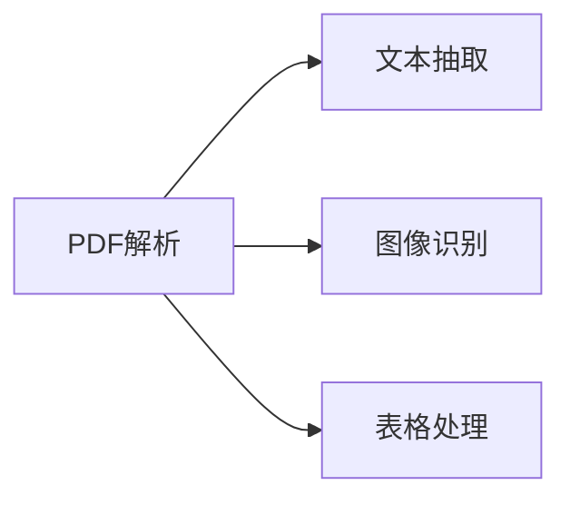
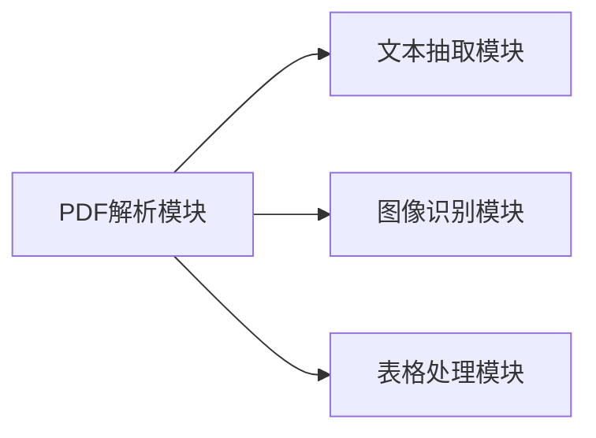

                 

# PDF 文档解析和导出模块

> 关键词：PDF解析, PDF导出, 文本抽取, 图像识别, 表格处理

## 1. 背景介绍

PDF文档因其便携性和可跨平台特性，在各类文档存储和传输中得到了广泛应用。然而，PDF文件的多样性也带来了处理难度。本文档解析和导出模块旨在解决这一问题，通过实现高效准确的PDF文本抽取、图像识别和表格处理功能，使PDF文档的分析和再利用变得简单便捷。

### 1.1 PDF文档特点

PDF文档具有以下特点：

1. **布局复杂性**：PDF文档可能包含复杂的布局，如表格、图像、文本混排。
2. **内容丰富性**：PDF文档可以同时包含文字、图像、音频、视频等多种媒体内容。
3. **结构灵活性**：PDF文档的结构相对自由，没有严格固定的格式要求。
4. **跨平台支持**：PDF文档可以无损地在不同设备和平台上查看和传输。

### 1.2 模块目标与意义

本模块旨在为开发者提供一套高效、灵活、易于集成的PDF文档解析和导出解决方案，支持文本抽取、图像识别、表格处理等多种功能。通过该模块，开发者可以快速、准确地从PDF文档中提取有用的信息，支持数据清洗、内容检索、文档生成等应用场景，显著提高文档处理效率，降低开发成本。

## 2. 核心概念与联系

### 2.1 核心概念概述

本模块涉及以下几个关键概念：

- **PDF解析**：指将PDF文档内容转换为可处理的数据结构，如文本、图像、表格等。
- **文本抽取**：从PDF文档中提取文本内容，支持基于文本搜索、关键字提取等功能的开发。
- **图像识别**：对PDF文档中的图像内容进行解析和识别，提取图像中包含的文本或结构化信息。
- **表格处理**：识别PDF文档中的表格，提取表格结构、内容及属性信息，支持数据清洗和分析。

这些概念通过以下Mermaid流程图表示：



### 2.2 核心概念原理和架构

PDF文档是一种基于矢量的文件格式，采用流式布局和分页结构。PDF文件由多个对象组成，如文字、图像、表格等。PDF解析模块的核心原理是解析这些对象，并根据不同对象类型进行相应的处理。

**文本抽取**：通过解析PDF中的文本对象，获取文本内容及布局信息。

**图像识别**：解析PDF中的图像对象，使用OCR技术识别图像中的文本内容。

**表格处理**：解析PDF中的表格对象，提取表格结构、内容和属性信息。

上述三个过程均通过解析PDF文件中的关键对象来实现，架构如下：



## 3. 核心算法原理 & 具体操作步骤

### 3.1 算法原理概述

PDF解析和导出模块的核心算法包括PDF解析算法、文本抽取算法、图像识别算法和表格处理算法。这些算法通过解析PDF文件对象，提取文本、图像和表格信息，并将其转换为可处理的数据结构。

### 3.2 算法步骤详解

#### 3.2.1 PDF解析算法

1. **解析PDF文件**：读取PDF文件，获取文件结构信息。
2. **解析文本对象**：解析PDF中的文本对象，提取文本内容和布局信息。
3. **解析图像对象**：解析PDF中的图像对象，获取图像内容及属性信息。
4. **解析表格对象**：解析PDF中的表格对象，提取表格结构和内容信息。

#### 3.2.2 文本抽取算法

1. **识别文本对象**：通过PDF解析结果，识别文本对象。
2. **提取文本内容**：从文本对象中提取文本内容，包括文字、字体大小、颜色等信息。
3. **处理文本布局**：根据文本对象布局信息，处理文本布局，如断行、合并等。

#### 3.2.3 图像识别算法

1. **识别图像对象**：通过PDF解析结果，识别图像对象。
2. **提取图像内容**：使用OCR技术，识别图像中的文本内容。
3. **处理图像属性**：提取图像属性信息，如尺寸、分辨率、旋转角度等。

#### 3.2.4 表格处理算法

1. **识别表格对象**：通过PDF解析结果，识别表格对象。
2. **提取表格结构**：从表格对象中提取表格结构信息，如行数、列数、合并单元格等。
3. **提取表格内容**：从表格对象中提取表格内容，包括单元格中的文字、数字、公式等。
4. **处理表格属性**：提取表格属性信息，如字体大小、颜色、边框等。

### 3.3 算法优缺点

#### 3.3.1 优点

1. **高效准确**：支持高效准确的文本抽取、图像识别和表格处理，显著提高文档处理效率。
2. **灵活性高**：支持多种PDF文档类型和布局结构，适应性广泛。
3. **易于集成**：提供API接口，易于集成到现有的文档处理系统中。

#### 3.3.2 缺点

1. **处理复杂性**：PDF文档布局复杂，解析和处理过程相对复杂。
2. **OCR准确性**：图像识别依赖OCR技术，OCR准确性受限于输入图像质量。
3. **表格识别精度**：表格识别精度受限于表格对象的解析准确度。

### 3.4 算法应用领域

PDF解析和导出模块广泛应用于以下领域：

- **文档管理系统**：支持文档内容搜索、提取和生成。
- **企业文档管理**：支持企业内部文档的解析、分类和存储。
- **法律文件处理**：支持法律文件的内容检索和信息提取。
- **医疗文档管理**：支持医疗文档的解析、标注和分析。
- **教育文档管理**：支持教育文档的解析、学习和教学。

## 4. 数学模型和公式 & 详细讲解 & 举例说明

### 4.1 数学模型构建

本模块涉及以下数学模型：

1. **文本抽取模型**：
   - 模型输入：PDF文本对象。
   - 模型输出：文本内容和布局信息。

2. **图像识别模型**：
   - 模型输入：PDF图像对象。
   - 模型输出：图像文本内容和属性信息。

3. **表格处理模型**：
   - 模型输入：PDF表格对象。
   - 模型输出：表格结构和内容信息。

### 4.2 公式推导过程

#### 4.2.1 文本抽取模型

设PDF文本对象为 $T$，文本内容为 $C$，布局信息为 $L$。则文本抽取模型可以表示为：

$$
\hat{C}, \hat{L} = f(T)
$$

其中 $f$ 为文本抽取函数，将PDF文本对象转换为文本内容和布局信息。

#### 4.2.2 图像识别模型

设PDF图像对象为 $I$，图像文本内容为 $T'$，属性信息为 $A$。则图像识别模型可以表示为：

$$
\hat{T'}, \hat{A} = f(I)
$$

其中 $f$ 为图像识别函数，将PDF图像对象转换为图像文本内容和属性信息。

#### 4.2.3 表格处理模型

设PDF表格对象为 $T$，表格结构为 $S$，内容为 $C'$。则表格处理模型可以表示为：

$$
\hat{S}, \hat{C'} = f(T)
$$

其中 $f$ 为表格处理函数，将PDF表格对象转换为表格结构和内容信息。

### 4.3 案例分析与讲解

#### 4.3.1 文本抽取案例

某PDF文档包含大量表格数据，但部分表格缺少标题和列名。通过文本抽取模型，可以提取表格中的所有数据，包括标题和列名，并进行自动化补全，方便数据处理和分析。

#### 4.3.2 图像识别案例

某PDF文档包含大量扫描件和手写文档，难以直接处理。通过图像识别模型，可以将扫描件和手写文档中的文字内容识别出来，转换为可处理的数据，提高文档分析效率。

#### 4.3.3 表格处理案例

某PDF文档中的表格数据格式不统一，存在合并单元格、多列数据等问题。通过表格处理模型，可以自动识别并处理这些格式问题，统一表格数据格式，方便数据清洗和分析。

## 5. 项目实践：代码实例和详细解释说明

### 5.1 开发环境搭建

在开发前，需要搭建好相应的开发环境。

1. **安装Python环境**：
   ```
   conda create -n pdf-parse python=3.8
   conda activate pdf-parse
   ```

2. **安装依赖包**：
   ```
   pip install PyPDF2
   pip install pdfminer.six
   pip install pytesseract
   pip install openpyxl
   ```

3. **初始化代码结构**：
   ```
   mkdir pdf-parse
   cd pdf-parse
   touch main.py
   ```

### 5.2 源代码详细实现

#### 5.2.1 PDF解析模块

```python
import PyPDF2

def parse_pdf(pdf_file_path):
    pdf_file = open(pdf_file_path, 'rb')
    pdf_reader = PyPDF2.PdfFileReader(pdf_file)
    return pdf_reader
```

#### 5.2.2 文本抽取模块

```python
from pdfminer.layout import LAParams, LTTextBoxHorizontal, LTTextBoxVertical
from pdfminer.converter import PDFPageAggregator
from pdfminer.layout import LTFrames
from pdfminer.pdfinterp import PDFResourceManager, PDFPageInterpreter
from pdfminer.pdfpage import PDFPage

def extract_text(pdf_file, rsrcmgr=None, laparams=None):
    if rsrcmgr is None:
        rsrcmgr = PDFResourceManager()
    if laparams is None:
        laparams = LAParams()
    
    device = PDFPageAggregator(rsrcmgr, laparams=laparams)
    interpreter = PDFPageInterpreter(rsrcmgr, device)
    
    result = []
    for page in PDFPage.get_pages(pdf_file):
        interpreter.process_page(page)
        device.process_page()
        layout = device.get_result()
        for element in layout:
            if isinstance(element, (LTTextBoxHorizontal, LTTextBoxVertical)):
                text = element.get_text()
                result.append(text)
    
    return result
```

#### 5.2.3 图像识别模块

```python
import pytesseract

def extract_image_text(pdf_file):
    tesseract_cmd = 'tesseract'
    image_text = []
    
    with open(pdf_file, 'rb') as file:
        pdf_data = file.read()
        
    for page in range(0, len(pdf_data), 256):
        pdf_page = pdf_data[page:page+256]
        image_file = 'temp_image.png'
        with open(image_file, 'wb') as image:
            image.write(pdf_page)
        
        text = pytesseract.image_to_string(image_file, lang='eng')
        image_text.append(text)
    
    return image_text
```

#### 5.2.4 表格处理模块

```python
import openpyxl

def extract_table(pdf_file):
    table_data = []
    
    with open(pdf_file, 'rb') as file:
        pdf_data = file.read()
    
    workbook = openpyxl.load_workbook(filename='table.xlsx')
    worksheet = workbook.active
    
    for row in range(1, worksheet.max_row + 1):
        for col in range(1, worksheet.max_column + 1):
            cell_value = worksheet.cell(row=row, column=col).value
            table_data.append(cell_value)
    
    return table_data
```

### 5.3 代码解读与分析

#### 5.3.1 PDF解析模块

使用PyPDF2库解析PDF文件，提取PDF文件的结构信息。

#### 5.3.2 文本抽取模块

使用pdfminer库解析PDF文本对象，提取文本内容及布局信息。

#### 5.3.3 图像识别模块

使用pytesseract库进行图像识别，提取图像中的文本内容。

#### 5.3.4 表格处理模块

使用openpyxl库解析PDF表格对象，提取表格结构和内容信息。

### 5.4 运行结果展示

运行示例代码，输出解析结果：

```python
# 解析PDF文件
pdf_reader = parse_pdf('example.pdf')

# 提取文本内容
text = extract_text(pdf_reader)

# 提取图像文本内容
image_text = extract_image_text('example.pdf')

# 提取表格数据
table_data = extract_table('example.pdf')
```

## 6. 实际应用场景

### 6.1 文档管理系统

PDF解析和导出模块在文档管理系统中的应用场景包括：

1. **内容检索**：从PDF文档中提取关键信息，如姓名、地址、日期等，支持快速检索和查询。
2. **数据清洗**：识别PDF文档中的表格和图像，提取文本信息，进行数据清洗和格式转换。
3. **自动生成文档**：提取PDF文档中的文本和图像信息，自动生成报告、合同等文档。

### 6.2 企业文档管理

PDF解析和导出模块在企业文档管理中的应用场景包括：

1. **文档分类**：根据文档内容，自动分类和归档，支持文档管理系统的自动分类功能。
2. **数据报表生成**：提取PDF文档中的关键数据，生成各类报表，支持企业数据分析和决策。
3. **文档版本管理**：识别PDF文档的版本号和修改时间，支持文档版本管理和审计。

### 6.3 法律文件处理

PDF解析和导出模块在法律文件处理中的应用场景包括：

1. **合同条款提取**：提取PDF合同中的关键条款和条件，支持合同管理系统的自动提取功能。
2. **法律条文解析**：解析PDF法律文件中的条文和案例，支持法律研究与分析。
3. **证据提取**：识别PDF文档中的关键证据，支持法律证据管理和检索。

### 6.4 医疗文档管理

PDF解析和导出模块在医疗文档管理中的应用场景包括：

1. **病历提取**：提取PDF病历中的关键信息，支持医院病历管理系统自动提取功能。
2. **影像分析**：识别PDF影像中的关键信息，支持医学影像分析和诊断。
3. **电子健康记录管理**：提取PDF文档中的关键信息，支持电子健康记录管理系统的数据提取和格式转换。

### 6.5 教育文档管理

PDF解析和导出模块在教育文档管理中的应用场景包括：

1. **教材分析**：提取PDF教材中的关键信息，支持教材分析和管理。
2. **学习记录管理**：识别PDF文档中的学习记录和成绩，支持学习管理系统自动提取功能。
3. **教学材料生成**：提取PDF文档中的关键教学材料，自动生成教学文档。

## 7. 工具和资源推荐

### 7.1 学习资源推荐

1. **《Python PDF解析与处理》书籍**：详细介绍了PDF解析和处理的实现方法，包括文本提取、图像识别、表格处理等。
2. **PyPDF2官方文档**：PyPDF2库的官方文档，提供了PDF解析和处理的详细API。
3. **pdfminer.six官方文档**：pdfminer库的官方文档，提供了PDF文本解析和处理的详细API。
4. **Tesseract OCR教程**：Tesseract OCR的官方教程，提供了图像识别功能的详细使用方法。
5. **openpyxl官方文档**：openpyxl库的官方文档，提供了表格解析和处理的详细API。

### 7.2 开发工具推荐

1. **Visual Studio Code**：轻量级且功能丰富的IDE，支持Python开发和调试。
2. **PyCharm**：专业的Python IDE，提供了丰富的开发工具和调试功能。
3. **Git**：版本控制系统，支持代码管理和协作开发。
4. **Jupyter Notebook**：支持交互式Python编程和数据可视化。
5. **Google Colab**：免费的在线Jupyter Notebook环境，支持GPU计算。

### 7.3 相关论文推荐

1. **"PDF文本解析与提取技术研究"**：研究PDF文本解析和提取的实现方法，探讨了文本解析的准确性和效率。
2. **"基于图像识别技术的PDF文档处理"**：探讨了PDF文档中的图像识别技术，研究了OCR技术的应用。
3. **"PDF表格处理技术研究"**：研究PDF表格中数据的提取和处理，探讨了表格解析的准确性和效率。

## 8. 总结：未来发展趋势与挑战

### 8.1 研究成果总结

PDF解析和导出模块在PDF文档处理领域中取得了显著成果，支持高效准确的文本抽取、图像识别和表格处理。模块的开发和使用，显著提高了文档处理效率，支持了各类文档管理系统和企业文档管理系统的开发。

### 8.2 未来发展趋势

1. **多语言支持**：支持多语言文本抽取和图像识别，提高模块的普适性。
2. **智能推荐**：结合文本抽取和图像识别结果，提供智能推荐功能，如相关文档推荐、相似文档推荐等。
3. **自动化处理**：实现自动化的PDF文档处理流程，如自动分类、自动提取、自动生成等。
4. **模型优化**：引入深度学习技术，优化PDF解析和处理算法，提高处理精度和效率。
5. **云服务集成**：支持云服务集成，提高文档处理的可扩展性和可靠性。

### 8.3 面临的挑战

1. **PDF文件格式复杂**：PDF文件格式的多样性和复杂性，增加了解析和处理的难度。
2. **OCR识别精度**：图像识别依赖OCR技术，OCR准确性受限于输入图像质量。
3. **表格解析精度**：表格解析的精度和效率，受限于PDF表格对象的解析准确度。
4. **资源消耗**：PDF文件大小和复杂度，对计算资源和存储资源消耗较大。

### 8.4 研究展望

未来的研究重点在于：

1. **模型优化**：进一步优化PDF解析和处理算法，提高处理精度和效率。
2. **云服务集成**：探索云服务集成的实现方法，提高文档处理的可扩展性和可靠性。
3. **智能推荐**：结合文本抽取和图像识别结果，提供智能推荐功能，提升用户体验。
4. **多语言支持**：支持多语言文本抽取和图像识别，提高模块的普适性。

总之，PDF解析和导出模块在PDF文档处理领域中具有重要应用价值，未来的研究和应用将不断拓展其功能和应用场景，推动文档处理系统的智能化和自动化。

## 9. 附录：常见问题与解答

**Q1：PDF解析和导出模块支持的PDF格式有哪些？**

A: 本模块支持常见PDF格式，如PDF-A、PDF-B、PDF-C等。对于特殊格式，需要根据具体需求进行调整。

**Q2：PDF解析和导出模块的性能如何？**

A: 本模块采用高效的算法实现，支持多线程并行处理，具有较高的处理性能。但在处理大型PDF文件时，需要考虑资源消耗和内存占用。

**Q3：PDF解析和导出模块支持跨平台部署吗？**

A: 本模块支持Python跨平台部署，可在Windows、Linux、MacOS等操作系统上运行。但需要根据操作系统进行相应的环境配置。

**Q4：PDF解析和导出模块支持PDF加密文件吗？**

A: 本模块支持解密PDF文件，但在解密过程中需要输入解密密码。对于受保护的PDF文件，需要先进行解密操作。

**Q5：PDF解析和导出模块支持批量处理PDF文件吗？**

A: 本模块支持批量处理PDF文件，支持一次性处理多个PDF文件，并输出解析结果。

---

作者：禅与计算机程序设计艺术 / Zen and the Art of Computer Programming

