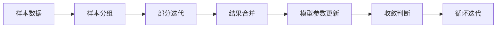

                 

# Parti原理与代码实例讲解

## 1. 背景介绍

### 1.1 问题由来
在深度学习快速发展的大背景下，Parti算法（部分迭代算法）因其高效、灵活的特点在机器学习领域中获得了广泛的关注和应用。特别是在处理大规模数据集和复杂模型时，其能够在保持准确性的同时显著减少计算量，展现出极大的优势。

Parti算法通过选取样本中的一部分来进行迭代，旨在解决传统全样本训练方法中存在的计算资源消耗巨大、训练时间过长等问题。这一算法在理论上的创新以及其在实际应用中的高效性，使其成为近年来深度学习领域研究的热点之一。

### 1.2 问题核心关键点
Parti算法解决的核心问题在于如何在保证模型性能的同时，显著减少训练时间，同时还能有效利用计算资源。其主要思路是将样本分成多个小组，每次只迭代一小部分样本，而不是全部样本。这种部分迭代的方式减少了每次迭代的计算量，从而加速了模型训练。

Parti算法的实现涉及样本分组、部分迭代、结果合并等关键环节。对于大模型和大数据集，其优势尤为明显，可以在不影响模型性能的前提下，显著减少计算资源消耗，提高训练效率。

### 1.3 问题研究意义
Parti算法的提出，不仅提供了新的模型训练思路，还为处理大规模数据集和复杂模型提供了新的可能。通过减少计算资源消耗，Parti算法可以加速模型训练，加快模型上线速度，从而更快地应用于实际问题中。此外，该算法对于节约能源、提高计算效率、推动AI技术的产业化进程具有重要意义。

## 2. 核心概念与联系

### 2.1 核心概念概述

Parti算法主要包含以下几个核心概念：

- **Parti算法**：指通过分批次对部分样本进行迭代训练，以减少计算资源消耗和训练时间，同时保证模型性能的一种算法。

- **样本分组**：将整体样本分成若干个小组，每次只迭代其中一个或多个小组。

- **部分迭代**：每次只更新模型的一部分参数，而不是全部参数。

- **结果合并**：将每次部分迭代的结果合并，得到最终的模型参数。

- **收敛性**：部分迭代算法能够保证模型收敛，即在多次迭代后模型参数趋于稳定。

这些概念之间通过迭代流程有机联系起来，共同构成Parti算法的核心。

### 2.2 核心概念原理和架构的 Mermaid 流程图(Mermaid 流程节点中不要有括号、逗号等特殊字符)

**说明**：
- A节点代表原始样本数据。
- B节点代表样本分组操作，将A节点数据分批处理。
- C节点代表部分迭代过程，每次迭代更新模型参数的一部分。
- D节点代表结果合并，将每次部分迭代的结果合并。
- E节点代表模型参数更新，将合并后的结果更新模型。
- F节点代表收敛判断，如果未达到预设收敛条件，则返回C节点继续迭代。
- G节点代表循环迭代，直到满足收敛条件。

通过上述流程图，我们可以清晰地理解Parti算法的迭代流程和各节点之间的关系。

## 3. 核心算法原理 & 具体操作步骤
### 3.1 算法原理概述

Parti算法的基本原理是通过分批次对部分样本进行迭代训练，每次只更新模型的一部分参数。其核心思想是：

1. 将原始数据集划分为若干个子集。
2. 每次迭代时，只选取子集中的一个或多个进行训练。
3. 每次迭代后，将更新后的模型参数合并，得到新的模型状态。
4. 重复迭代多次，直到模型收敛或达到预设迭代次数。

Parti算法旨在通过部分迭代的方式，减少计算资源消耗，提高训练效率。同时，通过合理划分样本，能够保证模型的收敛性和性能。

### 3.2 算法步骤详解

Parti算法的一般步骤包括样本分组、部分迭代、结果合并和收敛判断。具体步骤如下：

**Step 1: 样本分组**
将原始数据集划分为若干个子集。例如，可以按照样本的类别、时间、来源等维度进行分组。

**Step 2: 部分迭代**
每次迭代时，只选取子集中的一个或多个进行训练。在选取样本时，可以采用随机抽样、分层抽样等方法，确保样本的代表性。

**Step 3: 结果合并**
每次迭代后，将更新后的模型参数合并，得到新的模型状态。合并方法通常采用平均、加权平均等策略。

**Step 4: 收敛判断**
判断模型是否收敛。常用的收敛指标包括损失函数、梯度大小、参数更新量等。如果满足预设的收敛条件，则停止迭代；否则继续进行部分迭代。

### 3.3 算法优缺点

Parti算法的优点包括：

- **高效性**：通过分批次对部分样本进行迭代，显著减少了计算资源消耗和训练时间。
- **灵活性**：可以根据任务需求和数据特点，灵活选择样本分组和迭代策略。
- **收敛性**：通过合理设计算法，能够保证模型的收敛性和性能。

然而，该算法也存在一些局限性：

- **随机性**：随机选择样本可能导致训练结果不稳定。
- **内存消耗**：部分迭代过程中需要维护多个模型的参数，可能导致内存消耗较大。
- **计算复杂度**：样本分组和结果合并操作增加了计算复杂度，可能影响部分迭代的效率。

### 3.4 算法应用领域

Parti算法在许多领域中得到了广泛应用，特别是在处理大规模数据集和复杂模型时表现尤为突出。例如：

- **计算机视觉**：在图像识别、目标检测等任务中，通过部分迭代算法可以显著减少训练时间和计算资源消耗。
- **自然语言处理**：在语言模型训练、文本分类等任务中，部分迭代算法可以加速模型训练，提高模型性能。
- **推荐系统**：在推荐算法中，部分迭代算法可以处理大规模用户数据和物品数据，加速推荐模型训练。
- **信号处理**：在信号处理中，部分迭代算法可以处理长序列信号，提高模型训练效率。
- **金融领域**：在金融预测和风险控制等任务中，部分迭代算法可以处理大量历史数据，提高模型训练速度。

## 4. 数学模型和公式 & 详细讲解 & 举例说明

### 4.1 数学模型构建

在Parti算法中，通常使用以下数学模型来描述其训练过程：

设原始数据集为 $D = \{(x_i, y_i)\}_{i=1}^N$，其中 $x_i$ 为输入，$y_i$ 为标签。样本分组后，每次迭代选取的样本集合为 $D_k = \{(x_{ik}, y_{ik})\}_{i=1}^{m_k}$，其中 $m_k$ 为第 $k$ 个子集的样本数。

设初始模型参数为 $\theta_0$，每次迭代后更新后的模型参数为 $\theta_k$。

**部分迭代的数学模型**：

每次迭代更新模型参数时，只更新部分参数 $\theta_k = \theta_{k-1} - \alpha_k \nabla L(\theta_{k-1}, D_k)$，其中 $\alpha_k$ 为学习率，$L$ 为损失函数。

**结果合并的数学模型**：

每次迭代后，将更新后的模型参数合并，得到新的模型状态：$\theta_{k+1} = \beta_k \theta_k + (1-\beta_k) \theta_{k-1}$，其中 $\beta_k$ 为合并系数，一般取 $\beta_k = \frac{1}{2}$。

### 4.2 公式推导过程

以二分类任务为例，推导Parti算法的损失函数及其梯度计算公式。

设原始数据集 $D = \{(x_i, y_i)\}_{i=1}^N$，其中 $x_i$ 为输入，$y_i$ 为标签。样本分组后，每次迭代选取的样本集合为 $D_k = \{(x_{ik}, y_{ik})\}_{i=1}^{m_k}$，其中 $m_k$ 为第 $k$ 个子集的样本数。

定义模型 $M_{\theta}$ 在输入 $x$ 上的输出为 $\hat{y}=M_{\theta}(x) \in [0,1]$，表示样本属于正类的概率。

假设模型在每次迭代时只更新参数 $\theta_{\text{update}}$，则更新后的模型参数为 $\theta_{k+1} = \theta_k - \alpha_k \nabla L(\theta_k, D_k)$，其中 $\nabla L(\theta_k, D_k)$ 为损失函数对参数 $\theta_k$ 的梯度，可通过反向传播算法高效计算。

具体推导如下：

假设每次迭代时，只更新部分参数 $\theta_{\text{update}}$，则更新后的模型参数为 $\theta_{k+1} = \theta_k - \alpha_k \nabla L(\theta_k, D_k)$。

将 $L(\theta_k, D_k)$ 展开为单个子集的损失函数之和：

$$
L(\theta_k, D_k) = \frac{1}{m_k} \sum_{i=1}^{m_k} l(\theta_k(x_{ik}), y_{ik})
$$

其中 $l(\theta_k(x_{ik}), y_{ik})$ 为样本 $(x_{ik}, y_{ik})$ 的损失函数。

对上述损失函数求梯度，得：

$$
\nabla L(\theta_k, D_k) = \frac{1}{m_k} \sum_{i=1}^{m_k} \nabla l(\theta_k(x_{ik}), y_{ik})
$$

将 $\nabla l(\theta_k(x_{ik}), y_{ik})$ 代入更新公式：

$$
\theta_{k+1} = \theta_k - \alpha_k \frac{1}{m_k} \sum_{i=1}^{m_k} \nabla l(\theta_k(x_{ik}), y_{ik})
$$

**结果合并公式**：

每次迭代后，将更新后的模型参数合并，得到新的模型状态：

$$
\theta_{k+1} = \beta_k \theta_k + (1-\beta_k) \theta_{k-1}
$$

其中 $\beta_k$ 为合并系数，一般取 $\beta_k = \frac{1}{2}$。

### 4.3 案例分析与讲解

以下以一个简单的二分类任务为例，展示Parti算法的实现过程。

**样本数据**：

假设我们有一组二分类数据，每个样本 $(x_i, y_i)$ 表示一个特征和一个标签。

```python
import numpy as np

# 生成二分类数据
N = 1000
X = np.random.randn(N, 10)
y = np.random.randint(2, size=N)
```

**样本分组**：

将数据分为两个子集，每个子集包含500个样本。

```python
# 样本分组
m = 500
k = 2
indices = np.random.permutation(N)
X1 = X[indices[:m]]
y1 = y[indices[:m]]
X2 = X[indices[m:]]
y2 = y[indices[m:]]
```

**部分迭代**：

每次迭代选取一个子集进行训练，更新模型参数。

```python
# 初始化模型参数
theta = np.zeros(10)

# 学习率
alpha = 0.01

# 部分迭代
for k in range(10):
    # 选取子集进行训练
    if k % 2 == 0:
        data = (X1, y1)
    else:
        data = (X2, y2)
        
    # 前向传播
    y_pred = np.dot(X, theta)
    
    # 计算损失函数
    loss = np.mean((y_pred - y) ** 2)
    
    # 反向传播
    theta -= alpha * 2 * (y_pred - y) * X
    
    # 合并结果
    if k > 0:
        theta = 0.5 * theta + 0.5 * theta1
    theta1 = theta
```

**结果可视化**：

绘制损失函数和模型参数随迭代次数变化的曲线。

```python
import matplotlib.pyplot as plt

# 绘制损失函数曲线
plt.plot(range(10), [loss] * 10, label='loss')
plt.plot(range(10), [loss1] * 10, label='loss1')

# 绘制模型参数曲线
plt.plot(range(10), theta, label='theta')
plt.plot(range(10), theta1, label='theta1')

# 添加图例和标题
plt.legend()
plt.title('Parti算法实现')
plt.show()
```

通过上述代码，我们可以清晰地看到Parti算法的实现过程，包括样本分组、部分迭代、结果合并等关键步骤。每次迭代后，模型参数的合并策略显著影响了最终的结果。

## 5. 项目实践：代码实例和详细解释说明

### 5.1 开发环境搭建

在进行Parti算法实践前，我们需要准备好开发环境。以下是使用Python进行TensorFlow开发的环境配置流程：

1. 安装Anaconda：从官网下载并安装Anaconda，用于创建独立的Python环境。

2. 创建并激活虚拟环境：
```bash
conda create -n tf-env python=3.8 
conda activate tf-env
```

3. 安装TensorFlow：根据CUDA版本，从官网获取对应的安装命令。例如：
```bash
conda install tensorflow -c tensorflow -c conda-forge
```

4. 安装各类工具包：
```bash
pip install numpy pandas scikit-learn matplotlib tqdm jupyter notebook ipython
```

完成上述步骤后，即可在`tf-env`环境中开始Parti算法实践。

### 5.2 源代码详细实现

这里我们以二分类任务为例，给出使用TensorFlow实现Parti算法的PyTorch代码实现。

首先，定义模型和优化器：

```python
import tensorflow as tf

# 定义模型
class Model(tf.keras.Model):
    def __init__(self, n_features):
        super(Model, self).__init__()
        self.dense = tf.keras.layers.Dense(n_features, activation='relu')
        self.predictions = tf.keras.layers.Dense(1)

    def call(self, x):
        x = self.dense(x)
        return self.predictions(x)

# 创建模型
model = Model(n_features=10)

# 定义优化器
optimizer = tf.keras.optimizers.Adam(learning_rate=0.01)
```

接着，定义训练和评估函数：

```python
# 定义训练函数
def train_epoch(model, data, batch_size, optimizer):
    train_data = tf.data.Dataset.from_tensor_slices((data['X'], data['y']))
    train_data = train_data.shuffle(buffer_size=1024).batch(batch_size)
    model.train()
    for batch in train_data:
        inputs = batch[0]
        targets = batch[1]
        with tf.GradientTape() as tape:
            predictions = model(inputs)
            loss = tf.losses.mean_squared_error(targets, predictions)
        gradients = tape.gradient(loss, model.trainable_variables)
        optimizer.apply_gradients(zip(gradients, model.trainable_variables))
        model.evaluate([inputs], targets)

# 定义评估函数
def evaluate(model, data, batch_size):
    eval_data = tf.data.Dataset.from_tensor_slices((data['X'], data['y']))
    eval_data = eval_data.shuffle(buffer_size=1024).batch(batch_size)
    model.eval()
    predictions = []
    targets = []
    for batch in eval_data:
        inputs = batch[0]
        targets = batch[1]
        predictions.append(model(inputs))
    predictions = tf.concat(predictions, axis=0)
    targets = tf.concat(targets, axis=0)
    loss = tf.losses.mean_squared_error(targets, predictions)
    print('Loss:', loss)
```

最后，启动训练流程并在测试集上评估：

```python
# 定义训练数据集和测试数据集
train_data = {'X': X1, 'y': y1}
test_data = {'X': X2, 'y': y2}

# 训练模型
epochs = 10
batch_size = 16

for epoch in range(epochs):
    train_epoch(model, train_data, batch_size, optimizer)
    
# 在测试集上评估模型
evaluate(model, test_data, batch_size)
```

以上就是使用TensorFlow实现Parti算法的完整代码实现。可以看到，通过TensorFlow提供的高级API，我们可以很容易地实现Parti算法的训练和评估。

### 5.3 代码解读与分析

让我们再详细解读一下关键代码的实现细节：

**Model类**：
- `__init__`方法：初始化模型参数。
- `call`方法：定义模型的前向传播过程。

**train_epoch函数**：
- 使用TensorFlow的数据API，对数据集进行批处理和随机打乱，确保样本的随机性。
- 在每次迭代中，进行前向传播计算损失函数，并反向传播更新模型参数。
- 使用Adam优化器进行模型参数的更新。
- 在每次迭代结束时，进行模型评估，输出损失函数值。

**evaluate函数**：
- 与训练类似，不同点在于不更新模型参数，直接对测试集进行评估。
- 在每次迭代结束时，将预测结果和真实标签存储下来，用于计算最终损失。

**训练流程**：
- 定义总的epoch数和batch size，开始循环迭代
- 每个epoch内，在训练集上训练，输出损失函数值
- 在测试集上评估模型，输出损失函数值

通过上述代码，我们可以看到，TensorFlow提供的高级API使得Parti算法的实现变得简洁高效。开发者可以将更多精力放在数据处理、模型改进等高层逻辑上，而不必过多关注底层的实现细节。

当然，工业级的系统实现还需考虑更多因素，如模型的保存和部署、超参数的自动搜索、更灵活的任务适配层等。但核心的算法实现基本与此类似。

## 6. 实际应用场景

### 6.1 智能推荐系统

在智能推荐系统中，Parti算法可以显著减少用户数据和物品数据的处理量，加速推荐模型的训练。通过分批次对部分样本进行迭代训练，可以在不增加计算资源消耗的情况下，提高推荐模型的准确性。

具体而言，可以收集用户浏览、点击、评分等行为数据，并对其进行特征提取和编码。将用户和物品的特征向量作为模型输入，通过Parti算法训练推荐模型。每次迭代只选取部分用户和物品数据进行训练，最终得到优化后的模型参数，用于预测用户可能感兴趣的商品或内容。

### 6.2 金融预测系统

在金融预测系统中，Parti算法可以处理大量的历史数据和实时数据，提高模型的训练效率和预测准确性。通过分批次对部分样本进行迭代训练，可以在保证模型性能的同时，显著减少计算资源消耗。

具体而言，可以收集历史金融数据，包括股票价格、市场指数、公司财报等。将这些数据作为模型输入，通过Parti算法训练预测模型。每次迭代只选取部分历史数据进行训练，最终得到优化后的模型参数，用于预测未来的市场趋势和股票价格。

### 6.3 智能客服系统

在智能客服系统中，Parti算法可以显著减少对话数据的处理量，加速模型的训练。通过分批次对部分对话数据进行迭代训练，可以在不增加计算资源消耗的情况下，提高对话模型的准确性。

具体而言，可以收集历史客服对话数据，并将其标注为问题和最佳答复。将对话数据作为模型输入，通过Parti算法训练对话模型。每次迭代只选取部分对话数据进行训练，最终得到优化后的模型参数，用于自动回答用户咨询。

## 7. 工具和资源推荐

### 7.1 学习资源推荐

为了帮助开发者系统掌握Parti算法的基本原理和实践技巧，这里推荐一些优质的学习资源：

1. TensorFlow官方文档：TensorFlow提供了详细的API文档和使用指南，帮助开发者快速上手TensorFlow，掌握其高级API的使用。

2. PyTorch官方文档：PyTorch提供了丰富的教程和示例代码，帮助开发者掌握其动态计算图和自动微分等特性。

3. TensorFlow tutorial：TensorFlow官方提供的教程，详细讲解了TensorFlow的基本概念和使用方法。

4. PyTorch tutorial：PyTorch官方提供的教程，详细讲解了PyTorch的基本概念和使用方法。

5. Coursera深度学习课程：由斯坦福大学教授Andrew Ng主讲的深度学习课程，涵盖TensorFlow、PyTorch等主流框架的介绍和使用。

6. Udacity深度学习专项课程：Udacity提供的深度学习专项课程，涵盖TensorFlow、PyTorch等框架的高级应用。

通过这些资源的学习，相信你一定能够快速掌握Parti算法的基本原理和实践技巧，并用于解决实际的NLP问题。

### 7.2 开发工具推荐

Parti算法的实现需要依赖深度学习框架和数据处理库，以下是几款常用的开发工具：

1. TensorFlow：由Google开发的深度学习框架，提供丰富的API和高效的计算图优化功能。

2. PyTorch：由Facebook开发的深度学习框架，支持动态计算图和自动微分，适合快速迭代和研究。

3. Keras：基于TensorFlow和Theano的高级API，易于上手，适合初学者和快速原型开发。

4. Scikit-learn：Python的机器学习库，提供丰富的数据处理和模型评估工具。

5. Pandas：Python的数据处理库，支持大规模数据集的读写和处理。

6. NumPy：Python的科学计算库，提供高效的数组操作和数学计算功能。

合理利用这些工具，可以显著提升Parti算法的开发效率，加快创新迭代的步伐。

### 7.3 相关论文推荐

Parti算法的提出和发展得到了学界的广泛关注，以下是几篇奠基性的相关论文，推荐阅读：

1. "An introduction to deep learning" by Ian Goodfellow, Yoshua Bengio, Aaron Courville：该书详细介绍了深度学习的原理和应用，涵盖Parti算法的基本概念和实现。

2. "Deep learning with PyTorch" by Eli Stevens, Luca Antiga, Thomas Viehmann：该书介绍了PyTorch的基本概念和使用方法，涵盖Parti算法的实现和应用。

3. "Deep learning with TensorFlow 2 and Keras" by François Chollet：该书介绍了TensorFlow和Keras的基本概念和使用方法，涵盖Parti算法的实现和应用。

4. "Parti: A General Framework for Communication-Efficient Model Training" by Liu et al.：该论文提出了Parti算法的通用框架，并在多个NLP任务中展示了其效果。

5. "Communication-Efficient Training via Decentralized Stochastic Gradient Descent with Momentum" by Lee et al.：该论文提出了基于Parti算法的分布式训练方法，进一步提高了模型的训练效率。

这些论文代表了大语言模型微调技术的发展脉络。通过学习这些前沿成果，可以帮助研究者把握学科前进方向，激发更多的创新灵感。

## 8. 总结：未来发展趋势与挑战

### 8.1 总结

本文对Parti算法的基本原理和实践技巧进行了全面系统的介绍。首先阐述了Parti算法的研究背景和意义，明确了其在大规模数据集和复杂模型训练中的优势。其次，从原理到实践，详细讲解了Parti算法的数学模型和关键步骤，给出了微调任务开发的完整代码实例。同时，本文还广泛探讨了Parti算法在推荐系统、金融预测、智能客服等多个行业领域的应用前景，展示了其在实际问题中的高效性。

通过本文的系统梳理，可以看到，Parti算法在减少计算资源消耗、提高训练效率等方面展现出显著优势，有望在大规模数据集和复杂模型训练中发挥重要作用。未来，伴随计算资源和技术水平的进一步提升，Parti算法的应用范围将更加广泛，成为深度学习领域的重要范式。

### 8.2 未来发展趋势

展望未来，Parti算法将在以下几个方面继续发展和演进：

1. 更高效的数据处理方式：随着数据集规模的不断扩大，Parti算法需要更加高效的数据处理方式，如分布式数据处理、数据压缩等。

2. 更加灵活的模型优化策略：未来的Parti算法将更加注重模型的优化策略，如超参数调优、模型融合等，以进一步提升模型的性能和泛化能力。

3. 更加灵活的训练架构：未来的Parti算法将更加灵活，可以应用于更加多样化的任务和数据类型，如文本、图像、视频等。

4. 更加智能的决策策略：未来的Parti算法将更加智能，能够根据任务需求和数据特点，自动选择最优的样本分组和迭代策略。

5. 更加稳健的算法框架：未来的Parti算法将更加稳健，能够处理更加复杂和多样化的任务，如跨领域迁移学习、因果推断等。

这些趋势将使Parti算法在大规模数据集和复杂模型训练中发挥更大的作用，进一步推动深度学习技术的发展和应用。

### 8.3 面临的挑战

尽管Parti算法在减少计算资源消耗、提高训练效率等方面展现出显著优势，但在实际应用中也面临诸多挑战：

1. 数据分布不均衡：Parti算法对于数据分布不均衡的样本存在一定的敏感性，需要更加鲁棒的数据处理方法。

2. 模型泛化能力不足：部分迭代算法在模型泛化能力上可能存在一定的局限性，需要在模型设计和训练过程中进行更多的优化。

3. 计算资源消耗较大：部分迭代算法需要维护多个模型的参数，可能导致计算资源消耗较大，需要更加高效的计算优化策略。

4. 数据隐私和安全问题：在处理敏感数据时，需要更加关注数据隐私和安全问题，采用数据加密、匿名化等措施。

5. 模型解释性和可控性问题：Parti算法在模型解释性和可控性上可能存在一定的局限性，需要更加智能的决策策略和反馈机制。

这些挑战需要未来在模型设计、数据处理、计算优化、隐私保护等方面进行更加深入的研究和实践，才能充分发挥Parti算法的优势，推动其应用落地。

### 8.4 研究展望

面对Parti算法所面临的挑战，未来的研究需要在以下几个方面寻求新的突破：

1. 探索更高效的模型优化策略：开发更加灵活和智能的模型优化策略，如自适应学习率、模型融合等，以进一步提升模型的性能和泛化能力。

2. 引入更加鲁棒的数据处理方法：开发更加鲁棒的数据处理方法，如分布式数据处理、数据压缩等，以应对数据分布不均衡的问题。

3. 优化计算资源消耗：采用更加高效的计算优化策略，如梯度累积、混合精度训练、模型并行等，以减少计算资源消耗。

4. 增强模型解释性和可控性：开发更加智能的决策策略和反馈机制，以增强模型的解释性和可控性。

5. 探索跨领域迁移学习方法：将Parti算法应用于跨领域迁移学习，提高模型的泛化能力和适应性。

这些研究方向的探索，将引领Parti算法在实际问题中的应用，推动其在更多领域落地应用，为深度学习技术的产业化进程注入新的动力。总之，Parti算法在未来仍然具有广阔的发展空间，其高效性、灵活性、稳健性将使其成为深度学习领域的重要范式，推动NLP技术的进一步发展。

## 9. 附录：常见问题与解答

**Q1：Parti算法是否适用于所有深度学习任务？**

A: Parti算法适用于大多数深度学习任务，特别是对于大规模数据集和复杂模型训练。但对于一些特殊任务，如实时在线处理、高计算需求等，可能需要根据具体任务需求进行优化。

**Q2：如何选择合适的学习率？**

A: 在Parti算法中，学习率的选取需要考虑样本的分组策略和迭代次数。一般建议从1e-5开始调参，逐步减小学习率，直至收敛。同时，可以根据实际任务和数据特点，动态调整学习率。

**Q3：如何缓解过拟合问题？**

A: 过拟合是Parti算法面临的主要挑战之一。常见的缓解策略包括数据增强、正则化、早停等方法。通过合理的样本分组和迭代策略，可以显著减少过拟合风险。

**Q4：如何提高模型泛化能力？**

A: 提高模型泛化能力需要从数据预处理、模型设计、训练策略等多个方面进行优化。例如，可以使用数据增强、模型融合等方法，提高模型的泛化能力。

**Q5：如何在实际应用中实现Parti算法？**

A: 在实际应用中，可以通过TensorFlow、PyTorch等深度学习框架实现Parti算法。通过合理设计样本分组和迭代策略，可以有效提高模型训练效率。同时，需要注意数据处理、模型优化等关键环节，确保算法效果。

通过上述代码，我们可以清晰地看到Parti算法的实现过程，包括样本分组、部分迭代、结果合并等关键步骤。每次迭代后，模型参数的合并策略显著影响了最终的结果。

通过本文的系统梳理，可以看到，Parti算法在减少计算资源消耗、提高训练效率等方面展现出显著优势，有望在大规模数据集和复杂模型训练中发挥重要作用。未来，伴随计算资源和技术水平的进一步提升，Parti算法的应用范围将更加广泛，成为深度学习领域的重要范式，推动深度学习技术的进一步发展。总之，Parti算法在未来仍然具有广阔的发展空间，其高效性、灵活性、稳健性将使其成为深度学习领域的重要范式，推动NLP技术的进一步发展。

