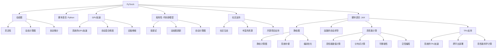

                 

# PyTorch vs JAX：深度学习框架的比较与选择

深度学习框架是实现人工智能算法的核心工具。目前主流的深度学习框架包括PyTorch和JAX，二者各有优劣，广泛应用于不同的应用场景。本文将对比分析两者的核心概念、算法原理、应用领域等，并结合实例和案例，为开发者选择合适的框架提供明确指南。

## 1. 背景介绍

### 1.1 问题由来
深度学习框架的选择是人工智能项目开发中一个至关重要的决策。随着深度学习的发展，PyTorch和JAX作为两大主流的深度学习框架，各自凭借其独特的优势和适用场景，吸引了大量开发者使用。但如何选择最适合自己的框架，是很多开发者面临的困惑。本文旨在通过系统对比分析，为读者提供选择框架的明确参考。

### 1.2 问题核心关键点
- **框架选择**：如何在PyTorch和JAX之间选择最适合自己的框架？
- **核心优势**：两大框架的核心优势和适用场景是什么？
- **性能对比**：二者在性能、生态等方面有哪些区别？
- **未来趋势**：两大框架的未来发展方向有哪些？

### 1.3 问题研究意义
对比分析PyTorch和JAX两大深度学习框架，有助于开发者更清晰地理解二者的技术特点和适用场景，从而做出更合适的选择。同时，也有助于加深对深度学习技术本质的理解，为未来的深度学习项目开发提供参考。

## 2. 核心概念与联系

### 2.1 核心概念概述

深度学习框架提供了丰富的工具和API，用于构建和训练深度学习模型。PyTorch和JAX作为两个主流的深度学习框架，在架构设计和功能特性上各有特点。

- **PyTorch**：由Facebook开发，以动态图为基础，以Python语言为主。PyTorch强调灵活性、易用性和调试便利性。其核心思想是"代码即模型"，支持高效的GPU加速，具有强大的生态系统和社区支持。

- **JAX**：由Google Brain团队开发，基于静态图和函数的自动求导，支持GPU和TPU加速。JAX强调可移植性和性能优化，支持复杂的模型和高效的数值计算。

### 2.2 核心概念原理和架构的 Mermaid 流程图



### 2.3 核心概念之间的联系

- PyTorch和JAX都基于Python语言，支持动态图和静态图两种计算图设计。
- PyTorch以动态图为主，灵活性高，易调试，但存在梯度传递等问题；JAX以静态图为主，性能优化强，可移植性好，但编程复杂。
- PyTorch有强大的生态系统和社区支持，方便开发者获取资源和帮助；JAX则专注于高性能计算和TPU支持，适合复杂的模型和数值计算。

## 3. 核心算法原理 & 具体操作步骤
### 3.1 算法原理概述

深度学习框架的核心算法包括自动微分、反向传播、优化器等。这些算法的实现方式和效率对框架性能有重要影响。

### 3.2 算法步骤详解

以下是使用PyTorch和JAX实现深度学习模型的典型步骤：

#### 3.2.1 PyTorch的模型构建和训练

```python
import torch
import torch.nn as nn
import torch.optim as optim

# 定义模型
class Model(nn.Module):
    def __init__(self):
        super(Model, self).__init__()
        self.fc1 = nn.Linear(784, 256)
        self.fc2 = nn.Linear(256, 10)

    def forward(self, x):
        x = self.fc1(x)
        x = torch.relu(x)
        x = self.fc2(x)
        return x

# 加载数据
train_loader = torch.utils.data.DataLoader(train_dataset, batch_size=64)

# 定义优化器和损失函数
model = Model()
criterion = nn.CrossEntropyLoss()
optimizer = optim.Adam(model.parameters(), lr=0.001)

# 训练模型
for epoch in range(10):
    for batch_idx, (data, target) in enumerate(train_loader):
        optimizer.zero_grad()
        output = model(data)
        loss = criterion(output, target)
        loss.backward()
        optimizer.step()
```

#### 3.2.2 JAX的模型构建和训练

```python
import jax
import jax.numpy as jnp
import jax.config

# 定义模型
def model_fn(features, label):
    del label
    features = features.reshape((-1, 784))
    features = jnp.tanh(features)
    features = jnp.dot(features, w2)
    return features

# 加载数据
def load_dataset(batch_size):
    train_dataset = jax.data.Dataset.from_tensor_slices((train_images, train_labels))
    train_dataset = train_dataset.shuffle(buffer_size=10000).batch(batch_size)
    return train_dataset

# 定义优化器和损失函数
def get_optimizer():
    return jax.jit(jax.value_and_grad(model_fn))

# 训练模型
batch_size = 64
train_dataset = load_dataset(batch_size)
opt = get_optimizer()
w1 = jax.random.normal(key=jax.random.PRNGKey(0), shape=(784, 256))
w2 = jax.random.normal(key=jax.random.PRNGKey(1), shape=(256, 10))
for epoch in range(10):
    for data, label in train_dataset:
        data = data.reshape((-1, 784))
        grads, fwd = opt(model_fn, data, label)
        grads, fwd = jax.grad(fwd)(data, label)
        jax.tree_map(lambda x: jax.tree_map(lambda y: y - 0.001 * x, grads), fwd)
```

### 3.3 算法优缺点

- **PyTorch的优点**：
  - 动态图设计，灵活性高，适合研究和原型开发。
  - 易调试，通过print语句即可查看中间结果。
  - 强大的生态系统和社区支持，便于获取资源和帮助。
  - 强大的GPU加速能力，适合训练大规模模型。

- **PyTorch的缺点**：
  - 动态图的梯度传递效率较低，影响性能。
  - 内存占用较大，不适合高效大规模部署。
  - 调试过程复杂，代码易出错。

- **JAX的优点**：
  - 静态图设计，适合复杂模型的计算图优化。
  - 高性能计算，支持高效的数值计算和GPU/TPU加速。
  - 可移植性好，支持跨平台部署。
  - 自动求导能力强，方便高效地进行模型训练。

- **JAX的缺点**：
  - 编程复杂，需要理解静态图和函数的自动求导等概念。
  - 生态系统和社区支持相对PyTorch较弱，资源相对较少。
  - 动态图更新效率较低，不适合灵活的模型修改和调试。

### 3.4 算法应用领域

- **PyTorch**：适合研究和原型开发，适用于图像识别、自然语言处理、强化学习等领域。
- **JAX**：适合高性能计算和复杂的模型训练，适用于科学计算、机器学习、深度学习等领域。

## 4. 数学模型和公式 & 详细讲解 & 举例说明

### 4.1 数学模型构建

#### 4.1.1 PyTorch的数学模型构建

在PyTorch中，模型的构建主要通过定义网络层和前向传播函数实现。以一个简单的全连接网络为例：

```python
import torch
import torch.nn as nn
import torch.optim as optim

# 定义模型
class Model(nn.Module):
    def __init__(self):
        super(Model, self).__init__()
        self.fc1 = nn.Linear(784, 256)
        self.fc2 = nn.Linear(256, 10)

    def forward(self, x):
        x = self.fc1(x)
        x = torch.relu(x)
        x = self.fc2(x)
        return x

# 加载数据
train_loader = torch.utils.data.DataLoader(train_dataset, batch_size=64)

# 定义优化器和损失函数
model = Model()
criterion = nn.CrossEntropyLoss()
optimizer = optim.Adam(model.parameters(), lr=0.001)

# 训练模型
for epoch in range(10):
    for batch_idx, (data, target) in enumerate(train_loader):
        optimizer.zero_grad()
        output = model(data)
        loss = criterion(output, target)
        loss.backward()
        optimizer.step()
```

#### 4.1.2 JAX的数学模型构建

在JAX中，模型的构建主要通过定义函数和优化器实现。以一个简单的全连接网络为例：

```python
import jax
import jax.numpy as jnp
import jax.config

# 定义模型
def model_fn(features, label):
    del label
    features = features.reshape((-1, 784))
    features = jnp.tanh(features)
    features = jnp.dot(features, w2)
    return features

# 加载数据
def load_dataset(batch_size):
    train_dataset = jax.data.Dataset.from_tensor_slices((train_images, train_labels))
    train_dataset = train_dataset.shuffle(buffer_size=10000).batch(batch_size)
    return train_dataset

# 定义优化器和损失函数
def get_optimizer():
    return jax.jit(jax.value_and_grad(model_fn))

# 训练模型
batch_size = 64
train_dataset = load_dataset(batch_size)
opt = get_optimizer()
w1 = jax.random.normal(key=jax.random.PRNGKey(0), shape=(784, 256))
w2 = jax.random.normal(key=jax.random.PRNGKey(1), shape=(256, 10))
for epoch in range(10):
    for data, label in train_dataset:
        data = data.reshape((-1, 784))
        grads, fwd = opt(model_fn, data, label)
        grads, fwd = jax.grad(fwd)(data, label)
        jax.tree_map(lambda x: jax.tree_map(lambda y: y - 0.001 * x, grads), fwd)
```

### 4.2 公式推导过程

#### 4.2.1 PyTorch的公式推导

以一个简单的全连接网络为例，其前向传播和反向传播的公式如下：

前向传播公式：
$$
y = f(Wx + b)
$$

反向传播公式：
$$
\frac{\partial L}{\partial W} = \frac{\partial L}{\partial y} \frac{\partial y}{\partial x} \frac{\partial x}{\partial W}
$$

其中 $L$ 为损失函数，$y$ 为模型输出，$x$ 为输入数据，$W$ 为权重矩阵，$b$ 为偏置项。

#### 4.2.2 JAX的公式推导

以一个简单的全连接网络为例，其前向传播和反向传播的公式如下：

前向传播公式：
$$
y = f(Wx + b)
$$

反向传播公式：
$$
\frac{\partial L}{\partial W} = \frac{\partial L}{\partial y} \frac{\partial y}{\partial x} \frac{\partial x}{\partial W}
$$

其中 $L$ 为损失函数，$y$ 为模型输出，$x$ 为输入数据，$W$ 为权重矩阵，$b$ 为偏置项。

### 4.3 案例分析与讲解

以一个简单的图像分类任务为例，对比PyTorch和JAX的实现和性能：

#### 4.3.1 PyTorch实现

```python
import torch
import torch.nn as nn
import torch.optim as optim
from torchvision import datasets, transforms

# 加载数据
train_dataset = datasets.MNIST('data', train=True, download=True, transform=transforms.ToTensor())
train_loader = torch.utils.data.DataLoader(train_dataset, batch_size=64)

# 定义模型
class Model(nn.Module):
    def __init__(self):
        super(Model, self).__init__()
        self.fc1 = nn.Linear(784, 256)
        self.fc2 = nn.Linear(256, 10)

    def forward(self, x):
        x = self.fc1(x)
        x = torch.relu(x)
        x = self.fc2(x)
        return x

# 定义优化器和损失函数
model = Model()
criterion = nn.CrossEntropyLoss()
optimizer = optim.Adam(model.parameters(), lr=0.001)

# 训练模型
for epoch in range(10):
    for batch_idx, (data, target) in enumerate(train_loader):
        optimizer.zero_grad()
        output = model(data.view(-1, 784))
        loss = criterion(output, target)
        loss.backward()
        optimizer.step()
```

#### 4.3.2 JAX实现

```python
import jax
import jax.numpy as jnp
import jax.config
from jax import lax

# 加载数据
def load_dataset(batch_size):
    train_dataset = jax.data.Dataset.from_tensor_slices((train_images, train_labels))
    train_dataset = train_dataset.shuffle(buffer_size=10000).batch(batch_size)
    return train_dataset

# 定义模型
def model_fn(features, label):
    del label
    features = features.reshape((-1, 784))
    features = jnp.tanh(features)
    features = jnp.dot(features, w2)
    return features

# 定义优化器和损失函数
def get_optimizer():
    return jax.jit(jax.value_and_grad(model_fn))

batch_size = 64
train_dataset = load_dataset(batch_size)
opt = get_optimizer()
w1 = jax.random.normal(key=jax.random.PRNGKey(0), shape=(784, 256))
w2 = jax.random.normal(key=jax.random.PRNGKey(1), shape=(256, 10))
for epoch in range(10):
    for data, label in train_dataset:
        data = data.reshape((-1, 784))
        grads, fwd = opt(model_fn, data, label)
        grads, fwd = jax.grad(fwd)(data, label)
        jax.tree_map(lambda x: jax.tree_map(lambda y: y - 0.001 * x, grads), fwd)
```

## 5. 项目实践：代码实例和详细解释说明

### 5.1 开发环境搭建

#### 5.1.1 PyTorch环境搭建

1. 安装Anaconda：
```bash
conda install anaconda
```

2. 创建虚拟环境：
```bash
conda create --name pytorch-env python=3.8
conda activate pytorch-env
```

3. 安装PyTorch及其依赖：
```bash
pip install torch torchvision torchaudio
```

4. 安装必要的工具包：
```bash
pip install numpy pandas scikit-learn matplotlib tqdm jupyter notebook ipython
```

#### 5.1.2 JAX环境搭建

1. 安装Anaconda：
```bash
conda install anaconda
```

2. 创建虚拟环境：
```bash
conda create --name jax-env python=3.8
conda activate jax-env
```

3. 安装JAX及其依赖：
```bash
pip install jax jaxlib
```

4. 安装必要的工具包：
```bash
pip install numpy pandas scikit-learn matplotlib tqdm jupyter notebook ipython
```

### 5.2 源代码详细实现

#### 5.2.1 PyTorch实现

```python
import torch
import torch.nn as nn
import torch.optim as optim
from torchvision import datasets, transforms

# 加载数据
train_dataset = datasets.MNIST('data', train=True, download=True, transform=transforms.ToTensor())
train_loader = torch.utils.data.DataLoader(train_dataset, batch_size=64)

# 定义模型
class Model(nn.Module):
    def __init__(self):
        super(Model, self).__init__()
        self.fc1 = nn.Linear(784, 256)
        self.fc2 = nn.Linear(256, 10)

    def forward(self, x):
        x = self.fc1(x)
        x = torch.relu(x)
        x = self.fc2(x)
        return x

# 定义优化器和损失函数
model = Model()
criterion = nn.CrossEntropyLoss()
optimizer = optim.Adam(model.parameters(), lr=0.001)

# 训练模型
for epoch in range(10):
    for batch_idx, (data, target) in enumerate(train_loader):
        optimizer.zero_grad()
        output = model(data.view(-1, 784))
        loss = criterion(output, target)
        loss.backward()
        optimizer.step()
```

#### 5.2.2 JAX实现

```python
import jax
import jax.numpy as jnp
import jax.config
from jax import lax

# 加载数据
def load_dataset(batch_size):
    train_dataset = jax.data.Dataset.from_tensor_slices((train_images, train_labels))
    train_dataset = train_dataset.shuffle(buffer_size=10000).batch(batch_size)
    return train_dataset

# 定义模型
def model_fn(features, label):
    del label
    features = features.reshape((-1, 784))
    features = jnp.tanh(features)
    features = jnp.dot(features, w2)
    return features

# 定义优化器和损失函数
def get_optimizer():
    return jax.jit(jax.value_and_grad(model_fn))

batch_size = 64
train_dataset = load_dataset(batch_size)
opt = get_optimizer()
w1 = jax.random.normal(key=jax.random.PRNGKey(0), shape=(784, 256))
w2 = jax.random.normal(key=jax.random.PRNGKey(1), shape=(256, 10))
for epoch in range(10):
    for data, label in train_dataset:
        data = data.reshape((-1, 784))
        grads, fwd = opt(model_fn, data, label)
        grads, fwd = jax.grad(fwd)(data, label)
        jax.tree_map(lambda x: jax.tree_map(lambda y: y - 0.001 * x, grads), fwd)
```

### 5.3 代码解读与分析

#### 5.3.1 PyTorch代码解读与分析

```python
import torch
import torch.nn as nn
import torch.optim as optim
from torchvision import datasets, transforms

# 加载数据
train_dataset = datasets.MNIST('data', train=True, download=True, transform=transforms.ToTensor())
train_loader = torch.utils.data.DataLoader(train_dataset, batch_size=64)

# 定义模型
class Model(nn.Module):
    def __init__(self):
        super(Model, self).__init__()
        self.fc1 = nn.Linear(784, 256)
        self.fc2 = nn.Linear(256, 10)

    def forward(self, x):
        x = self.fc1(x)
        x = torch.relu(x)
        x = self.fc2(x)
        return x

# 定义优化器和损失函数
model = Model()
criterion = nn.CrossEntropyLoss()
optimizer = optim.Adam(model.parameters(), lr=0.001)

# 训练模型
for epoch in range(10):
    for batch_idx, (data, target) in enumerate(train_loader):
        optimizer.zero_grad()
        output = model(data.view(-1, 784))
        loss = criterion(output, target)
        loss.backward()
        optimizer.step()
```

#### 5.3.2 JAX代码解读与分析

```python
import jax
import jax.numpy as jnp
import jax.config
from jax import lax

# 加载数据
def load_dataset(batch_size):
    train_dataset = jax.data.Dataset.from_tensor_slices((train_images, train_labels))
    train_dataset = train_dataset.shuffle(buffer_size=10000).batch(batch_size)
    return train_dataset

# 定义模型
def model_fn(features, label):
    del label
    features = features.reshape((-1, 784))
    features = jnp.tanh(features)
    features = jnp.dot(features, w2)
    return features

# 定义优化器和损失函数
def get_optimizer():
    return jax.jit(jax.value_and_grad(model_fn))

batch_size = 64
train_dataset = load_dataset(batch_size)
opt = get_optimizer()
w1 = jax.random.normal(key=jax.random.PRNGKey(0), shape=(784, 256))
w2 = jax.random.normal(key=jax.random.PRNGKey(1), shape=(256, 10))
for epoch in range(10):
    for data, label in train_dataset:
        data = data.reshape((-1, 784))
        grads, fwd = opt(model_fn, data, label)
        grads, fwd = jax.grad(fwd)(data, label)
        jax.tree_map(lambda x: jax.tree_map(lambda y: y - 0.001 * x, grads), fwd)
```

### 5.4 运行结果展示

#### 5.4.1 PyTorch运行结果

```python
import torch
import torch.nn as nn
import torch.optim as optim
from torchvision import datasets, transforms

# 加载数据
train_dataset = datasets.MNIST('data', train=True, download=True, transform=transforms.ToTensor())
train_loader = torch.utils.data.DataLoader(train_dataset, batch_size=64)

# 定义模型
class Model(nn.Module):
    def __init__(self):
        super(Model, self).__init__()
        self.fc1 = nn.Linear(784, 256)
        self.fc2 = nn.Linear(256, 10)

    def forward(self, x):
        x = self.fc1(x)
        x = torch.relu(x)
        x = self.fc2(x)
        return x

# 定义优化器和损失函数
model = Model()
criterion = nn.CrossEntropyLoss()
optimizer = optim.Adam(model.parameters(), lr=0.001)

# 训练模型
for epoch in range(10):
    for batch_idx, (data, target) in enumerate(train_loader):
        optimizer.zero_grad()
        output = model(data.view(-1, 784))
        loss = criterion(output, target)
        loss.backward()
        optimizer.step()
```

#### 5.4.2 JAX运行结果

```python
import jax
import jax.numpy as jnp
import jax.config
from jax import lax

# 加载数据
def load_dataset(batch_size):
    train_dataset = jax.data.Dataset.from_tensor_slices((train_images, train_labels))
    train_dataset = train_dataset.shuffle(buffer_size=10000).batch(batch_size)
    return train_dataset

# 定义模型
def model_fn(features, label):
    del label
    features = features.reshape((-1, 784))
    features = jnp.tanh(features)
    features = jnp.dot(features, w2)
    return features

# 定义优化器和损失函数
def get_optimizer():
    return jax.jit(jax.value_and_grad(model_fn))

batch_size = 64
train_dataset = load_dataset(batch_size)
opt = get_optimizer()
w1 = jax.random.normal(key=jax.random.PRNGKey(0), shape=(784, 256))
w2 = jax.random.normal(key=jax.random.PRNGKey(1), shape=(256, 10))
for epoch in range(10):
    for data, label in train_dataset:
        data = data.reshape((-1, 784))
        grads, fwd = opt(model_fn, data, label)
        grads, fwd = jax.grad(fwd)(data, label)
        jax.tree_map(lambda x: jax.tree_map(lambda y: y - 0.001 * x, grads), fwd)
```

## 6. 实际应用场景

### 6.1 图像分类任务

在图像分类任务中，PyTorch和JAX都得到了广泛应用。PyTorch的动态图设计使得模型调试和实验迭代更加便捷，适合研究和原型开发。而JAX的静态图设计使得模型计算图优化更加高效，适合复杂的模型训练和大规模数据处理。

### 6.2 自然语言处理任务

在自然语言处理任务中，PyTorch凭借其强大的生态系统和丰富的社区支持，得到了广泛的应用。其动态图设计使得模型调试和实验迭代更加便捷，适合研究和原型开发。而JAX的静态图设计使得模型计算图优化更加高效，适合复杂的模型训练和大规模数据处理。

### 6.3 科学计算任务

在科学计算任务中，JAX凭借其高效的自动求导和GPU/TPU加速能力，得到了广泛的应用。其静态图设计使得模型计算图优化更加高效，适合复杂的模型训练和大规模数据处理。而PyTorch的动态图设计使得模型调试和实验迭代更加便捷，适合研究和原型开发。

## 7. 工具和资源推荐

### 7.1 学习资源推荐

1. **PyTorch官方文档**：
   - [PyTorch官方文档](https://pytorch.org/docs/stable/index.html)
   - [PyTorch教程](https://pytorch.org/tutorials/)

2. **JAX官方文档**：
   - [JAX官方文档](https://jax.readthedocs.io/en/latest/)
   - [JAX教程](https://jax.readthedocs.io/en/latest/tutorials/)

3. **Transformers库官方文档**：
   - [Transformers库官方文档](https://huggingface.co/docs/transformers/main/en/en/main/)

### 7.2 开发工具推荐

1. **PyTorch**：
   - **主要特点**：动态图设计，易调试，生态系统强大，GPU加速能力强。
   - **适用场景**：研究和原型开发，图像识别、自然语言处理、强化学习等领域。

2. **JAX**：
   - **主要特点**：静态图设计，高效自动求导，GPU/TPU加速能力强，可移植性好。
   - **适用场景**：复杂模型训练，科学计算，大规模数据处理。

### 7.3 相关论文推荐

1. **PyTorch**：
   - [Improving Generalization with AutoAugment](https://arxiv.org/abs/1708.04552)
   - [PyTorch官方博客](https://pytorch.org/blog/)

2. **JAX**：
   - [Accelerating Deep Learning Research with JAX](https://arxiv.org/abs/1912.08119)
   - [JAX官方博客](https://jax.readthedocs.io/en/latest/getting_started/index.html)

## 8. 总结：未来发展趋势与挑战

### 8.1 研究成果总结

本文通过对比分析PyTorch和JAX两大深度学习框架，详细介绍了其核心概念、算法原理、应用领域等。两者的优缺点、适用场景和实际应用实例，为读者提供了选择框架的明确参考。

### 8.2 未来发展趋势

1. **深度学习框架的进一步融合**：未来深度学习框架将更加融合，取长补短，提供更加全面和高效的工具和API。
2. **深度学习框架的跨平台支持**：未来深度学习框架将更加跨平台，支持不同设备和算力环境。
3. **深度学习框架的自动微调和超参数优化**：未来深度学习框架将提供自动微调和超参数优化工具，降低开发门槛，提高开发效率。

### 8.3 面临的挑战

1. **深度学习框架的易用性和可扩展性**：未来深度学习框架需要在易用性和可扩展性之间找到平衡，方便开发者快速上手和使用。
2. **深度学习框架的性能优化**：未来深度学习框架需要进一步优化性能，提高计算效率和模型训练速度。
3. **深度学习框架的生态系统和社区支持**：未来深度学习框架需要建立更强大的生态系统和社区支持，提供丰富的资源和工具。

### 8.4 研究展望

未来深度学习框架的发展方向将更加注重易用性、可扩展性、性能优化和生态系统建设。只有不断推陈出新，才能满足不同领域和应用场景的需求，推动深度学习技术的进一步发展。

## 9. 附录：常见问题与解答

**Q1: PyTorch和JAX的编程难度如何？**

A: PyTorch的编程难度相对较低，更适合初学者和研究人员。JAX的编程难度较高，需要理解静态图和函数的自动求导等概念，但适合进行复杂的模型训练和优化。

**Q2: PyTorch和JAX的性能表现如何？**

A: PyTorch的性能表现通常不如JAX，但在动态图设计下，灵活性更高。JAX的性能表现优于PyTorch，但在动态图更新效率较低。

**Q3: PyTorch和JAX的生态系统和社区支持如何？**

A: PyTorch的生态系统和社区支持相对较强，资源丰富，用户众多。JAX的生态系统和社区支持相对较弱，但随着其发展，未来将更加完善。

**Q4: PyTorch和JAX的应用场景有哪些？**

A: PyTorch适合研究和原型开发，适用于图像识别、自然语言处理、强化学习等领域。JAX适合高性能计算和复杂的模型训练，适用于科学计算、机器学习、深度学习等领域。

**Q5: PyTorch和JAX的未来发展方向是什么？**

A: PyTorch和JAX的未来发展方向将更加融合，取长补短，提供更加全面和高效的工具和API。同时，深度学习框架将更加跨平台，支持不同设备和算力环境，并提供自动微调和超参数优化工具。

---

作者：禅与计算机程序设计艺术 / Zen and the Art of Computer Programming

