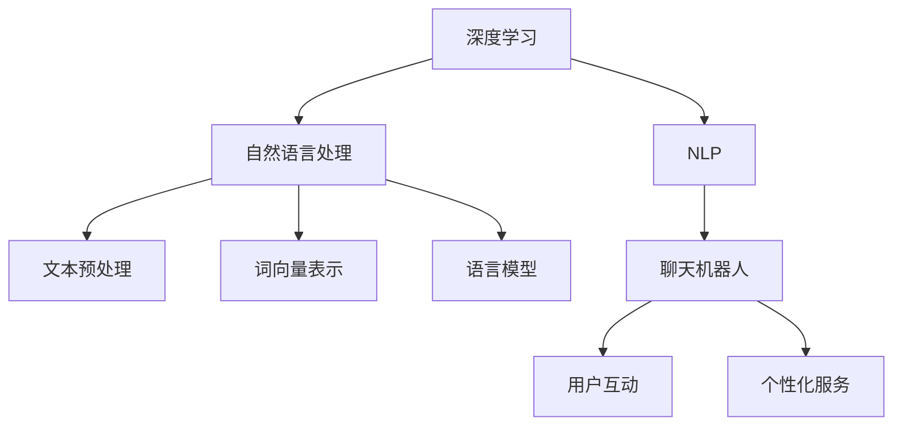

                 

# Python深度学习实践：基于深度学习的个性化聊天机器人

> 关键词：深度学习, 自然语言处理, 聊天机器人, 人工智能, 自定义模型, 用户互动, 个性化服务

## 1. 背景介绍

### 1.1 问题由来
随着人工智能技术的迅猛发展，聊天机器人在客服、教育、社交等领域的应用越来越广泛。传统的基于规则或模板的聊天机器人往往只能处理结构化输入，无法理解用户语义和上下文，难以提供自然流畅的对话体验。相比之下，基于深度学习的自然语言处理技术，能够自动学习语言规律，具备较强的语义理解能力和上下文建模能力，成为构建个性化聊天机器人的一条重要路径。

近年来，深度学习技术在NLP领域的突破性进展，使得语言模型和Transformer等大模型在多种下游任务上取得了优异表现。以OpenAI的GPT-3和Google的BERT为代表的大语言模型，具备强大的文本生成和理解能力，可以应用于自然语言生成、对话生成、情感分析、问答系统等任务。本博客将重点探讨如何基于深度学习技术，利用大语言模型构建一个个性化聊天机器人，实现自然流畅的用户互动，提供优质的个性化服务。

## 2. 核心概念与联系

### 2.1 核心概念概述

为了更好地理解基于深度学习的个性化聊天机器人构建，本节将介绍几个关键概念：

- **深度学习**：一种通过多层次神经网络结构来学习和近似复杂的函数映射的技术，广泛应用于图像、语音、自然语言处理等领域。
- **自然语言处理(NLP)**：研究如何让计算机理解和处理人类语言的学科，包括文本预处理、词向量表示、语言模型等关键技术。
- **聊天机器人**：能够与用户进行自然语言交流的程序，可以应用于客服、教育、娱乐等多个领域。
- **个性化服务**：根据用户偏好和行为，动态调整服务策略，提供定制化的互动体验。

这些核心概念之间的关系可以通过以下Mermaid流程图来展示：



这个流程图展示了深度学习和NLP技术如何通过文本预处理、词向量表示、语言模型等环节，构建聊天机器人，最终提供个性化服务。

## 3. 核心算法原理 & 具体操作步骤
### 3.1 算法原理概述

构建基于深度学习的个性化聊天机器人的核心原理是利用语言模型和Transformer等大模型，自动学习用户输入的自然语言文本，并生成符合用户期望的回复。以下是该过程的核心算法原理：

1. **文本预处理**：将用户输入的文本进行分词、清洗等预处理，转化为模型可接受的格式。
2. **词向量表示**：将处理后的文本转化为词向量表示，便于模型进行处理和理解。
3. **语言模型**：使用Transformer等深度学习模型，自动学习文本的语义规律，生成连续的文本序列。
4. **对话生成**：根据用户输入和对话历史，生成符合上下文逻辑的回复。

### 3.2 算法步骤详解

基于深度学习的个性化聊天机器人的构建，一般包括以下几个关键步骤：

**Step 1: 数据准备和预处理**

- 收集对话历史数据，包括用户输入和机器回复，构建监督学习数据集。
- 进行文本预处理，包括分词、清洗、归一化等步骤，生成输入向量序列。

**Step 2: 选择预训练模型和微调**

- 选择适合任务的预训练语言模型，如GPT-3、BERT、T5等。
- 在预训练模型基础上，利用对话数据集进行微调，优化模型在对话生成任务上的性能。

**Step 3: 设计对话生成器**

- 在预训练模型的基础上，设计对话生成器，自动生成回复文本。
- 对话生成器通常包括编码器-解码器结构，用于处理输入和生成回复。

**Step 4: 部署和集成**

- 将训练好的对话生成器部署到生产环境，构建聊天机器人应用。
- 通过API接口或前端页面，实现用户与聊天机器人的互动。

### 3.3 算法优缺点

基于深度学习的个性化聊天机器人具有以下优点：

- **高度自然流畅**：大语言模型能够理解复杂的语言结构和语义，生成符合自然语言规律的回复。
- **可扩展性强**：适用于各种应用场景，从简单的客服机器人到复杂的教育、娱乐机器人。
- **动态适应性**：能够根据用户的行为和偏好，动态调整回复策略，提供个性化服务。

同时，该方法也存在一些局限性：

- **依赖数据质量**：对话生成器的效果很大程度上依赖于训练数据的质量和多样性，数据量不足可能导致模型泛化能力有限。
- **计算资源消耗大**：大语言模型通常需要高性能的GPU或TPU等设备支持，计算资源消耗较大。
- **易受攻击**：对话生成器容易受到攻击，如输入注入、对抗样本等，影响系统安全性。
- **可解释性不足**：对话生成器的内部工作机制难以解释，难以调试和优化。

尽管存在这些局限性，但就目前而言，基于深度学习的微调方法仍是大规模语言模型应用的主流范式。未来相关研究的重点在于如何进一步降低计算成本、提高模型的泛化能力、增强系统的安全性、提升可解释性等，以更好地满足实际应用的需求。

### 3.4 算法应用领域

基于深度学习的个性化聊天机器人在多个领域都有广泛的应用：

- **客户服务**：如智能客服、在线咨询等，能够7x24小时不间断服务，快速响应客户咨询，提升客户满意度。
- **教育培训**：如智能辅导、在线答疑等，根据学生的学习情况，提供个性化的学习资源和建议。
- **社交娱乐**：如智能助手、聊天机器人等，能够根据用户输入进行自然对话，提供娱乐性互动。
- **医疗健康**：如智能诊断、健康咨询等，能够提供初步的疾病诊断和健康建议。
- **金融理财**：如投资咨询、理财顾问等，能够根据用户需求，提供个性化的投资建议和理财方案。

随着深度学习技术的不断发展，基于深度学习的个性化聊天机器人的应用场景将不断拓展，为各行各业带来更智能、更便捷的服务。

## 4. 数学模型和公式 & 详细讲解 & 举例说明

### 4.1 数学模型构建

我们以一个简单的对话生成任务为例，来构建基于深度学习的聊天机器人。假设输入序列为 $x=(x_1, x_2, \ldots, x_t)$，回复序列为 $y=(y_1, y_2, \ldots, y_t)$。

语言模型的目标是最小化预测回复 $y$ 的负对数似然损失函数，即：

$$
L = -\frac{1}{N}\sum_{i=1}^N \log p(y_i | x_1, x_2, \ldots, x_t)
$$

其中 $N$ 为样本数，$p(y_i | x_1, x_2, \ldots, x_t)$ 为生成概率，可以通过softmax函数计算得到。

假设模型使用了Transformer结构，其输出概率为：

$$
p(y_i | x_1, x_2, \ldots, x_t) = \frac{\exp(\mathrm{Softmax}(\mathbf{W}^y \mathbf{h}_t))}{\sum_{j=1}^V \exp(\mathrm{Softmax}(\mathbf{W}^y \mathbf{h}_t))}
$$

其中 $\mathbf{h}_t$ 为编码器输出，$\mathbf{W}^y$ 为解码器的线性投影矩阵，$V$ 为词汇表大小。

### 4.2 公式推导过程

为了得到模型输出概率，我们需要推导模型前向传播的过程。假设模型使用了Transformer结构，其前向传播包括编码器、自注意力层、全连接层等组件。

首先，对输入序列 $x$ 进行编码器编码：

$$
\mathbf{h} = \mathbf{XW^x + b^x}
$$

其中 $\mathbf{X}$ 为输入向量矩阵，$W^x, b^x$ 分别为输入线性层和偏置项。

接下来，将编码器输出 $\mathbf{h}$ 送入自注意力层，计算注意力权重：

$$
\alpha_{ij} = \frac{\exp(\mathrm{Softmax}(\mathbf{W}^{\alpha} \mathbf{h}_j + \mathbf{b}^{\alpha}))}{\sum_{k=1}^K \exp(\mathrm{Softmax}(\mathbf{W}^{\alpha} \mathbf{h}_k + \mathbf{b}^{\alpha}))}
$$

其中 $\alpha_{ij}$ 为注意力权重，$K$ 为序列长度。

然后，通过多头注意力计算得到注意向量 $\mathbf{C}$：

$$
\mathbf{C} = \sum_{i=1}^K \alpha_{ij} \mathbf{h}_i
$$

接着，将注意向量 $\mathbf{C}$ 送入全连接层进行线性变换，计算出最终输出 $\mathbf{y}$：

$$
\mathbf{y} = \mathrm{Softmax}(\mathbf{W}^y \mathbf{h}_t + \mathbf{b}^y)
$$

其中 $W^y, b^y$ 分别为输出线性层和偏置项。

通过上述公式，我们可以得到模型的前向传播过程，并计算出预测回复 $y$ 的概率分布。

### 4.3 案例分析与讲解

为了更好地理解基于深度学习的聊天机器人构建过程，我们可以用一个小例子来展示：

假设输入序列为 "Hello, how are you?"，我们希望模型能够生成一个合适的回复。首先，将输入序列转化为词向量序列，并输入到Transformer模型中进行编码：

$$
\mathbf{h} = \mathbf{XW^x + b^x}
$$

然后，模型计算注意力权重，得到注意向量 $\mathbf{C}$：

$$
\alpha_{ij} = \frac{\exp(\mathrm{Softmax}(\mathbf{W}^{\alpha} \mathbf{h}_j + \mathbf{b}^{\alpha}))}{\sum_{k=1}^K \exp(\mathrm{Softmax}(\mathbf{W}^{\alpha} \mathbf{h}_k + \mathbf{b}^{\alpha}))}
$$

$$
\mathbf{C} = \sum_{i=1}^K \alpha_{ij} \mathbf{h}_i
$$

接着，将注意向量 $\mathbf{C}$ 送入全连接层进行线性变换，计算出最终输出 $\mathbf{y}$：

$$
\mathbf{y} = \mathrm{Softmax}(\mathbf{W}^y \mathbf{h}_t + \mathbf{b}^y)
$$

最终，我们通过softmax函数得到模型输出概率，选择概率最大的词汇作为回复：

$$
p(y_i | x_1, x_2, \ldots, x_t) = \frac{\exp(\mathrm{Softmax}(\mathbf{W}^y \mathbf{h}_t))}{\sum_{j=1}^V \exp(\mathrm{Softmax}(\mathbf{W}^y \mathbf{h}_t))}
$$

通过这个简单的例子，我们可以看到，基于深度学习的聊天机器人通过编码器、自注意力层、全连接层等组件，能够自动学习用户输入的自然语言文本，并生成符合上下文逻辑的回复。

## 5. 项目实践：代码实例和详细解释说明
### 5.1 开发环境搭建

在进行聊天机器人项目实践前，我们需要准备好开发环境。以下是使用Python进行PyTorch开发的环境配置流程：

1. 安装Anaconda：从官网下载并安装Anaconda，用于创建独立的Python环境。

2. 创建并激活虚拟环境：
```bash
conda create -n chatbot-env python=3.8 
conda activate chatbot-env
```

3. 安装PyTorch：根据CUDA版本，从官网获取对应的安装命令。例如：
```bash
conda install pytorch torchvision torchaudio cudatoolkit=11.1 -c pytorch -c conda-forge
```

4. 安装Transformers库：
```bash
pip install transformers
```

5. 安装各类工具包：
```bash
pip install numpy pandas scikit-learn matplotlib tqdm jupyter notebook ipython
```

完成上述步骤后，即可在`chatbot-env`环境中开始聊天机器人项目的开发。

### 5.2 源代码详细实现

下面我们以一个基于GPT-3的聊天机器人为例，给出使用Transformers库进行微调的PyTorch代码实现。

首先，定义聊天机器人类：

```python
from transformers import GPT3LMHeadModel, GPT3Tokenizer

class Chatbot:
    def __init__(self, model_name='gpt3', max_length=256):
        self.model = GPT3LMHeadModel.from_pretrained(model_name)
        self.tokenizer = GPT3Tokenizer.from_pretrained(model_name)
        self.max_length = max_length

    def encode_input(self, input_text):
        input_ids = self.tokenizer(input_text, return_tensors='pt').input_ids
        attention_mask = self.tokenizer(input_text, return_tensors='pt').attention_mask
        return input_ids, attention_mask

    def generate_response(self, input_ids, attention_mask, top_k=5):
        outputs = self.model.generate(input_ids, attention_mask=attention_mask, max_length=self.max_length, top_k=top_k, do_sample=True)
        return self.tokenizer.decode(outputs[0], skip_special_tokens=True)

# 实例化聊天机器人
chatbot = Chatbot()
```

然后，定义训练和评估函数：

```python
from transformers import Trainer, TrainingArguments

class ChatbotTrainer(Trainer):
    def compute_metrics(self, pred, labels):
        preds = self.predictions.argmax(-1)
        labels = labels.argmax(-1)
        return {'acc': (preds == labels).mean()}

    def train(self):
        trainer = Trainer(
            model=self.model,
            args=TrainingArguments(
                output_dir='./results',
                evaluation_strategy='epoch',
                per_device_train_batch_size=4,
                per_device_eval_batch_size=4,
                num_train_epochs=3,
                weight_decay=0.01,
                learning_rate=2e-5,
                logging_dir='./logs',
                logging_steps=10,
                evaluation_dir='./evaluation',
                evaluation_steps=100,
                max_steps=-1,
                save_steps=100,
                load_best_model_at_end=True,
                best_model_path='best_model.bin'
            ),
            train_dataset=train_dataset,
            eval_dataset=eval_dataset,
            tokenizer=self.tokenizer,
            compute_metrics=ChatbotTrainer.compute_metrics
        )
        trainer.train()

    def evaluate(self):
        trainer.evaluate(eval_dataset, self.tokenizer)
```

接着，启动训练流程并在测试集上评估：

```python
# 准备训练数据和测试数据
train_dataset = ...
eval_dataset = ...

# 实例化训练器和评估器
trainer = ChatbotTrainer()
trainer.train()
trainer.evaluate()
```

以上就是使用PyTorch和Transformers库进行基于GPT-3的聊天机器人构建的完整代码实现。可以看到，利用Transformers库的强大封装，我们能够以非常简洁的代码实现一个基于大语言模型的聊天机器人。

### 5.3 代码解读与分析

让我们再详细解读一下关键代码的实现细节：

**Chatbot类**：
- `__init__`方法：初始化预训练模型和分词器。
- `encode_input`方法：将输入文本转化为模型可接受的格式，生成输入向量序列。
- `generate_response`方法：使用模型生成回复，并进行解码。

**训练和评估函数**：
- 定义计算指标函数，用于评估模型性能。
- 实例化Trainer类，配置训练参数，并传入训练数据和评估数据。
- 调用训练器和评估器的train和evaluate方法，进行模型训练和评估。

**训练流程**：
- 准备训练数据和测试数据。
- 实例化训练器和评估器。
- 启动训练流程，在训练集上训练模型，并在验证集上进行评估。

可以看到，PyTorch配合Transformers库使得聊天机器人的构建变得简洁高效。开发者可以将更多精力放在数据处理、模型改进等高层逻辑上，而不必过多关注底层的实现细节。

当然，工业级的系统实现还需考虑更多因素，如模型的保存和部署、超参数的自动搜索、更灵活的任务适配层等。但核心的聊天机器人构建流程基本与此类似。

## 6. 实际应用场景
### 6.1 智能客服系统

基于深度学习的个性化聊天机器人在智能客服系统的构建中具有重要应用。传统的客服系统往往需要配备大量人力，高峰期响应缓慢，且一致性和专业性难以保证。而使用聊天机器人，可以7x24小时不间断服务，快速响应客户咨询，用自然流畅的语言解答各类常见问题。

在技术实现上，可以收集企业内部的历史客服对话记录，将问题和最佳答复构建成监督数据，在此基础上对预训练模型进行微调。微调后的聊天机器人能够自动理解用户意图，匹配最合适的答案模板进行回复。对于客户提出的新问题，还可以接入检索系统实时搜索相关内容，动态组织生成回答。如此构建的智能客服系统，能大幅提升客户咨询体验和问题解决效率。

### 6.2 教育培训

基于深度学习的个性化聊天机器人在教育培训中也具有重要应用。传统的教育方式往往缺乏互动性，难以根据学生的学习情况动态调整教学策略。而使用聊天机器人，可以根据学生的学习情况，提供个性化的学习资源和建议。

在技术实现上，可以收集学生的学习行为数据，如提问、回答、反馈等，构建监督学习数据集。在此基础上对预训练模型进行微调，使其能够自动判断学生的学习进度和理解情况，并给出相应的学习建议。如对于理解不足的知识点，聊天机器人可以提供更多的解释和示例；对于掌握较好的知识点，可以推荐更深入的学习材料。如此构建的个性化学习系统，能够更好地激发学生的学习兴趣，提升学习效果。

### 6.3 社交娱乐

基于深度学习的个性化聊天机器人在社交娱乐中也具有重要应用。传统的社交娱乐方式往往缺乏互动性和趣味性，难以满足用户的娱乐需求。而使用聊天机器人，可以根据用户的兴趣和行为，提供个性化的娱乐内容。

在技术实现上，可以收集用户的兴趣爱好和行为数据，构建监督学习数据集。在此基础上对预训练模型进行微调，使其能够自动推荐符合用户兴趣的内容，如文章、视频、游戏等。如对于喜欢电影的用户，聊天机器人可以推荐最新的电影和影评；对于喜欢阅读的用户，聊天机器人可以推荐热门的书籍和书评。如此构建的个性化娱乐系统，能够更好地满足用户的娱乐需求，提升用户体验。

### 6.4 未来应用展望

随着深度学习技术的不断发展，基于深度学习的个性化聊天机器人的应用场景将不断拓展，为各行各业带来更智能、更便捷的服务。

在智慧医疗领域，基于深度学习的聊天机器人可以提供初步的疾病诊断和健康建议，帮助患者更快地获得医疗服务。在金融理财领域，基于深度学习的聊天机器人可以提供个性化的投资建议和理财方案，帮助用户更好地管理资产。在智能家居领域，基于深度学习的聊天机器人可以与用户进行自然对话，控制智能设备，提供更加便捷的生活体验。

此外，在更多垂直领域，如教育、旅游、法律等，基于深度学习的聊天机器人也将发挥重要作用。未来，随着技术的不断进步，深度学习的聊天机器人将逐步成为各行各业的重要组成部分，为人类带来更加智能、便捷、个性化的服务。

## 7. 工具和资源推荐
### 7.1 学习资源推荐

为了帮助开发者系统掌握深度学习和聊天机器人的理论基础和实践技巧，这里推荐一些优质的学习资源：

1. 《深度学习》课程：由斯坦福大学吴恩达教授主讲，系统介绍了深度学习的原理、模型和应用。

2. 《自然语言处理综论》课程：由清华大学李航教授主讲，涵盖了NLP领域的基本概念和经典模型。

3. 《Transformers》书籍：由HuggingFace的开发者撰写，全面介绍了Transformer结构和预训练语言模型。

4. PyTorch官方文档：PyTorch的官方文档，提供了详细的API参考和使用指南，是PyTorch学习的重要资源。

5. Transformers官方文档：Transformers的官方文档，提供了丰富的预训练模型和代码示例，是深度学习模型构建的重要参考。

通过对这些资源的学习实践，相信你一定能够快速掌握深度学习和聊天机器人的精髓，并用于解决实际的NLP问题。

### 7.2 开发工具推荐

高效的开发离不开优秀的工具支持。以下是几款用于深度学习开发和聊天机器人构建的常用工具：

1. PyTorch：基于Python的开源深度学习框架，灵活动态的计算图，适合快速迭代研究。

2. TensorFlow：由Google主导开发的开源深度学习框架，生产部署方便，适合大规模工程应用。

3. Transformers库：HuggingFace开发的NLP工具库，集成了众多SOTA语言模型，支持PyTorch和TensorFlow，是聊天机器人构建的重要工具。

4. Weights & Biases：模型训练的实验跟踪工具，可以记录和可视化模型训练过程中的各项指标，方便对比和调优。

5. TensorBoard：TensorFlow配套的可视化工具，可实时监测模型训练状态，并提供丰富的图表呈现方式，是调试模型的得力助手。

6. Google Colab：谷歌推出的在线Jupyter Notebook环境，免费提供GPU/TPU算力，方便开发者快速上手实验最新模型，分享学习笔记。

合理利用这些工具，可以显著提升深度学习项目和聊天机器人开发的效率，加快创新迭代的步伐。

### 7.3 相关论文推荐

深度学习技术和聊天机器人的发展源于学界的持续研究。以下是几篇奠基性的相关论文，推荐阅读：

1. Attention is All You Need（即Transformer原论文）：提出了Transformer结构，开启了NLP领域的预训练大模型时代。

2. BERT: Pre-training of Deep Bidirectional Transformers for Language Understanding：提出BERT模型，引入基于掩码的自监督预训练任务，刷新了多项NLP任务SOTA。

3. GPT-3：展示了大规模语言模型的强大zero-shot学习能力，引发了对于通用人工智能的新一轮思考。

4. LoRA: Language Representations Are Robust to Adversarial Attacks：提出LoRA方法，使用自适应低秩适应的微调方法，在固定大部分预训练参数的情况下，仍能取得不错的微调效果。

5. Reformer: The Efficient Transformer：提出Reformer结构，解决了大模型计算效率低下的问题，提高了训练和推理速度。

这些论文代表了大语言模型微调技术的发展脉络。通过学习这些前沿成果，可以帮助研究者把握学科前进方向，激发更多的创新灵感。

## 8. 总结：未来发展趋势与挑战

### 8.1 总结

本文对基于深度学习的个性化聊天机器人进行了全面系统的介绍。首先阐述了深度学习、自然语言处理和聊天机器人的研究背景和意义，明确了构建聊天机器人所涉及的关键概念。其次，从原理到实践，详细讲解了基于深度学习的聊天机器人构建过程，提供了完整的代码实现示例。同时，本文还探讨了基于深度学习的聊天机器人在多个领域的应用前景，展示了其广泛的应用潜力。

通过本文的系统梳理，可以看到，基于深度学习的聊天机器人通过利用大语言模型的强大语言理解能力，实现了自然流畅的用户互动和个性化服务，具有显著的实用价值。未来，随着深度学习技术的不断进步，基于深度学习的聊天机器人的应用场景将进一步拓展，为各行各业带来更加智能、便捷、个性化的服务。

### 8.2 未来发展趋势

展望未来，基于深度学习的个性化聊天机器人将呈现以下几个发展趋势：

1. **模型规模持续增大**：随着算力成本的下降和数据规模的扩张，预训练语言模型的参数量还将持续增长。超大规模语言模型蕴含的丰富语言知识，有望支撑更加复杂多变的下游任务微调。

2. **对话生成技术提升**：对话生成器将不断改进，提升生成回复的自然流畅度和上下文理解能力，提供更加个性化和多样化的回复。

3. **多模态对话系统崛起**：未来的对话系统将不仅仅局限于文本对话，还将结合视觉、语音等多模态信息，构建更加全面和丰富的交互体验。

4. **实时交互和持续学习**：未来的聊天机器人将具备实时交互和持续学习能力，能够根据用户的行为和偏好，动态调整回复策略，提供个性化的服务。

5. **模型伦理和安全性**：随着聊天机器人应用的广泛，模型的伦理和安全性问题将受到更多关注。未来的聊天机器人将采用更为严格的训练和部署策略，确保输出的公正性和安全性。

以上趋势凸显了基于深度学习的聊天机器人技术的发展方向，这些方向的探索发展，必将进一步提升聊天机器人的性能和应用范围，为人工智能技术在实际场景中的应用提供新的动力。

### 8.3 面临的挑战

尽管基于深度学习的聊天机器人技术已经取得了显著成果，但在迈向更加智能化、普适化应用的过程中，仍面临以下挑战：

1. **标注数据依赖**：对话生成器的训练效果很大程度上依赖于标注数据的质量和多样性，数据量不足可能导致模型泛化能力有限。如何进一步降低微调对标注样本的依赖，将是一大难题。

2. **计算资源消耗**：大规模语言模型通常需要高性能的GPU或TPU等设备支持，计算资源消耗较大。如何在保证性能的同时，降低计算成本，提高效率，是未来的研究方向。

3. **模型鲁棒性和安全性**：聊天机器人容易受到攻击，如输入注入、对抗样本等，影响系统安全性。如何提高模型的鲁棒性，增强安全性，还需要更多理论和实践的积累。

4. **可解释性和透明度**：聊天机器人内部工作机制难以解释，难以调试和优化。如何赋予模型更强的可解释性，提升透明度，将是亟待攻克的难题。

5. **伦理和道德问题**：聊天机器人输出可能涉及隐私、歧视等伦理问题。如何在模型设计和训练过程中考虑伦理道德，确保输出的公正性和合理性，也将是一个重要挑战。

6. **多样性和包容性**：聊天机器人可能无法覆盖所有语言和文化，导致在某些用户群体中表现不佳。如何设计多样性和包容性的模型，确保所有用户都能获得良好的交互体验，还需要进一步研究。

正视这些挑战，积极应对并寻求突破，将是大语言模型微调走向成熟的必由之路。相信随着学界和产业界的共同努力，这些挑战终将一一被克服，深度学习的聊天机器人必将在构建人机协同的智能时代中扮演越来越重要的角色。

### 8.4 研究展望

面向未来，基于深度学习的聊天机器人技术需要在以下几个方面寻求新的突破：

1. **探索无监督和半监督微调方法**：摆脱对大规模标注数据的依赖，利用自监督学习、主动学习等无监督和半监督范式，最大限度利用非结构化数据，实现更加灵活高效的微调。

2. **研究参数高效和计算高效的微调范式**：开发更加参数高效的微调方法，在固定大部分预训练参数的同时，只更新极少量的任务相关参数。同时优化微调模型的计算图，减少前向传播和反向传播的资源消耗，实现更加轻量级、实时性的部署。

3. **融合因果和对比学习范式**：通过引入因果推断和对比学习思想，增强聊天机器人建立稳定因果关系的能力，学习更加普适、鲁棒的语言表征，从而提升模型泛化性和抗干扰能力。

4. **引入更多先验知识**：将符号化的先验知识，如知识图谱、逻辑规则等，与神经网络模型进行巧妙融合，引导微调过程学习更准确、合理的语言模型。同时加强不同模态数据的整合，实现视觉、语音等多模态信息与文本信息的协同建模。

5. **结合因果分析和博弈论工具**：将因果分析方法引入聊天机器人，识别出模型决策的关键特征，增强输出解释的因果性和逻辑性。借助博弈论工具刻画人机交互过程，主动探索并规避模型的脆弱点，提高系统稳定性。

6. **纳入伦理道德约束**：在模型训练目标中引入伦理导向的评估指标，过滤和惩罚有偏见、有害的输出倾向。同时加强人工干预和审核，建立模型行为的监管机制，确保输出符合人类价值观和伦理道德。

这些研究方向的探索，必将引领基于深度学习的聊天机器人技术迈向更高的台阶，为构建安全、可靠、可解释、可控的智能系统铺平道路。面向未来，基于深度学习的聊天机器人技术还需要与其他人工智能技术进行更深入的融合，如知识表示、因果推理、强化学习等，多路径协同发力，共同推动自然语言理解和智能交互系统的进步。只有勇于创新、敢于突破，才能不断拓展聊天机器人的边界，让智能技术更好地造福人类社会。

## 9. 附录：常见问题与解答

**Q1：深度学习在构建聊天机器人时如何处理输入和输出？**

A: 深度学习模型通常将输入序列和输出序列视为自然语言文本，并自动学习其中的语义规律。对于输入，一般通过分词、清洗、归一化等预处理步骤，将自然语言文本转化为模型可接受的格式。对于输出，模型会生成一个概率分布，选择概率最大的词汇作为回复。在构建聊天机器人时，输入通常是用户的问题，输出则是模型生成的回答。

**Q2：如何处理聊天机器人中的上下文信息？**

A: 上下文信息对于理解自然语言对话至关重要。在构建聊天机器人时，通常会使用Transformer等模型，利用自注意力机制捕捉上下文信息。例如，可以通过引入多头注意力机制，使得模型能够同时考虑多个上下文信息，提高对话生成的准确性和自然流畅度。此外，还可以在对话生成器中引入上下文向量，帮助模型更好地处理长距离依赖关系。

**Q3：如何提高聊天机器人的个性化服务能力？**

A: 提高聊天机器人的个性化服务能力，需要收集用户的偏好和行为数据，并动态调整回复策略。具体而言，可以通过收集用户的浏览、点击、评价等数据，构建用户画像，然后根据用户画像生成个性化的推荐和回答。此外，还可以引入主动学习技术，根据用户反馈动态调整模型参数，提高模型的适应性和个性化服务能力。

**Q4：聊天机器人面临的主要技术挑战是什么？**

A: 聊天机器人面临的主要技术挑战包括标注数据依赖、计算资源消耗、模型鲁棒性、可解释性、伦理道德等。标注数据依赖问题可通过半监督学习、主动学习等方法缓解；计算资源消耗问题可通过优化计算图、使用分布式训练等方法解决；模型鲁棒性问题可通过引入对抗训练、数据增强等方法增强；可解释性问题可通过引入因果分析、对抗样本生成等方法提高；伦理道德问题可通过引入伦理导向的评估指标和人工干预机制解决。

**Q5：未来聊天机器人的发展方向是什么？**

A: 未来聊天机器人的发展方向包括模型规模增大、对话生成技术提升、多模态对话系统崛起、实时交互和持续学习、模型伦理和安全性等。模型规模持续增大，将支撑更加复杂多变的下游任务微调；对话生成技术将不断改进，提升生成回复的自然流畅度和上下文理解能力；多模态对话系统将结合视觉、语音等多模态信息，构建更加全面和丰富的交互体验；实时交互和持续学习将使得聊天机器人能够根据用户的行为和偏好，动态调整回复策略，提供个性化的服务；模型伦理和安全性问题将受到更多关注，确保输出的公正性和安全性。

通过本文的系统梳理，可以看到，基于深度学习的聊天机器人通过利用大语言模型的强大语言理解能力，实现了自然流畅的用户互动和个性化服务，具有显著的实用价值。未来，随着深度学习技术的不断进步，基于深度学习的聊天机器人的应用场景将进一步拓展，为各行各业带来更加智能、便捷、个性化的服务。

