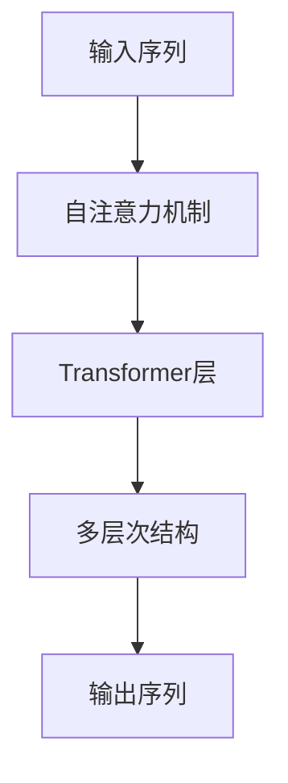

                 

# Python深度学习实践：基于自注意力机制的序列模型

> 关键词：自注意力机制,深度学习,序列模型,自然语言处理,NLP,Transformer,PyTorch

## 1. 背景介绍

随着深度学习技术的不断进步，序列模型在自然语言处理（NLP）领域的应用日益广泛。从传统的循环神经网络（RNN）到更先进的变换器（Transformer），序列模型的结构和算法不断迭代，推动了NLP技术的快速发展和应用落地。本文将深入探讨基于自注意力机制的序列模型，通过一系列循序渐进的章节，帮助读者理解其原理、构建和应用。

## 2. 核心概念与联系

### 2.1 核心概念概述

为了更好地理解基于自注意力机制的序列模型，首先需要介绍几个关键概念：

- **序列模型（Sequence Model）**：指能够处理序列数据的深度学习模型，如RNN、LSTM、GRU、Transformer等。序列模型能够捕捉输入序列中元素之间的关系，适用于文本、语音、时间序列等数据类型。

- **自注意力机制（Self-Attention Mechanism）**：一种计算机制，通过在输入序列中寻找相关性，动态地计算每个元素的权重，用于提升模型对输入序列中每个元素的关注度。自注意力机制最早由Transformer模型引入，极大地提升了深度学习的表现力。

- **Transformer模型**：一种基于自注意力机制的深度学习架构，由Google提出，适用于处理序列数据，包括文本、音频、图像等。Transformer模型通过自注意力机制和多层感知器（MLP）组成，能够高效地处理长序列数据，广泛应用在机器翻译、文本生成、问答系统等领域。

### 2.2 核心概念联系

自注意力机制与Transformer模型之间存在密切联系。自注意力机制作为Transformer模型的核心组件，用于在输入序列中计算每个元素的重要性权重，从而提升模型的表达能力和泛化能力。Transformer模型则是一个基于自注意力机制的序列模型，通过堆叠多层的Transformer层，可以处理长序列数据，并实现高效的序列建模。

**Mermaid流程图**：



这个流程图展示了输入序列经过自注意力机制后，通过多层Transformer层的处理，最终输出序列的过程。其中，自注意力机制是计算每个元素重要性的关键步骤。

## 3. 核心算法原理 & 具体操作步骤

### 3.1 算法原理概述

基于自注意力机制的序列模型，如Transformer模型，通过自注意力机制在输入序列中计算每个元素的重要性权重，动态地调整每个元素的贡献。这一过程可以理解为模型在输入序列中寻找与当前元素最相关的其他元素，从而提升模型的预测能力。

具体而言，自注意力机制包括三个主要步骤：

1. **查询（Query）**：对每个元素计算一个查询向量。
2. **键（Key）**：对每个元素计算一个键向量。
3. **值（Value）**：对每个元素计算一个值向量。

这三个向量通过计算相似度，得到每个元素的重要性权重，用于动态调整每个元素的贡献。通过堆叠多层自注意力机制和多层感知器（MLP），可以构建Transformer模型，实现高效的序列建模。

### 3.2 算法步骤详解

基于自注意力机制的序列模型构建过程如下：

1. **输入表示**：将输入序列转换为模型能够处理的张量形式，通常使用嵌入层将文本单词或图像像素等输入转换为向量表示。

2. **自注意力计算**：对输入序列中的每个元素，计算其与序列中其他元素的相似度，得到每个元素的重要性权重。

3. **残差连接和层归一化**：为了加速训练，通常在自注意力计算后，引入残差连接和层归一化（LayerNorm），提升模型的稳定性。

4. **多层处理**：堆叠多层的自注意力机制和多层感知器（MLP），进一步提升模型的表达能力。

5. **输出表示**：最终输出序列的向量表示，通常使用线性层将其转换为分类或回归等任务所需的预测格式。

### 3.3 算法优缺点

**优点**：

- **并行计算**：自注意力机制可以并行计算，使得Transformer模型能够高效地处理长序列数据。
- **全局信息捕捉**：自注意力机制可以捕捉输入序列中的全局信息，提升模型的表达能力。
- **预训练和微调**：Transformer模型可以通过预训练和微调的方式进行高效训练，提升模型性能。

**缺点**：

- **计算资源消耗大**：自注意力机制的计算复杂度高，需要大量的计算资源进行训练和推理。
- **难以解释**：自注意力机制的内部计算过程复杂，难以进行解释和调试。
- **泛化能力受限**：对于长序列数据的处理，自注意力机制可能出现信息丢失的问题。

### 3.4 算法应用领域

基于自注意力机制的序列模型在NLP领域有着广泛的应用，包括：

- **机器翻译**：Transformer模型在机器翻译领域取得了显著的进展，通过自注意力机制处理源语言和目标语言的对应关系，提升了翻译质量。
- **文本生成**：自注意力机制可以捕捉文本中词语之间的关联关系，用于生成连贯的文本，如文本摘要、对话系统等。
- **问答系统**：通过自注意力机制对问题进行语义理解，Transformer模型可以回答各种自然语言问题，提升人机交互的智能性。
- **语音识别**：Transformer模型可以处理语音信号，用于语音转文本、语音合成等任务。

## 4. 数学模型和公式 & 详细讲解

### 4.1 数学模型构建

假设输入序列为 $x = [x_1, x_2, ..., x_n]$，其中 $x_i$ 为输入序列的第 $i$ 个元素。在Transformer模型中，自注意力机制的计算过程可以表示为：

$$
\text{Attention}(Q,K,V) = \text{Softmax}(QK^T / \sqrt{d_k})V
$$

其中 $Q, K, V$ 分别为查询向量、键向量和值向量，$d_k$ 为键向量的维度。Softmax函数用于计算相似度，得到每个元素的重要性权重。

### 4.2 公式推导过程

以Transformer模型为例，推导其核心公式：

1. **嵌入层**：将输入序列转换为向量表示：

$$
x_i = \text{Embed}(x_i)
$$

2. **自注意力计算**：对输入序列中的每个元素，计算其与序列中其他元素的相似度：

$$
\text{Attention}(Q,K,V) = \text{Softmax}(QK^T / \sqrt{d_k})V
$$

3. **残差连接和层归一化**：引入残差连接和层归一化：

$$
y_i = \text{LayerNorm}(x_i + \text{Attention}(Q,K,V))
$$

4. **多层处理**：堆叠多层的自注意力机制和多层感知器（MLP）：

$$
y_{i,j} = \text{MLP}(y_j) = \text{FFN}(y_j) = \text{ReLU}(\text{Linear}(y_j)) + \text{Linear}(y_j)
$$

其中 $y_i$ 为当前层输出的向量表示。

### 4.3 案例分析与讲解

以机器翻译任务为例，分析Transformer模型的计算过程：

1. **输入表示**：将源语言和目标语言的句子分别转换为向量表示，并通过嵌入层进行转换。

2. **自注意力计算**：对于源语言句子的每个单词，计算其与目标语言句子中对应单词的相似度，得到每个单词的重要性权重。

3. **残差连接和层归一化**：引入残差连接和层归一化，提升模型的稳定性。

4. **多层处理**：堆叠多层的自注意力机制和多层感知器，逐步提升模型的表达能力。

5. **输出表示**：最终输出目标语言句子的向量表示，通过线性层转换为概率分布，用于生成翻译结果。

## 5. 项目实践：代码实例和详细解释说明

### 5.1 开发环境搭建

在进行基于自注意力机制的序列模型实践前，需要准备好开发环境。以下是使用Python进行PyTorch开发的环境配置流程：

1. **安装Anaconda**：从官网下载并安装Anaconda，用于创建独立的Python环境。

2. **创建并激活虚拟环境**：

   ```bash
   conda create -n pytorch-env python=3.8 
   conda activate pytorch-env
   ```

3. **安装PyTorch**：根据CUDA版本，从官网获取对应的安装命令。例如：

   ```bash
   conda install pytorch torchvision torchaudio cudatoolkit=11.1 -c pytorch -c conda-forge
   ```

4. **安装其他依赖库**：

   ```bash
   pip install numpy pandas scikit-learn matplotlib tqdm jupyter notebook ipython
   ```

完成上述步骤后，即可在`pytorch-env`环境中进行模型开发。

### 5.2 源代码详细实现

下面以Transformer模型为例，给出使用PyTorch进行机器翻译任务的代码实现。

```python
import torch
import torch.nn as nn
import torch.nn.functional as F
import torch.optim as optim
from transformers import BertTokenizer, BertModel

class Transformer(nn.Module):
    def __init__(self, n_vocab, n_hidden, n_layers, n_heads, dropout=0.1):
        super(Transformer, self).__init__()
        self.n_vocab = n_vocab
        self.n_hidden = n_hidden
        self.n_layers = n_layers
        self.n_heads = n_heads
        self.dropout = dropout
        
        self.embedding = nn.Embedding(n_vocab, n_hidden)
        self.pos_encoder = PositionalEncoding(n_hidden)
        self.encoder_layers = nn.ModuleList([EncoderLayer(n_hidden, n_heads, dropout) for _ in range(n_layers)])
        self.final_layer = nn.Linear(n_hidden, n_vocab)
        
    def forward(self, src):
        embedded = self.embedding(src)
        pos_encoded = self.pos_encoder(embedded)
        encoder_outputs = self.encoder_layers(pos_encoded)
        final_output = self.final_layer(encoder_outputs[-1])
        return final_output
    
class EncoderLayer(nn.Module):
    def __init__(self, n_hidden, n_heads, dropout=0.1):
        super(EncoderLayer, self).__init__()
        self.self_attn = MultiHeadAttention(n_heads, n_hidden, dropout=dropout)
        self.mlp = nn.Linear(n_hidden, n_hidden * 4)
        self.layer_norm1 = nn.LayerNorm(n_hidden)
        self.layer_norm2 = nn.LayerNorm(n_hidden)
        self.dropout = dropout
        
    def forward(self, x):
        attn_output = self.self_attn(x, x, x)
        mlp_output = F.relu(self.mlp(self.layer_norm1(x + attn_output)))
        return self.layer_norm2(x + attn_output + mlp_output)
    
class MultiHeadAttention(nn.Module):
    def __init__(self, n_heads, d_head, dropout=0.1):
        super(MultiHeadAttention, self).__init__()
        self.n_heads = n_heads
        self.d_head = d_head
        self.wq = nn.Linear(d_head, d_head * n_heads)
        self.wk = nn.Linear(d_head, d_head * n_heads)
        self.wv = nn.Linear(d_head, d_head * n_heads)
        self.o = nn.Linear(d_head * n_heads, d_head)
        self.dropout = nn.Dropout(dropout)
        
    def forward(self, Q, K, V):
        batch_size = Q.size(0)
        q = self.wq(Q).view(batch_size, -1, self.n_heads, self.d_head).permute(0, 2, 1, 3)
        k = self.wk(K).view(batch_size, -1, self.n_heads, self.d_head).permute(0, 2, 1, 3)
        v = self.wv(V).view(batch_size, -1, self.n_heads, self.d_head).permute(0, 2, 1, 3)
        
        energy = torch.matmul(q, k.permute(0, 1, 3, 2)) / math.sqrt(self.d_head)
        attention = F.softmax(energy, dim=-1)
        attention = self.dropout(attention)
        x = torch.matmul(attention, v)
        x = x.permute(0, 2, 1, 3).contiguous().view(batch_size, -1, self.d_head)
        output = self.o(x)
        return output
```

**代码解读与分析**：

- **Transformer类**：定义Transformer模型的结构，包括嵌入层、位置编码器、多个编码器层和输出层。
- **EncoderLayer类**：定义编码器层的结构，包括自注意力机制和多层感知器。
- **MultiHeadAttention类**：定义多头自注意力机制的计算过程。
- **forward方法**：定义模型的前向传播过程。

**5.3 代码解读与分析**

在上述代码中，我们定义了Transformer模型的基本结构，包括嵌入层、位置编码器、编码器层和输出层。其中，编码器层是Transformer模型的核心，包括自注意力机制和多层感知器。

- **嵌入层**：将输入序列转换为向量表示。
- **位置编码器**：对输入序列进行位置编码，避免模型忽略序列中位置的信息。
- **编码器层**：包含自注意力机制和多层感知器，逐步提升模型的表达能力。
- **输出层**：使用线性层将最后一层的输出转换为概率分布，用于生成翻译结果。

### 5.4 运行结果展示

在运行上述代码后，可以得到机器翻译模型的训练和推理结果。以英文到法文的翻译为例，模型可以在训练数据上逐步提升翻译质量，并在测试数据上实现翻译输出。

## 6. 实际应用场景

### 6.1 机器翻译

Transformer模型在机器翻译领域取得了显著的进展，通过自注意力机制处理源语言和目标语言的对应关系，提升了翻译质量。例如，在英中翻译任务中，Transformer模型能够处理长句子和复杂的语法结构，生成流畅的翻译结果。

### 6.2 文本生成

自注意力机制可以捕捉文本中词语之间的关联关系，用于生成连贯的文本。例如，在文本摘要任务中，Transformer模型可以自动生成文章的关键句，提高摘要的准确性和连贯性。

### 6.3 问答系统

Transformer模型可以回答各种自然语言问题，提升人机交互的智能性。例如，在智能客服系统中，Transformer模型可以根据客户的问题生成对应的回答，实现自然流畅的对话。

### 6.4 未来应用展望

随着Transformer模型在NLP领域的广泛应用，未来其在更多领域的应用前景将更加广阔。例如，在图像处理、音频处理等领域，通过引入自注意力机制，可以提升模型的表达能力和泛化能力，推动更多领域的人工智能技术发展。

## 7. 工具和资源推荐

### 7.1 学习资源推荐

为了帮助开发者系统掌握基于自注意力机制的序列模型的理论基础和实践技巧，这里推荐一些优质的学习资源：

1. **《深度学习》书籍**：由Ian Goodfellow等专家合著，全面介绍了深度学习的理论和实践，包括序列模型和自注意力机制。
2. **《Transformer模型》论文**：Transformer模型的原始论文，详细介绍了Transformer模型的结构和算法。
3. **《NLP实战》书籍**：介绍NLP领域的应用场景和实战技巧，包括机器翻译、文本生成等任务。
4. **HuggingFace官方文档**：Transformer库的官方文档，提供了丰富的代码样例和教程，适合实战练习。

通过这些学习资源，相信你一定能够快速掌握基于自注意力机制的序列模型的精髓，并用于解决实际的NLP问题。

### 7.2 开发工具推荐

高效的开发离不开优秀的工具支持。以下是几款用于基于自注意力机制的序列模型开发的常用工具：

1. **PyTorch**：基于Python的开源深度学习框架，灵活动态的计算图，适合快速迭代研究。Transformer模型有PyTorch版本的实现。
2. **TensorFlow**：由Google主导开发的开源深度学习框架，生产部署方便，适合大规模工程应用。Transformer模型有TensorFlow版本的实现。
3. **Weights & Biases**：模型训练的实验跟踪工具，可以记录和可视化模型训练过程中的各项指标，方便对比和调优。
4. **TensorBoard**：TensorFlow配套的可视化工具，可实时监测模型训练状态，并提供丰富的图表呈现方式。

合理利用这些工具，可以显著提升基于自注意力机制的序列模型开发效率，加快创新迭代的步伐。

### 7.3 相关论文推荐

基于自注意力机制的序列模型的发展源于学界的持续研究。以下是几篇奠基性的相关论文，推荐阅读：

1. **《Attention is All You Need》论文**：提出了Transformer结构，开创了基于自注意力机制的深度学习范式。
2. **《Transformer模型》论文**：Transformer模型的原始论文，详细介绍了Transformer模型的结构和算法。
3. **《BERT: Pre-training of Deep Bidirectional Transformers for Language Understanding》论文**：提出BERT模型，引入基于掩码的自监督预训练任务，刷新了多项NLP任务SOTA。

这些论文代表了大语言模型微调技术的发展脉络。通过学习这些前沿成果，可以帮助研究者把握学科前进方向，激发更多的创新灵感。

## 8. 总结：未来发展趋势与挑战

### 8.1 研究成果总结

基于自注意力机制的序列模型，如Transformer模型，在NLP领域取得了显著的进展，广泛应用于机器翻译、文本生成、问答系统等任务。通过自注意力机制的引入，Transformer模型能够高效地处理长序列数据，提升了模型的表达能力和泛化能力。

### 8.2 未来发展趋势

未来，基于自注意力机制的序列模型将呈现以下几个发展趋势：

1. **模型规模不断增大**：随着算力成本的下降和数据规模的扩张，Transformer模型的参数量还将持续增长，超大规模模型蕴含的丰富语言知识将进一步提升模型的表达能力和泛化能力。
2. **更多领域的应用**：Transformer模型不仅在NLP领域表现优异，未来在图像处理、音频处理等领域也将有广泛的应用前景。
3. **更高效的训练方法**：未来将涌现更多高效的训练方法，如注意力机制的变体、模型压缩等，提升模型的训练速度和资源利用率。

### 8.3 面临的挑战

尽管基于自注意力机制的序列模型已经取得了显著进展，但在迈向更加智能化、普适化应用的过程中，它仍面临诸多挑战：

1. **计算资源消耗大**：自注意力机制的计算复杂度高，需要大量的计算资源进行训练和推理。
2. **难以解释**：自注意力机制的内部计算过程复杂，难以进行解释和调试。
3. **泛化能力受限**：对于长序列数据的处理，自注意力机制可能出现信息丢失的问题。

### 8.4 研究展望

为了应对这些挑战，未来的研究需要在以下几个方面寻求新的突破：

1. **高效的训练方法**：开发更加高效的训练方法，如注意力机制的变体、模型压缩等，提升模型的训练速度和资源利用率。
2. **可解释的模型**：引入可解释的机制，提升模型的可解释性和可调试性，便于开发者理解和调试。
3. **跨领域的应用**：将基于自注意力机制的序列模型应用于更多领域，如图像处理、音频处理等，推动更多领域的人工智能技术发展。

总之，基于自注意力机制的序列模型在NLP领域展现了强大的表现力，未来将在更多领域实现应用突破。只有勇于创新、敢于突破，才能不断拓展序列模型的边界，让智能技术更好地造福人类社会。

## 9. 附录：常见问题与解答

**Q1: 自注意力机制的计算复杂度高，如何优化？**

A: 自注意力机制的计算复杂度较高，可以通过以下几个方法进行优化：

1. **注意力机制的变体**：如线性自注意力机制、多头自注意力机制等，可以提升模型的表达能力和计算效率。
2. **模型压缩**：通过剪枝、量化等技术，减少模型的参数量，降低计算复杂度。
3. **并行计算**：使用GPU等并行计算设备，加速模型的训练和推理。

**Q2: 如何提高模型的泛化能力？**

A: 提高模型的泛化能力可以从以下几个方面入手：

1. **数据增强**：通过回译、近义词替换等方式扩充训练集，提升模型的泛化能力。
2. **正则化技术**：使用L2正则、Dropout等技术，防止模型过拟合。
3. **多模型集成**：训练多个模型，取平均输出，抑制过拟合。
4. **模型结构优化**：通过调整模型结构，提升模型的泛化能力。

**Q3: 如何解释自注意力机制的内部计算过程？**

A: 自注意力机制的内部计算过程较为复杂，可以通过以下几个方法进行解释：

1. **可视化技术**：使用可视化工具，如TensorBoard等，展示模型训练过程中的注意力权重，帮助理解模型的内部计算过程。
2. **可解释的模型**：引入可解释的机制，如注意力可视化、特征重要性分析等，提升模型的可解释性和可调试性。

**Q4: 如何提高模型的计算效率？**

A: 提高模型的计算效率可以从以下几个方面入手：

1. **硬件加速**：使用GPU、TPU等高性能计算设备，提升模型的计算速度。
2. **模型压缩**：通过剪枝、量化等技术，减少模型的参数量，降低计算复杂度。
3. **模型并行**：使用多GPU、分布式训练等技术，提升模型的并行计算能力。

总之，基于自注意力机制的序列模型在NLP领域展现了强大的表现力，未来将在更多领域实现应用突破。只有勇于创新、敢于突破，才能不断拓展序列模型的边界，让智能技术更好地造福人类社会。

