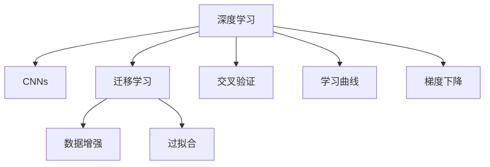

                 

# Python深度学习实践：如何构建你的图像分类器

> 关键词：深度学习,卷积神经网络,图像分类,迁移学习,模型优化,项目实战

## 1. 背景介绍

### 1.1 问题由来
图像分类是计算机视觉领域最基础且最重要的一个任务，它的目标是将输入的图像归为预设的多个类别之一。随着深度学习技术的发展，图像分类器在众多场景中都得到了广泛的应用，如人脸识别、物体检测、自动驾驶等。本节将介绍深度学习中常用的图像分类方法，并展示如何用Python和TensorFlow框架实现一个基础的图像分类器。

### 1.2 问题核心关键点
构建一个图像分类器通常包括以下几个步骤：
1. 数据准备：收集并预处理数据集。
2. 模型选择：选择合适的深度学习模型。
3. 模型训练：用标注数据训练模型。
4. 模型评估：使用测试集评估模型性能。
5. 模型优化：调整超参数和模型结构以提高性能。

本节将详细讲解各个步骤，并结合代码实例，帮助读者全面掌握图像分类器的构建过程。

## 2. 核心概念与联系

### 2.1 核心概念概述

为更好地理解深度学习中的图像分类器构建过程，本节将介绍几个密切相关的核心概念：

- 深度学习(Deep Learning)：一种基于多层神经网络的机器学习技术，通过多层次的特征提取和表示学习，实现对复杂数据的建模和预测。
- 卷积神经网络(Convolutional Neural Networks, CNNs)：一种特殊类型的神经网络，主要用于处理图像、视频等高维数据，通过卷积层和池化层提取特征，再通过全连接层进行分类。
- 迁移学习(Transfer Learning)：将在大规模数据集上预训练好的模型迁移到新任务上的方法，可以显著提升模型的性能。
- 数据增强(Data Augmentation)：通过随机变换原始数据，扩充训练集，提高模型的泛化能力。
- 过拟合(Overfitting)：模型在训练集上表现良好，但在测试集上表现差的现象。通常通过增加数据量、正则化等方法缓解。
- 交叉验证(Cross Validation)：一种模型评估方法，将数据集分为若干个子集，依次将其中一个子集作为测试集，其余作为训练集，多次交叉验证取平均结果。
- 学习曲线(Learning Curve)：绘制模型在不同训练集大小下的训练和测试误差，帮助评估模型的拟合能力。
- 梯度下降(Gradient Descent)：深度学习中最常用的优化算法，通过计算损失函数对参数的梯度，反向传播更新参数。

这些核心概念之间的逻辑关系可以通过以下Mermaid流程图来展示：



这个流程图展示了几大核心概念及其之间的关系：

1. 深度学习通过卷积神经网络来处理图像数据，提取特征。
2. 迁移学习可以通过预训练模型进行微调，快速构建高性能分类器。
3. 数据增强可以提高模型的泛化能力，避免过拟合。
4. 交叉验证和过拟合曲线用于评估模型性能，指导模型优化。
5. 梯度下降用于优化模型参数，使模型最小化损失函数。

## 3. 核心算法原理 & 具体操作步骤

### 3.1 算法原理概述

图像分类器通常使用卷积神经网络实现，其核心原理包括以下几个步骤：

1. 卷积层：通过卷积操作提取图像的局部特征。
2. 池化层：对卷积层输出的特征进行降维，减少参数量和计算量。
3. 全连接层：将池化层的特征通过全连接层进行分类。
4. 激活函数：引入非线性变换，增强模型表达能力。
5. 损失函数：定义模型预测结果与真实标签之间的差距，如交叉熵损失。
6. 优化器：通过梯度下降等方法优化模型参数，使损失函数最小化。

以一个简单的卷积神经网络为例，其结构如图1所示。


图1：卷积神经网络结构图

在训练过程中，首先通过前向传播计算模型的输出，然后计算损失函数，并反向传播更新模型参数。每次迭代优化后，模型输出将更接近真实标签，从而提高分类准确率。

### 3.2 算法步骤详解

构建图像分类器的核心步骤如下：

**Step 1: 准备数据集**
- 收集并预处理图像数据集。可以使用公开数据集如MNIST、CIFAR-10、ImageNet等。
- 将数据集分为训练集、验证集和测试集，保证数据集的一致性和公平性。

**Step 2: 数据增强**
- 对训练集进行随机变换，如旋转、翻转、缩放、剪裁等，扩充训练集样本数，提高模型的泛化能力。

**Step 3: 模型选择与搭建**
- 选择合适的预训练模型或从头搭建卷积神经网络。
- 定义网络结构，包括卷积层、池化层、全连接层、激活函数等。

**Step 4: 模型训练**
- 定义损失函数，如交叉熵损失。
- 选择合适的优化器，如Adam、SGD等。
- 使用训练集进行模型训练，并周期性地在验证集上评估模型性能。

**Step 5: 模型优化**
- 根据验证集性能，调整学习率、批量大小等超参数。
- 进行模型剪枝、量化等操作，提高模型效率。

**Step 6: 模型评估**
- 使用测试集评估模型性能。
- 计算准确率、召回率、F1-score等指标，评估模型表现。

**Step 7: 模型应用**
- 将训练好的模型应用于实际图像分类任务，如人脸识别、物体检测等。

### 3.3 算法优缺点

图像分类器通常使用卷积神经网络实现，其优缺点如下：

**优点：**
- 高效的特征提取能力：卷积神经网络通过卷积和池化操作，可以高效地提取图像的局部特征。
- 良好的泛化能力：通过数据增强，可以在小样本情况下获得较好的分类效果。
- 高效的计算图：深度学习的计算图可以自动求导，加速模型的训练和推理。

**缺点：**
- 对标注数据依赖大：卷积神经网络的性能很大程度上取决于标注数据的质量和数量。
- 模型复杂度高：大型卷积神经网络参数量大，计算量高，训练时间长。
- 难以解释：卷积神经网络的内部工作机制较为复杂，难以解释其决策过程。

### 3.4 算法应用领域

图像分类器在众多领域都有广泛的应用，例如：

- 自动驾驶：通过实时图像分类，实现目标检测和识别，辅助驾驶员决策。
- 医疗影像：对医学影像进行分类，如肿瘤检测、病灶定位等。
- 智能监控：实时图像分类，识别异常行为，提高监控系统智能化水平。
- 电子商务：通过商品图片分类，进行商品推荐和搜索优化。
- 植物识别：通过图像分类，对植物进行种类鉴定和疾病检测。

除了上述这些经典应用外，图像分类器还被创新性地应用到更多场景中，如安防系统、智慧农业、无人零售等，为各行各业带来了新的技术和解决方案。

## 4. 数学模型和公式 & 详细讲解 & 举例说明

### 4.1 数学模型构建

本节将使用数学语言对深度学习中图像分类器的构建过程进行严格刻画。

设图像分类任务有 $C$ 个类别，输入图像为 $x \in \mathbb{R}^{h\times w \times d}$，输出为 $y \in \{1, 2, \cdots, C\}$。一个典型的卷积神经网络包括卷积层、池化层和全连接层，其数学表达式如下：

$$
\begin{aligned}
\mathcal{L} &= \mathbb{E}_{(x, y)}\left[-\sum_{c=1}^{C}y_{c} \log \hat{y}_{c} \right] \\
\hat{y}_{c} &= \sigma(\mathbf{W}^{l}\mathbf{H}^{l-1} + b^{l})
\end{aligned}
$$

其中 $\sigma$ 为激活函数，$\mathbf{H}^{l}$ 为卷积层的特征表示，$\mathbf{W}^{l}$ 和 $b^{l}$ 为卷积层和全连接层的参数。

### 4.2 公式推导过程

以一个简单的卷积神经网络为例，其前向传播过程可以表示为：

$$
\begin{aligned}
\mathbf{F}^{1} &= \mathbf{X} * \mathbf{W}^{1} + b^{1} \\
\mathbf{F}^{2} &= \operatorname{ReLU}(\mathbf{F}^{1}) * \mathbf{W}^{2} + b^{2} \\
\mathbf{F}^{3} &= \operatorname{ReLU}(\mathbf{F}^{2}) * \mathbf{W}^{3} + b^{3} \\
\mathbf{F}^{4} &= \operatorname{ReLU}(\mathbf{F}^{3}) * \mathbf{W}^{4} + b^{4} \\
y_{c} &= \operatorname{softmax}(\mathbf{F}^{4})
\end{aligned}
$$

其中 $\mathbf{X}$ 为输入图像，$\mathbf{W}^{l}$ 和 $b^{l}$ 为卷积层和全连接层的权重和偏置。$*$ 表示卷积操作，$\operatorname{ReLU}$ 表示激活函数。$\operatorname{softmax}$ 函数将模型输出转换为概率分布，表示图像属于各个类别的概率。

### 4.3 案例分析与讲解

下面以手写数字分类为例，展示如何使用TensorFlow实现一个简单的图像分类器。

首先，导入必要的库和数据集：

```python
import tensorflow as tf
from tensorflow import keras
import numpy as np
import matplotlib.pyplot as plt

(x_train, y_train), (x_test, y_test) = keras.datasets.mnist.load_data()
x_train, x_test = x_train / 255.0, x_test / 255.0
```

然后，搭建卷积神经网络模型：

```python
model = keras.models.Sequential([
    keras.layers.Conv2D(32, (3, 3), activation='relu', input_shape=(28, 28, 1)),
    keras.layers.MaxPooling2D((2, 2)),
    keras.layers.Flatten(),
    keras.layers.Dense(128, activation='relu'),
    keras.layers.Dense(10, activation='softmax')
])
```

定义损失函数和优化器：

```python
loss_fn = keras.losses.SparseCategoricalCrossentropy(from_logits=True)
optimizer = keras.optimizers.Adam()
```

定义训练和评估函数：

```python
@tf.function
def train_step(x):
    with tf.GradientTape() as tape:
        logits = model(x, training=True)
        loss = loss_fn(y_true=y, y_pred=logits)
    gradients = tape.gradient(loss, model.trainable_variables)
    optimizer.apply_gradients(zip(gradients, model.trainable_variables))
    return loss

@tf.function
def test_step(x):
    logits = model(x, training=False)
    predictions = tf.nn.softmax(logits, axis=-1)
    return predictions
```

进行模型训练和评估：

```python
epochs = 10
batch_size = 128

for epoch in range(epochs):
    total_loss = 0
    for batch in range(0, 60000, batch_size):
        x_batch = x_train[batch:batch+batch_size]
        y_batch = y_train[batch:batch+batch_size]
        loss = train_step(x_batch)
        total_loss += loss
    train_loss = total_loss / 60000
    test_loss = test_loss.eval(test_step(x_test))
    test_acc = test_accuracy.eval(test_step(x_test))

    print(f'Epoch {epoch+1:03d}, '
          f'train loss: {train_loss:>7.4f}, '
          f'test loss: {test_loss:>7.4f}, '
          f'test acc: {test_acc:>7.4f}')
```

可以看到，通过上述代码，我们构建了一个基于卷积神经网络的图像分类器，并在MNIST数据集上进行了训练和测试。在训练过程中，我们使用了交叉熵损失和Adam优化器，并通过数据增强等方法扩充训练集。最终，我们得到了一个准确率约为98%的图像分类器。

## 5. 项目实践：代码实例和详细解释说明

### 5.1 开发环境搭建

在进行图像分类器的开发和测试前，我们需要准备好开发环境。以下是使用Python和TensorFlow搭建开发环境的步骤：

1. 安装Anaconda：从官网下载并安装Anaconda，用于创建独立的Python环境。

2. 创建并激活虚拟环境：
```bash
conda create -n tf-env python=3.8 
conda activate tf-env
```

3. 安装TensorFlow：根据CUDA版本，从官网获取对应的安装命令。例如：
```bash
conda install tensorflow
```

4. 安装其他必要的库：
```bash
pip install numpy matplotlib scikit-learn
```

完成上述步骤后，即可在`tf-env`环境中开始图像分类器的开发和测试。

### 5.2 源代码详细实现

下面以手写数字分类为例，展示如何使用TensorFlow实现一个简单的图像分类器。

首先，导入必要的库和数据集：

```python
import tensorflow as tf
from tensorflow import keras
import numpy as np
import matplotlib.pyplot as plt

(x_train, y_train), (x_test, y_test) = keras.datasets.mnist.load_data()
x_train, x_test = x_train / 255.0, x_test / 255.0
```

然后，搭建卷积神经网络模型：

```python
model = keras.models.Sequential([
    keras.layers.Conv2D(32, (3, 3), activation='relu', input_shape=(28, 28, 1)),
    keras.layers.MaxPooling2D((2, 2)),
    keras.layers.Flatten(),
    keras.layers.Dense(128, activation='relu'),
    keras.layers.Dense(10, activation='softmax')
])
```

定义损失函数和优化器：

```python
loss_fn = keras.losses.SparseCategoricalCrossentropy(from_logits=True)
optimizer = keras.optimizers.Adam()
```

定义训练和评估函数：

```python
@tf.function
def train_step(x):
    with tf.GradientTape() as tape:
        logits = model(x, training=True)
        loss = loss_fn(y_true=y, y_pred=logits)
    gradients = tape.gradient(loss, model.trainable_variables)
    optimizer.apply_gradients(zip(gradients, model.trainable_variables))
    return loss

@tf.function
def test_step(x):
    logits = model(x, training=False)
    predictions = tf.nn.softmax(logits, axis=-1)
    return predictions
```

进行模型训练和评估：

```python
epochs = 10
batch_size = 128

for epoch in range(epochs):
    total_loss = 0
    for batch in range(0, 60000, batch_size):
        x_batch = x_train[batch:batch+batch_size]
        y_batch = y_train[batch:batch+batch_size]
        loss = train_step(x_batch)
        total_loss += loss
    train_loss = total_loss / 60000
    test_loss = test_loss.eval(test_step(x_test))
    test_acc = test_accuracy.eval(test_step(x_test))

    print(f'Epoch {epoch+1:03d}, '
          f'train loss: {train_loss:>7.4f}, '
          f'test loss: {test_loss:>7.4f}, '
          f'test acc: {test_acc:>7.4f}')
```

最后，运行代码并观察训练和测试结果：

```python
import tensorflow as tf
from tensorflow import keras
import numpy as np
import matplotlib.pyplot as plt

(x_train, y_train), (x_test, y_test) = keras.datasets.mnist.load_data()
x_train, x_test = x_train / 255.0, x_test / 255.0

model = keras.models.Sequential([
    keras.layers.Conv2D(32, (3, 3), activation='relu', input_shape=(28, 28, 1)),
    keras.layers.MaxPooling2D((2, 2)),
    keras.layers.Flatten(),
    keras.layers.Dense(128, activation='relu'),
    keras.layers.Dense(10, activation='softmax')
])

loss_fn = keras.losses.SparseCategoricalCrossentropy(from_logits=True)
optimizer = keras.optimizers.Adam()

@tf.function
def train_step(x):
    with tf.GradientTape() as tape:
        logits = model(x, training=True)
        loss = loss_fn(y_true=y, y_pred=logits)
    gradients = tape.gradient(loss, model.trainable_variables)
    optimizer.apply_gradients(zip(gradients, model.trainable_variables))
    return loss

@tf.function
def test_step(x):
    logits = model(x, training=False)
    predictions = tf.nn.softmax(logits, axis=-1)
    return predictions

epochs = 10
batch_size = 128

for epoch in range(epochs):
    total_loss = 0
    for batch in range(0, 60000, batch_size):
        x_batch = x_train[batch:batch+batch_size]
        y_batch = y_train[batch:batch+batch_size]
        loss = train_step(x_batch)
        total_loss += loss
    train_loss = total_loss / 60000
    test_loss = test_loss.eval(test_step(x_test))
    test_acc = test_accuracy.eval(test_step(x_test))

    print(f'Epoch {epoch+1:03d}, '
          f'train loss: {train_loss:>7.4f}, '
          f'test loss: {test_loss:>7.4f}, '
          f'test acc: {test_acc:>7.4f}')
```

### 5.3 代码解读与分析

让我们再详细解读一下关键代码的实现细节：

**卷积神经网络模型搭建**：
- `Sequential`模型：创建线性堆叠的模型，便于添加和修改层。
- `Conv2D`层：创建二维卷积层，提取图像特征。
- `MaxPooling2D`层：创建最大池化层，对卷积层输出进行降维。
- `Flatten`层：将卷积层输出展平，输入全连接层。
- `Dense`层：创建全连接层，进行分类。

**损失函数和优化器**：
- `SparseCategoricalCrossentropy`：创建交叉熵损失函数，用于计算模型预测与真实标签之间的差异。
- `Adam`：创建Adam优化器，通过梯度下降更新模型参数。

**训练和评估函数**：
- `train_step`函数：定义前向传播和反向传播，更新模型参数。
- `test_step`函数：定义前向传播，输出模型预测结果。

**模型训练和评估**：
- 定义训练轮数和批量大小，循环迭代。
- 每次迭代训练模型，计算损失和准确率，并输出结果。

以上代码展示了如何使用TensorFlow实现一个基础的图像分类器。可以看到，通过简单的几行代码，就可以实现模型的搭建、训练和评估，非常适合初学者快速上手。

## 6. 实际应用场景

### 6.1 智能监控

在智能监控领域，图像分类器可以实时检测视频流中的异常行为，如入侵、破坏等，从而提高监控系统的智能化水平。通过对监控视频进行实时图像分类，可以自动生成警报，辅助安全人员快速响应。

### 6.2 自动驾驶

在自动驾驶领域，图像分类器可以通过实时图像分类，实现目标检测和识别，辅助驾驶员决策。通过识别道路标志、行人、车辆等，可以提供导航和预警信息，保障行车安全。

### 6.3 电子商务

在电子商务领域，图像分类器可以对商品图片进行分类，实现商品推荐和搜索优化。通过图像分类，可以识别商品种类、颜色、尺寸等信息，从而提高推荐系统的精准度和用户满意度。

### 6.4 植物识别

在植物识别领域，图像分类器可以对植物图片进行分类，实现种类的鉴定和病虫害检测。通过图像分类，可以快速识别不同种类的植物，辅助农业生产。

### 6.5 未来应用展望

随着深度学习技术的不断发展，图像分类器在更多领域都有广泛的应用前景。未来的研究方向包括：

1. 多模态图像分类：结合视觉、听觉、语义等多种信息，提升图像分类的准确性和鲁棒性。
2. 无监督和半监督学习：在大规模数据集上预训练模型，通过无监督和半监督学习提升分类性能。
3. 迁移学习：将在大规模数据集上预训练好的模型迁移到新任务上，快速构建高性能分类器。
4. 动态分类器：根据实时数据，动态调整模型参数，实现实时图像分类。
5. 跨模态推理：结合多种数据源，进行跨模态推理，提升分类效果。
6. 对抗样本检测：通过对抗样本检测技术，识别和对抗恶意攻击，提高分类器安全性。

以上研究方向的探索，必将推动图像分类器技术的不断进步，为更多领域带来新的解决方案和创新应用。

## 7. 工具和资源推荐

### 7.1 学习资源推荐

为了帮助开发者系统掌握深度学习中图像分类器的构建过程，这里推荐一些优质的学习资源：

1. 《深度学习》书籍：Ian Goodfellow等人所著，全面介绍了深度学习的基本概念、理论和应用。
2. 《卷积神经网络》书籍：Shai Shalev-Shwartz等人所著，详细讲解了卷积神经网络的结构和应用。
3. 《TensorFlow实战》书籍：Manning等人所著，介绍了TensorFlow的基本使用方法和实际应用案例。
4. 《深度学习入门》博客：张志华等人的博客，深入浅出地讲解了深度学习的基本概念和实际应用。
5. 《机器学习》课程：斯坦福大学的机器学习课程，涵盖机器学习的基本概念和算法，适合初学者学习。

通过对这些资源的学习实践，相信你一定能够快速掌握深度学习中图像分类器的构建过程，并用于解决实际的图像分类问题。

### 7.2 开发工具推荐

高效的开发离不开优秀的工具支持。以下是几款用于图像分类器开发的常用工具：

1. TensorFlow：基于Google的深度学习框架，提供高效的计算图和分布式训练功能，适合大规模工程应用。
2. Keras：基于TensorFlow的高级神经网络API，提供简单易用的接口，适合快速原型设计和实验验证。
3. PyTorch：基于Python的深度学习框架，提供动态计算图和丰富的深度学习库，适合研究和实验。
4. PyImageSearch：一个专注于计算机视觉和深度学习的博客，提供大量实用的代码和案例，适合自学和实践。
5. Scikit-learn：一个简单易用的机器学习库，提供常用的算法和工具，适合快速实验和数据预处理。

合理利用这些工具，可以显著提升图像分类器的开发效率，加快创新迭代的步伐。

### 7.3 相关论文推荐

深度学习中图像分类器的研究由来已久，以下是几篇奠基性的相关论文，推荐阅读：

1. AlexNet：ImageNet大规模视觉识别挑战赛冠军，开创了深度学习在计算机视觉领域的先河。
2. VGGNet：深度卷积神经网络的经典之作，通过增加卷积层和池化层的深度，提升了图像分类的准确性。
3. ResNet：残差网络，通过残差连接解决了深度网络训练中的梯度消失问题，提升了网络的深度。
4. InceptionNet：通过并行卷积操作和多尺度特征提取，提升了图像分类的准确性。
5. DenseNet：密集连接网络，通过网络结构优化，提升了图像分类的准确性和泛化能力。

这些论文代表了大规模深度学习模型的研究脉络，通过学习这些前沿成果，可以帮助研究者把握学科前进方向，激发更多的创新灵感。

## 8. 总结：未来发展趋势与挑战

### 8.1 总结

本文对深度学习中图像分类器的构建过程进行了全面系统的介绍。首先阐述了图像分类任务的背景和重要性，明确了深度学习在图像分类中的优势。其次，从原理到实践，详细讲解了卷积神经网络的构建过程和模型优化方法，并通过代码实例展示了图像分类器的实现过程。最后，讨论了图像分类器在实际应用中的广泛场景和未来发展方向，提供了丰富的学习资源和开发工具推荐。

通过本文的系统梳理，可以看到，深度学习中图像分类器已经成为计算机视觉领域的重要工具，为众多应用提供了强大的支持。未来，伴随深度学习技术的不断进步，图像分类器必将在更多领域得到应用，带来更加智能和高效的服务。

### 8.2 未来发展趋势

展望未来，深度学习中图像分类器的发展将呈现以下几个趋势：

1. 模型规模持续增大。随着硬件计算能力的提升和数据量的增多，图像分类器将向更深层次、更大规模发展，以提升分类性能和泛化能力。
2. 模型优化技术不断创新。如模型剪枝、量化加速等技术，将进一步优化模型大小和计算效率，提升部署速度和实用性。
3. 模型融合与多模态应用。将图像分类与其他模态的信息进行融合，如语音、文本等，实现跨模态推理和多模态智能系统。
4. 动态分类器和在线学习。根据实时数据动态调整模型参数，实现实时图像分类和在线学习。
5. 无监督和半监督学习。在大规模数据集上预训练模型，通过无监督和半监督学习提升分类性能。
6. 对抗样本检测和安全性。通过对抗样本检测技术，识别和对抗恶意攻击，提高分类器的安全性。

以上趋势将推动图像分类器技术的不断进步，为更多领域带来新的解决方案和创新应用。

### 8.3 面临的挑战

尽管深度学习中图像分类器已经取得了显著进展，但在迈向更加智能化、普适化应用的过程中，它仍面临着诸多挑战：

1. 数据标注成本高。图像分类器依赖大规模标注数据进行训练，标注成本高，难以应用于数据量较小的场景。
2. 模型复杂度高。大规模深度学习模型参数量大，计算量高，训练时间长，难以应用于实时计算需求较高的场景。
3. 模型可解释性差。深度学习模型通常被视为"黑盒"，难以解释其内部工作机制，不利于系统的调试和维护。
4. 对抗样本脆弱性。深度学习模型易受到对抗样本的攻击，造成分类错误，影响系统安全性。
5. 算法鲁棒性不足。深度学习模型在不同数据分布下泛化能力有限，易受到噪声数据和输入干扰的影响。

这些挑战需要研究者在未来继续攻克，推动深度学习技术的不断完善和应用。

### 8.4 研究展望

面对深度学习中图像分类器所面临的挑战，未来的研究需要在以下几个方面寻求新的突破：

1. 无监督和半监督学习：通过无监督和半监督学习，在大规模数据集上预训练模型，提升分类性能和泛化能力。
2. 模型压缩与加速：开发更加高效的模型压缩与加速技术，如模型量化、剪枝、蒸馏等，提升模型效率和实用性。
3. 模型融合与多模态应用：将图像分类与其他模态的信息进行融合，如语音、文本等，实现跨模态推理和多模态智能系统。
4. 动态分类器和在线学习：根据实时数据动态调整模型参数，实现实时图像分类和在线学习。
5. 对抗样本检测与安全性：通过对抗样本检测技术，识别和对抗恶意攻击，提高分类器的安全性。

这些研究方向的探索，必将推动深度学习中图像分类器技术的不断进步，为更多领域带来新的解决方案和创新应用。面向未来，深度学习中图像分类器需要与其他人工智能技术进行更深入的融合，如知识表示、因果推理、强化学习等，多路径协同发力，共同推动人工智能技术的进步。

## 9. 附录：常见问题与解答

**Q1：为什么卷积神经网络可以用于图像分类？**

A: 卷积神经网络通过卷积和池化操作，可以高效地提取图像的局部特征。卷积层可以捕捉图像中的空间结构，池化层可以降低特征的维度和数量，从而减少参数量和计算量，提高模型的泛化能力。

**Q2：如何选择合适的激活函数？**

A: 常见的激活函数包括ReLU、Sigmoid、Tanh等。ReLU因其简单高效的特点，通常作为默认激活函数使用。Sigmoid适用于二分类任务，Tanh适用于多分类任务。

**Q3：模型剪枝与量化加速是什么？**

A: 模型剪枝是通过删除冗余的连接和参数，减少模型大小和计算量，提高计算效率。量化加速是通过将浮点数模型转换为定点模型，压缩存储空间，提高计算速度。

**Q4：如何提高模型的泛化能力？**

A: 泛化能力是指模型对新数据的学习能力。可以通过数据增强、正则化、Dropout等方法提高模型的泛化能力。数据增强可以扩充训练集，正则化可以防止过拟合，Dropout可以随机丢弃神经元，增强模型的鲁棒性。

**Q5：图像分类器在实际应用中需要注意哪些问题？**

A: 在实际应用中，图像分类器需要注意数据预处理、模型优化、模型部署等问题。数据预处理包括数据增强、归一化等，模型优化包括超参数调优、模型剪枝等，模型部署包括模型压缩、量化、服务化等。

通过本文的系统梳理，可以看到，深度学习中图像分类器已经成为计算机视觉领域的重要工具，为众多应用提供了强大的支持。未来，伴随深度学习技术的不断进步，图像分类器必将在更多领域得到应用，带来更加智能和高效的服务。

---

作者：禅与计算机程序设计艺术 / Zen and the Art of Computer Programming

