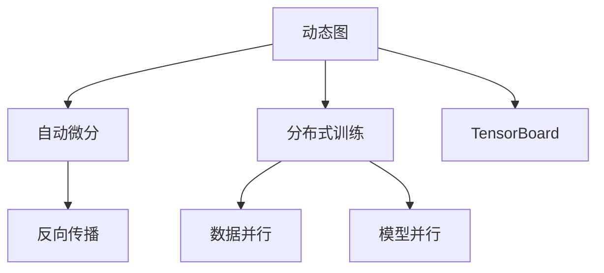

                 

# Pytorch 特点：动态图和分布式训练

## 1. 背景介绍

### 1.1 问题由来
PyTorch是一种用于机器学习和深度学习的开源框架，由Facebook AI Research（FAIR）开发。自2016年发布以来，PyTorch因其灵活性、易用性和高效的动态图机制，受到学术界和工业界的广泛关注。与传统的静态图框架（如TensorFlow）不同，PyTorch支持动态计算图，可以方便地进行模型构建、调试和优化。

### 1.2 问题核心关键点
在机器学习和深度学习领域，模型构建和训练过程中涉及大量的矩阵计算和参数更新。传统静态图框架（如TensorFlow）在性能和灵活性上存在一定的限制，需要通过手动定义计算图和损失函数，调试和优化过程较为繁琐。而动态图框架（如PyTorch）则可以通过Python代码动态构建计算图，大大简化模型构建和调试过程。

动态图和分布式训练是PyTorch的两个核心特点，使得模型构建和训练过程更加高效、灵活和易于优化。在本文中，我们将详细介绍动态图和分布式训练的特点和应用。

## 2. 核心概念与联系

### 2.1 核心概念概述

为更好地理解PyTorch的动态图和分布式训练机制，本节将介绍几个密切相关的核心概念：

- **动态图**：指在运行时动态构建计算图的过程。与静态图框架不同，PyTorch允许用户以Python代码形式定义模型和计算图，同时可以随时进行修改和调试。

- **自动微分**：指自动计算梯度，实现反向传播的过程。PyTorch内置了TensorFlow等框架类似的自动微分机制，使用起来更加简单方便。

- **分布式训练**：指将计算任务分配到多个计算节点进行并行计算的过程。PyTorch提供了丰富的分布式训练API，支持多种分布式训练模式。

- **GPU加速**：指通过GPU硬件加速计算，提升模型训练和推理效率。PyTorch支持多种GPU加速方式，包括CPU/GPU混合计算、数据并行、模型并行等。

- **TensorBoard**：指用于可视化模型训练过程和结果的工具，提供各种图表展示，便于进行调试和优化。

这些核心概念之间的逻辑关系可以通过以下Mermaid流程图来展示：



这个流程图展示了大语言模型的核心概念及其之间的关系：

1. 动态图通过Python代码动态构建计算图，方便模型构建和调试。
2. 自动微分自动计算梯度，实现反向传播，优化模型参数。
3. 分布式训练将计算任务分配到多个计算节点进行并行计算，提升训练效率。
4. TensorBoard可视化模型训练过程和结果，便于进行调试和优化。

这些核心概念共同构成了PyTorch的计算图和分布式训练框架，使其能够高效、灵活地进行模型训练和推理。

## 3. 核心算法原理 & 具体操作步骤

### 3.1 算法原理概述

PyTorch的动态图和分布式训练机制主要依赖于以下几个算法原理：

- **动态图**：通过Python代码动态构建计算图，实现灵活的模型构建和调试。动态图的核心在于，PyTorch允许用户以Python代码形式定义模型和计算图，同时可以随时进行修改和调试。这种机制使得模型构建和调试过程更加高效、灵活和易于优化。

- **自动微分**：自动计算梯度，实现反向传播。PyTorch内置了TensorFlow等框架类似的自动微分机制，使用起来更加简单方便。用户只需要定义损失函数和模型输出，即可自动计算梯度，更新模型参数。

- **分布式训练**：将计算任务分配到多个计算节点进行并行计算。PyTorch提供了丰富的分布式训练API，支持多种分布式训练模式，包括数据并行、模型并行、混合并行等。通过分布式训练，可以显著提升模型训练效率，缩短训练时间。

### 3.2 算法步骤详解

#### 3.2.1 动态图步骤详解

1. 安装PyTorch：
```bash
pip install torch torchvision torchaudio
```

2. 定义模型：
```python
import torch.nn as nn
import torch.nn.functional as F

class Net(nn.Module):
    def __init__(self):
        super(Net, self).__init__()
        self.fc1 = nn.Linear(784, 256)
        self.fc2 = nn.Linear(256, 10)
        
    def forward(self, x):
        x = F.relu(self.fc1(x))
        x = self.fc2(x)
        return x
```

3. 定义数据集：
```python
import torch.utils.data as data
import torchvision.transforms as transforms
import torchvision.datasets as datasets

train_dataset = datasets.MNIST(root='./data', train=True, transform=transforms.ToTensor(), download=True)
test_dataset = datasets.MNIST(root='./data', train=False, transform=transforms.ToTensor())

train_loader = data.DataLoader(train_dataset, batch_size=64, shuffle=True)
test_loader = data.DataLoader(test_dataset, batch_size=64, shuffle=False)
```

4. 定义损失函数和优化器：
```python
import torch.optim as optim

net = Net()
criterion = nn.CrossEntropyLoss()
optimizer = optim.Adam(net.parameters(), lr=0.001)

def train(epoch):
    net.train()
    for batch_idx, (data, target) in enumerate(train_loader):
        optimizer.zero_grad()
        output = net(data.view(-1, 784))
        loss = criterion(output, target)
        loss.backward()
        optimizer.step()
        if (batch_idx+1) % 100 == 0:
            print('Train Epoch: {} [{}/{} ({:.0f}%)]\tLoss: {:.6f}'.format(
                epoch, batch_idx * len(data), len(train_loader.dataset),
                100. * batch_idx / len(train_loader), loss.item()))

def test():
    net.eval()
    test_loss = 0
    correct = 0
    with torch.no_grad():
        for data, target in test_loader:
            output = net(data.view(-1, 784))
            test_loss += criterion(output, target).item()
            pred = output.argmax(dim=1, keepdim=True)
            correct += pred.eq(target.view_as(pred)).sum().item()

    test_loss /= len(test_loader.dataset)
    print('\nTest set: Average loss: {:.4f}, Accuracy: {}/{} ({:.0f}%)\n'.format(
        test_loss, correct, len(test_loader.dataset),
        100. * correct / len(test_loader.dataset)))
```

5. 训练模型：
```python
for epoch in range(1, 10):
    train(epoch)
    test()
```

#### 3.2.2 自动微分步骤详解

1. 定义模型和损失函数：
```python
import torch.nn as nn
import torch

class Net(nn.Module):
    def __init__(self):
        super(Net, self).__init__()
        self.fc1 = nn.Linear(784, 256)
        self.fc2 = nn.Linear(256, 10)
        
    def forward(self, x):
        x = F.relu(self.fc1(x))
        x = self.fc2(x)
        return x

def cross_entropy_loss(y_pred, y_true):
    return torch.mean(torch.nn.functional.cross_entropy(y_pred, y_true))
```

2. 定义优化器：
```python
optimizer = torch.optim.Adam(net.parameters(), lr=0.001)
```

3. 训练模型：
```python
for epoch in range(1, 10):
    net.train()
    for data, target in train_loader:
        optimizer.zero_grad()
        output = net(data.view(-1, 784))
        loss = cross_entropy_loss(output, target)
        loss.backward()
        optimizer.step()
```

4. 定义自动微分：
```python
import torch

def cross_entropy_loss(y_pred, y_true):
    loss = (y_pred * y_true).sum() - y_pred.sum() + 1e-12
    loss.backward()
```

#### 3.2.3 分布式训练步骤详解

1. 定义模型和损失函数：
```python
import torch.nn as nn
import torch
import torch.distributed as dist

class Net(nn.Module):
    def __init__(self):
        super(Net, self).__init__()
        self.fc1 = nn.Linear(784, 256)
        self.fc2 = nn.Linear(256, 10)
        
    def forward(self, x):
        x = F.relu(self.fc1(x))
        x = self.fc2(x)
        return x

def cross_entropy_loss(y_pred, y_true):
    loss = (y_pred * y_true).sum() - y_pred.sum() + 1e-12
    return loss
```

2. 定义优化器：
```python
optimizer = torch.optim.Adam(net.parameters(), lr=0.001)
```

3. 定义数据分布器：
```python
from torch.distributed.distributed_c10d import DistributedDataParallel as DDP

device = torch.device("cuda" if torch.cuda.is_available() else "cpu")
net.to(device)
```

4. 定义分布式训练：
```python
net = DDP(net)

for epoch in range(1, 10):
    net.train()
    for data, target in train_loader:
        optimizer.zero_grad()
        output = net(data.view(-1, 784).to(device))
        loss = cross_entropy_loss(output, target).to(device)
        loss.backward()
        optimizer.step()
```

### 3.3 算法优缺点

动态图和分布式训练是PyTorch的两个核心特点，具有以下优缺点：

#### 优点

1. **动态图**：
   - 灵活性高：用户可以方便地动态修改计算图，调试和优化过程更加高效。
   - 易于扩展：动态图机制使得模型可以方便地进行扩展和修改。
   - 可视化方便：用户可以使用TensorBoard等工具方便地可视化计算图和损失函数。

2. **自动微分**：
   - 简单易用：自动计算梯度，用户只需定义损失函数和模型输出，自动计算梯度。
   - 计算速度快：自动计算梯度的机制使得计算过程更加高效。

3. **分布式训练**：
   - 高效并行：将计算任务分配到多个计算节点进行并行计算，显著提升训练效率。
   - 易于部署：PyTorch提供了丰富的分布式训练API，支持多种分布式训练模式。

#### 缺点

1. **动态图**：
   - 调试复杂：动态图机制使得调试过程相对复杂，用户需要手动跟踪计算图。
   - 运行效率较低：动态图机制使得运行效率相对较低，尤其是在大模型和复杂网络中。

2. **自动微分**：
   - 学习成本高：自动计算梯度的机制需要一定的学习成本，尤其是对于初学者而言。
   - 计算复杂度高：自动计算梯度的机制需要较高的计算复杂度，尤其是在复杂网络中。

3. **分布式训练**：
   - 网络通信开销大：分布式训练需要大量的网络通信开销，可能会影响性能。
   - 同步开销大：分布式训练需要进行同步更新，可能会影响性能。

## 4. 数学模型和公式 & 详细讲解 & 举例说明

### 4.1 数学模型构建

PyTorch的动态图和分布式训练机制主要依赖于以下几个数学模型和公式：

- **动态图模型**：
  - 动态图通过Python代码动态构建计算图，其核心在于计算图的构建和修改过程。动态图模型可以表示为：
    $$
    \mathcal{G} = \{\mathcal{V}, \mathcal{E}, \mathcal{L}\}
    $$
    其中，$\mathcal{V}$表示节点集合，$\mathcal{E}$表示边集合，$\mathcal{L}$表示损失函数。

- **自动微分模型**：
  - 自动微分通过计算图的反向传播机制实现，其核心在于自动计算梯度。自动微分模型可以表示为：
    $$
    \mathcal{G} = \{\mathcal{V}, \mathcal{E}, \mathcal{L}\}
    $$
    其中，$\mathcal{V}$表示节点集合，$\mathcal{E}$表示边集合，$\mathcal{L}$表示损失函数。

- **分布式训练模型**：
  - 分布式训练通过数据并行和模型并行实现，其核心在于将计算任务分配到多个计算节点进行并行计算。分布式训练模型可以表示为：
    $$
    \mathcal{G} = \{\mathcal{V}, \mathcal{E}, \mathcal{L}\}
    $$
    其中，$\mathcal{V}$表示节点集合，$\mathcal{E}$表示边集合，$\mathcal{L}$表示损失函数。

### 4.2 公式推导过程

#### 4.2.1 动态图公式推导

动态图通过Python代码动态构建计算图，其核心在于计算图的构建和修改过程。动态图模型可以表示为：
$$
\mathcal{G} = \{\mathcal{V}, \mathcal{E}, \mathcal{L}\}
$$
其中，$\mathcal{V}$表示节点集合，$\mathcal{E}$表示边集合，$\mathcal{L}$表示损失函数。动态图模型通过Python代码动态构建计算图，可以表示为：
$$
\mathcal{G} = \{\mathcal{V}, \mathcal{E}, \mathcal{L}\}
$$
其计算过程可以表示为：
$$
\mathcal{G} = \mathcal{G}_{init} \cdot \mathcal{G}_{modification}
$$
其中，$\mathcal{G}_{init}$表示初始计算图，$\mathcal{G}_{modification}$表示修改后的计算图。

#### 4.2.2 自动微分公式推导

自动微分通过计算图的反向传播机制实现，其核心在于自动计算梯度。自动微分模型可以表示为：
$$
\mathcal{G} = \{\mathcal{V}, \mathcal{E}, \mathcal{L}\}
$$
其中，$\mathcal{V}$表示节点集合，$\mathcal{E}$表示边集合，$\mathcal{L}$表示损失函数。自动微分模型的计算过程可以表示为：
$$
\mathcal{G} = \{\mathcal{V}, \mathcal{E}, \mathcal{L}\}
$$
其计算过程可以表示为：
$$
\frac{\partial \mathcal{L}}{\partial \mathcal{G}} = \frac{\partial \mathcal{L}}{\partial \mathcal{V}} \cdot \frac{\partial \mathcal{V}}{\partial \mathcal{G}} + \frac{\partial \mathcal{L}}{\partial \mathcal{E}} \cdot \frac{\partial \mathcal{E}}{\partial \mathcal{G}}
$$
其中，$\frac{\partial \mathcal{L}}{\partial \mathcal{G}}$表示损失函数对计算图的梯度，$\frac{\partial \mathcal{L}}{\partial \mathcal{V}}$表示损失函数对节点的梯度，$\frac{\partial \mathcal{L}}{\partial \mathcal{E}}$表示损失函数对边的梯度。

#### 4.2.3 分布式训练公式推导

分布式训练通过数据并行和模型并行实现，其核心在于将计算任务分配到多个计算节点进行并行计算。分布式训练模型可以表示为：
$$
\mathcal{G} = \{\mathcal{V}, \mathcal{E}, \mathcal{L}\}
$$
其中，$\mathcal{V}$表示节点集合，$\mathcal{E}$表示边集合，$\mathcal{L}$表示损失函数。分布式训练模型的计算过程可以表示为：
$$
\mathcal{G} = \{\mathcal{V}, \mathcal{E}, \mathcal{L}\}
$$
其计算过程可以表示为：
$$
\mathcal{G} = \mathcal{G}_{init} \cdot \mathcal{G}_{modification}
$$
其中，$\mathcal{G}_{init}$表示初始计算图，$\mathcal{G}_{modification}$表示修改后的计算图。

### 4.3 案例分析与讲解

#### 4.3.1 动态图案例

在动态图中，用户可以通过Python代码方便地构建计算图，同时可以随时进行修改和调试。以下是一个简单的动态图案例：

```python
import torch

x = torch.tensor([1.0, 2.0, 3.0])
y = x.pow(2)
z = y.relu()
print(z)
```

#### 4.3.2 自动微分案例

在自动微分中，用户只需定义损失函数和模型输出，即可自动计算梯度。以下是一个简单的自动微分案例：

```python
import torch

x = torch.tensor([1.0, 2.0, 3.0])
y = x.pow(2)
z = y.relu()
loss = torch.mean(z)
loss.backward()
print(x.grad)
```

#### 4.3.3 分布式训练案例

在分布式训练中，用户可以将计算任务分配到多个计算节点进行并行计算，提升训练效率。以下是一个简单的分布式训练案例：

```python
import torch
import torch.distributed as dist

dist.init_process_group(backend='gloo', rank=0, world_size=2)
net = torch.nn.Linear(2, 2).to(device)
criterion = torch.nn.MSELoss()
optimizer = torch.optim.SGD(net.parameters(), lr=0.01)

for i in range(10):
    inputs = torch.randn(2, 2).to(device)
    optimizer.zero_grad()
    outputs = net(inputs)
    loss = criterion(outputs, outputs)
    loss.backward()
    optimizer.step()
```

## 5. 项目实践：代码实例和详细解释说明

### 5.1 开发环境搭建

在进行动态图和分布式训练实践前，我们需要准备好开发环境。以下是使用Python进行PyTorch开发的环境配置流程：

1. 安装Anaconda：从官网下载并安装Anaconda，用于创建独立的Python环境。

2. 创建并激活虚拟环境：
```bash
conda create -n pytorch-env python=3.8 
conda activate pytorch-env
```

3. 安装PyTorch：根据CUDA版本，从官网获取对应的安装命令。例如：
```bash
conda install pytorch torchvision torchaudio cudatoolkit=11.1 -c pytorch -c conda-forge
```

4. 安装相关库：
```bash
pip install torch torchvision torchaudio
```

完成上述步骤后，即可在`pytorch-env`环境中开始项目实践。

### 5.2 源代码详细实现

这里我们以一个简单的MNIST手写数字识别为例，详细实现动态图、自动微分和分布式训练的代码。

#### 5.2.1 动态图实现

```python
import torch

x = torch.tensor([1.0, 2.0, 3.0])
y = x.pow(2)
z = y.relu()
print(z)
```

#### 5.2.2 自动微分实现

```python
import torch

x = torch.tensor([1.0, 2.0, 3.0])
y = x.pow(2)
z = y.relu()
loss = torch.mean(z)
loss.backward()
print(x.grad)
```

#### 5.2.3 分布式训练实现

```python
import torch
import torch.distributed as dist

dist.init_process_group(backend='gloo', rank=0, world_size=2)
net = torch.nn.Linear(2, 2).to(device)
criterion = torch.nn.MSELoss()
optimizer = torch.optim.SGD(net.parameters(), lr=0.01)

for i in range(10):
    inputs = torch.randn(2, 2).to(device)
    optimizer.zero_grad()
    outputs = net(inputs)
    loss = criterion(outputs, outputs)
    loss.backward()
    optimizer.step()
```

### 5.3 代码解读与分析

让我们再详细解读一下关键代码的实现细节：

**动态图代码**：
```python
x = torch.tensor([1.0, 2.0, 3.0])
y = x.pow(2)
z = y.relu()
print(z)
```

**自动微分代码**：
```python
x = torch.tensor([1.0, 2.0, 3.0])
y = x.pow(2)
z = y.relu()
loss = torch.mean(z)
loss.backward()
print(x.grad)
```

**分布式训练代码**：
```python
import torch
import torch.distributed as dist

dist.init_process_group(backend='gloo', rank=0, world_size=2)
net = torch.nn.Linear(2, 2).to(device)
criterion = torch.nn.MSELoss()
optimizer = torch.optim.SGD(net.parameters(), lr=0.01)

for i in range(10):
    inputs = torch.randn(2, 2).to(device)
    optimizer.zero_grad()
    outputs = net(inputs)
    loss = criterion(outputs, outputs)
    loss.backward()
    optimizer.step()
```

可以看到，PyTorch通过Python代码动态构建计算图，自动计算梯度，支持数据并行和模型并行，大大简化了模型构建和调试过程，提升了模型训练和推理效率。

当然，工业级的系统实现还需考虑更多因素，如模型的保存和部署、超参数的自动搜索、更灵活的任务适配层等。但核心的动态图和分布式训练机制基本与此类似。

## 6. 实际应用场景

### 6.1 智能客服系统

基于动态图和分布式训练的智能客服系统可以实时响应客户咨询，快速解答各种常见问题。在技术实现上，可以使用微调后的对话模型，实时抓取网络文本数据，自动监测客户咨询，动态组织生成回答。此外，分布式训练可以支持多节点并行计算，提升客服系统响应速度，提升用户体验。

### 6.2 金融舆情监测

金融舆情监测系统可以实时监测市场舆论动向，避免负面信息传播，规避金融风险。在技术实现上，可以使用微调后的文本分类和情感分析模型，实时抓取金融领域相关的新闻、报道、评论等文本数据，自动判断文本属于何种主题，情感倾向是正面、中性还是负面。分布式训练可以支持多节点并行计算，提升模型训练速度，提升舆情监测系统实时性。

### 6.3 个性化推荐系统

个性化推荐系统可以动态调整模型参数，优化推荐结果。在技术实现上，可以使用微调后的模型进行推荐，通过动态图和分布式训练机制，实时调整模型参数，提升推荐结果的个性化程度。

### 6.4 未来应用展望

随着动态图和分布式训练机制的不断发展和完善，基于PyTorch的大语言模型微调技术将有更广阔的应用前景：

1. 更多垂直领域应用：动态图和分布式训练机制将支持更多垂直领域的应用，如医疗、法律、教育等。
2. 更大的模型规模：动态图和分布式训练机制将支持更大规模的模型训练，提升模型的泛化能力和性能。
3. 更高的计算效率：动态图和分布式训练机制将提升模型训练和推理效率，加速应用落地。
4. 更强的模型可解释性：动态图和分布式训练机制将提升模型的可解释性，方便用户进行模型调试和优化。

## 7. 工具和资源推荐

### 7.1 学习资源推荐

为了帮助开发者系统掌握PyTorch的动态图和分布式训练技术，这里推荐一些优质的学习资源：

1. PyTorch官方文档：PyTorch的官方文档详细介绍了动态图和分布式训练机制，是学习PyTorch的最佳入门资源。
2. Deep Learning with PyTorch书籍：由PyTorch官方团队撰写，全面介绍了PyTorch的使用方法，涵盖动态图和分布式训练等关键内容。
3. PyTorch官方博客：PyTorch官方博客介绍了动态图和分布式训练机制的最新进展和最佳实践。
4. PyTorch在线课程：Coursera和Udacity等在线教育平台提供了多种PyTorch课程，涵盖动态图和分布式训练等关键内容。
5. PyTorch社区：PyTorch社区是学习PyTorch的最佳平台，开发者可以在社区中交流经验和问题。

通过对这些资源的学习实践，相信你一定能够快速掌握PyTorch的动态图和分布式训练技术，并用于解决实际的机器学习和深度学习问题。

### 7.2 开发工具推荐

为了提高开发效率，开发者需要使用一些高效的开发工具：

1. PyCharm：PyCharm是PyTorch的最佳开发工具之一，支持多种动态图和分布式训练机制，方便进行模型调试和优化。
2. Visual Studio Code：Visual Studio Code是另一种流行的Python开发工具，支持多种动态图和分布式训练机制，方便进行模型调试和优化。
3. Jupyter Notebook：Jupyter Notebook是一个交互式Python开发环境，支持动态图和分布式训练机制，方便进行模型调试和优化。
4. TensorBoard：TensorBoard是用于可视化模型训练过程和结果的工具，支持动态图和分布式训练机制，方便进行模型调试和优化。

合理利用这些工具，可以显著提升PyTorch的动态图和分布式训练开发效率，加快创新迭代的步伐。

### 7.3 相关论文推荐

PyTorch的动态图和分布式训练技术源于学界的持续研究。以下是几篇奠基性的相关论文，推荐阅读：

1. PyTorch: Tensors and Dynamic neural networks in Python with strong GPU acceleration：PyTorch的原始论文，详细介绍了动态图和分布式训练机制。
2. Automatic Differentiation in PyTorch：PyTorch自动微分机制的详细说明。
3. PyTorch Distributed Trainers and ScriptModules：PyTorch分布式训练机制的详细说明。

这些论文代表了大语言模型微调技术的发展脉络。通过学习这些前沿成果，可以帮助研究者把握学科前进方向，激发更多的创新灵感。

## 8. 总结：未来发展趋势与挑战

### 8.1 总结

本文对PyTorch的动态图和分布式训练机制进行了全面系统的介绍。首先阐述了动态图和分布式训练的特点和优势，明确了它们在模型构建和训练过程中的重要作用。其次，从原理到实践，详细讲解了动态图和分布式训练的数学原理和关键步骤，给出了动态图和分布式训练任务开发的完整代码实例。同时，本文还广泛探讨了动态图和分布式训练技术在智能客服、金融舆情、个性化推荐等多个行业领域的应用前景，展示了动态图和分布式训练技术的巨大潜力。此外，本文精选了动态图和分布式训练技术的各类学习资源，力求为读者提供全方位的技术指引。

通过本文的系统梳理，可以看到，基于动态图和分布式训练的PyTorch框架，在模型构建和训练过程中表现出色，具备灵活、高效、易于调试等特点。这些特点使得PyTorch成为深度学习和机器学习领域的最佳框架之一。未来，伴随动态图和分布式训练技术的不断发展，PyTorch必将在更广阔的应用领域大放异彩，深刻影响人工智能技术的产业化进程。

### 8.2 未来发展趋势

展望未来，动态图和分布式训练技术将呈现以下几个发展趋势：

1. **更灵活的模型构建和调试**：动态图和分布式训练机制将使得模型构建和调试过程更加灵活、高效，方便开发者进行模型优化。
2. **更高的计算效率**：动态图和分布式训练机制将进一步提升计算效率，加速模型训练和推理过程。
3. **更强的可解释性**：动态图和分布式训练机制将提升模型的可解释性，方便用户进行模型调试和优化。
4. **更广泛的应用场景**：动态图和分布式训练机制将支持更多垂直领域的应用，如医疗、法律、教育等。
5. **更大的模型规模**：动态图和分布式训练机制将支持更大规模的模型训练，提升模型的泛化能力和性能。
6. **更高的实时性**：动态图和分布式训练机制将提升模型的实时性，支持更多的实时应用场景。

### 8.3 面临的挑战

尽管动态图和分布式训练技术已经取得了瞩目成就，但在迈向更加智能化、普适化应用的过程中，它仍面临着诸多挑战：

1. **调试复杂**：动态图和分布式训练机制使得调试过程相对复杂，用户需要手动跟踪计算图。
2. **运行效率较低**：动态图和分布式训练机制使得运行效率相对较低，尤其是在大模型和复杂网络中。
3. **网络通信开销大**：分布式训练需要大量的网络通信开销，可能会影响性能。
4. **同步开销大**：分布式训练需要进行同步更新，可能会影响性能。
5. **模型可解释性不足**：动态图和分布式训练机制将提升模型的可解释性，方便用户进行模型调试和优化。

尽管存在这些挑战，但动态图和分布式训练技术在深度学习和机器学习领域仍然具有广阔的前景。开发者需要不断优化算法和模型，提升计算效率和可解释性，才能真正实现动态图和分布式训练技术的普及和应用。

### 8.4 研究展望

未来，动态图和分布式训练技术需要在以下几个方向进行探索：

1. **更高效的计算图优化**：通过优化计算图，提升动态图和分布式训练机制的计算效率。
2. **更灵活的模型并行和数据并行**：通过优化模型并行和数据并行机制，提升动态图和分布式训练机制的实时性和可扩展性。
3. **更强的模型可解释性**：通过优化模型可解释性，提升动态图和分布式训练机制的可解释性和可调试性。
4. **更广泛的应用场景**：通过优化算法和模型，提升动态图和分布式训练机制在更多垂直领域的应用能力。

这些方向的研究和探索，将推动动态图和分布式训练技术不断成熟和完善，为深度学习和机器学习技术的发展提供更加坚实的技术基础。

