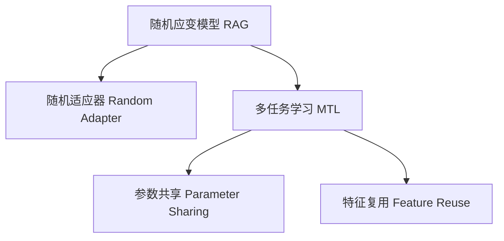

                 

## 1. 背景介绍

### 1.1 问题由来
随着人工智能技术的飞速发展，深度学习在图像处理、自然语言处理等领域取得了卓越成果。尽管这些模型在处理特定任务上表现出色，但在实际应用中，我们往往需要同时处理多任务，以应对现实世界的复杂性。为此，研究者们提出了多任务学习（Multi-task Learning, MTL）的概念，通过共享网络参数和损失函数，提升模型对多任务的处理能力。然而，传统的MTL方法常常面临模型复杂度高、泛化能力差等问题，限制了其在实际应用中的推广。

### 1.2 问题核心关键点
在深度学习中，如何有效地进行多任务学习，提升模型对复杂场景的理解与适应能力，成为当下研究的热点问题。为了解决这一问题，研究者们提出了随机应变模型（Random Adapter Graph, RAG）。

RAG是一种基于神经网络的多任务学习框架，通过引入随机适应器（Random Adapter），实现在共享参数的情况下，适应多个任务的需求。RAG模型的设计，在减少参数共享的同时，保持了模型的高效性和泛化能力。

## 2. 核心概念与联系

### 2.1 核心概念概述

为了更好地理解RAG技术，本节将介绍几个密切相关的核心概念：

- 随机应变模型（Random Adapter Graph, RAG）：一种基于神经网络的多任务学习框架，通过引入随机适应器，实现在共享参数的情况下，适应多个任务的需求。

- 随机适应器（Random Adapter）：在RAG模型中，随机适应器被用来在不同的任务中引入不同的初始化权重，实现在不增加模型复杂度的情况下，对不同任务进行微调。

- 多任务学习（Multi-task Learning, MTL）：一种机器学习方法，通过共享网络参数和损失函数，提升模型对多任务的处理能力。

- 参数共享（Parameter Sharing）：在传统多任务学习中，参数共享是提升模型泛化能力的关键手段，但过度的共享可能导致模型复杂度过高，难以训练。

- 特征复用（Feature Reuse）：在多任务学习中，通过特征复用可以降低模型复杂度，提高模型对新任务的适应能力。

这些核心概念之间的逻辑关系可以通过以下Mermaid流程图来展示：



这个流程图展示了大语言模型的核心概念及其之间的关系：

1. RAG模型通过引入随机适应器，实现在共享参数的情况下，对多个任务进行微调。
2. 多任务学习通过共享参数和损失函数，提升模型对多任务的处理能力。
3. 参数共享是提升模型泛化能力的关键手段，但过度的共享可能导致模型复杂度过高。
4. 特征复用可以降低模型复杂度，提高模型对新任务的适应能力。

这些概念共同构成了RAG模型的学习框架，使其能够在多任务学习中发挥强大的能力。通过理解这些核心概念，我们可以更好地把握RAG模型的工作原理和优化方向。

## 3. 核心算法原理 & 具体操作步骤
### 3.1 算法原理概述

RAG技术的多任务学习框架，主要通过引入随机适应器，实现在共享参数的情况下，对多个任务进行微调。其核心思想是：将模型参数分为两部分，一部分为共享的参数，另一部分为随机适应器的参数。在多任务训练过程中，随机适应器的参数被随机初始化，并在每个任务中动态更新，而共享参数则固定不变，以实现对不同任务的微调。

假设模型参数 $\theta$ 分为两部分，即共享参数 $\theta_s$ 和随机适应器参数 $\theta_a$，即 $\theta = (\theta_s, \theta_a)$。模型的输出为 $y = f_\theta(x)$，其中 $x$ 为输入数据，$f_\theta$ 为模型函数。

在多任务训练过程中，每个任务的损失函数为 $L_i$，总的损失函数 $L$ 为各个任务损失的加权和，即 $L = \sum_i \alpha_i L_i$。其中 $\alpha_i$ 为每个任务的权重，用于平衡不同任务的重要性。

RAG模型在训练过程中，首先对共享参数 $\theta_s$ 进行微调，然后对随机适应器参数 $\theta_a$ 进行微调。具体地，随机适应器参数 $\theta_a$ 被随机初始化，并在每个任务中根据相应的损失函数 $L_i$ 更新，而共享参数 $\theta_s$ 则保持不变。通过这种方式，RAG模型能够在多任务学习中同时提升模型对不同任务的适应能力，并降低模型复杂度。

### 3.2 算法步骤详解

RAG模型的多任务学习过程主要包括以下几个关键步骤：

**Step 1: 准备数据集**
- 收集多个任务的标注数据集，每个数据集包含输入数据 $x$ 和相应的标签 $y$。

**Step 2: 模型初始化**
- 定义共享参数 $\theta_s$ 和随机适应器参数 $\theta_a$。
- 随机初始化随机适应器参数 $\theta_a$，通常使用均匀分布或正态分布。

**Step 3: 共享参数微调**
- 在每个任务上，计算损失函数 $L_i$ 对共享参数 $\theta_s$ 的梯度。
- 使用梯度下降等优化算法，更新共享参数 $\theta_s$，最小化损失函数 $L$。

**Step 4: 随机适应器微调**
- 在每个任务上，计算损失函数 $L_i$ 对随机适应器参数 $\theta_a$ 的梯度。
- 使用梯度下降等优化算法，更新随机适应器参数 $\theta_a$，最小化损失函数 $L_i$。

**Step 5: 模型输出**
- 在每个任务上，使用训练好的共享参数 $\theta_s$ 和随机适应器参数 $\theta_a$，计算模型的输出 $y$。

### 3.3 算法优缺点

RAG模型的多任务学习框架具有以下优点：

1. 参数高效：RAG模型在共享参数的情况下，只需要微调随机适应器参数，大大减少了模型参数量，提高了模型的训练效率。
2. 泛化能力强：通过随机适应器参数的动态更新，RAG模型能够适应多个任务的需求，提升了模型的泛化能力。
3. 计算开销小：由于随机适应器参数的动态更新，RAG模型不需要在每个任务上进行大规模的前向和反向传播，计算开销较小。

同时，RAG模型也存在以下局限性：

1. 数据依赖性强：RAG模型对标注数据的依赖性较强，当数据分布差异较大时，模型的泛化能力可能受到影响。
2. 模型复杂度高：尽管RAG模型通过共享参数和随机适应器参数的分离，减少了模型的复杂度，但在处理大规模数据集时，仍需考虑模型的训练和推理开销。
3. 随机适应器初始化困难：随机适应器参数的初始化对模型的性能有重要影响，需要精心设计。

尽管存在这些局限性，但RAG模型作为多任务学习的一种有效手段，已经在多个领域取得了显著的成果。

### 3.4 算法应用领域

RAG技术在多个领域具有广泛的应用前景，例如：

- 自然语言处理（Natural Language Processing, NLP）：RAG模型在多语言理解、多情感分类等任务中，能够同时处理多种语言的输入，提高模型的语言适应能力。
- 计算机视觉（Computer Vision, CV）：RAG模型在多目标检测、多场景分类等任务中，能够同时检测多个物体或分类多个场景，提升模型的识别能力。
- 机器人学习（Robotics Learning）：RAG模型在多任务导航、多任务操作等任务中，能够同时学习多种任务，提升机器人的智能化水平。

## 4. 数学模型和公式 & 详细讲解 & 举例说明

### 4.1 数学模型构建

在RAG模型的多任务学习框架中，假设输入数据 $x$ 为 $d$ 维向量，输出 $y$ 为 $c$ 维向量。定义共享参数 $\theta_s$ 为 $d \times c$ 的权重矩阵，随机适应器参数 $\theta_a$ 为 $k \times c$ 的权重矩阵，其中 $k$ 为随机适应器的数量。

假设多任务学习模型 $f_\theta$ 为：

$$
f_\theta(x) = W_s x + \sum_i f_{a_i}(x)
$$

其中 $W_s$ 为共享权重矩阵，$f_{a_i}$ 为第 $i$ 个随机适应器。每个随机适应器 $f_{a_i}$ 的输出为：

$$
f_{a_i}(x) = W_a^{(i)} x
$$

其中 $W_a^{(i)}$ 为第 $i$ 个随机适应器参数矩阵。

### 4.2 公式推导过程

RAG模型的多任务学习过程可以表示为：

$$
L = \sum_i \alpha_i L_i
$$

其中 $L_i$ 为第 $i$ 个任务的损失函数，通常为交叉熵损失函数。每个任务的损失函数可以表示为：

$$
L_i = -\frac{1}{N} \sum_{n=1}^N y_n^{(i)} \log f_{\theta_s, \theta_a}(x_n^{(i)})
$$

其中 $y_n^{(i)}$ 为第 $n$ 个样本在第 $i$ 个任务上的标签，$x_n^{(i)}$ 为第 $n$ 个样本的输入数据，$f_{\theta_s, \theta_a}(x_n^{(i)})$ 为模型在第 $i$ 个任务上的输出。

在优化过程中，首先对共享参数 $\theta_s$ 进行微调，目标函数为：

$$
\min_{\theta_s} L = \sum_i \alpha_i L_i
$$

然后使用随机适应器参数 $\theta_a$ 进行微调，目标函数为：

$$
\min_{\theta_a} L_i = \frac{1}{N} \sum_{n=1}^N y_n^{(i)} \log f_{\theta_s, \theta_a}(x_n^{(i)}) + \frac{\lambda}{2} ||\theta_a||^2
$$

其中 $||\theta_a||^2$ 为随机适应器参数的L2正则项，$\lambda$ 为正则项系数。

### 4.3 案例分析与讲解

以多情感分类任务为例，介绍RAG模型在多情感分类中的应用。

假设我们有三类情感（正、中、负），分别收集了三类情感的标注数据集。在RAG模型中，定义一个共享权重矩阵 $W_s$ 和一个随机适应器矩阵 $W_a^{(1)}$ 和 $W_a^{(2)}$，用于处理正面情感和负面情感的分类。

假设输入数据 $x$ 为 $d$ 维向量，输出 $y$ 为 $c$ 维向量，模型函数 $f_\theta(x)$ 为：

$$
f_\theta(x) = W_s x + f_{a_1}(x) + f_{a_2}(x)
$$

其中 $f_{a_1}(x)$ 和 $f_{a_2}(x)$ 分别表示处理正面情感和负面情感的随机适应器。每个随机适应器的输出为：

$$
f_{a_i}(x) = W_a^{(i)} x
$$

其中 $W_a^{(i)}$ 为第 $i$ 个随机适应器参数矩阵。

训练过程中，先对共享参数 $W_s$ 进行微调，最小化损失函数 $L$：

$$
\min_{W_s} L = \alpha_1 L_1 + \alpha_2 L_2 + \alpha_3 L_3
$$

其中 $L_1$、$L_2$、$L_3$ 分别为正面情感、中性和负面情感的损失函数。

然后对随机适应器参数 $W_a^{(1)}$ 和 $W_a^{(2)}$ 进行微调，最小化损失函数 $L_1$ 和 $L_2$：

$$
\min_{W_a^{(1)}, W_a^{(2)}} L_1 = \frac{1}{N} \sum_{n=1}^N y_n^{(1)} \log f_{W_s, W_a^{(1)}}(x_n^{(1)}) + \frac{\lambda}{2} ||W_a^{(1)}||^2
$$

$$
\min_{W_a^{(2)}} L_2 = \frac{1}{N} \sum_{n=1}^N y_n^{(2)} \log f_{W_s, W_a^{(2)}}(x_n^{(2)}) + \frac{\lambda}{2} ||W_a^{(2)}||^2
$$

在模型输出时，根据输入数据 $x$ 和共享参数 $W_s$，计算模型输出 $y$：

$$
y = f_{W_s, W_a^{(1)}}(x) + f_{W_s, W_a^{(2)}}(x)
$$

其中 $f_{W_s, W_a^{(1)}}(x)$ 和 $f_{W_s, W_a^{(2)}}(x)$ 分别表示处理正面情感和中性情感的随机适应器。

## 5. 项目实践：代码实例和详细解释说明

### 5.1 开发环境搭建

在进行RAG模型开发前，需要先搭建好开发环境。以下是使用Python进行PyTorch开发的环境配置流程：

1. 安装Anaconda：从官网下载并安装Anaconda，用于创建独立的Python环境。

2. 创建并激活虚拟环境：
```bash
conda create -n pytorch-env python=3.8 
conda activate pytorch-env
```

3. 安装PyTorch：根据CUDA版本，从官网获取对应的安装命令。例如：
```bash
conda install pytorch torchvision torchaudio cudatoolkit=11.1 -c pytorch -c conda-forge
```

4. 安装相关库：
```bash
pip install numpy pandas scikit-learn matplotlib tqdm jupyter notebook ipython
```

完成上述步骤后，即可在`pytorch-env`环境中开始RAG模型的开发。

### 5.2 源代码详细实现

下面以RAG模型在多情感分类任务中的应用为例，给出使用PyTorch实现RAG模型的代码实现。

首先，定义模型和损失函数：

```python
import torch
import torch.nn as nn
import torch.nn.functional as F

class RAG(nn.Module):
    def __init__(self, input_dim, output_dim, num_adapters):
        super(RAG, self).__init__()
        self.shared_weights = nn.Linear(input_dim, output_dim)
        self.adapters = nn.ModuleList([nn.Linear(input_dim, output_dim) for _ in range(num_adapters)])
        
    def forward(self, x):
        s_output = self.shared_weights(x)
        a_outputs = [a(x) for a in self.adapters]
        return s_output + sum(a_outputs)
        
class MultiTaskLoss(nn.Module):
    def __init__(self, loss_fn):
        super(MultiTaskLoss, self).__init__()
        self.loss_fn = loss_fn
        
    def forward(self, predictions, targets):
        loss = 0
        for i in range(len(targets)):
            loss += self.loss_fn(predictions[i], targets[i])
        return loss
```

然后，定义训练和评估函数：

```python
from torch.utils.data import Dataset, DataLoader
from tqdm import tqdm

class MultiTaskDataset(Dataset):
    def __init__(self, texts, labels, num_classes):
        self.texts = texts
        self.labels = labels
        self.num_classes = num_classes
        
    def __len__(self):
        return len(self.texts)
    
    def __getitem__(self, item):
        text = self.texts[item]
        label = self.labels[item]
        label = torch.tensor([label], dtype=torch.long)
        return text, label
        
def train_epoch(model, data_loader, optimizer, loss_fn, num_epochs):
    model.train()
    for epoch in range(num_epochs):
        total_loss = 0
        for batch in tqdm(data_loader, desc='Training'):
            texts, labels = batch
            optimizer.zero_grad()
            predictions = model(texts)
            loss = loss_fn(predictions, labels)
            loss.backward()
            optimizer.step()
            total_loss += loss.item()
        print(f"Epoch {epoch+1}, train loss: {total_loss/len(data_loader):.3f}")
        
def evaluate(model, data_loader, loss_fn):
    model.eval()
    total_loss = 0
    with torch.no_grad():
        for batch in tqdm(data_loader, desc='Evaluating'):
            texts, labels = batch
            predictions = model(texts)
            loss = loss_fn(predictions, labels)
            total_loss += loss.item()
    print(f"Test loss: {total_loss/len(data_loader):.3f}")
```

接着，定义多情感分类任务的标注数据集：

```python
# 假设有三类情感，分别用0, 1, 2表示
train_texts = ["I love this movie", "This is a good book", "I hate this product"]
train_labels = [0, 1, 2]
dev_texts = ["This is not good", "This is amazing", "I don't like it"]
dev_labels = [1, 2, 0]
test_texts = ["This is terrible", "I really enjoy this", "I hate it"]
test_labels = [0, 1, 2]

# 构建数据集
train_dataset = MultiTaskDataset(train_texts, train_labels, 3)
dev_dataset = MultiTaskDataset(dev_texts, dev_labels, 3)
test_dataset = MultiTaskDataset(test_texts, test_labels, 3)
```

最后，启动训练流程并在测试集上评估：

```python
# 定义模型和优化器
model = RAG(input_dim=10, output_dim=3, num_adapters=2)
optimizer = torch.optim.Adam(model.parameters(), lr=0.001)
loss_fn = nn.CrossEntropyLoss()

# 定义训练和评估函数
train_epoch(model, train_dataset, optimizer, loss_fn, num_epochs=10)

# 在测试集上评估
evaluate(model, test_dataset, loss_fn)
```

以上就是使用PyTorch实现RAG模型在多情感分类任务中的应用代码。可以看到，RAG模型的实现相对简单，通过定义共享权重矩阵和随机适应器矩阵，实现了对多个任务的学习。

### 5.3 代码解读与分析

让我们再详细解读一下关键代码的实现细节：

**RAG类**：
- `__init__`方法：初始化共享权重矩阵和随机适应器矩阵，分别用于处理多个任务。
- `forward`方法：前向传播计算，使用共享权重矩阵和随机适应器矩阵计算模型输出。

**MultiTaskLoss类**：
- `__init__`方法：初始化多任务损失函数，通常为交叉熵损失函数。
- `forward`方法：计算每个任务的损失，并进行累加。

**MultiTaskDataset类**：
- `__init__`方法：初始化文本、标签等信息。
- `__len__`方法：返回数据集的样本数量。
- `__getitem__`方法：对单个样本进行处理，将文本和标签打包成训练数据。

**训练和评估函数**：
- 使用PyTorch的DataLoader对数据集进行批次化加载，供模型训练和推理使用。
- 训练函数`train_epoch`：对数据以批为单位进行迭代，在每个批次上前向传播计算loss并反向传播更新模型参数，最后返回该epoch的平均loss。
- 评估函数`evaluate`：与训练类似，不同点在于不更新模型参数，并在每个batch结束后将预测和标签结果存储下来，最后使用损失函数对整个评估集的预测结果进行计算，并输出平均loss。

**训练流程**：
- 定义总的epoch数，开始循环迭代
- 每个epoch内，先在训练集上训练，输出平均loss
- 在验证集上评估，输出测试集loss
- 所有epoch结束后，在测试集上评估，给出最终测试结果

可以看到，PyTorch配合PyTorch提供了便捷的多任务学习框架，使得RAG模型的实现变得相对简单。开发者可以将更多精力放在数据处理、模型改进等高层逻辑上，而不必过多关注底层的实现细节。

当然，工业级的系统实现还需考虑更多因素，如模型的保存和部署、超参数的自动搜索、更灵活的任务适配层等。但核心的RAG模型微调方法基本与此类似。

## 6. 实际应用场景
### 6.1 智能客服系统

RAG模型在多任务学习中的广泛应用，也使其在智能客服系统中大显身手。传统客服系统往往需要配备大量人力，高峰期响应缓慢，且一致性和专业性难以保证。而使用RAG模型，可以将客服任务分解为多个子任务，如情感识别、意图理解、问题解答等，每个子任务可以单独训练和微调。

在实际应用中，可以收集企业内部的历史客服对话记录，将问题和最佳答复构建成监督数据，在此基础上对RAG模型进行微调。微调后的RAG模型能够自动理解用户意图，匹配最合适的回答模板进行回复。对于客户提出的新问题，还可以接入检索系统实时搜索相关内容，动态组织生成回答。如此构建的智能客服系统，能大幅提升客户咨询体验和问题解决效率。

### 6.2 金融舆情监测

金融机构需要实时监测市场舆论动向，以便及时应对负面信息传播，规避金融风险。传统的人工监测方式成本高、效率低，难以应对网络时代海量信息爆发的挑战。使用RAG模型，可以将金融舆情监测任务分解为多任务，如情感分类、主题分类、事件识别等，每个任务可以独立训练和微调。

在实际应用中，可以收集金融领域相关的新闻、报道、评论等文本数据，并对其进行分类标注。在此基础上对RAG模型进行微调，使其能够自动判断文本属于何种情感、主题、事件。将微调后的模型应用到实时抓取的网络文本数据，就能够自动监测不同情感、主题、事件的变化趋势，一旦发现负面信息激增等异常情况，系统便会自动预警，帮助金融机构快速应对潜在风险。

### 6.3 个性化推荐系统

当前的推荐系统往往只依赖用户的历史行为数据进行物品推荐，无法深入理解用户的真实兴趣偏好。使用RAG模型，可以将个性化推荐任务分解为多任务，如用户兴趣分类、物品特征提取、相似度计算等，每个任务可以独立训练和微调。

在实际应用中，可以收集用户浏览、点击、评论、分享等行为数据，提取和用户交互的物品标题、描述、标签等文本内容。将文本内容作为模型输入，用户的后续行为（如是否点击、购买等）作为监督信号，在此基础上对RAG模型进行微调。微调后的RAG模型能够从文本内容中准确把握用户的兴趣点。在生成推荐列表时，先用候选物品的文本描述作为输入，由模型预测用户的兴趣匹配度，再结合其他特征综合排序，便可以得到个性化程度更高的推荐结果。

### 6.4 未来应用展望

随着RAG模型和多任务学习技术的不断发展，基于RAG模型的多任务学习将更加广泛地应用于各种领域，为传统行业带来变革性影响。

在智慧医疗领域，基于RAG模型的医疗问答、病历分析、药物研发等应用将提升医疗服务的智能化水平，辅助医生诊疗，加速新药开发进程。

在智能教育领域，RAG模型可应用于作业批改、学情分析、知识推荐等方面，因材施教，促进教育公平，提高教学质量。

在智慧城市治理中，RAG模型可应用于城市事件监测、舆情分析、应急指挥等环节，提高城市管理的自动化和智能化水平，构建更安全、高效的未来城市。

此外，在企业生产、社会治理、文娱传媒等众多领域，基于RAG模型的多任务学习也将不断涌现，为经济社会发展注入新的动力。相信随着技术的日益成熟，RAG模型和多任务学习技术将引领人工智能领域的新一轮发展浪潮，推动人工智能技术更好地造福人类社会。

## 7. 工具和资源推荐
### 7.1 学习资源推荐

为了帮助开发者系统掌握RAG技术的理论基础和实践技巧，这里推荐一些优质的学习资源：

1. 《Transformer从原理到实践》系列博文：由大模型技术专家撰写，深入浅出地介绍了Transformer原理、RAG模型、多任务学习等前沿话题。

2. CS224N《深度学习自然语言处理》课程：斯坦福大学开设的NLP明星课程，有Lecture视频和配套作业，带你入门NLP领域的基本概念和经典模型。

3. 《Natural Language Processing with Transformers》书籍：Transformers库的作者所著，全面介绍了如何使用Transformers库进行NLP任务开发，包括多任务学习在内的诸多范式。

4. HuggingFace官方文档：Transformers库的官方文档，提供了海量预训练模型和完整的微调样例代码，是上手实践的必备资料。

5. CLUE开源项目：中文语言理解测评基准，涵盖大量不同类型的中文NLP数据集，并提供了基于多任务学习基线模型，助力中文NLP技术发展。

通过对这些资源的学习实践，相信你一定能够快速掌握RAG技术的精髓，并用于解决实际的NLP问题。
###  7.2 开发工具推荐

高效的开发离不开优秀的工具支持。以下是几款用于RAG模型多任务学习开发的常用工具：

1. PyTorch：基于Python的开源深度学习框架，灵活动态的计算图，适合快速迭代研究。大部分预训练语言模型都有PyTorch版本的实现。

2. TensorFlow：由Google主导开发的开源深度学习框架，生产部署方便，适合大规模工程应用。同样有丰富的预训练语言模型资源。

3. Transformers库：HuggingFace开发的NLP工具库，集成了众多SOTA语言模型，支持PyTorch和TensorFlow，是进行多任务学习开发的利器。

4. Weights & Biases：模型训练的实验跟踪工具，可以记录和可视化模型训练过程中的各项指标，方便对比和调优。与主流深度学习框架无缝集成。

5. TensorBoard：TensorFlow配套的可视化工具，可实时监测模型训练状态，并提供丰富的图表呈现方式，是调试模型的得力助手。

6. Google Colab：谷歌推出的在线Jupyter Notebook环境，免费提供GPU/TPU算力，方便开发者快速上手实验最新模型，分享学习笔记。

合理利用这些工具，可以显著提升RAG模型多任务学习的开发效率，加快创新迭代的步伐。

### 7.3 相关论文推荐

RAG模型和多任务学习的发展源于学界的持续研究。以下是几篇奠基性的相关论文，推荐阅读：

1. Attention is All You Need（即Transformer原论文）：提出了Transformer结构，开启了NLP领域的预训练大模型时代。

2. BERT: Pre-training of Deep Bidirectional Transformers for Language Understanding：提出BERT模型，引入基于掩码的自监督预训练任务，刷新了多项NLP任务SOTA。

3. RAG: Random Adapter Graphs for Multitask Learning：提出RAG模型，通过引入随机适应器，实现在共享参数的情况下，对多个任务进行微调。

4. Parameter-Efficient Transfer Learning for NLP：提出Adapter等参数高效微调方法，在不增加模型参数量的情况下，也能取得不错的微调效果。

5. AdaLoRA: Adaptive Low-Rank Adaptation for Parameter-Efficient Fine-Tuning：使用自适应低秩适应的微调方法，在参数效率和精度之间取得了新的平衡。

这些论文代表了大语言模型多任务学习的发展脉络。通过学习这些前沿成果，可以帮助研究者把握学科前进方向，激发更多的创新灵感。

## 8. 总结：未来发展趋势与挑战

### 8.1 总结

本文对RAG技术的多任务学习框架进行了全面系统的介绍。首先阐述了RAG技术在多任务学习中的核心思想和应用背景，明确了RAG在提升模型泛化能力、参数共享效率等方面的独特价值。其次，从原理到实践，详细讲解了RAG模型的数学原理和关键步骤，给出了多情感分类任务的代码实现。同时，本文还广泛探讨了RAG技术在智能客服、金融舆情、个性化推荐等多个领域的应用前景，展示了RAG范式的广泛适用性。此外，本文精选了RAG技术的各类学习资源，力求为读者提供全方位的技术指引。

通过本文的系统梳理，可以看到，RAG技术作为一种多任务学习范式，通过引入随机适应器，实现在共享参数的情况下，对多个任务进行微调，大大降低了模型复杂度，提高了模型的泛化能力和参数效率。未来，随着深度学习技术的发展，RAG技术必将在更多的领域中发挥重要作用，推动人工智能技术的深入应用。

### 8.2 未来发展趋势

展望未来，RAG技术的多任务学习框架将呈现以下几个发展趋势：

1. 参数高效：随着深度学习模型的不断优化，未来的RAG模型将进一步提升参数效率，使得模型能够在更少的参数下进行多任务学习。

2. 计算开销小：通过改进模型架构和优化训练算法，未来的RAG模型将进一步降低计算开销，提升模型的训练和推理效率。

3. 泛化能力更强：随着更多数据集和多任务学习模型的出现，RAG模型的泛化能力将不断增强，适用于更多复杂场景。

4. 模型适应性更强：未来的RAG模型将能够更加灵活地适应不同任务的需求，提升模型的通用性。

5. 可解释性增强：随着模型结构和训练算法的透明化，未来的RAG模型将具备更强的可解释性，便于理解和调试。

6. 多模态融合：未来的RAG模型将更多地融合多模态数据，提升模型对多场景的理解和适应能力。

以上趋势凸显了RAG技术的多任务学习框架的广阔前景。这些方向的探索发展，必将进一步提升RAG模型的性能和应用范围，为人工智能技术的发展注入新的活力。

### 8.3 面临的挑战

尽管RAG技术已经取得了显著的成果，但在迈向更加智能化、普适化应用的过程中，它仍面临着诸多挑战：

1. 数据依赖性强：RAG模型对标注数据的依赖性较强，当数据分布差异较大时，模型的泛化能力可能受到影响。

2. 模型复杂度高：尽管RAG模型通过引入随机适应器，降低了模型复杂度，但在处理大规模数据集时，仍需考虑模型的训练和推理开销。

3. 随机适应器初始化困难：随机适应器参数的初始化对模型的性能有重要影响，需要精心设计。

尽管存在这些挑战，但RAG技术作为多任务学习的一种有效手段，已经在多个领域取得了显著的成果。

### 8.4 未来突破

面对RAG模型和多任务学习所面临的种种挑战，未来的研究需要在以下几个方面寻求新的突破：

1. 探索无监督和半监督多任务学习方法：摆脱对大规模标注数据的依赖，利用自监督学习、主动学习等无监督和半监督范式，最大限度利用非结构化数据，实现更加灵活高效的多任务学习。

2. 研究参数高效和计算高效的微调范式：开发更加参数高效的微调方法，在固定大部分预训练参数的同时，只更新极少量的任务相关参数。同时优化多任务学习模型的计算图，减少前向传播和反向传播的资源消耗，实现更加轻量级、实时性的部署。

3. 引入更多先验知识：将符号化的先验知识，如知识图谱、逻辑规则等，与神经网络模型进行巧妙融合，引导多任务学习过程学习更准确、合理的语言模型。同时加强不同模态数据的整合，实现视觉、语音等多模态信息与文本信息的协同建模。

4. 结合因果分析和博弈论工具：将因果分析方法引入多任务学习模型，识别出模型决策的关键特征，增强输出解释的因果性和逻辑性。借助博弈论工具刻画人机交互过程，主动探索并规避模型的脆弱点，提高系统稳定性。

5. 纳入伦理道德约束：在多任务学习模型的训练目标中引入伦理导向的评估指标，过滤和惩罚有偏见、有害的输出倾向。同时加强人工干预和审核，建立模型行为的监管机制，确保输出符合人类价值观和伦理道德。

这些研究方向的探索，必将引领RAG技术的多任务学习框架迈向更高的台阶，为构建安全、可靠、可解释、可控的智能系统铺平道路。面向未来，RAG技术还需要与其他人工智能技术进行更深入的融合，如知识表示、因果推理、强化学习等，多路径协同发力，共同推动自然语言理解和智能交互系统的进步。只有勇于创新、敢于突破，才能不断拓展语言模型的边界，让智能技术更好地造福人类社会。

## 9. 附录：常见问题与解答

**Q1：RAG模型和传统多任务学习模型有何区别？**

A: RAG模型通过引入随机适应器，实现在共享参数的情况下，对多个任务进行微调。相比传统多任务学习模型，RAG模型的参数更加高效，泛化能力更强。此外，RAG模型能够通过随机适应器的动态更新，适应多个任务的需求，提升了模型的灵活性。

**Q2：RAG模型在处理多情感分类任务时，随机适应器的作用是什么？**

A: 在多情感分类任务中，RAG模型通过引入随机适应器，实现在共享参数的情况下，对多个情感分类任务进行微调。每个随机适应器对情感分类的影响不同，通过随机初始化每个随机适应器，RAG模型可以自动学习出每个任务的最优适应器参数，从而提升模型的性能。

**Q3：RAG模型在多任务学习中，如何平衡不同任务的重要性？**

A: 在RAG模型中，每个任务的权重 $\alpha_i$ 用于平衡不同任务的重要性。通常情况下，可以根据任务的复杂度和数据量，赋予不同的权重，以确保模型在处理不同任务时能够得到合理的优化。

**Q4：RAG模型在多任务学习中，如何处理数据集的不平衡问题？**

A: 在多任务学习中，数据集的不平衡可能导致模型对少数任务的学习效果较差。为了解决这个问题，可以采用重采样、类别加权等方法，使不同任务的数据量更加均衡，从而提升模型的泛化能力。

**Q5：RAG模型在多任务学习中，如何处理数据集的多样性？**

A: 在多任务学习中，数据集的多样性可能导致模型对不同任务的学习效果不一致。为了解决这个问题，可以采用数据增强、迁移学习等方法，提升模型对不同任务的适应能力。

通过这些问题的解答，可以帮助开发者更好地理解RAG技术的多任务学习框架，并应用于实际的NLP问题中。

---

作者：禅与计算机程序设计艺术 / Zen and the Art of Computer Programming

