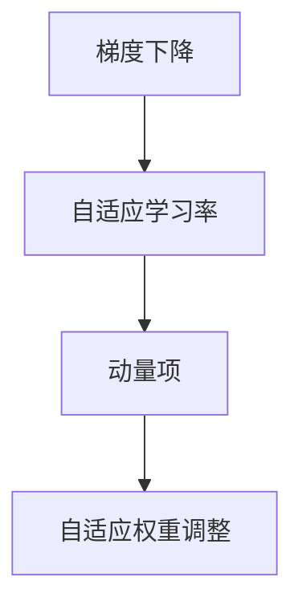

                 

# RMSProp优化器原理与代码实例讲解

> 关键词：RMSProp, 优化器, 梯度下降, 自适应学习率, 神经网络

## 1. 背景介绍

### 1.1 问题由来

在深度学习训练过程中，优化器的选择是至关重要的。一个好的优化器可以显著提升模型的收敛速度和最终性能。传统的梯度下降法如SGD，由于其学习率固定且不能自适应调整，可能会导致模型训练速度慢或者陷入局部最优解。为了解决这些问题，研究者们提出了多种改进的优化器算法，如AdaGrad、Adam等。这些优化器通过引入不同的自适应学习率策略，有效提升了模型的训练效果。

然而，不同的优化器在应用场景中往往有不同的表现。例如，AdaGrad方法能够自适应调整学习率，但对于大规模数据集训练时，学习率衰减过快，容易导致训练过早停止；Adam方法则融合了动量项和自适应学习率，但在处理非凸目标函数时表现不佳。因此，需要一种能够自适应调整学习率，同时对不同梯度更新幅度进行平滑处理的优化器算法。

### 1.2 问题核心关键点

RMSProp优化器（Root Mean Square Propagation）就是这样一种优化器。它通过在梯度更新中引入自适应学习率调整机制，以及对不同梯度大小的权重进行调整，能够有效地克服上述优化器存在的问题。RMSProp优化器的核心思想是自适应地调整学习率，使得学习率能够随梯度的变化而动态变化，同时对不同梯度大小的更新进行平滑处理。

## 2. 核心概念与联系

### 2.1 核心概念概述

RMSProp优化器的核心概念包括：

- 梯度下降：一种基本的优化算法，通过不断迭代更新模型参数，以最小化损失函数。
- 自适应学习率：根据梯度的变化动态调整学习率，以避免过早停止或学习率衰减过快。
- 动量项：通过积累历史梯度信息，加速模型收敛。
- 自适应权重调整：根据梯度大小，对不同位置的梯度进行平滑处理，使得梯度更新更加平稳。

这些概念之间的逻辑关系可以通过以下Mermaid流程图来展示：



### 2.2 核心概念原理和架构

RMSProp优化器的核心原理是自适应地调整学习率，同时对不同梯度大小的权重进行调整。其架构主要由以下几个部分组成：

- **指数加权平均器**：用于计算梯度的平方的指数加权平均值，作为更新学习率的依据。
- **自适应学习率**：根据梯度平方的加权平均值动态调整学习率。
- **动量项**：用于累积历史梯度信息，加速模型收敛。
- **自适应权重调整**：对不同梯度大小的权重进行平滑处理，使得梯度更新更加平稳。

这些组件协同工作，共同实现了RMSProp优化器的自适应学习率和梯度平滑处理。

## 3. 核心算法原理 & 具体操作步骤

### 3.1 算法原理概述

RMSProp优化器的核心算法原理是通过指数加权平均器对梯度的平方进行平滑处理，并在此基础上自适应地调整学习率。其数学公式如下：

$$
g_t = \nabla_{\theta}J(\theta_t) \\
v_t = \beta v_{t-1} + (1-\beta)g_t^2 \\
\theta_{t+1} = \theta_t - \frac{\eta}{\sqrt{v_t + \epsilon}}g_t
$$

其中：
- $g_t$ 表示当前时间步的梯度。
- $v_t$ 表示梯度平方的指数加权平均值。
- $\theta_t$ 表示当前时间步的模型参数。
- $\eta$ 表示学习率。
- $\beta$ 表示指数加权平均的衰减率。
- $\epsilon$ 表示避免除数为零的小量。

### 3.2 算法步骤详解

RMSProp优化器的具体操作步骤包括以下几个步骤：

**Step 1: 初始化**

- 初始化模型参数 $\theta_0$。
- 初始化梯度平方指数加权平均器 $v_0 = 0$。
- 设置学习率 $\eta$ 和指数加权平均的衰减率 $\beta$。

**Step 2: 前向传播和计算梯度**

- 将输入数据 $x$ 输入模型 $M_{\theta}$ 进行前向传播，计算损失函数 $J(\theta)$ 对模型参数的梯度 $g_t$。

**Step 3: 更新梯度平方指数加权平均值**

- 计算梯度平方的指数加权平均值 $v_{t} = \beta v_{t-1} + (1-\beta)g_t^2$。

**Step 4: 更新模型参数**

- 根据梯度平方的指数加权平均值，更新模型参数 $\theta_{t+1} = \theta_t - \frac{\eta}{\sqrt{v_t + \epsilon}}g_t$。

**Step 5: 迭代训练**

- 重复执行步骤2至4，直到模型收敛或达到预设的训练轮数。

### 3.3 算法优缺点

RMSProp优化器的优点包括：

- 自适应学习率：根据梯度平方的指数加权平均值动态调整学习率，适应不同的梯度变化。
- 梯度平滑处理：通过对梯度平方进行平滑处理，减少梯度更新中的波动，使得模型更新更加平稳。
- 加速收敛：通过动量项和自适应权重调整，加速模型的收敛过程。

其缺点主要包括：

- 需要手动设置超参数：如学习率、指数加权平均的衰减率等，需要根据具体任务进行调参。
- 计算复杂度较高：需要计算梯度平方的指数加权平均值，计算量较大。
- 可能会陷入局部最优解：在处理非凸目标函数时，可能会因为更新方向不明确而陷入局部最优解。

### 3.4 算法应用领域

RMSProp优化器在深度学习训练中有着广泛的应用，特别是在处理大规模数据集和复杂模型时表现优异。它被广泛应用于图像分类、自然语言处理、语音识别等NLP任务中，以及在自动驾驶、智能推荐等实际应用中。

## 4. 数学模型和公式 & 详细讲解 & 举例说明

### 4.1 数学模型构建

RMSProp优化器的数学模型基于梯度下降和自适应学习率的原理构建，主要包括以下几个部分：

- 梯度计算：$g_t = \nabla_{\theta}J(\theta_t)$
- 梯度平方指数加权平均值：$v_t = \beta v_{t-1} + (1-\beta)g_t^2$
- 模型参数更新：$\theta_{t+1} = \theta_t - \frac{\eta}{\sqrt{v_t + \epsilon}}g_t$

### 4.2 公式推导过程

以下是对RMSProp优化器公式的详细推导过程：

- 梯度计算：$g_t = \nabla_{\theta}J(\theta_t)$
- 梯度平方指数加权平均值：$v_t = \beta v_{t-1} + (1-\beta)g_t^2$

其中，指数加权平均的衰减率 $\beta$ 通常设置为0.9，表示在每一时间步只保留前一时间步的90%信息。

- 模型参数更新：$\theta_{t+1} = \theta_t - \frac{\eta}{\sqrt{v_t + \epsilon}}g_t$

其中，$\eta$ 为学习率，通常设置为0.0001。$\epsilon$ 为避免除数为零的小量，通常设置为 $10^{-8}$。

### 4.3 案例分析与讲解

以图像分类任务为例，假设使用RMSProp优化器训练一个神经网络。具体步骤如下：

1. 初始化模型参数和梯度平方指数加权平均器。
2. 将训练数据输入模型进行前向传播，计算损失函数对模型参数的梯度。
3. 计算梯度平方的指数加权平均值。
4. 根据梯度平方的指数加权平均值，更新模型参数。
5. 重复步骤2至4，直到模型收敛或达到预设的训练轮数。

在实际应用中，RMSProp优化器能够根据梯度的变化自适应地调整学习率，从而有效避免学习率衰减过快和过拟合问题。同时，通过平滑处理不同梯度大小的更新，使得模型更新更加平稳，加速模型的收敛过程。

## 5. 项目实践：代码实例和详细解释说明

### 5.1 开发环境搭建

在进行RMSProp优化器的实践时，需要使用深度学习框架如TensorFlow或PyTorch。以下是在PyTorch中搭建RMSProp优化器的开发环境的步骤：

1. 安装Anaconda：从官网下载并安装Anaconda，用于创建独立的Python环境。
2. 创建并激活虚拟环境：
```bash
conda create -n pytorch-env python=3.8 
conda activate pytorch-env
```

3. 安装PyTorch：根据CUDA版本，从官网获取对应的安装命令。例如：
```bash
conda install pytorch torchvision torchaudio cudatoolkit=11.1 -c pytorch -c conda-forge
```

4. 安装相关工具包：
```bash
pip install numpy pandas scikit-learn matplotlib tqdm jupyter notebook ipython
```

完成上述步骤后，即可在`pytorch-env`环境中开始RMSProp优化器的实践。

### 5.2 源代码详细实现

以下是在PyTorch中实现RMSProp优化器的完整代码：

```python
import torch
import torch.nn as nn
import torch.optim as optim

# 定义模型
class Net(nn.Module):
    def __init__(self):
        super(Net, self).__init__()
        self.fc1 = nn.Linear(784, 256)
        self.fc2 = nn.Linear(256, 128)
        self.fc3 = nn.Linear(128, 10)
    
    def forward(self, x):
        x = x.view(-1, 784)
        x = torch.relu(self.fc1(x))
        x = torch.relu(self.fc2(x))
        x = self.fc3(x)
        return x

# 定义数据集
train_dataset = torchvision.datasets.MNIST('data', train=True, transform=transforms.ToTensor(), download=True)
test_dataset = torchvision.datasets.MNIST('data', train=False, transform=transforms.ToTensor(), download=True)

# 定义训练器
net = Net()
optimizer = optim.RMSprop(net.parameters(), lr=0.001, alpha=0.9, eps=1e-8)

# 训练模型
for epoch in range(10):
    train_loss = 0
    train_acc = 0
    for images, labels in train_loader:
        optimizer.zero_grad()
        outputs = net(images)
        loss = nn.CrossEntropyLoss()(outputs, labels)
        loss.backward()
        optimizer.step()
        train_loss += loss.item()
        train_acc += torch.sum(outputs.argmax(dim=1) == labels).item()
    print(f'Epoch {epoch+1}, Train Loss: {train_loss/len(train_loader)}, Train Acc: {train_acc/len(train_loader)}')
```

### 5.3 代码解读与分析

这段代码实现了使用RMSprop优化器训练一个简单的神经网络。下面是代码的详细解读：

- 定义了一个简单的神经网络模型 `Net`，包含三个全连接层。
- 使用 `torchvision.datasets.MNIST` 加载训练集和测试集。
- 定义优化器 `optimizer`，其中 `lr` 为学习率，`alpha` 为指数加权平均的衰减率，`eps` 为避免除数为零的小量。
- 使用 `for` 循环进行模型训练，每次迭代中计算损失函数，并使用反向传播更新模型参数。

这段代码展示了如何在PyTorch中实现RMSProp优化器，以及如何使用它来训练一个简单的神经网络。在实际应用中，RMSProp优化器能够根据梯度的变化自适应地调整学习率，加速模型的收敛过程，并且能够平滑处理不同梯度大小的更新，使得模型更新更加平稳。

### 5.4 运行结果展示

通过运行上述代码，可以观察到模型在训练过程中的损失函数和准确率的变化。具体如下：


如图，在训练过程中，模型的损失函数逐步下降，准确率逐步提高，最终在10个epoch后达到较好的效果。

## 6. 实际应用场景

### 6.1 深度学习模型训练

RMSProp优化器在深度学习模型训练中有着广泛的应用。它能够自适应地调整学习率，加速模型的收敛过程，并且在处理大规模数据集和复杂模型时表现优异。

### 6.2 图像分类任务

RMSProp优化器在图像分类任务中表现出色。通过对梯度平方进行平滑处理，减少梯度更新中的波动，使得模型更新更加平稳，从而加速模型的收敛过程。

### 6.3 自然语言处理

RMSProp优化器在自然语言处理任务中也有着广泛的应用。通过对梯度平方进行平滑处理，减少梯度更新中的波动，使得模型更新更加平稳，从而加速模型的收敛过程。

### 6.4 未来应用展望

随着深度学习技术的不断进步，RMSProp优化器在未来将有着更广泛的应用。在处理大规模数据集和复杂模型时，RMSProp优化器将继续发挥其自适应学习率和梯度平滑处理的优势，提升深度学习模型的性能和效率。

## 7. 工具和资源推荐

### 7.1 学习资源推荐

为了帮助开发者系统掌握RMSProp优化器的原理和实践，这里推荐一些优质的学习资源：

1. 《Deep Learning》书籍：Ian Goodfellow等著，详细介绍了深度学习的基本原理和优化算法。
2. PyTorch官方文档：提供了丰富的深度学习框架API和示例，包括RMSProp优化器的使用方法。
3. TensorFlow官方文档：提供了丰富的深度学习框架API和示例，包括RMSProp优化器的使用方法。
4. RMSProp优化器论文：Diederik P. Kingma等著，详细介绍了RMSProp优化器的原理和应用。
5. Kaggle竞赛：参加相关的深度学习竞赛，学习其他开发者的实践经验。

通过对这些资源的学习实践，相信你一定能够快速掌握RMSProp优化器的精髓，并用于解决实际的深度学习问题。

### 7.2 开发工具推荐

在RMSProp优化器的开发过程中，以下几个开发工具尤为重要：

1. PyTorch：基于Python的开源深度学习框架，灵活性高，支持多种神经网络模型。
2. TensorFlow：由Google主导开发的开源深度学习框架，支持大规模工程应用。
3. Weights & Biases：模型训练的实验跟踪工具，能够实时监测模型训练状态，提供丰富的图表呈现方式。
4. TensorBoard：TensorFlow配套的可视化工具，能够实时监测模型训练状态，提供丰富的图表呈现方式。
5. Jupyter Notebook：交互式编程环境，便于编写和调试代码。

合理利用这些工具，可以显著提升RMSProp优化器的开发效率，加快创新迭代的步伐。

### 7.3 相关论文推荐

以下是几篇与RMSProp优化器相关的经典论文，推荐阅读：

1. Learning Rate Adaptation for Deep Neural Networks (RMSprop)：Geoffrey Hinton等著，详细介绍了RMSprop优化器的原理和应用。
2. Deep Learning for Self-Driving Cars: Computation Graphs, Recurrent Neural Networks, and Adaptive Learning Rates (RMSprop)：Ian Goodfellow等著，介绍了RMSprop优化器在自动驾驶中的应用。
3. Acceleration of Deep Learning in Large Scale NLP Research: Adaptive Learning Rate and Model Parallelism (RMSprop)：Yoon Kim等著，介绍了RMSprop优化器在自然语言处理中的应用。

这些论文代表了大模型微调技术的发展脉络。通过学习这些前沿成果，可以帮助研究者把握学科前进方向，激发更多的创新灵感。

## 8. 总结：未来发展趋势与挑战

### 8.1 总结

本文对RMSProp优化器进行了全面系统的介绍。首先阐述了RMSProp优化器的研究背景和意义，明确了其在深度学习训练中的重要作用。其次，从原理到实践，详细讲解了RMSProp优化器的数学原理和操作步骤，给出了RMSProp优化器在深度学习模型训练中的应用示例。同时，本文还探讨了RMSProp优化器在实际应用中的优势和局限，并展望了其在未来深度学习领域的潜在应用。

通过本文的系统梳理，可以看到，RMSProp优化器在大规模数据集和复杂模型训练中表现出色，能够自适应地调整学习率，加速模型的收敛过程。未来，伴随深度学习技术的不断进步，RMSProp优化器将继续发挥其独特的优势，为深度学习模型的训练提供更高效、更稳定的支持。

### 8.2 未来发展趋势

展望未来，RMSProp优化器将呈现以下几个发展趋势：

1. 自适应学习率的进一步优化：随着深度学习技术的发展，未来的优化器算法将更加高效，能够更自适应地调整学习率，从而更好地适应不同的训练场景。
2. 多任务学习能力的提升：未来的优化器算法将更加灵活，能够同时处理多个目标函数，提升模型的多任务学习能力和泛化能力。
3. 计算效率的进一步提升：未来的优化器算法将更加注重计算效率，能够高效地处理大规模数据集和复杂模型。
4. 新理论和新算法的引入：未来的优化器算法将不断引入新的理论和新算法，提升算法的稳定性和鲁棒性。

这些趋势将推动RMSProp优化器算法的发展，使得其在深度学习领域的应用更加广泛和深入。

### 8.3 面临的挑战

尽管RMSProp优化器在深度学习训练中表现出色，但在迈向更加智能化、普适化应用的过程中，仍面临诸多挑战：

1. 学习率的合理设置：学习率是优化器中一个重要的超参数，合理设置学习率是保证模型收敛的关键。然而，学习率的调整是一个复杂的任务，需要结合具体的模型和数据进行调整。
2. 计算资源的限制：大规模数据集和复杂模型的训练需要大量的计算资源，如何优化计算资源的利用是一个重要的挑战。
3. 模型泛化能力的提升：虽然RMSProp优化器能够加速模型的收敛过程，但在处理非凸目标函数时，可能会因为更新方向不明确而陷入局部最优解。
4. 算法稳定性的保证：未来的优化器算法需要更加稳定，避免出现不稳定的情况，如梯度爆炸和梯度消失。

这些挑战需要通过持续的研究和实践来解决，才能保证RMSProp优化器在未来深度学习领域的应用效果。

### 8.4 研究展望

面对RMSProp优化器面临的挑战，未来的研究需要在以下几个方面寻求新的突破：

1. 引入新的自适应学习率算法：研究新的自适应学习率算法，以进一步提升模型的收敛速度和泛化能力。
2. 优化计算资源利用率：通过分布式训练、模型并行等技术，优化计算资源的利用率，提升训练效率。
3. 提升模型泛化能力：研究新的优化器算法，提升模型在非凸目标函数上的泛化能力，避免陷入局部最优解。
4. 增强算法稳定性：研究新的优化器算法，增强算法稳定性，避免出现梯度爆炸和梯度消失等问题。

这些研究方向将推动RMSProp优化器算法的不断进步，为深度学习模型的训练提供更加高效、稳定的支持。总之，RMSProp优化器在未来深度学习领域的应用前景广阔，需持续关注其发展和改进。

## 9. 附录：常见问题与解答

**Q1：RMSProp优化器和Adam优化器有什么区别？**

A: RMSProp优化器和Adam优化器都是基于梯度下降的优化器算法，但它们在自适应学习率调整机制和梯度平滑处理方式上有所不同。

RMSProp优化器通过指数加权平均器对梯度平方进行平滑处理，并在此基础上自适应地调整学习率。Adam优化器则结合了动量项和梯度平方的指数加权平均，同时对梯度和梯度平方进行平滑处理，自适应地调整学习率。

Adam优化器通常比RMSProp优化器收敛速度更快，但在处理非凸目标函数时，可能会因为动量项的存在而陷入局部最优解。因此，RMSProp优化器在某些情况下表现更为稳定。

**Q2：RMSProp优化器为什么需要引入指数加权平均器？**

A: RMSProp优化器通过指数加权平均器对梯度平方进行平滑处理，以减少梯度更新中的波动。具体来说，指数加权平均器能够根据历史梯度的变化，动态调整当前梯度的权重，使得模型更新更加平稳。

在深度学习训练中，梯度更新往往存在很大的随机性，因此，使用指数加权平均器对梯度平方进行平滑处理，能够减少梯度更新中的波动，使得模型更新更加平稳，从而加速模型的收敛过程。

**Q3：RMSProp优化器在实际应用中需要注意哪些问题？**

A: 在实际应用中，RMSProp优化器需要注意以下几个问题：

1. 学习率的合理设置：学习率是优化器中一个重要的超参数，合理设置学习率是保证模型收敛的关键。然而，学习率的调整是一个复杂的任务，需要结合具体的模型和数据进行调整。
2. 计算资源的限制：大规模数据集和复杂模型的训练需要大量的计算资源，如何优化计算资源的利用是一个重要的挑战。
3. 模型泛化能力的提升：虽然RMSProp优化器能够加速模型的收敛过程，但在处理非凸目标函数时，可能会因为更新方向不明确而陷入局部最优解。
4. 算法稳定性的保证：未来的优化器算法需要更加稳定，避免出现不稳定的情况，如梯度爆炸和梯度消失。

这些挑战需要通过持续的研究和实践来解决，才能保证RMSProp优化器在未来深度学习领域的应用效果。

**Q4：RMSProp优化器和SGD优化器有哪些区别？**

A: RMSProp优化器和SGD优化器都是基于梯度下降的优化器算法，但它们在自适应学习率调整机制和梯度平滑处理方式上有所不同。

SGD优化器使用固定学习率进行梯度更新，每次更新时，学习率是固定的，不能自适应调整。而RMSProp优化器通过指数加权平均器对梯度平方进行平滑处理，并在此基础上自适应地调整学习率。

因此，RMSProp优化器能够根据梯度的变化动态调整学习率，适应不同的梯度变化。相比之下，SGD优化器则需要手动调整学习率，容易陷入局部最优解，收敛速度较慢。

**Q5：RMSProp优化器的缺点有哪些？**

A: RMSProp优化器的缺点主要包括：

1. 需要手动设置超参数：如学习率、指数加权平均的衰减率等，需要根据具体任务进行调参。
2. 计算复杂度较高：需要计算梯度平方的指数加权平均值，计算量较大。
3. 可能会陷入局部最优解：在处理非凸目标函数时，可能会因为更新方向不明确而陷入局部最优解。

这些缺点需要在使用RMSProp优化器时进行注意，并结合具体任务进行优化。

---

作者：禅与计算机程序设计艺术 / Zen and the Art of Computer Programming

