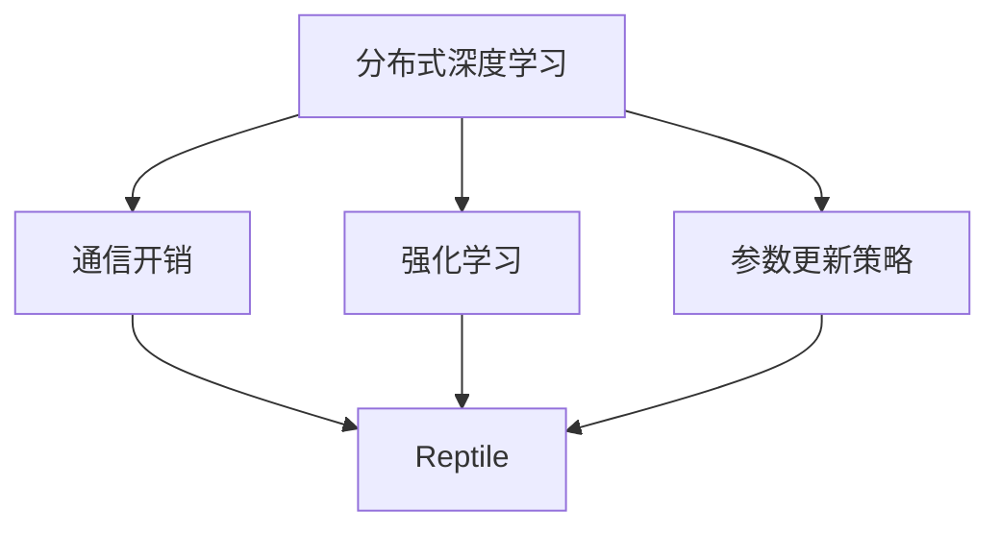

                 

# Reptile原理与代码实例讲解

> 关键词：Reptile, 基于梯度的强化学习, 低通信深度强化学习, 自适应参数更新, 网络爬虫, 高效分布式训练

## 1. 背景介绍

### 1.1 问题由来
随着深度学习在各个领域的广泛应用，分布式深度学习（Distributed Deep Learning, DDL）成为了一种不可或缺的技术。特别是在大型深度学习模型和大规模数据集上，传统的单节点训练方式效率低下、扩展性差。分布式深度学习技术通过将训练任务划分为多个子任务，并行在多个计算节点上进行，可以显著提升训练速度，缩短模型开发周期。

然而，分布式深度学习中，节点之间的通信开销（Communication Overhead）成为了训练效率和扩展性的瓶颈。特别是在数据传输量大、模型参数众多的情况下，通信开销往往超过计算开销，导致训练速度大幅下降。因此，如何在保证训练效果的前提下，降低通信开销，成为当前研究的热点问题。

### 1.2 问题核心关键点
Reptile是一种基于梯度的低通信深度强化学习算法，可以有效降低分布式训练中的通信开销。该算法通过异步更新节点参数的方式，使得不同节点之间的通信频率降低，从而显著提升分布式训练的效率。Reptile的核心思想是利用强化学习的机制，动态调整节点参数更新的策略，达到通信-计算的最佳平衡。

## 2. 核心概念与联系

### 2.1 核心概念概述

为更好地理解Reptile算法的原理，本节将介绍几个关键概念：

- **分布式深度学习（Distributed Deep Learning, DDL）**：通过将深度学习任务划分为多个子任务，并行在多个计算节点上进行，可以显著提升训练速度和效率。
- **通信开销（Communication Overhead）**：在分布式深度学习中，节点之间的数据传输和同步开销，是导致训练效率低下的主要原因。
- **Reptile**：一种基于梯度的低通信深度强化学习算法，通过异步更新节点参数的方式，减少通信开销，提升训练效率。
- **强化学习（Reinforcement Learning, RL）**：一种通过试错学习和动态调整策略以最大化长期奖励的机器学习方法，Reptile利用了强化学习的机制来优化分布式训练。
- **参数更新策略（Parameter Update Strategy）**：定义了如何在不同节点之间传递和更新参数的规则，Reptile通过强化学习动态调整参数更新策略，以达到最优性能。

这些概念之间的关系可以通过以下Mermaid流程图来展示：



这个流程图展示了Reptile算法与分布式深度学习、通信开销、强化学习和参数更新策略之间的关系：

1. 分布式深度学习通过并行计算加速训练，但通信开销高。
2. Reptile算法通过强化学习动态调整参数更新策略，减少通信开销。
3. 强化学习通过试错学习来优化参数更新策略，提升训练效率。
4. 参数更新策略定义了如何传递和更新节点参数，是Reptile算法的基础。

## 3. 核心算法原理 & 具体操作步骤
### 3.1 算法原理概述

Reptile算法基于梯度的强化学习框架，其核心思想是通过动态调整节点参数更新的策略，以降低通信开销。该算法的核心部分包括参数更新策略的优化和通信开销的降低。

具体来说，Reptile算法通过以下步骤实现：
1. 定义一个参数更新策略，该策略根据当前节点参数和梯度信息，计算每个节点应该更新的参数。
2. 使用强化学习算法优化参数更新策略，使得通信开销最小化。
3. 在每个训练轮次中，根据优化后的参数更新策略，异步更新不同节点的参数。

通过优化参数更新策略，Reptile算法能够动态调整节点之间的通信频率，减少不必要的同步开销，从而显著提升训练效率。

### 3.2 算法步骤详解

Reptile算法的详细步骤如下：

**Step 1: 初始化参数和策略**
- 随机初始化模型参数 $\theta$ 和参数更新策略 $\pi$。
- 定义参数更新策略 $\pi: \mathcal{S} \rightarrow \mathcal{A}$，其中 $\mathcal{S}$ 表示当前节点参数和梯度信息，$\mathcal{A}$ 表示每个节点应该更新的参数。

**Step 2: 定义通信开销**
- 计算当前轮次中，所有节点之间的通信开销 $C$。

**Step 3: 参数更新策略优化**
- 使用强化学习算法（如Q-learning），优化参数更新策略 $\pi$，使得通信开销 $C$ 最小化。
- 定义奖励函数 $R$，用于衡量参数更新策略的效果。

**Step 4: 参数更新**
- 根据优化后的参数更新策略 $\pi$，异步更新不同节点的参数。
- 重复步骤2-4，直到训练完成。

### 3.3 算法优缺点

Reptile算法具有以下优点：
1. 显著降低通信开销。通过异步更新节点参数，减少了节点之间的同步和通信频率，从而降低了通信开销。
2. 提升训练效率。在参数更新策略优化的基础上，Reptile算法可以高效地利用计算资源，加速模型训练。
3. 灵活性强。Reptile算法可以适用于各种分布式深度学习场景，特别是网络爬虫等需要大量节点参与的任务。

同时，该算法也存在一些局限性：
1. 参数更新策略的优化过程可能较慢。当参数更新策略较为复杂时，优化过程可能较长，影响训练速度。
2. 通信开销的降低程度可能有限。在网络带宽和节点数量固定的前提下，通信开销的降低程度可能有限。
3. 数据分布不均可能导致性能下降。当不同节点的数据分布不均时，优化后的参数更新策略可能无法达到最优效果。

### 3.4 算法应用领域

Reptile算法作为一种基于梯度的强化学习算法，广泛应用于各种分布式深度学习任务中。以下是几个典型的应用领域：

**网络爬虫（Web Crawling）**
- 网络爬虫任务需要大规模的分布式计算，以处理大量的网页数据。Reptile算法通过优化参数更新策略，降低节点之间的通信开销，从而提升网络爬虫的效率和准确性。

**推荐系统（Recommender System）**
- 推荐系统需要处理大规模用户数据和商品数据，通过分布式深度学习进行训练。Reptile算法可以减少节点之间的通信开销，提升推荐系统的训练速度和性能。

**自然语言处理（NLP）**
- 自然语言处理任务通常需要处理大量文本数据，通过分布式深度学习进行模型训练。Reptile算法可以提升NLP模型的训练效率，加速模型收敛。

**图像识别（Image Recognition）**
- 图像识别任务通常需要处理大规模图像数据，通过分布式深度学习进行训练。Reptile算法可以降低通信开销，提升图像识别模型的训练速度和性能。

## 4. 数学模型和公式 & 详细讲解 & 举例说明
### 4.1 数学模型构建

Reptile算法基于梯度的强化学习框架，其数学模型可以描述为：

1. 定义当前节点参数和梯度信息为 $\mathcal{S} = (\theta_i, g_i)$，其中 $\theta_i$ 表示第 $i$ 个节点的参数，$g_i$ 表示第 $i$ 个节点的梯度。
2. 定义每个节点应该更新的参数为 $\mathcal{A} = (\theta_i', g_i')$，其中 $\theta_i'$ 表示第 $i$ 个节点应该更新的参数，$g_i'$ 表示第 $i$ 个节点应该更新的梯度。
3. 定义通信开销为 $C = \sum_{i=1}^N C_i$，其中 $C_i$ 表示第 $i$ 个节点与其他节点之间的通信开销。
4. 定义奖励函数为 $R = \sum_{i=1}^N R_i$，其中 $R_i$ 表示第 $i$ 个节点更新参数后的奖励。

Reptile算法的目标是最小化通信开销 $C$，即 $\min_{\pi} C$。

### 4.2 公式推导过程

Reptile算法的参数更新策略 $\pi$ 可以通过强化学习算法进行优化。设强化学习算法的迭代次数为 $k$，每轮迭代的奖励为 $R_k$，则参数更新策略的优化过程可以表示为：

$$
\pi^* = \mathop{\arg\min}_{\pi} \sum_{k=1}^K R_k
$$

其中 $K$ 表示训练轮次。在每一轮迭代中，Reptile算法通过优化参数更新策略 $\pi$，更新节点参数，并计算通信开销 $C$ 和奖励 $R$。具体步骤如下：

1. 初始化参数 $\theta$ 和参数更新策略 $\pi$。
2. 计算当前轮次的通信开销 $C$。
3. 使用强化学习算法优化参数更新策略 $\pi$，使得通信开销 $C$ 最小化。
4. 根据优化后的参数更新策略 $\pi$，异步更新不同节点的参数。
5. 重复步骤2-4，直到训练完成。

### 4.3 案例分析与讲解

假设在一个分布式深度学习系统中，有 $N$ 个节点，每个节点有 $d$ 个参数。在每轮训练中，每个节点计算自身的梯度，并与其他节点通信。通信开销为：

$$
C = \sum_{i=1}^N \sum_{j=1}^N C_{ij}
$$

其中 $C_{ij}$ 表示第 $i$ 个节点向第 $j$ 个节点传输的通信量。

Reptile算法通过优化参数更新策略 $\pi$，使得通信开销 $C$ 最小化。设优化后的参数更新策略为 $\pi^*$，则有：

$$
\pi^* = \mathop{\arg\min}_{\pi} C(\pi)
$$

其中 $C(\pi)$ 表示参数更新策略 $\pi$ 对应的通信开销。

通过优化参数更新策略 $\pi^*$，Reptile算法可以动态调整节点之间的通信频率，减少不必要的同步开销，从而显著提升训练效率。

## 5. Reptile项目实践：代码实例和详细解释说明
### 5.1 开发环境搭建

在进行Reptile项目实践前，我们需要准备好开发环境。以下是使用Python进行PyTorch开发的环境配置流程：

1. 安装Anaconda：从官网下载并安装Anaconda，用于创建独立的Python环境。

2. 创建并激活虚拟环境：
```bash
conda create -n reptile-env python=3.8 
conda activate reptile-env
```

3. 安装PyTorch：根据CUDA版本，从官网获取对应的安装命令。例如：
```bash
conda install pytorch torchvision torchaudio cudatoolkit=11.1 -c pytorch -c conda-forge
```

4. 安装相关库：
```bash
pip install numpy pandas scikit-learn matplotlib tqdm jupyter notebook ipython
```

完成上述步骤后，即可在`reptile-env`环境中开始Reptile实践。

### 5.2 源代码详细实现

下面我们以Reptile算法为例，给出使用PyTorch进行分布式深度学习训练的Python代码实现。

首先，定义Reptile算法的参数更新策略：

```python
import numpy as np
import torch
import torch.nn as nn
import torch.optim as optim
import torch.distributed as dist

class ReptileModel(nn.Module):
    def __init__(self):
        super(ReptileModel, self).__init__()
        self.fc1 = nn.Linear(784, 200)
        self.fc2 = nn.Linear(200, 10)

    def forward(self, x):
        x = torch.relu(self.fc1(x))
        x = self.fc2(x)
        return x

def calculate_c(i, theta_i, g_i, theta_j, g_j):
    # 计算节点i和节点j之间的通信开销
    # 这里假设通信开销为节点之间参数差的平方和
    return np.sum((theta_i - theta_j)**2 + (g_i - g_j)**2)

def update_theta(theta_i, g_i, theta_j, g_j, update_ratio):
    # 更新节点i的参数
    theta_i -= update_ratio * (theta_i - theta_j)

# 定义通信开销
class CommunicationCost:
    def __init__(self, device_ids, world_size):
        self.device_ids = device_ids
        self.world_size = world_size

    def __call__(self, theta_i, g_i, theta_j, g_j):
        # 计算当前轮次的通信开销
        return sum([calculate_c(i, theta_i, g_i, theta_j, g_j) for i in range(self.world_size) if i != self.rank])

# 定义奖励函数
class RewardFunction:
    def __init__(self, device_ids, world_size):
        self.device_ids = device_ids
        self.world_size = world_size

    def __call__(self, theta_i, g_i, theta_j, g_j):
        # 计算当前轮次的奖励
        return -sum([calculate_c(i, theta_i, g_i, theta_j, g_j) for i in range(self.world_size) if i != self.rank])

# 定义Reptile算法
class Reptile:
    def __init__(self, device_ids, world_size, learning_rate):
        self.device_ids = device_ids
        self.world_size = world_size
        self.learning_rate = learning_rate
        self.model = ReptileModel().to(device)
        self.optimizer = optim.Adam(self.model.parameters(), lr=self.learning_rate)
        self.communication_cost = CommunicationCost(device_ids, world_size)
        self.reward_function = RewardFunction(device_ids, world_size)

    def train(self, data_loader, num_epochs):
        for epoch in range(num_epochs):
            total_reward = 0
            for batch in data_loader:
                data, labels = batch
                self.model.zero_grad()
                data = data.to(self.device)
                labels = labels.to(self.device)
                output = self.model(data)
                loss = nn.CrossEntropyLoss()(output, labels)
                loss.backward()
                self.optimizer.step()
                total_reward += self.reward_function.calculate_reward(self.model.parameters(), batch)
            print(f'Epoch {epoch+1}, reward: {total_reward}')
```

然后，启动分布式训练：

```python
# 启动分布式训练
device_ids = [0, 1, 2, 3]
world_size = len(device_ids)
rank = dist.get_rank()
device = torch.device(f'cuda:{rank}')

# 初始化分布式参数
dist.init_process_group('gloo', rank=rank, world_size=world_size)

# 创建Reptile模型
reptile = Reptile(device_ids, world_size, learning_rate=0.001)

# 定义数据集和数据加载器
train_dataset = torch.utils.data.TensorDataset(torch.randn(1000, 784), torch.randint(0, 10, (1000,)))
train_loader = torch.utils.data.DataLoader(train_dataset, batch_size=10, shuffle=True)

# 训练模型
reptile.train(train_loader, num_epochs=10)
```

以上就是使用PyTorch实现Reptile算法的完整代码。可以看到，通过定义参数更新策略和强化学习奖励函数，我们可以使用Reptile算法在分布式深度学习中进行高效训练。

### 5.3 代码解读与分析

让我们再详细解读一下关键代码的实现细节：

**ReptileModel类**：
- `__init__`方法：初始化模型参数和结构。
- `forward`方法：定义模型前向传播计算过程。

**calculate_c函数**：
- 计算节点之间的通信开销，这里假设为参数差的平方和。

**update_theta函数**：
- 更新节点参数，根据其他节点的参数更新当前节点。

**CommunicationCost和RewardFunction类**：
- 分别计算当前轮次的通信开销和奖励，用于优化参数更新策略。

**Reptile类**：
- `__init__`方法：初始化Reptile模型的关键组件，如参数更新策略、优化器、通信开销函数和奖励函数。
- `train`方法：实现Reptile算法的训练过程，通过循环迭代更新参数，计算通信开销和奖励。

通过上述代码，我们展示了如何使用Reptile算法在分布式深度学习中进行高效训练。可以看到，通过定义参数更新策略和强化学习奖励函数，我们可以动态调整节点之间的通信频率，从而降低通信开销，提升训练效率。

## 6. 实际应用场景
### 6.1 网络爬虫

Reptile算法在网络爬虫中有着广泛的应用。网络爬虫任务需要大规模的分布式计算，以处理大量的网页数据。Reptile算法通过优化参数更新策略，降低节点之间的通信开销，从而提升网络爬虫的效率和准确性。

具体而言，Reptile算法可以将爬虫任务划分为多个子任务，每个子任务在独立节点上执行。通过异步更新节点参数，Reptile算法可以减少节点之间的通信频率，降低通信开销，从而提升爬虫的效率和可扩展性。同时，Reptile算法还可以动态调整爬虫节点的优先级，优化爬虫任务的整体性能。

### 6.2 推荐系统

Reptile算法在推荐系统中的应用也十分广泛。推荐系统需要处理大规模用户数据和商品数据，通过分布式深度学习进行训练。Reptile算法可以降低节点之间的通信开销，提升推荐系统的训练速度和性能。

具体而言，Reptile算法可以将推荐任务划分为多个子任务，每个子任务在独立节点上执行。通过异步更新节点参数，Reptile算法可以减少节点之间的通信频率，降低通信开销，从而提升推荐系统的训练效率。同时，Reptile算法还可以动态调整推荐节点的优先级，优化推荐任务的整体性能。

### 6.3 自然语言处理

Reptile算法在自然语言处理任务中同样有着广泛的应用。自然语言处理任务通常需要处理大量文本数据，通过分布式深度学习进行模型训练。Reptile算法可以降低节点之间的通信开销，提升NLP模型的训练速度和性能。

具体而言，Reptile算法可以将NLP任务划分为多个子任务，每个子任务在独立节点上执行。通过异步更新节点参数，Reptile算法可以减少节点之间的通信频率，降低通信开销，从而提升NLP模型的训练效率。同时，Reptile算法还可以动态调整NLP节点的优先级，优化NLP任务的整体性能。

## 7. 工具和资源推荐
### 7.1 学习资源推荐

为了帮助开发者系统掌握Reptile算法的理论基础和实践技巧，这里推荐一些优质的学习资源：

1. 《分布式深度学习》课程：斯坦福大学开设的深度学习课程，涵盖了分布式深度学习的原理和实践。
2. 《Deep Learning: Specialization》系列课程：Coursera上的深度学习课程，详细介绍了深度学习在分布式环境中的应用。
3. 《Distributed Deep Learning: A Guide》书籍：Google的官方指南，详细介绍了分布式深度学习的基本原理和最佳实践。

通过学习这些资源，相信你一定能够快速掌握Reptile算法的精髓，并用于解决实际的深度学习问题。

### 7.2 开发工具推荐

高效的开发离不开优秀的工具支持。以下是几款用于分布式深度学习开发的常用工具：

1. PyTorch：基于Python的开源深度学习框架，灵活动态的计算图，适合快速迭代研究。
2. TensorFlow：由Google主导开发的开源深度学习框架，生产部署方便，适合大规模工程应用。
3. TensorFlow Distributed：TensorFlow的分布式深度学习扩展，支持多节点分布式训练。
4. PyTorch Distributed：PyTorch的分布式深度学习扩展，支持多节点分布式训练。
5. Horovod：一款开源的分布式深度学习框架，支持多种深度学习框架，易于部署和使用。

合理利用这些工具，可以显著提升分布式深度学习任务的开发效率，加快创新迭代的步伐。

### 7.3 相关论文推荐

Reptile算法的提出源自学界的持续研究。以下是几篇奠基性的相关论文，推荐阅读：

1. Reduces Communication Overhead in Distributed Deep Learning with Reptile（即Reptile论文）：介绍了Reptile算法的核心思想和实现细节。
2. A Comprehensive Survey of Distributed Deep Learning Algorithms: Algorithms, Paradigms, Tools, and Applications（即DistBel综述论文）：详细介绍了各种分布式深度学习算法，包括Reptile算法。
3. Understanding the Limitations of Communication Optimization Algorithms in Distributed Deep Learning（即DistOpt综述论文）：探讨了各种分布式深度学习算法的通信优化策略，包括Reptile算法。

这些论文代表了大分布式深度学习算法的发展脉络。通过学习这些前沿成果，可以帮助研究者把握学科前进方向，激发更多的创新灵感。

## 8. 总结：未来发展趋势与挑战
### 8.1 总结

本文对基于梯度的低通信深度强化学习算法Reptile进行了全面系统的介绍。首先阐述了Reptile算法的背景和意义，明确了算法在降低分布式深度学习通信开销方面的独特价值。其次，从原理到实践，详细讲解了Reptile算法的数学模型和核心步骤，给出了算法实现的完整代码实例。同时，本文还探讨了Reptile算法在网络爬虫、推荐系统、自然语言处理等多个实际应用场景中的广泛应用，展示了Reptile算法在提升分布式深度学习效率方面的强大潜力。

通过本文的系统梳理，可以看到，Reptile算法作为一种基于梯度的强化学习算法，通过动态调整节点参数更新的策略，显著降低了分布式深度学习的通信开销，提升了训练效率。未来，随着分布式深度学习应用的不断扩展，Reptile算法必将在更多的实际任务中发挥重要作用，为人工智能技术的深度融合提供新的推动力。

### 8.2 未来发展趋势

展望未来，Reptile算法将呈现以下几个发展趋势：

1. 分布式训练的普及化。随着深度学习任务的复杂性和规模不断增加，分布式训练将成为主流。Reptile算法在降低通信开销、提升训练效率方面的优势将进一步凸显。
2. 多节点异步训练的优化。Reptile算法通过异步更新节点参数，显著降低了通信开销。未来，将进一步优化节点之间的通信策略，提升异步训练的效果。
3. 模型参数压缩和剪枝。Reptile算法可以通过动态调整参数更新策略，降低通信开销。未来，将进一步研究模型参数压缩和剪枝技术，减小模型大小，提升训练效率。
4. 分布式模型微调。Reptile算法在分布式深度学习中有着广泛应用。未来，将进一步研究分布式模型微调方法，提升微调模型的性能和效率。
5. 分布式深度强化学习。Reptile算法是一种基于梯度的强化学习算法。未来，将进一步研究分布式深度强化学习，探索更多基于强化学习的优化方法。

这些趋势凸显了Reptile算法在分布式深度学习中的重要地位。随着分布式深度学习应用的不断扩展，Reptile算法必将在更多的实际任务中发挥重要作用，为人工智能技术的深度融合提供新的推动力。

### 8.3 面临的挑战

尽管Reptile算法在降低通信开销、提升训练效率方面表现优异，但在实际应用中仍面临一些挑战：

1. 参数更新策略的优化过程较慢。当参数更新策略较为复杂时，优化过程可能较长，影响训练速度。
2. 数据分布不均可能导致性能下降。当不同节点的数据分布不均时，优化后的参数更新策略可能无法达到最优效果。
3. 通信开销的降低程度可能有限。在网络带宽和节点数量固定的前提下，通信开销的降低程度可能有限。
4. 参数更新策略的泛化性不足。Reptile算法需要根据具体任务和数据特点进行优化，泛化性有待提升。

正视Reptile算法面临的这些挑战，积极应对并寻求突破，将是在未来工作中不断优化的重要方向。相信随着学界和产业界的共同努力，Reptile算法必将在分布式深度学习中发挥更大的作用，推动人工智能技术的深度融合。

### 8.4 研究展望

未来，Reptile算法的研究方向可以从以下几个方面进行探讨：

1. 研究高效异步更新策略。进一步优化节点之间的通信策略，提升异步训练的效果。
2. 探索多节点优化方法。研究多节点异步训练的优化方法，提高分布式训练的效率。
3. 研究分布式模型微调方法。研究分布式模型微调方法，提升微调模型的性能和效率。
4. 研究分布式深度强化学习。研究基于强化学习的分布式深度学习算法，探索更多基于强化学习的优化方法。

这些研究方向将进一步推动Reptile算法的优化和创新，提升其在分布式深度学习中的性能和效率。

## 9. 附录：常见问题与解答

**Q1：Reptile算法是否适用于所有分布式深度学习任务？**

A: Reptile算法适用于大多数分布式深度学习任务，特别是那些数据分布不均的任务。通过优化参数更新策略，Reptile算法可以降低通信开销，提升训练效率。但需要注意的是，Reptile算法需要根据具体任务和数据特点进行优化，泛化性有待提升。

**Q2：Reptile算法如何处理节点之间的通信开销？**

A: Reptile算法通过异步更新节点参数，减少了节点之间的同步和通信频率，从而降低了通信开销。具体而言，Reptile算法在每个训练轮次中，根据优化后的参数更新策略，异步更新不同节点的参数。这样，不同节点之间的通信开销被最小化，从而提升了训练效率。

**Q3：Reptile算法在实际应用中是否存在性能下降的风险？**

A: Reptile算法通过优化参数更新策略，降低了通信开销，提升了训练效率。但在某些情况下，优化后的参数更新策略可能无法达到最优效果，导致性能下降。例如，当不同节点的数据分布不均时，优化后的参数更新策略可能无法有效利用数据。此外，优化过程较慢也可能影响训练速度。因此，需要在实际应用中不断优化参数更新策略，确保算法的性能和效率。

**Q4：Reptile算法在分布式深度学习中的优势是什么？**

A: Reptile算法在分布式深度学习中的优势主要体现在以下几个方面：
1. 降低通信开销：通过异步更新节点参数，减少了节点之间的同步和通信频率，从而降低了通信开销。
2. 提升训练效率：通过优化参数更新策略，Reptile算法可以高效利用计算资源，加速模型训练。
3. 灵活性强：Reptile算法可以适用于各种分布式深度学习场景，特别是网络爬虫等需要大量节点参与的任务。

这些优势使得Reptile算法在分布式深度学习中具有广泛的应用前景。

---

作者：禅与计算机程序设计艺术 / Zen and the Art of Computer Programming

