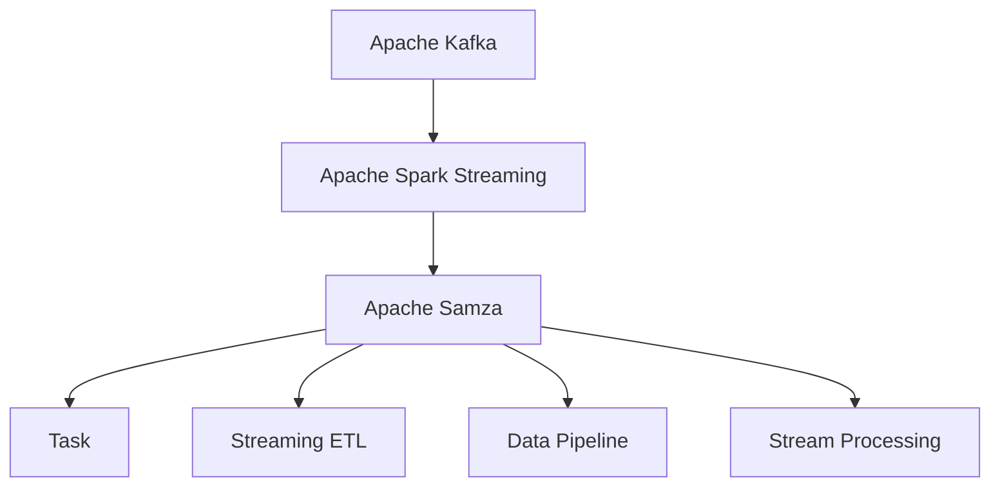

                 

# Samza Task原理与代码实例讲解

> 关键词：Samza, Kafka, Spark, Spark Streaming, Task, ETL, Data Pipeline, Stream Processing, Apache, Big Data, Stream Computation

## 1. 背景介绍

### 1.1 问题由来
在大数据时代，数据源越来越丰富，数据类型也日益多样化。企业需要处理的数据不仅包括传统的批处理数据，还包括实时数据流，如日志、传感器数据、交易数据等。传统的ETL（Extract, Transform, Load）流程难以适应这种多样化的数据需求。

为了应对实时数据流的挑战，Apache Samza应运而生。Samza是由LinkedIn开发的一款开源流处理框架，其核心思想是将数据流视为事件流(Event Stream)，利用Apache Kafka作为消息传递的媒介，结合Apache Spark Streaming等技术，实现高效、可靠、可扩展的实时数据处理。

### 1.2 问题核心关键点
Samza框架的核心关键点包括：

- **事件驱动设计**：Samza将数据流视为事件流，将每个事件作为一个单独的消息进行处理，保证数据处理的及时性。
- **分布式计算**：Samza利用Apache Spark Streaming进行分布式计算，充分利用集群资源，提高数据处理效率。
- **数据可靠性和容错性**：Samza支持自动分区和复制机制，保证数据处理的高可靠性和容错性。
- **任务并行处理**：Samza支持将任务划分为多个并行子任务，提升数据处理的并发度。
- **状态管理**：Samza利用Apache Kafka作为状态存储媒介，保证任务状态的高可用性。

Samza的这些特点使其成为处理海量实时数据流的理想选择，广泛应用于日志分析、实时流计算、实时数据湖等领域。

## 2. 核心概念与联系

### 2.1 核心概念概述

为更好地理解Samza的任务机制，本节将介绍几个密切相关的核心概念：

- **Apache Kafka**：分布式消息传递系统，是Samza的核心组件之一。Kafka提供了高吞吐量的消息存储和发布订阅功能，支持数据的可靠性和高可用性。
- **Apache Spark Streaming**：分布式流处理框架，是Samza的计算引擎。Spark Streaming利用微批处理算法，高效处理实时数据流。
- **Task**：Samza中任务的抽象概念，是将数据流分解为独立子任务的单元。Task通过划分数据流，实现并行处理。
- **Streaming ETL**：基于Samza的任务机制，结合Kafka和Spark Streaming，实现高效、可靠的实时ETL流程。
- **Data Pipeline**：数据管道，是数据从原始来源到最终消费的完整生命周期管理。Samza支持构建复杂的数据管道，实现数据的自动采集、处理和存储。
- **Stream Processing**：实时流计算，是处理实时数据流的基本方法。Samza利用Spark Streaming进行高效的数据流处理。
- **Apache**：Apache基金会下众多开源项目的组织形式，包括Kafka、Spark Streaming、Samza等。

这些核心概念之间的逻辑关系可以通过以下Mermaid流程图来展示：



这个流程图展示了大语言模型的核心概念及其之间的关系：

1. Kafka提供高吞吐量的消息存储和发布订阅功能，支持数据的可靠性和高可用性。
2. Spark Streaming利用微批处理算法，高效处理实时数据流。
3. Samza通过Task机制将数据流分解为独立子任务，实现并行处理。
4. Streaming ETL利用Kafka和Spark Streaming，实现高效、可靠的实时ETL流程。
5. Data Pipeline管理数据从原始来源到最终消费的完整生命周期。
6. Stream Processing是处理实时数据流的基本方法，Samza利用Spark Streaming进行高效的数据流处理。

## 3. 核心算法原理 & 具体操作步骤

### 3.1 算法原理概述

Samza的核心算法原理主要涉及事件驱动设计、分布式计算、数据可靠性和状态管理等几个方面。

- **事件驱动设计**：Samza将数据流视为事件流，每个事件作为一个单独的消息进行处理，确保数据的及时性。
- **分布式计算**：Samza利用Apache Spark Streaming进行分布式计算，提高数据处理的效率和可扩展性。
- **数据可靠性和容错性**：Samza支持自动分区和复制机制，保证数据处理的高可靠性和容错性。
- **任务并行处理**：Samza通过Task机制将数据流分解为独立子任务，实现并行处理。
- **状态管理**：Samza利用Apache Kafka作为状态存储媒介，保证任务状态的高可用性。

### 3.2 算法步骤详解

Samza的典型任务处理流程包括以下几个关键步骤：

**Step 1: 准备数据源和目标存储**

- 准备Kafka消息流作为数据源，并设置Kafka消费者的分区和偏移量。
- 设置Spark Streaming的任务状态和状态存储器。

**Step 2: 划分数据流为Task**

- 根据任务划分策略，将数据流分解为多个Task，每个Task负责处理一部分数据。
- 定义Task的并行度，决定Task的并发处理能力。

**Step 3: 实现Task处理逻辑**

- 在Task中，实现数据的转换、过滤、聚合等处理逻辑。
- 利用Spark Streaming的API编写Task处理函数。

**Step 4: 处理状态数据**

- 利用Kafka作为状态存储器，保存Task的状态数据。
- 通过Kafka消息传递，实现Task状态的同步更新。

**Step 5: 发布处理结果**

- 将Task的处理结果发布到Kafka目标存储，完成数据管道。
- 定期将处理结果写入数据库或文件系统。

**Step 6: 监控和调试**

- 利用Samza提供的监控工具，实时查看任务执行情况和性能指标。
- 利用日志系统，记录Task处理过程中的错误信息，方便调试和故障排查。

### 3.3 算法优缺点

Samza框架在实时数据流处理方面具有以下优点：

- **高效可靠**：利用Kafka和Spark Streaming，提供高吞吐量、高可靠性的数据处理能力。
- **分布式计算**：支持大规模并行计算，利用集群资源，提高数据处理效率。
- **任务并行处理**：通过Task机制，实现数据流的并行处理，提升系统吞吐量。
- **状态管理**：利用Kafka作为状态存储媒介，保证任务状态的高可用性。
- **容错性**：支持自动分区和复制机制，保证数据处理的高可靠性和容错性。

同时，Samza也存在一些局限性：

- **学习成本高**：由于Samza集成了Kafka和Spark Streaming，需要开发者具备一定的分布式计算和流处理经验。
- **复杂度高**：Samza的配置和调优较为复杂，需要综合考虑任务划分、并行度、状态管理等多个因素。
- **资源占用高**：Samza的计算和存储资源消耗较大，需要合理配置集群资源。
- **实时性依赖**：Samza对Kafka和Spark Streaming的依赖较强，一旦出现网络延迟或系统故障，会影响数据处理的及时性。

### 3.4 算法应用领域

Samza在实时数据处理领域已经得到了广泛的应用，覆盖了以下诸多场景：

- **日志分析**：实时收集和分析应用日志，监控系统性能，排查故障。
- **实时流计算**：实时计算业务指标，如交易量、点击率、转化率等。
- **实时数据湖**：实时将数据湖中的数据进行清洗、整合和计算，提升数据处理效率。
- **事件驱动架构**：构建基于事件驱动的应用架构，实现松耦合、高弹性的系统设计。
- **智能推荐系统**：实时处理用户行为数据，进行商品推荐、个性化推荐等。
- **实时金融数据处理**：实时处理交易数据、市场数据等，提升金融业务的智能化水平。
- **实时社交网络分析**：实时分析社交网络数据，进行舆情监测、用户行为分析等。

除了上述这些经典应用外，Samza也被创新性地应用于更多场景中，如物联网设备数据处理、智能制造流程监控、智慧城市实时数据分析等，为大数据应用提供了强大的支持。

## 4. 数学模型和公式 & 详细讲解  
### 4.1 数学模型构建

本节将使用数学语言对Samza的任务机制进行更加严格的刻画。

设Kafka消息流的数据源为 $\{m_1, m_2, ..., m_n\}$，其中 $m_i$ 为第 $i$ 个消息。Samza的任务 $T$ 将消息流 $\{m_1, m_2, ..., m_n\}$ 划分为多个Task $\{T_1, T_2, ..., T_k\}$，每个Task负责处理一部分数据。Task的并行度为 $p$，即每个Task可以并行处理 $p$ 个消息。

设Task $T_i$ 的输入消息为 $m_{i_1}, m_{i_2}, ..., m_{i_p}$，输出消息为 $m_{o_1}, m_{o_2}, ..., m_{o_p}$。Task $T_i$ 的任务函数为 $f_i$，定义如下：

$$
f_i(m_{i_1}, m_{i_2}, ..., m_{i_p}) = \{m_{o_1}, m_{o_2}, ..., m_{o_p}\}
$$

Task $T_i$ 的状态 $s_i$ 存储在Kafka中，通过Kafka消息传递机制实现状态同步更新。

### 4.2 公式推导过程

设Task $T_i$ 的输入消息为 $\{m_{i_1}, m_{i_2}, ..., m_{i_p}\}$，输出消息为 $\{m_{o_1}, m_{o_2}, ..., m_{o_p}\}$，Task的状态为 $s_i$，定义如下：

$$
\begin{aligned}
&\{m_{o_1}, m_{o_2}, ..., m_{o_p}\} = f_i(\{m_{i_1}, m_{i_2}, ..., m_{i_p}\}, s_i) \\
&s_i' = f_i^s(\{m_{i_1}, m_{i_2}, ..., m_{i_p}\}, s_i)
\end{aligned}
$$

其中 $f_i^s$ 为状态更新函数，将Task的状态 $s_i$ 和输入消息 $\{m_{i_1}, m_{i_2}, ..., m_{i_p}\}$ 作为输入，输出更新后的状态 $s_i'$。

### 4.3 案例分析与讲解

以实时日志分析为例，分析Samza任务的实现步骤。

假设系统要实时处理应用日志，计算每个小时的访问量。Kafka消息流中包含应用日志消息，如 $\{m_1, m_2, ..., m_n\}$。Samza的任务 $T$ 将消息流 $\{m_1, m_2, ..., m_n\}$ 划分为多个Task $\{T_1, T_2, ..., T_k\}$，每个Task负责处理一部分数据。

Task $T_i$ 的任务函数为 $f_i$，将输入的消息流 $\{m_{i_1}, m_{i_2}, ..., m_{i_p}\}$ 进行聚合计算，得到当前小时内的访问量，并更新状态 $s_i$。假设 Task $T_i$ 的任务函数为：

$$
f_i(m_{i_1}, m_{i_2}, ..., m_{i_p}) = \sum_{j=1}^p m_{i_j}
$$

设Task $T_i$ 的状态 $s_i$ 存储在Kafka中，通过Kafka消息传递机制实现状态同步更新。假设 Task $T_i$ 的状态更新函数为 $f_i^s$，将当前小时内的访问量 $m_{o_1}, m_{o_2}, ..., m_{o_p}$ 和状态 $s_i$ 作为输入，输出更新后的状态 $s_i'$。假设 Task $T_i$ 的状态更新函数为：

$$
s_i' = m_{o_1} + m_{o_2} + ... + m_{o_p}
$$

Task $T_i$ 处理完数据后，将当前小时内的访问量发布到Kafka目标存储中，完成数据管道。

## 5. 项目实践：代码实例和详细解释说明
### 5.1 开发环境搭建

在进行Samza项目实践前，我们需要准备好开发环境。以下是使用Python进行Samza开发的环境配置流程：

1. 安装Apache Kafka：从官网下载并安装Kafka，配置Zookeeper。
```bash
wget https://downloads.apache.org/kafka/2.12.0/kafka_2.12-2.0.0.tgz
tar -xvzf kafka_2.12-2.0.0.tgz
cd kafka_2.12-2.0.0
bin/kafka-server-start.sh config/server.properties
```

2. 安装Apache Spark：从官网下载并安装Spark，配置Spark Streaming的依赖。
```bash
wget https://downloads.apache.org/spark/spark-2.4.0/spark-2.4.0.tgz
tar -xvzf spark-2.4.0.tgz
cd spark-2.4.0
./sbin/start-master.sh
./sbin/start-slave.sh spark://master:7077
```

3. 安装Apache Samza：从官网下载并安装Samza，配置Samza的依赖。
```bash
wget https://github.com/spotify/samza/releases/download/0.18.0/samza-0.18.0.tgz
tar -xvzf samza-0.18.0.tgz
cd samza-0.18.0
bin/samza-admin start
```

完成上述步骤后，即可在开发环境中开始Samza实践。

### 5.2 源代码详细实现

下面我们以实时日志分析为例，给出使用Samza框架进行开发的PyTorch代码实现。

首先，定义Kafka消息流和Samza任务的配置：

```python
from samza.config import job
from samza.context import StreamingContext

# Kafka消息流配置
job.config.brokers = ['localhost:9092']
job.config.topics = ['logs']
job.config.inputTopicPartition = (0,)

# Samza任务配置
ssc = StreamingContext(spark.sparkContext, 2)
job.config.numPartitions = 2
```

然后，定义Samza任务的状态和处理函数：

```python
from samza.context import StreamingContext
from samza.operators import Map

# Task的状态
s1 = {"hour": 1}

# Task的处理函数
map = Map(ssc)

# 定义任务处理逻辑
def task():
    while True:
        msg = yield
        hour = msg.partition().key
        visits = sum(msg.values())
        s1["hour"] = hour
        s1["visits"] = visits
        yield s1, vis1

# 定义状态更新函数
def update_state(state):
    return state["hour"], state["visits"]
```

接着，编写Samza任务的main函数：

```python
def main():
    # 创建Samza任务
    job = SamzaJob(ssc, map)
    job.initialize(s1)

    # 启动Samza任务
    job.start()

    # 等待任务完成
    while True:
        yield
```

最后，启动Samza任务：

```python
if __name__ == '__main__':
    main()
```

以上就是使用Samza框架进行实时日志分析的完整代码实现。可以看到，通过Samza的Task机制和Kafka的状态存储，我们可以方便地实现数据的并行处理和状态同步。

### 5.3 代码解读与分析

让我们再详细解读一下关键代码的实现细节：

**Samza配置**：
- `job.config.brokers`：指定Kafka服务器的地址和端口。
- `job.config.topics`：指定Kafka消息流的topic名称。
- `job.config.inputTopicPartition`：指定Kafka消息流的分区。

**Samza任务**：
- `s1`：定义Task的状态，存储当前小时的访问量和小时数。
- `map`：定义Task的处理函数，利用Map操作对输入的消息流进行处理。
- `task`：定义任务处理逻辑，从消息流中提取当前小时数和访问量，并更新状态。
- `update_state`：定义状态更新函数，将任务状态和访问量作为输入，返回更新后的状态。

**Samza main函数**：
- `job`：创建Samza任务，指定Task处理函数和状态更新函数。
- `job.initialize(s1)`：初始化任务状态。
- `job.start()`：启动Samza任务。
- `yield`：在Task处理函数中，使用yield返回处理结果和更新状态。

可以看出，通过Samza的任务机制和Kafka的状态存储，我们可以方便地实现数据的并行处理和状态同步。Samza框架的设计非常灵活，支持多种任务处理逻辑和状态更新方式，适用于复杂的实时数据处理场景。

当然，工业级的系统实现还需考虑更多因素，如任务调度、容错机制、监控告警等。但核心的Task机制和Kafka状态存储是始终不变的，开发者可以根据具体需求灵活组合。

## 6. 实际应用场景
### 6.1 智能推荐系统

Samza框架在智能推荐系统中得到了广泛应用。推荐系统需要实时处理用户行为数据，计算用户的兴趣偏好，进行商品推荐、个性化推荐等。

在实践中，可以收集用户浏览、点击、评论、分享等行为数据，提取和用户交互的物品标题、描述、标签等文本内容。将文本内容作为消息流输入Kafka，通过Samza任务进行实时处理，计算用户的兴趣匹配度，并结合其他特征综合排序，便可以得到个性化程度更高的推荐结果。

### 6.2 实时金融数据处理

金融行业需要实时处理大量的交易数据、市场数据等，进行高频交易、风险控制、市场预测等。Samza框架可以实时处理实时数据流，提升金融业务的智能化水平。

在实践中，可以实时收集交易数据、市场数据等，利用Samza任务进行实时计算，统计高频交易、市场波动、交易量等指标，进行风险控制和市场预测。实时生成的结果可以发布到数据库或实时监控系统中，供分析师和决策者使用。

### 6.3 智慧城市实时数据分析

智慧城市需要实时处理各种传感器数据、监控数据等，进行城市事件监测、舆情分析、应急指挥等。Samza框架可以实时处理大量数据流，提升城市管理的自动化和智能化水平。

在实践中，可以实时收集传感器数据、监控数据等，利用Samza任务进行实时分析，检测异常事件、监测舆情变化、优化交通流量等。实时生成的结果可以发布到指挥中心或公共服务平台，供相关部门和市民使用。

### 6.4 未来应用展望

随着Samza框架和Apache生态的不断发展，基于Samza的实时数据处理技术将进一步提升数据处理能力，支持更多复杂的数据应用场景。

未来，Samza将结合更多大数据处理框架和技术，如Apache Flink、Apache Hive等，提升数据处理的灵活性和扩展性。Samza也将结合更多机器学习和深度学习技术，进行实时数据挖掘和分析，提升数据的智能分析和决策支持能力。

同时，Samza还将结合更多云计算平台和技术，如AWS、Google Cloud等，提升数据处理的弹性和可靠性。Samza将支持更多硬件平台和设备，提升数据处理的实时性和稳定性。

## 7. 工具和资源推荐
### 7.1 学习资源推荐

为了帮助开发者系统掌握Samza的任务机制和应用方法，这里推荐一些优质的学习资源：

1. Apache Samza官方文档：Samza的官方文档提供了详细的配置和使用方法，是学习Samza的必备资料。
2. Apache Spark Streaming官方文档：Spark Streaming是Samza的核心组件，官方文档提供了详细的API和使用方法。
3. Apache Kafka官方文档：Kafka是Samza的消息存储媒介，官方文档提供了详细的配置和使用方法。
4. Samza社区论坛：Samza社区论坛提供丰富的讨论和技术支持，是解决Samza问题的首选资源。
5. Apache Hadoop官方文档：Apache Hadoop是大数据处理的重要框架，官方文档提供了详细的配置和使用方法。
6. Samza实例代码：Github上的Samza实例代码提供了丰富的应用场景和代码示例，是学习Samza的良好参考。

通过对这些资源的学习实践，相信你一定能够快速掌握Samza的任务机制和应用方法，并用于解决实际的实时数据处理问题。

### 7.2 开发工具推荐

高效的开发离不开优秀的工具支持。以下是几款用于Samza开发的常用工具：

1. PyTorch：基于Python的开源深度学习框架，灵活动态的计算图，适合快速迭代研究。
2. TensorFlow：由Google主导开发的开源深度学习框架，生产部署方便，适合大规模工程应用。
3. Hadoop：Apache基金会下的大数据处理框架，支持大规模数据存储和处理。
4. Spark：Apache基金会下的通用大数据处理框架，支持多种数据处理方式。
5. Kafka：Apache基金会下的分布式消息传递系统，支持高吞吐量的消息存储和发布订阅。
6. Samza：LinkedIn开发的大数据流处理框架，支持实时数据流处理。
7. Grafana：实时监控和数据可视化工具，支持多种数据源和图表展示。
8. Prometheus：实时监控和告警系统，支持多种数据源和告警规则。
9. ELK Stack：日志收集和分析工具，支持实时日志存储和查询。

合理利用这些工具，可以显著提升Samza项目的开发效率，加快创新迭代的步伐。

### 7.3 相关论文推荐

Samza框架和实时数据流处理技术的发展源于学界的持续研究。以下是几篇奠基性的相关论文，推荐阅读：

1. "Design and Implementation of the Apache Samza Framework"：Apache Samza的架构设计和实现细节。
2. "Samza: Streaming ETL Framework"：Samza的任务机制和数据处理流程。
3. "Stream Processing at LinkedIn"：LinkedIn在实时数据流处理中的实践经验和成果。
4. "Spark Streaming in Practice"：Spark Streaming的实际应用场景和性能优化。
5. "Real-time Processing with Kafka and Spark Streaming"：Kafka和Spark Streaming的结合使用和性能优化。

这些论文代表了大数据流处理技术的发展脉络。通过学习这些前沿成果，可以帮助研究者把握学科前进方向，激发更多的创新灵感。

## 8. 总结：未来发展趋势与挑战

### 8.1 总结

本文对Apache Samza框架的任务机制和应用方法进行了全面系统的介绍。首先阐述了Samza框架的背景和核心关键点，明确了Samza在实时数据流处理中的独特价值。其次，从原理到实践，详细讲解了Samza的任务机制和配置方法，给出了Samza任务开发的完整代码实例。同时，本文还广泛探讨了Samza在智能推荐、金融数据处理、智慧城市分析等多个领域的应用前景，展示了Samza的强大潜力。

通过本文的系统梳理，可以看到，Samza框架通过事件驱动设计、分布式计算、数据可靠性和状态管理等机制，实现了高效、可靠、可扩展的实时数据处理。Samza在实时数据处理领域已经得到了广泛的应用，未来将在更多领域发挥更大的作用。

### 8.2 未来发展趋势

展望未来，Samza框架在实时数据处理领域将呈现以下几个发展趋势：

1. 高效实时处理：Samza将进一步提升数据处理的速度和效率，支持更多的实时数据处理任务。
2. 可扩展性提升：Samza将支持更多的数据源和硬件平台，提升数据处理的可扩展性和灵活性。
3. 任务并行处理：Samza将支持更多的并行任务处理机制，提升数据处理的并发度。
4. 状态管理优化：Samza将引入更多的状态管理机制，提升任务状态的可靠性。
5. 数据流与机器学习结合：Samza将结合更多的机器学习和深度学习技术，进行实时数据挖掘和分析。
6. 实时数据湖：Samza将支持更多的数据湖和数据仓库，提升数据处理的存储和查询能力。
7. 云计算支持：Samza将支持更多的云计算平台和技术，提升数据处理的弹性和可靠性。

这些趋势凸显了Samza框架在实时数据处理中的广阔前景，为大数据应用提供了强大的支持。这些方向的探索发展，必将进一步提升数据处理的效率和灵活性，推动大数据技术的发展和应用。

### 8.3 面临的挑战

尽管Samza框架在实时数据处理方面已经取得了显著成就，但在迈向更加智能化、普适化应用的过程中，它仍面临诸多挑战：

1. 学习成本高：Samza集成了Kafka和Spark Streaming，需要开发者具备一定的分布式计算和流处理经验。
2. 复杂度高：Samza的配置和调优较为复杂，需要综合考虑任务划分、并行度、状态管理等多个因素。
3. 资源占用高：Samza的计算和存储资源消耗较大，需要合理配置集群资源。
4. 实时性依赖：Samza对Kafka和Spark Streaming的依赖较强，一旦出现网络延迟或系统故障，会影响数据处理的及时性。
5. 数据一致性：Kafka的状态存储和更新机制可能出现数据一致性问题，需要仔细设计和调试。

正视Samza面临的这些挑战，积极应对并寻求突破，将是大数据流处理技术迈向成熟的必由之路。相信随着学界和产业界的共同努力，这些挑战终将一一被克服，Samza框架必将在实时数据处理领域发挥更大的作用。

### 8.4 研究展望

面对Samza框架在实时数据处理中的挑战，未来的研究需要在以下几个方面寻求新的突破：

1. 探索无监督和半监督数据处理：摆脱对大规模标注数据的依赖，利用自监督学习、主动学习等无监督和半监督范式，最大限度利用非结构化数据，实现更加灵活高效的数据处理。
2. 研究参数高效和计算高效的微调范式：开发更加参数高效的微调方法，在固定大部分预训练参数的同时，只更新极少量的任务相关参数。同时优化微调模型的计算图，减少前向传播和反向传播的资源消耗，实现更加轻量级、实时性的部署。
3. 引入因果推断和对比学习：通过引入因果推断和对比学习思想，增强Samza模型的建立稳定因果关系的能力，学习更加普适、鲁棒的语言表征，从而提升模型泛化性和抗干扰能力。
4. 结合更多先验知识：将符号化的先验知识，如知识图谱、逻辑规则等，与神经网络模型进行巧妙融合，引导Samza模型的微调过程学习更准确、合理的语言模型。同时加强不同模态数据的整合，实现视觉、语音等多模态信息与文本信息的协同建模。
5. 结合因果分析和博弈论工具：将因果分析方法引入Samza模型，识别出模型决策的关键特征，增强输出解释的因果性和逻辑性。借助博弈论工具刻画人机交互过程，主动探索并规避模型的脆弱点，提高系统稳定性。

这些研究方向的探索，必将引领Samza框架在实时数据处理技术迈向更高的台阶，为大数据应用提供更强大的支持。面向未来，Samza框架需要与其他大数据处理框架和技术进行更深入的融合，多路径协同发力，共同推动实时数据处理技术的进步。只有勇于创新、敢于突破，才能不断拓展数据处理的边界，让数据处理技术更好地服务于人类的生产生活方式。

## 9. 附录：常见问题与解答

**Q1：Samza和Spark Streaming有什么区别？**

A: Samza是Apache基金会下的大数据流处理框架，主要应用于实时数据流处理。Spark Streaming是Apache基金会下的通用大数据处理框架，支持批处理和流处理两种数据处理方式。Samza利用Kafka作为消息传递媒介，结合Spark Streaming进行分布式计算，而Spark Streaming可以利用多种数据源进行批处理和流处理。

**Q2：Samza的状态管理和Kafka的可靠性如何保证？**

A: Samza利用Kafka作为状态存储媒介，通过Kafka的消息传递机制实现状态同步更新。Kafka采用分布式存储和复制机制，保证状态数据的可靠性和高可用性。同时，Samza还支持自动分区和复制机制，进一步提升数据的可靠性和容错性。

**Q3：Samza如何处理大数据流？**

A: Samza利用Kafka作为消息传递媒介，结合Spark Streaming进行分布式计算，支持大规模数据流的处理。Samza支持多分区和多任务处理，利用集群资源实现高吞吐量的数据流处理。同时，Samza还支持微批处理算法，提升数据处理的效率和稳定性。

**Q4：Samza如何在实时数据处理中实现状态管理？**

A: Samza利用Kafka作为状态存储媒介，通过Kafka的消息传递机制实现状态同步更新。Samza支持自动分区和复制机制，保证状态数据的可靠性和高可用性。同时，Samza还支持任务状态的管理和监控，帮助开发者及时发现和解决问题。

**Q5：Samza如何在实时数据处理中实现数据流监控和调试？**

A: Samza提供丰富的监控工具和日志系统，帮助开发者实时查看任务执行情况和性能指标。Samza利用Grafana、Prometheus等工具，提供实时监控和数据可视化功能。同时，Samza还支持日志记录和分析，方便调试和故障排查。

---

作者：禅与计算机程序设计艺术 / Zen and the Art of Computer Programming

