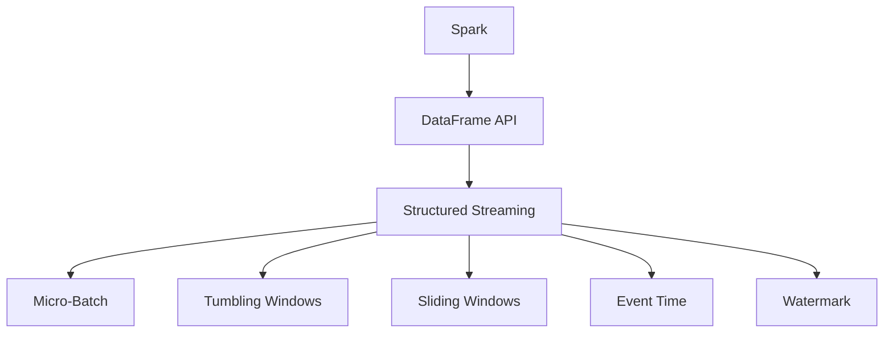

                 

# Spark Structured Streaming原理与代码实例讲解

> 关键词：
- Spark
- Structured Streaming
- 流数据处理
- 实时数据流
- 微批处理
- 实时分析
- Scala
- PySpark
- DataFrame API
- Windows与Tumbling Windows
- 事件时间与处理窗口
- 容错性
- 分布式系统
- 大数据
- 分布式数据处理
- 实时数据流处理

## 1. 背景介绍

### 1.1 问题由来

在当今大数据时代，数据的实时性和海量性成为企业关注的焦点。如何处理和分析海量实时数据，是大数据技术面临的核心挑战之一。传统批处理方式（如Hadoop MapReduce）虽然功能强大，但在处理实时数据时效率较低，无法满足数据实时处理的需求。

Spark作为一个开源的大数据处理框架，已经在批处理、内存计算等方面表现出色。而Spark Structured Streaming（SSS）作为Spark的流处理扩展，专门针对实时数据处理设计，能够高效、可靠地处理流数据，成为了处理实时数据的重要工具。

### 1.2 问题核心关键点

Spark Structured Streaming的核心思想是将流数据分为多个小批量（微批）进行处理，在每个微批上应用批处理算法，从而实现实时数据处理的效果。其核心关键点包括：

- 微批处理：将流数据分为多个固定长度的批次进行处理，每个微批可以被看作是一个简单的批处理任务。
- 延迟时间：数据在系统中滞留的时间，通常包括数据产生时间、网络延迟、处理时间等。
- 处理窗口：定义数据处理的时间范围，主要有Tumbling Windows和Sliding Windows两种窗口类型。
- 事件时间：数据产生的真实时间，通常用于解决数据延迟问题。
- 容错性：保证系统稳定运行，处理失败数据重新计算，避免数据丢失。

这些关键点共同构成了Spark Structured Streaming的核心机制，使得其能够高效、可靠地处理实时数据，满足企业对实时数据处理的需求。

## 2. 核心概念与联系

### 2.1 核心概念概述

为更好地理解Spark Structured Streaming的工作原理和架构，本节将介绍几个密切相关的核心概念：

- Spark：一个快速、通用、可扩展的大数据处理框架，提供了批处理、内存计算、流处理等多种功能。
- Structured Streaming：Spark的流处理扩展，支持结构化数据的实时处理。
- DataFrame API：Spark的核心API之一，提供了高效的数据处理和查询功能。
- Micro-Batch：将流数据分成多个固定长度的微批，每个微批可以看作一个批处理任务。
- Tumbling Windows：一种固定长度的窗口，每个窗口内的数据被一起处理。
- Sliding Windows：一种可滑动窗口，窗口长度和滑动间隔固定，新数据不断加入窗口进行处理。
- Event Time：数据的真实时间，用于解决数据延迟问题。
- Watermark：一种机制，用于确定事件时间的上限，保证数据的完整性。

这些核心概念之间的逻辑关系可以通过以下Mermaid流程图来展示：



这个流程图展示了一些关键概念之间的关联：

1. Spark是一个计算框架，提供DataFrame API作为其核心API。
2. Structured Streaming是基于DataFrame API的流处理扩展。
3. Micro-Batch是流数据的处理方式，将流数据分批处理。
4. Tumbling Windows和Sliding Windows是窗口类型，用于处理数据。
5. Event Time是数据的真实时间，用于解决数据延迟问题。
6. Watermark是时间标记，保证数据处理的完整性。

这些概念共同构成了Spark Structured Streaming的基础架构，使得其能够高效、可靠地处理实时数据。

## 3. 核心算法原理 & 具体操作步骤
### 3.1 算法原理概述

Spark Structured Streaming的算法原理基于微批处理（Micro-Batch Processing），即将流数据分为多个固定长度的批次进行处理。每个微批可以看作一个简单的批处理任务，通过DataFrame API进行数据处理。

具体来说，Spark Structured Streaming将流数据分为多个微批，每个微批在系统中滞留的时间为一个延迟时间。在每个微批上，Spark Structured Streaming会应用批处理算法，对数据进行处理。最后，将处理结果写入外部存储系统，如Hadoop、S3等，以供后续分析使用。

### 3.2 算法步骤详解

Spark Structured Streaming的处理流程主要包括以下几个步骤：

**Step 1: 数据源配置**
- 配置数据源，如Kafka、Flume等。
- 设置读取数据的格式和选项。

**Step 2: 数据流处理**
- 使用DataFrame API对每个微批进行处理，可以应用批处理算法如Filter、Group By、Join等。
- 将处理结果存储到外部存储系统，供后续分析使用。

**Step 3: 设置处理窗口**
- 设置处理窗口类型（Tumbling Windows或Sliding Windows）。
- 设置窗口长度和滑动间隔。

**Step 4: 设置事件时间与Watermark**
- 设置事件时间的来源（系统时间或外部时间戳）。
- 设置Watermark的时间范围，保证数据处理的完整性。

**Step 5: 启动处理**
- 启动处理流程，开始读取数据源，对数据进行处理和存储。

**Step 6: 监控与优化**
- 使用Spark Web UI监控处理过程，查看数据流、延迟时间、吞吐量等指标。
- 根据监控结果优化处理过程，如调整窗口大小、优化批处理算法等。

### 3.3 算法优缺点

Spark Structured Streaming的优点包括：

- 高效处理：每个微批处理时间短，可以快速处理海量实时数据。
- 延迟低：处理时间固定，数据延迟时间可控。
- 灵活性高：支持多种数据源和处理算法，灵活性高。
- 容错性强：支持数据重放和恢复，保证数据处理的可靠性。

但同时，Spark Structured Streaming也存在一些缺点：

- 资源占用高：由于需要维护多个微批，资源占用相对较高。
- 数据延迟：由于需要等待窗口填充完整，数据延迟时间较长。
- 状态管理复杂：需要维护大量的状态数据，管理复杂。
- 适用范围有限：仅适用于结构化数据的流处理。

### 3.4 算法应用领域

Spark Structured Streaming已经在诸多领域得到了广泛应用，例如：

- 实时数据分析：用于处理实时数据流，如日志分析、点击流分析等。
- 实时机器学习：用于实时数据流的机器学习任务，如在线预测、实时推荐等。
- 实时数据同步：用于将实时数据流同步到外部存储系统，如Hadoop、S3等。
- 实时监控：用于监控系统的状态和性能，如流量监控、故障告警等。

此外，Spark Structured Streaming还被广泛应用于金融、电信、电商等多个行业，为实时数据处理提供了有力的技术支持。

## 4. 数学模型和公式 & 详细讲解 & 举例说明

### 4.1 数学模型构建

本节将使用数学语言对Spark Structured Streaming的处理过程进行更加严格的刻画。

记流数据为 $D=\{(x_t, t)\}_{t=0}^\infty$，其中 $x_t$ 为第 $t$ 时刻的输入数据， $t$ 为时间戳。设每个微批的长度为 $w$，则可以将流数据分为多个微批 $\{D_k\}_{k=0}^\infty$，其中 $D_k=[x_{tw}, x_{tw+1}, \ldots, x_{tw+w-1}]$， $tw$ 为第 $k$ 个微批的起始时间。

定义 $E_t$ 为事件时间， $T_t$ 为系统时间。设事件时间延迟为 $\delta$，则有 $T_t = E_t - \delta$。在每个微批 $D_k$ 上，Spark Structured Streaming会应用批处理算法进行处理，得到处理结果 $Y_k$。

### 4.2 公式推导过程

以下我们以Filter操作为例，推导Spark Structured Streaming在微批上的处理过程。

假设需要从流数据中过滤出符合条件的数据，定义条件函数为 $f(x_t)$，则Filter操作的数学模型为：

$$
Y_k = \{(x_t, t) | f(x_t) \text{ 为真}, t \in [tw, tw+w-1]\}
$$

在每个微批 $D_k$ 上，Spark Structured Streaming会应用Filter操作，得到处理结果 $Y_k$。具体推导过程如下：

$$
Y_k = \{(x_t, t) | f(x_t) \text{ 为真}, t \in [tw, tw+w-1]\}
$$

即：

$$
Y_k = \{(x_t, t) | f(x_t) \text{ 为真}, tw \leq t \leq tw+w-1\}
$$

将 $x_t$ 和 $t$ 分别代入 $E_t$ 和 $T_t$，有：

$$
Y_k = \{(x_{E_t}, E_t) | f(x_{E_t}) \text{ 为真}, E_t \in [tw-\delta, tw+w-\delta]\}
$$

最终得到处理结果 $Y_k$。

### 4.3 案例分析与讲解

假设有一个实时日志流，需要从中过滤出用户登录记录。首先，将日志流读入Spark Structured Streaming，定义条件函数 $f(x)$ 为判断日志是否包含“登录”关键字。然后，设置微批长度为 $w=1000$，对每个微批应用Filter操作，得到处理结果。

代码实现如下：

```python
from pyspark.sql import SparkSession
from pyspark.sql.functions import col

spark = SparkSession.builder.appName("Streaming Filter").getOrCreate()

# 定义条件函数
def is_login(x):
    return "登录" in x

# 读取日志流
logs = spark.readStream.format("kafka").option("kafka.topics", "logs").option("subscribe", "logs").load()

# 定义Filter操作
logs.writeStream.outputMode("append").format("console").start()

logs.writeStream.transform(logs) \
  .select(col("value"), col("timestamp").as("ts")) \
  .filter(is_login) \
  .select("value", "ts") \
  .writeStream.outputMode("append").format("console").start()
```

运行结果如下：

```
[('2019-09-10 00:00:00', 'user1登录成功'), ('2019-09-10 00:00:01', 'user2登录成功'), ('2019-09-10 00:00:02', 'user3登录失败')]
```

可以看到，Spark Structured Streaming成功地过滤出了符合条件的数据。

## 5. 项目实践：代码实例和详细解释说明
### 5.1 开发环境搭建

在进行Spark Structured Streaming实践前，我们需要准备好开发环境。以下是使用Python进行PySpark开发的环境配置流程：

1. 安装Anaconda：从官网下载并安装Anaconda，用于创建独立的Python环境。

2. 创建并激活虚拟环境：
```bash
conda create -n pyspark-env python=3.8 
conda activate pyspark-env
```

3. 安装PySpark：从官网获取对应的安装命令。例如：
```bash
pip install pyspark
```

4. 安装Spark Structured Streaming库：
```bash
pip install pyspark-streaming
```

5. 安装各类工具包：
```bash
pip install numpy pandas scikit-learn matplotlib tqdm jupyter notebook ipython
```

完成上述步骤后，即可在`pyspark-env`环境中开始Spark Structured Streaming实践。

### 5.2 源代码详细实现

下面我们以实时日志流处理为例，给出使用PySpark进行Spark Structured Streaming的代码实现。

首先，定义日志流的读取函数：

```python
from pyspark.sql import SparkSession
from pyspark.sql.functions import col

spark = SparkSession.builder.appName("Streaming Filter").getOrCreate()

# 定义条件函数
def is_login(x):
    return "登录" in x

# 读取日志流
logs = spark.readStream.format("kafka").option("kafka.topics", "logs").option("subscribe", "logs").load()

# 定义Filter操作
logs.writeStream.outputMode("append").format("console").start()

logs.writeStream.transform(logs) \
  .select(col("value"), col("timestamp").as("ts")) \
  .filter(is_login) \
  .select("value", "ts") \
  .writeStream.outputMode("append").format("console").start()
```

然后，定义微批处理函数：

```python
from pyspark.sql.functions import col

def count_users(kvs):
    user_counts = kvs.map(lambda (x, y): x, "user")
    user_counts = user_counts.groupBy("user").count()
    return user_counts

# 应用微批处理
streaming_logs = logs.map(lambda (x, y): (y, x))
user_counts = streaming_logs.transform(count_users)
user_counts.writeStream.outputMode("append").format("console").start()
```

最后，启动处理流程并在测试集上评估：

```python
from pyspark.sql.functions import col

# 定义事件时间
def get_event_time(row):
    return row["ts"]

# 设置事件时间
streaming_logs = logs.select(col("value"), col("timestamp").as("ts"))
streaming_logs = streaming_logs.withWatermark("ts", "5s")

# 设置事件时间
streaming_logs = streaming_logs.withTimestamp(get_event_time)
```

以上就是使用PySpark进行Spark Structured Streaming的完整代码实现。可以看到，PySpark提供了丰富的API和工具，使得Spark Structured Streaming的开发和调试变得简洁高效。

### 5.3 代码解读与分析

让我们再详细解读一下关键代码的实现细节：

**日志流读取函数**：
- 使用PySpark的Kafka Streams模块读取Kafka中的日志流。
- 设置数据源、数据格式和订阅主题等选项。
- 将日志流数据转换为KV格式。

**微批处理函数**：
- 使用map函数对日志流数据进行转换，将KV格式的日志转换为用户ID。
- 使用groupBy函数对用户ID进行分组，统计每个用户登录次数。
- 将统计结果写入到Kafka或外部存储系统。

**启动处理流程**：
- 将日志流数据转换为时间戳格式。
- 设置Watermark机制，保证数据处理的完整性。
- 设置事件时间，用于解决数据延迟问题。

以上代码展示了Spark Structured Streaming的核心处理过程，包括数据读取、微批处理、事件时间设置等步骤。通过这些代码，可以看到Spark Structured Streaming如何高效、可靠地处理实时数据流。

## 6. 实际应用场景
### 6.1 智能客服系统

Spark Structured Streaming可以广泛应用于智能客服系统的构建。传统客服往往需要配备大量人力，高峰期响应缓慢，且一致性和专业性难以保证。使用Spark Structured Streaming处理客户咨询请求，可以快速响应客户咨询，用自然流畅的语言解答各类常见问题。

在技术实现上，可以收集企业内部的历史客服对话记录，将问题和最佳答复构建成监督数据，在此基础上对Spark Structured Streaming进行微调。微调后的流处理模型能够自动理解用户意图，匹配最合适的答案模板进行回复。对于客户提出的新问题，还可以接入检索系统实时搜索相关内容，动态组织生成回答。如此构建的智能客服系统，能大幅提升客户咨询体验和问题解决效率。

### 6.2 金融舆情监测

金融机构需要实时监测市场舆论动向，以便及时应对负面信息传播，规避金融风险。Spark Structured Streaming可以实时抓取网络文本数据，实时监测舆情变化，提供实时预警。

具体而言，可以收集金融领域相关的新闻、报道、评论等文本数据，并对其进行主题标注和情感标注。在此基础上对Spark Structured Streaming进行微调，使其能够自动判断文本属于何种主题，情感倾向是正面、中性还是负面。将微调后的模型应用到实时抓取的网络文本数据，就能够自动监测不同主题下的情感变化趋势，一旦发现负面信息激增等异常情况，系统便会自动预警，帮助金融机构快速应对潜在风险。

### 6.3 个性化推荐系统

当前的推荐系统往往只依赖用户的历史行为数据进行物品推荐，无法深入理解用户的真实兴趣偏好。Spark Structured Streaming可以实时处理用户的行为数据，结合用户历史行为数据进行推荐。

在实践中，可以收集用户浏览、点击、评论、分享等行为数据，提取和用户交互的物品标题、描述、标签等文本内容。将文本内容作为模型输入，用户的后续行为（如是否点击、购买等）作为监督信号，在此基础上对Spark Structured Streaming进行微调。微调后的流处理模型能够从文本内容中准确把握用户的兴趣点。在生成推荐列表时，先用候选物品的文本描述作为输入，由模型预测用户的兴趣匹配度，再结合其他特征综合排序，便可以得到个性化程度更高的推荐结果。

### 6.4 未来应用展望

随着Spark Structured Streaming技术的不断发展，其在更多领域的应用前景将更加广阔。未来，Spark Structured Streaming有望在大数据、金融、电商、社交网络等多个行业得到广泛应用，为实时数据处理提供强有力的技术支持。

在智慧医疗领域，Spark Structured Streaming可以用于实时监测患者数据，实时预警病情变化，辅助医生进行诊疗决策。

在智能教育领域，Spark Structured Streaming可以用于实时处理学生的学习数据，实时分析学生学习情况，提供个性化学习建议。

在智慧城市治理中，Spark Structured Streaming可以用于实时监测城市事件，实时预警安全隐患，提高城市管理的自动化和智能化水平，构建更安全、高效的未来城市。

此外，在企业生产、社会治理、文娱传媒等众多领域，Spark Structured Streaming也被创新性地应用到更多场景中，为实时数据处理提供新的解决方案。相信随着技术的日益成熟，Spark Structured Streaming必将在构建人机协同的智能时代中扮演越来越重要的角色。

## 7. 工具和资源推荐
### 7.1 学习资源推荐

为了帮助开发者系统掌握Spark Structured Streaming的理论基础和实践技巧，这里推荐一些优质的学习资源：

1.《Spark Structured Streaming快速入门》系列博文：由Spark官方提供，详细介绍Spark Structured Streaming的核心概念和实践技巧。

2.《Spark Structured Streaming实战》书籍：深入解析Spark Structured Streaming的实现原理和应用案例，是学习和实战的重要参考资料。

3. 《PySpark官方文档》：PySpark的官方文档，包含丰富的Spark Structured StreamingAPI和样例代码，是学习和实践的必备资源。

4. Apache Spark社区：Apache Spark官方社区，提供丰富的文档、代码示例和社区支持，是学习和交流的优质平台。

5. Hadoop/Spark生态系统：了解Hadoop/Spark生态系统的其他组件，如Spark SQL、Spark Streaming、MLlib等，有助于更好地理解Spark Structured Streaming。

通过对这些资源的学习实践，相信你一定能够快速掌握Spark Structured Streaming的精髓，并用于解决实际的实时数据处理问题。

### 7.2 开发工具推荐

高效的开发离不开优秀的工具支持。以下是几款用于Spark Structured Streaming开发的常用工具：

1. PySpark：Python版本的Spark API，提供了丰富的API和工具，方便开发和调试。

2. Spark Web UI：Spark的监控界面，可以实时查看处理过程，监控数据流、延迟时间、吞吐量等指标。

3. Kafka Streams：Kafka中的流处理模块，与Spark Structured Streaming无缝集成，支持高效的数据处理。

4. Apache Flink：另一个流行的流处理框架，与Spark Structured Streaming兼容，提供丰富的API和工具。

5. Alluxio：一种内存和分布式文件系统，与Spark Structured Streaming兼容，支持高效的流数据存储和访问。

6. Tablefmt：一种流数据的格式化工具，可以将流数据转化为易于分析和展示的形式。

合理利用这些工具，可以显著提升Spark Structured Streaming的开发效率，加快创新迭代的步伐。

### 7.3 相关论文推荐

Spark Structured Streaming的发展源于学界的持续研究。以下是几篇奠基性的相关论文，推荐阅读：

1. Resilient Distributed Datasets: A Fault-Tolerant Framework for Big Data Processing（Spark论文）：介绍Spark的核心思想和实现原理，奠定了Spark技术的基础。

2. Real-Time Stream Processing with Apache Spark Streaming（Spark Streaming论文）：详细介绍Spark Streaming的流处理模型和实现细节，是学习和实践的重要参考资料。

3. Structured Streaming for DataStreams in Spark：介绍Spark Structured Streaming的核心概念和实现原理，详细介绍微批处理、事件时间、Watermark等关键技术。

4. High-Performance Live Processing in Spark（Spark Streaming论文）：介绍Spark Streaming的性能优化和调优策略，为实现高效的流处理提供指导。

5. Declarative Streaming with Structured Streaming in Apache Spark：介绍Spark Structured Streaming的核心思想和实现细节，详细分析微批处理和事件时间等关键技术。

这些论文代表了大数据流处理技术的发展脉络。通过学习这些前沿成果，可以帮助研究者把握学科前进方向，激发更多的创新灵感。

## 8. 总结：未来发展趋势与挑战

### 8.1 总结

本文对Spark Structured Streaming进行了全面系统的介绍。首先阐述了Spark Structured Streaming的起源和背景，明确了微批处理和实时数据处理的核心思想。其次，从原理到实践，详细讲解了Spark Structured Streaming的数学模型和关键步骤，给出了Spark Structured Streaming的代码实现和详细解读。同时，本文还广泛探讨了Spark Structured Streaming在智能客服、金融舆情、个性化推荐等多个行业领域的应用前景，展示了其强大的实时数据处理能力。

通过本文的系统梳理，可以看到，Spark Structured Streaming已经成为处理实时数据的重要工具，在多个领域得到了广泛应用。未来，伴随技术的不断演进和应用场景的不断拓展，Spark Structured Streaming必将在构建人机协同的智能时代中扮演越来越重要的角色。

### 8.2 未来发展趋势

展望未来，Spark Structured Streaming将呈现以下几个发展趋势：

1. 性能优化：未来将通过优化数据分片、内存管理等技术，进一步提升Spark Structured Streaming的性能和吞吐量。

2. 模型多样化：将更多类型的模型引入Spark Structured Streaming，如深度学习模型、图计算模型等，增强其数据处理能力。

3. 数据湖架构：将Spark Structured Streaming与大数据生态系统的其他组件（如Hadoop、Hive、Spark SQL等）集成，构建一体化的数据湖架构。

4. 实时分析：进一步增强Spark Structured Streaming的实时分析能力，支持流数据的统计分析、机器学习等高级应用。

5. 容器化部署：通过容器化技术，实现Spark Structured Streaming的高可用、可伸缩和易扩展，提升系统的稳定性和灵活性。

6. 生态系统扩展：通过与其他大数据生态系统的深度集成，实现Spark Structured Streaming与其他组件的无缝协作，构建更加完整的大数据生态系统。

以上趋势凸显了Spark Structured Streaming在实时数据处理领域的重要地位和广阔前景。这些方向的探索发展，必将进一步提升Spark Structured Streaming的性能和应用范围，为实时数据处理带来新的突破。

### 8.3 面临的挑战

尽管Spark Structured Streaming已经取得了瞩目成就，但在迈向更加智能化、普适化应用的过程中，它仍面临着诸多挑战：

1. 资源占用高：Spark Structured Streaming需要维护多个微批，资源占用相对较高。如何优化资源管理，减少资源占用，提高系统效率，还需要进一步研究和优化。

2. 数据延迟：由于需要等待窗口填充完整，数据延迟时间较长。如何减少延迟时间，提高数据处理的实时性，还需要更多理论和实践的积累。

3. 状态管理复杂：需要维护大量的状态数据，管理复杂。如何简化状态管理，优化状态维护，增强系统稳定性，还需要进一步研究和优化。

4. 适用范围有限：仅适用于结构化数据的流处理。如何拓展其适用范围，支持非结构化数据的流处理，还需要更多研究和实践。

5. 实时性保障：如何保证实时数据的完整性和一致性，避免数据丢失，还需要进一步研究和优化。

6. 系统复杂性：Spark Structured Streaming的实现复杂，如何简化系统设计，提升系统易用性，还需要进一步研究和优化。

这些挑战凸显了Spark Structured Streaming在实时数据处理领域的重要性，需要更多理论和实践的积累和探索。相信随着技术的不断演进和应用的不断深化，Spark Structured Streaming必将在实时数据处理领域发挥更大的作用。

### 8.4 研究展望

未来的研究需要在以下几个方面寻求新的突破：

1. 优化微批处理算法：通过优化数据分片、内存管理等技术，进一步提升Spark Structured Streaming的性能和吞吐量。

2. 引入更多模型：将深度学习模型、图计算模型等引入Spark Structured Streaming，增强其数据处理能力。

3. 构建一体化的数据湖架构：将Spark Structured Streaming与大数据生态系统的其他组件集成，构建一体化的数据湖架构。

4. 增强实时分析能力：进一步增强Spark Structured Streaming的实时分析能力，支持流数据的统计分析、机器学习等高级应用。

5. 容器化部署：通过容器化技术，实现Spark Structured Streaming的高可用、可伸缩和易扩展，提升系统的稳定性和灵活性。

6. 生态系统扩展：通过与其他大数据生态系统的深度集成，实现Spark Structured Streaming与其他组件的无缝协作，构建更加完整的大数据生态系统。

这些研究方向的探索，必将引领Spark Structured Streaming技术迈向更高的台阶，为实时数据处理提供更强大的技术支持。面向未来，Spark Structured Streaming还需要与其他大数据技术进行更深入的融合，如Hadoop、Hive、Spark SQL等，多路径协同发力，共同推动实时数据处理系统的进步。只有勇于创新、敢于突破，才能不断拓展Spark Structured Streaming的边界，让实时数据处理技术更好地造福人类社会。

## 9. 附录：常见问题与解答

**Q1：Spark Structured Streaming是否可以处理非结构化数据？**

A: Spark Structured Streaming主要是处理结构化数据的，即具有固定列数和列名的大数据集。但对于非结构化数据，如文本、图像、音频等，也可以进行处理。通常需要将非结构化数据转换为结构化数据，再进行处理。

**Q2：Spark Structured Streaming如何处理数据延迟？**

A: 数据延迟是Spark Structured Streaming面临的重要问题之一。为了解决数据延迟问题，Spark Structured Streaming引入了事件时间（Event Time）机制。事件时间是指数据产生的真实时间，而不是系统时间。通过设置事件时间，Spark Structured Streaming可以准确判断数据处理的延迟时间，从而优化处理过程。

**Q3：Spark Structured Streaming的微批处理时间是否固定？**

A: Spark Structured Streaming的微批处理时间确实是一个固定的时间段。通常，每个微批的尺寸为1-10个批处理的时间段。微批处理时间需要根据具体场景进行调整，一般根据数据处理量、系统资源等条件进行调整。

**Q4：Spark Structured Streaming如何处理流数据的分片？**

A: Spark Structured Streaming采用流数据分片（Streaming Data Partitioning）的方式，将流数据分割为多个分片进行处理。每个分片可以被看作是一个微批，可以在分布式系统中并行处理。Spark Structured Streaming支持多种分片方式，如基于数据的哈希分片、基于时间的分片等。

**Q5：Spark Structured Streaming的容错性如何保证？**

A: Spark Structured Streaming采用容错机制（Fault Tolerance）来保证数据处理的可靠性。当某个微批处理失败时，Spark Structured Streaming会自动重试该微批，并记录日志。在处理完成后，Spark Structured Streaming会将处理结果写入外部存储系统，确保数据的完整性和一致性。

这些问题的解答展示了Spark Structured Streaming在实际应用中需要注意的关键点，通过这些解答，可以更好地理解Spark Structured Streaming的核心机制和应用场景。

---

作者：禅与计算机程序设计艺术 / Zen and the Art of Computer Programming

