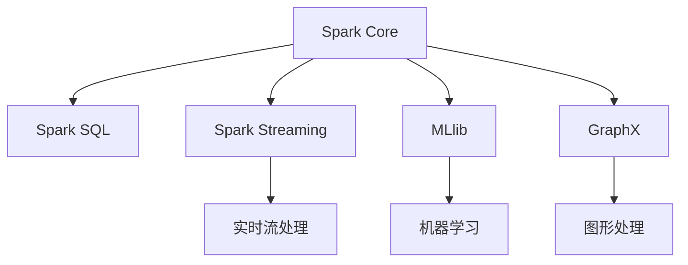

                 

# Spark原理与代码实例讲解

> 关键词：Spark,大数据处理,分布式计算,机器学习,Scala,MLlib

## 1. 背景介绍

### 1.1 问题由来
随着互联网和云计算技术的飞速发展，数据量呈指数级增长。企业需要处理和分析海量数据，以获取有价值的商业洞察和决策支持。传统的单机处理方式已无法满足大规模数据处理的挑战，分布式计算应运而生。

Apache Spark是一个基于内存计算的快速、通用的大数据处理引擎。通过将数据分成多个小块，并行运行在集群中，Spark能够高效处理海量数据，支持实时数据处理和机器学习等多种应用场景。本文将详细讲解Spark的工作原理和代码实现，并探讨其在实际项目中的应用。

### 1.2 问题核心关键点
Spark的核心在于其基于内存的分布式计算框架，可以高效处理大规模数据。Spark主要包括以下几个核心组件：

- Spark Core: 核心组件，提供了分布式数据处理的基本功能。
- Spark SQL: 提供SQL查询接口，支持与传统数据库的集成。
- Spark Streaming: 提供实时数据流处理能力，支持基于窗口的操作。
- MLlib: 提供了机器学习库，支持多种机器学习算法和模型训练。
- GraphX: 提供了图形处理能力，支持复杂网络分析。

这些组件共同构成了Spark的强大功能，使其能够处理海量数据，支持实时分析和机器学习等多种应用场景。

## 2. 核心概念与联系

### 2.1 核心概念概述

为了更好地理解Spark的工作原理和架构，本节将介绍几个密切相关的核心概念：

- 分布式计算: 将数据分布存储在多个节点上，并行计算以提高处理效率。Spark通过将数据分成多个小块，在集群中并行处理。
- 内存计算: 将数据存储在内存中，而不是磁盘中，以提高数据访问速度和计算效率。Spark采用延迟写策略，只有在数据被写入文件时才将其从内存写入磁盘。
- RDD: 弹性分布式数据集(RDD)是Spark的基本数据结构，用于存储和操作分布式数据。RDD可以并行处理，支持多种操作，如转换、联合、聚合等。
- DataFrame: 是Spark SQL的核心数据结构，提供了高效的数据操作接口。DataFrame可以自动生成Schema，支持类似SQL的查询语句。
- Spark Streaming: 是Spark的流处理组件，支持实时数据流处理，提供了基于窗口的操作和机器学习算法。
- MLlib: 是Spark的机器学习库，支持多种机器学习算法和模型训练，包括回归、分类、聚类等。

这些核心概念之间的逻辑关系可以通过以下Mermaid流程图来展示：



这个流程图展示了几大Spark组件及其之间的关系：

1. Spark Core是Spark的核心组件，提供分布式数据处理功能。
2. Spark SQL提供了SQL查询接口，支持与传统数据库的集成。
3. Spark Streaming支持实时数据流处理，提供基于窗口的操作。
4. MLlib提供了机器学习库，支持多种机器学习算法和模型训练。
5. GraphX提供了图形处理能力，支持复杂网络分析。

这些组件共同构成了Spark的强大功能，使其能够高效处理大规模数据，支持多种数据处理和机器学习应用。

## 3. 核心算法原理 & 具体操作步骤
### 3.1 算法原理概述

Spark的核心算法原理基于内存计算和分布式计算。Spark通过将数据分成多个小块，并行运行在集群中，实现了高效的分布式计算。其算法原理可以概括为以下几个步骤：

1. 数据分区: 将数据分成多个小块，并行处理。每个小块称为一个分区。
2. 内存缓存: 将数据存储在内存中，避免频繁读写磁盘。Spark采用延迟写策略，只有在数据被写入文件时才将其从内存写入磁盘。
3. 并行计算: 在集群中并行运行计算任务，每个任务处理一个分区的数据。
4. 容错机制: 通过备份数据和定期检查任务进度，确保计算任务的容错性。

### 3.2 算法步骤详解

以下以Spark Core的RDD操作为例，详细讲解Spark的核心算法步骤：

**Step 1: 创建RDD**
```scala
val data = sc.textFile("hdfs://localhost:9000/user/hadoop/input.txt")
val rdd = data.map(line => (line.split(" ")(0), line.split(" ")(1)))
```

**Step 2: 数据分区**
```scala
val rdd = data.map(line => (line.split(" ")(0), line.split(" ")(1)))
val partitions = rdd.getNumPartitions()  // 获取分区数量
```

**Step 3: 内存缓存**
```scala
rdd.cache()
```

**Step 4: 并行计算**
```scala
val counts = rdd.map(line => (line._1, 1)).reduceByKey(_ + _)
```

**Step 5: 容错机制**
```scala
// 定期检查任务进度，避免任务失败
rdd.foreachPartition((partitionId, iterator) => {
  for (entry <- iterator) {
    if (entry._1.equals("exit")) {
      rdd.stop()
      break
    }
  }
})
```

### 3.3 算法优缺点

Spark的核心算法优点在于其基于内存的分布式计算，可以高效处理大规模数据。Spark的优点包括：

1. 高并行性: 通过将数据分区并行处理，Spark可以高效处理大规模数据。
2. 内存计算: 将数据存储在内存中，避免频繁读写磁盘，提高了计算效率。
3. 容错性: 通过备份数据和定期检查任务进度，Spark可以确保计算任务的容错性。

同时，Spark也存在一些局限性：

1. 内存占用: 内存计算需要大量的内存空间，对于大数据量可能不适用。
2. 网络开销: 数据分区和并行计算需要频繁的网络通信，网络开销较大。
3. 部署复杂度: 部署Spark集群需要较高的运维复杂度，需要配置和监控。

尽管存在这些局限性，但就目前而言，Spark仍是处理大规模数据的首选解决方案，具有广泛的应用场景和优势。

### 3.4 算法应用领域

Spark主要应用于以下几个领域：

- 大数据处理: 处理海量数据，支持数据清洗、数据挖掘、数据仓库等应用。
- 实时数据处理: 支持实时数据流处理，提供基于窗口的操作和机器学习算法。
- 机器学习: 提供机器学习库，支持多种机器学习算法和模型训练。
- 图形处理: 提供图形处理能力，支持复杂网络分析。

Spark在各种场景下得到了广泛的应用，如日志分析、推荐系统、金融风控等，为大规模数据处理和机器学习提供了强大的引擎支持。

## 4. 数学模型和公式 & 详细讲解 & 举例说明

### 4.1 数学模型构建

Spark的核心数学模型基于分布式计算和内存计算。其基本模型可以概括为以下几个关键组件：

1. 数据分区: 将数据分成多个小块，每个小块称为一个分区。
2. 内存缓存: 将数据存储在内存中，避免频繁读写磁盘。
3. 并行计算: 在集群中并行运行计算任务，每个任务处理一个分区的数据。
4. 容错机制: 通过备份数据和定期检查任务进度，确保计算任务的容错性。

### 4.2 公式推导过程

以Spark Core的RDD操作为例，推导RDD的MapReduce操作公式。

假设输入RDD为$R_{in}$，执行$map$操作后得到$R_{out}$，则RDD的MapReduce操作可以表示为：

$$
R_{out} = \bigcup_{i=1}^{n} \{ f(\textit{key}_i, R_{in}(\textit{key}_i)) \}
$$

其中，$f$表示$map$函数，$\textit{key}_i$表示每个分区的键值，$n$表示分区的数量。

通过RDD的MapReduce操作，Spark能够高效处理大规模数据，支持多种数据处理和机器学习应用。

### 4.3 案例分析与讲解

以Spark Core的MapReduce操作为例，详细讲解RDD的基本操作。

**Step 1: 创建RDD**
```scala
val data = sc.textFile("hdfs://localhost:9000/user/hadoop/input.txt")
val rdd = data.map(line => (line.split(" ")(0), line.split(" ")(1)))
```

**Step 2: 数据分区**
```scala
val partitions = rdd.getNumPartitions()  // 获取分区数量
```

**Step 3: 内存缓存**
```scala
rdd.cache()
```

**Step 4: 并行计算**
```scala
val counts = rdd.map(line => (line._1, 1)).reduceByKey(_ + _)
```

**Step 5: 容错机制**
```scala
// 定期检查任务进度，避免任务失败
rdd.foreachPartition((partitionId, iterator) => {
  for (entry <- iterator) {
    if (entry._1.equals("exit")) {
      rdd.stop()
      break
    }
  }
})
```

可以看到，通过Spark Core的RDD操作，可以将大规模数据高效处理，支持多种数据处理和机器学习应用。

## 5. 项目实践：代码实例和详细解释说明
### 5.1 开发环境搭建

在进行Spark项目开发前，需要搭建Spark开发环境。以下是搭建Spark开发环境的流程：

1. 安装Java和Scala: Java是Spark的运行环境，Scala是Spark的编程语言。

2. 安装Spark: 下载Spark安装包，解压后进入bin目录，启动Spark Shell。

3. 配置环境变量: 设置Spark的核心配置文件路径，如spark.config("spark.master")等。

4. 启动Spark: 使用spark-submit命令启动Spark应用，指定Spark程序路径和集群节点信息。

### 5.2 源代码详细实现

以下是Spark Core的RDD操作的详细实现代码：

```scala
import org.apache.spark.SparkContext
import org.apache.spark.SparkConf

object SparkRDDExample {
  def main(args: Array[String]): Unit = {
    val conf = new SparkConf().setAppName("Spark RDD Example").setMaster("local")
    val sc = new SparkContext(conf)
    
    // Step 1: 创建RDD
    val data = sc.textFile("hdfs://localhost:9000/user/hadoop/input.txt")
    val rdd = data.map(line => (line.split(" ")(0), line.split(" ")(1)))
    
    // Step 2: 数据分区
    val partitions = rdd.getNumPartitions()
    
    // Step 3: 内存缓存
    rdd.cache()
    
    // Step 4: 并行计算
    val counts = rdd.map(line => (line._1, 1)).reduceByKey(_ + _)
    
    // Step 5: 容错机制
    rdd.foreachPartition((partitionId, iterator) => {
      for (entry <- iterator) {
        if (entry._1.equals("exit")) {
          rdd.stop()
          break
        }
      }
    })
    
    // 输出结果
    counts.foreach(line => println(s"${line._1}: ${line._2}"))
  }
}
```

### 5.3 代码解读与分析

下面我们详细解读一下关键代码的实现细节：

**创建RDD**:
- `sc.textFile("hdfs://localhost:9000/user/hadoop/input.txt")`: 从HDFS中读取数据，返回一个RDD对象。
- `val rdd = data.map(line => (line.split(" ")(0), line.split(" ")(1)))`: 对每个记录进行分割，返回一个新的RDD对象。

**数据分区**:
- `val partitions = rdd.getNumPartitions()`: 获取RDD的分区数量。

**内存缓存**:
- `rdd.cache()`: 将RDD的数据缓存到内存中，避免频繁读写磁盘。

**并行计算**:
- `val counts = rdd.map(line => (line._1, 1)).reduceByKey(_ + _)`: 对RDD进行并行计算，统计每个键值对的计数。

**容错机制**:
- `rdd.foreachPartition((partitionId, iterator) => { ... })`: 定期检查任务进度，避免任务失败。

**输出结果**:
- `counts.foreach(line => println(s"${line._1}: ${line._2}"))`: 遍历计数结果，输出键值对。

可以看到，Spark Core的RDD操作通过简单的代码实现，可以高效处理大规模数据，支持多种数据处理和机器学习应用。

## 6. 实际应用场景

### 6.1 金融风控

金融风控是Spark的重要应用场景之一。通过Spark的流处理和机器学习功能，金融公司可以实时监控交易行为，及时发现异常交易，防范金融风险。

具体而言，金融公司可以收集用户交易数据，使用Spark Streaming进行实时流处理，提取交易特征。然后使用Spark MLlib进行模型训练，检测异常交易行为。一旦发现异常交易，立即触发告警，防止损失扩大。

### 6.2 推荐系统

推荐系统是Spark的另一个重要应用场景。通过Spark的流处理和机器学习功能，推荐系统可以实时分析用户行为，推荐个性化内容，提高用户体验。

具体而言，推荐系统可以收集用户浏览、点击、购买等行为数据，使用Spark Streaming进行实时流处理，提取用户行为特征。然后使用Spark MLlib进行模型训练，生成个性化推荐结果。最后将推荐结果推送给用户，提升用户体验。

### 6.3 实时数据分析

实时数据分析是Spark的核心应用场景之一。通过Spark的流处理和分布式计算功能，企业可以实时分析海量数据，获得实时商业洞察。

具体而言，企业可以收集实时数据流，使用Spark Streaming进行实时流处理，提取关键指标。然后使用Spark SQL进行数据分析，生成报表和可视化结果。最后将分析结果推送给决策层，支持实时决策。

### 6.4 未来应用展望

Spark的未来发展趋势将主要集中在以下几个方向：

1. 支持更多编程语言: 除了Scala和Java，Spark还支持Python和R等编程语言，进一步扩展其应用范围。

2. 增强实时处理能力: 提升Spark Streaming的实时处理能力，支持更多数据源和数据处理操作。

3. 提升机器学习功能: 增强Spark MLlib的机器学习功能，支持更多先进的机器学习算法和模型。

4. 优化内存管理: 改进Spark内存管理策略，提高内存利用率和系统稳定性。

5. 增强分布式计算能力: 改进Spark Core的分布式计算能力，支持更多数据源和数据处理操作。

6. 提升交互体验: 增强Spark的交互体验，提供更友好的开发工具和API。

这些方向的发展，将使Spark在处理大规模数据和实时数据方面发挥更大作用，为大数据处理和机器学习提供更强支持。

## 7. 工具和资源推荐
### 7.1 学习资源推荐

为了帮助开发者系统掌握Spark的技术细节和应用场景，这里推荐一些优质的学习资源：

1. Apache Spark官方文档: Apache Spark的官方文档，提供了详细的Spark功能和API介绍，是学习Spark的最佳资料。

2.《大数据之道:Spark 2.0实践》: 由李斌等人撰写的Spark实战指南，深入浅出地讲解了Spark的核心概念和应用场景。

3.《Spark设计与实现》: 由Cormen等人撰写的Spark设计与实现一书，详细介绍了Spark的核心算法和架构设计。

4. 《Hadoop+Spark大数据技术实战》: 由胡峻等人撰写的Spark实战教程，结合实际案例，讲解了Spark的开发实践和应用场景。

5. Spark的Scala API文档: Spark的Scala API文档，提供了详细的Spark功能和API介绍，是学习Spark的必备资料。

通过对这些资源的学习实践，相信你一定能够快速掌握Spark的核心算法和应用场景，并用于解决实际的业务问题。

### 7.2 开发工具推荐

高效的开发离不开优秀的工具支持。以下是几款用于Spark开发的常用工具：

1. IntelliJ IDEA: 一款功能强大的IDE，支持Scala和Java的Spark开发。

2. PyCharm: 一款支持Python的IDE，支持Spark的Python开发。

3. Spark Shell: 一款交互式Spark开发环境，支持实时调试和测试。

4. Spark UI: 一款Spark监控工具，可以实时查看Spark集群状态和任务进度。

5. Spark Streaming UI: 一款Spark Streaming监控工具，可以实时查看数据流处理状态和指标。

6. Spark SQL Shell: 一款Spark SQL开发环境，支持SQL查询和数据操作。

合理利用这些工具，可以显著提升Spark开发的效率，加快创新迭代的步伐。

### 7.3 相关论文推荐

Spark的发展得益于学界的持续研究。以下是几篇奠基性的相关论文，推荐阅读：

1. "Resilient Distributed Datasets: A Fault-Tolerant Abstraction for In-Memory Cluster Computing": 由Spark论文作者设计了一种基于内存计算的分布式计算模型，奠定了Spark的基础。

2. "The Data-Efficient Generation of High-Level Models from Low-Level Data": 由Hinton等人提出的Google Brain团队提出的深度学习模型，为Spark提供了强大的机器学习功能。

3. "Spark MLlib: Machine Learning in the Spark Ecosystem": 由Matei等人撰写的Spark MLlib论文，详细介绍了Spark的机器学习库。

4. "Spark Streaming: Unified Real-Time Streaming Framework": 由Spark Streaming论文作者设计了一种基于Spark的实时流处理框架，支持实时数据流处理。

这些论文代表了大数据处理和机器学习的最新研究进展，将帮助读者深入理解Spark的核心算法和架构设计。

## 8. 总结：未来发展趋势与挑战
### 8.1 总结

本文对Spark的核心算法和实际应用进行了全面系统的介绍。首先阐述了Spark的核心算法原理和工作流程，详细讲解了Spark的RDD操作和流处理功能。其次，探讨了Spark在实际项目中的应用场景，如金融风控、推荐系统、实时数据分析等，展示了Spark的强大功能和应用潜力。最后，本文还推荐了Spark的学习资源和开发工具，帮助读者系统掌握Spark的技术细节和应用场景。

通过本文的系统梳理，可以看到，Spark作为大数据处理和机器学习的强大引擎，已经在众多领域得到了广泛应用。未来，Spark将在处理大规模数据和实时数据方面发挥更大作用，为大数据处理和机器学习提供更强支持。

### 8.2 未来发展趋势

展望未来，Spark的发展趋势将主要集中在以下几个方向：

1. 支持更多编程语言: 除了Scala和Java，Spark还将支持Python和R等编程语言，进一步扩展其应用范围。

2. 增强实时处理能力: 提升Spark Streaming的实时处理能力，支持更多数据源和数据处理操作。

3. 提升机器学习功能: 增强Spark MLlib的机器学习功能，支持更多先进的机器学习算法和模型。

4. 优化内存管理: 改进Spark内存管理策略，提高内存利用率和系统稳定性。

5. 增强分布式计算能力: 改进Spark Core的分布式计算能力，支持更多数据源和数据处理操作。

6. 提升交互体验: 增强Spark的交互体验，提供更友好的开发工具和API。

这些方向的发展，将使Spark在处理大规模数据和实时数据方面发挥更大作用，为大数据处理和机器学习提供更强支持。

### 8.3 面临的挑战

尽管Spark在处理大规模数据和机器学习方面取得了巨大成功，但在迈向更加智能化、普适化应用的过程中，仍面临诸多挑战：

1. 内存管理: 内存管理是Spark的核心问题之一，如何在有限的内存资源下高效处理大规模数据，是未来需要解决的重要挑战。

2. 数据源多样化: 支持更多数据源和数据处理操作，需要改进Spark的核心算法和架构设计。

3. 实时处理: 实时处理是Spark的重要应用场景，如何在处理高实时性数据时保持高性能和稳定性，是未来需要解决的重要挑战。

4. 交互体验: 提高Spark的交互体验，提供更友好的开发工具和API，是未来需要解决的重要挑战。

5. 安全性: 增强Spark的安全性，防止数据泄露和攻击，是未来需要解决的重要挑战。

6. 扩展性: 在处理大规模数据时，如何保持Spark的扩展性和可维护性，是未来需要解决的重要挑战。

通过不断优化和改进，Spark必将在处理大规模数据和实时数据方面发挥更大作用，为大数据处理和机器学习提供更强支持。

### 8.4 研究展望

展望未来，Spark的研究方向将主要集中在以下几个方面：

1. 优化内存管理: 改进Spark的内存管理策略，提高内存利用率和系统稳定性。

2. 增强实时处理能力: 提升Spark Streaming的实时处理能力，支持更多数据源和数据处理操作。

3. 提升机器学习功能: 增强Spark MLlib的机器学习功能，支持更多先进的机器学习算法和模型。

4. 增强分布式计算能力: 改进Spark Core的分布式计算能力，支持更多数据源和数据处理操作。

5. 提升交互体验: 增强Spark的交互体验，提供更友好的开发工具和API。

6. 增强安全性: 增强Spark的安全性，防止数据泄露和攻击。

这些研究方向的发展，将使Spark在处理大规模数据和实时数据方面发挥更大作用，为大数据处理和机器学习提供更强支持。

## 9. 附录：常见问题与解答

**Q1: 如何使用Spark进行大规模数据处理？**

A: 使用Spark进行大规模数据处理，首先需要将数据存储在分布式文件系统中，如HDFS或S3。然后使用Spark的RDD操作或DataFrame操作进行数据处理。具体步骤如下：

1. 创建Spark Context: 使用SparkConf和SparkContext创建Spark环境。

2. 加载数据: 使用Spark的textFile方法从分布式文件系统加载数据。

3. 数据处理: 使用Spark的RDD操作或DataFrame操作进行数据处理，如map、reduce、join等操作。

4. 保存结果: 使用Spark的saveAsTextFile方法将处理结果保存到分布式文件系统中。

**Q2: 如何使用Spark进行实时数据流处理？**

A: 使用Spark Streaming进行实时数据流处理，首先需要将数据流从消息队列或日志文件中读取。然后使用Spark Streaming的SparkContext进行实时处理。具体步骤如下：

1. 创建Spark Streaming Context: 使用SparkConf和SparkContext创建Spark Streaming环境。

2. 读取数据流: 使用Spark Streaming的SparkContext从消息队列或日志文件中读取数据流。

3. 实时处理: 使用Spark Streaming的transform操作进行实时处理，如map、filter、reduce等操作。

4. 保存结果: 使用Spark Streaming的saveAsTextFile方法将实时处理结果保存到分布式文件系统中。

**Q3: 如何优化Spark的内存管理？**

A: 优化Spark的内存管理需要从以下几个方面入手：

1. 设置合理的内存配置: 根据数据量和任务复杂度，合理设置Spark的内存配置，如spark.memory.fraction等。

2. 使用延迟写策略: 使用Spark的延迟写策略，将数据存储在内存中，避免频繁读写磁盘。

3. 使用内存本地化: 将数据存储在本地内存中，避免跨节点传输。

4. 减少数据分区: 减少数据的分区数量，提高内存利用率。

5. 优化算子并行度: 优化Spark的算子并行度，减少计算资源的浪费。

6. 使用高效的内存管理算法: 使用高效的内存管理算法，如Spark的资源管理器等。

这些优化措施可以显著提高Spark的内存利用率，提高系统的处理能力和稳定性。

**Q4: 如何提升Spark的实时处理能力？**

A: 提升Spark的实时处理能力需要从以下几个方面入手：

1. 增加集群节点: 增加Spark集群的节点数量，提高系统的处理能力。

2. 优化数据分区: 优化数据的分区策略，减少数据的传输和处理开销。

3. 使用高效的内存管理算法: 使用高效的内存管理算法，提高内存利用率。

4. 优化算子并行度: 优化Spark的算子并行度，减少计算资源的浪费。

5. 使用流处理框架: 使用Spark Streaming或Apache Flink等流处理框架，提高系统的实时处理能力。

6. 使用高效的存储系统: 使用高效的存储系统，如Apache Cassandra等，提高数据的访问速度。

这些优化措施可以显著提升Spark的实时处理能力，提高系统的处理能力和稳定性。

**Q5: 如何提升Spark的交互体验？**

A: 提升Spark的交互体验需要从以下几个方面入手：

1. 提供友好的开发工具: 提供友好的开发工具，如IntelliJ IDEA、PyCharm等，提高开发效率。

2. 提供丰富的API接口: 提供丰富的API接口，方便开发人员进行数据处理和机器学习操作。

3. 提供可视化的监控工具: 提供可视化的监控工具，如Spark UI、Spark Streaming UI等，方便开发人员进行实时监控和调试。

4. 提供便捷的数据加载和保存工具: 提供便捷的数据加载和保存工具，如Spark的saveAsTextFile方法，方便开发人员进行数据处理和结果保存。

5. 提供高效的计算图优化: 提供高效的计算图优化，提高Spark的计算效率和性能。

这些优化措施可以显著提升Spark的交互体验，提高开发效率和系统性能。

综上所述，Spark作为大数据处理和机器学习的强大引擎，已经在众多领域得到了广泛应用。未来，Spark必将在处理大规模数据和实时数据方面发挥更大作用，为大数据处理和机器学习提供更强支持。通过不断优化和改进，Spark必将在未来的数据处理和机器学习领域发挥更大作用，成为企业数据处理的重要工具。

