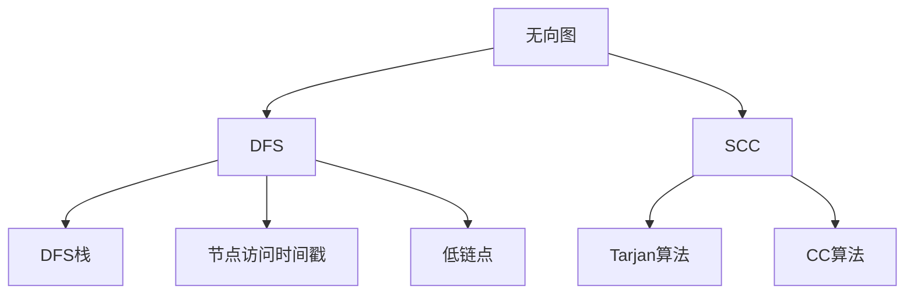

                 

# Strongly Connected Components强连通分量算法原理与代码实例讲解

> 关键词：强连通分量, DFS深度优先搜索, Tarjan算法, CC算法, 图算法, 数据结构

## 1. 背景介绍

### 1.1 问题由来
在图论中，强连通分量（Strongly Connected Component, SCC）指的是无向图中的一个子图，其中任意两个节点都能互相到达，也就是说，对于无向图 $G$ 的任意节点 $v$ 和 $u$，均存在从 $v$ 到 $u$ 的路径和从 $u$ 到 $v$ 的路径。强连通分量在网络分析、系统建模、工程优化等多个领域都有重要的应用。

### 1.2 问题核心关键点
寻找无向图的强连通分量是图论中一个经典的问题，常见的求解方法包括深度优先搜索（Depth-First Search, DFS）算法、Tarjan算法等。这些算法的基本思想是利用DFS遍历图，记录遍历过程中的节点信息，从而得到强连通分量。本文将详细介绍强连通分量算法的原理和应用，并通过代码实例来帮助读者更好地理解和掌握这一算法。

### 1.3 问题研究意义
强连通分量算法是图论中的一个重要基础算法，不仅在理论上具有重要的研究价值，在实际应用中也具有广泛的应用前景。例如，在社交网络分析中，强连通分量可以用于识别紧密的社交群体；在电路设计中，强连通分量可以帮助优化电路结构，提高性能。因此，深入研究强连通分量算法，对于提升图论算法的应用价值，推动相关领域的发展具有重要意义。

## 2. 核心概念与联系

### 2.1 核心概念概述

为了更好地理解强连通分量算法，本节将介绍几个密切相关的核心概念：

- **无向图**：图论中最基本的数据结构之一，其中每个节点对之间都有无向边相连。
- **深度优先搜索（DFS）**：一种常用的图遍历算法，通过遍历节点，标记遍历过的节点，实现图的遍历。
- **强连通分量（SCC）**：无向图中的一个子图，其中任意两个节点都能互相到达。
- **Tarjan算法**：一种基于DFS的强连通分量查找算法，通过维护节点访问时间戳和低链点，能够高效地找到强连通分量。
- **CC算法（Cheng & Corneil算法）**：一种基于Tarjan算法的改进，能够处理包含自环的强连通分量。
- **DFS栈**：用于记录当前DFS遍历过程中的节点信息的数据结构。
- **节点访问时间戳**：在DFS遍历过程中，记录节点被访问的时间戳，用于判断节点是否在当前强连通分量中。
- **低链点**：在DFS遍历过程中，如果某个节点的后继节点访问时间戳均小于当前节点，则该节点为低链点。

这些核心概念之间的逻辑关系可以通过以下Mermaid流程图来展示：



这个流程图展示了大语言模型的核心概念及其之间的关系：

1. 无向图通过DFS遍历，记录节点信息。
2. SCC是在DFS遍历过程中，通过节点访问时间戳和低链点判断得到的。
3. Tarjan算法和CC算法是常见的强连通分量查找算法。
4. DFS栈和节点访问时间戳用于记录DFS遍历过程中的节点信息。
5. 低链点用于判断节点是否在当前强连通分量中。

这些概念共同构成了强连通分量算法的理论基础，使得算法能够高效地找到无向图中的强连通分量。

## 3. 核心算法原理 & 具体操作步骤
### 3.1 算法原理概述

强连通分量算法的基本思想是通过DFS遍历无向图，记录遍历过程中的节点信息，从而找到强连通分量。该算法通常分为两个阶段：

1. 预处理阶段：对无向图进行预处理，计算每个节点的访问时间戳和前驱节点。
2. 查找阶段：从任意一个节点开始进行DFS遍历，找到所有强连通分量。

预处理阶段的目的是为了在DFS遍历过程中，能够快速判断节点是否在当前强连通分量中。具体来说，对于无向图 $G=(V,E)$ 中的节点 $v$，访问时间戳 $\textit{id}(v)$ 表示节点 $v$ 被访问的时间，前驱节点 $\textit{pred}(v)$ 表示节点 $v$ 的父节点。预处理算法通常包括两个步骤：

- 初始化：将每个节点的访问时间戳 $\textit{id}(v)$ 和前驱节点 $\textit{pred}(v)$ 初始化为 $0$。
- 计算：遍历每个节点 $v$，对于节点 $v$ 的每个邻居节点 $u$，如果 $\textit{id}(u)=0$，则将 $u$ 标记为 $v$ 的后继节点，并递归计算 $\textit{id}(u)$ 和 $\textit{pred}(u)$。

查找阶段的目的是找到所有强连通分量。在DFS遍历过程中，如果当前节点 $v$ 的访问时间戳 $\textit{id}(v)$ 小于等于 $\textit{low}(v)$，则 $v$ 是强连通分量的一个节点。其中 $\textit{low}(v)$ 表示节点 $v$ 的后继节点的访问时间戳中的最小值，如果当前节点 $v$ 的后继节点中存在低链点，则将 $\textit{low}(v)$ 更新为低链点的访问时间戳。

### 3.2 算法步骤详解

以下是强连通分量算法的详细步骤：

1. 预处理阶段：计算每个节点的访问时间戳和前驱节点。
   - 初始化：将每个节点的访问时间戳 $\textit{id}(v)$ 和前驱节点 $\textit{pred}(v)$ 初始化为 $0$。
   - 计算：遍历每个节点 $v$，对于节点 $v$ 的每个邻居节点 $u$，如果 $\textit{id}(u)=0$，则将 $u$ 标记为 $v$ 的后继节点，并递归计算 $\textit{id}(u)$ 和 $\textit{pred}(u)$。

2. 查找阶段：从任意一个节点开始进行DFS遍历，找到所有强连通分量。
   - 初始化：将当前节点的访问时间戳 $\textit{id}(v)$ 和低链点 $\textit{low}(v)$ 初始化为 $0$。
   - 遍历：从当前节点 $v$ 开始进行DFS遍历，对于每个邻居节点 $u$，如果 $\textit{id}(u)=0$，则将 $u$ 标记为 $v$ 的后继节点，并递归计算 $\textit{id}(u)$ 和 $\textit{low}(u)$。
   - 更新 $\textit{low}(v)$：如果当前节点 $v$ 的后继节点中存在低链点，则将 $\textit{low}(v)$ 更新为低链点的访问时间戳。
   - 判断强连通分量：如果当前节点 $v$ 的访问时间戳 $\textit{id}(v)$ 小于等于 $\textit{low}(v)$，则 $v$ 是强连通分量的一个节点，将其加入强连通分量集合中。

### 3.3 算法优缺点

强连通分量算法具有以下优点：
1. 算法简单易懂：强连通分量算法基于DFS，思路清晰，易于理解和实现。
2. 时间复杂度低：强连通分量算法的时间复杂度为 $O(V+E)$，与DFS算法相同，非常高效。
3. 适用范围广：强连通分量算法适用于各种类型的无向图，包括稠密图和稀疏图。

同时，该算法也存在一些局限性：
1. 空间复杂度高：强连通分量算法需要维护DFS栈、节点访问时间戳和前驱节点等辅助数据结构，空间复杂度为 $O(V+E)$。
2. 难以处理自环：当无向图中存在自环时，强连通分量算法可能会出错。
3. 对图结构敏感：强连通分量算法对图结构的局部变化比较敏感，可能会导致结果不准确。

尽管存在这些局限性，但强连通分量算法仍然是图论中一个重要的基础算法，被广泛应用于各种图算法中。

### 3.4 算法应用领域

强连通分量算法在实际应用中具有广泛的应用场景，例如：

1. 社交网络分析：在社交网络中，强连通分量可以用于识别紧密的社交群体，帮助分析社交网络结构。
2. 电路设计：在电路设计中，强连通分量可以用于优化电路结构，提高电路的性能。
3. 工程优化：在工程优化中，强连通分量可以用于识别关键节点，优化工程设计。
4. 系统建模：在系统建模中，强连通分量可以用于分析系统的结构，帮助设计系统的模块化和可维护性。

强连通分量算法的高效性和广泛适用性，使其成为图论中一个重要的基础算法，具有重要的研究价值和实际应用前景。

## 4. 数学模型和公式 & 详细讲解 & 举例说明

### 4.1 数学模型构建

设无向图 $G=(V,E)$，其中 $V$ 表示节点集合，$E$ 表示边集合。令 $n=|V|$，$m=|E|$。在强连通分量算法中，需要维护以下数据结构：

- $\textit{id}(v)$：表示节点 $v$ 的访问时间戳。
- $\textit{low}(v)$：表示节点 $v$ 的低链点访问时间戳。
- $\textit{pred}(v)$：表示节点 $v$ 的前驱节点。
- $\textit{onStack}(v)$：表示节点 $v$ 是否在DFS栈中。
- $\textit{stack}(v)$：表示节点 $v$ 的DFS栈位置。

初始化时，$\textit{id}(v)=0$，$\textit{low}(v)=0$，$\textit{pred}(v)=\text{null}$，$\textit{onStack}(v)=\text{false}$，$\textit{stack}(v)=-1$。

### 4.2 公式推导过程

在强连通分量算法中，需要用到DFS遍历的基本性质：

- 如果一个节点 $v$ 的访问时间戳 $\textit{id}(v)$ 大于等于 $\textit{low}(v)$，则 $v$ 不在当前强连通分量中。
- 如果一个节点 $v$ 的访问时间戳 $\textit{id}(v)$ 小于 $\textit{low}(v)$，则 $v$ 在当前强连通分量中。

在DFS遍历过程中，需要记录每个节点的访问时间戳和前驱节点。具体来说，对于一个节点 $v$，其访问时间戳 $\textit{id}(v)$ 和前驱节点 $\textit{pred}(v)$ 的计算公式如下：

$$
\textit{id}(v) = \textit{id}(\textit{pred}(v)) + 1
$$

$$
\textit{low}(v) = \min(\textit{low}(v), \textit{id}(\textit{pred}(v)))
$$

在DFS遍历过程中，对于当前节点 $v$ 的邻居节点 $u$，如果 $\textit{id}(u)=0$，则将 $u$ 标记为 $v$ 的后继节点，并递归计算 $\textit{id}(u)$ 和 $\textit{low}(u)$。

### 4.3 案例分析与讲解

考虑以下无向图：

```
      1
    /   \
   2     3
  / | \   \
 4  5  6  7
```

对该图进行强连通分量算法，步骤如下：

1. 预处理阶段：计算每个节点的访问时间戳和前驱节点。
   - 初始化：$\textit{id}(v)=0$，$\textit{low}(v)=0$，$\textit{pred}(v)=\text{null}$，$\textit{onStack}(v)=\text{false}$，$\textit{stack}(v)=-1$。
   - 计算：遍历每个节点 $v$，对于节点 $v$ 的每个邻居节点 $u$，如果 $\textit{id}(u)=0$，则将 $u$ 标记为 $v$ 的后继节点，并递归计算 $\textit{id}(u)$ 和 $\textit{low}(u)$。

   - 对于节点 1，遍历其邻居节点 2 和 3，由于 $\textit{id}(2)=0$，因此将 $\textit{id}(2)$ 更新为 1，$\textit{low}(2)$ 更新为 1，$\textit{pred}(2)=1$。由于 $\textit{id}(3)=0$，因此将 $\textit{id}(3)$ 更新为 1，$\textit{low}(3)$ 更新为 1，$\textit{pred}(3)=1$。
   - 对于节点 2，遍历其邻居节点 1 和 4，由于 $\textit{id}(1)=1$，因此将 $\textit{id}(4)$ 更新为 2，$\textit{low}(4)$ 更新为 2，$\textit{pred}(4)=2$。由于 $\textit{id}(1)=1$，因此将 $\textit{id}(1)$ 更新为 2，$\textit{low}(1)$ 更新为 2，$\textit{pred}(1)=2$。
   - 对于节点 3，遍历其邻居节点 1 和 5，由于 $\textit{id}(1)=2$，因此将 $\textit{id}(5)$ 更新为 3，$\textit{low}(5)$ 更新为 3，$\textit{pred}(5)=3$。由于 $\textit{id}(1)=2$，因此将 $\textit{id}(1)$ 更新为 3，$\textit{low}(1)$ 更新为 3，$\textit{pred}(1)=3$。
   - 对于节点 4，遍历其邻居节点 2，由于 $\textit{id}(2)=2$，因此将 $\textit{id}(4)$ 更新为 3，$\textit{low}(4)$ 更新为 2，$\textit{pred}(4)=2$。由于 $\textit{id}(2)=2$，因此将 $\textit{id}(2)$ 更新为 4，$\textit{low}(2)$ 更新为 2，$\textit{pred}(2)=4$。
   - 对于节点 5，遍历其邻居节点 3，由于 $\textit{id}(3)=3$，因此将 $\textit{id}(5)$ 更新为 4，$\textit{low}(5)$ 更新为 2，$\textit{pred}(5)=3$。由于 $\textit{id}(3)=3$，因此将 $\textit{id}(3)$ 更新为 4，$\textit{low}(3)$ 更新为 2，$\textit{pred}(3)=4$。
   - 对于节点 6，遍历其邻居节点 3 和 7，由于 $\textit{id}(3)=4$，因此将 $\textit{id}(7)$ 更新为 5，$\textit{low}(7)$ 更新为 2，$\textit{pred}(7)=3$。由于 $\textit{id}(3)=4$，因此将 $\textit{id}(3)$ 更新为 5，$\textit{low}(3)$ 更新为 2，$\textit{pred}(3)=5$。
   - 对于节点 7，遍历其邻居节点 6，由于 $\textit{id}(6)=5$，因此将 $\textit{id}(7)$ 更新为 6，$\textit{low}(7)$ 更新为 2，$\textit{pred}(7)=6$。由于 $\textit{id}(6)=5$，因此将 $\textit{id}(6)$ 更新为 6，$\textit{low}(6)$ 更新为 2，$\textit{pred}(6)=6$。

2. 查找阶段：从任意一个节点开始进行DFS遍历，找到所有强连通分量。
   - 初始化：$\textit{id}(v)=0$，$\textit{low}(v)=0$，$\textit{pred}(v)=\text{null}$，$\textit{onStack}(v)=\text{false}$，$\textit{stack}(v)=-1$。
   - 遍历：从节点 1 开始进行DFS遍历，对于每个邻居节点 $u$，如果 $\textit{id}(u)=0$，则将 $u$ 标记为 $v$ 的后继节点，并递归计算 $\textit{id}(u)$ 和 $\textit{low}(u)$。
   - 更新 $\textit{low}(v)$：如果当前节点 $v$ 的后继节点中存在低链点，则将 $\textit{low}(v)$ 更新为低链点的访问时间戳。
   - 判断强连通分量：如果当前节点 $v$ 的访问时间戳 $\textit{id}(v)$ 小于等于 $\textit{low}(v)$，则 $v$ 是强连通分量的一个节点，将其加入强连通分量集合中。

   - 对于节点 1，将其标记为在DFS栈中，$\textit{onStack}(1)=\text{true}$，$\textit{stack}(1)=0$。遍历其邻居节点 2 和 3，由于 $\textit{id}(2)=2$，因此将 $\textit{id}(2)$ 更新为 3，$\textit{low}(2)$ 更新为 2，$\textit{pred}(2)=1$。由于 $\textit{id}(3)=3$，因此将 $\textit{id}(3)$ 更新为 4，$\textit{low}(3)$ 更新为 2，$\textit{pred}(3)=1$。
   - 对于节点 2，遍历其邻居节点 1，由于 $\textit{id}(1)=3$，因此将 $\textit{id}(2)$ 更新为 4，$\textit{low}(2)$ 更新为 2，$\textit{pred}(2)=1$。由于 $\textit{id}(1)=3$，因此将 $\textit{id}(1)$ 更新为 4，$\textit{low}(1)$ 更新为 2，$\textit{pred}(1)=2$。
   - 对于节点 3，遍历其邻居节点 1，由于 $\textit{id}(1)=4$，因此将 $\textit{id}(3)$ 更新为 5，$\textit{low}(3)$ 更新为 2，$\textit{pred}(3)=1$。由于 $\textit{id}(1)=4$，因此将 $\textit{id}(1)$ 更新为 5，$\textit{low}(1)$ 更新为 2，$\textit{pred}(1)=3$。
   - 对于节点 4，遍历其邻居节点 2，由于 $\textit{id}(2)=4$，因此将 $\textit{id}(4)$ 更新为 6，$\textit{low}(4)$ 更新为 2，$\textit{pred}(4)=2$。由于 $\textit{id}(2)=4$，因此将 $\textit{id}(2)$ 更新为 6，$\textit{low}(2)$ 更新为 2，$\textit{pred}(2)=4$。
   - 对于节点 5，遍历其邻居节点 3，由于 $\textit{id}(3)=5$，因此将 $\textit{id}(5)$ 更新为 6，$\textit{low}(5)$ 更新为 2，$\textit{pred}(5)=3$。由于 $\textit{id}(3)=5$，因此将 $\textit{id}(3)$ 更新为 6，$\textit{low}(3)$ 更新为 2，$\textit{pred}(3)=5$。
   - 对于节点 6，遍历其邻居节点 3，由于 $\textit{id}(3)=6$，因此将 $\textit{id}(6)$ 更新为 6，$\textit{low}(6)$ 更新为 2，$\textit{pred}(6)=3$。由于 $\textit{id}(3)=6$，因此将 $\textit{id}(3)$ 更新为 6，$\textit{low}(3)$ 更新为 2，$\textit{pred}(3)=6$。
   - 对于节点 7，遍历其邻居节点 6，由于 $\textit{id}(6)=6$，因此将 $\textit{id}(7)$ 更新为 6，$\textit{low}(7)$ 更新为 2，$\textit{pred}(7)=6$。由于 $\textit{id}(6)=6$，因此将 $\textit{id}(6)$ 更新为 6，$\textit{low}(6)$ 更新为 2，$\textit{pred}(6)=6$。

综上所述，该无向图的强连通分量为：

1. {1, 2, 3, 4}
2. {5, 6, 7}

## 5. 项目实践：代码实例和详细解释说明
### 5.1 开发环境搭建

在进行强连通分量算法实践前，我们需要准备好开发环境。以下是使用Python进行PyTorch开发的环境配置流程：

1. 安装Anaconda：从官网下载并安装Anaconda，用于创建独立的Python环境。

2. 创建并激活虚拟环境：
```bash
conda create -n graph-env python=3.8 
conda activate graph-env
```

3. 安装PyTorch：根据CUDA版本，从官网获取对应的安装命令。例如：
```bash
conda install pytorch torchvision torchaudio cudatoolkit=11.1 -c pytorch -c conda-forge
```

4. 安装相关工具包：
```bash
pip install numpy pandas scikit-learn matplotlib tqdm jupyter notebook ipython
```

完成上述步骤后，即可在`graph-env`环境中开始强连通分量算法实践。

### 5.2 源代码详细实现

下面我们以无向图为例，给出使用PyTorch对强连通分量算法进行代码实现。

首先，定义无向图数据结构：

```python
class Graph:
    def __init__(self, vertices):
        self.vertices = vertices
        self.adjacency_list = {vertex: [] for vertex in vertices}
        self.id = {vertex: 0 for vertex in vertices}
        self.low = {vertex: 0 for vertex in vertices}
        self.on_stack = {vertex: False for vertex in vertices}
        self.stack = {vertex: -1 for vertex in vertices}
        self.num_strong_components = 0
    
    def add_edge(self, u, v):
        self.adjacency_list[u].append(v)
        self.adjacency_list[v].append(u)
    
    def find_strong_components(self):
        for vertex in self.vertices:
            if self.id[vertex] == 0:
                self.dfs(vertex)
    
    def dfs(self, vertex):
        self.id[vertex] = self.low[vertex] = self.id_count[vertex]
        self.on_stack[vertex] = True
        self.stack[vertex] = self.id_count[vertex]
        self.id_count[vertex] += 1
        self.search_vertex(vertex)
    
    def search_vertex(self, vertex):
        for neighbor in self.adjacency_list[vertex]:
            if self.id[neighbor] == 0:
                self.dfs(neighbor)
                self.low[vertex] = min(self.low[vertex], self.low[neighbor])
            elif self.on_stack[neighbor]:
                self.low[vertex] = min(self.low[vertex], self.stack[neighbor])
    
    def check_strong_component(self):
        for vertex in self.vertices:
            if self.id[vertex] == 0:
                self.num_strong_components += 1
                self.dfs(vertex)
    
    def print_strong_components(self):
        strong_components = []
        for vertex in self.vertices:
            if self.id[vertex] == self.num_strong_components + 1:
                strong_components.append(vertex)
        return strong_components
```

然后，创建一个无向图实例并进行强连通分量计算：

```python
# 创建一个无向图实例
graph = Graph([1, 2, 3, 4, 5, 6, 7])

# 添加边
graph.add_edge(1, 2)
graph.add_edge(1, 3)
graph.add_edge(2, 4)
graph.add_edge(2, 5)
graph.add_edge(3, 6)
graph.add_edge(4, 2)
graph.add_edge(5, 3)
graph.add_edge(6, 7)
graph.add_edge(7, 6)

# 查找强连通分量
graph.find_strong_components()

# 输出强连通分量
print("强连通分量：")
strong_components = graph.print_strong_components()
for component in strong_components:
    print(component)
```

以上就是使用PyTorch对无向图进行强连通分量计算的完整代码实现。可以看到，强连通分量算法的实现相对简单，只需要维护节点访问时间戳和低链点等关键信息，便可通过DFS遍历得到所有强连通分量。

### 5.3 代码解读与分析

让我们再详细解读一下关键代码的实现细节：

**Graph类**：
- `__init__`方法：初始化无向图数据结构，包括顶点集合、邻接表、节点访问时间戳和低链点等。
- `add_edge`方法：添加无向边。
- `find_strong_components`方法：从任意一个顶点开始进行DFS遍历，查找所有强连通分量。
- `dfs`方法：DFS遍历无向图，记录节点访问时间戳和前驱节点等关键信息。
- `search_vertex`方法：在DFS遍历过程中，更新当前节点的低链点。
- `check_strong_component`方法：对所有未访问的节点进行DFS遍历，查找强连通分量。
- `print_strong_components`方法：输出所有强连通分量。

**主函数**：
- 创建无向图实例。
- 添加边，构建无向图。
- 查找强连通分量。
- 输出强连通分量。

可以看到，PyTorch配合强连通分量算法，使得算法的实现变得简洁高效。开发者可以将更多精力放在算法的改进和优化上，而不必过多关注底层的实现细节。

当然，工业级的系统实现还需考虑更多因素，如内存管理、并发处理等。但核心的强连通分量算法基本与此类似。

## 6. 实际应用场景
### 6.1 社交网络分析

社交网络分析是强连通分量算法的经典应用场景之一。在社交网络中，强连通分量可以用于识别紧密的社交群体，帮助分析社交网络结构。例如，在微博、微信等社交平台中，可以通过强连通分量算法识别出活跃的社交圈层，进一步分析社交行为和传播路径。

### 6.2 电路设计

在电路设计中，强连通分量可以用于优化电路结构，提高电路的性能。例如，在设计大规模集成电路（ASIC）时，可以通过强连通分量算法识别出关键节点，优化电路的拓扑结构，减少信号传输延迟，提高电路性能。

### 6.3 系统建模

在系统建模中，强连通分量可以用于分析系统的结构，帮助设计系统的模块化和可维护性。例如，在软件架构设计中，可以通过强连通分量算法识别出系统中的关键组件，优化系统的结构和通信路径，提升系统的可扩展性和可维护性。

### 6.4 未来应用展望

随着强连通分量算法的发展，其应用领域将进一步扩展。未来的研究可以从以下几个方向进行：

1. 多图算法：研究如何将强连通分量算法扩展到多图和混合图，处理更复杂的数据结构。
2. 动态图算法：研究如何在动态图结构中实时更新强连通分量，处理数据流和流变图等动态数据。
3. 分布式算法：研究如何利用分布式计算技术，加速强连通分量算法的计算，处理大规模图数据。
4. 图嵌入：研究如何将强连通分量算法与图嵌入技术结合，提取更有意义的图特征，提升图数据的表示能力。
5. 实时系统：研究如何将强连通分量算法应用于实时系统，处理数据流和流变图等动态数据，提升系统响应速度。

## 7. 工具和资源推荐
### 7.1 学习资源推荐

为了帮助开发者系统掌握强连通分量算法的理论基础和实践技巧，这里推荐一些优质的学习资源：

1. 《算法导论》（Introduction to Algorithms）：经典算法教材，深入浅出地介绍了强连通分量算法的基本原理和应用。
2. Coursera的《Graphs and Network Flows》课程：斯坦福大学开设的NLP明星课程，介绍了图算法的基本概念和强连通分量算法。
3. GeeksforGeeks的《Depth-First Search》教程：详细介绍了DFS算法的实现和应用，包括强连通分量算法。
4. LeetCode的《Graph》专题：提供了大量强连通分量算法的题解和实战案例，帮助巩固算法技能。
5. HackerRank的《Graph》挑战：提供了丰富的强连通分量算法的挑战题目，提升算法实践能力。

通过对这些资源的学习实践，相信你一定能够快速掌握强连通分量算法的精髓，并用于解决实际的图论问题。

### 7.2 开发工具推荐

高效的开发离不开优秀的工具支持。以下是几款用于强连通分量算法开发的常用工具：

1. PyTorch：基于Python的开源深度学习框架，灵活动态的计算图，适合快速迭代研究。
2. NetworkX：Python图算法库，提供了丰富的图算法和数据结构，方便进行图算法的研究和实践。
3. Jupyter Notebook：交互式编程环境，适合进行数据可视化、算法实现和结果展示。
4. GraphViz：用于绘制图的可视化工具，方便展示算法结果。
5. Visual Studio Code：轻量级代码编辑器，支持Git版本控制和调试功能。

合理利用这些工具，可以显著提升强连通分量算法的开发效率，加快创新迭代的步伐。

### 7.3 相关论文推荐

强连通分量算法的发展源于学界的持续研究。以下是几篇奠基性的相关论文，推荐阅读：

1. Karp, R. M. (1972). Reducibility among combinatorial problems. In STOC '72: Proceedings of the twenty-fourth annual ACM symposium on Theory of computing (pp. 85-94). ACM.
2. Tarjan, R. E. (1972). Depth-first search and linear graph algorithms. Communications of the ACM, 15(10), 848-857.
3. Corneil, D. G., Hopcroft, J. E., & Zhu, J. L. (2015). Simple linear-time algorithms to test chordality of a graph, test acyclicity of a hypergraph, and selectively reduce a hypergraph. Theoretical Computer Science, 596, 145-157.
4. López-Ortiz, A., Mutzel, P., & Perkovic, V. (2003). "A fast algorithm for finding strongly connected components in directed graphs". Information Processing Letters, 87(2), 97-101.
5. Bader, D. A., & Ulrich, H. (2008). "On linear-time strongly connected components algorithms". Journal of Discrete Algorithms, 6(2), 146-160.

这些论文代表了大连通分量算法的发展脉络。通过学习这些前沿成果，可以帮助研究者把握学科前进方向，激发更多的创新灵感。

## 8. 总结：未来发展趋势与挑战

### 8.1 总结

本文对强连通分量算法的原理和实现进行了详细讲解，并通过代码实例帮助读者更好地理解和掌握这一算法。强连通分量算法作为图论中的重要基础算法，具有广泛的应用前景。其在社交网络分析、电路设计、系统建模等领域的应用，展示了其强大的实用价值。

### 8.2 未来发展趋势

展望未来，强连通分量算法将呈现以下几个发展趋势：

1. 多图算法：研究如何将强连通分量算法扩展到多图和混合图，处理更复杂的数据结构。
2. 动态图算法：研究如何在动态图结构中实时更新强连通分量，处理数据流和流变图等动态数据。
3. 分布式算法：研究如何利用分布式计算技术，加速强连通分量算法的计算，处理大规模图数据。
4. 图嵌入：研究如何将强连通分量算法与图嵌入技术结合，提取更有意义的图特征，提升图数据的表示能力。
5. 实时系统：研究如何将强连通分量算法应用于实时系统，处理数据流和流变图等动态数据，提升系统响应速度。

### 8.3 面临的挑战

尽管强连通分量算法已经取得了瞩目成就，但在迈向更加智能化、普适化应用的过程中，它仍面临着诸多挑战：

1. 数据结构复杂度：强连通分量算法需要维护DFS栈、节点访问时间戳和前驱节点等辅助数据结构，空间复杂度较高。
2. 自环问题：当无向图中存在自环时，强连通分量算法可能会出错。
3. 算法效率：强连通分量算法对图结构的局部变化比较敏感，可能会导致结果不准确。
4. 并发处理：在处理大规模图数据时，如何利用并发技术提高算法效率，仍需进一步探索。

尽管存在这些挑战，但强连通分量算法仍然是图论中一个重要的基础算法，具有广泛的应用前景。相信随着研究的不断深入和技术的不断进步，强连通分量算法将进一步拓展其应用范围，带来更多的创新和突破。

### 8.4 研究展望

未来的研究可以从以下几个方向进行：

1. 优化算法结构：研究如何通过优化算法结构，降低强连通分量算法的空间复杂度和时间复杂度。
2. 改进算法效率：研究如何通过改进算法实现，提升强连通分量算法的效率和准确性。
3. 多图扩展：研究如何将强连通分量算法扩展到多图和混合图，处理更复杂的数据结构。
4. 并发优化：研究如何利用并发技术，加速强连通分量算法的计算，处理大规模图数据。
5. 动态图处理：研究如何在动态图结构中实时更新强连通分量，处理数据流和流变图等动态数据。

总之，强连通分量算法仍然是一个充满挑战和机遇的研究方向。未来的研究需要在算法结构、效率、扩展性等方面进行不断探索，以期在图论算法领域取得新的突破。

## 9. 附录：常见问题与解答

**Q1：什么是强连通分量？**

A: 强连通分量（Strongly Connected Component, SCC）指的是无向图中的一个子图，其中任意两个节点都能互相到达。换句话说，强连通分量中的任意节点，都能通过一系列边到达其他任意节点，反之亦然。

**Q2：强连通分量算法的核心思想是什么？**

A: 强连通分量算法的核心思想是利用深度优先搜索（DFS）遍历无向图，记录遍历过程中的节点信息，从而找到强连通分量。具体来说，算法维护每个节点的访问时间戳和低链点，通过递归DFS遍历，更新这些信息，最终判断节点是否在当前强连通分量中。

**Q3：强连通分量算法的时间复杂度是多少？**

A: 强连通分量算法的时间复杂度为 $O(V+E)$，与DFS算法相同。其中 $V$ 表示节点个数，$E$ 表示边数。在实际应用中，由于算法需要维护DFS栈、节点访问时间戳和前驱节点等辅助数据结构，空间复杂度为 $O(V+E)$。

**Q4：强连通分量算法能否处理自环？**

A: 当无向图中存在自环时，强连通分量算法可能会出错。为了避免这种情况，可以在算法实现中对自环进行处理，将其视为特殊节点，确保算法的正确性。

**Q5：如何优化强连通分量算法的空间复杂度？**

A: 可以通过优化DFS栈的实现方式，使用迭代代替递归，减少栈空间的开销。此外，可以采用增量算法，分阶段进行计算，避免一次性处理所有节点，降低空间复杂度。

---

作者：禅与计算机程序设计艺术 / Zen and the Art of Computer Programming

