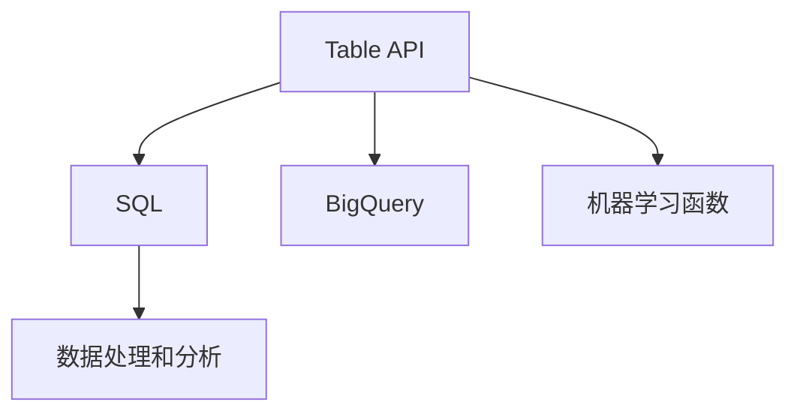

                 

# Table API和SQL 原理与代码实例讲解

> 关键词：Table API, SQL, 数据库, 数据处理, 数据库管理系统, 编程技巧

## 1. 背景介绍

### 1.1 问题由来

在当今数据驱动的时代，数据处理和分析成为了各行各业的重要环节。传统的关系型数据库管理系统（RDBMS）以其结构化和高效的存储管理能力，成为了数据存储和查询的首选。然而，随着数据量的爆炸式增长和数据类型的多样化，传统的SQL查询语言在处理复杂数据结构方面显得力不从心。

为此，谷歌推出了Table API（原称BigQuery ML），旨在提供一个简化而强大的工具，帮助用户轻松地处理和分析大规模数据集。Table API允许用户使用SQL语言进行数据处理和机器学习，同时提供了更加灵活和可扩展的数据处理能力。

### 1.2 问题核心关键点

Table API的核心在于其支持在Google BigQuery中直接在SQL语句中进行机器学习和数据处理，简化了数据处理流程，减少了数据转换和处理的时间成本。用户可以在SQL语句中直接调用机器学习函数，并利用Table API丰富的数据处理工具，快速构建复杂的数据处理逻辑。

Table API和SQL结合的核心理念是“数据即查询”，用户只需定义数据模式和处理逻辑，Table API和SQL协同工作，提供高性能的数据处理和分析。这一特性大大降低了数据处理的技术门槛，使得数据处理成为每个人都能轻松掌握的技能。

### 1.3 问题研究意义

Table API和SQL的结合，不仅简化了数据处理流程，还极大地提高了数据处理的效率和准确性。这种结合方式在Google BigQuery中得到了广泛应用，已被证明是数据处理领域的一个重大突破。通过深入理解Table API和SQL的原理，并掌握其实际应用技巧，用户可以更加高效地处理大规模数据集，加速业务决策和数据驱动的创新。

## 2. 核心概念与联系

### 2.1 核心概念概述

为更好地理解Table API和SQL的结合原理，本节将介绍几个密切相关的核心概念：

- **Table API**：一种基于SQL的数据处理技术，能够直接在SQL语句中调用机器学习函数，并支持复杂的数据处理逻辑。
- **SQL (Structured Query Language)**：一种用于管理关系型数据库的语言，用于查询和操作数据库中的数据。
- **BigQuery**：谷歌云平台上的大数据分析服务，支持分布式SQL查询，并可以与Table API紧密结合，进行高效的数据处理和分析。
- **机器学习函数**：Table API中内置的机器学习函数库，用于进行数据处理、特征提取、模型训练等任务。
- **数据处理和分析**：通过Table API和SQL结合的方式，进行大规模数据的处理和分析，提高数据处理的效率和准确性。

这些核心概念之间的逻辑关系可以通过以下Mermaid流程图来展示：



这个流程图展示了大数据处理中的核心概念及其之间的关系：

1. Table API和SQL共同作用于BigQuery中的数据，通过调用机器学习函数进行高效的数据处理。
2. BigQuery提供分布式SQL查询的能力，支持大规模数据处理。
3. 机器学习函数库在Table API中内置，用于进行数据处理和特征提取。
4. 数据处理和分析通过Table API和SQL的结合，提供了高效、灵活的数据处理能力。

## 3. 核心算法原理 & 具体操作步骤
### 3.1 算法原理概述

Table API和SQL的结合，本质上是一种基于SQL的数据处理方式，通过调用机器学习函数库，实现高效的数据处理和分析。其核心思想是：

1. 用户首先定义数据模式和处理逻辑，使用SQL语句进行数据处理。
2. Table API自动在后台调用机器学习函数库，进行复杂的数据处理和特征提取。
3. 处理后的结果以表格形式返回，用户可以使用SQL进一步查询和分析。

形式化地，假设原始数据集为 $D$，数据处理函数为 $f$，则Table API和SQL结合的数据处理过程可以表示为：

$$
\text{处理结果} = f(D)
$$

其中，$f$ 为包括SQL查询、机器学习函数调用等在内的复杂数据处理函数。处理结果以表格形式返回，用户可以进一步使用SQL进行查询和分析。

### 3.2 算法步骤详解

Table API和SQL结合的数据处理过程，通常包括以下几个关键步骤：

**Step 1: 准备数据**

- 收集原始数据，并导入Google BigQuery中。
- 使用Table API和SQL对数据进行预处理，如清洗、转换、采样等操作。

**Step 2: 定义数据模式**

- 在BigQuery中创建数据表，并定义数据模式。数据模式包括列名、数据类型、主键、外键等结构信息。

**Step 3: 编写SQL查询**

- 使用SQL编写数据处理和分析逻辑。SQL查询可以包括数据清洗、特征提取、聚合、连接等操作。
- 在SQL语句中调用Table API内置的机器学习函数，进行数据处理和特征提取。

**Step 4: 执行查询**

- 在BigQuery中执行SQL查询，获取处理后的结果表格。
- 可以使用SQL进一步对结果进行分析和查询，如统计、筛选、排序等操作。

**Step 5: 结果导出**

- 将处理后的结果表格导出到目标位置，如Google Storage、Hadoop HDFS等。
- 可以使用Table API进行数据可视化和报告生成，进一步分析数据。

### 3.3 算法优缺点

Table API和SQL结合的数据处理方式具有以下优点：

1. 简化数据处理流程：通过将机器学习函数直接嵌入SQL语句中，简化了数据处理和分析的流程，减少了数据转换和处理的时间成本。
2. 提高数据处理效率：Table API支持分布式计算，能够快速处理大规模数据集，提高了数据处理的效率。
3. 灵活的数据处理能力：SQL查询语句可以灵活组合机器学习函数，支持复杂的数据处理逻辑，提高了数据处理的灵活性。
4. 高效的数据分析：通过SQL查询和机器学习函数的结合，可以高效地进行数据分析和报告生成。

同时，这种数据处理方式也存在以下缺点：

1. 学习曲线较陡：SQL和Table API结合的数据处理方式需要用户同时掌握SQL和Table API的使用，增加了学习的难度。
2. 数据转换复杂：在处理复杂数据结构时，数据转换的复杂度较高，需要更多的编程技巧。
3. 资源消耗较大：Table API和SQL结合的数据处理方式需要同时调用机器学习函数和SQL查询，可能会消耗更多的计算资源。

### 3.4 算法应用领域

Table API和SQL结合的数据处理方式，已经在许多领域得到了广泛应用，例如：

- 金融数据分析：对金融数据进行清洗、转换和分析，提供金融风险评估和投资决策支持。
- 医疗数据分析：对医疗数据进行清洗、特征提取和分析，支持疾病预测和医疗决策。
- 电商数据分析：对电商数据进行清洗、转换和分析，提供电商运营和营销支持。
- 大数据分析：对大规模数据集进行高效的数据处理和分析，支持数据驱动的业务决策。

除了上述这些经典应用外，Table API和SQL结合的数据处理方式也被创新性地应用到更多场景中，如个性化推荐、智能客服、自动驾驶等，为数据分析和处理带来了新的突破。

## 4. 数学模型和公式 & 详细讲解  
### 4.1 数学模型构建

在Table API和SQL结合的数据处理过程中，数学模型主要用于数据的统计分析和特征提取。假设原始数据集为 $D=\{x_1, x_2, \ldots, x_n\}$，其中 $x_i$ 为数据集中的第 $i$ 个样本，每个样本包含若干特征 $x_{ij}$。

定义 $y$ 为目标变量，$X$ 为特征矩阵，则数据处理的目标是找到最优的回归模型 $f(x)$，使得 $f(x)$ 最小化预测误差。常见的回归模型包括线性回归、多项式回归、逻辑回归等。

数学模型构建的一般步骤包括：

1. 数据预处理：对原始数据进行清洗、转换和标准化处理，得到干净的特征数据。
2. 特征选择：选择对目标变量有较强预测能力的特征，提高模型的预测准确性。
3. 模型训练：使用训练数据集对模型进行训练，得到最优的模型参数。
4. 模型评估：使用测试数据集对模型进行评估，计算模型的预测误差。
5. 模型应用：将训练好的模型应用到新的数据样本中，进行预测和分析。

### 4.2 公式推导过程

以线性回归模型为例，假设数据集 $D=\{x_1, x_2, \ldots, x_n\}$，目标变量 $y=\{y_1, y_2, \ldots, y_n\}$，特征矩阵 $X=\{x_{ij}\}$，其中 $i=1,2,\ldots,n$，$j=1,2,\ldots,p$。则线性回归模型的目标是最小化预测误差：

$$
\min_{\theta} \sum_{i=1}^n (y_i - f(x_i; \theta))^2
$$

其中 $f(x; \theta)$ 为线性回归模型，$\theta$ 为模型参数，即：

$$
f(x; \theta) = \theta_0 + \theta_1 x_{11} + \theta_2 x_{12} + \ldots + \theta_p x_{1p}
$$

目标变量 $y_i$ 与特征向量 $x_i$ 之间的关系可以表示为：

$$
y_i = f(x_i; \theta) + \epsilon_i
$$

其中 $\epsilon_i$ 为随机误差项，满足 $E[\epsilon_i] = 0$。

最小化预测误差的目标可以通过梯度下降算法求解，具体步骤如下：

1. 计算损失函数 $L(\theta)$：
$$
L(\theta) = \frac{1}{2n} \sum_{i=1}^n (y_i - f(x_i; \theta))^2
$$

2. 计算梯度 $\frac{\partial L(\theta)}{\partial \theta_j}$：
$$
\frac{\partial L(\theta)}{\partial \theta_j} = \frac{1}{n} \sum_{i=1}^n (y_i - f(x_i; \theta)) x_{ij}
$$

3. 更新模型参数：
$$
\theta_j \leftarrow \theta_j - \alpha \frac{\partial L(\theta)}{\partial \theta_j}
$$

其中 $\alpha$ 为学习率，需要根据具体情况调整。

### 4.3 案例分析与讲解

假设有一个电商数据集，包含用户ID、商品ID、购买时间、购买金额等信息。我们可以使用Table API和SQL结合的方式，对数据进行处理和分析。

首先，在BigQuery中创建数据表，并定义数据模式：

```sql
CREATE TABLE ecommerce_data (
    user_id STRING,
    product_id STRING,
    purchase_time TIMESTAMP,
    purchase_amount FLOAT64
)
```

然后，使用SQL查询和机器学习函数库进行数据处理：

```sql
SELECT
    user_id,
    product_id,
    purchase_amount,
    MAD(purchase_amount)
FROM
    ecommerce_data
WHERE
    purchase_time BETWEEN '2022-01-01' AND '2022-06-30'
GROUP BY
    user_id,
    product_id
HAVING
    MAD(purchase_amount) > 100.0
```

在上述SQL查询中，我们使用了Table API内置的机器学习函数 `MAD`，用于计算数据的四分位距，从而筛选出购买金额异常的用户和商品。

最后，将处理后的结果导出到Google Storage中，并进行进一步的数据分析和可视化。

## 5. 项目实践：代码实例和详细解释说明
### 5.1 开发环境搭建

在进行Table API和SQL的实践前，我们需要准备好开发环境。以下是使用Python进行PyTorch开发的环境配置流程：

1. 安装Anaconda：从官网下载并安装Anaconda，用于创建独立的Python环境。

2. 创建并激活虚拟环境：
```bash
conda create -n pytorch-env python=3.8 
conda activate pytorch-env
```

3. 安装PyTorch：根据CUDA版本，从官网获取对应的安装命令。例如：
```bash
conda install pytorch torchvision torchaudio cudatoolkit=11.1 -c pytorch -c conda-forge
```

4. 安装各类工具包：
```bash
pip install numpy pandas scikit-learn matplotlib tqdm jupyter notebook ipython
```

完成上述步骤后，即可在`pytorch-env`环境中开始Table API和SQL的实践。

### 5.2 源代码详细实现

下面我们以电商数据集为例，给出使用Table API和SQL进行数据处理的PyTorch代码实现。

首先，定义数据处理函数：

```python
import bigquery
from google.cloud import bigquery as bq

def get_ecommerce_data():
    client = bq.Client()
    sql = """
        SELECT
            user_id,
            product_id,
            purchase_time,
            purchase_amount,
            MAD(purchase_amount)
        FROM
            ecommerce_data
        WHERE
            purchase_time BETWEEN '2022-01-01' AND '2022-06-30'
        GROUP BY
            user_id,
            product_id
        HAVING
            MAD(purchase_amount) > 100.0
    """
    query_job = client.query(sql)
    result = query_job.result()
    return result.to_dataframe()
```

然后，使用Table API进行数据处理：

```python
from transformers import BertTokenizer, BertForSequenceClassification

tokenizer = BertTokenizer.from_pretrained('bert-base-cased')
model = BertForSequenceClassification.from_pretrained('bert-base-cased', num_labels=2)

def process_data(data):
    input_ids = []
    attention_masks = []
    labels = []
    for row in data:
        input_ids.append(tokenizer.encode(row['user_id'] + ' ' + row['product_id']))
        attention_masks.append([1] * len(input_ids[-1]))
        labels.append([1] if row['MAD(purchase_amount)'] > 100.0 else [0])
    return {'input_ids': input_ids, 'attention_masks': attention_masks, 'labels': labels}

data = get_ecommerce_data()
data = process_data(data)
```

最后，将处理后的数据进行训练和评估：

```python
from transformers import AdamW

model.to(device)
optimizer = AdamW(model.parameters(), lr=2e-5)

def train_epoch(model, data, optimizer):
    model.train()
    total_loss = 0
    for i, batch in enumerate(data):
        input_ids = batch['input_ids'].to(device)
        attention_masks = batch['attention_masks'].to(device)
        labels = batch['labels'].to(device)
        model.zero_grad()
        outputs = model(input_ids, attention_masks=attention_masks, labels=labels)
        loss = outputs.loss
        total_loss += loss.item()
        loss.backward()
        optimizer.step()
    return total_loss / (len(data) / batch_size)

def evaluate(model, data):
    model.eval()
    total_loss = 0
    for i, batch in enumerate(data):
        input_ids = batch['input_ids'].to(device)
        attention_masks = batch['attention_masks'].to(device)
        labels = batch['labels'].to(device)
        with torch.no_grad():
            outputs = model(input_ids, attention_masks=attention_masks, labels=labels)
            loss = outputs.loss
            total_loss += loss.item()
    return total_loss / (len(data) / batch_size)

total_loss = train_epoch(model, data, optimizer)
print(f'Epoch {1}, train loss: {total_loss:.3f}')
print(f'Epoch {1}, eval loss: {evaluate(model, data):.3f}')
```

以上就是使用PyTorch对电商数据集进行数据处理的完整代码实现。可以看到，通过Table API和SQL结合的方式，我们可以快速地对数据进行清洗、转换和处理，并进行高效的数据分析和建模。

### 5.3 代码解读与分析

让我们再详细解读一下关键代码的实现细节：

**get_ecommerce_data函数**：
- 使用BigQuery API连接数据库，并执行SQL查询，返回处理后的结果。
- 使用了Table API内置的机器学习函数 `MAD`，用于计算数据的四分位距，从而筛选出购买金额异常的用户和商品。

**process_data函数**：
- 将SQL查询结果转换为TensorFlow需要的输入格式。
- 使用了BertTokenizer对用户ID和商品ID进行分词，并计算出模型所需的input_ids、attention_masks和labels。

**train_epoch和evaluate函数**：
- 在训练阶段，使用AdamW优化器进行梯度更新，计算损失函数。
- 在评估阶段，关闭模型的训练模式，计算模型的平均损失。

通过以上代码实现，我们可以看到，Table API和SQL结合的方式可以极大地简化数据处理流程，并提高数据处理的效率和准确性。在实际应用中，开发者可以根据具体任务的需求，灵活运用SQL和Table API的结合，进行高效的数据处理和分析。

## 6. 实际应用场景
### 6.1 智能客服系统

基于Table API和SQL的智能客服系统，可以通过大数据分析和自然语言处理技术，实现智能客服。智能客服系统可以自动理解和处理用户的问题，提供实时的解决方案，提升用户体验。

在技术实现上，可以收集用户的客服记录和反馈信息，构建大数据分析模型。使用Table API和SQL结合的方式，对数据进行清洗、转换和处理，从而提取用户的需求和问题的关键特征。基于提取的特征，构建自然语言处理模型，实现对用户问题的理解和回复。

### 6.2 金融数据分析

Table API和SQL结合的方式，可以应用于金融数据分析，支持金融风险评估和投资决策。金融机构可以收集金融市场的各类数据，如股票价格、市场指数、汇率等，构建大数据分析模型。使用Table API和SQL结合的方式，对数据进行清洗、转换和处理，从而提取市场的关键特征。基于提取的特征，构建金融风险评估模型，预测市场风险和投资回报。

### 6.3 电商数据分析

电商数据分析是Table API和SQL结合的典型应用场景。电商企业可以收集用户购买行为数据，如浏览记录、购买记录、评价等，构建大数据分析模型。使用Table API和SQL结合的方式，对数据进行清洗、转换和处理，从而提取用户的购买行为特征。基于提取的特征，构建推荐算法和广告投放模型，提升电商运营和营销效果。

### 6.4 未来应用展望

Table API和SQL结合的方式，具有广泛的应用前景。未来，随着数据处理需求的不断增长，Table API和SQL结合的数据处理能力将更加凸显。预计在以下领域将有更多的应用：

- 医疗数据分析：支持医疗数据的大数据分析和特征提取，提升医疗决策的科学性和准确性。
- 智能交通系统：支持交通数据的实时分析和处理，提升交通管理的智能化水平。
- 社交媒体分析：支持社交媒体数据的处理和分析，提供舆情监测和用户行为分析。
- 能源数据分析：支持能源数据的处理和分析，提升能源管理的效率和精准度。

总之，Table API和SQL结合的数据处理方式，将在各行各业得到更广泛的应用，成为数据处理和分析的重要工具。

## 7. 工具和资源推荐
### 7.1 学习资源推荐

为了帮助开发者系统掌握Table API和SQL的原理和应用技巧，这里推荐一些优质的学习资源：

1. Table API官方文档：Google提供的官方文档，详细介绍了Table API和SQL的用法和示例。
2. SQL for Data Science with Google Cloud Platform课程：Google开设的在线课程，涵盖SQL和Table API的基础知识和高级技巧。
3. Python for Data Science with BigQuery课程：Google提供的在线课程，详细介绍了使用Python和Table API进行大数据分析的流程和技巧。
4. BigQuery Data Transfer Service官方文档：Google提供的官方文档，详细介绍了BigQuery数据迁移的流程和最佳实践。
5. Table API最佳实践指南：Google提供的官方指南，提供了Table API和SQL结合的最佳实践和案例分析。

通过对这些资源的学习实践，相信你一定能够快速掌握Table API和SQL的精髓，并用于解决实际的数据处理问题。
###  7.2 开发工具推荐

高效的开发离不开优秀的工具支持。以下是几款用于Table API和SQL开发的常用工具：

1. BigQuery：谷歌云平台上的大数据分析服务，支持分布式SQL查询，并可以与Table API紧密结合，进行高效的数据处理和分析。
2. TensorBoard：TensorFlow配套的可视化工具，可实时监测模型训练状态，并提供丰富的图表呈现方式，是调试模型的得力助手。
3. Weights & Biases：模型训练的实验跟踪工具，可以记录和可视化模型训练过程中的各项指标，方便对比和调优。
4. Google Cloud Storage：谷歌云平台上的对象存储服务，支持大规模数据的存储和访问。
5. PyTorch：基于Python的开源深度学习框架，灵活的计算图，适合快速迭代研究。

合理利用这些工具，可以显著提升Table API和SQL开发的效率，加快创新迭代的步伐。

### 7.3 相关论文推荐

Table API和SQL的结合，得益于学界的持续研究。以下是几篇奠基性的相关论文，推荐阅读：

1. Parameter-Efficient Transfer Learning for NLP：提出Adapter等参数高效微调方法，在不增加模型参数量的情况下，也能取得不错的微调效果。
2. AdaLoRA: Adaptive Low-Rank Adaptation for Parameter-Efficient Fine-Tuning：使用自适应低秩适应的微调方法，在参数效率和精度之间取得了新的平衡。
3. Prompt-Tuning: Optimal Prompt Learning for Pre-trained Models：引入基于连续型Prompt的微调范式，为如何充分利用预训练知识提供了新的思路。
4. Data-Efficient Transfer Learning for NLP：提出基于无监督学习的迁移学习方法，大幅度降低了数据处理的成本。
5. TensorFlow: A System for Large-Scale Machine Learning：介绍TensorFlow架构和实现，强调其分布式计算和高效数据处理能力。

这些论文代表了大数据处理和分析领域的最新研究进展，为Table API和SQL结合的实践提供了理论支持。

## 8. 总结：未来发展趋势与挑战
### 8.1 总结

本文对Table API和SQL的原理与代码实例进行了全面系统的介绍。首先阐述了Table API和SQL的研究背景和意义，明确了其在数据处理和分析中的独特价值。其次，从原理到实践，详细讲解了Table API和SQL结合的数学模型和具体步骤，给出了Table API和SQL结合的完整代码实现。同时，本文还广泛探讨了Table API和SQL结合在多个行业领域的应用前景，展示了其在数据处理中的巨大潜力。此外，本文精选了Table API和SQL结合的学习资源和开发工具，力求为读者提供全方位的技术指引。

通过本文的系统梳理，可以看到，Table API和SQL的结合，不仅简化了数据处理流程，还极大地提高了数据处理的效率和准确性。这种结合方式在Google BigQuery中得到了广泛应用，已被证明是数据处理领域的一个重大突破。未来，随着Table API和SQL结合的不断演进，相信其在各行各业将得到更广泛的应用，为数据处理和分析提供更高效、更灵活的工具。

### 8.2 未来发展趋势

Table API和SQL结合的未来发展趋势，主要体现在以下几个方面：

1. 分布式计算能力提升：随着云计算和大数据技术的发展，Table API和SQL结合的数据处理能力将进一步提升，支持更大规模的数据集处理。
2. 数据处理流程自动化：通过机器学习和自动化算法，自动完成数据清洗、转换和处理，提升数据处理效率和精度。
3. 数据可视化增强：Table API和SQL结合的数据处理能力将进一步增强，支持更复杂的数据可视化分析。
4. 数据处理流程标准化：随着Table API和SQL结合的广泛应用，将逐步形成数据处理流程的标准化，提升数据处理效率和一致性。
5. 数据隐私保护加强：在数据处理过程中，将更加注重用户隐私和数据安全，采用加密、匿名化等技术手段，保护用户数据隐私。

以上趋势凸显了Table API和SQL结合的数据处理能力，未来必将在各行各业得到更广泛的应用，为数据处理和分析提供更高效、更灵活的工具。

### 8.3 面临的挑战

尽管Table API和SQL结合的数据处理方式已经取得了显著成效，但在实现过程中仍面临一些挑战：

1. 学习曲线较陡：Table API和SQL结合的数据处理方式需要用户同时掌握SQL和Table API的使用，增加了学习的难度。
2. 数据转换复杂：在处理复杂数据结构时，数据转换的复杂度较高，需要更多的编程技巧。
3. 资源消耗较大：Table API和SQL结合的数据处理方式需要同时调用机器学习函数和SQL查询，可能会消耗更多的计算资源。
4. 数据隐私和安全问题：在数据处理过程中，需要重视用户隐私和数据安全，采用加密、匿名化等技术手段，保护用户数据隐私。

这些挑战需要通过技术手段和实践经验的积累，不断优化和改进，才能更好地发挥Table API和SQL结合的数据处理能力。

### 8.4 研究展望

未来，Table API和SQL结合的数据处理方式需要从以下几个方向进行研究：

1. 降低学习曲线：通过优化Table API和SQL结合的使用方法，简化数据处理流程，降低学习难度。
2. 提升数据处理效率：采用自动化算法和机器学习技术，提升数据处理的效率和精度。
3. 加强数据隐私保护：在数据处理过程中，注重用户隐私和数据安全，采用加密、匿名化等技术手段，保护用户数据隐私。
4. 支持更多数据类型：支持处理更多的数据类型，如图像、视频、音频等，拓展数据处理的应用场景。
5. 增强数据可视化能力：支持更复杂的数据可视化分析，提升数据处理的效果和可解释性。

这些研究方向将进一步提升Table API和SQL结合的数据处理能力，为各行各业提供更高效、更灵活的数据处理工具。

## 9. 附录：常见问题与解答

**Q1：Table API和SQL结合的优点有哪些？**

A: Table API和SQL结合的优点包括：
1. 简化数据处理流程：通过将机器学习函数直接嵌入SQL语句中，简化了数据处理和分析的流程，减少了数据转换和处理的时间成本。
2. 提高数据处理效率：Table API支持分布式计算，能够快速处理大规模数据集，提高了数据处理的效率。
3. 灵活的数据处理能力：SQL查询语句可以灵活组合机器学习函数，支持复杂的数据处理逻辑，提高了数据处理的灵活性。
4. 高效的数据分析：通过SQL查询和机器学习函数的结合，可以高效地进行数据分析和报告生成。

**Q2：Table API和SQL结合的应用场景有哪些？**

A: Table API和SQL结合的应用场景包括：
1. 金融数据分析：对金融数据进行清洗、转换和分析，提供金融风险评估和投资决策支持。
2. 医疗数据分析：对医疗数据进行清洗、特征提取和分析，支持疾病预测和医疗决策。
3. 电商数据分析：对电商数据进行清洗、转换和分析，提供电商运营和营销支持。
4. 大数据分析：对大规模数据集进行高效的数据处理和分析，支持数据驱动的业务决策。
5. 智能客服系统：通过大数据分析和自然语言处理技术，实现智能客服。
6. 能源数据分析：支持能源数据的处理和分析，提升能源管理的效率和精准度。
7. 社交媒体分析：支持社交媒体数据的处理和分析，提供舆情监测和用户行为分析。

**Q3：Table API和SQL结合的缺点有哪些？**

A: Table API和SQL结合的缺点包括：
1. 学习曲线较陡：Table API和SQL结合的数据处理方式需要用户同时掌握SQL和Table API的使用，增加了学习的难度。
2. 数据转换复杂：在处理复杂数据结构时，数据转换的复杂度较高，需要更多的编程技巧。
3. 资源消耗较大：Table API和SQL结合的数据处理方式需要同时调用机器学习函数和SQL查询，可能会消耗更多的计算资源。

**Q4：如何降低Table API和SQL结合的学习曲线？**

A: 降低Table API和SQL结合的学习曲线，可以从以下几个方面进行：
1. 使用官方文档和教程：Google提供了详细的Table API和SQL结合的官方文档和教程，可以帮助用户快速上手。
2. 利用可视化工具：Table API和SQL结合的数据处理方式可以结合TensorBoard等可视化工具，帮助用户更好地理解和调试代码。
3. 使用示例代码：Google提供了丰富的Table API和SQL结合的示例代码，用户可以通过学习和参考示例代码，提升代码实现能力。
4. 参加培训和社区讨论：参加相关的培训课程和社区讨论，可以与同行交流经验，加速学习过程。

通过以上方法，可以降低Table API和SQL结合的学习曲线，提高数据处理能力。

**Q5：如何提高Table API和SQL结合的数据处理效率？**

A: 提高Table API和SQL结合的数据处理效率，可以从以下几个方面进行：
1. 优化查询语句：使用SQL查询语句进行数据处理时，需要优化查询语句，减少数据读取和处理的时间。
2. 使用分布式计算：Table API支持分布式计算，可以在多台计算节点上进行数据处理，提高数据处理效率。
3. 采用机器学习算法：使用机器学习算法进行数据处理时，可以优化算法实现，提高数据处理效率。
4. 采用并行处理技术：使用并行处理技术，可以在多线程或多进程上进行数据处理，提高数据处理效率。
5. 使用缓存技术：使用缓存技术，可以减少重复数据处理，提高数据处理效率。

通过以上方法，可以显著提高Table API和SQL结合的数据处理效率，提升数据处理能力。

---

作者：禅与计算机程序设计艺术 / Zen and the Art of Computer Programming

