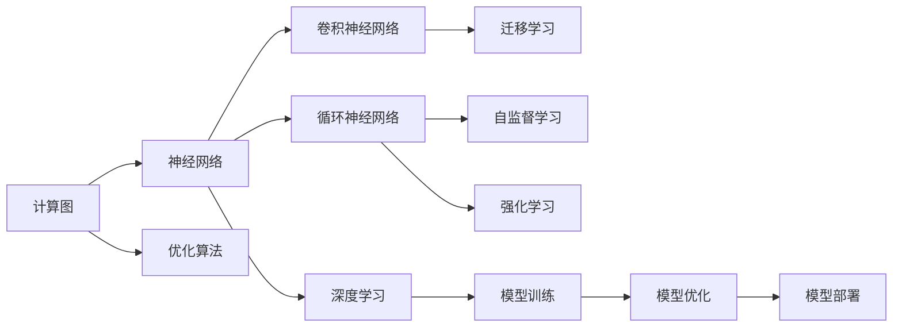

                 

# TensorFlow深度学习：从基础到高级应用

> 关键词：TensorFlow,深度学习,神经网络,优化算法,卷积神经网络,循环神经网络,迁移学习,自监督学习,强化学习

## 1. 背景介绍

### 1.1 问题由来

深度学习作为人工智能领域的前沿技术，近年来在图像识别、语音识别、自然语言处理、推荐系统等领域取得了显著的成果。TensorFlow作为深度学习领域的知名开源框架，具有灵活性、易用性、可扩展性等优点，吸引了大量的研究人员和开发者使用。从谷歌大脑的科研工作，到工业界的实际应用，TensorFlow已经成为深度学习领域的重要工具。

然而，随着深度学习应用的深入，对于初学者来说，TensorFlow的学习曲线陡峭，且涉及众多专业概念和算法，难以全面掌握。本文旨在通过系统的介绍TensorFlow的原理和应用，帮助读者快速上手，掌握深度学习的基础知识和高级应用技巧。

### 1.2 问题核心关键点

TensorFlow的核心在于其灵活的计算图和高效的优化算法。通过理解TensorFlow的计算图模型、优化算法、以及模型结构，读者可以更好地设计、训练和部署深度学习模型，解决实际问题。

本文章的核心问题如下：

1. 如何搭建和训练深度学习模型？
2. 如何优化模型性能？
3. 如何处理复杂数据集？
4. 如何部署和应用深度学习模型？

## 2. 核心概念与联系

### 2.1 核心概念概述

在深入探讨TensorFlow之前，首先介绍几个关键概念：

- **深度学习**：一种通过多层神经网络进行特征提取和模式学习的机器学习技术。

- **计算图**：TensorFlow的核心理念，通过构建计算图来描述模型的计算流程，并支持动态图和静态图两种模式。

- **优化算法**：用于训练深度学习模型的算法，如梯度下降、Adam、Adagrad等。

- **卷积神经网络(CNN)**：一种专门用于图像处理任务的深度神经网络结构。

- **循环神经网络(RNN)**：一种用于处理序列数据（如时间序列、文本序列）的深度神经网络结构。

- **迁移学习**：通过在已有数据集上预训练的模型，在新的数据集上进行微调，以提升模型的泛化能力。

- **自监督学习**：一种无需人工标注数据的学习方法，通过模型自身的数据生成能力进行学习。

- **强化学习**：一种通过奖励和惩罚机制训练模型的学习方式，常用于游戏、机器人控制等领域。

这些概念共同构成了深度学习的基础框架，TensorFlow作为深度学习的重要工具，依托这些概念实现了灵活的模型构建、训练、优化和部署。

### 2.2 核心概念原理和架构的 Mermaid 流程图(Mermaid 流程节点中不要有括号、逗号等特殊字符)



这个流程图展示了TensorFlow中的核心概念及其相互关系：

1. 计算图作为TensorFlow的基础，通过神经网络构建模型。
2. 神经网络中的卷积神经网络和循环神经网络，分别用于图像处理和序列数据的建模。
3. 优化算法用于模型训练和参数更新。
4. 迁移学习、自监督学习和强化学习，提供了模型泛化能力和学习效率的提升手段。

这些概念构成了深度学习的基本框架，而TensorFlow通过灵活的计算图设计和高效的优化算法，实现了模型的高效构建和训练。

## 3. 核心算法原理 & 具体操作步骤

### 3.1 算法原理概述

TensorFlow通过构建计算图来实现模型的灵活搭建和高效训练。计算图描述了模型中各个操作之间的依赖关系，并支持动态图和静态图两种模式。

动态图模式下，模型可以实时响应输入数据的变化，适合于在线实时应用。静态图模式下，模型在编译后可以进行高效的优化，适合于批量训练和部署。

在计算图的基础上，TensorFlow提供了丰富的优化算法，如梯度下降、Adam、Adagrad等。这些算法通过反向传播机制，更新模型参数，使模型能够不断优化，提升预测性能。

### 3.2 算法步骤详解

以下是使用TensorFlow构建、训练、优化和部署深度学习模型的详细步骤：

#### 3.2.1 环境搭建

在开始TensorFlow开发前，需要先搭建好开发环境。

1. 安装Anaconda：从官网下载并安装Anaconda，用于创建独立的Python环境。

2. 创建并激活虚拟环境：
```bash
conda create -n tf-env python=3.8 
conda activate tf-env
```

3. 安装TensorFlow：根据CUDA版本，从官网获取对应的安装命令。例如：
```bash
conda install tensorflow==2.6 -c tensorflow
```

4. 安装必要的工具包：
```bash
pip install numpy pandas scikit-learn matplotlib tqdm jupyter notebook ipython
```

完成上述步骤后，即可在`tf-env`环境中进行TensorFlow开发。

#### 3.2.2 数据预处理

数据预处理是深度学习模型训练的重要步骤，涉及数据清洗、归一化、特征提取等。

以图像分类任务为例，数据预处理包括：

1. 读取图像文件，并进行数据增强，如随机旋转、翻转、缩放等。
2. 将图像转换为张量，并进行归一化处理。
3. 将标签转换为独热编码形式。

#### 3.2.3 模型构建

TensorFlow通过计算图来描述模型结构，可以使用Keras API或TensorFlow Core API来构建模型。以下是一个使用Keras API构建卷积神经网络的示例：

```python
import tensorflow as tf
from tensorflow.keras import layers

model = tf.keras.Sequential()
model.add(layers.Conv2D(32, (3, 3), activation='relu', input_shape=(28, 28, 1)))
model.add(layers.MaxPooling2D((2, 2)))
model.add(layers.Flatten())
model.add(layers.Dense(10, activation='softmax'))

model.summary()
```

#### 3.2.4 模型训练

模型训练是深度学习模型的核心步骤，涉及数据输入、模型前向传播、损失计算、梯度更新等。

以图像分类任务为例，模型训练包括：

1. 将训练数据输入模型，进行前向传播，计算损失函数。
2. 反向传播计算梯度，使用优化器更新模型参数。
3. 在验证集上评估模型性能，避免过拟合。

```python
import numpy as np

# 准备训练集和验证集
train_data = ...
val_data = ...

# 定义损失函数和优化器
loss_fn = tf.keras.losses.SparseCategoricalCrossentropy(from_logits=True)
optimizer = tf.keras.optimizers.Adam()

# 定义评估指标
accuracy = tf.keras.metrics.SparseCategoricalAccuracy()

# 训练模型
for epoch in range(epochs):
    for x, y in train_data:
        with tf.GradientTape() as tape:
            logits = model(x, training=True)
            loss = loss_fn(y, logits)
        gradients = tape.gradient(loss, model.trainable_variables)
        optimizer.apply_gradients(zip(gradients, model.trainable_variables))
        accuracy(y, logits)
    print(f"Epoch {epoch+1}, loss: {loss.numpy()}, accuracy: {accuracy.numpy()}")
```

#### 3.2.5 模型优化

模型优化是深度学习模型性能提升的关键步骤，涉及超参数调整、正则化技术、对抗训练等。

以图像分类任务为例，模型优化包括：

1. 调整学习率、批大小等超参数，以提升训练效果。
2. 引入L2正则化、Dropout等正则化技术，避免过拟合。
3. 引入对抗样本，提高模型鲁棒性。

```python
# 调整超参数
learning_rate = 0.001
batch_size = 32
epochs = 10

# 引入L2正则化
l2_lambda = 0.01
regularizer = tf.keras.regularizers.l2(l2_lambda)

# 引入Dropout
dropout_rate = 0.5

# 训练模型
for epoch in range(epochs):
    for x, y in train_data:
        with tf.GradientTape() as tape:
            logits = model(x, training=True)
            loss = loss_fn(y, logits)
            loss += regularizer(logits)
        gradients = tape.gradient(loss, model.trainable_variables)
        optimizer.apply_gradients(zip(gradients, model.trainable_variables))
        accuracy(y, logits)
    print(f"Epoch {epoch+1}, loss: {loss.numpy()}, accuracy: {accuracy.numpy()}")
```

#### 3.2.6 模型部署

模型部署是将训练好的模型应用到实际场景中的关键步骤，涉及模型保存、加载、推理等。

以图像分类任务为例，模型部署包括：

1. 保存模型权重和结构，以便后续加载和推理。
2. 加载模型，进行推理计算。

```python
# 保存模型
model.save_weights('model_weights.h5')

# 加载模型
model.load_weights('model_weights.h5')

# 进行推理
x_test = ...
logits = model(x_test, training=False)
predictions = tf.argmax(logits, axis=1)
```

### 3.3 算法优缺点

TensorFlow作为深度学习的重要工具，具有以下优点：

1. 灵活的计算图设计，支持动态图和静态图两种模式，灵活性高。
2. 丰富的优化算法，如梯度下降、Adam、Adagrad等，优化效果显著。
3. 支持分布式训练，可利用多台机器进行高效训练。
4. 支持多种硬件平台，如CPU、GPU、TPU等，适用范围广。

同时，TensorFlow也存在一些缺点：

1. 学习曲线陡峭，需要一定的深度学习基础。
2. 文档和教程较为分散，新手容易陷入迷宫。
3. 内存和计算资源消耗较大，对硬件要求较高。
4. 社区活跃度稍逊于PyTorch等新兴框架。

## 4. 数学模型和公式 & 详细讲解 & 举例说明

### 4.1 数学模型构建

本节将使用数学语言对TensorFlow中构建深度学习模型的过程进行更加严格的刻画。

以图像分类任务为例，模型的目标是将输入图像分类为不同的类别。设输入图像为 $x$，输出类别为 $y$，模型结构为 $f_\theta$，其中 $\theta$ 为模型参数。

模型的目标是最小化交叉熵损失函数，即：

$$
\min_\theta \mathcal{L}(y, f_\theta(x)) = -\frac{1}{N}\sum_{i=1}^N y_i \log f_\theta(x_i) + (1 - y_i) \log (1 - f_\theta(x_i))
$$

其中 $N$ 为训练样本数量，$y_i$ 为第 $i$ 个样本的真实标签，$f_\theta(x_i)$ 为模型对第 $i$ 个样本的预测输出。

### 4.2 公式推导过程

以下我们以图像分类任务为例，推导交叉熵损失函数及其梯度的计算公式。

设模型的输出为 $f_\theta(x)$，其概率分布为 $p_\theta(x) = f_\theta(x)/\sum_j f_\theta(x_j)$。则交叉熵损失函数为：

$$
\mathcal{L}(y, f_\theta(x)) = -\frac{1}{N}\sum_{i=1}^N y_i \log p_\theta(x_i)
$$

其对模型参数 $\theta$ 的梯度为：

$$
\frac{\partial \mathcal{L}}{\partial \theta} = -\frac{1}{N}\sum_{i=1}^N \frac{y_i}{f_\theta(x_i)} \frac{\partial f_\theta(x_i)}{\partial \theta} + \frac{1-y_i}{1-f_\theta(x_i)} \frac{\partial f_\theta(x_i)}{\partial \theta}
$$

其中 $\frac{\partial f_\theta(x_i)}{\partial \theta}$ 为模型参数 $\theta$ 对输入 $x_i$ 的导数，可以通过反向传播算法高效计算。

在得到损失函数的梯度后，即可带入模型参数 $\theta$ 进行更新，最小化损失函数。重复上述过程直至收敛，最终得到适应训练数据集的模型参数 $\theta^*$。

### 4.3 案例分析与讲解

以下通过一个简单的图像分类任务，详细讲解TensorFlow的使用。

首先，定义数据集和模型：

```python
import tensorflow as tf

# 定义训练集和测试集
train_dataset = tf.data.Dataset.from_tensor_slices((train_images, train_labels))
test_dataset = tf.data.Dataset.from_tensor_slices((test_images, test_labels))

# 定义模型
model = tf.keras.Sequential([
    tf.keras.layers.Conv2D(32, (3, 3), activation='relu', input_shape=(28, 28, 1)),
    tf.keras.layers.MaxPooling2D((2, 2)),
    tf.keras.layers.Flatten(),
    tf.keras.layers.Dense(10, activation='softmax')
])

# 定义优化器和损失函数
optimizer = tf.keras.optimizers.Adam()
loss_fn = tf.keras.losses.SparseCategoricalCrossentropy(from_logits=True)
```

然后，进行数据预处理和模型训练：

```python
# 数据增强和预处理
train_dataset = train_dataset.map(lambda x, y: (tf.image.random_flip_left_right(x), y))
train_dataset = train_dataset.map(lambda x, y: (tf.image.random_rotation(x, 45), y))

# 构建训练循环
@tf.function
def train_step(x, y):
    with tf.GradientTape() as tape:
        logits = model(x, training=True)
        loss = loss_fn(y, logits)
    gradients = tape.gradient(loss, model.trainable_variables)
    optimizer.apply_gradients(zip(gradients, model.trainable_variables))
    return loss

# 训练模型
for epoch in range(epochs):
    for x, y in train_dataset:
        loss = train_step(x, y)
        print(f"Epoch {epoch+1}, loss: {loss.numpy()}")
```

最后，进行模型评估和推理：

```python
# 评估模型
test_dataset = test_dataset.map(lambda x, y: (tf.image.random_flip_left_right(x), y))
test_dataset = test_dataset.map(lambda x, y: (tf.image.random_rotation(x, 45), y))

@tf.function
def test_step(x, y):
    logits = model(x, training=False)
    predictions = tf.argmax(logits, axis=1)
    accuracy = tf.reduce_mean(tf.cast(tf.equal(y, predictions), tf.float32))
    return accuracy

# 测试模型
test_loss = []
test_acc = []
for x, y in test_dataset:
    loss, accuracy = test_step(x, y)
    test_loss.append(loss.numpy())
    test_acc.append(accuracy.numpy())

print(f"Test loss: {np.mean(test_loss)}, Test accuracy: {np.mean(test_acc)}")
```

以上就是使用TensorFlow进行图像分类任务的全流程。通过这个简单的案例，可以看出TensorFlow的强大功能和灵活性。

## 5. 项目实践：代码实例和详细解释说明

### 5.1 开发环境搭建

在进行TensorFlow开发前，需要先搭建好开发环境。以下是使用Python进行TensorFlow开发的Python环境配置流程：

1. 安装Anaconda：从官网下载并安装Anaconda，用于创建独立的Python环境。

2. 创建并激活虚拟环境：
```bash
conda create -n tf-env python=3.8 
conda activate tf-env
```

3. 安装TensorFlow：根据CUDA版本，从官网获取对应的安装命令。例如：
```bash
conda install tensorflow==2.6 -c tensorflow
```

4. 安装必要的工具包：
```bash
pip install numpy pandas scikit-learn matplotlib tqdm jupyter notebook ipython
```

完成上述步骤后，即可在`tf-env`环境中进行TensorFlow开发。

### 5.2 源代码详细实现

下面是使用TensorFlow进行图像分类任务的全流程代码实现：

```python
import tensorflow as tf

# 定义训练集和测试集
train_dataset = tf.data.Dataset.from_tensor_slices((train_images, train_labels))
test_dataset = tf.data.Dataset.from_tensor_slices((test_images, test_labels))

# 定义模型
model = tf.keras.Sequential([
    tf.keras.layers.Conv2D(32, (3, 3), activation='relu', input_shape=(28, 28, 1)),
    tf.keras.layers.MaxPooling2D((2, 2)),
    tf.keras.layers.Flatten(),
    tf.keras.layers.Dense(10, activation='softmax')
])

# 定义优化器和损失函数
optimizer = tf.keras.optimizers.Adam()
loss_fn = tf.keras.losses.SparseCategoricalCrossentropy(from_logits=True)

# 数据增强和预处理
train_dataset = train_dataset.map(lambda x, y: (tf.image.random_flip_left_right(x), y))
train_dataset = train_dataset.map(lambda x, y: (tf.image.random_rotation(x, 45), y))

# 构建训练循环
@tf.function
def train_step(x, y):
    with tf.GradientTape() as tape:
        logits = model(x, training=True)
        loss = loss_fn(y, logits)
    gradients = tape.gradient(loss, model.trainable_variables)
    optimizer.apply_gradients(zip(gradients, model.trainable_variables))
    return loss

# 训练模型
for epoch in range(epochs):
    for x, y in train_dataset:
        loss = train_step(x, y)
        print(f"Epoch {epoch+1}, loss: {loss.numpy()}")

# 评估模型
test_dataset = test_dataset.map(lambda x, y: (tf.image.random_flip_left_right(x), y))
test_dataset = test_dataset.map(lambda x, y: (tf.image.random_rotation(x, 45), y))

@tf.function
def test_step(x, y):
    logits = model(x, training=False)
    predictions = tf.argmax(logits, axis=1)
    accuracy = tf.reduce_mean(tf.cast(tf.equal(y, predictions), tf.float32))
    return accuracy

# 测试模型
test_loss = []
test_acc = []
for x, y in test_dataset:
    loss, accuracy = test_step(x, y)
    test_loss.append(loss.numpy())
    test_acc.append(accuracy.numpy())

print(f"Test loss: {np.mean(test_loss)}, Test accuracy: {np.mean(test_acc)}")
```

### 5.3 代码解读与分析

以下是关键代码的实现细节：

**train_step函数**：
- 定义训练函数，使用反向传播计算梯度，更新模型参数，并返回损失值。
- 在TensorFlow中，使用`tf.GradientTape`来记录计算图，自动计算梯度。
- 将模型参数和优化器结合起来，使用`optimizer.apply_gradients`来更新模型参数。

**test_step函数**：
- 定义测试函数，进行推理计算，并返回模型评估指标。
- 使用`model(x, training=False)`来进行非训练模式的推理。
- 使用`tf.argmax`来计算预测结果，使用`tf.equal`来计算预测结果与真实标签的匹配度。

**训练循环**：
- 使用`for`循环进行多轮训练，每次迭代一个batch的数据。
- 在每次迭代中，调用`train_step`函数进行前向传播和反向传播。
- 在训练过程中，打印每轮的损失值。

**测试循环**：
- 使用`for`循环进行多轮测试，每次迭代一个batch的数据。
- 在每次迭代中，调用`test_step`函数进行推理和评估。
- 在测试过程中，记录每轮的损失值和准确率。

通过以上代码，可以看出TensorFlow的灵活性和高效性。TensorFlow通过计算图和自动微分机制，实现了高效的模型构建和训练。

## 6. 实际应用场景

### 6.1 智能推荐系统

智能推荐系统是TensorFlow在实际应用中的一个重要场景。通过深度学习模型，系统可以分析用户的历史行为数据，并结合实时数据，为用户推荐个性化的内容。

在实际应用中，可以使用TensorFlow搭建卷积神经网络或循环神经网络，对用户行为数据进行建模。模型训练时，使用用户的行为数据和兴趣标签作为训练集，并使用A/B测试等方法评估推荐效果。

### 6.2 自然语言处理

自然语言处理(NLP)是TensorFlow应用的另一个重要领域。通过深度学习模型，系统可以处理文本分类、情感分析、机器翻译等NLP任务。

在实际应用中，可以使用TensorFlow搭建循环神经网络或Transformer模型，对文本数据进行建模。模型训练时，使用标注好的文本数据集作为训练集，并使用BLEU、ROUGE等指标评估模型效果。

### 6.3 金融分析

金融分析是TensorFlow在实际应用中的另一个重要场景。通过深度学习模型，系统可以分析金融市场数据，预测股票价格、货币汇率等金融指标。

在实际应用中，可以使用TensorFlow搭建循环神经网络或卷积神经网络，对金融数据进行建模。模型训练时，使用历史金融数据作为训练集，并使用MAE、RMSE等指标评估模型效果。

### 6.4 未来应用展望

随着深度学习技术的不断进步，TensorFlow的应用场景将越来越广泛。未来，TensorFlow将会在更多领域得到应用，如医疗诊断、智能制造、自动驾驶等。

在医疗诊断领域，TensorFlow可以通过深度学习模型，分析医学影像和病历数据，辅助医生进行疾病诊断和治疗。在智能制造领域，TensorFlow可以通过深度学习模型，优化生产流程和质量控制。在自动驾驶领域，TensorFlow可以通过深度学习模型，实现环境感知和决策制定。

## 7. 工具和资源推荐

### 7.1 学习资源推荐

为了帮助读者系统掌握TensorFlow的原理和应用，这里推荐一些优质的学习资源：

1. TensorFlow官方文档：TensorFlow的官方文档是学习TensorFlow的最佳资源，详细介绍了TensorFlow的各种API和使用方法。

2. TensorFlow教程：TensorFlow官方提供的一系列教程，包括基础知识、高级应用、分布式训练等，适合不同层次的读者。

3. TensorFlow实战：《TensorFlow实战》书籍，详细介绍了TensorFlow的各个方面，包括模型构建、数据处理、优化算法等，适合初学者和进阶读者。

4. TensorFlow和Keras深度学习教程：《TensorFlow和Keras深度学习教程》课程，通过实例讲解TensorFlow和Keras的使用方法，适合有一定基础的读者。

5. TensorFlow在中国：《TensorFlow在中国》书籍，介绍了TensorFlow在中国的应用和未来发展方向，适合对中国市场感兴趣的读者。

通过对这些资源的学习，相信你一定能够全面掌握TensorFlow的原理和应用，从而解决实际问题。

### 7.2 开发工具推荐

高效的开发离不开优秀的工具支持。以下是几款用于TensorFlow开发常用的工具：

1. Jupyter Notebook：Jupyter Notebook是一款轻量级的开发环境，支持Python和TensorFlow的混合开发，适合快速迭代研究。

2. Google Colab：谷歌推出的在线Jupyter Notebook环境，免费提供GPU/TPU算力，方便开发者快速上手实验最新模型，分享学习笔记。

3. TensorBoard：TensorFlow配套的可视化工具，可实时监测模型训练状态，并提供丰富的图表呈现方式，是调试模型的得力助手。

4. Weights & Biases：模型训练的实验跟踪工具，可以记录和可视化模型训练过程中的各项指标，方便对比和调优。与主流深度学习框架无缝集成。

5. TensorFlow Serving：TensorFlow的模型服务化工具，支持将训练好的模型部署为RESTful API，便于集成调用。

合理利用这些工具，可以显著提升TensorFlow开发效率，加快创新迭代的步伐。

### 7.3 相关论文推荐

TensorFlow作为深度学习的重要工具，得到了众多研究者的关注。以下是几篇奠基性的相关论文，推荐阅读：

1. TensorFlow: A System for Large-Scale Machine Learning：介绍TensorFlow的设计理念和实现方式，是了解TensorFlow的必读论文。

2. Deep Learning with TensorFlow: Machine Learning for humans：《TensorFlow深度学习》书籍，详细介绍了TensorFlow的各个方面，包括模型构建、数据处理、优化算法等。

3. TensorFlow in Practice: From theory to practice：介绍TensorFlow在实际应用中的经验和方法，适合实际应用中的开发者。

4. TensorFlow.js: A Web Framework for ML: Move ML Models to the Browser：介绍TensorFlow.js在Web端的实现和应用，适合Web开发者使用。

5. TensorFlow Lite: A library for lightweight ML inference on mobile and edge devices：介绍TensorFlow Lite在移动和边缘设备上的实现和应用，适合移动开发者使用。

这些论文代表了大规模深度学习框架的最新进展，通过学习这些前沿成果，可以帮助研究者把握学科前进方向，激发更多的创新灵感。

## 8. 总结：未来发展趋势与挑战

### 8.1 研究成果总结

通过本文的介绍，可以看出TensorFlow在深度学习领域的强大实力和广泛应用。TensorFlow通过灵活的计算图和高效的优化算法，实现了深度学习模型的灵活构建和高效训练。TensorFlow在实际应用中，通过多领域的应用案例，展示了其强大的实用性和灵活性。

### 8.2 未来发展趋势

展望未来，TensorFlow将呈现以下几个发展趋势：

1. TensorFlow将不断提升计算图的设计灵活性，支持更多的API和工具，进一步简化深度学习模型的构建。

2. TensorFlow将不断优化优化算法，引入更多先进的优化方法，提升模型的训练效率和效果。

3. TensorFlow将不断优化硬件支持，支持更多种类的硬件平台，如TPU、GPU、FPGA等，提升计算效率。

4. TensorFlow将不断引入更多前沿技术，如联邦学习、对抗训练、自监督学习等，提升模型的泛化能力和鲁棒性。

5. TensorFlow将不断优化分布式训练支持，支持更多的分布式框架和集群管理工具，提升大规模训练的效率和稳定性。

6. TensorFlow将不断优化模型部署和应用支持，支持更多的模型格式和部署方式，提升模型的易用性和可维护性。

### 8.3 面临的挑战

尽管TensorFlow在深度学习领域取得了显著成就，但在未来的发展中，仍然面临一些挑战：

1. 学习曲线陡峭，需要更多的入门培训和社区支持，帮助新手快速上手。

2. 文档和教程分散，需要更好的整合和组织，方便开发者查找和使用。

3. 内存和计算资源消耗较大，需要更好的硬件支持和资源优化技术。

4. 社区活跃度不足，需要更多的开发者贡献和生态支持。

5. 代码风格和工具接口不一致，需要更好的标准化和规范化。

### 8.4 研究展望

未来的研究需要在以下几个方向进行突破：

1. 构建更加灵活、易用的深度学习开发工具，提升开发效率和用户体验。

2. 引入更多前沿的深度学习算法和模型，提升模型的性能和效果。

3. 优化模型训练和推理的硬件支持，提升计算效率和资源利用率。

4. 引入更多跨领域、跨模态的应用场景，拓展TensorFlow的应用边界。

5. 引入更多安全和隐私保护措施，确保深度学习模型的安全和可靠性。

这些研究方向将引领TensorFlow的发展方向，推动深度学习技术的不断进步和应用普及。

## 9. 附录：常见问题与解答

**Q1：TensorFlow与PyTorch有何区别？**

A: TensorFlow和PyTorch都是深度学习领域的知名开源框架，但两者在计算图、动态图、API设计等方面有所区别。

- 计算图：TensorFlow使用静态图模型，支持高效的分布式训练，但灵活性稍差；PyTorch使用动态图模型，灵活性高，但分布式训练效率略低。

- 动态图：TensorFlow支持静态图和动态图两种模式，但静态图模式学习曲线陡峭；PyTorch默认使用动态图，易于上手，但灵活性稍差。

- API设计：TensorFlow的API设计较为严谨，适合大规模工程应用；PyTorch的API设计更加灵活，适合研究和原型开发。

**Q2：TensorFlow的学习曲线是否陡峭？**

A: TensorFlow的学习曲线相对较陡峭，需要一定的深度学习基础。但TensorFlow提供了很多教程和文档，可以帮助初学者快速上手。此外，TensorFlow社区也非常活跃，有大量的学习和交流资源。

**Q3：TensorFlow的内存和计算资源消耗是否较大？**

A: TensorFlow的内存和计算资源消耗较大，对硬件要求较高。但TensorFlow支持多种硬件平台，如CPU、GPU、TPU等，可以根据实际需求选择合适的硬件。同时，TensorFlow也提供了一些优化技术，如模型裁剪、量化加速等，可以在一定程度上减少资源消耗。

**Q4：TensorFlow的分布式训练支持是否完善？**

A: TensorFlow的分布式训练支持相对完善，支持多台机器的分布式训练，并提供了一些分布式框架和集群管理工具。但TensorFlow的分布式训练学习曲线相对较陡峭，需要一定的编程经验和硬件知识。

**Q5：TensorFlow的社区支持是否充分？**

A: TensorFlow的社区支持相对较好，有大量的开发者贡献和生态支持。但TensorFlow的文档和教程相对分散，需要更好的整合和组织。

通过本文的介绍，可以看出TensorFlow在深度学习领域的强大实力和广泛应用。未来，TensorFlow将会在更多领域得到应用，推动深度学习技术的不断进步和应用普及。

