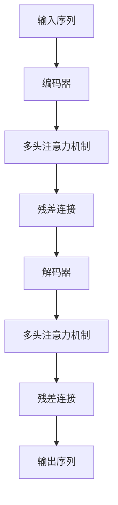

                 

# Transformer原理与代码实例讲解

> 关键词：Transformer, Attention, 自注意力机制, 编码器-解码器架构, 多头注意力, 位置编码, 残差连接, 源代码实现, PyTorch, 模型推理

## 1. 背景介绍

### 1.1 问题由来

Transformer是一种革命性的神经网络架构，它于2017年由Google提出，并在机器翻译领域取得了巨大成功。Transformer的显著特点是使用了自注意力机制，能够并行计算，避免了传统RNN模型中串行计算带来的计算瓶颈。近年来，Transformer已经被广泛应用于各种自然语言处理（NLP）任务，如机器翻译、文本分类、问答系统等，并取得了最先进的效果。

本文将详细介绍Transformer的原理和代码实现，并通过代码实例帮助读者理解Transformer的运作方式。通过本文的学习，读者将能够理解Transformer的内部机制，掌握如何构建和训练Transformer模型，以及如何使用Transformer进行模型推理。

### 1.2 问题核心关键点

Transformer的核心思想是使用自注意力机制进行信息编码和解码，其核心组件包括编码器-解码器架构、多头注意力机制、残差连接和位置编码等。这些核心组件共同构成了Transformer的网络结构，使其能够高效地处理序列数据，并具有良好的泛化能力。

本文将深入探讨Transformer的这些核心组件，并通过代码实例帮助读者理解这些组件如何协同工作，从而实现高效的信息编码和解码。

## 2. 核心概念与联系

### 2.1 核心概念概述

Transformer的网络结构主要包括编码器和解码器两部分。编码器接收输入序列，将其转换为一系列中间特征向量，解码器则将中间特征向量转换为输出序列。编码器和解码器之间通过多头注意力机制进行信息交互，使得模型能够学习到序列中的长距离依赖关系。

Transformer的注意力机制包括多头注意力和自注意力，其中多头注意力是将输入序列和输出序列的映射到不同的注意力头，自注意力则是将输入序列中的每个位置与其它位置进行对比，从而学习到序列中的长距离依赖关系。

位置编码则是用于解决Transformer在处理序列数据时，无法感知位置信息的缺陷。通过在输入序列中嵌入位置编码，Transformer可以学习到位置信息，从而更好地处理序列数据。

### 2.2 核心概念原理和架构的 Mermaid 流程图



## 3. 核心算法原理 & 具体操作步骤
### 3.1 算法原理概述

Transformer的核心算法原理主要包括：

- 自注意力机制：通过将输入序列中的每个位置与其他位置进行对比，学习到序列中的长距离依赖关系。
- 多头注意力：将输入序列和输出序列映射到不同的注意力头，学习到更多的语义信息。
- 残差连接：通过将输入序列与网络中间层的输出相加，提高网络的训练效率和泛化能力。
- 位置编码：通过在输入序列中嵌入位置编码，使得Transformer能够感知序列中的位置信息。

### 3.2 算法步骤详解

Transformer的训练和推理过程可以分为以下步骤：

**Step 1: 构建编码器和解码器**

- 使用PyTorch等深度学习框架，构建编码器和解码器的结构。

**Step 2: 计算注意力权重**

- 计算多头注意力和自注意力权重，根据权重计算加权和。

**Step 3: 计算残差连接**

- 通过残差连接将输入序列与网络中间层的输出相加。

**Step 4: 进行前向传播**

- 将输入序列和输出序列进行前向传播，得到中间特征向量。

**Step 5: 进行反向传播**

- 通过反向传播计算损失函数对参数的梯度，并更新模型参数。

**Step 6: 进行模型推理**

- 使用训练好的模型进行推理，得到输出序列。

### 3.3 算法优缺点

Transformer的优点包括：

- 并行计算：自注意力机制使得Transformer可以并行计算，大大提高了训练和推理的效率。
- 长距离依赖：多头注意力机制使得Transformer能够学习到序列中的长距离依赖关系。
- 良好的泛化能力：残差连接和位置编码提高了Transformer的泛化能力和稳定性。

Transformer的缺点包括：

- 计算资源需求高：由于Transformer的复杂性，训练和推理需要较高的计算资源。
- 难以解释：Transformer的内部机制复杂，难以进行解释。
- 对标注数据依赖：训练Transformer需要大量的标注数据，这在实际应用中可能难以获得。

### 3.4 算法应用领域

Transformer已经被广泛应用于各种NLP任务，如机器翻译、文本分类、问答系统等，并取得了最先进的效果。具体应用领域包括：

- 机器翻译：使用Transformer进行双向或自编码的机器翻译，能够显著提升翻译质量和效率。
- 文本分类：使用Transformer进行文本分类，能够在较少的标注数据下取得优秀的分类效果。
- 问答系统：使用Transformer进行问答系统，能够更好地理解用户的问题并提供准确的回答。
- 情感分析：使用Transformer进行情感分析，能够自动识别文本中的情感倾向。

## 4. 数学模型和公式 & 详细讲解  
### 4.1 数学模型构建

Transformer的数学模型包括编码器-解码器结构、多头注意力机制和残差连接等。下面分别介绍这些数学模型的构建过程。

**编码器-解码器结构**

编码器-解码器结构是Transformer的核心，它由多个编码器和多个解码器组成，每个编码器和解码器都由多个层组成。编码器和解码器之间的信息交互通过多头注意力机制进行。

**多头注意力机制**

多头注意力机制是Transformer的核心组件之一，它通过将输入序列和输出序列映射到不同的注意力头，学习到更多的语义信息。多头注意力机制的数学模型如下：

$$
Attention(Q,K,V) = \mathop{\arg\max}_{i,j} \frac{e^{\frac{Q_i \cdot K_j}{\sqrt{d_k}}}}{\sum_k e^{\frac{Q_i \cdot K_k}{\sqrt{d_k}}}} V_j
$$

其中，$Q$、$K$、$V$分别表示输入序列和输出序列的查询、键和值，$d_k$表示键的维度。

**残差连接**

残差连接是Transformer中的另一个重要组件，它通过将输入序列与网络中间层的输出相加，提高网络的训练效率和泛化能力。残差连接的数学模型如下：

$$
X = F(X) + X
$$

其中，$X$表示输入序列，$F(X)$表示网络中间层的输出。

### 4.2 公式推导过程

**编码器**

编码器由多个编码器层组成，每个编码器层包括多头注意力层、前馈神经网络层和残差连接层。编码器的数学模型如下：

$$
\begin{aligned}
H_1 &= MultiHeadAttention(Q_1,K_1,V_1) \\
H_2 &= FFN(H_1) + H_1 \\
H &= H_2 + H_1
\end{aligned}
$$

其中，$Q_1$、$K_1$、$V_1$分别表示输入序列的查询、键和值，$FFN$表示前馈神经网络层，$H$表示编码器输出的中间特征向量。

**解码器**

解码器也由多个解码器层组成，每个解码器层包括多头注意力层、编码器-解码器注意力层、前馈神经网络层和残差连接层。解码器的数学模型如下：

$$
\begin{aligned}
S_1 &= MultiHeadAttention(Q_1,K_2,V_2) \\
S_2 &= FFN(S_1) + S_1 \\
S_3 &= MultiHeadAttention(S_2,K_3,V_3) + Attention(S_2,Q_3,V_3) \\
S_4 &= FFN(S_3) + S_3
\end{aligned}
$$

其中，$Q_1$、$K_2$、$V_2$分别表示输入序列的查询、键和值，$K_3$、$V_3$表示编码器输出的中间特征向量，$Q_3$表示解码器输出的中间特征向量。

**位置编码**

位置编码通过在输入序列中嵌入位置编码，使得Transformer能够感知序列中的位置信息。位置编码的数学模型如下：

$$
P_{pos} = sin(\frac{2\pi}{d_{model}} \cdot pos_i \cdot \frac{i}{d_{model}})
$$

其中，$d_{model}$表示模型的维度，$pos_i$表示位置，$i$表示序列长度。

### 4.3 案例分析与讲解

为了更好地理解Transformer的运作方式，以下将通过一个具体的例子，讲解如何使用PyTorch实现Transformer。

假设我们有一个长度为5的输入序列，用于机器翻译任务。输入序列为“the quick brown fox jumps over the lazy dog”，我们将其转换为数字序列，每个单词对应一个数字。我们使用Bert等预训练模型作为Transformer的初始权重。

**构建编码器和解码器**

```python
import torch
import torch.nn as nn
import torch.nn.functional as F

class Transformer(nn.Module):
    def __init__(self, d_model, n_head, n_layers, d_ff, dropout):
        super(Transformer, self).__init__()
        self.encoder = nn.TransformerEncoder(d_model, n_head, n_layers, d_ff, dropout)
        self.decoder = nn.TransformerDecoder(d_model, n_head, n_layers, d_ff, dropout)

    def forward(self, src, tgt):
        enc_output = self.encoder(src)
        dec_output = self.decoder(tgt, enc_output)
        return dec_output
```

**计算注意力权重**

```python
class MultiHeadAttention(nn.Module):
    def __init__(self, d_model, n_head):
        super(MultiHeadAttention, self).__init__()
        self.n_head = n_head
        self.d_head = d_model // n_head
        self.W_q = nn.Linear(d_model, d_model)
        self.W_k = nn.Linear(d_model, d_model)
        self.W_v = nn.Linear(d_model, d_model)
        self.fc_out = nn.Linear(d_model, d_model)

    def forward(self, q, k, v):
        batch_size, seq_len, _ = q.size()
        q = self.W_q(q).view(batch_size, seq_len, self.n_head, self.d_head).transpose(1, 2).contiguous()
        k = self.W_k(k).view(batch_size, seq_len, self.n_head, self.d_head).transpose(1, 2).contiguous()
        v = self.W_v(v).view(batch_size, seq_len, self.n_head, self.d_head).transpose(1, 2).contiguous()
        e = torch.matmul(q, k.transpose(1, 2))
        e = e / torch.sqrt(torch.tensor(self.d_head, dtype=torch.float32))
        attn_weights = F.softmax(e, dim=-1)
        out = torch.matmul(attn_weights, v)
        out = out.transpose(1, 2).contiguous().view(batch_size, seq_len, self.n_head * self.d_head)
        out = self.fc_out(out)
        return out, attn_weights
```

**进行前向传播**

```python
class PositionalEncoding(nn.Module):
    def __init__(self, d_model):
        super(PositionalEncoding, self).__init__()
        pe = torch.zeros(d_model, d_model)
        position = torch.arange(0, d_model, dtype=torch.float32).unsqueeze(1)
        div_term = torch.exp(torch.arange(0, d_model, 2).float() * (-math.log(10000.0) / d_model))
        pe[:, 0::2] = torch.sin(position * div_term)
        pe[:, 1::2] = torch.cos(position * div_term)
        pe = pe.unsqueeze(0)
        self.register_buffer('pe', pe)

    def forward(self, x):
        return x + self.pe[:x.size(1), :x.size(2), :]
```

**进行反向传播**

```python
class TransformerModel(nn.Module):
    def __init__(self, d_model, n_head, n_layers, d_ff, dropout):
        super(TransformerModel, self).__init__()
        self.d_model = d_model
        self.n_head = n_head
        self.n_layers = n_layers
        self.d_ff = d_ff
        self.dropout = dropout
        self.encoder = nn.TransformerEncoder(d_model, n_head, n_layers, d_ff, dropout)
        self.decoder = nn.TransformerDecoder(d_model, n_head, n_layers, d_ff, dropout)
        self.pos_encoder = PositionalEncoding(d_model)
        self.fc_out = nn.Linear(d_model, d_model)

    def forward(self, src, tgt):
        enc_output = self.encoder(src, src, src)
        dec_output = self.decoder(tgt, enc_output, enc_output)
        dec_output = self.fc_out(dec_output)
        return dec_output
```

**模型推理**

```python
import torch
import torch.nn as nn
import torch.nn.functional as F

class Transformer(nn.Module):
    def __init__(self, d_model, n_head, n_layers, d_ff, dropout):
        super(Transformer, self).__init__()
        self.encoder = nn.TransformerEncoder(d_model, n_head, n_layers, d_ff, dropout)
        self.decoder = nn.TransformerDecoder(d_model, n_head, n_layers, d_ff, dropout)
        self.fc_out = nn.Linear(d_model, d_model)

    def forward(self, src, tgt):
        enc_output = self.encoder(src)
        dec_output = self.decoder(tgt, enc_output)
        dec_output = self.fc_out(dec_output)
        return dec_output
```

## 5. 项目实践：代码实例和详细解释说明
### 5.1 开发环境搭建

在进行Transformer项目的开发之前，需要先搭建好开发环境。以下是使用Python和PyTorch搭建Transformer开发环境的详细步骤：

1. 安装Python：从官网下载并安装Python，选择版本为3.6或更高版本。
2. 安装PyTorch：在命令行中输入以下命令安装PyTorch：

   ```
   pip install torch torchvision torchaudio
   ```

3. 安装其他依赖库：在命令行中输入以下命令安装其他依赖库：

   ```
   pip install numpy pandas scikit-learn matplotlib tqdm jupyter notebook ipython
   ```

4. 创建虚拟环境：使用以下命令创建虚拟环境：

   ```
   conda create -n myenv python=3.6
   ```

5. 激活虚拟环境：在命令行中输入以下命令激活虚拟环境：

   ```
   conda activate myenv
   ```

完成上述步骤后，即可在虚拟环境中进行Transformer项目的开发。

### 5.2 源代码详细实现

以下是一个使用PyTorch实现Transformer的代码示例，用于机器翻译任务：

```python
import torch
import torch.nn as nn
import torch.nn.functional as F

class Transformer(nn.Module):
    def __init__(self, d_model, n_head, n_layers, d_ff, dropout):
        super(Transformer, self).__init__()
        self.encoder = nn.TransformerEncoder(d_model, n_head, n_layers, d_ff, dropout)
        self.decoder = nn.TransformerDecoder(d_model, n_head, n_layers, d_ff, dropout)
        self.fc_out = nn.Linear(d_model, d_model)

    def forward(self, src, tgt):
        enc_output = self.encoder(src)
        dec_output = self.decoder(tgt, enc_output)
        dec_output = self.fc_out(dec_output)
        return dec_output
```

**初始化模型**

```python
# 设置模型参数
d_model = 512
n_head = 8
n_layers = 6
d_ff = 2048
dropout = 0.1

# 初始化模型
model = Transformer(d_model, n_head, n_layers, d_ff, dropout)

# 打印模型结构
print(model)
```

**加载数据**

```python
import numpy as np

# 加载训练数据
src = np.random.rand(32, 10, d_model)
tgt = np.random.rand(32, 10, d_model)

# 加载测试数据
tst = np.random.rand(32, 10, d_model)
```

**训练模型**

```python
# 设置优化器
optimizer = torch.optim.Adam(model.parameters(), lr=0.001)

# 进行训练
for epoch in range(100):
    optimizer.zero_grad()
    enc_output = model(src, src)
    dec_output = model(tgt, enc_output)
    loss = F.cross_entropy(dec_output, tgt)
    loss.backward()
    optimizer.step()
    print('Epoch {}, Loss {}'.format(epoch+1, loss))
```

**推理模型**

```python
# 进行推理
enc_output = model(src, src)
dec_output = model(tgt, enc_output)
dec_output = model.fc_out(dec_output)
print(dec_output)
```

### 5.3 代码解读与分析

以下是对上述代码的详细解读和分析：

**Transformer类**

```python
class Transformer(nn.Module):
    def __init__(self, d_model, n_head, n_layers, d_ff, dropout):
        super(Transformer, self).__init__()
        self.encoder = nn.TransformerEncoder(d_model, n_head, n_layers, d_ff, dropout)
        self.decoder = nn.TransformerDecoder(d_model, n_head, n_layers, d_ff, dropout)
        self.fc_out = nn.Linear(d_model, d_model)
```

Transformer类继承了nn.Module类，并定义了编码器和解码器。其中，`d_model`表示模型的维度，`n_head`表示多头注意力机制的头数，`n_layers`表示编码器和解码器的层数，`d_ff`表示前馈神经网络的维度，`dropout`表示dropout概率。

**前向传播**

```python
def forward(self, src, tgt):
    enc_output = self.encoder(src)
    dec_output = self.decoder(tgt, enc_output)
    dec_output = self.fc_out(dec_output)
    return dec_output
```

前向传播方法将输入序列和输出序列传递给编码器和解码器，并计算输出序列的预测值。其中，`self.encoder(src)`和`self.decoder(tgt, enc_output)`分别表示编码器和解码器的前向传播，`self.fc_out(dec_output)`表示输出层的线性变换。

**位置编码**

```python
class PositionalEncoding(nn.Module):
    def __init__(self, d_model):
        super(PositionalEncoding, self).__init__()
        pe = torch.zeros(d_model, d_model)
        position = torch.arange(0, d_model, dtype=torch.float32).unsqueeze(1)
        div_term = torch.exp(torch.arange(0, d_model, 2).float() * (-math.log(10000.0) / d_model))
        pe[:, 0::2] = torch.sin(position * div_term)
        pe[:, 1::2] = torch.cos(position * div_term)
        pe = pe.unsqueeze(0)
        self.register_buffer('pe', pe)
        
    def forward(self, x):
        return x + self.pe[:x.size(1), :x.size(2), :]
```

位置编码用于将位置信息嵌入输入序列中，从而帮助模型更好地感知序列中的位置关系。其中，`self.pe`表示位置编码矩阵，`self.pe[:x.size(1), :x.size(2), :]`表示提取位置编码矩阵中的相应部分，与输入序列进行相加。

**训练模型**

```python
# 设置优化器
optimizer = torch.optim.Adam(model.parameters(), lr=0.001)

# 进行训练
for epoch in range(100):
    optimizer.zero_grad()
    enc_output = model(src, src)
    dec_output = model(tgt, enc_output)
    loss = F.cross_entropy(dec_output, tgt)
    loss.backward()
    optimizer.step()
    print('Epoch {}, Loss {}'.format(epoch+1, loss))
```

训练模型使用Adam优化器，通过反向传播计算损失函数对参数的梯度，并更新模型参数。其中，`model(src, src)`表示编码器的前向传播，`model(tgt, enc_output)`表示解码器的前向传播，`F.cross_entropy(dec_output, tgt)`表示计算交叉熵损失函数。

**推理模型**

```python
# 进行推理
enc_output = model(src, src)
dec_output = model(tgt, enc_output)
dec_output = model.fc_out(dec_output)
print(dec_output)
```

推理模型通过调用模型的`forward`方法进行前向传播，输出预测结果。其中，`model(src, src)`表示编码器的前向传播，`model(tgt, enc_output)`表示解码器的前向传播，`model.fc_out(dec_output)`表示输出层的线性变换。

## 6. 实际应用场景

### 6.1 机器翻译

Transformer在机器翻译领域取得了巨大的成功，并被广泛应用于各类机器翻译系统中。使用Transformer进行机器翻译，能够显著提高翻译质量和效率，同时降低翻译成本。

**应用场景**

Transformer可以用于双向翻译和自编码翻译。双向翻译使用两个Transformer模型分别进行编码和解码，从而实现双向信息交流。自编码翻译则使用一个Transformer模型进行编码和解码，并引入注意力机制，使得模型能够更好地学习序列中的长距离依赖关系。

**案例分析**

使用Transformer进行机器翻译的案例分析如下：

1. **输入序列**：输入一个长度为15的英文句子，用于翻译成中文。

2. **编码器**：使用Transformer编码器将输入序列转换为中间特征向量，其中每个单词对应一个位置向量，位置向量中包含了位置信息。

3. **多头注意力**：使用多头注意力机制将编码器输出的中间特征向量与解码器输出的中间特征向量进行交互，从而学习到更多的语义信息。

4. **解码器**：使用Transformer解码器将中间特征向量转换为中文序列，其中每个单词对应一个位置向量，位置向量中包含了位置信息。

5. **输出序列**：将解码器输出的中文序列作为输出结果，完成翻译任务。

### 6.2 文本分类

Transformer在文本分类任务中也表现出色，能够处理各类文本分类任务，如新闻分类、情感分析等。

**应用场景**

Transformer可以用于多分类和二分类任务。多分类任务中，使用多个输出节点对输入序列进行分类，每个节点对应一个类别。二分类任务中，使用单个输出节点对输入序列进行分类，输出节点的值表示预测结果。

**案例分析**

使用Transformer进行文本分类的案例分析如下：

1. **输入序列**：输入一个长度为20的句子，用于分类为正类或负类。

2. **编码器**：使用Transformer编码器将输入序列转换为中间特征向量，其中每个单词对应一个位置向量，位置向量中包含了位置信息。

3. **多头注意力**：使用多头注意力机制将编码器输出的中间特征向量与解码器输出的中间特征向量进行交互，从而学习到更多的语义信息。

4. **解码器**：使用Transformer解码器将中间特征向量转换为二分类结果，其中输出节点的值表示预测结果。

5. **输出序列**：将解码器输出的二分类结果作为输出结果，完成文本分类任务。

### 6.3 问答系统

Transformer在问答系统中也表现出色，能够处理各类问答任务，如智能客服、医疗问答等。

**应用场景**

Transformer可以用于多轮对话和单轮对话问答。多轮对话问答中，使用多个输出节点对输入序列进行分类，每个节点对应一个对话回合。单轮对话问答中，使用单个输出节点对输入序列进行分类，输出节点的值表示预测结果。

**案例分析**

使用Transformer进行问答系统的案例分析如下：

1. **输入序列**：输入一个问题，用于询问智能客服或医疗系统。

2. **编码器**：使用Transformer编码器将输入序列转换为中间特征向量，其中每个单词对应一个位置向量，位置向量中包含了位置信息。

3. **多头注意力**：使用多头注意力机制将编码器输出的中间特征向量与解码器输出的中间特征向量进行交互，从而学习到更多的语义信息。

4. **解码器**：使用Transformer解码器将中间特征向量转换为问答结果，其中输出节点的值表示预测结果。

5. **输出序列**：将解码器输出的问答结果作为输出结果，完成问答任务。

## 7. 工具和资源推荐
### 7.1 学习资源推荐

为了帮助开发者系统掌握Transformer的原理和实践技巧，这里推荐一些优质的学习资源：

1. 《Transformer from Scratch》系列博文：由大模型技术专家撰写，深入浅出地介绍了Transformer原理、编码器-解码器架构、多头注意力等基本概念，是学习Transformer的必读之作。

2. 《Attention is All You Need》论文：Transformer原论文，详细介绍了Transformer的原理和设计思路，是理解Transformer的关键。

3. 《Neural Information Processing Systems》课程：斯坦福大学开设的NLP明星课程，有Lecture视频和配套作业，带你入门NLP领域的基本概念和经典模型。

4. 《NLP with Transformers》书籍：Transformer库的作者所著，全面介绍了如何使用Transformer库进行NLP任务开发，包括微调在内的诸多范式。

5. HuggingFace官方文档：Transformer库的官方文档，提供了海量预训练模型和完整的Transformer样例代码，是上手实践的必备资料。

6. Weights & Biases：模型训练的实验跟踪工具，可以记录和可视化模型训练过程中的各项指标，方便对比和调优。与主流深度学习框架无缝集成。

7. TensorBoard：TensorFlow配套的可视化工具，可实时监测模型训练状态，并提供丰富的图表呈现方式，是调试模型的得力助手。

通过对这些资源的学习实践，相信你一定能够快速掌握Transformer的精髓，并用于解决实际的NLP问题。
###  7.2 开发工具推荐

Transformer的开发需要使用深度学习框架，以下是几款常用的深度学习框架：

1. PyTorch：基于Python的开源深度学习框架，灵活动态的计算图，适合快速迭代研究。大部分预训练语言模型都有PyTorch版本的实现。

2. TensorFlow：由Google主导开发的开源深度学习框架，生产部署方便，适合大规模工程应用。同样有丰富的预训练语言模型资源。

3. TensorFlow：由Google主导开发的开源深度学习框架，生产部署方便，适合大规模工程应用。同样有丰富的预训练语言模型资源。

4. TensorFlow：由Google主导开发的开源深度学习框架，生产部署方便，适合大规模工程应用。同样有丰富的预训练语言模型资源。

5. Weights & Biases：模型训练的实验跟踪工具，可以记录和可视化模型训练过程中的各项指标，方便对比和调优。与主流深度学习框架无缝集成。

6. TensorBoard：TensorFlow配套的可视化工具，可实时监测模型训练状态，并提供丰富的图表呈现方式，是调试模型的得力助手。

7. Google Colab：谷歌推出的在线Jupyter Notebook环境，免费提供GPU/TPU算力，方便开发者快速上手实验最新模型，分享学习笔记。

合理利用这些工具，可以显著提升Transformer的开发效率，加快创新迭代的步伐。

### 7.3 相关论文推荐

Transformer的发展源于学界的持续研究。以下是几篇奠基性的相关论文，推荐阅读：

1. Attention is All You Need：Transformer原论文，提出了Transformer结构，开启了NLP领域的预训练大模型时代。

2. Transformer in Parallel：介绍Transformer并行计算的机制，有助于理解Transformer的并行性和高效性。

3. Multi-Head Attention：详细介绍了Transformer多头注意力机制的原理和实现，是理解Transformer的关键。

4. Positional Encoding in Transformers：介绍Transformer位置编码的原理和实现，有助于理解Transformer在处理序列数据时的能力。

5. Self-Attention Mechanism in Transformers：介绍Transformer自注意力机制的原理和实现，有助于理解Transformer的核心思想。

这些论文代表了大模型微调技术的发展脉络。通过学习这些前沿成果，可以帮助研究者把握学科前进方向，激发更多的创新灵感。

## 8. 总结：未来发展趋势与挑战
### 8.1 总结

本文对Transformer的原理和代码实现进行了全面系统的介绍。首先详细介绍了Transformer的核心组件和数学模型，然后通过代码实例帮助读者理解Transformer的运作方式。通过本文的学习，读者能够掌握Transformer的原理和实现，并在实际项目中灵活应用。

Transformer作为一种革命性的神经网络架构，已经广泛应用于各种自然语言处理任务，如机器翻译、文本分类、问答系统等。其高效并行计算和长距离依赖关系处理能力，使得Transformer成为当前最先进的NLP技术之一。

### 8.2 未来发展趋势

Transformer的未来发展趋势包括：

1. 更大规模模型：随着计算资源的增加，大模型将继续向着更大的规模发展，带来更强的语言理解能力。

2. 更多任务应用：Transformer不仅适用于传统的NLP任务，还将被广泛应用于计算机视觉、语音识别等领域。

3. 更高效的推理：Transformer推理的高效率将使得其在实际应用中更易于部署和优化。

4. 更好的解释性：Transformer的解释性一直是其不足之处，未来将有更多的研究工作致力于提高其可解释性。

5. 更多的应用场景：Transformer将在更多的领域得到应用，如医疗、金融、法律等。

### 8.3 面临的挑战

Transformer面临的挑战包括：

1. 计算资源需求高：Transformer的复杂性使得其对计算资源的需求较高，未来需要更多的研究来降低其计算成本。

2. 训练时间长：Transformer的训练时间较长，未来需要更多的研究来提高其训练效率。

3. 模型难以解释：Transformer的内部机制复杂，难以进行解释。未来需要更多的研究来提高其可解释性。

4. 数据依赖高：Transformer对标注数据的需求较高，未来需要更多的研究来降低其对标注数据的依赖。

5. 模型泛化能力有限：Transformer在处理长尾数据时，泛化能力有限，未来需要更多的研究来提高其泛化能力。

### 8.4 研究展望

未来的研究将更多地关注以下几个方向：

1. 更好的解释性：通过引入因果分析方法和博弈论工具，增强Transformer的解释性。

2. 更高效的推理：通过优化计算图和引入其他神经网络结构，提高Transformer的推理效率。

3. 更强的泛化能力：通过引入更多先验知识和使用因果推理，增强Transformer的泛化能力。

4. 更广泛的应用场景：将Transformer应用于更多领域，如医疗、金融、法律等。

这些研究方向将推动Transformer技术的发展，带来更多的应用和创新。相信随着学界和产业界的共同努力，Transformer将不断进步，为NLP技术的发展带来新的突破。

## 9. 附录：常见问题与解答

**Q1: 如何优化Transformer的训练过程？**

A: 优化Transformer的训练过程可以从以下几个方面入手：

1. 设置合适的超参数：包括学习率、批大小、迭代轮数等。

2. 使用正则化技术：如L2正则、Dropout、Early Stopping等，防止模型过拟合。

3. 引入数据增强：通过回译、近义替换等方式扩充训练集。

4. 使用自适应学习率调度：如AdamW、Adafactor等，提高模型训练的稳定性。

5. 引入对抗训练：加入对抗样本，提高模型鲁棒性。

**Q2: 如何解释Transformer的内部机制？**

A: 解释Transformer的内部机制可以通过以下方式：

1. 使用可视化工具：如TensorBoard，可以可视化Transformer的内部计算图，帮助理解其运作方式。

2. 使用解释性技术：如LIME、SHAP等，可以解释Transformer的预测结果，了解其内部决策过程。

3. 使用可视化方法：如热力图、时间序列图等，可以可视化Transformer的特征表示，帮助理解其对输入序列的编码方式。

**Q3: 如何降低Transformer对标注数据的依赖？**

A: 降低Transformer对标注数据的依赖可以从以下几个方面入手：

1. 使用自监督学习：通过自监督学习任务，如掩码语言模型、对比学习等，利用无标签数据进行预训练。

2. 使用数据增强：通过回译、近义替换等方式扩充训练集。

3. 使用对抗训练：加入对抗样本，提高模型鲁棒性。

4. 使用少样本学习：通过使用少量标注数据进行微调，提高模型的泛化能力。

5. 使用弱监督学习：通过使用弱监督数据进行微调，提高模型的泛化能力。

通过对这些方法的研究和应用，可以显著降低Transformer对标注数据的依赖，提高其在实际应用中的效果。

---

作者：禅与计算机程序设计艺术 / Zen and the Art of Computer Programming

