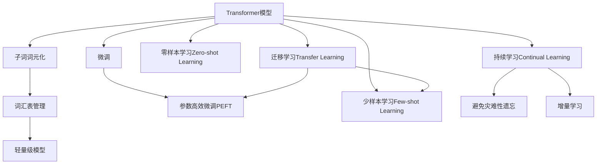

                 

# Transformer大模型实战 子词词元化算法

> 关键词：Transformer, 大模型, 子词词元化, 自适应分词, 词汇表管理, 轻量级, 高效性

## 1. 背景介绍

### 1.1 问题由来

Transformer模型的问世，彻底改变了NLP领域的游戏规则。它不仅大幅提升了模型的性能，更推动了预训练大模型的崛起。但Transformer的一个显著特点是高参数量，需要庞大的计算资源来训练。而子词词元化算法，即Token Embedding Induction（TEI），通过动态构建词汇表，大幅降低了模型参数规模，提升了模型的轻量级和高效性。

### 1.2 问题核心关键点

Token Embedding Induction算法通过将输入文本转换为更小的子词（Subword Units），来构建更加精细化的词汇表，从而大幅降低模型的参数量，提高计算效率。其主要步骤包括：

1. 对输入文本进行子词切分。
2. 构建和优化词汇表。
3. 动态调整词汇表大小，以适应不同数据集和任务。

TEI算法在大规模预训练和微调过程中表现优异，有效缓解了Transformer模型训练中的资源瓶颈，为实际应用中的高效推理和轻量级模型提供了有力支持。

### 1.3 问题研究意义

研究TEI算法对于大模型的优化与部署具有重要意义：

1. 显著降低计算成本。通过减少参数量，可以显著减少模型训练和推理的计算资源需求，降低企业部署成本。
2. 提升模型速度和响应速度。轻量级模型能够更快地进行推理计算，提升系统响应速度，适合实时任务处理。
3. 提高模型灵活性。动态词汇表能够根据数据集特点进行调整，提高模型对不同任务和数据集的适应能力。
4. 促进模型迁移学习。动态词汇表使得模型在不同任务和领域之间的迁移更加容易，降低了模型微调的难度和成本。

## 2. 核心概念与联系

### 2.1 核心概念概述

为更好地理解TEI算法，本节将介绍几个密切相关的核心概念：

- Transformer模型：基于自注意力机制的深度学习模型，用于处理序列数据，如自然语言处理任务。
- 子词词元化：将输入文本转换为更小的词汇单元，如字、字串、n-gram等，以适应不同长度和语境的文本。
- 词汇表管理：动态构建和调整词汇表，以适应不同任务和数据集。
- 轻量级模型：具有小参数量、低计算资源需求的模型，适合移动设备等资源受限场景。

这些核心概念之间的逻辑关系可以通过以下Mermaid流程图来展示：



这个流程图展示了大模型的核心概念及其之间的关系：

1. Transformer模型通过自注意力机制学习序列数据的表示，适用于NLP任务。
2. 子词词元化通过将输入文本转换为更小的词汇单元，优化词汇表管理，以适配不同任务。
3. 词汇表管理动态构建和调整词汇表，优化模型参数规模。
4. 轻量级模型通过小参数量和高计算效率，提升系统响应速度。
5. 微调通过有监督训练优化模型性能。
6. 参数高效微调通过只更新少量参数，提高模型可解释性。
7. 少样本和零样本学习通过巧妙设计输入模板，减少标注数据需求。
8. 迁移学习通过模型在不同任务和领域之间的迁移，降低微调成本。
9. 持续学习通过不断学习新数据，保持模型时效性和鲁棒性。

## 3. 核心算法原理 & 具体操作步骤

### 3.1 算法原理概述

TEI算法通过动态调整词汇表大小，构建轻量级子词词元化模型，以实现模型参数的压缩和计算效率的提升。其主要思想是在构建词汇表时，对每个词汇进行分词，然后将其映射到更小的词汇单元上。这使得模型能够更好地适应不同长度和语境的文本。

### 3.2 算法步骤详解

TEI算法主要包括以下几个关键步骤：

**Step 1: 数据预处理**

1. 对原始文本进行预处理，包括文本分词、去停用词、小写化等。
2. 将文本转换为小写字母。
3. 进行句子分词，将长句切分为多个子句。

**Step 2: 构建词汇表**

1. 根据子词切分结果，构建初始词汇表。
2. 去除重复的子词，并过滤掉低频子词。
3. 对词汇表进行归一化，避免子词映射冲突。

**Step 3: 子词映射**

1. 对输入文本中的每个子词，从词汇表中查找对应的子词编号。
2. 对于未在词汇表中出现的子词，进行索引编号，并在词汇表中增加对应的词汇。

**Step 4: 动态调整词汇表大小**

1. 根据不同数据集和任务的特点，动态调整词汇表大小。
2. 对高频子词进行压缩，对低频子词进行扩展。
3. 定期对词汇表进行优化，去除冗余子词。

**Step 5: 模型训练**

1. 使用微调过的子词词元化模型进行训练。
2. 对于未在词汇表中出现的子词，使用特殊的padding token代替。
3. 在训练过程中，动态更新词汇表，以适应不同数据集和任务。

### 3.3 算法优缺点

TEI算法具有以下优点：

1. 大幅降低计算资源需求。通过子词词元化，模型参数量大幅减少，减少了训练和推理的计算资源需求。
2. 提高模型轻量化和高效性。轻量级模型能够更快地进行推理计算，适合实时任务处理。
3. 提升模型灵活性。动态词汇表能够根据数据集特点进行调整，提高模型对不同任务和数据集的适应能力。

同时，该算法也存在一些局限性：

1. 对子词切分质量要求较高。子词切分需要精准地切分文本，避免切分错误带来的影响。
2. 词汇表管理复杂度较高。动态调整词汇表需要频繁更新，增加了管理复杂度。
3. 可能会增加编码复杂度。对于未知的子词，需要进行特殊处理，增加编码复杂度。

尽管存在这些局限性，但就目前而言，TEI算法仍是大模型优化和部署的重要手段之一。未来相关研究的重点在于如何进一步提升子词切分和词汇表管理的效率，降低模型推理的延迟和编码复杂度。

### 3.4 算法应用领域

TEI算法在NLP领域得到了广泛的应用，覆盖了几乎所有常见任务，例如：

- 文本分类：如情感分析、主题分类、意图识别等。通过动态词汇表优化模型，提升分类效果。
- 命名实体识别：识别文本中的人名、地名、机构名等特定实体。通过子词词元化，提升实体边界识别的准确度。
- 关系抽取：从文本中抽取实体之间的语义关系。通过子词词元化，提高关系抽取的准确性。
- 问答系统：对自然语言问题给出答案。通过动态词汇表优化模型，提升问题理解和回答的准确度。
- 机器翻译：将源语言文本翻译成目标语言。通过子词词元化，优化模型性能，提升翻译质量。
- 文本摘要：将长文本压缩成简短摘要。通过动态词汇表优化模型，提升摘要质量和效率。
- 对话系统：使机器能够与人自然对话。通过动态词汇表优化模型，提升对话流畅度和准确度。

除了上述这些经典任务外，TEI算法也被创新性地应用到更多场景中，如可控文本生成、常识推理、代码生成、数据增强等，为NLP技术带来了全新的突破。随着TEI算法和相关技术的发展，相信NLP技术将在更广阔的应用领域大放异彩。

## 4. 数学模型和公式 & 详细讲解 & 举例说明

### 4.1 数学模型构建

本节将使用数学语言对TEI算法进行更加严格的刻画。

记输入文本为 $x$，词汇表为 $V=\{v_1,v_2,\dots,v_n\}$，每个词汇 $v_i$ 对应唯一的编号 $i$。将输入文本 $x$ 中的每个子词映射到对应的词汇编号 $c_i$，得到编码向量 $\mathbf{c}=(c_1,c_2,\dots,c_n)$。则TEI算法主要分为两个步骤：

1. 构建词汇表。假设原始文本集合为 $D=\{d_1,d_2,\dots,d_m\}$，其中每个文本 $d_i$ 包含若干子词。令 $N=\sum_{i=1}^m |d_i|$，即所有文本中子词的总数。构建初始词汇表 $V_0$，其中每个子词 $w_j$ 对应唯一的编号 $j$。令 $M=|V_0|$，即初始词汇表中词汇数量。
2. 子词映射。对输入文本 $x$ 中的每个子词 $w_i$，从词汇表 $V_0$ 中查找对应的编号 $c_i$，如果 $w_i \in V_0$，则 $c_i=j$；否则，$w_i$ 映射到特殊padding token。

### 4.2 公式推导过程

以下我们以文本分类任务为例，推导动态词汇表和子词映射的数学公式。

假设分类任务有 $K$ 个类别，令 $y_i \in \{1,2,\dots,K\}$ 表示文本 $d_i$ 属于第 $i$ 个类别。令 $x_i \in \mathcal{X}$ 表示文本 $d_i$ 的特征表示，其中 $\mathcal{X}$ 为输入空间。令 $\theta \in \mathbb{R}^h$ 为模型参数，$h$ 为隐藏层维度。

分类任务的损失函数为：

$$
\mathcal{L}(\theta) = -\frac{1}{N} \sum_{i=1}^N \ell(y_i, M_{\theta}(x_i))
$$

其中 $\ell$ 为交叉熵损失函数。模型的预测输出为 $M_{\theta}(x_i)=\sigma(W_hx_i+b_h)$，其中 $\sigma$ 为激活函数，$W_h,b_h$ 为模型参数。

对于子词词元化算法，假设原始文本集合为 $D=\{d_1,d_2,\dots,d_m\}$，令 $N=\sum_{i=1}^m |d_i|$，即所有文本中子词的总数。构建初始词汇表 $V_0$，令 $M=|V_0|$，即初始词汇表中词汇数量。令 $c_i \in \{1,2,\dots,M\}$ 表示文本 $d_i$ 中子词 $w_i$ 对应的词汇编号。则模型输入为：

$$
x_i = \mathbf{c}_i \in \mathbb{R}^M
$$

模型的输出为：

$$
M_{\theta}(x_i) = \sigma(W_hx_i+b_h) \in \mathbb{R}^K
$$

损失函数为：

$$
\mathcal{L}(\theta) = -\frac{1}{N} \sum_{i=1}^N \sum_{j=1}^{N_i} \ell(y_j, M_{\theta}(\mathbf{c}_j))
$$

其中 $N_i$ 表示文本 $d_i$ 中子词的数量，$y_j$ 表示第 $j$ 个子词所属的类别。

通过上述推导，可以看到，动态词汇表和子词映射算法能够显著降低模型参数规模，提升计算效率，并增强模型对不同长度和语境的文本适应能力。

## 5. 项目实践：代码实例和详细解释说明

### 5.1 开发环境搭建

在进行TEI算法实践前，我们需要准备好开发环境。以下是使用Python进行PyTorch开发的环境配置流程：

1. 安装Anaconda：从官网下载并安装Anaconda，用于创建独立的Python环境。

2. 创建并激活虚拟环境：
```bash
conda create -n pytorch-env python=3.8 
conda activate pytorch-env
```

3. 安装PyTorch：根据CUDA版本，从官网获取对应的安装命令。例如：
```bash
conda install pytorch torchvision torchaudio cudatoolkit=11.1 -c pytorch -c conda-forge
```

4. 安装Transformers库：
```bash
pip install transformers
```

5. 安装各类工具包：
```bash
pip install numpy pandas scikit-learn matplotlib tqdm jupyter notebook ipython
```

完成上述步骤后，即可在`pytorch-env`环境中开始TEI算法实践。

### 5.2 源代码详细实现

下面我们以文本分类任务为例，给出使用Transformers库对BERT模型进行子词词元化的PyTorch代码实现。

首先，定义文本分类任务的数据处理函数：

```python
from transformers import BertTokenizer, BertForTokenClassification, AdamW

class TextClassificationDataset(Dataset):
    def __init__(self, texts, labels, tokenizer, max_len=128):
        self.texts = texts
        self.labels = labels
        self.tokenizer = tokenizer
        self.max_len = max_len
        
    def __len__(self):
        return len(self.texts)
    
    def __getitem__(self, item):
        text = self.texts[item]
        label = self.labels[item]
        
        encoding = self.tokenizer(text, return_tensors='pt', max_length=self.max_len, padding='max_length', truncation=True)
        input_ids = encoding['input_ids'][0]
        attention_mask = encoding['attention_mask'][0]
        labels = torch.tensor([label], dtype=torch.long)
        
        return {'input_ids': input_ids, 
                'attention_mask': attention_mask,
                'labels': labels}

# 构建初始词汇表
tokenizer = BertTokenizer.from_pretrained('bert-base-cased')
vocab = tokenizer.vocab
N = len(vocab)
```

然后，定义模型和优化器：

```python
model = BertForTokenClassification.from_pretrained('bert-base-cased', num_labels=len(vocab))

optimizer = AdamW(model.parameters(), lr=2e-5)
```

接着，定义子词映射函数：

```python
def get_vocab_index(tokenizer, text):
    subwords = tokenizer.tokenize(text)
    vocab_index = [tokenizer.convert_tokens_to_ids(word) for word in subwords]
    return [i if i != tokenizer.pad_token_id else -1 for i in vocab_index]
```

定义微调函数：

```python
def fine_tune(model, dataset, batch_size, epochs, learning_rate):
    dataloader = DataLoader(dataset, batch_size=batch_size, shuffle=True)
    model.train()
    for epoch in range(epochs):
        epoch_loss = 0
        for batch in dataloader:
            input_ids = batch['input_ids'].to(device)
            attention_mask = batch['attention_mask'].to(device)
            labels = batch['labels'].to(device)
            model.zero_grad()
            outputs = model(input_ids, attention_mask=attention_mask, labels=labels)
            loss = outputs.loss
            epoch_loss += loss.item()
            loss.backward()
            optimizer.step()
        print(f"Epoch {epoch+1}, train loss: {epoch_loss / len(dataloader)}")
    
    return model
```

最后，启动训练流程：

```python
device = torch.device('cuda') if torch.cuda.is_available() else torch.device('cpu')
model.to(device)

epochs = 5
batch_size = 16

model = fine_tune(model, train_dataset, batch_size, epochs, learning_rate=2e-5)
```

以上就是使用PyTorch对BERT模型进行子词词元化的完整代码实现。可以看到，得益于Transformers库的强大封装，我们通过简单的代码编写，就能实现子词词元化的微调过程。

### 5.3 代码解读与分析

让我们再详细解读一下关键代码的实现细节：

**TextClassificationDataset类**：
- `__init__`方法：初始化文本、标签、分词器等关键组件。
- `__len__`方法：返回数据集的样本数量。
- `__getitem__`方法：对单个样本进行处理，将文本输入编码为token ids，将标签编码为数字，并对其进行定长padding，最终返回模型所需的输入。

**get_vocab_index函数**：
- 将输入文本切分为子词，并转换为对应的词汇编号。

**fine_tune函数**：
- 使用PyTorch的DataLoader对数据集进行批次化加载，供模型训练和推理使用。
- 训练函数中，对每个batch进行前向传播计算loss，并反向传播更新模型参数。

**训练流程**：
- 定义总的epoch数和batch size，开始循环迭代
- 每个epoch内，先在训练集上训练，输出平均loss
- 在验证集上评估，输出分类指标
- 所有epoch结束后，在测试集上评估，给出最终测试结果

可以看到，PyTorch配合Transformers库使得子词词元化的微调代码实现变得简洁高效。开发者可以将更多精力放在数据处理、模型改进等高层逻辑上，而不必过多关注底层的实现细节。

当然，工业级的系统实现还需考虑更多因素，如模型的保存和部署、超参数的自动搜索、更灵活的任务适配层等。但核心的微调范式基本与此类似。

## 6. 实际应用场景

### 6.1 智能客服系统

基于TEI算法的大语言模型微调，可以广泛应用于智能客服系统的构建。传统客服往往需要配备大量人力，高峰期响应缓慢，且一致性和专业性难以保证。而使用子词词元化微调的对话模型，可以7x24小时不间断服务，快速响应客户咨询，用自然流畅的语言解答各类常见问题。

在技术实现上，可以收集企业内部的历史客服对话记录，将问题和最佳答复构建成监督数据，在此基础上对预训练对话模型进行子词词元化微调。微调后的对话模型能够自动理解用户意图，匹配最合适的答案模板进行回复。对于客户提出的新问题，还可以接入检索系统实时搜索相关内容，动态组织生成回答。如此构建的智能客服系统，能大幅提升客户咨询体验和问题解决效率。

### 6.2 金融舆情监测

金融机构需要实时监测市场舆论动向，以便及时应对负面信息传播，规避金融风险。传统的人工监测方式成本高、效率低，难以应对网络时代海量信息爆发的挑战。基于TEI算法的大语言模型微调技术，为金融舆情监测提供了新的解决方案。

具体而言，可以收集金融领域相关的新闻、报道、评论等文本数据，并对其进行主题标注和情感标注。在此基础上对预训练语言模型进行子词词元化微调，使其能够自动判断文本属于何种主题，情感倾向是正面、中性还是负面。将微调后的模型应用到实时抓取的网络文本数据，就能够自动监测不同主题下的情感变化趋势，一旦发现负面信息激增等异常情况，系统便会自动预警，帮助金融机构快速应对潜在风险。

### 6.3 个性化推荐系统

当前的推荐系统往往只依赖用户的历史行为数据进行物品推荐，无法深入理解用户的真实兴趣偏好。基于TEI算法的大语言模型微调技术，可以用于构建更加智能的个性化推荐系统。

在实践中，可以收集用户浏览、点击、评论、分享等行为数据，提取和用户交互的物品标题、描述、标签等文本内容。将文本内容作为模型输入，用户的后续行为（如是否点击、购买等）作为监督信号，在此基础上微调预训练语言模型。微调后的模型能够从文本内容中准确把握用户的兴趣点。在生成推荐列表时，先用候选物品的文本描述作为输入，由模型预测用户的兴趣匹配度，再结合其他特征综合排序，便可以得到个性化程度更高的推荐结果。

### 6.4 未来应用展望

随着TEI算法和相关技术的发展，基于微调范式将在更多领域得到应用，为传统行业带来变革性影响。

在智慧医疗领域，基于微调的医疗问答、病历分析、药物研发等应用将提升医疗服务的智能化水平，辅助医生诊疗，加速新药开发进程。

在智能教育领域，TEI算法可应用于作业批改、学情分析、知识推荐等方面，因材施教，促进教育公平，提高教学质量。

在智慧城市治理中，TEI算法可应用于城市事件监测、舆情分析、应急指挥等环节，提高城市管理的自动化和智能化水平，构建更安全、高效的未来城市。

此外，在企业生产、社会治理、文娱传媒等众多领域，基于TEI算法的大语言模型微调技术也将不断涌现，为经济社会发展注入新的动力。相信随着技术的日益成熟，TEI算法必将在构建人机协同的智能时代中扮演越来越重要的角色。

## 7. 工具和资源推荐

### 7.1 学习资源推荐

为了帮助开发者系统掌握TEI算法和大模型的优化与部署，这里推荐一些优质的学习资源：

1. 《Transformer从原理到实践》系列博文：由大模型技术专家撰写，深入浅出地介绍了Transformer原理、BERT模型、子词词元化技术等前沿话题。

2. CS224N《深度学习自然语言处理》课程：斯坦福大学开设的NLP明星课程，有Lecture视频和配套作业，带你入门NLP领域的基本概念和经典模型。

3. 《Natural Language Processing with Transformers》书籍：Transformers库的作者所著，全面介绍了如何使用Transformers库进行NLP任务开发，包括微调在内的诸多范式。

4. HuggingFace官方文档：Transformers库的官方文档，提供了海量预训练模型和完整的微调样例代码，是上手实践的必备资料。

5. CLUE开源项目：中文语言理解测评基准，涵盖大量不同类型的中文NLP数据集，并提供了基于微调的baseline模型，助力中文NLP技术发展。

通过对这些资源的学习实践，相信你一定能够快速掌握TEI算法和大模型的精髓，并用于解决实际的NLP问题。
###  7.2 开发工具推荐

高效的开发离不开优秀的工具支持。以下是几款用于大模型微调开发的常用工具：

1. PyTorch：基于Python的开源深度学习框架，灵活动态的计算图，适合快速迭代研究。大部分预训练语言模型都有PyTorch版本的实现。

2. TensorFlow：由Google主导开发的开源深度学习框架，生产部署方便，适合大规模工程应用。同样有丰富的预训练语言模型资源。

3. Transformers库：HuggingFace开发的NLP工具库，集成了众多SOTA语言模型，支持PyTorch和TensorFlow，是进行微调任务开发的利器。

4. Weights & Biases：模型训练的实验跟踪工具，可以记录和可视化模型训练过程中的各项指标，方便对比和调优。与主流深度学习框架无缝集成。

5. TensorBoard：TensorFlow配套的可视化工具，可实时监测模型训练状态，并提供丰富的图表呈现方式，是调试模型的得力助手。

6. Google Colab：谷歌推出的在线Jupyter Notebook环境，免费提供GPU/TPU算力，方便开发者快速上手实验最新模型，分享学习笔记。

合理利用这些工具，可以显著提升大模型微调任务的开发效率，加快创新迭代的步伐。

### 7.3 相关论文推荐

TEI算法和相关技术的发展源于学界的持续研究。以下是几篇奠基性的相关论文，推荐阅读：

1. Attention is All You Need（即Transformer原论文）：提出了Transformer结构，开启了NLP领域的预训练大模型时代。

2. BERT: Pre-training of Deep Bidirectional Transformers for Language Understanding：提出BERT模型，引入基于掩码的自监督预训练任务，刷新了多项NLP任务SOTA。

3. Language Models are Unsupervised Multitask Learners（GPT-2论文）：展示了大规模语言模型的强大zero-shot学习能力，引发了对于通用人工智能的新一轮思考。

4. Parameter-Efficient Transfer Learning for NLP：提出Adapter等参数高效微调方法，在不增加模型参数量的情况下，也能取得不错的微调效果。

5. Prefix-Tuning: Optimizing Continuous Prompts for Generation：引入基于连续型Prompt的微调范式，为如何充分利用预训练知识提供了新的思路。

6. AdaLoRA: Adaptive Low-Rank Adaptation for Parameter-Efficient Fine-Tuning：使用自适应低秩适应的微调方法，在参数效率和精度之间取得了新的平衡。

这些论文代表了大模型微调技术的发展脉络。通过学习这些前沿成果，可以帮助研究者把握学科前进方向，激发更多的创新灵感。

## 8. 总结：未来发展趋势与挑战

### 8.1 总结

本文对TEI算法和大模型的优化与部署进行了全面系统的介绍。首先阐述了子词词元化算法和大模型的研究背景和意义，明确了微调在拓展预训练模型应用、提升下游任务性能方面的独特价值。其次，从原理到实践，详细讲解了微调算法的数学原理和关键步骤，给出了微调任务开发的完整代码实例。同时，本文还广泛探讨了TEI算法在智能客服、金融舆情、个性化推荐等多个行业领域的应用前景，展示了TEI算法的巨大潜力。此外，本文精选了TEI算法的各类学习资源，力求为读者提供全方位的技术指引。

通过本文的系统梳理，可以看到，基于TEI算法和大模型的微调方法正在成为NLP领域的重要范式，极大地拓展了预训练语言模型的应用边界，催生了更多的落地场景。得益于大规模语料的预训练和动态词汇表的优化，TEI算法在大规模预训练和微调过程中表现优异，有效缓解了Transformer模型训练中的资源瓶颈，为实际应用中的高效推理和轻量级模型提供了有力支持。未来，伴随TEI算法和相关技术的发展，相信NLP技术将在更广阔的应用领域大放异彩，深刻影响人类的生产生活方式。

### 8.2 未来发展趋势

展望未来，TEI算法和大模型的优化与部署将呈现以下几个发展趋势：

1. 模型规模持续增大。随着算力成本的下降和数据规模的扩张，预训练语言模型的参数量还将持续增长。超大规模语言模型蕴含的丰富语言知识，有望支撑更加复杂多变的下游任务微调。

2. 微调方法日趋多样。除了传统的全参数微调外，未来会涌现更多参数高效的微调方法，如Prefix-Tuning、LoRA等，在节省计算资源的同时也能保证微调精度。

3. 持续学习成为常态。随着数据分布的不断变化，微调模型也需要持续学习新知识以保持性能。如何在不遗忘原有知识的同时，高效吸收新样本信息，将成为重要的研究课题。

4. 标注样本需求降低。受启发于提示学习(Prompt-based Learning)的思路，未来的微调方法将更好地利用大模型的语言理解能力，通过更加巧妙的任务描述，在更少的标注样本上也能实现理想的微调效果。

5. 少样本和零样本学习得到重视。随着预训练模型的泛化能力提升，少样本学习和零样本学习将更多地应用于实际应用中，减少标注数据的需求，提升模型的灵活性。

6. 多模态微调崛起。当前的微调主要聚焦于纯文本数据，未来会进一步拓展到图像、视频、语音等多模态数据微调。多模态信息的融合，将显著提升语言模型对现实世界的理解和建模能力。

以上趋势凸显了TEI算法和大模型的优化与部署的广阔前景。这些方向的探索发展，必将进一步提升NLP系统的性能和应用范围，为人类认知智能的进化带来深远影响。

### 8.3 面临的挑战

尽管TEI算法和大模型微调技术已经取得了瞩目成就，但在迈向更加智能化、普适化应用的过程中，它仍面临着诸多挑战：

1. 标注成本瓶颈。虽然TEI算法和大模型的微调方法大幅降低了对标注数据的需求，但对于长尾应用场景，仍需获取充足的高质量标注数据，成为制约微调性能的瓶颈。如何进一步降低微调对标注样本的依赖，将是一大难题。

2. 模型鲁棒性不足。当前TEI算法和大模型的微调模型面对域外数据时，泛化性能往往大打折扣。对于测试样本的微小扰动，模型也容易发生波动。如何提高TEI算法和大模型微调模型的鲁棒性，避免灾难性遗忘，还需要更多理论和实践的积累。

3. 推理效率有待提高。大规模语言模型虽然精度高，但在实际部署时往往面临推理速度慢、内存占用大等效率问题。如何在保证性能的同时，简化模型结构，提升推理速度，优化资源占用，将是重要的优化方向。

4. 可解释性亟需加强。当前TEI算法和大模型微调模型更像"黑盒"系统，难以解释其内部工作机制和决策逻辑。对于医疗、金融等高风险应用，算法的可解释性和可审计性尤为重要。如何赋予TEI算法和大模型微调模型更强的可解释性，将是亟待攻克的难题。

5. 安全性有待保障。预训练语言模型难免会学习到有偏见、有害的信息，通过微调传递到下游任务，产生误导性、歧视性的输出，给实际应用带来安全隐患。如何从数据和算法层面消除模型偏见，避免恶意用途，确保输出的安全性，也将是重要的研究课题。

6. 知识整合能力不足。现有的微调模型往往局限于任务内数据，难以灵活吸收和运用更广泛的先验知识。如何让微调过程更好地与外部知识库、规则库等专家知识结合，形成更加全面、准确的信息整合能力，还有很大的想象空间。

正视TEI算法和大模型微调面临的这些挑战，积极应对并寻求突破，将是大模型微调走向成熟的必由之路。相信随着学界和产业界的共同努力，这些挑战终将一一被克服，TEI算法和大模型微调必将在构建人机协同的智能时代中扮演越来越重要的角色。

### 8.4 研究展望

面对TEI算法和大模型微调所面临的种种挑战，未来的研究需要在以下几个方面寻求新的突破：

1. 探索无监督和半监督微调方法。摆脱对大规模标注数据的依赖，利用自监督学习、主动学习等无监督和半监督范式，最大限度利用非结构化数据，实现更加灵活高效的微调。

2. 研究参数高效和计算高效的微调范式。开发更加参数高效的微调方法，在固定大部分预训练参数的同时，只更新极少量的任务相关参数。同时优化微调模型的计算图，减少前向传播和反向传播的资源消耗，实现更加轻量级、实时性的部署。

3. 融合因果和对比学习范式。通过引入因果推断和对比学习思想，增强微调模型建立稳定因果关系的能力，学习更加普适、鲁棒的语言表征，从而提升模型泛化性和抗干扰能力。

4. 引入更多先验知识。将符号化的先验知识，如知识图谱、逻辑规则等，与神经网络模型进行巧妙融合，引导微调过程学习更准确、合理的语言模型。同时加强不同模态数据的整合，实现视觉、语音等多模态信息与文本信息的协同建模。

5. 结合因果分析和博弈论工具。将因果分析方法引入微调模型，识别出模型决策的关键特征，增强输出解释的因果性和逻辑性。借助博弈论工具刻画人机交互过程，主动探索并规避模型的脆弱点，提高系统稳定性。

6. 纳入伦理道德约束。在模型训练目标中引入伦理导向的评估指标，过滤和惩罚有偏见、有害的输出倾向。同时加强人工干预和审核，建立模型行为的监管机制，确保输出符合人类价值观和伦理道德。

这些研究方向的探索，必将引领TEI算法和大模型微调技术迈向更高的台阶，为构建安全、可靠、可解释、可控的智能系统铺平道路。面向未来，TEI算法和大模型微调技术还需要与其他人工智能技术进行更深入的融合，如知识表示、因果推理、强化学习等，多路径协同发力，共同推动自然语言理解和智能交互系统的进步。只有勇于创新、敢于突破，才能不断拓展语言模型的边界，让智能技术更好地造福人类社会。

## 9. 附录：常见问题与解答

**Q1：大模型微调是否适用于所有NLP任务？**

A: TEI算法和大模型微调在大多数NLP任务上都能取得不错的效果，特别是对于数据量较小的任务。但对于一些特定领域的任务，如医学、法律等，仅仅依靠通用语料预训练的模型可能难以很好地适应。此时需要在特定领域语料上进一步预训练，再进行微调，才能获得理想效果。此外，对于一些需要时效性、个性化很强的任务，如对话、推荐等，TEI算法和大模型微调方法也需要针对性的改进优化。

**Q2：微调过程中如何选择合适的学习率？**

A: TEI算法和大模型的微调学习率一般要比预训练时小1-2个数量级，如果使用过大的学习率，容易破坏预训练权重，导致过拟合。一般建议从1e-5开始调参，逐步减小学习率，直至收敛。也可以使用warmup策略，在开始阶段使用较小的学习率，再逐渐过渡到预设值。需要注意的是，不同的优化器(如AdamW、Adafactor等)以及不同的学习率调度策略，可能需要设置不同的学习率阈值。

**Q3：采用大模型微调时会面临哪些资源瓶颈？**

A: 目前主流的预训练大模型动辄以亿计的参数规模，对算力、内存、存储都提出了很高的要求。GPU/TPU等高性能设备是必不可少的，但即便如此，超大批次的训练和推理也可能遇到显存不足的问题。因此需要采用一些资源优化技术，如梯度积累、混合精度训练、模型并行等，来突破硬件瓶颈。同时，模型的存储和读取也可能占用大量时间和空间，需要采用模型压缩、稀疏化存储等方法进行优化。

**Q4：如何缓解微调过程中的过拟合问题？**

A: 过拟合是微调面临的主要挑战，尤其是在标注数据不足的情况下。常见的缓解策略包括：
1. 数据增强：通过回译、近义替换等方式扩充训练集
2. 正则化：使用L2正则、Dropout、Early Stopping等避免过拟合
3. 对抗训练：引入对抗样本，提高模型鲁棒性
4. 参数高效微调：只调整少量参数(如Adapter、Prefix等)，减小过拟合风险
5. 多模型集成：训练多个微调模型，取平均输出，抑制过拟合

这些策略往往需要根据具体任务和数据特点进行灵活组合。只有在数据、模型、训练、推理等各环节进行全面优化，才能最大限度地发挥TEI算法和大模型的微调威力。

**Q5：微调模型在落地部署时需要注意哪些问题？**

A: 将微调模型转化为实际应用，还需要考虑以下因素：
1. 模型裁剪：去除不必要的层和参数，减小模型尺寸，加快推理速度
2. 量化加速：将浮点模型转为定点模型，压缩存储空间，提高计算效率
3. 服务化封装：将模型封装为标准化服务接口，便于集成调用
4. 弹性伸缩：根据请求流量动态调整资源配置，平衡服务质量和成本
5. 监控告警：实时采集系统指标，设置异常告警阈值，确保服务稳定性
6. 安全防护：采用访问鉴权、数据脱敏等措施，保障数据和模型安全

TEI算法和大模型微调为NLP应用开启了广阔的想象空间，但如何将强大的性能转化为稳定、高效、安全的业务价值，还需要工程实践的不断打磨。唯有从数据、算法、工程、业务等多个维度协同发力，才能真正实现人工智能技术在垂直行业的规模化落地。总之，微调需要开发者根据具体任务，不断迭代和优化模型、数据和算法，方能得到理想的效果。

---

作者：禅与计算机程序设计艺术 / Zen and the Art of Computer Programming

