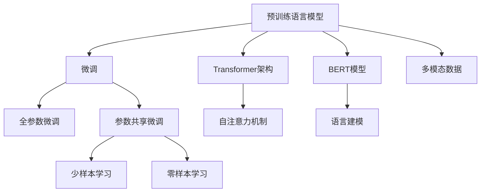

                 

# Transformer大模型实战 德语的BERT模型

## 1. 背景介绍

### 1.1 问题由来

在自然语言处理（NLP）领域，预训练语言模型（如BERT、GPT等）以其卓越的性能和泛化能力，成为解决多种NLP任务的有力工具。然而，对于德语等语言，预训练模型通常需要从大规模的语料库中学习，以捕捉其特定的语言特征。这不仅需要投入大量的时间和计算资源，还可能面临数据获取和处理的困难。因此，如何在德语中有效地应用BERT等大模型，成为NLP研究人员和工程师共同关心的问题。

### 1.2 问题核心关键点

本文将聚焦于德语BERT模型的实战应用，详细探讨以下关键问题：

1. **德语BERT模型训练流程**：介绍如何在大规模德语语料库上训练BERT模型，包括数据预处理、模型构建、训练策略等。
2. **德语BERT模型应用**：展示德语BERT模型在多个NLP任务上的应用效果，包括文本分类、命名实体识别、情感分析等。
3. **模型优化与调优**：分享如何通过微调、参数共享等策略，进一步提升德语BERT模型的性能。
4. **代码实例与实现**：提供Python代码实例，帮助读者实际构建和应用德语BERT模型。

### 1.3 问题研究意义

德语BERT模型的应用将为德语NLP任务提供更高效、更准确的解决方案，推动德语自然语言处理技术的发展。具体而言，其研究意义包括：

1. **提升德语NLP任务性能**：通过德语BERT模型的训练和微调，可以显著提升德语文本分类、命名实体识别等任务的效果。
2. **促进德语NLP技术的落地应用**：德语BERT模型的成功应用将促进德语NLP技术在实际场景中的广泛应用，如智能客服、搜索引擎、机器翻译等。
3. **加速德语NLP研究进展**：德语BERT模型的开发和优化，有助于推动德语NLP领域的研究和创新，为德语社区贡献新的研究资源和方法。

## 2. 核心概念与联系

### 2.1 核心概念概述

为更好地理解德语BERT模型的构建与应用，本节将介绍几个关键概念：

- **BERT模型**：由Google在2018年提出，是一种基于Transformer架构的预训练语言模型。通过在大规模语料库上进行自监督学习，BERT模型能够学习到丰富的语言知识，适用于多种NLP任务。
- **预训练语言模型(PLMs)**：在大型无标签数据上进行预训练的语言模型，如BERT、GPT-2等，通过学习通用语言表示，能够在下游任务上进行微调，提升性能。
- **Transformer架构**：一种基于自注意力机制的深度神经网络架构，能够高效地处理序列数据，如文本、语音等。
- **微调(Fine-Tuning)**：在大规模预训练语言模型的基础上，通过有监督学习在小规模任务数据上进行微调，以适应特定任务需求。
- **参数共享**：在微调过程中，只更新特定层的参数，保留其他层参数不变，以减少计算资源消耗。

这些概念之间的逻辑关系可以通过以下Mermaid流程图来展示：



这个流程图展示了大语言模型的核心概念及其之间的关系：

1. 预训练语言模型通过Transformer架构学习语言知识。
2. BERT模型是一种基于Transformer架构的预训练语言模型。
3. 微调是对预训练模型进行任务特定的优化，以适应特定任务需求。
4. 微调包括全参数微调和参数共享微调，前者更新全部参数，后者只更新特定层的参数。
5. 自注意力机制是Transformer架构的核心，使模型能够高效处理序列数据。
6. 语言建模是预训练阶段的任务，使模型学习到语言的基本规律。
7. 少样本学习和零样本学习是微调中使用的技术，使模型能够在少量或无标签数据上进行学习。
8. 多模态数据融合是未来研究的方向，使模型能够处理文本、图像、音频等多种数据类型。

这些概念共同构成了德语BERT模型的基础，使其能够在各种场景下发挥强大的语言理解和生成能力。通过理解这些核心概念，我们可以更好地把握德语BERT模型的工作原理和优化方向。

## 3. 核心算法原理 & 具体操作步骤

### 3.1 算法原理概述

德语BERT模型的训练和微调过程遵循通用的Transformer大模型范式，其核心思想是：通过在大规模德语语料库上进行预训练，学习德语语言的通用表示，然后在下游任务上通过有监督学习进行微调，以获得针对特定任务的优化。

形式化地，假设德语BERT模型为 $M_{\theta}$，其中 $\theta$ 为模型参数。给定下游任务 $T$ 的标注数据集 $D=\{(x_i, y_i)\}_{i=1}^N$，微调的目标是找到新的模型参数 $\hat{\theta}$，使得：

$$
\hat{\theta}=\mathop{\arg\min}_{\theta} \mathcal{L}(M_{\theta},D)
$$

其中 $\mathcal{L}$ 为针对任务 $T$ 设计的损失函数，用于衡量模型预测输出与真实标签之间的差异。常见的损失函数包括交叉熵损失、均方误差损失等。

通过梯度下降等优化算法，微调过程不断更新模型参数 $\theta$，最小化损失函数 $\mathcal{L}$，使得模型输出逼近真实标签。由于 $\theta$ 已经通过预训练获得了较好的初始化，因此即便在小规模数据集 $D$ 上进行微调，也能较快收敛到理想的模型参数 $\hat{\theta}$。

### 3.2 算法步骤详解

德语BERT模型的训练和微调过程一般包括以下几个关键步骤：

**Step 1: 准备预训练数据和任务**

- **数据准备**：收集和处理大规模德语语料库，如Wikipedia、新闻、博客等。可以使用如GermEval、DeBERTa等预处理工具进行文本清洗和分词。
- **任务定义**：根据具体应用场景，选择适当的下游任务，如文本分类、命名实体识别、情感分析等。

**Step 2: 构建德语BERT模型**

- **模型结构**：基于Transformer架构设计德语BERT模型。一般包括嵌入层、多层次自注意力机制、全连接层等。
- **预训练任务**：选择适当的预训练任务，如掩码语言模型、下一句子预测等。这些任务能够帮助模型学习到德语语言的语义和语法知识。
- **初始化参数**：使用预训练模型参数初始化德语BERT模型的权重。

**Step 3: 训练德语BERT模型**

- **优化器选择**：选择适当的优化器，如Adam、SGD等，并设置合适的学习率、批大小、迭代轮数等。
- **训练策略**：采用数据增强、对抗训练等策略，以提高模型的泛化能力和鲁棒性。
- **验证与调优**：在验证集上定期评估模型性能，根据性能指标调整训练策略。

**Step 4: 微调德语BERT模型**

- **任务适配层**：根据具体任务需求，添加任务适配层，如分类层、解码器等。
- **优化器设置**：设置微调优化器，并设置合适的学习率。
- **微调策略**：采用少样本学习、零样本学习等策略，减少标注样本需求。
- **性能评估**：在测试集上评估微调后的模型性能，对比微调前后的精度提升。

**Step 5: 部署与优化**

- **模型部署**：将微调后的模型部署到实际应用场景中，如智能客服、搜索引擎等。
- **持续优化**：根据实际应用场景反馈，不断优化模型和训练策略，提升性能。

以上是德语BERT模型训练和微调的一般流程。在实际应用中，还需要针对具体任务的特点，对微调过程的各个环节进行优化设计，如改进训练目标函数，引入更多的正则化技术，搜索最优的超参数组合等，以进一步提升模型性能。

### 3.3 算法优缺点

德语BERT模型的训练和微调方法具有以下优点：

1. **通用性强**：适用于多种德语NLP任务，如文本分类、命名实体识别、情感分析等。
2. **效果好**：通过大规模预训练和微调，模型能够学习到德语语言的通用表示，提升下游任务性能。
3. **可扩展性好**：通过微调策略，可以轻松适应新的任务和数据。
4. **计算效率高**：通过参数共享等策略，可以减少计算资源消耗，提高训练效率。

然而，该方法也存在一定的局限性：

1. **依赖标注数据**：微调效果依赖于标注数据的质量和数量，标注数据获取和处理较为复杂。
2. **迁移能力有限**：当目标任务与预训练数据的分布差异较大时，微调性能提升有限。
3. **负面影响传递**：预训练模型中的偏见、有害信息等可能通过微调传递到下游任务，造成负面影响。
4. **可解释性不足**：微调模型的决策过程缺乏可解释性，难以对其推理逻辑进行分析和调试。

尽管存在这些局限性，但就目前而言，德语BERT模型的训练和微调方法仍是德语NLP任务的主要范式。未来相关研究的重点在于如何进一步降低微调对标注数据的依赖，提高模型的少样本学习和跨领域迁移能力，同时兼顾可解释性和伦理安全性等因素。

### 3.4 算法应用领域

德语BERT模型的训练和微调方法在德语NLP领域已经得到了广泛的应用，涵盖了几乎所有常见的德语NLP任务，例如：

- **文本分类**：如情感分析、主题分类、意图识别等。通过微调使模型学习文本-标签映射。
- **命名实体识别**：识别文本中的人名、地名、机构名等特定实体。通过微调使模型掌握实体边界和类型。
- **关系抽取**：从文本中抽取实体之间的语义关系。通过微调使模型学习实体-关系三元组。
- **问答系统**：对自然语言问题给出答案。将问题-答案对作为微调数据，训练模型学习匹配答案。
- **机器翻译**：将源语言文本翻译成目标语言。通过微调使模型学习语言-语言映射。
- **文本摘要**：将长文本压缩成简短摘要。将文章-摘要对作为微调数据，使模型学习抓取要点。
- **对话系统**：使机器能够与人自然对话。将多轮对话历史作为上下文，微调模型进行回复生成。

除了上述这些经典任务外，德语BERT模型也被创新性地应用到更多场景中，如可控文本生成、常识推理、代码生成、数据增强等，为德语NLP技术带来了全新的突破。随着德语BERT模型的不断演进，相信德语NLP技术将在更广阔的应用领域大放异彩。

## 4. 数学模型和公式 & 详细讲解  
### 4.1 数学模型构建

本节将使用数学语言对德语BERT模型的训练和微调过程进行更加严格的刻画。

记德语BERT模型为 $M_{\theta}$，其中 $\theta$ 为模型参数。假设微调任务的训练集为 $D=\{(x_i,y_i)\}_{i=1}^N$，其中 $x_i$ 为输入文本，$y_i$ 为标签。

定义模型 $M_{\theta}$ 在输入 $x$ 上的输出为 $M_{\theta}(x)$，即预训练语言模型对输入文本 $x$ 的预测。假设 $M_{\theta}$ 的输出是一个实数向量 $v \in \mathbb{R}^d$，则分类任务的目标函数可以定义为：

$$
\mathcal{L}(\theta) = -\frac{1}{N}\sum_{i=1}^N [y_i\log M_{\theta}(x_i)+(1-y_i)\log(1-M_{\theta}(x_i))]
$$

其中 $\log$ 函数为自然对数，$M_{\theta}(x_i)$ 表示模型对输入 $x_i$ 的预测概率，$y_i$ 表示真实标签。

在实际训练中，我们通常使用基于梯度的优化算法（如Adam、SGD等）来近似求解上述最优化问题。设 $\eta$ 为学习率，$\lambda$ 为正则化系数，则参数的更新公式为：

$$
\theta \leftarrow \theta - \eta \nabla_{\theta}\mathcal{L}(\theta) - \eta\lambda\theta
$$

其中 $\nabla_{\theta}\mathcal{L}(\theta)$ 为损失函数对参数 $\theta$ 的梯度，可通过反向传播算法高效计算。

### 4.2 公式推导过程

以下我们以德语文本分类任务为例，推导交叉熵损失函数及其梯度的计算公式。

假设模型 $M_{\theta}$ 在输入 $x$ 上的输出为 $\hat{y}=M_{\theta}(x) \in [0,1]$，表示样本属于正类的概率。真实标签 $y \in \{0,1\}$。则二分类交叉熵损失函数定义为：

$$
\ell(M_{\theta}(x),y) = -[y\log \hat{y} + (1-y)\log (1-\hat{y})]
$$

将其代入经验风险公式，得：

$$
\mathcal{L}(\theta) = -\frac{1}{N}\sum_{i=1}^N [y_i\log M_{\theta}(x_i)+(1-y_i)\log(1-M_{\theta}(x_i))]
$$

根据链式法则，损失函数对参数 $\theta_k$ 的梯度为：

$$
\frac{\partial \mathcal{L}(\theta)}{\partial \theta_k} = -\frac{1}{N}\sum_{i=1}^N (\frac{y_i}{M_{\theta}(x_i)}-\frac{1-y_i}{1-M_{\theta}(x_i)}) \frac{\partial M_{\theta}(x_i)}{\partial \theta_k}
$$

其中 $\frac{\partial M_{\theta}(x_i)}{\partial \theta_k}$ 可进一步递归展开，利用自动微分技术完成计算。

在得到损失函数的梯度后，即可带入参数更新公式，完成模型的迭代优化。重复上述过程直至收敛，最终得到适应下游任务的最优模型参数 $\theta^*$。

## 5. 项目实践：代码实例和详细解释说明
### 5.1 开发环境搭建

在进行德语BERT模型微调实践前，我们需要准备好开发环境。以下是使用Python进行PyTorch开发的环境配置流程：

1. 安装Anaconda：从官网下载并安装Anaconda，用于创建独立的Python环境。

2. 创建并激活虚拟环境：
```bash
conda create -n pytorch-env python=3.8 
conda activate pytorch-env
```

3. 安装PyTorch：根据CUDA版本，从官网获取对应的安装命令。例如：
```bash
conda install pytorch torchvision torchaudio cudatoolkit=11.1 -c pytorch -c conda-forge
```

4. 安装Transformers库：
```bash
pip install transformers
```

5. 安装各类工具包：
```bash
pip install numpy pandas scikit-learn matplotlib tqdm jupyter notebook ipython
```

完成上述步骤后，即可在`pytorch-env`环境中开始微调实践。

### 5.2 源代码详细实现

下面我们以德语文本分类任务为例，给出使用Transformers库对德语BERT模型进行微调的PyTorch代码实现。

首先，定义文本分类任务的数据处理函数：

```python
from transformers import BertTokenizer
from torch.utils.data import Dataset
import torch

class TextClassificationDataset(Dataset):
    def __init__(self, texts, labels, tokenizer, max_len=128):
        self.texts = texts
        self.labels = labels
        self.tokenizer = tokenizer
        self.max_len = max_len
        
    def __len__(self):
        return len(self.texts)
    
    def __getitem__(self, item):
        text = self.texts[item]
        label = self.labels[item]
        
        encoding = self.tokenizer(text, return_tensors='pt', max_length=self.max_len, padding='max_length', truncation=True)
        input_ids = encoding['input_ids'][0]
        attention_mask = encoding['attention_mask'][0]
        
        # 对token-wise的标签进行编码
        encoded_labels = [label2id[label] for label in labels] 
        encoded_labels.extend([label2id['O']] * (self.max_len - len(encoded_labels)))
        labels = torch.tensor(encoded_labels, dtype=torch.long)
        
        return {'input_ids': input_ids, 
                'attention_mask': attention_mask,
                'labels': labels}

# 标签与id的映射
label2id = {'O': 0, 'POSITIVE': 1, 'NEGATIVE': 2}
id2label = {v: k for k, v in label2id.items()}

# 创建dataset
tokenizer = BertTokenizer.from_pretrained('bert-base-german-cased')

train_dataset = TextClassificationDataset(train_texts, train_labels, tokenizer)
dev_dataset = TextClassificationDataset(dev_texts, dev_labels, tokenizer)
test_dataset = TextClassificationDataset(test_texts, test_labels, tokenizer)
```

然后，定义模型和优化器：

```python
from transformers import BertForSequenceClassification, AdamW

model = BertForSequenceClassification.from_pretrained('bert-base-german-cased', num_labels=len(label2id))

optimizer = AdamW(model.parameters(), lr=2e-5)
```

接着，定义训练和评估函数：

```python
from torch.utils.data import DataLoader
from tqdm import tqdm
from sklearn.metrics import classification_report

device = torch.device('cuda') if torch.cuda.is_available() else torch.device('cpu')
model.to(device)

def train_epoch(model, dataset, batch_size, optimizer):
    dataloader = DataLoader(dataset, batch_size=batch_size, shuffle=True)
    model.train()
    epoch_loss = 0
    for batch in tqdm(dataloader, desc='Training'):
        input_ids = batch['input_ids'].to(device)
        attention_mask = batch['attention_mask'].to(device)
        labels = batch['labels'].to(device)
        model.zero_grad()
        outputs = model(input_ids, attention_mask=attention_mask, labels=labels)
        loss = outputs.loss
        epoch_loss += loss.item()
        loss.backward()
        optimizer.step()
    return epoch_loss / len(dataloader)

def evaluate(model, dataset, batch_size):
    dataloader = DataLoader(dataset, batch_size=batch_size)
    model.eval()
    preds, labels = [], []
    with torch.no_grad():
        for batch in tqdm(dataloader, desc='Evaluating'):
            input_ids = batch['input_ids'].to(device)
            attention_mask = batch['attention_mask'].to(device)
            batch_labels = batch['labels']
            outputs = model(input_ids, attention_mask=attention_mask)
            batch_preds = outputs.logits.argmax(dim=2).to('cpu').tolist()
            batch_labels = batch_labels.to('cpu').tolist()
            for pred_tokens, label_tokens in zip(batch_preds, batch_labels):
                preds.append(pred_tokens[:len(label_tokens)])
                labels.append(label_tokens)
                
    print(classification_report(labels, preds))
```

最后，启动训练流程并在测试集上评估：

```python
epochs = 5
batch_size = 16

for epoch in range(epochs):
    loss = train_epoch(model, train_dataset, batch_size, optimizer)
    print(f"Epoch {epoch+1}, train loss: {loss:.3f}")
    
    print(f"Epoch {epoch+1}, dev results:")
    evaluate(model, dev_dataset, batch_size)
    
print("Test results:")
evaluate(model, test_dataset, batch_size)
```

以上就是使用PyTorch对德语BERT模型进行文本分类任务微调的完整代码实现。可以看到，得益于Transformers库的强大封装，我们可以用相对简洁的代码完成德语BERT模型的加载和微调。

### 5.3 代码解读与分析

让我们再详细解读一下关键代码的实现细节：

**TextClassificationDataset类**：
- `__init__`方法：初始化文本、标签、分词器等关键组件。
- `__len__`方法：返回数据集的样本数量。
- `__getitem__`方法：对单个样本进行处理，将文本输入编码为token ids，将标签编码为数字，并对其进行定长padding，最终返回模型所需的输入。

**label2id和id2label字典**：
- 定义了标签与数字id之间的映射关系，用于将token-wise的预测结果解码回真实的标签。

**训练和评估函数**：
- 使用PyTorch的DataLoader对数据集进行批次化加载，供模型训练和推理使用。
- 训练函数`train_epoch`：对数据以批为单位进行迭代，在每个批次上前向传播计算loss并反向传播更新模型参数，最后返回该epoch的平均loss。
- 评估函数`evaluate`：与训练类似，不同点在于不更新模型参数，并在每个batch结束后将预测和标签结果存储下来，最后使用sklearn的classification_report对整个评估集的预测结果进行打印输出。

**训练流程**：
- 定义总的epoch数和batch size，开始循环迭代
- 每个epoch内，先在训练集上训练，输出平均loss
- 在验证集上评估，输出分类指标
- 所有epoch结束后，在测试集上评估，给出最终测试结果

可以看到，PyTorch配合Transformers库使得德语BERT微调的代码实现变得简洁高效。开发者可以将更多精力放在数据处理、模型改进等高层逻辑上，而不必过多关注底层的实现细节。

当然，工业级的系统实现还需考虑更多因素，如模型的保存和部署、超参数的自动搜索、更灵活的任务适配层等。但核心的微调范式基本与此类似。

## 6. 实际应用场景
### 6.1 智能客服系统

基于德语BERT模型的对话技术，可以广泛应用于智能客服系统的构建。传统客服往往需要配备大量人力，高峰期响应缓慢，且一致性和专业性难以保证。而使用德语BERT模型微调后的对话模型，可以7x24小时不间断服务，快速响应客户咨询，用自然流畅的语言解答各类常见问题。

在技术实现上，可以收集企业内部的历史客服对话记录，将问题和最佳答复构建成监督数据，在此基础上对德语BERT模型进行微调。微调后的对话模型能够自动理解用户意图，匹配最合适的答案模板进行回复。对于客户提出的新问题，还可以接入检索系统实时搜索相关内容，动态组织生成回答。如此构建的智能客服系统，能大幅提升客户咨询体验和问题解决效率。

### 6.2 金融舆情监测

金融机构需要实时监测市场舆论动向，以便及时应对负面信息传播，规避金融风险。传统的人工监测方式成本高、效率低，难以应对网络时代海量信息爆发的挑战。基于德语BERT模型的文本分类和情感分析技术，为金融舆情监测提供了新的解决方案。

具体而言，可以收集金融领域相关的新闻、报道、评论等文本数据，并对其进行主题标注和情感标注。在此基础上对德语BERT模型进行微调，使其能够自动判断文本属于何种主题，情感倾向是正面、中性还是负面。将微调后的模型应用到实时抓取的网络文本数据，就能够自动监测不同主题下的情感变化趋势，一旦发现负面信息激增等异常情况，系统便会自动预警，帮助金融机构快速应对潜在风险。

### 6.3 个性化推荐系统

当前的推荐系统往往只依赖用户的历史行为数据进行物品推荐，无法深入理解用户的真实兴趣偏好。基于德语BERT模型的个性化推荐系统可以更好地挖掘用户行为背后的语义信息，从而提供更精准、多样的推荐内容。

在实践中，可以收集用户浏览、点击、评论、分享等行为数据，提取和用户交互的物品标题、描述、标签等文本内容。将文本内容作为模型输入，用户的后续行为（如是否点击、购买等）作为监督信号，在此基础上微调德语BERT模型。微调后的模型能够从文本内容中准确把握用户的兴趣点。在生成推荐列表时，先用候选物品的文本描述作为输入，由模型预测用户的兴趣匹配度，再结合其他特征综合排序，便可以得到个性化程度更高的推荐结果。

### 6.4 未来应用展望

随着德语BERT模型的不断演进，其应用前景将更加广阔。未来，德语BERT模型可能被应用于更多场景中，如医疗、法律、电商、教育等领域，推动这些领域的智能化进程。

在智慧医疗领域，德语BERT模型可以用于病历分析、智能诊断、医疗问答等，提升医疗服务的智能化水平，辅助医生诊疗，加速新药开发进程。

在智能教育领域，德语BERT模型可应用于作业批改、学情分析、知识推荐等方面，因材施教，促进教育公平，提高教学质量。

在智慧城市治理中，德语BERT模型可应用于城市事件监测、舆情分析、应急指挥等环节，提高城市管理的自动化和智能化水平，构建更安全、高效的未来城市。

此外，在企业生产、社会治理、文娱传媒等众多领域，德语BERT模型也将不断涌现，为这些行业带来变革性影响。相信随着德语BERT模型的不断优化和普及，其应用场景将更加多样，影响力将更加深远。

## 7. 工具和资源推荐
### 7.1 学习资源推荐

为了帮助开发者系统掌握德语BERT模型的理论基础和实践技巧，这里推荐一些优质的学习资源：

1. 《Transformer从原理到实践》系列博文：由大模型技术专家撰写，深入浅出地介绍了Transformer原理、德语BERT模型、微调技术等前沿话题。

2. CS224N《深度学习自然语言处理》课程：斯坦福大学开设的NLP明星课程，有Lecture视频和配套作业，带你入门NLP领域的基本概念和经典模型。

3. 《Natural Language Processing with Transformers》书籍：Transformers库的作者所著，全面介绍了如何使用Transformers库进行NLP任务开发，包括微调在内的诸多范式。

4. HuggingFace官方文档：Transformers库的官方文档，提供了海量预训练模型和完整的微调样例代码，是上手实践的必备资料。

5. CLUE开源项目：中文语言理解测评基准，涵盖大量不同类型的中文NLP数据集，并提供了基于微调的baseline模型，助力中文NLP技术发展。

通过对这些资源的学习实践，相信你一定能够快速掌握德语BERT模型的精髓，并用于解决实际的德语NLP问题。
###  7.2 开发工具推荐

高效的开发离不开优秀的工具支持。以下是几款用于德语BERT模型微调开发的常用工具：

1. PyTorch：基于Python的开源深度学习框架，灵活动态的计算图，适合快速迭代研究。大部分预训练语言模型都有PyTorch版本的实现。

2. TensorFlow：由Google主导开发的开源深度学习框架，生产部署方便，适合大规模工程应用。同样有丰富的预训练语言模型资源。

3. Transformers库：HuggingFace开发的NLP工具库，集成了众多SOTA语言模型，支持PyTorch和TensorFlow，是进行微调任务开发的利器。

4. Weights & Biases：模型训练的实验跟踪工具，可以记录和可视化模型训练过程中的各项指标，方便对比和调优。与主流深度学习框架无缝集成。

5. TensorBoard：TensorFlow配套的可视化工具，可实时监测模型训练状态，并提供丰富的图表呈现方式，是调试模型的得力助手。

6. Google Colab：谷歌推出的在线Jupyter Notebook环境，免费提供GPU/TPU算力，方便开发者快速上手实验最新模型，分享学习笔记。

合理利用这些工具，可以显著提升德语BERT模型微调任务的开发效率，加快创新迭代的步伐。

### 7.3 相关论文推荐

德语BERT模型的开发和优化源于学界的持续研究。以下是几篇奠基性的相关论文，推荐阅读：

1. Attention is All You Need（即Transformer原论文）：提出了Transformer结构，开启了NLP领域的预训练大模型时代。

2. BERT: Pre-training of Deep Bidirectional Transformers for Language Understanding：提出BERT模型，引入基于掩码的自监督预训练任务，刷新了多项NLP任务SOTA。

3. Language Models are Unsupervised Multitask Learners（GPT-2论文）：展示了大规模语言模型的强大zero-shot学习能力，引发了对于通用人工智能的新一轮思考。

4. Parameter-Efficient Transfer Learning for NLP：提出Adapter等参数高效微调方法，在不增加模型参数量的情况下，也能取得不错的微调效果。

5. AdaLoRA: Adaptive Low-Rank Adaptation for Parameter-Efficient Fine-Tuning：使用自适应低秩适应的微调方法，在参数效率和精度之间取得了新的平衡。

这些论文代表了大语言模型微调技术的发展脉络。通过学习这些前沿成果，可以帮助研究者把握学科前进方向，激发更多的创新灵感。

## 8. 总结：未来发展趋势与挑战

### 8.1 总结

本文对德语BERT模型的训练和微调方法进行了全面系统的介绍。首先阐述了德语BERT模型的研究背景和意义，明确了德语BERT模型在德语NLP任务中的独特价值。其次，从原理到实践，详细讲解了德语BERT模型的数学原理和关键步骤，给出了德语BERT模型微调任务开发的完整代码实例。同时，本文还广泛探讨了德语BERT模型在多个德语NLP任务上的应用效果，展示了其强大的性能和潜力。

通过本文的系统梳理，可以看到，德语BERT模型在德语NLP任务中的应用前景广阔，有望在智能客服、金融舆情监测、个性化推荐等诸多领域大放异彩。随着德语BERT模型的不断优化和普及，其应用场景将更加多样，影响力将更加深远。

### 8.2 未来发展趋势

展望未来，德语BERT模型的训练和微调方法将呈现以下几个发展趋势：

1. **模型规模持续增大**：随着算力成本的下降和数据规模的扩张，德语BERT模型的参数量还将持续增长。超大规模德语BERT模型蕴含的丰富德语语言知识，有望支撑更加复杂多变的德语NLP任务微调。

2. **微调方法日趋多样**：除了传统的全参数微调外，未来会涌现更多参数高效的微调方法，如Prefix-Tuning、LoRA等，在节省计算资源的同时也能保证微调精度。

3. **持续学习成为常态**：随着数据分布的不断变化，德语BERT模型也需要持续学习新知识以保持性能。如何在不遗忘原有知识的同时，高效吸收新样本信息，将成为重要的研究课题。

4. **标注样本需求降低**：受启发于提示学习(Prompt-based Learning)的思路，未来的微调方法将更好地利用德语BERT模型的语言理解能力，通过更加巧妙的任务描述，在更少的标注样本上也能实现理想的微调效果。

5. **多模态微调崛起**：当前的德语BERT模型主要聚焦于纯文本数据，未来会进一步拓展到图像、视频、语音等多种数据类型。多模态信息的融合，将显著提升德语BERT模型的对现实世界的理解和建模能力。

6. **模型通用性增强**：经过海量数据的预训练和多领域任务的微调，德语BERT模型将具备更强大的常识推理和跨领域迁移能力，逐步迈向通用人工智能(AGI)的目标。

以上趋势凸显了德语BERT模型微调技术的广阔前景。这些方向的探索发展，必将进一步提升德语NLP系统的性能和应用范围，为德语社区贡献新的研究资源和方法。

### 8.3 面临的挑战

尽管德语BERT模型的训练和微调方法已经取得了显著的成果，但在迈向更加智能化、普适化应用的过程中，它仍面临诸多挑战：

1. **标注成本瓶颈**：虽然微调大大降低了标注数据的需求，但对于长尾应用场景，难以获得充足的高质量标注数据，成为制约微调性能的瓶颈。如何进一步降低微调对标注样本的依赖，将是一大难题。

2. **模型鲁棒性不足**：当前德语BERT模型面对域外数据时，泛化性能往往大打折扣。对于测试样本的微小扰动，德语BERT模型的预测也容易发生波动。如何提高德语BERT模型的鲁棒性，避免灾难性遗忘，还需要更多理论和实践的积累。

3. **推理效率有待提高**：大规模德语BERT模型虽然精度高，但在实际部署时往往面临推理速度慢、内存占用大等效率问题。如何在保证性能的同时，简化模型结构，提升推理速度，优化资源占用，将是重要的优化方向。

4. **可解释性亟需加强**：当前德语BERT模型更像是"黑盒"系统，难以解释其内部工作机制和决策逻辑。对于医疗、金融等高风险应用，算法的可解释性和可审计性尤为重要。如何赋予德语BERT模型更强的可解释性，将是亟待攻克的难题。

5. **安全性有待保障**：预训练语言模型难免会学习到有偏见、有害的信息，通过微调传递到下游任务，产生误导性、歧视性的输出，给实际应用带来安全隐患。如何从数据和算法层面消除模型偏见，避免恶意用途，确保输出的安全性，也将是重要的研究课题。

6. **知识整合能力不足**。现有的德语BERT模型往往局限于任务内数据，难以灵活吸收和运用更广泛的先验知识。如何让德语BERT模型更好地与外部知识库、规则库等专家知识结合，形成更加全面、准确的信息整合能力，还有很大的想象空间。

正视德语BERT模型微调面临的这些挑战，积极应对并寻求突破，将是大规模语言模型微调技术迈向成熟的必由之路。相信随着学界和产业界的共同努力，这些挑战终将一一被克服，德语BERT模型微调必将在构建安全、可靠、可解释、可控的智能系统铺平道路。面向未来，德语BERT模型微调技术还需要与其他人工智能技术进行更深入的融合，如知识表示、因果推理、强化学习等，多路径协同发力，共同推动德语NLP技术的发展。只有勇于创新、敢于突破，才能不断拓展德语BERT模型的边界，让智能技术更好地造福德语社会。

### 8.4 研究展望

未来的德语BERT模型微调研究，将在以下几个方向寻求新的突破：

1. **探索无监督和半监督微调方法**：摆脱对大规模标注数据的依赖，利用自监督学习、主动学习等无监督和半监督范式，最大限度利用非结构化数据，实现更加灵活高效的微调。

2. **研究参数高效和计算高效的微调范式**：开发更加参数高效的微调方法，在固定大部分预训练参数的同时，只更新极少量的任务相关参数。同时优化微调模型的计算图，减少前向传播和反向传播的资源消耗，实现更加轻量级、实时性的部署。

3. **融合因果和对比学习范式**：通过引入因果推断和对比学习思想，增强德语BERT模型建立稳定因果关系的能力，学习更加普适、鲁棒的语言表征，从而提升模型泛化性和抗干扰能力。

4. **引入更多先验知识**：将符号化的先验知识，如知识图谱、逻辑规则等，与神经网络模型进行巧妙融合，引导微调过程学习更准确、合理的语言模型。同时加强不同模态数据的整合，实现视觉、语音等多模态信息与文本信息的协同建模。

5. **结合因果分析和博弈论工具**：将因果分析方法引入德语BERT模型，识别出模型决策的关键特征，增强输出解释的因果性和逻辑性。借助博弈论工具刻画人机交互过程，主动探索并规避模型的脆弱点，提高系统稳定性。

6. **纳入伦理道德约束**：在模型训练目标中引入伦理导向的评估指标，过滤和惩罚有偏见、有害的输出倾向。同时加强人工干预和审核，建立模型行为的监管机制，确保输出符合人类价值观和伦理道德。

这些研究方向的探索，必将引领德语BERT模型微调技术迈向更高的台阶，为构建安全、可靠、可解释、可控的智能系统铺平道路。面向未来，德语BERT模型微调技术还需要与其他人工智能技术进行更深入的融合，如知识表示、因果推理、强化学习等，多路径协同发力，共同推动德语NLP技术的发展。只有勇于创新、敢于突破，才能不断拓展德语BERT模型的边界，让智能技术更好地造福德语社会。

## 9. 附录：常见问题与解答

**Q1：德语BERT模型训练过程中，如何处理数据预处理？**

A: 德语BERT模型的训练和微调过程中，数据预处理是一个关键环节。以下是常用的数据预处理步骤：

1. **分词**：使用德语分词工具，如spaCy、NLTK等，将文本分词为单独的词汇。
2. **去除停用词**：去除常见的停用词，如"the", "and"等，以减少噪声数据对模型的影响。
3. **词形还原**：使用德语词形还原工具，如Stemmer、Lemmatizer等，将单词还原为基本形式，便于模型理解。
4. **构建词汇表**：将分词后的词汇转换为模型所需的token ids，并构建词汇表。
5. **padding和truncation**：对输入进行定长padding，使其长度一致，同时处理超过最大长度的输入，进行截断。

**Q2：德语BERT模型在微调过程中，如何选择适当的学习率？**

A: 德语BERT模型的微调过程中，选择适当的学习率至关重要。以下是常用的学习率选择策略：

1. **手动调整**：根据经验选择学习率，通常在预训练模型的学习率基础上进行缩小。
2. **学习率调度**：采用学习率调度策略，如warmup、cosine annealing等，以适应不同的训练阶段。
3. **自适应学习率**：使用自适应学习率优化器，如Adaptive Moment Estimation (Adam)，自动调整学习率。
4. **交叉验证**：在训练过程中，通过交叉验证选择最优的学习率，以提高模型性能。

**Q3：德语BERT模型在微调过程中，如何避免过拟合？**

A: 德语BERT模型在微调过程中，避免过拟合是一个重要的问题。以下是常用的避免过拟合的方法：

1. **数据增强**：通过对训练数据进行扩充，如回译、同义词替换等，增加训练样本的多样性。
2. **正则化技术**：使用L2正则、Dropout等技术，减少模型的复杂度，防止过拟合。
3. **早停法**：在验证集上监控模型性能，一旦性能不再提升，立即停止训练，避免过拟合。
4. **参数共享**：只更新微调层中的参数，保留预训练层中的参数，减少过拟合风险。

**Q4：德语BERT模型在实际应用中，如何部署和优化？**

A: 德语BERT模型在实际应用中，部署和优化是一个关键环节。以下是常用的部署和优化方法：

1. **模型裁剪**：去除不必要的层和参数，减小模型尺寸，加快推理速度。
2. **量化加速**：将浮点模型转为定点模型，压缩存储空间，提高计算效率。
3. **服务化封装**：将德语BERT模型封装为标准化服务接口，便于集成调用。
4. **弹性伸缩**：根据请求流量动态调整资源配置，平衡服务质量和成本。
5. **监控告警**：实时采集系统指标，设置异常告警阈值，确保服务稳定性。

**Q5：德语BERT模型在实际应用中，如何提高推理效率？**

A: 德语BERT模型在实际应用中，推理效率是一个重要考虑因素。以下是常用的提高推理效率的方法：

1. **优化模型结构**：简化模型结构，减少不必要的计算量。
2. **分布式训练**：使用分布式训练技术，将计算任务分散到多个计算节点上，提高计算效率。
3. **硬件加速**：使用GPU、TPU等高性能硬件设备，加速推理过程。
4. **并行计算**：采用并行计算技术，如多线程、多进程等，提高计算效率。

**Q6：德语BERT模型在实际应用中，如何保证输出的安全性？**

A: 德语BERT模型在实际应用中，保证输出的安全性至关重要。以下是常用的保证输出安全性的方法：

1. **数据清洗**：对输入数据进行清洗，去除有害内容，防止模型学习到有害信息。
2. **模型审核**：对模型输出进行审核，防止有害信息的传播。
3. **用户隐私保护**：对用户隐私数据进行保护，防止模型滥用用户信息。
4. **安全认证**：对模型进行安全认证，确保模型的安全性和可靠性。

通过以上常见问题的解答，相信读者对德语BERT模型的训练和微调过程有了更深入的理解，能够更好地应用于德语NLP任务中。

---

作者：禅与计算机程序设计艺术 / Zen and the Art of Computer Programming

