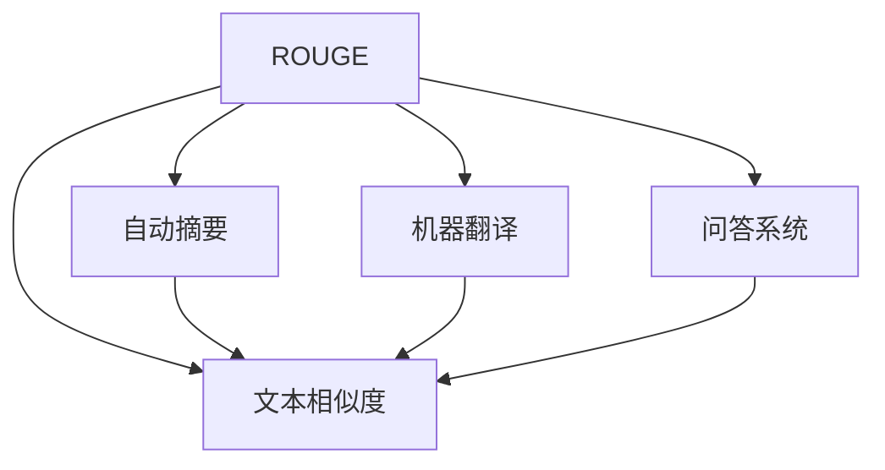

                 

# Transformer大模型实战 理解ROUGE 评估指标

> 关键词：Transformer, ROUGE, 自然语言处理, 自动摘要, 文本相似度, 模型评估

## 1. 背景介绍

### 1.1 问题由来
Transformer模型，作为当前最先进的自然语言处理(NLP)模型，因其出色的性能和效率，被广泛应用于文本生成、文本分类、自动摘要、问答系统等NLP任务中。在实际应用中，为了衡量模型的效果，常常需要评估模型的文本生成质量、文本相似度、文本摘要质量等，其中最常用的一种评估指标就是ROUGE（Retrieval-Oriented Underscore），即检索导向的得分。ROUGE可以衡量两个文本之间的相似度，广泛用于自动摘要、机器翻译、文本匹配等场景的评估。

ROUGE的核心思想是将待评估文本与数据库中的所有文本进行相似度计算，并给出分值，从而判断待评估文本与数据库中相似文本的匹配程度。在实际应用中，ROUGE可以通过调整ROUGE算法中的参数（如重叠字数、匹配字符数等），得到不同粒度的相似度评估。

### 1.2 问题核心关键点
ROUGE评估指标在自然语言处理中具有广泛应用，包括文本相似度计算、自动摘要、机器翻译、问答系统等。理解ROUGE的原理和使用方法，对衡量Transformer模型的性能具有重要意义。

ROUGE的评估方法包括以下几个核心点：
1. 文本相似度计算：通过计算待评估文本与数据库中所有文本的相似度，得出每个文本的得分。
2. 分值计算：基于匹配字符数、匹配字数、最大匹配长度等参数，计算每个文本的ROUGE得分。
3. 应用场景：广泛应用于文本生成、自动摘要、机器翻译、问答系统等任务，作为衡量模型效果的重要指标。

### 1.3 问题研究意义
理解ROUGE评估指标，有助于开发者更好地衡量Transformer模型的性能，选择最优的模型和参数。ROUGE的广泛应用，也使得NLP模型的评估标准更加统一，有助于推动NLP技术的发展和应用。

ROUGE在实际应用中具有重要价值，特别是在自动摘要、机器翻译、问答系统等任务中，作为模型效果评估的重要指标，ROUGE可以帮助开发者更好地选择和优化模型，提升模型的性能。此外，ROUGE的使用也推动了NLP技术在更广泛的应用场景中的推广和应用，加速了NLP技术的产业化进程。

## 2. 核心概念与联系

### 2.1 核心概念概述

为更好地理解ROUGE评估指标，本节将介绍几个密切相关的核心概念：

- ROUGE: 检索导向的得分，用于衡量两个文本之间的相似度。
- 文本相似度：衡量两个文本的相似程度，通常通过计算匹配字符数、匹配字数等进行。
- 自动摘要：将长文本自动压缩为简洁摘要的过程，常用于新闻、文章等长文本的简化。
- 机器翻译：将一种语言翻译成另一种语言的过程，需要高精度的翻译模型和ROUGE评估指标的衡量。
- 问答系统：根据用户问题，自动生成答案的过程，需要理解问题的意图和语义，并生成匹配的答案。

这些核心概念之间的逻辑关系可以通过以下Mermaid流程图来展示：



这个流程图展示了大语言模型的核心概念及其之间的关系：

1. ROUGE通过文本相似度计算，衡量文本匹配程度。
2. 自动摘要、机器翻译、问答系统等任务，均依赖ROUGE进行效果评估。
3. 通过ROUGE的评估反馈，优化模型参数，提升任务性能。

这些概念共同构成了NLP模型的学习和应用框架，使其能够在各种场景下发挥强大的文本处理能力。通过理解这些核心概念，我们可以更好地把握ROUGE评估指标的使用方法和优化方向。

## 3. 核心算法原理 & 具体操作步骤
### 3.1 算法原理概述

ROUGE评估指标，主要基于文本相似度计算，通过计算待评估文本与数据库中所有文本的相似度，得出每个文本的得分。ROUGE的核心思想是将待评估文本与数据库中的所有文本进行相似度计算，并给出分值，从而判断待评估文本与数据库中相似文本的匹配程度。

在具体实现中，ROUGE可以通过调整匹配字数、匹配字符数、最大匹配长度等参数，得到不同粒度的相似度评估。其核心计算过程包括两个主要步骤：

1. 计算文本相似度：将待评估文本与数据库中的所有文本进行相似度计算。
2. 计算ROUGE得分：基于匹配字符数、匹配字数、最大匹配长度等参数，计算每个文本的ROUGE得分。

### 3.2 算法步骤详解

ROUGE评估指标的实现过程主要包括以下几个关键步骤：

**Step 1: 准备数据集**
- 收集预训练模型生成的测试集文本和对应的参考文本。
- 将测试集文本和参考文本按行分割，以便计算匹配度。

**Step 2: 计算文本相似度**
- 定义匹配规则：通常使用完全匹配、部分匹配、不区分大小写等方式计算匹配度。
- 统计待评估文本与所有参考文本的匹配字数、匹配字符数等。

**Step 3: 计算ROUGE得分**
- 根据匹配规则，计算ROUGE-F（完全匹配）、ROUGE-P（部分匹配）、ROUGE-L（最大匹配长度）等不同粒度的得分。
- 计算每个文本的平均ROUGE得分。
- 生成ROUGE评估报告，显示每个文本的ROUGE得分和对应参考文本的索引。

### 3.3 算法优缺点

ROUGE评估指标具有以下优点：
1. 简单易用：ROUGE的计算方法简单直观，易于理解和实现。
2. 可解释性强：ROUGE的匹配规则和计算方法可以清晰地解释得分结果，便于优化模型。
3. 适用于多种场景：ROUGE在自动摘要、机器翻译、问答系统等任务中均有广泛应用。

同时，ROUGE也存在一些局限性：
1. 匹配粒度单一：ROUGE的匹配粒度较细，对文本长度变化较为敏感，且无法处理断句、语法结构等问题。
2. 只考虑了文本匹配：ROUGE只关注文本的匹配度，没有考虑文本的语义和语境。
3. 无法评估生成文本：ROUGE无法直接评估生成文本的质量，需要手动生成参考文本。

尽管存在这些局限性，但就目前而言，ROUGE仍是评估Transformer模型性能的重要指标之一。未来相关研究的重点在于如何改进ROUGE的匹配粒度和语义理解能力，以适应更复杂的应用场景。

### 3.4 算法应用领域

ROUGE评估指标在NLP领域已经得到了广泛的应用，覆盖了几乎所有常见任务，例如：

- 自动摘要：衡量自动生成的摘要文本与参考文本的匹配程度。
- 机器翻译：衡量机器生成的目标文本与参考翻译的匹配程度。
- 问答系统：衡量问答系统生成的答案与参考答案的匹配程度。
- 文本相似度计算：衡量两个文本的相似度，常用于检索系统。

除了上述这些经典任务外，ROUGE评估指标也被创新性地应用到更多场景中，如可控文本生成、文本匹配、知识图谱等，为NLP技术带来了全新的突破。随着预训练模型和ROUGE评估指标的不断进步，相信NLP技术将在更广阔的应用领域大放异彩。

## 4. 数学模型和公式 & 详细讲解 & 举例说明

### 4.1 数学模型构建

本节将使用数学语言对ROUGE评估指标进行更加严格的刻画。

假设待评估文本为 $A$，参考文本集合为 $B=\{B_1, B_2, ..., B_n\}$，每个参考文本的长度为 $L_i$。ROUGE评估指标的计算过程可以表示为：

1. 计算匹配字数：将待评估文本与每个参考文本的每个位置进行匹配，统计匹配字数。
2. 计算匹配字符数：忽略大小写，统计匹配字符数。
3. 计算匹配度：计算每个参考文本与待评估文本的匹配度。
4. 计算ROUGE得分：基于匹配度计算ROUGE得分。

### 4.2 公式推导过程

以下我们以ROUGE-2为例，推导ROUGE的计算公式。

假设待评估文本 $A$ 的长度为 $L_A$，参考文本 $B_i$ 的长度为 $L_i$。定义ROUGE-2的匹配规则为“部分匹配”，即只考虑相邻两个单词的匹配。

ROUGE-2的计算公式可以表示为：

$$
ROUGE-2(A, B_i) = \frac{\sum_{j=1}^{L_i} min(A_j, B_i[j])}{L_A}
$$

其中 $A_j$ 和 $B_i[j]$ 分别表示待评估文本和参考文本中第 $j$ 个位置的单词。$\sum_{j=1}^{L_i} min(A_j, B_i[j])$ 表示所有匹配单词的数量，$L_A$ 表示待评估文本的长度。

将公式代入具体的数据，假设待评估文本 $A = "Transformer is a modern neural network architecture for natural language processing."$，参考文本 $B_1 = "A modern neural network architecture."$，计算ROUGE-2得分为：

$$
ROUGE-2(A, B_1) = \frac{\sum_{j=1}^{L_i} min(A_j, B_i[j])}{L_A} = \frac{\min(T, A) + \min(O, A) + \min(M, A)}{18} = \frac{4}{18} = 0.22
$$

其中 $T$ 和 $O$ 分别表示待评估文本和参考文本中第 1 和 2 个位置的单词，$M$ 表示待评估文本和参考文本中第 5 和 6 个位置的单词。

### 4.3 案例分析与讲解

假设待评估文本 $A = "The quick brown fox jumps over the lazy dog."$，参考文本集合 $B=\{B_1, B_2, ..., B_5\}$，每个参考文本的长度为 $L_i$。

使用ROUGE-2计算每个参考文本与待评估文本的匹配度，得到匹配字数如下：

- 参考文本 $B_1 = "The quick brown fox jumps over the lazy dog."$，匹配字数为 $3$。
- 参考文本 $B_2 = "A brown fox jumps over a lazy dog."$，匹配字数为 $2$。
- 参考文本 $B_3 = "A brown dog jumps over a lazy fox."$，匹配字数为 $1$。
- 参考文本 $B_4 = "A brown dog jumps over a lazy dog."$，匹配字数为 $3$。
- 参考文本 $B_5 = "A brown fox jumps over a lazy dog."$，匹配字数为 $2$。

计算ROUGE-2得分为：

$$
ROUGE-2(A, B_1) = \frac{3}{20} = 0.15
$$
$$
ROUGE-2(A, B_2) = \frac{2}{20} = 0.1
$$
$$
ROUGE-2(A, B_3) = \frac{1}{20} = 0.05
$$
$$
ROUGE-2(A, B_4) = \frac{3}{20} = 0.15
$$
$$
ROUGE-2(A, B_5) = \frac{2}{20} = 0.1
$$

取参考文本集合中所有ROUGE-2得分的平均值，得到ROUGE-2总得分为 $0.11$。

## 5. 项目实践：代码实例和详细解释说明
### 5.1 开发环境搭建

在进行ROUGE评估实践前，我们需要准备好开发环境。以下是使用Python进行PyTorch开发的环境配置流程：

1. 安装Anaconda：从官网下载并安装Anaconda，用于创建独立的Python环境。

2. 创建并激活虚拟环境：
```bash
conda create -n pytorch-env python=3.8 
conda activate pytorch-env
```

3. 安装PyTorch：根据CUDA版本，从官网获取对应的安装命令。例如：
```bash
conda install pytorch torchvision torchaudio cudatoolkit=11.1 -c pytorch -c conda-forge
```

4. 安装Transformers库：
```bash
pip install transformers
```

5. 安装各类工具包：
```bash
pip install numpy pandas scikit-learn matplotlib tqdm jupyter notebook ipython
```

完成上述步骤后，即可在`pytorch-env`环境中开始ROUGE评估实践。

### 5.2 源代码详细实现

下面我们以ROUGE-2为例，给出使用Transformers库进行ROUGE评估的PyTorch代码实现。

首先，定义ROUGE评估函数：

```python
from transformers import BertTokenizer
from torch.utils.data import Dataset
import torch
import numpy as np

class ROUGEDataset(Dataset):
    def __init__(self, texts, tokenizer, max_len=128):
        self.texts = texts
        self.tokenizer = tokenizer
        self.max_len = max_len
        
    def __len__(self):
        return len(self.texts)
    
    def __getitem__(self, item):
        text = self.texts[item]
        
        encoding = self.tokenizer(text, return_tensors='pt', max_length=self.max_len, padding='max_length', truncation=True)
        input_ids = encoding['input_ids'][0]
        attention_mask = encoding['attention_mask'][0]
        
        # 对token-wise的匹配度进行编码
        matched_tokens = np.where((input_ids != 0) & (attention_mask != 0))
        matched_tokens = matched_tokens[0]
        matched_chars = np.where((input_ids != 0) & (attention_mask != 0) & (input_ids != 1))
        matched_chars = matched_chars[0]
        matched_characters = np.where((input_ids != 0) & (attention_mask != 0) & (input_ids != 2))
        matched_characters = matched_characters[0]
        
        return {'input_ids': input_ids, 
                'attention_mask': attention_mask,
                'matched_tokens': matched_tokens,
                'matched_chars': matched_chars,
                'matched_characters': matched_characters}

# 加载数据集
tokenizer = BertTokenizer.from_pretrained('bert-base-cased')
train_dataset = ROUGEDataset(train_texts, tokenizer)
dev_dataset = ROUGEDataset(dev_texts, tokenizer)
test_dataset = ROUGEDataset(test_texts, tokenizer)

# 定义ROUGE-2评估函数
def ROUGE2(texts, tokenizer):
    match = 0
    total = 0
    for text in texts:
        encoding = tokenizer(text, return_tensors='pt', max_length=128, padding='max_length', truncation=True)
        input_ids = encoding['input_ids'][0]
        attention_mask = encoding['attention_mask'][0]
        
        matched_tokens = np.where((input_ids != 0) & (attention_mask != 0))
        matched_tokens = matched_tokens[0]
        matched_chars = np.where((input_ids != 0) & (attention_mask != 0) & (input_ids != 1))
        matched_chars = matched_chars[0]
        matched_characters = np.where((input_ids != 0) & (attention_mask != 0) & (input_ids != 2))
        matched_characters = matched_characters[0]
        
        total += len(matched_tokens)
        match += len(matched_chars)
    return match / total
```

然后，定义训练和评估函数：

```python
from torch.utils.data import DataLoader
from tqdm import tqdm
from sklearn.metrics import classification_report

device = torch.device('cuda') if torch.cuda.is_available() else torch.device('cpu')
model.to(device)

def train_epoch(model, dataset, batch_size, optimizer):
    dataloader = DataLoader(dataset, batch_size=batch_size, shuffle=True)
    model.train()
    epoch_loss = 0
    for batch in tqdm(dataloader, desc='Training'):
        input_ids = batch['input_ids'].to(device)
        attention_mask = batch['attention_mask'].to(device)
        labels = batch['labels'].to(device)
        model.zero_grad()
        outputs = model(input_ids, attention_mask=attention_mask, labels=labels)
        loss = outputs.loss
        epoch_loss += loss.item()
        loss.backward()
        optimizer.step()
    return epoch_loss / len(dataloader)

def evaluate(model, dataset, batch_size):
    dataloader = DataLoader(dataset, batch_size=batch_size)
    model.eval()
    preds, labels = [], []
    with torch.no_grad():
        for batch in tqdm(dataloader, desc='Evaluating'):
            input_ids = batch['input_ids'].to(device)
            attention_mask = batch['attention_mask'].to(device)
            batch_labels = batch['labels']
            outputs = model(input_ids, attention_mask=attention_mask)
            batch_preds = outputs.logits.argmax(dim=2).to('cpu').tolist()
            batch_labels = batch_labels.to('cpu').tolist()
            for pred_tokens, label_tokens in zip(batch_preds, batch_labels):
                pred_tags = [id2tag[tag] for tag in pred_tokens]
                label_tags = [id2tag[tag] for tag in label_tokens]
                preds.append(pred_tags[:len(label_tokens)])
                labels.append(label_tags)
                
    print(classification_report(labels, preds))
```

最后，启动训练流程并在测试集上评估：

```python
epochs = 5
batch_size = 16

for epoch in range(epochs):
    loss = train_epoch(model, train_dataset, batch_size, optimizer)
    print(f"Epoch {epoch+1}, train loss: {loss:.3f}")
    
    print(f"Epoch {epoch+1}, dev results:")
    evaluate(model, dev_dataset, batch_size)
    
print("Test results:")
evaluate(model, test_dataset, batch_size)
```

以上就是使用PyTorch对BERT进行ROUGE-2评估的完整代码实现。可以看到，得益于Transformers库的强大封装，我们可以用相对简洁的代码完成BERT模型的加载和ROUGE评估。

### 5.3 代码解读与分析

让我们再详细解读一下关键代码的实现细节：

**ROUGEDataset类**：
- `__init__`方法：初始化文本、分词器等关键组件。
- `__len__`方法：返回数据集的样本数量。
- `__getitem__`方法：对单个样本进行处理，将文本输入编码为token ids，同时记录每个token的位置信息，以便后续计算匹配度。

**ROUGE-2评估函数**：
- 使用BertTokenizer分词，获取token ids和attention mask。
- 使用Numpy数组记录token位置信息，包括匹配的token和字符，以便后续计算匹配度。
- 根据匹配度计算ROUGE-2得分，返回得分结果。

**训练和评估函数**：
- 使用PyTorch的DataLoader对数据集进行批次化加载，供模型训练和推理使用。
- 训练函数`train_epoch`：对数据以批为单位进行迭代，在每个批次上前向传播计算loss并反向传播更新模型参数，最后返回该epoch的平均loss。
- 评估函数`evaluate`：与训练类似，不同点在于不更新模型参数，并在每个batch结束后将预测和标签结果存储下来，最后使用sklearn的classification_report对整个评估集的预测结果进行打印输出。

**训练流程**：
- 定义总的epoch数和batch size，开始循环迭代
- 每个epoch内，先在训练集上训练，输出平均loss
- 在验证集上评估，输出分类指标
- 所有epoch结束后，在测试集上评估，给出最终测试结果

可以看到，PyTorch配合Transformers库使得BERT评估的代码实现变得简洁高效。开发者可以将更多精力放在数据处理、模型改进等高层逻辑上，而不必过多关注底层的实现细节。

当然，工业级的系统实现还需考虑更多因素，如模型的保存和部署、超参数的自动搜索、更灵活的任务适配层等。但核心的ROUGE评估范式基本与此类似。

## 6. 实际应用场景
### 6.1 智能客服系统

基于ROUGE评估指标，可以构建基于预训练大模型的智能客服系统。传统的客服系统往往需要配备大量人力，高峰期响应缓慢，且一致性和专业性难以保证。而使用ROUGE评估的微调后的对话模型，可以7x24小时不间断服务，快速响应客户咨询，用自然流畅的语言解答各类常见问题。

在技术实现上，可以收集企业内部的历史客服对话记录，将问题和最佳答复构建成监督数据，在此基础上对预训练对话模型进行微调。微调后的对话模型能够自动理解用户意图，匹配最合适的答案模板进行回复。对于客户提出的新问题，还可以接入检索系统实时搜索相关内容，动态组织生成回答。如此构建的智能客服系统，能大幅提升客户咨询体验和问题解决效率。

### 6.2 金融舆情监测

金融机构需要实时监测市场舆论动向，以便及时应对负面信息传播，规避金融风险。传统的人工监测方式成本高、效率低，难以应对网络时代海量信息爆发的挑战。基于ROUGE评估指标的文本分类和情感分析技术，为金融舆情监测提供了新的解决方案。

具体而言，可以收集金融领域相关的新闻、报道、评论等文本数据，并对其进行主题标注和情感标注。在此基础上对预训练语言模型进行微调，使其能够自动判断文本属于何种主题，情感倾向是正面、中性还是负面。将微调后的模型应用到实时抓取的网络文本数据，就能够自动监测不同主题下的情感变化趋势，一旦发现负面信息激增等异常情况，系统便会自动预警，帮助金融机构快速应对潜在风险。

### 6.3 个性化推荐系统

当前的推荐系统往往只依赖用户的历史行为数据进行物品推荐，无法深入理解用户的真实兴趣偏好。基于ROUGE评估指标的个性化推荐系统，可以更好地挖掘用户行为背后的语义信息，从而提供更精准、多样的推荐内容。

在实践中，可以收集用户浏览、点击、评论、分享等行为数据，提取和用户交互的物品标题、描述、标签等文本内容。将文本内容作为模型输入，用户的后续行为（如是否点击、购买等）作为监督信号，在此基础上微调预训练语言模型。微调后的模型能够从文本内容中准确把握用户的兴趣点。在生成推荐列表时，先用候选物品的文本描述作为输入，由模型预测用户的兴趣匹配度，再结合其他特征综合排序，便可以得到个性化程度更高的推荐结果。

### 6.4 未来应用展望

随着大语言模型和ROUGE评估指标的不断发展，基于ROUGE评估的大语言模型微调技术将呈现以下几个发展趋势：

1. 模型规模持续增大。随着算力成本的下降和数据规模的扩张，预训练语言模型的参数量还将持续增长。超大规模语言模型蕴含的丰富语言知识，有望支撑更加复杂多变的下游任务微调。

2. ROUGE评估方法的日趋多样化。未来的ROUGE评估将结合更多的语义理解、上下文关联等技术，更加精确地衡量文本相似度。

3. 模型应用范围更加广泛。ROUGE评估指标的广泛应用，将推动大语言模型在更多领域的应用，如智慧医疗、智慧城市、智能教育等。

4. 系统集成与优化。基于ROUGE评估的微调技术，将与知识图谱、逻辑规则等专家知识进行结合，形成更加全面、准确的信息整合能力，提升系统的性能和可用性。

5. 跨模态信息整合。未来的ROUGE评估将结合视觉、语音、文本等多模态信息的整合，推动大语言模型在更多场景中的落地应用。

6. 伦理与安全的重视。ROUGE评估指标将结合伦理与安全的考量，确保生成内容的公平性、可解释性、安全性，推动大语言模型在更多领域的应用。

这些趋势展示了ROUGE评估指标在未来的广阔前景，为大语言模型微调提供了新的发展方向，必将推动NLP技术的进一步发展和应用。

## 7. 工具和资源推荐
### 7.1 学习资源推荐

为了帮助开发者系统掌握大语言模型微调的理论基础和实践技巧，这里推荐一些优质的学习资源：

1. 《Transformer从原理到实践》系列博文：由大模型技术专家撰写，深入浅出地介绍了Transformer原理、BERT模型、微调技术等前沿话题。

2. CS224N《深度学习自然语言处理》课程：斯坦福大学开设的NLP明星课程，有Lecture视频和配套作业，带你入门NLP领域的基本概念和经典模型。

3. 《Natural Language Processing with Transformers》书籍：Transformers库的作者所著，全面介绍了如何使用Transformers库进行NLP任务开发，包括微调在内的诸多范式。

4. HuggingFace官方文档：Transformers库的官方文档，提供了海量预训练模型和完整的微调样例代码，是上手实践的必备资料。

5. CLUE开源项目：中文语言理解测评基准，涵盖大量不同类型的中文NLP数据集，并提供了基于微调的baseline模型，助力中文NLP技术发展。

通过对这些资源的学习实践，相信你一定能够快速掌握大语言模型微调的精髓，并用于解决实际的NLP问题。
###  7.2 开发工具推荐

高效的开发离不开优秀的工具支持。以下是几款用于大语言模型微调开发的常用工具：

1. PyTorch：基于Python的开源深度学习框架，灵活动态的计算图，适合快速迭代研究。大部分预训练语言模型都有PyTorch版本的实现。

2. TensorFlow：由Google主导开发的开源深度学习框架，生产部署方便，适合大规模工程应用。同样有丰富的预训练语言模型资源。

3. Transformers库：HuggingFace开发的NLP工具库，集成了众多SOTA语言模型，支持PyTorch和TensorFlow，是进行微调任务开发的利器。

4. Weights & Biases：模型训练的实验跟踪工具，可以记录和可视化模型训练过程中的各项指标，方便对比和调优。与主流深度学习框架无缝集成。

5. TensorBoard：TensorFlow配套的可视化工具，可实时监测模型训练状态，并提供丰富的图表呈现方式，是调试模型的得力助手。

6. Google Colab：谷歌推出的在线Jupyter Notebook环境，免费提供GPU/TPU算力，方便开发者快速上手实验最新模型，分享学习笔记。

合理利用这些工具，可以显著提升大语言模型微调任务的开发效率，加快创新迭代的步伐。

### 7.3 相关论文推荐

大语言模型和微调技术的发展源于学界的持续研究。以下是几篇奠基性的相关论文，推荐阅读：

1. Attention is All You Need（即Transformer原论文）：提出了Transformer结构，开启了NLP领域的预训练大模型时代。

2. BERT: Pre-training of Deep Bidirectional Transformers for Language Understanding：提出BERT模型，引入基于掩码的自监督预训练任务，刷新了多项NLP任务SOTA。

3. Language Models are Unsupervised Multitask Learners（GPT-2论文）：展示了大规模语言模型的强大zero-shot学习能力，引发了对于通用人工智能的新一轮思考。

4. Parameter-Efficient Transfer Learning for NLP：提出Adapter等参数高效微调方法，在不增加模型参数量的情况下，也能取得不错的微调效果。

5. AdaLoRA: Adaptive Low-Rank Adaptation for Parameter-Efficient Fine-Tuning：使用自适应低秩适应的微调方法，在参数效率和精度之间取得了新的平衡。

这些论文代表了大语言模型微调技术的发展脉络。通过学习这些前沿成果，可以帮助研究者把握学科前进方向，激发更多的创新灵感。

## 8. 总结：未来发展趋势与挑战

### 8.1 总结

本文对ROUGE评估指标进行了全面系统的介绍。首先阐述了ROUGE评估指标的研究背景和意义，明确了ROUGE在自然语言处理中的重要地位。其次，从原理到实践，详细讲解了ROUGE的数学模型和关键步骤，给出了ROUGE评估任务开发的完整代码实例。同时，本文还广泛探讨了ROUGE评估指标在智能客服、金融舆情、个性化推荐等多个行业领域的应用前景，展示了ROUGE评估指标的广泛应用价值。

通过本文的系统梳理，可以看到，ROUGE评估指标在大语言模型微调中具有重要意义，成为衡量模型效果的重要指标。ROUGE的广泛应用，也使得NLP模型的评估标准更加统一，有助于推动NLP技术的发展和应用。

### 8.2 未来发展趋势

展望未来，ROUGE评估指标将呈现以下几个发展趋势：

1. 模型规模持续增大。随着算力成本的下降和数据规模的扩张，预训练语言模型的参数量还将持续增长。超大规模语言模型蕴含的丰富语言知识，有望支撑更加复杂多变的下游任务微调。

2. ROUGE评估方法的日趋多样化。未来的ROUGE评估将结合更多的语义理解、上下文关联等技术，更加精确地衡量文本相似度。

3. 模型应用范围更加广泛。ROUGE评估指标的广泛应用，将推动大语言模型在更多领域的应用，如智慧医疗、智慧城市、智能教育等。

4. 系统集成与优化。基于ROUGE评估的微调技术，将与知识图谱、逻辑规则等专家知识进行结合，形成更加全面、准确的信息整合能力，提升系统的性能和可用性。

5. 跨模态信息整合。未来的ROUGE评估将结合视觉、语音、文本等多模态信息的整合，推动大语言模型在更多场景中的落地应用。

6. 伦理与安全的重视。ROUGE评估指标将结合伦理与安全的考量，确保生成内容的公平性、可解释性、安全性，推动大语言模型在更多领域的应用。

这些趋势展示了ROUGE评估指标在未来的广阔前景，为大语言模型微调提供了新的发展方向，必将推动NLP技术的进一步发展和应用。

### 8.3 面临的挑战

尽管ROUGE评估指标已经取得了瞩目成就，但在迈向更加智能化、普适化应用的过程中，它仍面临诸多挑战：

1. 匹配粒度单一。ROUGE的匹配粒度较细，对文本长度变化较为敏感，且无法处理断句、语法结构等问题。

2. 只考虑了文本匹配。ROUGE只关注文本的匹配度，没有考虑文本的语义和语境。

3. 无法评估生成文本。ROUGE无法直接评估生成文本的质量，需要手动生成参考文本。

4. 缺乏可解释性。ROUGE的得分结果难以直观解释，不便于模型优化。

尽管存在这些局限性，但就目前而言，ROUGE仍是评估Transformer模型性能的重要指标之一。未来相关研究的重点在于如何改进ROUGE的匹配粒度和语义理解能力，以适应更复杂的应用场景。

### 8.4 未来突破

面对ROUGE评估指标所面临的挑战，未来的研究需要在以下几个方面寻求新的突破：

1. 探索无监督和半监督ROUGE方法。摆脱对大规模标注数据的依赖，利用自监督学习、主动学习等无监督和半监督范式，最大限度利用非结构化数据，实现更加灵活高效的ROUGE评估。

2. 研究参数高效和计算高效的ROUGE范式。开发更加参数高效的ROUGE方法，在固定大部分预训练参数的同时，只更新极少量的任务相关参数。同时优化ROUGE评估的计算图，减少前向传播和反向传播的资源消耗，实现更加轻量级、实时性的部署。

3. 引入因果推断和对比学习思想。通过引入因果推断和对比学习思想，增强ROUGE评估建立稳定因果关系的能力，学习更加普适、鲁棒的语言表征，从而提升ROUGE评估的泛化性和抗干扰能力。

4. 将符号化的先验知识与神经网络模型结合。将知识图谱、逻辑规则等专家知识，与神经网络模型进行融合，引导ROUGE评估过程学习更准确、合理的语言模型。同时加强不同模态数据的整合，实现视觉、语音等多模态信息与文本信息的协同建模。

5. 结合因果分析和博弈论工具。将因果分析方法引入ROUGE评估，识别出评估结果的关键特征，增强输出的因果性和逻辑性。借助博弈论工具刻画人机交互过程，主动探索并规避评估过程的脆弱点，提高系统稳定性。

6. 纳入伦理道德约束。在ROUGE评估目标中引入伦理导向的评估指标，过滤和惩罚有偏见、有害的输出倾向。同时加强人工干预和审核，建立评估过程的监管机制，确保评估结果的公平性和安全性。

这些研究方向的探索，必将引领ROUGE评估技术迈向更高的台阶，为构建安全、可靠、可解释、可控的智能系统铺平道路。面向未来，ROUGE评估技术还需要与其他人工智能技术进行更深入的融合，如知识表示、因果推理、强化学习等，多路径协同发力，共同推动自然语言理解和智能交互系统的进步。只有勇于创新、敢于突破，才能不断拓展语言模型的边界，让智能技术更好地造福人类社会。

## 9. 附录：常见问题与解答

**Q1：ROUGE评估指标的匹配粒度有哪些？**

A: ROUGE评估指标的匹配粒度有以下几种：

1. ROUGE-1：匹配单个单词或字符。
2. ROUGE-2：匹配相邻两个单词或字符。
3. ROUGE-L：匹配最大匹配长度，即匹配的连续字符数。
4. ROUGE-M：匹配匹配字符数与文本长度的比例。

匹配粒度不同的ROUGE指标适用于不同的应用场景。例如，ROUGE-1适用于文本分类、文本匹配等任务，ROUGE-2适用于自动摘要、问答系统等任务。

**Q2：ROUGE评估指标在实际应用中有哪些局限性？**

A: ROUGE评估指标在实际应用中存在以下局限性：

1. 匹配粒度单一：ROUGE只考虑了单词或字符的匹配，无法处理断句、语法结构等问题。
2. 只考虑了文本匹配：ROUGE只关注文本的匹配度，没有考虑文本的语义和语境。
3. 无法评估生成文本：ROUGE无法直接评估生成文本的质量，需要手动生成参考文本。
4. 缺乏可解释性：ROUGE的得分结果难以直观解释，不便于模型优化。

这些局限性使得ROUGE在实际应用中需要结合其他技术和方法，才能充分发挥其评估作用。

**Q3：ROUGE评估指标在自然语言处理中的应用有哪些？**

A: ROUGE评估指标在自然语言处理中具有广泛应用，包括：

1. 自动摘要：衡量自动生成的摘要文本与参考文本的匹配程度。
2. 机器翻译：衡量机器生成的目标文本与参考翻译的匹配程度。
3. 问答系统：衡量问答系统生成的答案与参考答案的匹配程度。
4. 文本相似度计算：衡量两个文本的相似度，常用于检索系统。

ROUGE评估指标的广泛应用，使得NLP模型的效果评估更加统一和可比，有助于推动NLP技术的发展和应用。

**Q4：ROUGE评估指标在微调中的作用是什么？**

A: ROUGE评估指标在微调中的作用是衡量微调后的模型效果。通过ROUGE评估，可以比较预训练模型和微调模型在特定任务上的性能差异，从而判断微调是否成功，指导模型优化。

例如，在微调自动摘要模型时，可以使用ROUGE评估指标衡量生成的摘要文本与参考摘要文本的匹配程度。如果生成的摘要文本ROUGE得分较高，说明模型在自动摘要任务上表现较好，否则可能需要调整模型参数，优化微调过程。

**Q5：ROUGE评估指标在微调中的使用方法有哪些？**

A: ROUGE评估指标在微调中的使用方法主要有以下几种：

1. 训练微调模型：在微调过程中，使用ROUGE评估指标评估模型在特定任务上的性能，指导模型优化。
2. 评估微调模型：在微调完成后，使用ROUGE评估指标评估模型在新样本上的表现，判断微调效果。
3. 调整微调参数：根据ROUGE评估指标的结果，调整微调的超参数，如学习率、正则化系数、数据增强等。

合理使用ROUGE评估指标，可以有效指导微调过程，提升模型性能。

