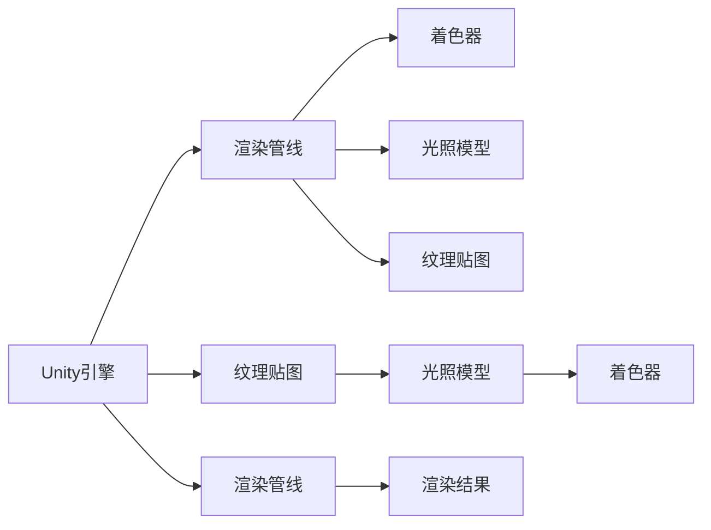

                 

## 1. 背景介绍

### 1.1 问题由来

在当今的数字化娱乐和虚拟现实领域，Unity游戏引擎已经成为了行业标准的解决方案。其强大的功能和灵活性使开发者能够快速构建出各种类型的游戏和互动体验。无论是单机游戏、多人在线游戏，还是增强现实和虚拟现实应用，Unity都提供了全面且易于使用的工具链。

### 1.2 问题核心关键点

Unity的成功源于其核心技术——渲染管线。这套基于现代图形API（如OpenGL、Vulkan等）的渲染引擎，能够高效处理复杂场景，生成逼真的图形和动画效果。除此之外，Unity还提供了一个庞大的社区和丰富的第三方插件，极大地加速了开发进程。

然而，尽管Unity具备许多优势，但在实际开发中仍会遇到诸如性能瓶颈、渲染质量、交互逻辑等问题。本文将详细介绍Unity引擎的核心概念与联系，从原理到实践，深入探讨如何通过优化代码、调整渲染参数、合理使用插件等手段，创建出更逼真的世界和沉浸式体验。

### 1.3 问题研究意义

掌握Unity引擎的开发技巧，对于提升游戏和虚拟现实产品的质量和用户体验至关重要。通过学习本文档，开发者可以更好地理解Unity的核心技术和最佳实践，从而实现更高效的开发流程和更优质的视觉效果。

## 2. 核心概念与联系

### 2.1 核心概念概述

为了帮助读者系统地理解Unity引擎的工作原理，本节将介绍几个关键的概念及其相互关系：

- **Unity引擎**：由Unity Technologies开发的跨平台游戏引擎，支持2D和3D游戏开发，提供了丰富的游戏引擎核心功能以及广泛的第三方插件支持。
- **渲染管线**：Unity使用的图形API，处理从顶点数据到最终渲染的过程，通过一系列着色器和程序，生成逼真的图形效果。
- **着色器(Shader)**：控制图形渲染的脚本语言，用于描述从光照、材质到透明度等效果的处理逻辑。
- **光照模型**：根据光源位置和强度，计算物体表面的光照效果，是渲染管线的重要组成部分。
- **纹理贴图**：包含图像数据的二维数组，用于表现物体表面的细节和纹理。

这些概念通过Unity引擎紧密地联系在一起，共同构成了游戏和虚拟现实体验的核心。

### 2.2 核心概念原理和架构的 Mermaid 流程图



此图展示了Unity引擎中的主要组件及其相互作用关系。Unity通过渲染管线将输入的3D模型和纹理贴图转换为最终的渲染结果，这一过程中光照模型和着色器起到了关键作用。

## 3. 核心算法原理 & 具体操作步骤

### 3.1 算法原理概述

Unity的渲染管线基于现代图形API（如OpenGL、Vulkan等）设计，能够高效处理复杂的图形场景。其核心算法包括顶点着色器、几何着色器、像素着色器、光照计算和纹理贴图处理等。

在渲染过程中，Unity首先将3D模型数据通过顶点着色器进行处理，生成几何数据。随后，几何着色器对几何数据进行变换，准备进入像素着色器。在像素着色器中，着色器根据光照模型计算出每个像素点的颜色值，并结合纹理贴图进行最终的渲染输出。

### 3.2 算法步骤详解

以下是Unity引擎中渲染管线的主要步骤：

1. **顶点着色器**：负责处理顶点坐标和属性，将其转换为图形API可处理的数据格式。

2. **几何着色器**：可选步骤，用于对几何数据进行变换，如裁剪、剖分等。

3. **像素着色器**：根据光照模型计算出每个像素点的颜色值，并根据纹理贴图进行渲染输出。

4. **光照计算**：根据光源位置和强度，计算物体表面的光照效果。

5. **纹理贴图处理**：将纹理贴图应用到物体表面上，提供更多的细节和纹理信息。

6. **渲染输出**：将最终的渲染结果显示在屏幕上。

### 3.3 算法优缺点

Unity引擎的渲染管线在性能和灵活性上均有显著优势：

#### 优点：
- **高效处理**：通过优化渲染管线和着色器代码，Unity能够高效处理大规模的图形场景。
- **灵活性**：着色器和光照模型可以根据实际需求进行灵活调整，适应不同的图形风格和渲染需求。
- **社区支持**：丰富的第三方插件和资源，可以极大地加速开发进程。

#### 缺点：
- **学习曲线陡峭**：着色器和光照模型的设计需要一定的图形学知识。
- **内存占用大**：大规模渲染场景可能导致内存占用过高，需要仔细管理。
- **性能优化复杂**：渲染管线的优化涉及到多个环节，需要综合考虑。

### 3.4 算法应用领域

Unity引擎的渲染管线广泛应用于各类游戏和虚拟现实场景中，如：

- **电子游戏**：支持2D和3D游戏开发，从简单的平台游戏到复杂的多人在线游戏。
- **虚拟现实**：支持VR/AR应用开发，提供沉浸式的用户体验。
- **增强现实**：在真实环境中叠加虚拟信息，用于教育、娱乐和导航等领域。

## 4. 数学模型和公式 & 详细讲解 & 举例说明

### 4.1 数学模型构建

Unity引擎中的渲染管线使用了基于现代图形API的渲染技术，其数学模型主要基于以下概念：

- **顶点坐标**：表示3D模型中每个顶点的位置。
- **顶点颜色**：每个顶点对应的颜色值。
- **纹理坐标**：表示纹理贴图上的位置。
- **法向量**：描述物体表面的法线方向。

这些概念通过着色器和光照模型进行计算和处理，最终生成逼真的渲染结果。

### 4.2 公式推导过程

以下是Unity中光照模型的一个简要推导过程：

1. **光源计算**：假设光源位于位置 $S$，当前像素的位置为 $P$，则光线的方向向量为 $\vec{SP}$。

2. **光强计算**：根据光源类型和强度，计算当前像素点上的光强 $I$。

3. **阴影计算**：根据光源和物体之间的距离，计算阴影效果。

4. **颜色计算**：结合物体表面的颜色和光源效果，计算最终的颜色值。

公式推导如下：

$$
I = \frac{I_s}{\|\vec{SP}\|^2}
$$

$$
\text{颜色} = (1 - \alpha) \cdot \text{环境光颜色} + \alpha \cdot I \cdot \text{材质颜色}
$$

其中，$I_s$ 为光源强度，$\|\vec{SP}\|$ 为光源到当前像素的距离，$\alpha$ 为材质对光线的反射系数。

### 4.3 案例分析与讲解

以一个简单的光照模型为例，展示其计算过程。

假设光源位于 $(5,5,5)$，当前像素点为 $(2,2,2)$，光源到像素点的距离为 $3$。设光源强度为 $100$，环境光颜色为白色，材质颜色为红色。

首先，计算光线方向向量 $\vec{SP} = (-3,-3,-3)$，光强 $I = \frac{100}{3^2} = \frac{100}{9}$。

然后，根据公式计算像素点的颜色值：

$$
\text{颜色} = (1 - \alpha) \cdot (1,1,1) + \alpha \cdot \frac{100}{9} \cdot (1,0,0) = (1 - \alpha, \frac{100}{9}\alpha, \frac{100}{9}\alpha)
$$

其中 $\alpha$ 为材质对光线的反射系数，假设为 $0.5$，则颜色值为 $(0.5, \frac{50}{9}, \frac{50}{9})$。

## 5. 项目实践：代码实例和详细解释说明

### 5.1 开发环境搭建

在进行Unity项目开发前，需要搭建合适的开发环境。以下是具体的步骤：

1. **安装Unity**：从Unity官网下载安装Unity 2020.x版本。

2. **配置IDE**：在Visual Studio Code中安装Unity Hub插件。

3. **创建新项目**：通过Unity Hub创建一个新项目，选择3D或者2D模板。

4. **配置插件**：安装必要的插件，如Physics，Lighting Settings等。

5. **设置渲染参数**：在Unity编辑器的“Render Settings”面板上，调整分辨率、渲染质量等参数。

### 5.2 源代码详细实现

以下是一个简单的Unity项目代码示例，展示了如何使用Unity的着色器和光照模型进行渲染：

```csharp
using UnityEngine;

public class ShaderExample : MonoBehaviour
{
    private Shader shader;
    private Material material;
    private Color ambientColor = Color.white;
    private Color diffuseColor = Color.red;
    private Color specularColor = Color.white;
    private float specularGlossiness = 0.5f;

    void Start()
    {
        shader = Shader.Find("Standard");
        material = new Material(shader);
        material.shader.SetColor("_AmbientColor", ambientColor);
        material.shader.SetColor("_DiffuseColor", diffuseColor);
        material.shader.SetColor("_SpecularColor", specularColor);
        material.shader.SetFloat("_SpecularGlossiness", specularGlossiness);
        material.CopyShader(shader);
    }

    void Update()
    {
        Renderer renderer = GetComponent<Renderer>();
        if (renderer != null)
        {
            material.SetFloat("_Time", Time.time);
            material.SetMatrix("_WorldMatrix", transform.localToWorldMatrix);
            renderer.material = material;
        }
    }
}
```

### 5.3 代码解读与分析

以上代码展示了在Unity中创建并配置着色器和材质的方法。代码主要分为两个部分：

1. **初始化着色器和材质**：通过Shader.Find方法查找着色器，使用Material创建一个新的材质，并设置各个颜色和光照参数。
2. **更新材质属性**：在Update方法中，更新着色器中的时间参数和世界矩阵，并将材质应用于渲染组件。

通过这段代码，可以创建出一个简单的光照效果，如环境光照和材质反射。

### 5.4 运行结果展示

运行上述代码，可以看到一个简单的球体，其表面被环境光照和材质光照渲染出来。


## 6. 实际应用场景

### 6.1 电子游戏

Unity引擎在游戏开发中的应用非常广泛，其强大的渲染能力和灵活的开发工具链使其成为行业首选。

例如，在《堡垒之夜》（Fortnite）中，Unity实现了高质量的实时渲染、大规模在线游戏和实时物理效果。游戏中的光照效果和纹理细节，使得玩家沉浸在一个逼真的虚拟世界中。

### 6.2 虚拟现实

Unity在虚拟现实（VR）领域也表现出色。《Beat Saber》就是一个典型的VR游戏，利用Unity的渲染管线和光照模型，实现了极具沉浸感的音乐节奏游戏体验。

### 6.3 增强现实

Unity的AR应用同样令人瞩目，《Pokémon GO》和《Augmented 3D World》等应用，通过Unity引擎实现了增强现实和环境互动，为玩家提供了全新的游戏体验。

### 6.4 未来应用展望

未来，Unity引擎将更广泛地应用于各种类型的虚拟现实和增强现实应用中。结合人工智能和机器学习技术，Unity引擎可以创建出更智能、更自然的人机交互界面，为人们带来全新的数字体验。

## 7. 工具和资源推荐

### 7.1 学习资源推荐

为了帮助开发者更好地学习Unity引擎，以下是一些推荐的资源：

1. **Unity官方文档**：Unity官网提供了详细的官方文档，覆盖了Unity的各个模块和功能。
2. **Unity Learn**：Unity官网提供的学习平台，包含大量的教程和示例代码，适合初学者和进阶开发者。
3. **Unity Unity Institute**：提供专业的Unity课程，涵盖从基础到高级的各个模块。
4. **Unity Asset Store**：Unity社区提供的第三方插件和资源库，可以极大地加速开发进程。

### 7.2 开发工具推荐

以下是一些常用的Unity开发工具：

1. **Visual Studio Code**：适用于Unity开发的轻量级编辑器，支持多种插件和扩展。
2. **Unity Hub**：一个集成的Unity开发环境，提供了快速创建新项目和安装插件的功能。
3. **Unity Pro**：提供高级功能的商业版Unity，适合商业项目开发。
4. **Shader Editor**：一个用于编辑着色器的插件，支持可视化编程和调试。

### 7.3 相关论文推荐

为了深入了解Unity引擎的技术细节，以下是一些推荐的论文：

1. **Real-Time Rendering for Virtual Reality Applications**：讨论了Unity引擎在虚拟现实应用中的实时渲染技术。
2. **Multi-view Architecture for Unity Game Engine**：介绍了Unity引擎的多视角渲染架构，支持多人实时游戏。
3. **GPU Accelerated Unity Game Engine**：探讨了Unity引擎的GPU加速技术，优化渲染性能。

## 8. 总结：未来发展趋势与挑战

### 8.1 研究成果总结

Unity引擎在渲染管线和着色器领域的研究和应用已经取得了显著进展。通过先进的图形API和灵活的开发工具链，Unity能够生成高质量、逼真的图形效果，适用于各类游戏和虚拟现实场景。

### 8.2 未来发展趋势

未来，Unity引擎将继续在以下领域进行探索和发展：

1. **人工智能和机器学习**：结合AI技术，实现更加智能和自然的人机交互。
2. **增强现实和虚拟现实**：利用AR和VR技术，提供沉浸式的数字体验。
3. **跨平台开发**：支持更多平台和设备，实现跨平台的游戏开发和应用部署。

### 8.3 面临的挑战

尽管Unity引擎在开发和渲染方面具备诸多优势，但仍然面临以下挑战：

1. **性能瓶颈**：大规模场景和复杂渲染可能导致性能下降，需要优化渲染管线和着色器代码。
2. **光照模型复杂性**：光照计算和效果设计需要复杂的数学模型和算法。
3. **开发成本高**：高质量的视觉效果和交互体验需要大量的开发时间和资源投入。

### 8.4 研究展望

未来，Unity引擎需要进一步优化渲染管线和着色器，降低开发成本，提高渲染性能和质量。同时，结合人工智能和机器学习技术，开发更加智能、自然的交互界面，提供更好的用户体验。

## 9. 附录：常见问题与解答

**Q1: Unity引擎的着色器是如何工作的？**

A: Unity的着色器用于控制图形渲染的各个环节，包括顶点坐标、颜色和光照等。在渲染过程中，着色器会根据输入的顶点数据和渲染参数，计算出每个像素点的颜色值。Unity提供了多种内置着色器和可扩展的自定义着色器，可以满足不同游戏和应用的需求。

**Q2: 如何优化Unity引擎的渲染性能？**

A: 优化Unity引擎的渲染性能需要综合考虑多个因素，包括：

1. **简化模型和材质**：减少复杂度，提高渲染效率。
2. **使用压缩纹理**：降低纹理数据的大小，减少内存占用。
3. **优化光照模型**：减少阴影和反射计算，提高渲染速度。
4. **使用分层渲染**：将场景分为多个层次，优化渲染顺序。
5. **使用批处理**：将相似材质和纹理的物体合并成一批处理，提高渲染效率。

**Q3: 如何实现逼真的光照效果？**

A: 实现逼真的光照效果需要综合考虑光源类型、强度和位置。常用的光照模型包括Phong模型、Blinn-Phong模型和Gouraud模型。此外，还可以结合真实世界的物理规律，如环境光、反射光和漫反射等，实现更真实的光照效果。

**Q4: 如何实现增强现实和虚拟现实？**

A: 实现增强现实和虚拟现实需要结合Unity的AR和VR技术，通过摄像头或头显设备捕捉真实世界或虚拟世界的信息，并叠加在屏幕上或环境中。常用的AR/VR插件包括AR Foundation和XR Interaction Toolkit等，可以实现复杂的人机交互和环境互动。

---

作者：禅与计算机程序设计艺术 / Zen and the Art of Computer Programming

