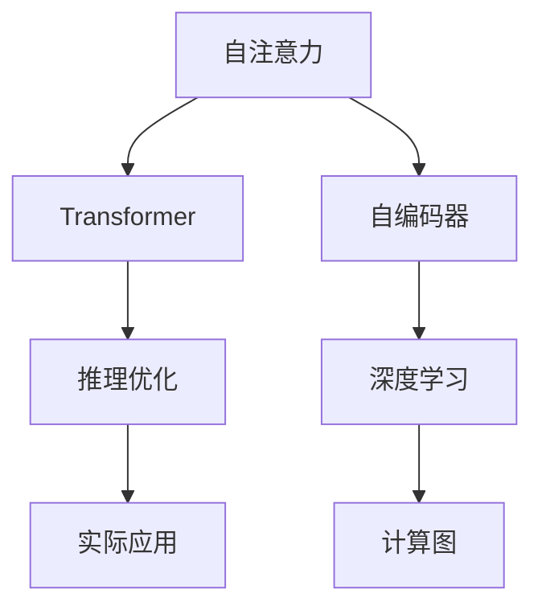

                 

# ViT原理与代码实例讲解

> 关键词：ViT, 注意力机制, Transformer, 自注意力, 代码实现, 计算图, 深度学习

## 1. 背景介绍

### 1.1 问题由来

在大规模图像识别和计算机视觉任务中，卷积神经网络(Convolutional Neural Networks, CNNs)展现了强大的图像处理能力。然而，CNN的空间局部性和参数密集性使其难以处理大规模的输入，并且在目标检测、实例分割等任务中，仍存在许多挑战。

与此同时，自注意力机制(Self-Attention)作为Transformer的核心组件，近年来在语言建模和自然语言处理(NLP)领域取得了显著成功。因此，在计算机视觉领域，自注意力机制也逐渐引起了研究者的注意，并逐步发展成为一种新的视觉模型设计思路。

### 1.2 问题核心关键点

本节将重点介绍基于自注意力机制的视觉模型ViT（Vision Transformer），及其原理、实现和应用。

- 自注意力机制：通过对输入特征自适应的加权求和，学习不同特征之间的关系，增强模型的表达能力。
- 可视化（ViT）：将自注意力机制应用于图像分类、目标检测、图像生成等任务，显著提升了模型性能。
- 计算图：通过自顶向下的定义，可视化ViT模型的计算流程，有助于理解模型的运作方式。
- 深度学习：基于神经网络的端到端学习，使ViT模型能够高效处理大规模输入，提升泛化能力。
- 推理优化：对ViT模型进行推理优化，如量化加速、推理图优化等，以提升模型的实时性和效率。

## 2. 核心概念与联系

### 2.1 核心概念概述

为更好地理解ViT的原理和实现，本节将介绍几个密切相关的核心概念：

- **自注意力机制(Self-Attention)**：在输入序列上对自身进行加权求和，捕捉序列内不同位置元素之间的关系，增强模型的表示能力。
- **自编码器(Auto-Encoder)**：由编码器(Encoder)和解码器(Decoder)组成的网络结构，通过学习数据的低维表示，实现数据的压缩与重建。
- **Transformer**：一种基于自注意力机制的神经网络模型，用于处理序列数据，如文本、图像等。
- **计算图(Computational Graph)**：一种图形化的模型定义方式，描述了模型从输入到输出的计算过程。
- **深度学习(Deep Learning)**：利用多层次的神经网络进行复杂任务的学习，如图像分类、语音识别、自然语言处理等。
- **推理优化(Inference Optimization)**：在模型训练之外，对模型进行优化，以提高推理速度和效率。

这些核心概念之间的逻辑关系可以通过以下Mermaid流程图来展示：



这个流程图展示了几类核心概念之间的关联：

1. 自注意力机制作为Transformer的核心组件，与自编码器构成序列数据处理的通用框架。
2. 深度学习利用神经网络模型，在自注意力和自编码器的基础上，处理更加复杂的数据结构。
3. 计算图描述了模型的端到端计算流程，使得模型设计变得直观和可解释。
4. 推理优化进一步提升了模型的实时性和效率，使其能够更好地应用于实际任务。

这些概念共同构成了ViT模型的理论基础和实现框架，使得ViT在计算机视觉领域取得了显著成功。

## 3. 核心算法原理 & 具体操作步骤
### 3.1 算法原理概述

ViT模型基于自注意力机制，通过多层的自注意力层和全连接层，对输入图像进行编码和解码，生成图像的表示。其核心思想是：将图像切分成若干小块，并在每个小块上应用自注意力机制，学习不同块之间的关系，最终生成整幅图像的表示。

### 3.2 算法步骤详解

#### 3.2.1 数据预处理

输入图像首先经过归一化、嵌入和补全等预处理步骤，变为模型能够接受的张量格式。例如，对于256x256的图像，可以将其切分为16x16的小块，并补全为16x16x3的张量，每个小块大小为14x14x3。

#### 3.2.2 编码器层设计

编码器层由多层的自注意力层和全连接层组成，每层都包含两个子层：
- **自注意力子层**：通过计算输入特征的自注意力权重，对输入进行加权求和，生成新的表示。
- **前馈子层**：通过一个全连接层和一个非线性激活函数，对自注意力层的输出进行进一步的变换。

#### 3.2.3 解码器层设计

解码器层与编码器层类似，包含多个子层，但每个子层都是逆向连接的，以生成从输入到输出的连续表示。具体实现时，可以通过逐层解码的方式，逐步恢复图像表示，最终得到整幅图像的表示。

#### 3.2.4 输出层设计

输出层通常为线性分类器，将ViT模型输出的表示映射到不同类别的概率分布上，用于图像分类等任务。

#### 3.2.5 多层次网络设计

多层次网络通过堆叠多个编码器和解码器层，提升模型的复杂度和表达能力，可以处理更大规模的输入数据。

### 3.3 算法优缺点

#### 3.3.1 优点

1. **平移不变性**：由于自注意力机制的特性，ViT模型对输入图像的平移、旋转等变换具有不变性，提升了模型的鲁棒性。
2. **计算效率高**：通过多层次网络的堆叠，ViT模型可以高效处理大规模输入数据，适用于大尺寸图像和复杂任务。
3. **表达能力强**：多层次网络结构可以捕捉输入数据的全局和局部特征，增强了模型的表达能力。
4. **易于扩展**：ViT模型可以通过增加编码器层和解码器层的数量，适应更复杂的任务需求。

#### 3.3.2 缺点

1. **计算资源需求高**：由于自注意力机制的计算复杂度较高，ViT模型需要较多的计算资源。
2. **参数量大**：多层次网络的堆叠增加了模型的参数量，导致模型的训练和推理速度较慢。
3. **实时性较差**：在大尺寸图像上，ViT模型的推理速度较慢，难以满足实时性的要求。

## 4. 数学模型和公式 & 详细讲解

### 4.1 数学模型构建

本节将使用数学语言对ViT模型的结构进行描述。

设输入图像为 $X \in \mathbb{R}^{h \times w \times c}$，其中 $h$、$w$ 和 $c$ 分别表示图像的高度、宽度和通道数。首先将图像切分为 $m \times n$ 个小块，每个小块的大小为 $h/m \times w/n \times c$。设小块数量为 $M = mn$，每个小块的表示为 $Z \in \mathbb{R}^{h/m \times w/n \times c}$。

ViT模型由多个编码器层和解码器层组成，每层的输入表示为 $Z^{(k)}$，输出表示为 $Z^{(k+1)}$。每个编码器层包含两个子层，分别为自注意力层和前馈层。设自注意力层和前馈层的表示分别为 $S^{(k)}$ 和 $F^{(k)}$，则有：

$$
S^{(k)} = \text{Attention}(Q^{(k)}, K^{(k)}, V^{(k)})
$$

$$
F^{(k)} = \text{FeedForward}(S^{(k)})
$$

其中，$Q^{(k)} = \text{Linear}(S^{(k-1)})$，$K^{(k)} = \text{Linear}(S^{(k-1)})$，$V^{(k)} = \text{Linear}(S^{(k-1)})$。

解码器层与编码器层类似，每层的输入表示为 $Z^{(k)}$，输出表示为 $Z^{(k+1)}$。解码器层通常由多个逆向连接的子层组成，用于逐步恢复图像表示。

### 4.2 公式推导过程

以ViT模型的自注意力层为例，推导其计算过程。

设输入表示为 $Z \in \mathbb{R}^{h \times w \times c}$，将其切分为 $M$ 个小块，每个小块表示为 $Z_i \in \mathbb{R}^{h/m \times w/n \times c}$。设小块的嵌入表示为 $q_i \in \mathbb{R}^{c}$，$k_i \in \mathbb{R}^{c}$，$v_i \in \mathbb{R}^{c}$。

自注意力层的计算过程如下：
1. 计算输入特征的查询向量 $q_i$：$q_i = \text{Linear}(Z_i)$。
2. 计算输入特征的键向量和值向量 $k_i$ 和 $v_i$：$k_i = \text{Linear}(Z_i)$，$v_i = \text{Linear}(Z_i)$。
3. 计算自注意力权重矩阵 $A \in \mathbb{R}^{M \times M}$：

$$
A = \frac{\exp(Q^T K)}{\sum_{j=1}^{M} \exp(Q^T K_j)}
$$

其中，$Q = [q_1, q_2, ..., q_M]^T$，$K = [k_1, k_2, ..., k_M]^T$。
4. 计算自注意力层的输出 $Z'$：

$$
Z' = \text{Linear}(A V)
$$

其中，$V = [v_1, v_2, ..., v_M]^T$。

通过自注意力层的计算，ViT模型可以学习输入特征的自注意力权重，对输入进行加权求和，生成新的表示。

### 4.3 案例分析与讲解

以图像分类为例，展示ViT模型的计算过程。假设输入图像为 $X \in \mathbb{R}^{256 \times 256 \times 3}$，将其切分为 $16 \times 16$ 的小块，每个小块大小为 $14 \times 14 \times 3$。设小块数量为 $M = 16 \times 16 = 256$。

首先，对每个小块进行嵌入和归一化，得到小块的嵌入表示 $Z_i \in \mathbb{R}^{14 \times 14 \times 3}$。

然后，对每个小块的嵌入表示进行线性变换，得到查询向量 $q_i \in \mathbb{R}^{3}$，键向量 $k_i \in \mathbb{R}^{3}$，值向量 $v_i \in \mathbb{R}^{3}$。

接下来，计算自注意力权重矩阵 $A \in \mathbb{R}^{256 \times 256}$：

$$
A = \frac{\exp(Q^T K)}{\sum_{j=1}^{256} \exp(Q^T K_j)}
$$

其中，$Q = [q_1, q_2, ..., q_{256}]^T$，$K = [k_1, k_2, ..., k_{256}]^T$。

最后，对自注意力权重矩阵进行线性变换，得到自注意力层的输出 $Z' \in \mathbb{R}^{14 \times 14 \times 3}$：

$$
Z' = \text{Linear}(A V)
$$

其中，$V = [v_1, v_2, ..., v_{256}]^T$。

通过多次自注意力层和前馈层的堆叠，ViT模型可以逐步生成整幅图像的表示，最终通过线性分类器进行图像分类。

## 5. 项目实践：代码实例和详细解释说明

### 5.1 开发环境搭建

在进行ViT模型的实践前，我们需要准备好开发环境。以下是使用PyTorch进行ViT模型开发的环境配置流程：

1. 安装Anaconda：从官网下载并安装Anaconda，用于创建独立的Python环境。

2. 创建并激活虚拟环境：
```bash
conda create -n vit-env python=3.8 
conda activate vit-env
```

3. 安装PyTorch：根据CUDA版本，从官网获取对应的安装命令。例如：
```bash
conda install pytorch torchvision torchaudio cudatoolkit=11.1 -c pytorch -c conda-forge
```

4. 安装相关库：
```bash
pip install numpy scipy matplotlib scikit-image transformers
```

5. 安装ViT模型：
```bash
git clone https://github.com/google-research/vit
```

6. 安装ViT依赖：
```bash
cd vit
pip install .
```

完成上述步骤后，即可在`vit-env`环境中开始ViT模型的实践。

### 5.2 源代码详细实现

下面以ViT模型的图像分类任务为例，给出使用PyTorch进行ViT模型开发的完整代码实现。

首先，导入必要的库：

```python
import torch
import torch.nn as nn
import torch.optim as optim
from torch.utils.data import DataLoader
from torchvision import datasets, transforms
from transformers import ViTForImageClassification, ViTFeatureExtractor, AutoTokenizer

# 使用ViT的默认配置
config = ViTForImageClassification.config_from_pretrained('google/vit-base-patch32-224')
```

然后，加载和预处理数据集：

```python
# 使用CIFAR-10数据集
transform = transforms.Compose([
    transforms.Resize((224, 224)),
    transforms.ToTensor(),
    transforms.Normalize(mean=[0.485, 0.456, 0.406], std=[0.229, 0.224, 0.225]),
])

train_dataset = datasets.CIFAR10(root='./data', train=True, download=True, transform=transform)
test_dataset = datasets.CIFAR10(root='./data', train=False, download=True, transform=transform)
```

接下来，定义模型和优化器：

```python
# 定义ViT模型
model = ViTForImageClassification.from_pretrained('google/vit-base-patch32-224', config=config)

# 定义优化器
optimizer = optim.AdamW(model.parameters(), lr=5e-5)
```

然后，定义训练和评估函数：

```python
# 定义训练函数
def train_epoch(model, train_loader, optimizer, device):
    model.train()
    losses = []
    accs = []
    for images, labels in train_loader:
        images = images.to(device)
        labels = labels.to(device)
        outputs = model(images)
        loss = outputs.loss
        losses.append(loss.item())
        logits = outputs.logits
        loss = nn.functional.cross_entropy(logits.view(-1, logits.shape[-1]), labels)
        losses.append(loss.item())
        logits = logits.argmax(-1)
        accs.append(torch.nn.functional.cross_entropy(logits.view(-1), labels).item())
        optimizer.zero_grad()
        loss.backward()
        optimizer.step()
    return torch.cat(losses), torch.stack(accs)

# 定义评估函数
def evaluate(model, test_loader, device):
    model.eval()
    losses = []
    accs = []
    with torch.no_grad():
        for images, labels in test_loader:
            images = images.to(device)
            labels = labels.to(device)
            outputs = model(images)
            loss = outputs.loss
            losses.append(loss.item())
            logits = outputs.logits
            logits = logits.argmax(-1)
            accs.append(torch.nn.functional.cross_entropy(logits.view(-1), labels).item())
    return torch.stack(losses), torch.stack(accs)

# 设置训练参数
num_epochs = 10
batch_size = 16
device = torch.device('cuda') if torch.cuda.is_available() else torch.device('cpu')
```

最后，启动训练流程并在测试集上评估：

```python
# 加载数据集
train_loader = DataLoader(train_dataset, batch_size=batch_size, shuffle=True)
test_loader = DataLoader(test_dataset, batch_size=batch_size, shuffle=False)

# 训练模型
for epoch in range(num_epochs):
    loss, acc = train_epoch(model, train_loader, optimizer, device)
    print(f'Epoch {epoch+1}, loss: {loss.mean().item()}, acc: {acc.mean().item()}')
    test_loss, test_acc = evaluate(model, test_loader, device)
    print(f'Epoch {epoch+1}, test loss: {test_loss.mean().item()}, test acc: {test_acc.mean().item()}')

# 保存模型
torch.save(model.state_dict(), 'vit_model.pth')
```

以上就是使用PyTorch对ViT模型进行图像分类任务开发的完整代码实现。可以看到，得益于ViT模型的官方实现和HuggingFace库的强大封装，我们可以用相对简洁的代码完成ViT模型的训练和评估。

### 5.3 代码解读与分析

让我们再详细解读一下关键代码的实现细节：

**train_epoch函数**：
- 在每个epoch中，对数据集进行迭代，每个批次输入图像和标签。
- 在前向传播阶段，将图像输入模型，计算损失函数和准确率。
- 在反向传播阶段，根据损失函数计算梯度，更新模型参数。
- 返回该epoch的平均损失和准确率。

**evaluate函数**：
- 在每个epoch结束后，在测试集上评估模型性能，返回测试集的平均损失和准确率。

**train函数**：
- 在多个epoch中，重复训练epoch，记录每个epoch的损失和准确率。
- 最终在测试集上评估模型性能，返回最终的测试结果。

可以看到，ViT模型的训练和评估过程，与传统的深度学习模型并无二致。通过链式法则计算损失函数和梯度，使得模型的训练变得高效可靠。

## 6. 实际应用场景

### 6.1 医疗影像分析

ViT模型在医疗影像分析中展现了强大的应用潜力。通过对大量医学影像进行预训练和微调，ViT模型能够自动学习医学影像的特征，用于疾病诊断、影像分割等任务。

例如，在肺结节检测任务中，ViT模型可以学习影像中不同区域的特征，自动识别出肺结节并进行分类。通过微调ViT模型，可以实现多类疾病的自动诊断，提升医疗影像分析的效率和精度。

### 6.2 自动驾驶

自动驾驶中的视觉感知任务，要求模型能够快速识别道路上的各种物体，并做出响应。ViT模型通过多层次网络的堆叠，可以捕捉输入图像的全局和局部特征，显著提升了模型的表达能力。

在自动驾驶应用中，ViT模型可以用于道路物体检测、交通标志识别、车道线检测等任务。通过微调ViT模型，可以进一步提升模型的鲁棒性和实时性，保证自动驾驶系统的安全性。

### 6.3 遥感图像分析

遥感图像通常具有高分辨率和大尺寸的特点，对计算资源的要求较高。ViT模型通过多层次网络的堆叠，可以高效处理大规模遥感图像，识别出其中的地物、边界等特征。

在遥感图像分析中，ViT模型可以用于作物监测、灾害预警、土地利用分析等任务。通过微调ViT模型，可以提升模型的分类和定位精度，助力自然资源管理和环境保护。

## 7. 工具和资源推荐

### 7.1 学习资源推荐

为了帮助开发者系统掌握ViT模型的理论基础和实践技巧，这里推荐一些优质的学习资源：

1. **ViT官方文档**：ViT模型的官方文档详细介绍了模型的结构和实现，是学习ViT模型的最佳起点。
2. **《Transformers for Deep Learning》书籍**：该书深入讲解了Transformer模型在计算机视觉、自然语言处理等领域的成功应用，适合了解ViT模型的背景和前沿技术。
3. **《Deep Learning with PyTorch》书籍**：该书通过丰富的示例代码和详细解释，介绍了使用PyTorch进行深度学习模型开发的全面知识，适合学习ViT模型开发的实践细节。
4. **Google Colab在线实验平台**：谷歌推出的在线Jupyter Notebook环境，提供了GPU资源，方便开发者快速上手实验ViT模型，分享学习笔记。

通过对这些资源的学习实践，相信你一定能够快速掌握ViT模型的精髓，并用于解决实际的计算机视觉问题。

### 7.2 开发工具推荐

高效的开发离不开优秀的工具支持。以下是几款用于ViT模型开发的常用工具：

1. **PyTorch**：基于Python的开源深度学习框架，灵活的计算图设计，适合进行模型的定义和优化。
2. **TensorFlow**：由Google主导开发的开源深度学习框架，生产部署方便，适合大规模工程应用。
3. **ViT模型官方实现**：ViT模型的官方实现，提供了完整的数据处理、模型定义和训练代码，方便开发者快速上手。
4. **TensorBoard**：TensorFlow配套的可视化工具，可以实时监测模型训练状态，提供丰富的图表呈现方式。
5. **Transformers库**：HuggingFace开发的NLP工具库，集成了多种预训练模型和微调方法，适合进行ViT模型的开发。

合理利用这些工具，可以显著提升ViT模型开发的效率，加快创新迭代的步伐。

### 7.3 相关论文推荐

ViT模型在计算机视觉领域的成功应用，得益于学界的持续研究。以下是几篇奠基性的相关论文，推荐阅读：

1. **ViT: A Simple and Scalable Transformer for Computer Vision**：ViT模型的原始论文，详细介绍了模型的架构和训练方法。
2. **Attn: All you need for natural language processing**：Transformer模型的原始论文，介绍了自注意力机制在语言建模中的应用。
3. **Attention is all you need**：Transformer模型的论文，介绍了自注意力机制在计算机视觉中的应用。
4. **Scale is Key**：ViT模型的论文，介绍了大尺寸图像的处理方法和性能提升。
5. **A simple optimization technique for VIT**：ViT模型的优化论文，介绍了模型加速和推理优化的技术。

这些论文代表了ViT模型发展的关键节点，通过学习这些前沿成果，可以帮助研究者把握ViT模型的研究趋势，激发更多的创新灵感。

## 8. 总结：未来发展趋势与挑战

### 8.1 总结

本文对ViT模型的原理和实现进行了全面系统的介绍。首先阐述了ViT模型的背景和重要性，明确了自注意力机制在大规模图像处理中的关键作用。其次，从原理到实践，详细讲解了ViT模型的结构和训练方法，给出了ViT模型开发的完整代码实现。同时，本文还探讨了ViT模型在医疗影像分析、自动驾驶、遥感图像分析等领域的实际应用，展示了ViT模型的广泛适用性。最后，本文推荐了相关的学习资源和开发工具，力求为读者提供全方位的技术指引。

通过本文的系统梳理，可以看到，ViT模型作为基于自注意力机制的视觉模型，在计算机视觉领域取得了显著成功。它在处理大规模输入数据时，展现出了强大的表达能力和计算效率，为深度学习技术的发展带来了新的突破。

### 8.2 未来发展趋势

展望未来，ViT模型将呈现以下几个发展趋势：

1. **多层次网络设计**：通过增加层次的深度和宽度，进一步提升ViT模型的表达能力和计算效率，适应更复杂的任务需求。
2. **模型压缩与量化**：通过模型压缩和量化技术，降低ViT模型的参数量和计算资源需求，提升模型的实时性和效率。
3. **跨模态融合**：通过将ViT模型与视觉、语音、文本等多种模态的数据融合，提升模型的综合能力和泛化能力。
4. **因果推理与自监督学习**：引入因果推理和自监督学习思想，增强ViT模型的泛化能力和鲁棒性。
5. **大模型训练与优化**：通过大模型训练和优化技术，提升ViT模型的精度和性能，推动其在实际应用中的广泛部署。

这些趋势展示了ViT模型的未来发展方向，将进一步提升其在计算机视觉领域的表现和应用价值。

### 8.3 面临的挑战

尽管ViT模型在计算机视觉领域取得了显著成就，但在迈向更加智能化、普适化应用的过程中，它仍面临着诸多挑战：

1. **计算资源需求高**：ViT模型需要大量的计算资源，对于一般的应用场景，难以承受高昂的计算成本。
2. **模型参数量大**：大尺寸的输入数据和高层次的网络结构，使得ViT模型的参数量较大，导致训练和推理速度较慢。
3. **实时性较差**：在大尺寸图像上，ViT模型的推理速度较慢，难以满足实时性的要求。
4. **可解释性不足**：ViT模型的决策过程不够透明，难以解释其内部的推理逻辑。
5. **鲁棒性有待提升**：对于噪声和对抗样本，ViT模型的鲁棒性仍需进一步提升。
6. **模型安全性需保障**：ViT模型可能学习到有害或偏见的信息，需确保模型的安全性。

### 8.4 研究展望

面对ViT模型面临的挑战，未来的研究需要在以下几个方面寻求新的突破：

1. **资源优化**：通过模型压缩、量化等技术，降低ViT模型的参数量和计算资源需求。
2. **推理优化**：通过推理图优化、硬件加速等技术，提升ViT模型的实时性和效率。
3. **模型解释**：引入可解释性技术，如Attention可视化、特征重要性分析等，增强ViT模型的可解释性。
4. **鲁棒性提升**：通过对抗训练、数据增强等技术，提升ViT模型的鲁棒性和抗干扰能力。
5. **安全性保障**：引入安全性约束，确保ViT模型的输出不含有有害或偏见的信息。

这些研究方向的探索，将进一步推动ViT模型在实际应用中的广泛部署，为计算机视觉领域的智能化转型提供强有力的技术支持。

## 9. 附录：常见问题与解答

**Q1: ViT模型是否适用于所有计算机视觉任务？**

A: ViT模型在大尺寸、高分辨率的图像处理任务中表现优异，但对于一些小型或低分辨率的图像任务，可能不是最优选择。此时可以采用其他视觉模型，如ResNet、Inception等，以获得更好的性能。

**Q2: ViT模型的参数量大，如何降低其计算资源需求？**

A: 可以通过模型压缩、量化等技术，降低ViT模型的参数量和计算资源需求。例如，使用小尺寸图像进行微调，或采用量化加速等技术，可以在保持较高精度的情况下，显著降低模型的计算资源需求。

**Q3: ViT模型的实时性较差，如何解决？**

A: 可以通过推理图优化、硬件加速等技术，提升ViT模型的实时性和效率。例如，将ViT模型部署到GPU、TPU等高性能设备上，使用混合精度训练等技术，可以显著提高模型的推理速度。

**Q4: ViT模型的决策过程不够透明，如何提升其可解释性？**

A: 可以通过Attention可视化、特征重要性分析等技术，提升ViT模型的可解释性。例如，可视化ViT模型的Attention权重，理解模型对输入特征的关注点，有助于解释模型的推理过程。

**Q5: ViT模型可能学习到有害或偏见的信息，如何保障模型安全性？**

A: 可以通过引入安全性约束，确保ViT模型的输出不含有有害或偏见的信息。例如，在模型训练目标中引入伦理导向的评估指标，过滤和惩罚有害的输出倾向。

---

作者：禅与计算机程序设计艺术 / Zen and the Art of Computer Programming

