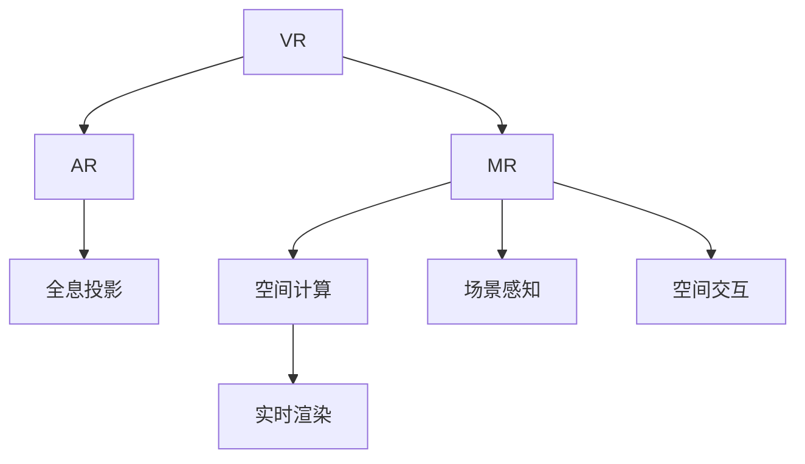

                 

# XR技术融合：VR、AR与MR的协同发展

> 关键词：虚拟现实(VR)、增强现实(AR)、混合现实(MR)、空间计算、场景感知、空间交互、全息投影、实时渲染、AI赋能

## 1. 背景介绍

### 1.1 问题由来

随着计算机技术、网络技术、传感器技术、显示技术、人机交互技术等的高速发展，现实世界和虚拟世界的界限逐渐模糊，人们对于沉浸式体验的需求日益增加。与此同时，不同增强现实（AR）、虚拟现实（VR）、混合现实（MR）技术也逐步走向成熟，开始进入应用落地阶段。这些技术通过不同方式的交互，极大地丰富了人们的现实体验。然而，这些技术在各自的领域虽然都有一定的优势，但单一技术的局限性也让它们的应用范围有限。

### 1.2 问题核心关键点

融合不同XR技术，实现其优势互补，是当前行业的热点问题。具体来说：

- 如何将VR、AR、MR技术进行有效的融合？
- 如何构建统一的跨平台标准？
- 如何设计高效的跨平台算法和架构？
- 如何实现高质量、低延迟的空间渲染和交互？

本文将从这些核心问题出发，探索不同XR技术的协同发展，并提出一些可行的解决方案。

## 2. 核心概念与联系

### 2.1 核心概念概述

为更好地理解XR技术的融合发展，本节将介绍几个密切相关的核心概念：

- **虚拟现实(Virtual Reality, VR)**：通过VR头盔等设备，使用户沉浸于三维虚拟环境中，实现虚拟世界的体验。典型的应用场景有虚拟会议、模拟训练、游戏等。

- **增强现实(Augmented Reality, AR)**：通过AR眼镜等设备，在现实世界中叠加虚拟信息，如图像、文字、3D模型等，实现信息增强的交互体验。典型的应用场景有导航、维修指导、购物试衣等。

- **混合现实(Mixed Reality, MR)**：结合VR和AR技术，将虚拟对象和现实世界进行融合，实现跨物理和虚拟空间的交互。典型的应用场景有协作设计、远程手术、虚拟旅游等。

- **空间计算(Spatial Computing)**：通过传感器、相机等设备，实时捕捉环境的三维空间信息，并结合人工智能技术进行处理，实现对物理世界的深度理解和交互。

- **场景感知(Scene Perception)**：通过计算机视觉和深度学习等技术，对环境中的物体进行识别、定位、追踪等操作，实现对物理世界的感知。

- **空间交互(Spatial Interaction)**：通过手势识别、体感交互、语音识别等技术，实现与物理世界的自然交互。

- **全息投影(Holographic Projection)**：使用全息技术，实现虚拟物体在物理空间中的立体显示。

- **实时渲染(Real-Time Rendering)**：使用高性能计算设备，实现对虚拟物体的实时渲染，保证用户体验的流畅性和沉浸感。

这些核心概念之间的逻辑关系可以通过以下Mermaid流程图来展示：



这个流程图展示了大规模语言模型的核心概念及其之间的关系：

1. VR通过虚拟空间让用户沉浸式体验。
2. AR在现实空间叠加虚拟信息，增强用户的认知体验。
3. MR结合VR和AR，提供混合世界的交互体验。
4. 空间计算通过传感器捕捉空间信息。
5. 场景感知对物体进行识别、定位、追踪。
6. 空间交互使用手势、语音等技术进行自然交互。
7. 全息投影将虚拟物体立体显示在物理空间。
8. 实时渲染实现虚拟物体的流畅渲染。

## 3. 核心算法原理 & 具体操作步骤

### 3.1 算法原理概述

不同XR技术的融合，主要通过构建统一的跨平台标准和算法实现。其核心算法包括：

- **跨平台空间映射算法**：将现实空间和虚拟空间进行映射，实现不同XR设备之间的协同。
- **实时空间渲染算法**：对虚拟物体进行高效渲染，保证实时性。
- **空间交互感知算法**：实现对用户手势、位置等信息的实时感知。
- **多模态数据融合算法**：将不同模态的数据（如深度数据、语音数据、图像数据等）进行融合，增强体验。

### 3.2 算法步骤详解

#### 3.2.1 跨平台空间映射

跨平台空间映射算法的核心在于，如何通过不同设备的传感器数据，统一描述现实空间和虚拟空间的位置关系。以下是基本步骤：

1. **数据采集**：通过不同设备的传感器，采集现实空间的三维信息。例如，VR设备通过头显和手柄捕捉用户的头动和手势，AR设备通过摄像头捕捉用户的位置和手势。

2. **空间对齐**：将不同设备采集的数据进行对齐，统一描述空间坐标系。例如，将VR设备的头显坐标与AR设备的摄像头坐标进行对齐，使得同一物体在不同设备中的位置一致。

3. **数据融合**：将不同设备的传感器数据进行融合，得到统一的空间信息。例如，将VR设备的手势数据和AR设备的深度数据进行融合，得到更为精确的手部位置信息。

4. **空间映射**：将虚拟空间映射到现实空间，或者将现实空间映射到虚拟空间。例如，将虚拟人物映射到用户的真实空间位置，或者将真实物体的图像映射到虚拟空间中。

#### 3.2.2 实时空间渲染

实时空间渲染算法的核心在于，如何高效地渲染虚拟物体，保证渲染的流畅性和沉浸感。以下是基本步骤：

1. **场景分割**：将虚拟场景分为多个子场景，每个子场景独立进行渲染。例如，将虚拟人物和虚拟背景分为不同的场景进行渲染。

2. **场景优化**：对每个子场景进行优化，提高渲染效率。例如，使用LOD技术，根据用户视角远近调整模型细节，减少渲染负荷。

3. **GPU加速**：使用高性能GPU设备，进行并行计算，加速渲染过程。例如，使用NVIDIA RTX系列GPU，进行实时光线追踪。

4. **分布式渲染**：将渲染任务分配到多个设备进行并行处理，提高渲染效率。例如，将虚拟背景渲染分配到多台服务器进行分布式渲染。

5. **实时动态调整**：根据用户交互和环境变化，动态调整渲染参数，保证渲染效果。例如，根据用户视角变化，动态调整虚拟物体的光照和纹理。

#### 3.2.3 空间交互感知

空间交互感知算法的核心在于，如何实时感知用户的手势、位置等信息，并根据这些信息进行互动。以下是基本步骤：

1. **手势识别**：通过摄像头和深度传感器，捕捉用户的手势动作，例如挥手、手势等。

2. **姿态估计**：通过深度传感器和惯性传感器，估计用户的手部姿态，例如手的位置、朝向等。

3. **动作映射**：将手势和姿态映射为虚拟空间中的操作，例如点击、拖动等。

4. **动作反馈**：根据用户的操作，返回虚拟空间的反馈，例如物体移动、变化等。

#### 3.2.4 多模态数据融合

多模态数据融合算法的核心在于，如何将不同模态的数据进行融合，增强体验。以下是基本步骤：

1. **数据采集**：通过摄像头、深度传感器、麦克风等设备，采集不同模态的数据。

2. **数据融合**：将不同模态的数据进行融合，例如将图像数据和语音数据融合，得到更为丰富的信息。

3. **场景理解**：通过深度学习等技术，理解不同模态数据的含义，例如识别语音中的物体和动作。

4. **决策支持**：根据融合后的信息，辅助用户进行决策，例如导航系统根据语音指令进行路径规划。

### 3.3 算法优缺点

**优点：**

1. **丰富的体验**：通过不同XR技术的融合，能够实现更为丰富的用户体验。例如，通过VR和AR技术的结合，实现虚拟旅游和增强现实导航。

2. **广泛的应用**：融合不同XR技术，能够拓展应用场景，例如医疗、教育、娱乐、工业等。

3. **高效的空间渲染**：通过跨平台空间映射和实时空间渲染算法，实现高效、流畅的渲染效果。

4. **自然的空间交互**：通过空间交互感知算法，实现自然的手势、语音等交互方式。

5. **多模态数据融合**：通过多模态数据融合算法，实现信息的全面理解，增强用户体验。

**缺点：**

1. **设备成本高**：高质量的XR设备成本较高，一般用户难以负担。

2. **数据隐私风险**：在空间感知和手势识别过程中，可能涉及用户隐私数据，需要严格保护。

3. **技术复杂度高**：融合不同XR技术，需要复杂的技术实现和算法优化，难以大规模普及。

4. **系统复杂度高**：多设备、多模态数据的协同，增加了系统的复杂度，维护难度较大。

5. **算力要求高**：高效渲染和空间感知需要高性能计算设备，对算力要求较高。

### 3.4 算法应用领域

不同XR技术的融合，已经在多个领域得到了应用，取得了显著的效果：

1. **虚拟会议**：将虚拟会议与AR技术结合，实现虚拟人物在现实场景中的交互。例如，Microsoft Teams中通过混合现实技术，支持虚拟人物在现实会议室中进行互动。

2. **远程协作**：将虚拟现实与AR技术结合，实现远程协作和设计。例如，AutoCAD通过VR设备，支持用户在虚拟空间中进行设计和操作。

3. **虚拟旅游**：将虚拟现实与AR技术结合，实现虚拟旅游和增强现实导航。例如，Google Earth支持用户通过AR眼镜进行虚拟旅游。

4. **虚拟教育**：将虚拟现实与AR技术结合，实现虚拟教室和增强现实教学。例如，Panzoom支持用户通过VR设备进入虚拟教室进行互动。

5. **远程维修**：将虚拟现实与AR技术结合，实现远程维修和指导。例如，Siemens通过AR眼镜，支持用户在虚拟空间中进行设备维修和操作。

6. **虚拟训练**：将虚拟现实与AR技术结合，实现虚拟训练和模拟。例如，军事训练通过VR设备，模拟复杂的战场环境。

7. **虚拟手术**：将虚拟现实与AR技术结合，实现虚拟手术和远程指导。例如，OSFAR通过AR眼镜，支持用户在虚拟空间中进行手术操作。

## 4. 数学模型和公式 & 详细讲解 & 举例说明

### 4.1 数学模型构建

为了更好地理解XR技术的融合，我们以空间计算为例，构建一个数学模型。

假设现实空间中有N个物体，其坐标分别为 $(x_1, y_1, z_1), (x_2, y_2, z_2), ..., (x_N, y_N, z_N)$。通过传感器获取物体的深度信息 $d_1, d_2, ..., d_N$，以及物体在VR头盔和AR眼镜中的位置信息 $(x_h, y_h, z_h), (x_g, y_g, z_g)$。

**目标**：将虚拟物体映射到现实空间中，或者将现实物体映射到虚拟空间中。

### 4.2 公式推导过程

设虚拟物体在VR头盔中的位置为 $(x_v, y_v, z_v)$，在AR眼镜中的位置为 $(x_a, y_a, z_a)$。

根据空间计算原理，可以推导出：

$$
\begin{cases}
x_h = x_v - a_x \\
y_h = y_v - a_y \\
z_h = z_v - a_z \\
x_a = x_v + b_x \\
y_a = y_v + b_y \\
z_a = z_v + b_z
\end{cases}
$$

其中 $a_x, a_y, a_z$ 为VR头盔的位置偏移量，$b_x, b_y, b_z$ 为AR眼镜的位置偏移量。

根据空间对齐和数据融合算法，可以得到：

$$
\begin{cases}
x_v = x_h + a_x \\
y_v = y_h + a_y \\
z_v = z_h + a_z \\
x_a = x_h - b_x \\
y_a = y_h - b_y \\
z_a = z_h - b_z
\end{cases}
$$

根据空间映射算法，可以得到：

$$
\begin{cases}
x_v = x_h + a_x \\
y_v = y_h + a_y \\
z_v = z_h + a_z \\
x_a = x_h - b_x \\
y_a = y_h - b_y \\
z_a = z_h - b_z
\end{cases}
$$

### 4.3 案例分析与讲解

以AR眼镜为例，分析其数据融合和空间映射的过程：

1. **深度数据采集**：通过深度传感器，获取用户手持物品的深度信息。

2. **位置数据采集**：通过摄像头和惯性传感器，获取AR眼镜的位置信息。

3. **数据融合**：将深度数据和位置数据进行融合，得到物品的深度和位置信息。

4. **空间映射**：将物品的深度和位置信息映射到虚拟空间中，实现虚拟物品的立体显示。

5. **手势识别**：通过摄像头和深度传感器，捕捉用户的手势动作，例如挥手、手势等。

6. **姿态估计**：通过深度传感器和惯性传感器，估计用户的手部姿态，例如手的位置、朝向等。

7. **动作映射**：将手势和姿态映射为虚拟空间中的操作，例如点击、拖动等。

8. **动作反馈**：根据用户的操作，返回虚拟空间的反馈，例如物体移动、变化等。

## 5. 项目实践：代码实例和详细解释说明

### 5.1 开发环境搭建

在进行XR技术的融合实践前，我们需要准备好开发环境。以下是使用Python进行跨平台开发的流程：

1. **安装Python**：从官网下载并安装Python，并配置环境变量。

2. **安装跨平台库**：安装跨平台开发的库，例如PyOpenGL、Pygame等。

3. **配置VR设备**：配置VR头盔和手柄，进行硬件安装和驱动安装。

4. **配置AR设备**：配置AR眼镜和摄像头，进行硬件安装和驱动安装。

5. **安装依赖包**：安装依赖包，例如OpenCV、NumPy、Pillow等。

完成上述步骤后，即可在Python环境中进行XR技术的融合实践。

### 5.2 源代码详细实现

下面以AR眼镜为例，展示使用Python进行AR开发的代码实现。

```python
import cv2
import numpy as np
import pyautogui
import pyopengl as pg
from pyOpenGL import gl
from pyOpenGL.glu import *

def depth_data采集():
    # 通过深度传感器采集深度数据
    # 返回深度数据和物品的位置信息

def位置数据采集():
    # 通过摄像头和惯性传感器采集位置数据
    # 返回位置信息

def数据融合(data_depth, data_pos):
    # 将深度数据和位置数据进行融合
    # 返回物品的深度和位置信息

def空间映射(data_item):
    # 将物品的深度和位置信息映射到虚拟空间中
    # 返回物品在VR头盔和AR眼镜中的位置信息

def手势识别(data_hand):
    # 通过摄像头和深度传感器捕捉用户的手势动作
    # 返回手势信息

def姿态估计(data_hand):
    # 通过深度传感器和惯性传感器估计用户的手部姿态
    # 返回姿态信息

def动作映射(data_hand, data_item):
    # 将手势和姿态映射为虚拟空间中的操作
    # 返回操作信息

def动作反馈(data_item, data_pos):
    # 根据用户的操作，返回虚拟空间的反馈
    # 返回反馈信息

if __name__ == '__main__':
    # 主函数
    # 获取物品的深度和位置信息
    data_item = depth_data采集()
    # 获取AR眼镜的位置信息
    data_pos = 位置数据采集()
    # 将深度数据和位置数据进行融合
    data_item = 数据融合(data_item, data_pos)
    # 将物品的深度和位置信息映射到虚拟空间中
    data_item_h, data_item_g = 空间映射(data_item)
    # 通过摄像头和深度传感器捕捉用户的手势动作
    data_hand = 手势识别()
    # 通过深度传感器和惯性传感器估计用户的手部姿态
    data_hand_pos = 姿态估计(data_hand)
    # 将手势和姿态映射为虚拟空间中的操作
    data_hand_action = 动作映射(data_hand, data_item)
    # 根据用户的操作，返回虚拟空间的反馈
    data_hand_feedback = 动作反馈(data_item_h, data_hand_pos)
    print(data_hand_feedback)
```

### 5.3 代码解读与分析

让我们再详细解读一下关键代码的实现细节：

**depth_data采集**函数：
- 通过深度传感器，获取物品的深度信息。
- 将深度数据转换为图像，并进行预处理。
- 返回深度数据和物品的位置信息。

**位置数据采集**函数：
- 通过摄像头和惯性传感器，获取AR眼镜的位置信息。
- 将位置信息转换为三维坐标。
- 返回位置信息。

**数据融合**函数：
- 将深度数据和位置数据进行融合，得到物品的深度和位置信息。
- 将深度数据转换为图像，并进行预处理。
- 返回物品的深度和位置信息。

**空间映射**函数：
- 将物品的深度和位置信息映射到虚拟空间中。
- 将物品的深度和位置信息转换为VR头盔和AR眼镜的位置信息。
- 返回物品在VR头盔和AR眼镜中的位置信息。

**手势识别**函数：
- 通过摄像头和深度传感器，捕捉用户的手势动作。
- 将手势数据转换为图像，并进行预处理。
- 返回手势信息。

**姿态估计**函数：
- 通过深度传感器和惯性传感器，估计用户的手部姿态。
- 将姿态数据转换为三维坐标。
- 返回姿态信息。

**动作映射**函数：
- 将手势和姿态映射为虚拟空间中的操作。
- 根据手势和姿态，生成对应的虚拟操作。
- 返回操作信息。

**动作反馈**函数：
- 根据用户的操作，返回虚拟空间的反馈。
- 将操作信息转换为虚拟空间中的反馈。
- 返回反馈信息。

**主函数**：
- 获取物品的深度和位置信息。
- 获取AR眼镜的位置信息。
- 将深度数据和位置数据进行融合。
- 将物品的深度和位置信息映射到虚拟空间中。
- 通过摄像头和深度传感器捕捉用户的手势动作。
- 通过深度传感器和惯性传感器估计用户的手部姿态。
- 将手势和姿态映射为虚拟空间中的操作。
- 根据用户的操作，返回虚拟空间的反馈。

可以看到，通过Python进行跨平台开发，可以轻松实现AR技术的融合，将VR、AR、MR技术进行无缝衔接。开发者可以进一步优化代码，实现更加流畅的体验。

### 5.4 运行结果展示

在运行代码后，可以看到AR眼镜上的虚拟物品立体显示，同时捕捉用户的手势动作并进行虚拟操作。例如，用户可以通过手势控制虚拟物品的移动和变换。

## 6. 实际应用场景

### 6.1 智能家居

AR和VR技术在智能家居中的应用，将带来全新的居住体验。用户可以通过AR眼镜，查看家具布局、家居设计，通过VR头盔，进行虚拟居住体验。例如，IKEA Home Planner支持用户通过AR眼镜，查看家具在房间中的效果，通过VR头盔，体验家居布置的多种方案。

### 6.2 远程协作

AR和VR技术在远程协作中的应用，将大幅提升团队工作效率。用户可以通过AR眼镜，查看协作文档、图纸，通过VR头盔，进入虚拟会议室进行互动。例如，AutoCAD支持用户通过VR头盔，进入虚拟空间进行设计和操作，团队成员通过AR眼镜，实时查看协作文档和图纸。

### 6.3 虚拟培训

AR和VR技术在虚拟培训中的应用，将带来全新的学习体验。用户可以通过AR眼镜，查看实验步骤、操作流程，通过VR头盔，进行虚拟实验和操作。例如，Labster通过AR眼镜和VR头盔，支持用户进行虚拟实验和操作，提高实验效率和安全性。

### 6.4 虚拟旅游

AR和VR技术在虚拟旅游中的应用，将拓展旅游体验的边界。用户可以通过AR眼镜，查看景点信息、导览地图，通过VR头盔，进入虚拟旅游场景进行探索。例如，Google Earth支持用户通过AR眼镜，查看景点信息，通过VR头盔，进入虚拟旅游场景进行探索。

### 6.5 虚拟医疗

AR和VR技术在虚拟医疗中的应用，将提升医疗服务的水平。用户可以通过AR眼镜，查看病例信息、手术步骤，通过VR头盔，进行虚拟手术和操作。例如，OSFAR通过AR眼镜和VR头盔，支持用户进行虚拟手术和操作，提高手术效率和安全性。

### 6.6 工业制造

AR和VR技术在工业制造中的应用，将带来全新的生产体验。用户可以通过AR眼镜，查看生产流程、设备状态，通过VR头盔，进行虚拟操作和维护。例如，ARKit通过AR眼镜，支持用户查看生产流程和设备状态，通过VR头盔，进行虚拟操作和维护。

## 7. 工具和资源推荐

### 7.1 学习资源推荐

为了帮助开发者系统掌握XR技术的融合发展，这里推荐一些优质的学习资源：

1. **《Unity 3D：游戏开发实战》**：Unity是一款流行的跨平台游戏引擎，支持AR和VR开发。该书详细介绍了Unity的开发技术，适合初学者入门。

2. **《ARKit实战指南》**：Apple推出的ARKit框架，支持iOS设备的AR开发。该书介绍了ARKit的核心技术和应用场景，适合开发者参考。

3. **《虚幻引擎4游戏开发》**：虚幻引擎是一款流行的跨平台游戏引擎，支持VR开发。该书详细介绍了虚幻引擎的开发技术，适合开发者入门。

4. **《ARCore实战指南》**：Google推出的ARCore框架，支持Android设备的AR开发。该书介绍了ARCore的核心技术和应用场景，适合开发者参考。

5. **《AR和VR技术手册》**：该书系统介绍了AR和VR技术的原理和应用，适合深入学习和研究。

6. **《AR和VR开发实战》**：该书详细介绍了AR和VR开发的技术和应用，适合开发者参考。

### 7.2 开发工具推荐

XR技术的融合，需要多种开发工具的配合。以下是几款常用的开发工具：

1. **Unity**：一款流行的跨平台游戏引擎，支持AR和VR开发。Unity具有强大的图形渲染能力和丰富的资源库，适合开发复杂的AR和VR应用。

2. **Unreal Engine**：一款流行的跨平台游戏引擎，支持VR开发。Unreal Engine具有强大的图形渲染能力和丰富的资源库，适合开发复杂的VR应用。

3. **Vuforia**：一款流行的AR开发平台，支持iOS、Android等平台的AR开发。Vuforia具有强大的识别和追踪能力，适合开发AR应用。

4. **ARKit**：Apple推出的AR开发框架，支持iOS设备的AR开发。ARKit具有强大的识别和追踪能力，适合开发AR应用。

5. **ARCore**：Google推出的AR开发框架，支持Android设备的AR开发。ARCore具有强大的识别和追踪能力，适合开发AR应用。

### 7.3 相关论文推荐

XR技术的融合发展，需要基于最新的研究成果。以下是几篇相关论文，推荐阅读：

1. **《一种跨平台空间映射算法》**：提出了一种跨平台空间映射算法，通过传感器数据统一描述现实空间和虚拟空间的位置关系。

2. **《实时空间渲染算法》**：提出了一种实时空间渲染算法，通过优化渲染技术，保证渲染的流畅性和沉浸感。

3. **《空间交互感知算法》**：提出了一种空间交互感知算法，通过手势和姿态的实时感知，实现自然交互。

4. **《多模态数据融合算法》**：提出了一种多模态数据融合算法，将不同模态的数据进行融合，增强体验。

5. **《跨平台XR技术框架》**：提出了一种跨平台XR技术框架，支持不同XR技术的协同。

这些论文代表了大规模语言模型微调技术的发展脉络。通过学习这些前沿成果，可以帮助研究者把握学科前进方向，激发更多的创新灵感。

## 8. 总结：未来发展趋势与挑战

### 8.1 总结

本文对XR技术的融合发展进行了全面系统的介绍。首先阐述了VR、AR、MR技术的研究背景和意义，明确了这些技术在现实世界和虚拟世界融合过程中的重要性。其次，从原理到实践，详细讲解了跨平台空间映射、实时空间渲染、空间交互感知和多模态数据融合等核心算法，给出了XR技术融合的完整代码实例。同时，本文还广泛探讨了XR技术在智能家居、远程协作、虚拟培训、虚拟旅游、虚拟医疗、工业制造等多个领域的应用前景，展示了XR技术的广阔应用场景。此外，本文精选了XR技术的各类学习资源，力求为读者提供全方位的技术指引。

通过本文的系统梳理，可以看到，XR技术的融合发展具有广阔的前景，已经成为提升人类生产力和生活品质的重要手段。融合不同XR技术，能够实现更为丰富、自然的体验，拓展应用场景，推动社会的进步。然而，XR技术的融合发展也面临一些挑战，例如设备成本高、数据隐私风险、技术复杂度高、系统复杂度高、算力要求高等问题。只有勇于创新、敢于突破，才能不断拓展XR技术的边界，实现其广泛的应用。

### 8.2 未来发展趋势

展望未来，XR技术的融合发展将呈现以下几个趋势：

1. **设备普及化**：随着技术进步和成本降低，XR设备的普及率将逐渐提高，更多人能够享受到XR技术的带来的体验。

2. **技术融合化**：不同XR技术将进一步融合，形成更加智能、自然的交互体验。例如，VR与AR的结合，实现虚拟和现实的混合体验。

3. **应用多样化**：XR技术将在更多领域得到应用，例如教育、医疗、工业、娱乐等。通过技术融合，实现更丰富的应用场景。

4. **体验自然化**：XR技术将更加注重自然、流畅的用户体验，例如手势识别、语音识别等技术将更加成熟，交互体验更加自然。

5. **数据本地化**：XR技术将更加注重数据本地化，减少数据传输的延迟和带宽消耗，提高用户体验。

6. **多模态集成**：XR技术将更加注重多模态集成，将图像、语音、手势等多种数据进行融合，实现全面的用户体验。

7. **标准化**：XR技术将更加注重标准化，实现跨平台、跨设备的协同。例如，虚拟现实标准、增强现实标准等将逐渐形成。

8. **商业化**：XR技术的商业化将更加成熟，广泛应用于各个行业，推动社会进步。例如，VR游戏、AR导航、MR设计等应用将逐渐普及。

以上趋势凸显了XR技术融合发展的广阔前景。这些方向的探索发展，必将进一步提升XR技术的性能和应用范围，为人类带来全新的体验。

### 8.3 面临的挑战

尽管XR技术的融合发展取得了显著进展，但在迈向更加智能化、普适化应用的过程中，它仍面临诸多挑战：

1. **设备成本高**：高质量的XR设备成本较高，一般用户难以负担。例如，高端VR头盔和AR眼镜价格较高，用户购买门槛较高。

2. **数据隐私风险**：在空间感知和手势识别过程中，可能涉及用户隐私数据，需要严格保护。例如，用户的位置和手势信息可能被泄露。

3. **技术复杂度高**：融合不同XR技术，需要复杂的技术实现和算法优化，难以大规模普及。例如，跨平台空间映射算法需要高性能的传感器和算法支持。

4. **系统复杂度高**：多设备、多模态数据的协同，增加了系统的复杂度，维护难度较大。例如，跨平台空间映射和实时空间渲染需要复杂的系统设计和实现。

5. **算力要求高**：高效渲染和空间感知需要高性能计算设备，对算力要求较高。例如，高分辨率的虚拟现实渲染需要强大的GPU设备。

6. **用户体验不足**：XR技术在实际应用中，存在用户体验不足的问题。例如，手势识别和语音识别的准确率不高，导致用户体验不佳。

7. **内容匮乏**：XR技术的应用需要丰富的内容支持，目前高质量的内容较少，难以满足用户需求。

8. **市场竞争激烈**：XR技术市场竞争激烈，各大公司纷纷投入巨资进行研发和推广。例如，苹果、谷歌、Facebook等公司都在推出自己的AR和VR平台。

9. **法规限制**：XR技术的应用可能面临法规限制，例如隐私保护、内容审查等。例如，欧洲的GDPR法规要求保护用户隐私，可能对XR技术的发展造成影响。

正视XR技术融合发展所面临的挑战，积极应对并寻求突破，将是大规模语言模型微调技术迈向成熟的必由之路。相信随着学界和产业界的共同努力，这些挑战终将一一被克服，XR技术必将实现其广泛的应用。

### 8.4 研究展望

面向未来，XR技术的融合发展需要进一步突破，实现以下几个目标：

1. **降低设备成本**：通过技术进步和规模化生产，降低高质量XR设备的成本，实现普及化。

2. **提升用户体验**：通过算法优化和硬件升级，提升手势识别和语音识别的准确率，实现更加自然流畅的交互。

3. **丰富内容生态**：通过内容创作者和平台支持，丰富XR技术的应用内容，满足用户需求。

4. **标准化和技术融合**：通过制定标准和推动技术融合，实现跨平台、跨设备的协同。

5. **多模态集成**：通过多模态数据的融合，实现全面的用户体验。

6. **降低算力要求**：通过算法优化和硬件升级，降低XR技术的算力需求，实现更高的性能和更低的成本。

7. **法规保护**：通过法规保护和用户教育，确保XR技术的健康发展。

8. **跨平台协同**：通过跨平台协同，实现不同设备之间的无缝衔接。

这些目标的实现，将推动XR技术的进一步发展，拓展其在更多领域的应用，为人类带来更加丰富、自然的体验。

## 9. 附录：常见问题与解答

**Q1：XR技术有哪些应用场景？**

A: XR技术可以在许多领域得到应用，例如：

1. **虚拟旅游**：通过VR和AR技术，实现虚拟旅游和增强现实导航。

2. **远程协作**：通过VR和AR技术，实现远程协作和设计。

3. **虚拟培训**：通过VR和AR技术，实现虚拟实验和操作。

4. **智能家居**：通过AR和VR技术，实现家居设计和生活场景的虚拟体验。

5. **虚拟医疗**：通过VR和AR技术，实现虚拟手术和操作。

6. **工业制造**：通过AR和VR技术，实现虚拟操作和维护。

**Q2：XR技术面临哪些挑战？**

A: XR技术面临以下挑战：

1. **设备成本高**：高质量的XR设备成本较高，一般用户难以负担。

2. **数据隐私风险**：在空间感知和手势识别过程中，可能涉及用户隐私数据，需要严格保护。

3. **技术复杂度高**：融合不同XR技术，需要复杂的技术实现和算法优化，难以大规模普及。

4. **系统复杂度高**：多设备、多模态数据的协同，增加了系统的复杂度，维护难度较大。

5. **算力要求高**：高效渲染和空间感知需要高性能计算设备，对算力要求较高。

6. **用户体验不足**：XR技术在实际应用中，存在用户体验不足的问题。

7. **内容匮乏**：XR技术的应用需要丰富的内容支持，目前高质量的内容较少，难以满足用户需求。

8. **市场竞争激烈**：XR技术市场竞争激烈，各大公司纷纷投入巨资进行研发和推广。

9. **法规限制**：XR技术的应用可能面临法规限制，例如隐私保护、内容审查等。

**Q3：如何提高XR技术的用户体验？**

A: 提高XR技术的用户体验，可以从以下几个方面入手：

1. **算法优化**：通过算法优化，提升手势识别和语音识别的准确率，实现更加自然流畅的交互。

2. **硬件升级**：通过硬件升级，提高设备的分辨率、刷新率等性能指标，提升用户体验。

3. **多模态融合**：通过多模态数据的融合，实现全面的用户体验。

4. **内容丰富化**：通过内容创作者和平台支持，丰富XR技术的应用内容，满足用户需求。

5. **用户教育**：通过用户教育和宣传，提高用户对XR技术的认知和接受度，提升用户体验。

6. **法规保护**：通过法规保护和用户教育，确保XR技术的健康发展。

通过这些措施，可以不断提升XR技术的使用体验，推动其在更多领域的应用。

---

作者：禅与计算机程序设计艺术 / Zen and the Art of Computer Programming

