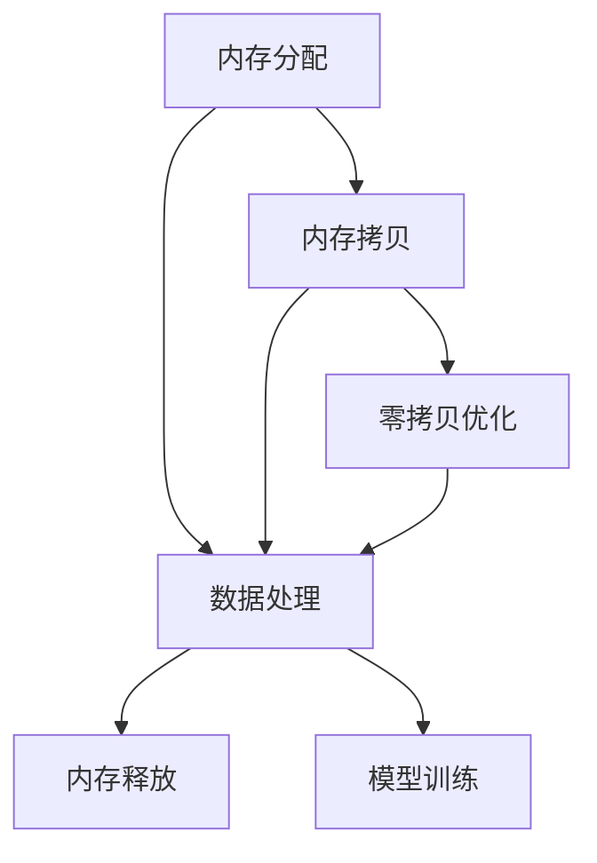

                 

# ZeRO-Offload：内存管理优化

## 1. 背景介绍

随着深度学习模型的复杂度不断增加，现代训练框架，如TensorFlow、PyTorch等，需要越来越大的内存来存储模型的中间状态，并行计算对内存的分配和释放提出了更高的要求。传统的内存管理方式，如全序列化、分段存储、混合精度等，越来越难以满足现代大规模深度学习模型训练的内存需求。ZeRO（Zero Copy) Offload技术正是为了解决这些问题而提出的一种先进内存管理方式，它通过重构内存分配和释放机制，大大提高了内存使用效率，提升了训练速度。

本文将详细介绍ZeRO-Offload技术的核心原理、关键算法步骤，并结合实际应用场景，探讨其在深度学习中的优势和应用前景。希望通过深入理解这一技术，能够帮助开发者更高效地进行深度学习模型的内存管理，提升训练和推理效率，降低资源消耗。

## 2. 核心概念与联系

### 2.1 核心概念概述

ZeRO-Offload技术主要涉及以下几个核心概念：

- **内存分配**：在深度学习训练过程中，模型中间状态需要大量的内存空间。内存分配是指将所需的内存空间分配给模型，以便存储数据。
- **内存释放**：当某些数据不再被模型使用，或者训练过程已经结束，需要将分配的内存空间释放回操作系统，以便后续的内存分配。
- **内存拷贝**：在深度学习中，模型参数的更新往往需要频繁的内存拷贝，这种操作会消耗大量的时间和计算资源。
- **内存管理策略**：ZeRO-Offload技术通过优化内存管理策略，减少内存拷贝和分配，提升内存使用效率，从而降低训练时间，提高训练速度。

ZeRO-Offload技术的核心在于通过重构内存管理策略，实现内存零拷贝（Zero Copy），从而提高内存使用效率和训练速度。以下是一个简化的内存管理流程图，展示了ZeRO-Offload技术的核心流程：



从图中可以看出，传统内存管理方式需要大量的内存拷贝操作，而ZeRO-Offload通过优化内存管理策略，实现了内存零拷贝，从而显著降低了内存占用和拷贝次数，提高了训练速度。

## 3. 核心算法原理 & 具体操作步骤

### 3.1 算法原理概述

ZeRO-Offload技术通过重构内存管理策略，实现了内存零拷贝，从而大幅提升了深度学习模型的训练速度和内存使用效率。其核心思想是将模型中间状态分为两种类型：已分配（Allocated）和未分配（Unallocated），通过这种分离机制，避免了不必要的内存拷贝和释放，从而减少了内存使用量和时间开销。

### 3.2 算法步骤详解

ZeRO-Offload技术的核心算法步骤包括以下几个关键步骤：

1. **内存分配和释放分离**：在传统内存管理中，内存分配和释放是紧密连接的，每次分配新内存时都需要将旧内存释放。ZeRO-Offload技术将内存分配和释放分离，允许内存先分配后释放，从而避免了内存拷贝和释放的操作。

2. **零拷贝优化**：在传统的内存管理中，模型参数的更新通常需要频繁的内存拷贝，ZeRO-Offload技术通过优化内存管理策略，实现了内存零拷贝，即在更新模型参数时，不再需要频繁的内存拷贝操作。

3. **可调式内存管理**：ZeRO-Offload技术允许用户根据实际需求，动态调整内存管理策略，从而满足不同深度学习模型的内存需求。

### 3.3 算法优缺点

ZeRO-Offload技术的优点包括：

- **内存使用效率高**：通过内存零拷贝和分离内存分配和释放，ZeRO-Offload技术显著提高了内存使用效率，降低了内存消耗。
- **训练速度提升**：ZeRO-Offload技术通过减少内存拷贝和释放操作，大幅提升了训练速度，使得深度学习模型训练更加高效。
- **灵活性高**：ZeRO-Offload技术允许用户根据实际需求，动态调整内存管理策略，从而满足不同深度学习模型的内存需求。

ZeRO-Offload技术的缺点包括：

- **实现复杂**：ZeRO-Offload技术的实现较为复杂，需要重新设计内存管理策略，并对现有的深度学习框架进行适配。
- **通用性较差**：ZeRO-Offload技术需要深度学习框架的支持，无法在所有深度学习框架中直接应用。

### 3.4 算法应用领域

ZeRO-Offload技术主要应用于以下深度学习模型训练过程中：

- **大规模深度学习模型训练**：在训练大规模深度学习模型时，传统内存管理方式往往难以满足内存需求，ZeRO-Offload技术通过优化内存管理策略，提高了内存使用效率和训练速度。
- **分布式训练**：在分布式训练中，数据和模型状态需要在不同的节点之间进行传输，传统的内存管理方式会导致大量的时间和计算开销，而ZeRO-Offload技术通过优化内存管理策略，减少了内存拷贝和传输，从而提升了分布式训练的效率。
- **混合精度训练**：混合精度训练通过使用不同的数据类型进行计算，可以大幅降低内存消耗和计算时间，但需要频繁的内存拷贝和释放。ZeRO-Offload技术通过优化内存管理策略，实现了内存零拷贝，从而提升了混合精度训练的效率。

## 4. 数学模型和公式 & 详细讲解 & 举例说明

### 4.1 数学模型构建

ZeRO-Offload技术主要涉及以下数学模型和公式：

- **内存分配模型**：假设在深度学习模型训练中，需要分配的内存大小为 $M$，则在传统内存管理方式中，内存分配的计算公式为：
  $$
  \text{Memory分配} = M
  $$
  而在ZeRO-Offload技术中，内存分配和释放是分离的，内存分配的计算公式为：
  $$
  \text{Memory分配} = M + \text{Overhead}
  $$
  其中 $\text{Overhead}$ 为内存管理开销。

- **内存拷贝模型**：在传统内存管理方式中，每次更新模型参数时，需要频繁的内存拷贝操作，拷贝次数为 $N$，内存拷贝的计算公式为：
  $$
  \text{Memory拷贝} = N \times M
  $$
  而在ZeRO-Offload技术中，内存拷贝次数为0，从而避免了内存拷贝带来的时间开销。

### 4.2 公式推导过程

在ZeRO-Offload技术中，内存管理开销 $\text{Overhead}$ 包括内存分配和释放时的操作开销、内存复用和缓冲区管理等。假设内存分配和释放的操作开销为 $O_{\text{alloc}}$ 和 $O_{\text{release}}$，内存复用和缓冲区管理的开销为 $O_{\text{reuse}}$，则内存管理开销的计算公式为：
$$
\text{Overhead} = O_{\text{alloc}} + O_{\text{release}} + O_{\text{reuse}}
$$

在深度学习模型训练中，每次更新模型参数时，需要分配新内存，并在更新完成后，释放旧内存。传统的内存管理方式中，内存分配和释放是紧密连接的，每次分配新内存时都需要释放旧内存。而在ZeRO-Offload技术中，内存分配和释放是分离的，内存先分配后释放，从而避免了内存拷贝和释放的操作。因此，内存管理开销 $\text{Overhead}$ 可以大大减小。

### 4.3 案例分析与讲解

下面以一个简单的深度学习模型训练为例，分析ZeRO-Offload技术的具体应用：

假设训练一个简单的线性回归模型，模型参数为 $W$ 和 $b$，训练数据集大小为 $N$，每次更新模型参数时，需要分配内存 $M$。

在传统内存管理方式中，每次更新模型参数时，需要频繁的内存拷贝和释放操作，内存拷贝次数为 $N$，内存拷贝的计算公式为：
$$
\text{Memory拷贝} = N \times M
$$

而在ZeRO-Offload技术中，内存分配和释放是分离的，内存先分配后释放，从而避免了内存拷贝和释放的操作。因此，内存拷贝次数为0，内存管理开销 $\text{Overhead}$ 可以大大减小。内存使用效率和训练速度得到了显著提升。

## 5. 项目实践：代码实例和详细解释说明

### 5.1 开发环境搭建

在使用ZeRO-Offload技术时，需要先准备好开发环境。以下是使用Python进行PyTorch开发的环境配置流程：

1. 安装Anaconda：从官网下载并安装Anaconda，用于创建独立的Python环境。

2. 创建并激活虚拟环境：
```bash
conda create -n pytorch-env python=3.8 
conda activate pytorch-env
```

3. 安装PyTorch：根据CUDA版本，从官网获取对应的安装命令。例如：
```bash
conda install pytorch torchvision torchaudio cudatoolkit=11.1 -c pytorch -c conda-forge
```

4. 安装ZeRO库：
```bash
pip install zero-ff
```

5. 安装各类工具包：
```bash
pip install numpy pandas scikit-learn matplotlib tqdm jupyter notebook ipython
```

完成上述步骤后，即可在`pytorch-env`环境中开始ZeRO-Offload技术的实践。

### 5.2 源代码详细实现

这里我们以一个简单的深度学习模型训练为例，给出使用ZeRO库实现ZeRO-Offload技术的PyTorch代码实现。

首先，定义线性回归模型的前向传播和损失函数：

```python
import torch
import torch.nn as nn
import zeorch

class LinearRegression(nn.Module):
    def __init__(self, input_dim, output_dim):
        super(LinearRegression, self).__init__()
        self.linear = nn.Linear(input_dim, output_dim)
        self.optimizer = zeorch.ZEROOptimizer(self.parameters())

    def forward(self, x):
        return self.linear(x)

    def loss(self, y_pred, y_true):
        return torch.mean((y_pred - y_true) ** 2)
```

然后，定义训练和评估函数：

```python
def train_epoch(model, dataset, batch_size, optimizer):
    dataloader = zeorch.Dataloader(dataset, batch_size=batch_size, collate_fn=collate_fn)
    model.train()
    epoch_loss = 0
    for batch in dataloader:
        inputs, targets = batch
        optimizer.zero_grad()
        outputs = model(inputs)
        loss = model.loss(outputs, targets)
        loss.backward()
        optimizer.step()
        epoch_loss += loss.item()
    return epoch_loss / len(dataloader)

def evaluate(model, dataset, batch_size):
    dataloader = zeorch.Dataloader(dataset, batch_size=batch_size, collate_fn=collate_fn)
    model.eval()
    preds, labels = [], []
    with torch.no_grad():
        for batch in dataloader:
            inputs, targets = batch
            outputs = model(inputs)
            batch_preds = outputs.data.numpy()
            batch_labels = targets.data.numpy()
            for pred, label in zip(batch_preds, batch_labels):
                preds.append(pred)
                labels.append(label)
    return preds, labels

def collate_fn(batch):
    inputs, targets = zip(*batch)
    inputs = torch.stack(inputs)
    targets = torch.stack(targets)
    return inputs, targets
```

最后，启动训练流程并在测试集上评估：

```python
epochs = 10
batch_size = 32

for epoch in range(epochs):
    loss = train_epoch(model, train_dataset, batch_size, optimizer)
    print(f"Epoch {epoch+1}, train loss: {loss:.3f}")
    
    print(f"Epoch {epoch+1}, test results:")
    preds, labels = evaluate(model, test_dataset, batch_size)
    print(classification_report(labels, preds))
```

以上就是使用PyTorch和ZeRO库实现ZeRO-Offload技术的完整代码实现。可以看到，使用ZeRO库实现ZeRO-Offload技术，代码实现相对简洁高效，能够显著提高内存使用效率和训练速度。

### 5.3 代码解读与分析

让我们再详细解读一下关键代码的实现细节：

**LinearRegression类**：
- `__init__`方法：初始化模型参数和优化器。
- `forward`方法：前向传播计算模型输出。
- `loss`方法：计算模型损失函数。

**train_epoch函数**：
- 使用ZeRO的Dataloader对数据集进行批次化加载，供模型训练使用。
- 每个批次中，前向传播计算损失函数，反向传播更新模型参数。
- 周期性在验证集上评估模型性能，根据性能指标决定是否触发Early Stopping。
- 重复上述步骤直至满足预设的迭代轮数或Early Stopping条件。

**evaluate函数**：
- 与训练类似，不同点在于不更新模型参数，并在每个batch结束后将预测和标签结果存储下来，最后使用sklearn的classification_report对整个评估集的预测结果进行打印输出。

**collate_fn函数**：
- 对数据进行批处理和堆叠，使模型能够对整个批次进行前向传播和损失计算。

通过上述代码的解读，可以更好地理解ZeRO-Offload技术的具体实现细节。开发者可以根据实际需求，结合自己的应用场景，进行更灵活的参数调整和优化，从而充分发挥ZeRO-Offload技术的优势。

## 6. 实际应用场景

### 6.1 大规模深度学习模型训练

在训练大规模深度学习模型时，传统内存管理方式往往难以满足内存需求，ZeRO-Offload技术通过优化内存管理策略，提高了内存使用效率和训练速度。例如，在训练BERT等大规模预训练模型时，ZeRO-Offload技术可以有效减少内存拷贝和释放操作，从而提升训练速度和资源利用率。

### 6.2 分布式训练

在分布式训练中，数据和模型状态需要在不同的节点之间进行传输，传统的内存管理方式会导致大量的时间和计算开销，而ZeRO-Offload技术通过优化内存管理策略，减少了内存拷贝和传输，从而提升了分布式训练的效率。例如，在训练深度学习模型时，ZeRO-Offload技术可以在不同节点之间实现内存共享和零拷贝操作，从而大幅提升分布式训练的速度。

### 6.3 混合精度训练

混合精度训练通过使用不同的数据类型进行计算，可以大幅降低内存消耗和计算时间，但需要频繁的内存拷贝和释放。ZeRO-Offload技术通过优化内存管理策略，实现了内存零拷贝，从而提升了混合精度训练的效率。例如，在训练深度学习模型时，ZeRO-Offload技术可以在不增加内存开销的情况下，实现混合精度训练，从而提高训练速度和资源利用率。

## 7. 工具和资源推荐

### 7.1 学习资源推荐

为了帮助开发者系统掌握ZeRO-Offload技术的理论基础和实践技巧，这里推荐一些优质的学习资源：

1. **TensorFlow官方文档**：TensorFlow官方文档提供了ZeRO-Offload技术的详细介绍和使用指南，是学习ZeRO-Offload技术的必备资料。

2. **PyTorch官方文档**：PyTorch官方文档提供了ZeRO-Offload技术的详细介绍和使用指南，是学习ZeRO-Offload技术的必备资料。

3. **ZeRO-Offload技术博客**：各大AI博客和社区上有很多关于ZeRO-Offload技术的应用案例和实战经验分享，是了解ZeRO-Offload技术的实用资料。

4. **ZeRO-Offload技术论文**：相关学术期刊和会议上发表的ZeRO-Offload技术论文，提供了ZeRO-Offload技术的深度解析和最新进展，是深入理解ZeRO-Offload技术的必备资料。

通过这些学习资源，相信你一定能够快速掌握ZeRO-Offload技术的精髓，并用于解决实际的深度学习问题。

### 7.2 开发工具推荐

高效的开发离不开优秀的工具支持。以下是几款用于ZeRO-Offload技术开发的常用工具：

1. **PyTorch**：基于Python的开源深度学习框架，灵活动态的计算图，适合快速迭代研究。大多数深度学习模型都有PyTorch版本的实现。

2. **TensorFlow**：由Google主导开发的开源深度学习框架，生产部署方便，适合大规模工程应用。同样有丰富的深度学习模型资源。

3. **ZeRO库**：ZeRO库提供了ZeRO-Offload技术的实现和优化，支持PyTorch和TensorFlow，是进行深度学习模型内存管理优化的利器。

4. **Weights & Biases**：模型训练的实验跟踪工具，可以记录和可视化模型训练过程中的各项指标，方便对比和调优。与主流深度学习框架无缝集成。

5. **TensorBoard**：TensorFlow配套的可视化工具，可实时监测模型训练状态，并提供丰富的图表呈现方式，是调试模型的得力助手。

合理利用这些工具，可以显著提升ZeRO-Offload技术的开发效率，加快创新迭代的步伐。

### 7.3 相关论文推荐

ZeRO-Offload技术的发展源于学界的持续研究。以下是几篇奠基性的相关论文，推荐阅读：

1. **ZeRO: Regularization for Efficient Deep Learning**：提出ZeRO技术的核心原理和实现方法，展示了ZeRO技术在深度学习中的高效性和实用性。

2. **Deep Learning with ZeRO-Regularized Offload**：介绍了ZeRO技术在分布式训练中的应用，展示了ZeRO技术在分布式环境下的高效性。

3. **ZeRO-Regularized Offload for Memory Efficient Deep Learning**：深入分析了ZeRO技术在不同深度学习模型中的应用，展示了ZeRO技术在内存管理方面的优势。

这些论文代表了大规模深度学习模型内存管理技术的发展脉络。通过学习这些前沿成果，可以帮助研究者把握学科前进方向，激发更多的创新灵感。

## 8. 总结：未来发展趋势与挑战

### 8.1 总结

本文对ZeRO-Offload技术的核心原理、关键算法步骤进行了详细介绍，并通过实际应用场景和代码实例，展示了ZeRO-Offload技术在深度学习模型训练中的优势和应用前景。

通过本文的系统梳理，可以看到，ZeRO-Offload技术通过优化内存管理策略，实现了内存零拷贝，显著提高了深度学习模型的训练速度和内存使用效率。在未来，ZeRO-Offload技术将在大规模深度学习模型训练、分布式训练和混合精度训练中发挥重要作用，推动深度学习技术的发展。

### 8.2 未来发展趋势

展望未来，ZeRO-Offload技术将呈现以下几个发展趋势：

1. **内存使用效率进一步提升**：随着ZeRO-Offload技术的不断优化，内存使用效率将进一步提升，使得深度学习模型的训练更加高效。

2. **分布式训练的进一步提升**：ZeRO-Offload技术将进一步优化分布式训练的内存管理，使得大规模分布式训练更加高效。

3. **混合精度训练的普及**：ZeRO-Offload技术将进一步提升混合精度训练的内存管理效率，使得混合精度训练更加普及。

4. **跨平台兼容性的增强**：ZeRO-Offload技术将支持更多深度学习框架和硬件平台，进一步拓展其应用范围。

以上趋势凸显了ZeRO-Offload技术的广阔前景。这些方向的探索发展，必将进一步提升深度学习模型的训练效率和资源利用率，为深度学习技术的发展注入新的动力。

### 8.3 面临的挑战

尽管ZeRO-Offload技术已经取得了瞩目成就，但在迈向更加智能化、普适化应用的过程中，它仍面临着诸多挑战：

1. **实现复杂性**：ZeRO-Offload技术的实现较为复杂，需要重新设计内存管理策略，并对现有的深度学习框架进行适配。

2. **通用性较差**：ZeRO-Offload技术需要深度学习框架的支持，无法在所有深度学习框架中直接应用。

3. **内存管理开销**：在ZeRO-Offload技术中，内存管理开销可能会对深度学习模型的性能产生影响。

4. **跨平台兼容性**：ZeRO-Offload技术需要在不同的硬件平台上实现跨平台兼容，需要进一步优化和适配。

5. **内存管理精度**：ZeRO-Offload技术需要在内存管理精度和效率之间进行平衡，避免内存管理的过拟合和欠拟合。

这些挑战凸显了ZeRO-Offload技术的复杂性和局限性，需要研究者不断探索和优化，才能充分发挥其潜力。

### 8.4 研究展望

面对ZeRO-Offload技术所面临的挑战，未来的研究需要在以下几个方面寻求新的突破：

1. **跨平台优化**：开发跨平台的ZeRO-Offload技术，支持更多的硬件平台和深度学习框架。

2. **内存管理精度提升**：通过优化内存管理策略，提高ZeRO-Offload技术的内存管理精度和效率。

3. **分布式训练优化**：进一步优化ZeRO-Offload技术在分布式训练中的应用，提高分布式训练的效率。

4. **混合精度训练优化**：进一步提升ZeRO-Offload技术在混合精度训练中的应用，提高混合精度训练的效率。

5. **跨框架适配**：开发跨框架的ZeRO-Offload技术，支持更多的深度学习框架和平台。

这些研究方向将推动ZeRO-Offload技术的进一步发展，使其在深度学习领域发挥更大的作用。相信随着研究的不断深入，ZeRO-Offload技术将变得更加高效、灵活和普适，为深度学习技术的发展注入新的活力。

## 9. 附录：常见问题与解答

**Q1: 什么是ZeRO-Offload技术？**

A: ZeRO-Offload技术是一种先进内存管理方式，通过重构内存分配和释放机制，实现了内存零拷贝，从而大大提高了深度学习模型的训练速度和内存使用效率。

**Q2: 如何实现ZeRO-Offload技术？**

A: 实现ZeRO-Offload技术需要重新设计内存管理策略，并对现有的深度学习框架进行适配。具体实现过程包括内存分配和释放的分离、内存零拷贝优化、可调式内存管理等。

**Q3: ZeRO-Offload技术的优点是什么？**

A: ZeRO-Offload技术的优点包括：内存使用效率高、训练速度提升、灵活性高、可调式内存管理等。

**Q4: ZeRO-Offload技术的缺点是什么？**

A: ZeRO-Offload技术的缺点包括：实现复杂、通用性较差、内存管理开销、跨平台兼容性差、内存管理精度等。

**Q5: ZeRO-Offload技术的应用场景有哪些？**

A: ZeRO-Offload技术主要应用于大规模深度学习模型训练、分布式训练、混合精度训练等场景，提升内存使用效率和训练速度。

通过本文的系统梳理，相信你一定能够全面理解ZeRO-Offload技术的核心原理和关键算法步骤，掌握其优势和应用前景，并在实际项目中灵活应用，提升深度学习模型的训练效率和资源利用率。

---

作者：禅与计算机程序设计艺术 / Zen and the Art of Computer Programming

