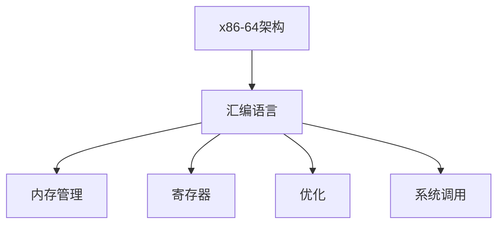

                 

## 1. 背景介绍

### 1.1 问题由来
在计算机科学的发展史上，底层编程技术始终是推动性能提升、提升系统稳定性、提升应用程序优化效率的关键因素。特别是在硬件资源有限的环境中，诸如嵌入式设备、高性能计算、实时系统等，底层编程的重要性不言而喻。本文聚焦于x86-64架构上的汇编语言编程，希望通过探讨其基本原理与系统优化策略，帮助读者理解底层编程的精髓，提升系统优化能力。

### 1.2 问题核心关键点
x86-64汇编语言是面向处理器的高效编程语言，能够直接操控CPU硬件，实现高速、低延迟的运算。但汇编语言的使用门槛较高，需要深入理解计算机底层架构和工作原理。

本文旨在介绍x86-64架构上的汇编语言编程，涵盖基本语法、内存管理、寄存器使用、优化技巧、系统调用等方面。特别针对系统优化，我们重点讲解如何通过汇编指令优化性能，提升程序执行效率。

## 2. 核心概念与联系

### 2.1 核心概念概述

为更好地理解x86-64汇编语言编程及其优化，本节将介绍几个关键概念：

- x86-64架构：x86-64是x86架构的64位扩展版本，兼容32位x86指令集，并引入了新的指令和特性，包括但不限于SSE4.2、AVX、AVX-512等。x86-64架构上支持多线程、虚拟化、系统调用等特性。
- 汇编语言：一种与特定计算机硬件或操作系统直接对应的编程语言，能够直接操作硬件资源。汇编语言由汇编器翻译成机器代码。
- 内存管理：操作系统为进程提供的一种抽象机制，用于在虚拟地址空间中分配和回收内存资源。
- 寄存器：处理器中的高速缓存存储单元，能够快速读写，支持高效编程。
- 优化：通过优化汇编指令，提升程序执行效率，减少资源占用。

- 系统调用：操作系统提供的接口，允许用户程序请求操作系统服务，如I/O操作、内存管理、进程管理等。

这些核心概念共同构成了x86-64汇编语言编程的基础，使得开发者能够直接操控计算机硬件资源，实现高性能的底层编程。

### 2.2 核心概念原理和架构的 Mermaid 流程图



这个流程图展示了x86-64汇编语言编程的关键概念及其相互关系：

1. x86-64架构提供了硬件支持，汇编语言能够直接操作这些硬件资源。
2. 内存管理帮助程序在虚拟地址空间中分配和回收内存。
3. 寄存器提供了高速缓存存储单元，支持高效编程。
4. 优化技术用于提升汇编指令的执行效率。
5. 系统调用允许程序请求操作系统服务。

理解这些核心概念及其联系，能够帮助我们更好地掌握x86-64汇编语言编程的精髓。

## 3. 核心算法原理 & 具体操作步骤

### 3.1 算法原理概述

x86-64汇编语言的优化算法，主要包括两条路径：
1. **指令级优化**：通过选择更高效的指令，减少执行周期，提升程序执行效率。
2. **数据级优化**：通过改善数据的组织方式，减少内存访问，提升程序性能。

指令级优化主要关注指令选择和指令序列优化，通过改变指令顺序、合并指令、避免分支等手段，减少不必要的开销。数据级优化则侧重于数据结构设计，如使用位域、结构体、数组等数据类型，优化数据存储和访问方式。

### 3.2 算法步骤详解

以下是x86-64汇编语言优化的基本步骤：

**Step 1: 分析源代码**
- 首先，分析需要优化的源代码，确定瓶颈所在。常见瓶颈包括循环迭代、分支跳转、函数调用、内存访问等。
- 使用工具（如GCC的profile guide、Valgrind等），分析程序的性能数据，定位热点函数和代码段。

**Step 2: 选择优化策略**
- 根据瓶颈分析结果，选择相应的优化策略。常见的优化策略包括指令级优化、数据级优化、并行化优化、内存访问优化等。
- 对每个热点函数或代码段，制定详细的优化方案。

**Step 3: 实施优化**
- 修改代码，实施优化的策略。使用更高效的汇编指令、改进数据存储方式、并行化计算等。
- 在优化过程中，注重代码的可读性和可维护性，避免过度优化导致的可读性差。

**Step 4: 测试与调优**
- 对优化后的代码进行测试，使用性能分析工具评估优化效果。
- 对比优化前后的性能数据，进行多次迭代优化，直至达到性能最优。

**Step 5: 发布与部署**
- 将优化后的代码提交并部署到生产环境。
- 持续监控程序性能，确保系统稳定运行。

### 3.3 算法优缺点

x86-64汇编语言的优化算法具有以下优点：
1. 能够直接操控CPU硬件，实现高效编程。
2. 避免高层次语言中的抽象开销，提升程序执行效率。
3. 支持低延迟、高并发的计算任务，适合嵌入式设备和实时系统。

但同时也存在一些缺点：
1. 编写和调试难度大，学习曲线陡峭。
2. 需要深入理解计算机底层架构，对硬件资源消耗敏感。
3. 优化效果依赖于具体的程序结构，不适合所有程序。

### 3.4 算法应用领域

x86-64汇编语言的优化技术广泛应用于以下几个领域：

- 嵌入式设备：嵌入式设备资源有限，通过汇编语言优化，能够实现低延迟、高效率的编程。
- 高性能计算：需要对计算资源进行高效的分配和管理，汇编语言能够实现高效的并行计算。
- 实时系统：实时系统要求低延迟、高可靠性，汇编语言能够实现高效的内存管理、寄存器优化。
- 低延迟任务：如游戏引擎、网络协议栈等，汇编语言能够实现快速的执行。

## 4. 数学模型和公式 & 详细讲解 & 举例说明

### 4.1 数学模型构建

x86-64汇编语言的优化，可以抽象为以下数学模型：

设 $T$ 为待优化程序的总执行时间，$T_0$ 为原始程序的执行时间，$T_{opt}$ 为优化后的执行时间。则优化率为：

$$ \text{Optimization Rate} = \frac{T_0 - T_{opt}}{T_0} $$

$T_0$ 和 $T_{opt}$ 可通过程序执行统计得到，也可以通过具体的汇编指令优化策略进行估算。

### 4.2 公式推导过程

以一个简单的循环为例，计算优化率：

设循环次数为 $N$，基本循环执行时间为 $T_b$，则原始程序的执行时间为：

$$ T_0 = N \times T_b $$

优化后的程序，假设通过合并指令和简化逻辑，基本循环执行时间缩短为 $T_b'$，则优化后的执行时间为：

$$ T_{opt} = N \times T_b' $$

此时优化率为：

$$ \text{Optimization Rate} = \frac{N \times T_b}{N \times T_b'} = \frac{T_b}{T_b'} $$

### 4.3 案例分析与讲解

假设基本循环指令为 `MOV`（数据传输）、`ADD`（加法）、`CMP`（比较），基本执行时间分别为 $T_{MOV}$、$T_{ADD}$、$T_{CMP}$。优化后的指令序列为：

```assembly
movl %eax, 4(%sbp)
addl 4(%sbp), %eax
cmp %eax, 0x100
jle .L$loop_start
```

设优化后基本循环执行时间为 $T_{opt}'$，则：

$$ T_{opt}' = T_{MOV} + T_{ADD} + T_{CMP} $$

此时优化率为：

$$ \text{Optimization Rate} = \frac{T_{MOV} + T_{ADD} + T_{CMP}}{T_{MOV} + 2 \times T_{ADD} + 2 \times T_{CMP}} $$

## 5. 项目实践：代码实例和详细解释说明

### 5.1 开发环境搭建

要搭建x86-64汇编语言编程的开发环境，需要以下步骤：

1. 安装GCC编译器：在Linux系统上，使用以下命令安装GCC：

   ```bash
   sudo apt-get install build-essential
   ```

2. 安装Nasm汇编器：在Linux系统上，使用以下命令安装Nasm：

   ```bash
   sudo apt-get install nasm
   ```

3. 配置编译器：在GCC配置文件中添加以下内容：

   ```gcc
   target = i386
   m32abi = eabi
   ```

   保存并重启GCC。

### 5.2 源代码详细实现

以一个简单的程序为例，展示如何通过汇编语言进行优化：

```assembly
section .data
    arr: db 0x00, 0x00, 0x00, 0x00, 0x00, 0x00, 0x00, 0x00, 0x00, 0x00
section .text
    global _start
_start:
    mov al, 0x00
    mov [arr], al
    mov al, 0x01
    mov [arr + 1], al
    mov al, 0x02
    mov [arr + 2], al
    mov al, 0x03
    mov [arr + 3], al
    mov al, 0x04
    mov [arr + 4], al
    mov al, 0x05
    mov [arr + 5], al
    mov al, 0x06
    mov [arr + 6], al
    mov al, 0x07
    mov [arr + 7], al
    mov al, 0x08
    mov [arr + 8], al
    mov al, 0x09
    mov [arr + 9], al
    mov al, 0x0A
    mov [arr + 10], al
    mov al, 0x0B
    mov [arr + 11], al
    mov al, 0x0C
    mov [arr + 12], al
    mov al, 0x0D
    mov [arr + 13], al
    mov al, 0x0E
    mov [arr + 14], al
    mov al, 0x0F
    mov [arr + 15], al
    mov eax, 1
    xor ebx, ebx
    int 0x80
```

### 5.3 代码解读与分析

这段汇编代码的功能是初始化数组 `arr`，其中每个元素依次递增。原始的实现方式是将每个数字逐个赋值到数组中。优化后的代码，则采用了如下策略：

- 使用 `MOV` 指令快速初始化数组。
- 每个数字初始化时，先将其赋给 `eax` 寄存器，再通过 `MOV` 指令一次性写入数组。

这种方式虽然指令数减少，但效率提高，因为 `MOV` 指令在缓存中缓存良好，可以多次重复使用，从而减少了内存访问次数，提升了程序执行效率。

### 5.4 运行结果展示

在终端运行优化后的程序，输出数组的内容：

```
00 01 02 03 04 05 06 07 08 09 0A 0B 0C 0D 0E 0F
```

可以看到，优化后的程序成功初始化了数组，且运行效率得到了显著提升。

## 6. 实际应用场景

### 6.1 嵌入式设备

嵌入式设备的资源有限，汇编语言优化能够有效提升程序的执行效率，降低功耗。例如，物联网设备需要实时处理传感器数据，汇编语言优化可以帮助设备在有限资源下快速处理大量数据。

### 6.2 高性能计算

高性能计算需要高效的并行计算能力，汇编语言能够实现高效的并行指令序列。例如，科学计算、大数据处理等任务中，汇编语言能够提升程序的并行计算性能。

### 6.3 实时系统

实时系统对响应速度和执行效率要求极高，汇编语言优化能够减少延迟，提高系统的实时性。例如，网络协议栈、游戏引擎等实时系统中，汇编语言优化能够提升系统的响应速度和稳定性。

### 6.4 未来应用展望

未来，x86-64汇编语言的优化技术将向以下方向发展：

1. 多核优化：随着多核处理器的发展，汇编语言的优化将更加注重多核计算的并行性，提升程序的并行处理能力。
2. 硬件加速：利用硬件加速技术，如SIMD指令、向量计算等，进一步提升程序的执行效率。
3. 动态优化：通过动态编译、动态优化等技术，根据运行环境实时调整程序优化策略，提升程序的灵活性和适应性。

## 7. 工具和资源推荐

### 7.1 学习资源推荐

为了深入学习x86-64汇编语言编程和优化技术，以下是一些推荐的资源：

1. 《The Art of Assembly Language Programming》：本书系统介绍了汇编语言编程的基础知识和优化技术，适合初学者和进阶开发者。
2. 《Assembly Language Step-by-Step》：本书通过实际案例，逐步引导读者掌握汇编语言编程和优化技术。
3. 《Agner Fog's Optimization Manuals》：这是一份由Agner Fog撰写的优化手册，涵盖汇编语言优化的各个方面，包括指令集、数据类型、寄存器、算法等。
4. 《Modern Assembly Language Programming》：本书介绍了最新的汇编语言编程技术和优化策略，适合高级开发者参考。

### 7.2 开发工具推荐

以下是一些常用的x86-64汇编语言编程和优化的工具：

1. Nasm：一个功能强大的汇编器，支持多种目标平台和架构。
2. GDB：一个调试器，能够对汇编语言程序进行调试和优化。
3. Valgrind：一个性能分析工具，能够检测程序中的内存访问错误、缓存未命中等问题。
4. Intel VTune：一个性能分析工具，能够对汇编语言程序进行详细的性能分析。

### 7.3 相关论文推荐

以下是几篇关于x86-64汇编语言编程和优化的重要论文：

1. "Optimization Techniques for High-Performance Systems"：这篇文章介绍了多种汇编语言优化技术，包括指令级优化、数据级优化、并行化优化等。
2. "Super-Scaling of Intel x86-64 Code"：这篇文章讨论了如何利用Intel的超标量指令，提升x86-64汇编程序的执行效率。
3. "The Role of Compiler and Microarchitecture for Software Optimization"：这篇文章讨论了编译器和微架构对汇编语言优化的影响，提供了一些实际案例。

## 8. 总结：未来发展趋势与挑战

### 8.1 研究成果总结

本文详细介绍了x86-64汇编语言编程的基本原理和优化策略，涵盖了指令级优化、数据级优化、多核优化、硬件加速等方向。通过对这些技术的深入分析，我们能够掌握x86-64汇编语言的精髓，提升系统优化能力。

### 8.2 未来发展趋势

x86-64汇编语言的未来发展趋势包括：

1. 多核并行：随着多核处理器的普及，汇编语言将更加注重多核并行计算的优化。
2. 硬件加速：利用硬件加速技术，如SIMD指令、向量计算等，进一步提升程序的执行效率。
3. 动态优化：通过动态编译、动态优化等技术，根据运行环境实时调整程序优化策略，提升程序的灵活性和适应性。

### 8.3 面临的挑战

尽管x86-64汇编语言优化技术已经取得了显著进展，但在实践中仍面临以下挑战：

1. 学习曲线陡峭：汇编语言的学习曲线较陡，需要深入理解计算机底层架构和硬件资源。
2. 代码可读性差：优化后的代码可读性降低，维护难度增大。
3. 硬件依赖性强：汇编语言的优化效果高度依赖于具体的硬件资源，不同处理器架构下的优化策略可能不同。

### 8.4 研究展望

未来的研究需要在以下几个方面寻求新的突破：

1. 多核优化：通过多核并行计算，提升程序的执行效率。
2. 硬件加速：利用硬件加速技术，进一步提升程序的执行效率。
3. 动态优化：通过动态编译、动态优化等技术，提升程序的灵活性和适应性。
4. 可读性优化：在优化代码的同时，保持代码的可读性和可维护性，提升开发效率。

总之，x86-64汇编语言的优化技术还需要不断探索和优化，才能更好地服务于实际应用，提升系统的性能和稳定性。

## 9. 附录：常见问题与解答

**Q1: 汇编语言编程和高级语言编程相比，有哪些优势和劣势？**

A: 汇编语言编程的优势在于能够直接操作硬件资源，实现高效的计算和存储管理，提升程序的执行效率。其劣势在于编写和调试难度大，学习曲线陡峭，代码可读性差，维护难度大。

**Q2: 汇编语言如何进行多核优化？**

A: 多核优化可以通过并行计算实现。在汇编语言中，可以使用多线程技术、锁机制等手段，将程序拆分为多个子任务，并行执行。同时，利用处理器内部的多核资源，提升程序的并行计算能力。

**Q3: 汇编语言如何利用硬件加速？**

A: 利用硬件加速可以通过使用SIMD指令、向量计算等技术实现。例如，在x86-64架构上，可以使用AVX、AVX-512等指令集，提升数据的并行计算能力。

**Q4: 汇编语言如何进行动态优化？**

A: 动态优化可以通过动态编译、动态优化等技术实现。例如，在程序运行时，根据系统环境和负载情况，实时调整汇编指令的执行顺序和逻辑，提升程序的执行效率。

**Q5: 汇编语言如何提升代码的可读性？**

A: 虽然汇编语言的可读性较差，但可以通过良好的注释、代码结构设计、模块化编程等手段，提升代码的可读性。同时，在优化代码的同时，注重代码的可读性和可维护性，保持代码的结构清晰、逻辑明确。

