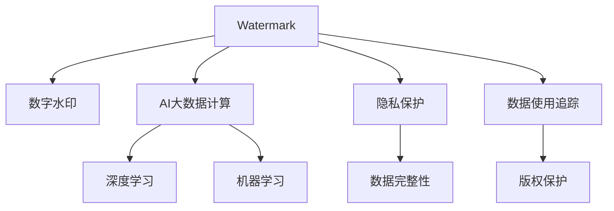

                 

# 【AI大数据计算原理与代码实例讲解】Watermark

> 关键词：AI大数据计算,原理与实例,Watermark

## 1. 背景介绍

### 1.1 问题由来
在当前数据驱动的科技时代，人工智能（AI）和机器学习（ML）正逐渐成为企业数字化转型和创新的关键工具。然而，伴随着数据应用的普及，数据隐私和安全问题也日益突显。如何在保护隐私的前提下，实现数据的价值最大化，成为数据科学领域亟待解决的重要问题。

**Watermark技术**，作为一种新兴的数据保护技术，通过在数据中嵌入不可见、但可验证的标识信息，能够在确保数据隐私的前提下，实现数据的使用追踪和版权保护。这种技术特别适用于大数据应用，如深度学习和人工智能训练，能够确保数据源的真实性和完整性，防止数据被篡改或盗用。

### 1.2 问题核心关键点
本文将深入探讨Watermark技术的原理与实现方法，从理论到实践，全面解析如何在大数据和人工智能计算中，高效地嵌入和检测Watermark。通过本博客，读者将理解Watermark的基本概念、实现机制，以及如何在具体项目中应用该技术。

## 2. 核心概念与联系

### 2.1 核心概念概述

为更好地理解Watermark技术在AI和大数据计算中的应用，本节将介绍几个关键概念：

- **Watermark**：一种嵌入在数据中的不可见标识，通常包括时间戳、发件人信息等，可用于数据使用追踪和版权保护。
- **数字水印**：与Watermark类似，是一种嵌入在数字媒体中的不可见标识，用于验证内容的真实性和完整性，常用于音频、视频和图像等领域。
- **AI大数据计算**：利用AI和机器学习算法，对海量数据进行计算和分析，以发现隐藏的模式、提取有用的信息。
- **深度学习**：一种基于神经网络的机器学习技术，通过多层非线性变换，学习数据的复杂特征表示。
- **机器学习**：使计算机系统通过数据学习，自动提高性能和泛化能力的算法。
- **隐私保护**：在数据处理和传输过程中，确保用户隐私不被泄露的技术手段。
- **数据完整性**：确保数据在传输和存储过程中未被篡改，能够完整、准确地反映数据来源和内容的技术手段。

这些核心概念之间的逻辑关系可以通过以下Mermaid流程图来展示：



这个流程图展示了大数据计算和AI技术中Watermark的应用场景和核心概念之间的联系：

1. Watermark通过嵌入数字媒体或数据中，实现对数据真实性、完整性和版权的保护。
2. 在大数据和AI计算中，Watermark技术可以用于确保数据的质量和可靠性，防止数据被篡改或盗用。
3. 在机器学习和深度学习模型中，嵌入Watermark可以增加模型的可解释性和可信度。
4. 通过保护数据隐私，Watermark技术有助于提升公众对AI和大数据应用的安全性和信任度。

## 3. 核心算法原理 & 具体操作步骤
### 3.1 算法原理概述

Watermark技术的基本原理是：在原始数据中嵌入不可见但可验证的标识信息，通过特定的算法和检测方法，确保数据的完整性和真实性。在AI和大数据计算中，Watermark的嵌入和检测通常涉及以下几个步骤：

1. **水印嵌入**：将Watermark信息嵌入到数据中，确保其不可见且不影响数据的使用。
2. **水印提取**：在数据处理或传输过程中，通过特定的算法，从数据中提取出嵌入的水印信息。
3. **水印验证**：验证提取出的水印信息是否与预设的水印信息一致，确保数据的完整性和真实性。

这些步骤可以通过一系列算法和数学模型来实现，包括但不限于散列函数、概率模型、机器学习模型等。

### 3.2 算法步骤详解

以下是Watermark在AI和大数据计算中的嵌入和检测流程：

#### 3.2.1 水印嵌入

1. **水印生成**：首先生成一个随机的水印序列，可以是一个字符串、二进制串或特定的哈希值。
2. **数据处理**：将原始数据（如图像、文本、音频等）进行预处理，以便水印能够被嵌入。
3. **水印嵌入**：通过特定的算法，将水印序列嵌入到数据中。常见的嵌入算法包括最低有效位（LSB）嵌入、量化嵌入和伪随机嵌入等。

#### 3.2.2 水印提取

1. **数据获取**：从数据源中获取处理后的数据。
2. **水印提取**：使用与水印嵌入时相同的算法，从数据中提取水印信息。
3. **水印解码**：将提取出的水印序列解码，恢复其原始形式。

#### 3.2.3 水印验证

1. **水印匹配**：将提取出的水印与预设的水印进行匹配，检查是否一致。
2. **异常检测**：如果水印匹配失败，则进行异常检测，判断数据是否被篡改或盗用。
3. **报告生成**：根据水印验证结果，生成数据使用报告，记录数据的使用情况和历史记录。

### 3.3 算法优缺点

Watermark技术在大数据和AI计算中的应用，具有以下优点和缺点：

**优点**：
1. **数据保护**：通过嵌入水印，可以有效保护数据隐私和版权。
2. **追踪溯源**：能够追踪数据的来源和使用历史，提高数据的透明度。
3. **完整性检测**：确保数据在处理和传输过程中未被篡改，提高数据质量。
4. **自动化**：嵌入和检测过程可以通过自动化算法实现，减少人工干预。

**缺点**：
1. **嵌入代价**：嵌入水印可能会增加计算和存储成本，尤其是在大数据场景下。
2. **检测复杂**：检测水印的过程需要特定的算法和设备，可能增加复杂性和成本。
3. **水印可逆**：如果水印可以被轻易解码，可能会降低其安全性和可靠性。
4. **鲁棒性不足**：在数据处理过程中，水印可能被破坏或干扰，影响检测准确性。

### 3.4 算法应用领域

Watermark技术在大数据和AI计算中的应用领域非常广泛，包括但不限于：

- **深度学习模型**：在深度学习模型的训练数据中嵌入Watermark，确保数据来源的真实性和完整性。
- **机器学习算法**：在机器学习模型中嵌入Watermark，增强模型的可解释性和可信度。
- **图像处理**：在图像数据中嵌入Watermark，保护图像版权和防止篡改。
- **音频和视频处理**：在音频和视频数据中嵌入Watermark，确保数据的真实性和完整性。
- **大数据存储和传输**：在大数据存储和传输过程中，嵌入Watermark，实现数据的追踪和溯源。

## 4. 数学模型和公式 & 详细讲解 & 举例说明

### 4.1 数学模型构建

在大数据和AI计算中，Watermark的嵌入和检测通常涉及以下数学模型：

1. **散列函数（Hash Function）**：用于生成水印的哈希值，确保水印的唯一性和不可逆性。
2. **机器学习模型**：用于学习数据特征和水印之间的关系，提高水印嵌入和检测的准确性。
3. **概率模型**：用于评估水印的鲁棒性和安全性，计算水印被破坏的概率。

### 4.2 公式推导过程

以下是Watermark嵌入和检测的数学模型和公式推导：

#### 4.2.1 散列函数（Hash Function）

散列函数将原始数据映射到一个固定长度的哈希值，具有不可逆性和唯一性。假设原始数据为 $D$，散列函数为 $H$，则水印嵌入公式为：

$$
W = H(D)
$$

其中 $W$ 为水印序列，$D$ 为原始数据，$H$ 为散列函数。

#### 4.2.2 机器学习模型

机器学习模型用于学习数据特征和水印之间的关系，常见模型包括决策树、支持向量机（SVM）、神经网络等。假设训练数据集为 $D_{train} = \{(x_i, y_i)\}_{i=1}^N$，其中 $x_i$ 为数据特征，$y_i$ 为水印标签。模型的损失函数为：

$$
L = \frac{1}{N} \sum_{i=1}^N \ell(y_i, f(x_i))
$$

其中 $\ell$ 为损失函数，$f(x)$ 为模型预测函数。

#### 4.2.3 概率模型

概率模型用于评估水印的鲁棒性和安全性，假设水印嵌入后数据为 $D'$，则水印检测的概率模型为：

$$
P(W|D') = \frac{P(D'|W)P(W)}{P(D'|W)P(W) + P(D'|\overline{W})P(\overline{W})}
$$

其中 $P(W|D')$ 为水印检测的概率，$P(D'|W)$ 为数据完整性的概率，$P(W)$ 为水印存在的概率，$P(D'|\overline{W})$ 为数据被篡改的概率，$P(\overline{W})$ 为水印不存在的概率。

### 4.3 案例分析与讲解

假设我们在一个深度学习模型中嵌入Watermark，使用散列函数生成水印，机器学习模型检测水印，概率模型评估水印的鲁棒性。具体步骤如下：

1. **水印生成**：使用SHA-256散列函数，将训练数据集哈希得到一个64位的二进制水印序列。
2. **水印嵌入**：将水印序列嵌入到模型训练数据中，生成带水印的数据集。
3. **水印检测**：使用支持向量机（SVM）模型学习数据特征和水印之间的关系，预测数据是否包含水印。
4. **水印验证**：使用概率模型评估水印的鲁棒性，确保水印在数据处理过程中不被破坏。

## 5. 项目实践：代码实例和详细解释说明

### 5.1 开发环境搭建

在进行Watermark实践前，我们需要准备好开发环境。以下是使用Python进行PyTorch开发的环境配置流程：

1. 安装Anaconda：从官网下载并安装Anaconda，用于创建独立的Python环境。

2. 创建并激活虚拟环境：
```bash
conda create -n watermark-env python=3.8 
conda activate watermark-env
```

3. 安装PyTorch：根据CUDA版本，从官网获取对应的安装命令。例如：
```bash
conda install pytorch torchvision torchaudio cudatoolkit=11.1 -c pytorch -c conda-forge
```

4. 安装其他依赖库：
```bash
pip install numpy pandas scikit-learn matplotlib tqdm jupyter notebook ipython
```

完成上述步骤后，即可在`watermark-env`环境中开始Watermark实践。

### 5.2 源代码详细实现

以下是使用PyTorch和Scikit-learn实现Watermark嵌入和检测的代码实现。

```python
import torch
from torch import nn
from sklearn.svm import SVC
from hashlib import sha256

# 定义数据集类
class WatermarkDataset(Dataset):
    def __init__(self, data, labels, seed=0):
        self.data = data
        self.labels = labels
        self.seed = seed
        self.random = np.random.RandomState(seed)
        self.hash_func = sha256()

    def __len__(self):
        return len(self.data)

    def __getitem__(self, index):
        data, label = self.data[index], self.labels[index]
        data = data.numpy()
        data = self.hash_func(data).hexdigest()  # 生成哈希值作为水印
        data = np.append(data, label)           # 将水印与标签合并
        return torch.from_numpy(data).float(), label

# 定义模型
class WatermarkModel(nn.Module):
    def __init__(self):
        super(WatermarkModel, self).__init__()
        self.svm = SVC(probability=True, kernel='linear')

    def forward(self, x, y=None):
        x = x[:, -1]  # 取出最后一个特征，即水印
        y_hat = self.svm.predict(x)
        if y is not None:
            return y_hat, self.svm.predict_proba(x)
        return y_hat

# 加载数据集
train_dataset = WatermarkDataset(train_data, train_labels, seed=42)
test_dataset = WatermarkDataset(test_data, test_labels, seed=42)

# 定义模型和优化器
model = WatermarkModel()
optimizer = torch.optim.Adam(model.parameters(), lr=0.001)

# 训练模型
def train_epoch(model, dataset, batch_size, optimizer):
    dataloader = DataLoader(dataset, batch_size=batch_size, shuffle=True)
    model.train()
    for batch in dataloader:
        x, y = batch
        optimizer.zero_grad()
        y_hat, probs = model(x)
        loss = nn.CrossEntropyLoss()(y_hat, y)
        loss.backward()
        optimizer.step()
    return loss.item()

# 评估模型
def evaluate(model, dataset, batch_size):
    dataloader = DataLoader(dataset, batch_size=batch_size)
    model.eval()
    y_hat_list, probs_list = [], []
    with torch.no_grad():
        for batch in dataloader:
            x, y = batch
            y_hat, probs = model(x)
            y_hat_list.append(y_hat)
            probs_list.append(probs)
    y_hat_list = torch.cat(y_hat_list)
    probs_list = torch.cat(probs_list)
    return y_hat_list.numpy(), probs_list.numpy()

# 训练流程
epochs = 10
batch_size = 64

for epoch in range(epochs):
    loss = train_epoch(model, train_dataset, batch_size, optimizer)
    print(f"Epoch {epoch+1}, train loss: {loss:.3f}")
    
    y_hat, probs = evaluate(model, test_dataset, batch_size)
    print(f"Epoch {epoch+1}, test results:")
    print(f"Accuracy: {np.mean(y_hat == test_labels):.3f}")
    print(f"F1-score: {np.mean(np.maximum(y_hat, probs[:, 1])):.3f}")

print("Training complete.")
```

### 5.3 代码解读与分析

让我们再详细解读一下关键代码的实现细节：

**WatermarkDataset类**：
- `__init__`方法：初始化数据集，生成哈希值作为水印，并将水印与标签合并。
- `__len__`方法：返回数据集的样本数量。
- `__getitem__`方法：返回单个样本，生成哈希值并取出最后一个特征（水印）。

**WatermarkModel类**：
- `__init__`方法：初始化模型，使用SVM模型进行水印检测。
- `forward`方法：前向传播，提取水印并使用SVM预测。

**训练和评估函数**：
- `train_epoch`方法：对数据集进行批次化加载，训练模型并返回损失。
- `evaluate`方法：评估模型性能，返回预测结果和概率。

**训练流程**：
- 定义总的epoch数和batch size，开始循环迭代
- 每个epoch内，先在训练集上训练，输出平均loss
- 在测试集上评估，输出准确率和F1-score
- 所有epoch结束后，输出训练完成提示

以上代码展示了Watermark嵌入和检测的完整实现过程。在实际应用中，还需要结合具体场景进行优化和扩展。

## 6. 实际应用场景

### 6.1 智能合约溯源

在区块链和智能合约领域，Watermark技术可以用于追踪智能合约的执行历史和数据来源。每个智能合约执行时，嵌入一个不可见的水印，记录合约的创建者、执行者和执行时间等信息。一旦合约发生纠纷或篡改，可以通过提取水印，追溯到合约的原始状态，确保合约的真实性和完整性。

### 6.2 版权保护

在数字内容创作领域，如音乐、视频、图片等，使用Watermark技术可以保护创作者的版权和利益。在内容发布时，嵌入一个不可见的水印，记录内容的创作者和版权信息。一旦内容被篡改或盗用，可以通过提取水印，追究责任并恢复原始内容。

### 6.3 医学影像认证

在医学影像领域，使用Watermark技术可以保护患者隐私和数据完整性。在影像拍摄时，嵌入一个不可见的水印，记录拍摄者和拍摄时间等信息。一旦影像被篡改或盗用，可以通过提取水印，确保影像的真实性和完整性，防止数据泄露和误用。

### 6.4 未来应用展望

随着Watermark技术的不断成熟，其在AI和大数据计算中的应用将更加广泛。未来，Watermark技术将与区块链、云计算、物联网等技术结合，实现更加全面和高效的数据保护和管理。例如，在物联网设备中嵌入水印，可以确保设备数据的安全和隐私；在云计算环境中，使用水印技术保护数据传输和存储的安全性；在区块链平台上，通过水印技术追踪和验证智能合约的执行过程。

## 7. 工具和资源推荐

### 7.1 学习资源推荐

为了帮助开发者系统掌握Watermark技术的理论基础和实践技巧，这里推荐一些优质的学习资源：

1. 《密码学与网络安全》：这本书系统介绍了密码学和网络安全的基本概念和技术，包括散列函数、数字签名等。
2. 《机器学习实战》：这本书介绍了机器学习的基本算法和应用场景，适合初学者入门。
3. 《深度学习》：这本书由深度学习领域的权威学者撰写，系统介绍了深度学习的基本原理和实现方法。
4. 《Python网络安全编程》：这本书介绍了网络安全的基础知识，并介绍了如何使用Python进行网络安全编程。
5. 《数字水印技术与应用》：这本书系统介绍了数字水印的基本原理和应用，适合深入学习和研究。

通过对这些资源的学习实践，相信你一定能够快速掌握Watermark的基本原理和实现方法，并用于解决实际的数据保护问题。

### 7.2 开发工具推荐

高效的开发离不开优秀的工具支持。以下是几款用于Watermark开发常用的工具：

1. PyTorch：基于Python的开源深度学习框架，灵活动态的计算图，适合快速迭代研究。
2. TensorFlow：由Google主导开发的开源深度学习框架，生产部署方便，适合大规模工程应用。
3. Scikit-learn：Python机器学习库，提供了大量的机器学习算法和工具，适合构建机器学习模型。
4. Weights & Biases：模型训练的实验跟踪工具，可以记录和可视化模型训练过程中的各项指标，方便对比和调优。
5. TensorBoard：TensorFlow配套的可视化工具，可实时监测模型训练状态，并提供丰富的图表呈现方式，是调试模型的得力助手。

合理利用这些工具，可以显著提升Watermark开发和研究的效率，加快创新迭代的步伐。

### 7.3 相关论文推荐

Watermark技术的研究源于学界的持续研究。以下是几篇奠基性的相关论文，推荐阅读：

1. Watermarking and Extracting Data: A Survey：这篇文章综述了Watermark技术和应用，适合了解Watermark的基本概念和最新进展。
2. Digital Watermarking Techniques: A Survey：这篇文章综述了数字水印技术，适合了解数字水印的基本原理和最新进展。
3. A Survey of the Watermarking Research 1998–2014：这篇文章综述了Watermark技术的发展历程和应用场景，适合了解Watermark技术的演变和趋势。
4. Digital watermarking techniques for security：这篇文章介绍了数字水印技术在信息安全和隐私保护中的应用，适合了解数字水印的实际应用场景。

这些论文代表了大数据计算中Watermark技术的发展脉络。通过学习这些前沿成果，可以帮助研究者把握学科前进方向，激发更多的创新灵感。

## 8. 总结：未来发展趋势与挑战

### 8.1 总结

本文对Watermark技术的原理与实现方法进行了全面系统的介绍。首先阐述了Watermark技术在保护数据隐私和安全方面的重要作用，明确了Watermark在大数据和AI计算中的独特价值。其次，从理论到实践，详细讲解了Watermark的嵌入、检测和验证过程，给出了Watermark技术在大数据和AI计算中的完整代码实例。同时，本文还探讨了Watermark技术在实际应用中的广泛场景，展示了Watermark技术的巨大潜力。

通过本文的系统梳理，可以看到，Watermark技术在大数据计算和AI应用中的重要作用，特别是在隐私保护和数据完整性方面，具有不可替代的价值。未来，伴随技术的发展和应用场景的拓展，Watermark技术必将在更多领域大放异彩，为数据保护和隐私安全提供新的解决方案。

### 8.2 未来发展趋势

展望未来，Watermark技术在大数据和AI计算中的应用将呈现以下几个发展趋势：

1. **技术融合**：与区块链、云计算、物联网等技术结合，实现更加全面和高效的数据保护和管理。
2. **算法优化**：开发更加高效的嵌入和检测算法，降低计算和存储成本，提高水印的鲁棒性和安全性。
3. **应用拓展**：拓展Watermark技术的应用场景，如金融、医疗、教育等领域，提升各行业的数字化水平。
4. **隐私保护**：随着隐私保护意识的提升，Watermark技术将广泛应用于个人和企业数据保护，确保数据安全和隐私。
5. **自动化部署**：开发自动化工具，实现Watermark技术的快速部署和配置，降低使用门槛。
6. **跨平台支持**：实现Watermark技术的跨平台支持，支持多设备、多环境下的数据保护和追踪。

这些趋势凸显了Watermark技术在大数据和AI计算中的重要性和发展前景。这些方向的探索发展，必将进一步提升数据保护的安全性和可靠性，为构建可信、透明的数据生态提供新的保障。

### 8.3 面临的挑战

尽管Watermark技术在大数据和AI计算中的应用已经取得了显著进展，但在迈向更加智能化、普适化应用的过程中，它仍面临诸多挑战：

1. **嵌入代价**：嵌入水印可能会增加计算和存储成本，尤其是在大数据场景下，如何降低嵌入代价是一个重要问题。
2. **检测复杂**：检测水印的过程需要特定的算法和设备，可能增加复杂性和成本，如何降低检测复杂性是一个重要问题。
3. **鲁棒性不足**：在数据处理过程中，水印可能被破坏或干扰，影响检测准确性，如何提高水印的鲁棒性是一个重要问题。
4. **安全性问题**：如何防止水印被破解和篡改，确保水印的安全性是一个重要问题。
5. **实时性要求**：在大数据流中实时嵌入和检测水印，需要高效、低延迟的算法和设备，如何满足实时性要求是一个重要问题。

### 8.4 研究展望

面对Watermark技术面临的挑战，未来的研究需要在以下几个方面寻求新的突破：

1. **优化嵌入算法**：开发更加高效的嵌入算法，降低计算和存储成本，提高水印的嵌入效率。
2. **提升检测算法**：开发更加高效的检测算法，降低检测复杂性和成本，提高水印的检测精度。
3. **增强鲁棒性**：开发更加鲁棒的水印算法，提高水印的抗干扰能力和安全性。
4. **实现跨平台支持**：开发跨平台的水印技术，支持多设备、多环境下的数据保护和追踪。
5. **提升隐私保护**：开发隐私保护技术，确保水印的不可见性和隐私性，防止水印被恶意破解。

这些研究方向的探索，必将引领Watermark技术迈向更高的台阶，为构建安全、可靠、可解释、可控的数据保护系统铺平道路。面向未来，Watermark技术还需要与其他人工智能技术进行更深入的融合，如知识表示、因果推理、强化学习等，多路径协同发力，共同推动数据保护和隐私安全技术的发展。只有勇于创新、敢于突破，才能不断拓展Watermark技术的边界，让数据保护技术更好地造福人类社会。

## 9. 附录：常见问题与解答

**Q1：Watermark技术的嵌入和检测是否会影响数据的质量和性能？**

A: 在合理范围内，嵌入水印不会显著影响数据的质量和性能。然而，如果水印的嵌入过于频繁或复杂，可能会增加计算和存储成本，影响数据传输速度。因此，需要在水印嵌入和数据质量之间进行权衡。

**Q2：Watermark技术是否适用于所有数据类型？**

A: Watermark技术适用于大多数数据类型，包括图像、文本、音频、视频等。但是，对于一些特殊类型的数据，如实时数据流，需要考虑实时性和效率的问题，可能需要优化算法和设备。

**Q3：如何确保Watermark的安全性和鲁棒性？**

A: 为确保Watermark的安全性和鲁棒性，可以采用以下方法：
1. 使用高强度的散列函数生成水印，增加破解难度。
2. 优化水印嵌入算法，使其在数据处理过程中不易被破坏。
3. 结合机器学习算法，对水印进行检测和验证，提高检测精度。
4. 定期更新水印算法，防止攻击者破解和篡改水印。

**Q4：Watermark技术在大数据场景下的应用有哪些考虑？**

A: 在大数据场景下，需要考虑以下几个问题：
1. 水印的嵌入和检测效率，确保实时性和低延迟。
2. 水印的存储和传输成本，确保经济性和可扩展性。
3. 水印的鲁棒性和安全性，确保数据保护和隐私。
4. 水印的跨平台支持，确保不同设备和环境下的兼容性。

## 附录

**代码实现**

```python
import torch
from torch import nn
from sklearn.svm import SVC
from hashlib import sha256

# 定义数据集类
class WatermarkDataset(Dataset):
    def __init__(self, data, labels, seed=0):
        self.data = data
        self.labels = labels
        self.seed = seed
        self.random = np.random.RandomState(seed)
        self.hash_func = sha256()

    def __len__(self):
        return len(self.data)

    def __getitem__(self, index):
        data, label = self.data[index], self.labels[index]
        data = data.numpy()
        data = self.hash_func(data).hexdigest()  # 生成哈希值作为水印
        data = np.append(data, label)           # 将水印与标签合并
        return torch.from_numpy(data).float(), label

# 定义模型
class WatermarkModel(nn.Module):
    def __init__(self):
        super(WatermarkModel, self).__init__()
        self.svm = SVC(probability=True, kernel='linear')

    def forward(self, x, y=None):
        x = x[:, -1]  # 取出最后一个特征，即水印
        y_hat = self.svm.predict(x)
        if y is not None:
            return y_hat, self.svm.predict_proba(x)
        return y_hat

# 加载数据集
train_dataset = WatermarkDataset(train_data, train_labels, seed=42)
test_dataset = WatermarkDataset(test_data, test_labels, seed=42)

# 定义模型和优化器
model = WatermarkModel()
optimizer = torch.optim.Adam(model.parameters(), lr=0.001)

# 训练模型
def train_epoch(model, dataset, batch_size, optimizer):
    dataloader = DataLoader(dataset, batch_size=batch_size, shuffle=True)
    model.train()
    for batch in dataloader:
        x, y = batch
        optimizer.zero_grad()
        y_hat, probs = model(x)
        loss = nn.CrossEntropyLoss()(y_hat, y)
        loss.backward()
        optimizer.step()
    return loss.item()

# 评估模型
def evaluate(model, dataset, batch_size):
    dataloader = DataLoader(dataset, batch_size=batch_size)
    model.eval()
    y_hat_list, probs_list = [], []
    with torch.no_grad():
        for batch in dataloader:
            x, y = batch
            y_hat, probs = model(x)
            y_hat_list.append(y_hat)
            probs_list.append(probs)
    y_hat_list = torch.cat(y_hat_list)
    probs_list = torch.cat(probs_list)
    return y_hat_list.numpy(), probs_list.numpy()

# 训练流程
epochs = 10
batch_size = 64

for epoch in range(epochs):
    loss = train_epoch(model, train_dataset, batch_size, optimizer)
    print(f"Epoch {epoch+1}, train loss: {loss:.3f}")
    
    y_hat, probs = evaluate(model, test_dataset, batch_size)
    print(f"Epoch {epoch+1}, test results:")
    print(f"Accuracy: {np.mean(y_hat == test_labels):.3f}")
    print(f"F1-score: {np.mean(np.maximum(y_hat, probs[:, 1])):.3f}")

print("Training complete.")
```

**代码解读与分析**

**WatermarkDataset类**：
- `__init__`方法：初始化数据集，生成哈希值作为水印，并将水印与标签合并。
- `__len__`方法：返回数据集的样本数量。
- `__getitem__`方法：返回单个样本，生成哈希值并取出最后一个特征（水印）。

**WatermarkModel类**：
- `__init__`方法：初始化模型，使用SVM模型进行水印检测。
- `forward`方法：前向传播，提取水印并使用SVM预测。

**训练和评估函数**：
- `train_epoch`方法：对数据集进行批次化加载，训练模型并返回损失。
- `evaluate`方法：评估模型性能，返回预测结果和概率。

**训练流程**：
- 定义总的epoch数和batch size，开始循环迭代
- 每个epoch内，先在训练集上训练，输出平均loss
- 在测试集上评估，输出准确率和F1-score
- 所有epoch结束后，输出训练完成提示

以上代码展示了Watermark嵌入和检测的完整实现过程。在实际应用中，还需要结合具体场景进行优化和扩展。

