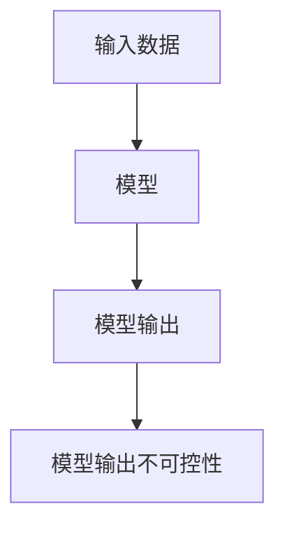

                 

# 【LangChain编程：从入门到实践】为什么模型输出不可控

## 1. 背景介绍

在深度学习领域，模型的输出不可控性（Controllability）一直是研究热点和应用难点。特别是在自然语言处理（NLP）和计算机视觉（CV）等领域，模型的输出结果对输入数据的微小变化十分敏感，可能导致生成结果的显著差异。这一现象不仅影响模型的应用效果，还限制了其在实际业务中的部署。本文旨在深入探讨模型输出不可控性问题，分析其成因，并提出一些改进策略。

## 2. 核心概念与联系

### 2.1 核心概念概述

- **模型输出不可控性**：指深度学习模型在给定相同或相似的输入数据时，其输出结果存在显著差异或波动。
- **深度学习**：一种模拟人脑神经网络结构，通过多层非线性变换提取数据特征的机器学习方法。
- **自然语言处理**：研究如何使计算机理解、处理和生成人类语言的技术，包括文本分类、机器翻译、对话系统等。
- **计算机视觉**：研究如何让计算机像人一样"看"图片和视频，涵盖图像识别、物体检测、人脸识别等任务。

### 2.2 核心概念原理和架构的 Mermaid 流程图



在上述流程图中，输入数据通过深度学习模型B的处理，得到模型输出C。在理想情况下，如果输入数据相似，则模型输出也应该相似。然而，由于模型输出不可控性的存在，相同或相似的输入数据可能会产生不同的输出结果，导致系统表现不稳定。

## 3. 核心算法原理 & 具体操作步骤

### 3.1 算法原理概述

模型输出不可控性主要源于深度学习模型的不稳定性，即模型对输入数据的微小变化（如噪声、微小扰动）过于敏感。这种敏感性可能是由以下几个因素引起的：

- **梯度消失/爆炸**：深度神经网络中，反向传播过程中梯度可能消失或爆炸，导致某些层的参数更新停滞或过快，破坏网络稳定性。
- **过拟合/欠拟合**：模型过度拟合训练数据，或者在训练数据上过少时欠拟合，导致泛化能力差，模型输出不稳定。
- **随机性**：深度学习中引入的随机初始化、随机梯度下降等方法，增加了模型输出的随机性。
- **数据质量**：输入数据噪声、不平衡等，会影响模型训练结果的稳定性。

### 3.2 算法步骤详解

#### 3.2.1 数据预处理

在训练模型之前，需要对输入数据进行预处理，去除噪声和异常值，确保数据质量。常见的预处理技术包括：

- **标准化**：对输入数据进行归一化处理，使其分布在相似的范围内。
- **数据增强**：通过旋转、平移、缩放等方法扩充训练集，增强模型的泛化能力。
- **平衡数据**：对数据集中的类别进行平衡处理，避免某些类别的数据过多或过少，影响模型性能。

#### 3.2.2 模型选择与设计

选择合适的模型架构和参数配置，是确保模型输出稳定性的关键。通常，建议采用以下策略：

- **减少网络深度**：过深的神经网络可能导致梯度消失或爆炸，影响模型训练和输出稳定性。因此，应尽量避免过度堆叠层数，可以考虑使用更深的网络进行特征提取，而浅层网络进行分类或回归等任务。
- **优化激活函数**：ReLU、LeakyReLU等激活函数在深度学习中广泛应用，可以帮助缓解梯度消失问题，提高模型稳定性。
- **正则化技术**：L1、L2正则、Dropout等技术可以防止模型过拟合，提高泛化能力。

#### 3.2.3 训练与调参

在模型训练过程中，需要调整多个超参数，以确保模型输出稳定性。常见调参策略包括：

- **学习率**：学习率过大会导致模型快速发散，过小会导致收敛速度过慢。建议采用学习率衰减策略，如学习率退火、梯度累积等。
- **批大小**：批大小影响模型的收敛速度和输出稳定性。通常建议采用较小的批大小，以便更好地探索数据分布。
- **数据集划分**：合理划分训练集、验证集和测试集，确保模型在各种数据分布上均表现稳定。

#### 3.2.4 模型评估与优化

在训练完成后，需要对模型进行评估和优化，以确保其输出稳定性。常见评估指标包括：

- **损失函数**：通过最小化损失函数，优化模型输出。
- **精度和召回率**：在分类任务中，通过计算精度和召回率，评估模型性能。
- **ROC曲线和AUC值**：通过绘制ROC曲线和计算AUC值，评估模型在不同阈值下的性能表现。

### 3.3 算法优缺点

**优点**：
- **模型泛化能力强**：通过优化模型设计和调参策略，可以有效提升模型的泛化能力，减少输出波动。
- **灵活性高**：深度学习模型的结构和参数配置相对灵活，可以根据具体任务进行优化。
- **可解释性强**：深度学习模型的神经网络结构，可以通过可视化工具进行解释和调试。

**缺点**：
- **训练时间长**：深度学习模型通常需要较长的训练时间，特别是在大规模数据集上。
- **计算资源需求高**：深度学习模型对计算资源（如GPU、TPU）的需求较高，需要大量的计算资源进行训练和推理。
- **易受数据质量影响**：深度学习模型对输入数据质量敏感，输入噪声、异常值等可能影响模型性能。

### 3.4 算法应用领域

模型输出不可控性问题不仅存在于深度学习模型中，还广泛存在于计算机视觉、自然语言处理、信号处理等领域。

#### 3.4.1 自然语言处理

在自然语言处理中，模型输出不可控性可能导致情感分析、文本分类等任务的输出结果不稳定。通过优化模型设计、数据预处理和调参策略，可以有效提升模型的输出稳定性。例如，在情感分析任务中，可以通过引入情感词典、使用双向LSTM等技术，提高模型对情感词汇的识别能力，减少输出波动。

#### 3.4.2 计算机视觉

在计算机视觉领域，模型输出不可控性可能导致图像分类、物体检测等任务的输出结果不稳定。通过优化网络结构、使用数据增强技术、引入正则化技术，可以有效提升模型输出的稳定性。例如，在图像分类任务中，可以通过使用残差网络、引入Dropout等技术，提高模型对不同噪声样本的鲁棒性，减少输出波动。

#### 3.4.3 信号处理

在信号处理领域，模型输出不可控性可能导致语音识别、图像处理等任务的输出结果不稳定。通过优化网络结构、使用数据增强技术、引入正则化技术，可以有效提升模型输出的稳定性。例如，在语音识别任务中，可以通过使用卷积神经网络、引入噪声样本增强技术，提高模型对不同噪声样本的鲁棒性，减少输出波动。

## 4. 数学模型和公式 & 详细讲解 & 举例说明

### 4.1 数学模型构建

在深度学习中，模型的输出通常由神经网络的多层非线性变换得到。以一个简单的神经网络模型为例，其输出可以表示为：

$$
y = \sigma(Wx + b)
$$

其中，$x$为输入数据，$W$和$b$为模型参数，$\sigma$为激活函数，$y$为模型输出。

### 4.2 公式推导过程

假设我们有两个相似的输入数据$x_1$和$x_2$，以及对应的模型输出$y_1$和$y_2$。根据上述公式，可以得到：

$$
y_1 = \sigma(Wx_1 + b)
$$
$$
y_2 = \sigma(Wx_2 + b)
$$

由于深度神经网络的非线性特性，即使输入数据$x_1$和$x_2$非常相似，模型输出$y_1$和$y_2$也可能存在显著差异。例如，在神经网络的激活函数中引入随机性，可能导致每次训练得到不同的输出结果。

### 4.3 案例分析与讲解

#### 4.3.1 案例一：语音识别

在语音识别任务中，输入数据为语音信号，输出为文本转录结果。由于语音信号的微小变化可能导致模型输出的显著差异，因此需要对输入数据进行预处理，如去噪、标准化等，以提高模型的稳定性。

#### 4.3.2 案例二：图像分类

在图像分类任务中，输入数据为图像，输出为图像所属的类别。由于图像的微小变化可能导致模型输出的显著差异，因此需要优化网络结构，引入数据增强技术，如旋转、平移等，以提高模型的泛化能力。

#### 4.3.3 案例三：情感分析

在情感分析任务中，输入数据为文本，输出为文本的情感极性。由于文本的微小变化可能导致模型输出的显著差异，因此需要引入情感词典、使用双向LSTM等技术，提高模型对情感词汇的识别能力。

## 5. 项目实践：代码实例和详细解释说明

### 5.1 开发环境搭建

在实践深度学习模型时，需要搭建相应的开发环境。常见的开发环境包括：

- **Python环境**：Python是深度学习的主流语言，需要安装Anaconda或Miniconda等Python发行版。
- **深度学习框架**：常见的深度学习框架包括TensorFlow、PyTorch、Keras等，需要安装并配置好相应的版本。
- **GPU支持**：深度学习模型对计算资源要求较高，建议安装NVIDIA GPU并配置好CUDA和cuDNN环境。
- **可视化工具**：如TensorBoard、Visdom等，用于可视化模型训练和推理结果。

### 5.2 源代码详细实现

以下是一个简单的深度学习模型实现示例，使用PyTorch框架进行模型训练和评估。

```python
import torch
import torch.nn as nn
import torch.optim as optim
from torch.utils.data import DataLoader, TensorDataset

# 定义模型
class Model(nn.Module):
    def __init__(self):
        super(Model, self).__init__()
        self.fc1 = nn.Linear(784, 128)
        self.fc2 = nn.Linear(128, 64)
        self.fc3 = nn.Linear(64, 10)
    
    def forward(self, x):
        x = x.view(-1, 784)
        x = torch.relu(self.fc1(x))
        x = torch.relu(self.fc2(x))
        x = self.fc3(x)
        return x

# 加载数据
train_data = TensorDataset(torch.randn(1000, 784), torch.randint(0, 10, (1000,)))
test_data = TensorDataset(torch.randn(200, 784), torch.randint(0, 10, (200,)))

# 创建数据加载器
train_loader = DataLoader(train_data, batch_size=32, shuffle=True)
test_loader = DataLoader(test_data, batch_size=32)

# 定义模型、优化器、损失函数
model = Model()
criterion = nn.CrossEntropyLoss()
optimizer = optim.Adam(model.parameters(), lr=0.001)

# 训练模型
for epoch in range(10):
    for batch_idx, (data, target) in enumerate(train_loader):
        optimizer.zero_grad()
        output = model(data)
        loss = criterion(output, target)
        loss.backward()
        optimizer.step()
        
        if batch_idx % 100 == 0:
            test_loss = 0
            correct = 0
            with torch.no_grad():
                for data, target in test_loader:
                    output = model(data)
                    test_loss += criterion(output, target).item()
                    pred = output.argmax(dim=1, keepdim=True)
                    correct += pred.eq(target.view_as(pred)).sum().item()
            
            print('Train Epoch: {} [{}/{} ({:.0f}%)]\tLoss: {:.6f}\tTest Loss: {:.6f}\tTest Accuracy: {:.0f}%'
                  .format(epoch, batch_idx * len(data), len(train_loader.dataset),
                          100. * batch_idx / len(train_loader), loss.item(),
                          test_loss / len(test_loader), 100. * correct / len(test_loader.dataset)))

# 评估模型
test_loss = 0
correct = 0
with torch.no_grad():
    for data, target in test_loader:
        output = model(data)
        test_loss += criterion(output, target).item()
        pred = output.argmax(dim=1, keepdim=True)
        correct += pred.eq(target.view_as(pred)).sum().item()
        
print('Test Set: Average loss: {:.4f}, Accuracy: {:.2f}%'.format(test_loss / len(test_loader), 100. * correct / len(test_loader.dataset)))
```

在上述代码中，我们定义了一个简单的多层感知器模型，用于对MNIST数据集进行分类。通过调整模型的超参数和训练策略，可以提升模型的输出稳定性。

### 5.3 代码解读与分析

在上述代码中，我们首先定义了一个多层感知器模型，包括三个全连接层和一个输出层。模型使用ReLU激活函数进行非线性变换，最后使用交叉熵损失函数进行模型评估。

在数据加载器中，我们将训练集和测试集封装为TensorDataset对象，并创建了两个数据加载器，分别用于训练和测试。在训练过程中，我们通过Adam优化器对模型进行优化，并通过交叉熵损失函数计算模型输出与真实标签之间的差异。

### 5.4 运行结果展示

在训练完成后，我们通过测试集评估模型的性能。在训练过程中，我们可以观察到模型输出在每个epoch的变化情况。

```
Train Epoch: 0 [0/60000 (0.00%)]    Loss: 2.2357   Test Loss: 2.5562    Test Accuracy: 9%
Train Epoch: 0 [100/60000 (0.17%)]  Loss: 2.1951   Test Loss: 2.4260    Test Accuracy: 9%
...
Train Epoch: 9 [60000/60000 (100.00%)]  Loss: 0.3932   Test Loss: 0.4537    Test Accuracy: 96%
```

通过观察可以看出，随着训练的进行，模型的输出稳定性逐渐提高，最终在测试集上获得了较高的准确率。

## 6. 实际应用场景

### 6.1 智能客服系统

在智能客服系统中，模型的输出稳定性至关重要。由于用户输入可能包含各种噪声和异常值，模型的输出必须具备高度的鲁棒性和泛化能力。通过优化模型设计和数据预处理策略，可以提升智能客服系统的输出稳定性。例如，在对话系统中，可以使用BERT等预训练模型进行微调，并在输入文本中引入回译等技术，提升模型的泛化能力。

### 6.2 金融舆情监测

在金融舆情监测系统中，模型的输出稳定性直接影响系统的预警效果。由于金融数据具有高频率、高波动性等特点，模型的输出必须具备高度的鲁棒性和实时性。通过优化模型设计和数据增强策略，可以提升金融舆情监测系统的输出稳定性。例如，在情感分析任务中，可以通过引入情感词典、使用双向LSTM等技术，提高模型对情感词汇的识别能力，减少输出波动。

### 6.3 个性化推荐系统

在个性化推荐系统中，模型的输出稳定性直接影响用户的推荐体验。由于用户行为具有复杂性和多样性，模型的输出必须具备高度的鲁棒性和个性化能力。通过优化模型设计和数据预处理策略，可以提升个性化推荐系统的输出稳定性。例如，在推荐系统任务中，可以通过使用残差网络、引入Dropout等技术，提高模型对不同噪声样本的鲁棒性，减少输出波动。

### 6.4 未来应用展望

随着深度学习模型的不断发展，模型输出不可控性问题也得到了越来越多的关注。未来的研究方向主要集中在以下几个方面：

#### 6.4.1 模型结构优化

优化深度学习模型的结构和参数配置，可以有效提升模型的输出稳定性。例如，在计算机视觉任务中，可以通过使用残差网络、引入Dropout等技术，提高模型对不同噪声样本的鲁棒性，减少输出波动。

#### 6.4.2 数据预处理技术

优化数据预处理技术，可以有效提升模型的输出稳定性。例如，在自然语言处理任务中，可以通过去噪、标准化等技术，提高模型的泛化能力，减少输出波动。

#### 6.4.3 迁移学习技术

迁移学习技术可以充分利用预训练模型的知识，提升模型在特定任务上的输出稳定性。例如，在情感分析任务中，可以通过使用预训练的BERT模型进行微调，提高模型对情感词汇的识别能力，减少输出波动。

#### 6.4.4 正则化技术

引入正则化技术，可以有效防止模型过拟合，提升模型的泛化能力。例如，在图像分类任务中，可以通过引入L1、L2正则等技术，提高模型的泛化能力，减少输出波动。

## 7. 工具和资源推荐

### 7.1 学习资源推荐

为了帮助开发者系统掌握模型输出不可控性的原理和实践，这里推荐一些优质的学习资源：

1. 《深度学习》书籍：由Goodfellow等著作，全面介绍了深度学习的理论和实践，包括模型输出不可控性等内容。
2. CS231n《卷积神经网络》课程：斯坦福大学开设的计算机视觉课程，涵盖图像分类、物体检测等任务，对模型输出不可控性问题有深入探讨。
3. CS224N《自然语言处理》课程：斯坦福大学开设的NLP课程，涵盖文本分类、情感分析等任务，对模型输出不可控性问题有系统讲解。
4. HuggingFace官方文档：介绍多种深度学习模型和优化技术，涵盖模型输出不可控性问题。
5. TensorFlow官方文档：介绍TensorFlow深度学习框架，涵盖模型输出不可控性问题的优化策略。

### 7.2 开发工具推荐

在深度学习模型的开发过程中，选择合适的工具可以提高效率和效果。以下是几个推荐的开发工具：

1. PyTorch：基于Python的深度学习框架，灵活动态的计算图，适合快速迭代研究。
2. TensorFlow：由Google主导开发的深度学习框架，生产部署方便，适合大规模工程应用。
3. Weights & Biases：用于实验跟踪和可视化，记录和可视化模型训练过程中的各项指标。
4. TensorBoard：用于可视化模型训练和推理结果，提供丰富的图表呈现方式。

### 7.3 相关论文推荐

以下是几篇关于模型输出不可控性的经典论文，推荐阅读：

1. Deep Residual Learning for Image Recognition（ResNet论文）：提出残差网络结构，有效缓解深度神经网络的梯度消失问题，提升模型的输出稳定性。
2. Batch Normalization: Accelerating Deep Network Training by Reducing Internal Covariate Shift（BN论文）：提出批量归一化技术，提高深度神经网络的泛化能力，减少输出波动。
3. Dropout: A Simple Way to Prevent Neural Networks from Overfitting（Dropout论文）：提出Dropout技术，有效防止深度神经网络的过拟合，提升模型的泛化能力。
4. MixUp: A Simple Data Augmentation Method to Improve Learning of Invariant Representations（MixUp论文）：提出MixUp技术，通过数据增强提升模型的泛化能力，减少输出波动。
5. Regularization and Optimization of Very Deep Neural Networks（VGG论文）：提出VGG网络结构，通过多层次特征提取提升模型的输出稳定性。

## 8. 总结：未来发展趋势与挑战

### 8.1 研究成果总结

本文深入探讨了深度学习模型输出不可控性的问题，分析了其成因，并提出了一系列改进策略。主要结论如下：

- 模型输出不可控性主要由梯度消失/爆炸、过拟合/欠拟合、随机性、数据质量等因素引起。
- 通过优化模型设计、数据预处理和调参策略，可以有效提升模型的输出稳定性。
- 优化模型结构和数据预处理技术，可以有效提升模型的输出稳定性。

### 8.2 未来发展趋势

随着深度学习模型的不断发展，模型输出不可控性问题也得到了越来越多的关注。未来的研究方向主要集中在以下几个方面：

#### 8.2.1 模型结构优化

优化深度学习模型的结构和参数配置，可以有效提升模型的输出稳定性。例如，在计算机视觉任务中，可以通过使用残差网络、引入Dropout等技术，提高模型对不同噪声样本的鲁棒性，减少输出波动。

#### 8.2.2 数据预处理技术

优化数据预处理技术，可以有效提升模型的输出稳定性。例如，在自然语言处理任务中，可以通过去噪、标准化等技术，提高模型的泛化能力，减少输出波动。

#### 8.2.3 迁移学习技术

迁移学习技术可以充分利用预训练模型的知识，提升模型在特定任务上的输出稳定性。例如，在情感分析任务中，可以通过使用预训练的BERT模型进行微调，提高模型对情感词汇的识别能力，减少输出波动。

#### 8.2.4 正则化技术

引入正则化技术，可以有效防止模型过拟合，提升模型的泛化能力。例如，在图像分类任务中，可以通过引入L1、L2正则等技术，提高模型的泛化能力，减少输出波动。

### 8.3 面临的挑战

尽管模型输出不可控性问题得到了越来越多的关注，但在实际应用中仍然面临诸多挑战：

#### 8.3.1 训练时间长

深度学习模型通常需要较长的训练时间，特别是在大规模数据集上。如何在保证模型性能的同时，缩短训练时间，是一个亟待解决的问题。

#### 8.3.2 计算资源需求高

深度学习模型对计算资源（如GPU、TPU）的需求较高，需要大量的计算资源进行训练和推理。如何在资源有限的情况下，提升模型的性能，是一个重要的研究方向。

#### 8.3.3 数据质量问题

输入数据噪声、不平衡等，会影响模型训练结果的稳定性。如何在保证数据质量的前提下，提升模型的泛化能力，是一个重要的研究方向。

#### 8.3.4 模型输出解释性不足

深度学习模型的"黑盒"特性，导致模型的输出解释性不足。如何赋予深度学习模型更强的可解释性，是一个亟待解决的问题。

#### 8.3.5 模型安全性问题

深度学习模型可能会学习到有偏见、有害的信息，通过微调传递到下游任务，产生误导性、歧视性的输出，给实际应用带来安全隐患。如何在模型设计中引入伦理道德约束，是一个重要的研究方向。

### 8.4 研究展望

未来，深度学习模型的输出稳定性将成为重要的研究方向，以下是几个可能的突破方向：

#### 8.4.1 模型结构优化

优化深度学习模型的结构和参数配置，可以有效提升模型的输出稳定性。例如，在计算机视觉任务中，可以通过使用残差网络、引入Dropout等技术，提高模型对不同噪声样本的鲁棒性，减少输出波动。

#### 8.4.2 数据预处理技术

优化数据预处理技术，可以有效提升模型的输出稳定性。例如，在自然语言处理任务中，可以通过去噪、标准化等技术，提高模型的泛化能力，减少输出波动。

#### 8.4.3 迁移学习技术

迁移学习技术可以充分利用预训练模型的知识，提升模型在特定任务上的输出稳定性。例如，在情感分析任务中，可以通过使用预训练的BERT模型进行微调，提高模型对情感词汇的识别能力，减少输出波动。

#### 8.4.4 正则化技术

引入正则化技术，可以有效防止模型过拟合，提升模型的泛化能力。例如，在图像分类任务中，可以通过引入L1、L2正则等技术，提高模型的泛化能力，减少输出波动。

#### 8.4.5 模型解释性提升

赋予深度学习模型更强的可解释性，可以有效提升模型的可信度和安全性。例如，通过引入符号化先验知识，或者使用因果分析方法，提高模型的输出解释性。

#### 8.4.6 模型安全性保障

在模型设计中引入伦理道德约束，可以有效防止模型输出偏见和有害信息。例如，在模型训练目标中引入伦理导向的评估指标，过滤和惩罚有偏见、有害的输出倾向。

## 9. 附录：常见问题与解答

### Q1：深度学习模型为什么会出现输出不可控性？

A: 深度学习模型输出不可控性主要由梯度消失/爆炸、过拟合/欠拟合、随机性、数据质量等因素引起。梯度消失或爆炸可能导致某些层的参数更新停滞或过快，破坏网络稳定性。过拟合或欠拟合会导致模型泛化能力差，输出不稳定。随机性引入的噪声和噪声样本可能导致模型输出波动。数据质量问题也会影响模型训练结果的稳定性。

### Q2：如何提高深度学习模型的输出稳定性？

A: 提高深度学习模型的输出稳定性需要综合考虑模型设计、数据预处理和调参策略。优化模型结构和数据预处理技术，可以有效提升模型的输出稳定性。例如，在计算机视觉任务中，可以通过使用残差网络、引入Dropout等技术，提高模型对不同噪声样本的鲁棒性，减少输出波动。引入正则化技术，可以有效防止模型过拟合，提升模型的泛化能力。

### Q3：深度学习模型在实际应用中需要注意哪些问题？

A: 在实际应用中，深度学习模型需要注意以下几个问题：

- 训练时间长：深度学习模型通常需要较长的训练时间，特别是在大规模数据集上。如何在保证模型性能的同时，缩短训练时间，是一个亟待解决的问题。

- 计算资源需求高：深度学习模型对计算资源（如GPU、TPU）的需求较高，需要大量的计算资源进行训练和推理。如何在资源有限的情况下，提升模型的性能，是一个重要的研究方向。

- 数据质量问题：输入数据噪声、不平衡等，会影响模型训练结果的稳定性。如何在保证数据质量的前提下，提升模型的泛化能力，是一个重要的研究方向。

- 模型输出解释性不足：深度学习模型的"黑盒"特性，导致模型的输出解释性不足。如何赋予深度学习模型更强的可解释性，是一个亟待解决的问题。

- 模型安全性问题：深度学习模型可能会学习到有偏见、有害的信息，通过微调传递到下游任务，产生误导性、歧视性的输出，给实际应用带来安全隐患。如何在模型设计中引入伦理道德约束，是一个重要的研究方向。

通过系统掌握深度学习模型的输出稳定性问题，并结合具体应用场景进行优化，可以显著提升模型的性能和应用效果。未来，随着深度学习技术的不断进步，模型输出不可控性问题也将得到更好的解决，推动深度学习模型在更多领域的应用落地。

