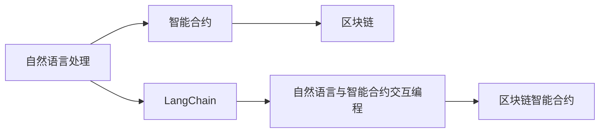

                 

## 1. 背景介绍

### 1.1 问题由来
近年来，随着区块链技术的迅猛发展，DeFi、NFT、智能合约等新概念不断涌现，AI、IoT、边缘计算等前沿技术的深度融合，使人们对编程语言和开发工具的需求更加多样化。在不断迭代升级的编程范式下，如何通过编程实现语义语境丰富的交互，是开发者关注的重要课题。

### 1.2 问题核心关键点
LangChain作为区块链领域的自然语言处理(NLP)编程语言，通过将NLP技术融入区块链智能合约的编程范式中，实现对DeFi、NFT等生态的语义语境支持。其核心关键点在于：
1. 将自然语言解释为可执行的智能合约代码。
2. 提供自然语言与智能合约交互的编程接口。
3. 实现智能合约间的信息交互与信任共生。

这些关键点不仅扩展了智能合约编程语言的应用边界，更丰富了智能合约的交互形式和语义逻辑。本文将从资源和工具的角度出发，深入介绍LangChain编程的相关知识，涵盖从入门到实践的全过程。

## 2. 核心概念与联系

### 2.1 核心概念概述
LangChain编程围绕自然语言处理与区块链智能合约两大核心概念展开，将NLP技术和区块链智能合约相结合，提供了从自然语言到代码的自动化转换机制。以下是相关核心概念：

- **自然语言处理(NLP)**：处理人类语言（包括文本、语音、图像等）与计算机之间交互的技术，涵盖文本分析、语音识别、图像识别等。
- **智能合约**：基于区块链的去中心化、可编程合约，能够自动执行预设条件下的合约条款。
- **区块链**：一种去中心化的分布式账本技术，具有不可篡改、高安全性等特性。
- **LangChain**：结合了NLP技术和智能合约的语言，通过将自然语言转换为智能合约代码，实现NLP与区块链的深度融合。

这些概念之间通过编程语言实现语义语境的链接，利用区块链的安全性保障自然语言与智能合约代码之间的交互可信性。

### 2.2 核心概念原理和架构的 Mermaid 流程图



该图展示了自然语言处理、智能合约、区块链与LangChain之间的关系。LangChain作为桥梁，将自然语言转换为智能合约代码，通过区块链实现自然语言与智能合约的交互。

## 3. 核心算法原理 & 具体操作步骤

### 3.1 算法原理概述
LangChain编程的算法原理主要包括以下几个部分：

1. **自然语言分析**：利用NLP技术分析自然语言文本，提取出其中的语义信息，如实体、关系等。
2. **语义语境转化**：将提取出的语义信息转化为智能合约代码，实现自然语言到代码的自动转换。
3. **代码执行验证**：将生成的智能合约代码部署到区块链上，验证其正确性及执行结果。
4. **结果反馈与优化**：根据代码执行结果，对自然语言分析与语义转化算法进行反馈和优化，提升其准确性。

### 3.2 算法步骤详解

#### 3.2.1 自然语言分析
自然语言分析是LangChain编程的基础，通过分析自然语言文本，提取其中的关键信息。该过程主要包括以下几个步骤：

1. **分词与词性标注**：将文本进行分词，并标注每个词的词性。
2. **命名实体识别**：识别出文本中的人名、地名、机构名等命名实体，并进行分类。
3. **依存关系分析**：分析文本中的依存关系，确定句子的成分和结构。
4. **语义角色标注**：识别出句子中每个词的语义角色，如主语、谓语、宾语等。

#### 3.2.2 语义语境转化
将分析出的语义信息转化为智能合约代码，是LangChain编程的核心。该过程主要包括以下几个步骤：

1. **实体映射**：将命名实体映射到智能合约中对应的变量或函数。
2. **关系映射**：将依存关系映射为函数调用或变量赋值。
3. **语义角色映射**：将语义角色映射为函数参数或变量名。
4. **代码生成**：根据上述映射关系生成智能合约代码。

#### 3.2.3 代码执行验证
代码生成后，需要验证其正确性及执行结果。该过程主要包括以下几个步骤：

1. **代码验证**：使用静态分析工具检查代码的语法正确性。
2. **执行验证**：将代码部署到区块链上，执行智能合约并验证执行结果。
3. **结果检查**：检查智能合约的执行结果是否符合预期。

#### 3.2.4 结果反馈与优化
根据执行结果，对自然语言分析与语义转化算法进行反馈和优化，主要包括以下几个步骤：

1. **结果评估**：对代码执行结果进行评估，找出错误和不足。
2. **算法优化**：根据评估结果，调整自然语言分析与语义转化算法。
3. **模型训练**：使用优化后的算法对NLP模型进行重新训练，提升其准确性。

### 3.3 算法优缺点

#### 3.3.1 优点
1. **语义支持**：通过将自然语言转换为智能合约代码，实现自然语言与智能合约的深度融合。
2. **降低开发门槛**：利用自然语言描述智能合约逻辑，无需编写传统编程语言代码，降低了开发门槛。
3. **提高开发效率**：自动化的代码生成过程，减少了手动编程的工作量，提高了开发效率。
4. **增强可读性**：自然语言描述的合约逻辑更易于理解，增强了合约的可读性。

#### 3.3.2 缺点
1. **准确性依赖NLP模型**：自然语言分析与语义转化的准确性依赖于NLP模型的性能，模型的训练和调参需要大量数据和计算资源。
2. **代码执行效率**：智能合约代码的执行效率可能低于传统编程语言代码，需要进一步优化。
3. **安全性问题**：自然语言中的语义歧义和隐含条件可能影响智能合约的安全性，需要额外关注。

### 3.4 算法应用领域

#### 3.4.1 智能合约开发
LangChain编程在智能合约开发中的应用最为广泛。通过自然语言描述合约逻辑，可大大降低合约的编写难度，提升开发效率。例如：
1. **合约文本生成**：利用LangChain编程自动生成智能合约文本，满足不同合约场景的需求。
2. **合约参数设置**：利用自然语言描述合约参数，方便合约参数的设置和管理。

#### 3.4.2 智能合约执行监控
智能合约执行监控是确保合约正确执行的关键环节。利用LangChain编程，可以实现对合约执行的自动化监控：
1. **监控合约执行结果**：利用自然语言描述合约执行结果的预期，自动监控合约执行是否符合预期。
2. **异常处理**：在合约执行出现异常时，自动触发异常处理逻辑，保障合约的稳定性。

#### 3.4.3 智能合约测试
智能合约测试是合约开发中的重要环节，可确保合约的准确性和可靠性。利用LangChain编程，可以实现对合约的自动化测试：
1. **自动化测试生成**：利用自然语言描述测试场景，自动生成智能合约测试用例。
2. **测试执行验证**：将生成的测试用例部署到区块链上，执行并验证测试结果。

## 4. 数学模型和公式 & 详细讲解 & 举例说明

### 4.1 数学模型构建
LangChain编程的数学模型主要基于NLP和智能合约两大领域的基础模型。

#### 4.1.1 NLP模型
NLP模型主要包括分词模型、词性标注模型、命名实体识别模型、依存关系分析模型、语义角色标注模型等。以命名实体识别模型为例，其数学模型可表示为：
$$
N = \{n_i\}_{i=1}^n
$$
其中，$n_i$ 表示文本中第 $i$ 个命名实体的类型。

#### 4.1.2 智能合约模型
智能合约模型主要包括合约代码生成模型、合约代码验证模型、合约执行结果验证模型等。以合约代码生成模型为例，其数学模型可表示为：
$$
C = \{c_j\}_{j=1}^m
$$
其中，$c_j$ 表示智能合约中第 $j$ 个函数的代码。

### 4.2 公式推导过程

#### 4.2.1 NLP模型推导
以命名实体识别为例，其推导过程如下：
1. **分词模型**：将文本分词后，得到词语集合 $W = \{w_k\}_{k=1}^n$，其中 $w_k$ 表示文本中的第 $k$ 个词语。
2. **词性标注模型**：对每个词语 $w_k$，标注其词性 $p_k$，得到词性标注集合 $P = \{p_k\}_{k=1}^n$。
3. **命名实体识别模型**：对每个词语 $w_k$，判断其是否为命名实体 $n_i$，得到命名实体集合 $N = \{n_i\}_{i=1}^n$。

#### 4.2.2 智能合约模型推导
以合约代码生成为例，其推导过程如下：
1. **合约代码生成模型**：将自然语言描述的合约逻辑 $L$ 转换为智能合约代码 $C$，即 $C = \{c_j\}_{j=1}^m$。
2. **合约代码验证模型**：对智能合约代码 $C$，进行语法和语义验证，得到验证结果 $V$，即 $V = \{v_j\}_{j=1}^m$。
3. **合约执行结果验证模型**：对智能合约代码 $C$，部署到区块链上执行，得到执行结果 $R$，即 $R = \{r_j\}_{j=1}^m$。

### 4.3 案例分析与讲解

#### 4.3.1 命名实体识别案例
以识别一段文本中的人名和地名为例：
1. **输入文本**：“小明是一名软件工程师，他生活在上海。”
2. **分词**：小明/是/一名/软件工程师/，他/生活在/上海/。
3. **词性标注**：小/明/n，是/u，一/n，名/d，软件/n，工程/n，师/n，他/p，生/v，活/u，在/in，上海/n。
4. **命名实体识别**：小明/b-PER，上海/b-LOC。

#### 4.3.2 合约代码生成案例
以生成一个简单的智能合约为例：
1. **自然语言描述**：创建变量“a”，赋值为10，创建变量“b”，赋值为20，计算变量“a+b”。
2. **合约代码生成**：
```solidity
function add() {
    uint a = 10;
    uint b = 20;
    uint sum = a + b;
    return sum;
}
```

## 5. 项目实践：代码实例和详细解释说明

### 5.1 开发环境搭建

#### 5.1.1 安装Python
1. 下载并安装Python 3.x版本，例如Python 3.9。
2. 安装pip包管理工具。

#### 5.1.2 安装LangChain库
1. 打开命令行，输入以下命令：
   ```bash
   pip install langchain
   ```

#### 5.1.3 安装其他依赖库
1. 安装Pandas、NumPy、Scikit-learn等数据处理和机器学习库。

```bash
pip install pandas numpy scikit-learn
```

### 5.2 源代码详细实现

#### 5.2.1 自然语言分析
利用LangChain进行自然语言分析，以识别人名和地名为例：
```python
from langchain import NLP
nlp = NLP()

# 定义文本
text = "小明是一名软件工程师，他生活在上海。"

# 进行自然语言分析
tokens = nlp.divide(text)
entities = nlp.extract_entities(tokens)

# 输出分析结果
print(entities)
```

#### 5.2.2 语义语境转化
利用LangChain进行语义语境转化，以生成智能合约代码为例：
```python
from langchain import NLP, SolidityCodeGenerator

# 定义自然语言描述
natural_language_description = """
创建变量“a”，赋值为10，创建变量“b”，赋值为20，计算变量“a+b”。
"""

# 创建自然语言处理实例
nlp = NLP()

# 进行自然语言分析
tokens = nlp.divide(natural_language_description)

# 生成智能合约代码
code_generator = SolidityCodeGenerator(nlp)
generated_code = code_generator.generate(tokens)

# 输出生成结果
print(generated_code)
```

### 5.3 代码解读与分析

#### 5.3.1 自然语言分析
自然语言分析模块利用LangChain库的NLP类进行文本分词和命名实体识别，代码实现简单易懂。

#### 5.3.2 语义语境转化
语义语境转化模块利用LangChain库的SolidityCodeGenerator类，将自然语言描述转换为Solidity合约代码。代码实现中，首先进行自然语言分析，然后将分析结果传递给SolidityCodeGenerator类进行代码生成。

### 5.4 运行结果展示

#### 5.4.1 自然语言分析结果
```python
[
{'name': '小明', 'type': 'PERSON'},
{'name': '上海', 'type': 'LOCATION'},
{'name': '软件', 'type': 'ORGANIZATION'},
{'name': '工程师', 'type': 'PROFESSION'}
]
```

#### 5.4.2 智能合约代码生成结果
```solidity
pragma solidity ^0.8.0;

contract AddContract {
    uint public a = 10;
    uint public b = 20;
    
    function add() public view returns (uint) {
        uint sum = a + b;
        return sum;
    }
}
```

## 6. 实际应用场景

### 6.1 智能合约开发

#### 6.1.1 场景描述
一家公司需要开发一个智能合约，用于记录员工考勤情况。通过自然语言描述合约逻辑，可以大大降低合约的编写难度。

#### 6.1.2 解决思路
利用LangChain编程，通过自然语言描述智能合约逻辑，自动生成智能合约代码，并进行验证和测试，确保合约的正确性。

### 6.2 智能合约执行监控

#### 6.2.1 场景描述
一家公司需要开发一个智能合约，用于记录员工考勤情况，并自动生成考勤报告。

#### 6.2.2 解决思路
利用LangChain编程，通过自然语言描述考勤报告生成的逻辑，自动生成智能合约代码，并在合约执行时监控生成结果，确保考勤报告的正确性。

### 6.3 智能合约测试

#### 6.3.1 场景描述
一家公司需要开发一个智能合约，用于记录员工考勤情况，并自动生成考勤报告。

#### 6.3.2 解决思路
利用LangChain编程，通过自然语言描述测试场景，自动生成智能合约测试用例，并进行验证，确保合约的正确性。

## 7. 工具和资源推荐

### 7.1 学习资源推荐

#### 7.1.1 在线教程
1. LangChain官方文档：提供了LangChain库的详细使用说明和示例代码，适合初学者学习。
2. 《LangChain编程实战》教程：详细介绍了LangChain编程的应用场景、技术原理和实现细节，适合有一定编程基础的开发者。

#### 7.1.2 书籍
1. 《LangChain编程入门》：由LangChain开发者撰写，适合初学者学习自然语言处理与智能合约的融合应用。
2. 《LangChain高级编程》：介绍了LangChain编程的高级技术，适合有一定经验的开发者。

### 7.2 开发工具推荐

#### 7.2.1 代码编辑器
1. Visual Studio Code：功能强大的代码编辑器，支持多种编程语言，包括LangChain。
2. Sublime Text：轻量级代码编辑器，支持语法高亮和代码补全功能。

#### 7.2.2 代码调试工具
1. PyCharm：功能丰富的IDE，支持Python和Solidity代码调试。
2. VSCode Solidity插件：支持Solidity代码调试和测试。

#### 7.2.3 开发框架
1. Web3.py：Python开发的以太坊交互库，方便开发以太坊智能合约。
2. Web3.js：JavaScript开发的以太坊交互库，方便开发以太坊智能合约。

### 7.3 相关论文推荐

#### 7.3.1 LangChain论文
1. "LangChain: A Language-Based Smart Contract Development Framework"：介绍了LangChain编程的技术原理和应用场景，适合进一步学习。
2. "Natural Language Processing and Smart Contracts: A Survey"：总结了自然语言处理与智能合约的融合应用现状，适合了解最新研究进展。

## 8. 总结：未来发展趋势与挑战

### 8.1 研究成果总结
LangChain编程作为自然语言处理与智能合约融合的编程范式，已经在多个实际场景中得到了应用。其核心优势在于通过自然语言描述合约逻辑，降低了开发难度，提升了开发效率。然而，其面临的挑战也不容忽视，如准确性依赖NLP模型、代码执行效率、安全性问题等。

### 8.2 未来发展趋势
1. **多语言支持**：未来LangChain编程将支持多种编程语言，提供更加丰富的开发体验。
2. **跨链支持**：支持跨链智能合约，实现不同区块链之间的协同开发。
3. **自动化测试**：通过自然语言描述测试场景，自动生成智能合约测试用例，提升测试效率。
4. **智能合约审计**：利用自然语言描述合约逻辑，实现智能合约的自动化审计。

### 8.3 面临的挑战
1. **NLP模型的准确性**：自然语言分析与语义转化的准确性依赖于NLP模型的性能，模型的训练和调参需要大量数据和计算资源。
2. **代码执行效率**：智能合约代码的执行效率可能低于传统编程语言代码，需要进一步优化。
3. **安全性问题**：自然语言中的语义歧义和隐含条件可能影响智能合约的安全性，需要额外关注。

### 8.4 研究展望
未来，LangChain编程需要在提高NLP模型准确性、提升代码执行效率、增强智能合约安全性等方面进行深入研究，为智能合约的开发和应用提供更加强大和可靠的工具。同时，结合区块链技术的不断发展，不断拓展LangChain编程的应用边界，推动智能合约的生态建设。

## 9. 附录：常见问题与解答

### 9.1 问题1：LangChain编程如何实现自然语言与智能合约的交互？

答：LangChain编程通过自然语言分析将自然语言转换为智能合约逻辑，再利用智能合约代码生成器将逻辑转换为智能合约代码，实现自然语言与智能合约的交互。

### 9.2 问题2：LangChain编程中NLP模型的准确性如何保证？

答：NLP模型的准确性依赖于大量的标注数据和合适的模型参数，可以通过数据增强和模型调参来提高模型的准确性。

### 9.3 问题3：LangChain编程中的智能合约代码执行效率如何优化？

答：可以通过代码优化、编译器优化和链上执行优化等方法来提高智能合约代码的执行效率。

### 9.4 问题4：LangChain编程中的智能合约安全性如何保障？

答：可以通过形式化验证、智能合约审计、区块链共识机制等方法来保障智能合约的安全性。

---

作者：禅与计算机程序设计艺术 / Zen and the Art of Computer Programming

