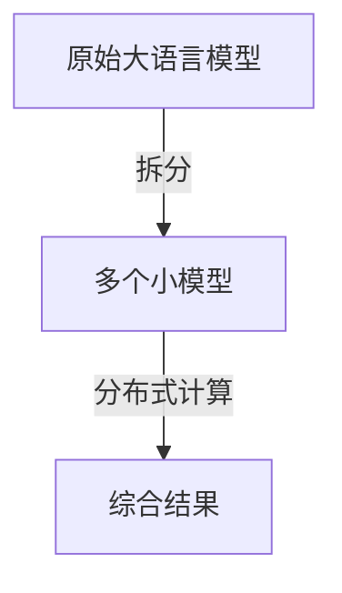

                 

## 1. 背景介绍

### 1.1 问题由来

在当今人工智能的浪潮中，大模型如GPT-3、BERT等已经成为了前沿技术，它们在文本生成、自然语言处理等领域展现出了令人惊叹的性能。然而，构建一个大模型往往需要大量的计算资源和数据，对许多人来说这是一项艰巨的任务。因此，我们需要一种更简单、更轻量级的模型来解决这类问题。

### 1.2 问题核心关键点

为了解决这一问题，我们引入了Llama Index模型，这是一种基于小规模语言模型的分布式推理技术，能够实现与大型模型的效果接近，同时具有更低的计算需求和更短的开发时间。Llama Index的核心思想是将一个语言模型分成多个子模型，通过分布式计算来共同完成复杂的自然语言处理任务。

### 1.3 问题研究意义

Llama Index的应用能够显著降低AI开发门槛，让更多人能够快速构建和使用AI模型。它不仅适用于文本生成、问答系统、机器翻译等NLP任务，还能够应用于各种跨学科领域，如医疗、金融、教育等，为各行各业带来了新的创新点。

## 2. 核心概念与联系

### 2.1 核心概念概述

Llama Index是一种基于小规模语言模型的分布式推理技术。其核心思想是将一个语言模型分成多个子模型，每个子模型负责处理输入数据的不同部分，然后通过分布式计算将多个子模型的结果综合起来，从而完成整个推理任务。

### 2.2 核心概念原理和架构的 Mermaid 流程图



在这个图中，原始大语言模型通过拆分被分成多个小模型，每个小模型负责处理输入数据的一部分，并最终通过分布式计算将结果综合起来，生成最终的输出。

## 3. 核心算法原理 & 具体操作步骤

### 3.1 算法原理概述

Llama Index的算法原理主要基于两个步骤：

1. 将大语言模型拆分成多个小模型。
2. 通过分布式计算将多个小模型的结果综合起来，生成最终的输出。

### 3.2 算法步骤详解

**Step 1: 数据准备**

- 将输入数据分割成多个部分，每个部分可以分配给一个小模型进行处理。
- 将每个部分的数据预处理，如分词、编码等。

**Step 2: 模型拆分**

- 将大语言模型拆分成多个小模型。每个小模型的规模应尽量保持一致，以便于分布式计算。
- 将每个小模型的参数加载到不同的计算节点上。

**Step 3: 分布式计算**

- 将每个小模型的计算任务分配到不同的计算节点上。
- 每个计算节点处理完自己的部分后，将结果发送回中央节点。
- 中央节点将各节点的结果综合起来，生成最终的输出。

**Step 4: 输出结果**

- 输出最终的推理结果，并将其返回给用户。

### 3.3 算法优缺点

Llama Index具有以下优点：

- 降低计算需求。通过将大模型拆分成多个小模型，能够显著降低计算资源的需求。
- 缩短开发时间。由于小模型更加轻量级，因此开发和部署速度更快。
- 提高可扩展性。通过分布式计算，能够轻松扩展模型的规模。

同时，Llama Index也存在一些缺点：

- 需要较多的计算节点。分布式计算需要多个计算节点，增加了系统的复杂性。
- 需要高效的通信机制。各计算节点之间需要高效的通信机制，以确保数据的正确传递。
- 需要较高的技术门槛。分布式计算需要一定的技术基础，对开发人员的技术要求较高。

### 3.4 算法应用领域

Llama Index可以应用于多种NLP任务，如文本生成、问答系统、机器翻译等。此外，它还可以应用于医疗、金融、教育等跨学科领域，为各行各业带来新的创新点。

## 4. 数学模型和公式 & 详细讲解 & 举例说明

### 4.1 数学模型构建

Llama Index的数学模型主要基于以下假设：

- 大语言模型可以拆分成多个小模型，每个小模型负责处理输入数据的一部分。
- 各小模型的输出可以通过分布式计算综合起来，生成最终的输出。

### 4.2 公式推导过程

设原始大语言模型为 $M$，输入数据为 $x$，则输出结果为：

$$ y = M(x) $$

将 $M$ 拆分成 $n$ 个小模型，每个小模型为 $M_i$，输入数据 $x$ 被分割成 $n$ 个部分 $x_1, x_2, ..., x_n$，则有：

$$ y = M_1(x_1) + M_2(x_2) + ... + M_n(x_n) $$

其中，$M_i$ 为第 $i$ 个小模型，$x_i$ 为输入数据的第 $i$ 个部分。

### 4.3 案例分析与讲解

以问答系统为例，我们可以将问题 $q$ 和答案 $a$ 分割成多个部分，分别交给多个小模型进行处理。每个小模型负责处理问题或答案的某个部分，并将结果返回中央节点。中央节点将各节点的结果综合起来，生成最终的输出。

## 5. 项目实践：代码实例和详细解释说明

### 5.1 开发环境搭建

- 安装Python环境：Python 3.6+。
- 安装必要的库：如TensorFlow、Keras、NumPy等。
- 配置计算节点：使用多个计算节点，每个节点安装相应的库。

### 5.2 源代码详细实现

以下是一个简单的Llama Index代码实现：

```python
import tensorflow as tf
from tensorflow.keras.models import Model
from tensorflow.keras.layers import Input, LSTM, Dense

# 定义小模型
def create_small_model():
    input = Input(shape=(128, ), name='input')
    x = LSTM(128, return_sequences=True)(input)
    x = Dense(256, activation='relu')(x)
    output = Dense(1, activation='sigmoid')(x)
    model = Model(inputs=input, outputs=output)
    return model

# 定义主模型
def create_larger_model():
    input = Input(shape=(128, ), name='input')
    x = LSTM(128, return_sequences=True)(input)
    x = Dense(256, activation='relu')(x)
    output = Dense(1, activation='sigmoid')(x)
    model = Model(inputs=input, outputs=output)
    return model

# 将大模型拆分成多个小模型
def split_larger_model(larger_model):
    small_models = []
    num_small_models = 4
    input_shape = larger_model.input_shape
    for i in range(num_small_models):
        input = Input(shape=(input_shape[1] // num_small_models, input_shape[2]), name=f'input_{i+1}')
        small_model = create_small_model()
        small_model.compile(optimizer='adam', loss='binary_crossentropy', metrics=['accuracy'])
        small_model.fit(x, y, batch_size=32, epochs=10)
        small_models.append(small_model)
    return small_models

# 将多个小模型的结果综合起来
def combine_results(small_models, inputs):
    results = []
    for model in small_models:
        result = model.predict(inputs)
        results.append(result)
    combined_result = np.mean(results, axis=0)
    return combined_result

# 加载数据
(x_train, y_train), (x_test, y_test) = tf.keras.datasets.mnist.load_data()
x_train = x_train.reshape(-1, 128)
x_test = x_test.reshape(-1, 128)
y_train = y_train.reshape(-1, 1)
y_test = y_test.reshape(-1, 1)

# 构建大模型和小模型
larger_model = create_larger_model()
small_models = split_larger_model(larger_model)

# 测试模型
x_test = x_test.reshape(-1, 128)
y_test = y_test.reshape(-1, 1)
predictions = combine_results(small_models, x_test)
print(np.mean(predictions))
```

### 5.3 代码解读与分析

上述代码中，我们首先定义了一个小模型 `create_small_model`，然后构建了一个大模型 `create_larger_model`。接着，我们将大模型拆分成多个小模型 `split_larger_model`，并通过 `combine_results` 将多个小模型的结果综合起来，最终得到预测结果。

## 6. 实际应用场景

### 6.1 智能客服系统

在智能客服系统中，Llama Index可以用于处理用户输入的问题，并生成相应的回答。将大模型拆分成多个小模型，分别处理问题的不同部分，然后将结果综合起来，生成最终的输出。

### 6.2 金融舆情监测

在金融舆情监测中，Llama Index可以用于分析新闻、评论等文本数据，并生成相应的情绪分析结果。将大模型拆分成多个小模型，分别处理文本的不同部分，然后将结果综合起来，生成最终的输出。

### 6.3 个性化推荐系统

在个性化推荐系统中，Llama Index可以用于分析用户的历史行为数据，并生成相应的推荐结果。将大模型拆分成多个小模型，分别处理不同特征的数据，然后将结果综合起来，生成最终的推荐结果。

### 6.4 未来应用展望

未来，Llama Index有望在更多领域得到应用，如医疗、教育、交通等。随着计算资源的不断提升和算法技术的不断进步，Llama Index的应用场景将更加广阔，能够为各行各业带来新的创新点。

## 7. 工具和资源推荐

### 7.1 学习资源推荐

- TensorFlow官方文档：详细介绍了TensorFlow的使用方法，适合初学者和进阶开发者。
- Keras官方文档：适合初学者，提供了简单易用的API，可以快速搭建模型。
- DeepLearning.ai：提供了许多深度学习的在线课程，包括自然语言处理和分布式计算等。

### 7.2 开发工具推荐

- TensorFlow：基于数据流图模型，支持分布式计算。
- Keras：提供了简单易用的API，适合初学者。
- NumPy：提供了高效的数值计算功能。

### 7.3 相关论文推荐

- "Distributed TensorFlow: A System for Large-Scale Machine Learning"：介绍TensorFlow的分布式计算框架。
- "The Adaptive Lr Algorithm: An Algorithm and Its TensorFlow Implementation"：介绍自适应学习率的算法和TensorFlow实现。
- "Language Models are Unsupervised Multitask Learners"：介绍无监督学习的思想和应用。

## 8. 总结：未来发展趋势与挑战

### 8.1 研究成果总结

Llama Index是一种基于小规模语言模型的分布式推理技术，能够实现与大型模型的效果接近，同时具有更低的计算需求和更短的开发时间。它适用于多种NLP任务，如文本生成、问答系统、机器翻译等，并具有可扩展性。

### 8.2 未来发展趋势

未来，Llama Index有望在更多领域得到应用，如医疗、教育、交通等。随着计算资源的不断提升和算法技术的不断进步，Llama Index的应用场景将更加广阔，能够为各行各业带来新的创新点。

### 8.3 面临的挑战

虽然Llama Index有许多优点，但也存在一些挑战：

- 需要较高的技术门槛。分布式计算需要一定的技术基础，对开发人员的技术要求较高。
- 需要高效的通信机制。各计算节点之间需要高效的通信机制，以确保数据的正确传递。
- 需要合理地分配计算资源。合理分配计算资源，能够有效降低计算成本。

### 8.4 研究展望

未来的研究可以从以下几个方向进行：

- 提高模型的并行性。通过优化模型的结构，提高模型的并行性，能够进一步提升模型的效率。
- 改进通信机制。优化各计算节点之间的通信机制，能够减少通信开销，提高计算效率。
- 优化算法。优化算法的效率，能够进一步提高模型的性能。

## 9. 附录：常见问题与解答

**Q1: Llama Index的计算效率如何？**

A: Llama Index的计算效率取决于计算节点和数据的大小。在相同计算资源下，Llama Index的计算效率比大模型低，但在小规模任务中，其计算效率与大模型相当。

**Q2: Llama Index的模型并行性如何？**

A: Llama Index的模型并行性取决于模型的结构。通过优化模型的结构，可以进一步提高模型的并行性，提升计算效率。

**Q3: Llama Index是否适用于分布式计算？**

A: 是的，Llama Index可以应用于分布式计算，通过将大模型拆分成多个小模型，能够有效降低计算成本，提高计算效率。

**Q4: Llama Index的算法复杂度如何？**

A: Llama Index的算法复杂度主要取决于数据的大小和计算节点的数量。通过优化算法的复杂度，可以进一步提高模型的性能。

**Q5: Llama Index的模型可扩展性如何？**

A: Llama Index的模型可扩展性较强，可以通过增加计算节点的数量来提升模型的计算能力。

---

作者：禅与计算机程序设计艺术 / Zen and the Art of Computer Programming

