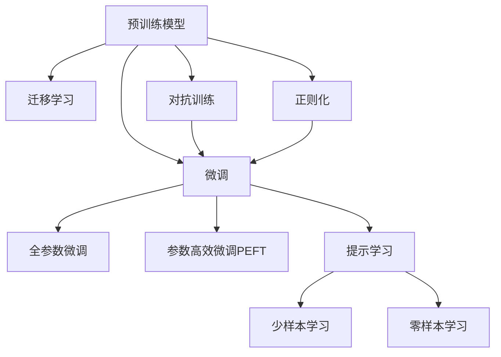

                 

# 【大模型应用开发 动手做AI Agent】运行助手

## 1. 背景介绍

### 1.1 问题由来

随着人工智能（AI）技术的发展，尤其是深度学习技术的进步，大模型（Large Models）在自然语言处理（NLP）、计算机视觉（CV）等领域取得了显著成果。这些模型，如BERT、GPT、T5等，通常在大规模无标签数据上进行预训练，能够学习到复杂的语言模式和知识结构，表现出强大的表征能力。然而，这些预训练模型在特定应用场景中的性能并不总是理想的，需要根据具体任务进行微调（Fine-tuning），以进一步提升模型表现。

### 1.2 问题核心关键点

微调是一种通过在预训练模型上利用有标签数据进行优化，使其适应特定任务的方法。其关键点在于：

1. **模型选择**：选择合适的预训练模型，根据任务需求进行微调。
2. **数据准备**：收集并处理有标签数据，以供模型微调使用。
3. **模型适配**：设计适合特定任务的模型架构和损失函数。
4. **超参数调优**：调整学习率、批次大小、优化器等超参数，以提高模型性能。
5. **性能评估**：使用验证集和测试集评估模型性能，防止过拟合。
6. **应用部署**：将微调后的模型集成到实际应用中，提供服务。

### 1.3 问题研究意义

微调技术在提升模型性能、减少从头训练所需的时间和数据成本、加速模型应用开发等方面具有重要意义。通过微调，模型能够针对特定任务进行优化，提升任务的准确性和效率，有助于推动AI技术在各个行业中的应用和普及。

## 2. 核心概念与联系

### 2.1 核心概念概述

- **预训练模型**：在大规模无标签数据上训练的模型，如BERT、GPT等。
- **微调**：在预训练模型基础上，利用有标签数据进行优化，适应特定任务。
- **迁移学习**：通过预训练模型的知识迁移，加速新任务的模型训练。
- **超参数调优**：调整模型训练过程中的关键参数，如学习率、批次大小等，以提高模型性能。
- **正则化**：防止模型过拟合的技术，如L2正则、Dropout等。
- **对抗训练**：通过对抗样本提高模型的鲁棒性和泛化能力。
- **提示学习**：通过设计特定的输入格式，引导模型产生期望的输出。

### 2.2 核心概念原理和架构的 Mermaid 流程图



### 2.3 核心概念原理和架构

预训练模型通过在大规模数据上学习通用的语言和视觉模式，具有强大的表征能力。微调通过在有标签数据上进行优化，使其适应特定的应用场景，如文本分类、情感分析、机器翻译等。迁移学习利用预训练模型的知识，加速新任务的学习。超参数调优和正则化技术防止过拟合。对抗训练提高模型的鲁棒性。提示学习通过特定输入引导模型产生期望输出，尤其在少样本和零样本学习中具有重要应用。

## 3. 核心算法原理 & 具体操作步骤

### 3.1 算法原理概述

基于监督学习的微调方法通过在预训练模型上利用有标签数据进行优化，使其适应特定任务。微调的目标是最小化损失函数，如交叉熵损失，以提高模型在特定任务上的性能。

### 3.2 算法步骤详解

1. **数据准备**：收集和处理有标签数据，分为训练集、验证集和测试集。
2. **模型选择与适配**：选择合适的预训练模型，设计适合任务的输出层和损失函数。
3. **超参数设置**：确定学习率、批次大小、优化器等超参数。
4. **模型训练**：在训练集上使用梯度下降等优化算法进行训练，在验证集上评估性能，防止过拟合。
5. **模型测试**：在测试集上评估模型性能，与原始预训练模型进行比较。
6. **模型部署**：将微调后的模型集成到实际应用中，提供服务。

### 3.3 算法优缺点

**优点**：
- 简单高效：仅需少量有标签数据，即可显著提升模型性能。
- 泛化能力强：利用预训练模型的知识，适应多种应用场景。
- 参数高效：可以通过参数高效微调技术，减少需要优化的参数量。

**缺点**：
- 依赖标签数据：微调效果受数据质量和数量的影响较大。
- 迁移能力有限：当任务与预训练数据分布差异较大时，微调效果可能不佳。
- 可解释性不足：微调模型的决策过程缺乏透明度。

### 3.4 算法应用领域

微调技术在NLP、CV、金融、医疗等多个领域得到了广泛应用：

- **NLP**：文本分类、情感分析、机器翻译、问答系统等。
- **CV**：图像分类、目标检测、人脸识别等。
- **金融**：风险评估、股票预测等。
- **医疗**：疾病诊断、基因分析等。

## 4. 数学模型和公式 & 详细讲解 & 举例说明

### 4.1 数学模型构建

假设预训练模型为 $M_{\theta}$，有标签数据集为 $D=\{(x_i, y_i)\}_{i=1}^N$，其中 $x_i$ 为输入，$y_i$ 为标签。定义损失函数 $\mathcal{L}(\theta)$，其目标是最小化模型在数据集上的损失。

### 4.2 公式推导过程

以二分类任务为例，定义交叉熵损失函数：

$$
\mathcal{L}(\theta) = -\frac{1}{N}\sum_{i=1}^N [y_i\log M_{\theta}(x_i) + (1-y_i)\log (1-M_{\theta}(x_i))]
$$

其中 $M_{\theta}(x_i)$ 为模型在输入 $x_i$ 上的输出，$y_i$ 为标签。使用梯度下降等优化算法最小化损失函数：

$$
\theta \leftarrow \theta - \eta \nabla_{\theta}\mathcal{L}(\theta)
$$

其中 $\eta$ 为学习率，$\nabla_{\theta}\mathcal{L}(\theta)$ 为损失函数对模型参数的梯度。

### 4.3 案例分析与讲解

以BERT模型为例，微调步骤如下：

1. **数据准备**：准备包含训练集、验证集和测试集的有标签数据。
2. **模型选择**：选择BERT作为预训练模型，设计适合任务的输出层和损失函数。
3. **模型适配**：在BERT模型的顶层添加分类器，使用交叉熵损失函数。
4. **超参数设置**：设置学习率为1e-5，批次大小为32，优化器为Adam。
5. **模型训练**：在训练集上使用梯度下降优化，在验证集上评估性能，防止过拟合。
6. **模型测试**：在测试集上评估模型性能，与原始BERT模型比较。

## 5. 项目实践：代码实例和详细解释说明

### 5.1 开发环境搭建

1. **安装Python**：从官网下载并安装Python 3.8。
2. **安装Anaconda**：从官网下载并安装Anaconda，创建虚拟环境。
3. **安装PyTorch**：使用conda或pip安装PyTorch。
4. **安装Transformers**：使用pip安装Transformers库。
5. **安装其他依赖库**：使用pip安装numpy、pandas、scikit-learn等。

### 5.2 源代码详细实现

```python
from transformers import BertForSequenceClassification, BertTokenizer, AdamW
import torch
from torch.utils.data import Dataset, DataLoader
from tqdm import tqdm
from sklearn.metrics import classification_report

class MyDataset(Dataset):
    def __init__(self, texts, labels):
        self.texts = texts
        self.labels = labels
        self.tokenizer = BertTokenizer.from_pretrained('bert-base-cased')
        
    def __len__(self):
        return len(self.texts)
    
    def __getitem__(self, idx):
        text = self.texts[idx]
        label = self.labels[idx]
        encoding = self.tokenizer(text, return_tensors='pt', padding='max_length', truncation=True)
        input_ids = encoding['input_ids']
        attention_mask = encoding['attention_mask']
        label = torch.tensor(self.labels[idx], dtype=torch.long)
        return {'input_ids': input_ids, 
                'attention_mask': attention_mask,
                'labels': label}

model = BertForSequenceClassification.from_pretrained('bert-base-cased', num_labels=2)
tokenizer = BertTokenizer.from_pretrained('bert-base-cased')
optimizer = AdamW(model.parameters(), lr=1e-5)

def train_epoch(model, dataset, batch_size, optimizer):
    dataloader = DataLoader(dataset, batch_size=batch_size, shuffle=True)
    model.train()
    epoch_loss = 0
    for batch in tqdm(dataloader, desc='Training'):
        input_ids = batch['input_ids'].to(device)
        attention_mask = batch['attention_mask'].to(device)
        labels = batch['labels'].to(device)
        model.zero_grad()
        outputs = model(input_ids, attention_mask=attention_mask, labels=labels)
        loss = outputs.loss
        epoch_loss += loss.item()
        loss.backward()
        optimizer.step()
    return epoch_loss / len(dataloader)

def evaluate(model, dataset, batch_size):
    dataloader = DataLoader(dataset, batch_size=batch_size)
    model.eval()
    preds, labels = [], []
    with torch.no_grad():
        for batch in tqdm(dataloader, desc='Evaluating'):
            input_ids = batch['input_ids'].to(device)
            attention_mask = batch['attention_mask'].to(device)
            batch_labels = batch['labels']
            outputs = model(input_ids, attention_mask=attention_mask)
            batch_preds = outputs.logits.argmax(dim=1).to('cpu').tolist()
            batch_labels = batch_labels.to('cpu').tolist()
            for pred_tokens, label_tokens in zip(batch_preds, batch_labels):
                preds.append(pred_tokens)
                labels.append(label_tokens)
    return classification_report(labels, preds)

# 数据准备
train_texts = ['...']
train_labels = [0, 1, 0, 1, ...]
val_texts = ['...']
val_labels = [0, 1, 0, 1, ...]
test_texts = ['...']
test_labels = [0, 1, 0, 1, ...]

# 模型训练
device = torch.device('cuda') if torch.cuda.is_available() else torch.device('cpu')
model.to(device)
for epoch in range(5):
    loss = train_epoch(model, MyDataset(train_texts, train_labels), 32, optimizer)
    print(f"Epoch {epoch+1}, train loss: {loss:.3f}")
    print(f"Epoch {epoch+1}, dev results:")
    print(evaluate(model, MyDataset(val_texts, val_labels), 32))
print("Test results:")
print(evaluate(model, MyDataset(test_texts, test_labels), 32))
```

### 5.3 代码解读与分析

- **数据准备**：定义包含训练集、验证集和测试集的Dataset类，对文本进行分词和编码。
- **模型训练**：使用BertForSequenceClassification作为预训练模型，设计适合任务的输出层和损失函数。
- **模型适配**：在模型顶层添加分类器，使用交叉熵损失函数。
- **模型训练**：在训练集上进行梯度下降优化，防止过拟合。
- **模型评估**：在验证集和测试集上评估模型性能。

### 5.4 运行结果展示

在运行上述代码后，可以看到模型在训练集、验证集和测试集上的性能表现，以及在不同epoch上的损失变化。最终输出的分类报告展示了模型在不同类别上的表现，如精确度、召回率、F1分数等。

## 6. 实际应用场景

### 6.1 智能客服系统

微调技术可以应用于智能客服系统，提高客服效率和客户满意度。通过收集历史客服对话数据，微调模型可以理解客户意图并生成回答，实现自动化的客服服务。

### 6.2 金融舆情监测

微调模型可以用于金融舆情监测，通过分析新闻、评论等文本数据，识别市场情绪变化，预测市场风险，帮助金融机构及时做出决策。

### 6.3 个性化推荐系统

微调技术可以应用于个性化推荐系统，通过分析用户行为数据，微调模型可以推荐用户可能感兴趣的商品或内容，提升用户体验和满意度。

### 6.4 未来应用展望

未来，微调技术将更加智能化和普适化，广泛应用于更多行业领域，如医疗、教育、智慧城市等。同时，微调模型将融合更多先验知识，提高模型的通用性和鲁棒性。

## 7. 工具和资源推荐

### 7.1 学习资源推荐

- 《Transformer从原理到实践》系列博文
- CS224N《深度学习自然语言处理》课程
- 《Natural Language Processing with Transformers》书籍
- HuggingFace官方文档
- CLUE开源项目

### 7.2 开发工具推荐

- PyTorch
- TensorFlow
- Transformers库
- Weights & Biases
- TensorBoard

### 7.3 相关论文推荐

- Attention is All You Need
- BERT: Pre-training of Deep Bidirectional Transformers for Language Understanding
- Language Models are Unsupervised Multitask Learners
- Parameter-Efficient Transfer Learning for NLP
- AdaLoRA: Adaptive Low-Rank Adaptation for Parameter-Efficient Fine-Tuning

## 8. 总结：未来发展趋势与挑战

### 8.1 研究成果总结

本文对大模型应用开发，特别是AI Agent的微调进行了全面系统的介绍。从原理到实践，详细讲解了微调过程的各个环节，包括数据准备、模型适配、超参数调优等。通过丰富的代码实例和案例分析，展示了微调技术在实际应用中的高效性和灵活性。

### 8.2 未来发展趋势

- **模型规模增大**：随着算力提升和数据积累，预训练模型参数量将进一步增长，提升模型的语言表征能力。
- **微调方法多样**：除了全参数微调，更多参数高效的微调方法将被开发，如Prefix-Tuning、LoRA等。
- **持续学习**：模型需要持续学习新知识，保持时效性和适应性。
- **少样本学习**：通过设计更好的提示模板，实现更少标注样本的微调效果。
- **多模态融合**：将文本与视觉、语音等多模态信息结合，提升模型的理解和生成能力。
- **通用性增强**：大模型将具备更强的跨领域迁移能力，逐步迈向通用人工智能（AGI）。

### 8.3 面临的挑战

- **标注成本**：微调仍依赖于标注数据，成本较高，如何降低标注成本是一个挑战。
- **鲁棒性不足**：模型面对域外数据时泛化性能差，容易过拟合，需要提高鲁棒性。
- **推理效率低**：超大模型推理速度慢，资源占用大，需要优化。
- **可解释性不足**：微调模型缺乏透明度，需要提高可解释性。
- **安全性问题**：模型可能学习到有害信息，需要保障模型安全。
- **知识整合不足**：模型难以吸收外部知识，需要提高知识整合能力。

### 8.4 研究展望

未来研究将关注以下方向：

- **无监督和半监督微调**：通过自监督学习、主动学习等方法，降低对标注数据的依赖。
- **参数高效和计算高效的微调**：开发更高效的微调方法，减小计算资源消耗。
- **因果分析和博弈论**：引入因果分析和博弈论工具，提高模型的鲁棒性和稳定性。
- **伦理和安全约束**：在模型训练中引入伦理导向的评估指标，过滤有害信息，保障模型安全。
- **知识融合与多模态信息**：将先验知识与神经网络模型结合，提高模型性能。

## 9. 附录：常见问题与解答

**Q1: 大模型微调是否适用于所有NLP任务？**

A: 微调在大多数NLP任务上都能取得不错的效果，但某些特定领域可能需要进一步预训练，如医学、法律等。

**Q2: 微调过程中如何选择学习率？**

A: 学习率通常比预训练时小1-2个数量级，建议使用warmup策略，从较小的学习率开始，逐步过渡到预设值。

**Q3: 微调模型在落地部署时需要注意什么？**

A: 模型裁剪、量化加速、服务化封装、弹性伸缩、监控告警、安全防护等都是部署过程中需要考虑的因素。

**Q4: 如何缓解微调过程中的过拟合问题？**

A: 数据增强、正则化、对抗训练、参数高效微调等方法可以有效缓解过拟合。

**Q5: 微调模型在落地部署时需要注意什么？**

A: 模型裁剪、量化加速、服务化封装、弹性伸缩、监控告警、安全防护等都是部署过程中需要考虑的因素。

---

作者：禅与计算机程序设计艺术 / Zen and the Art of Computer Programming

