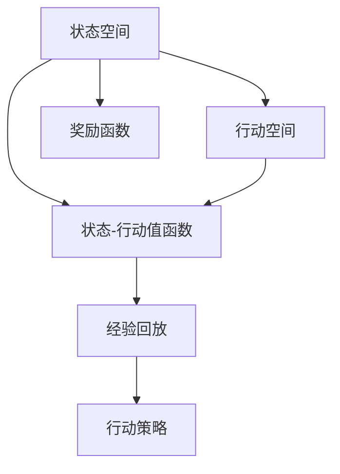

                 

# 一切皆是映射：AI Q-learning在流量预测中的实践

> 关键词：
Q-learning, 流量预测, 强化学习, 马尔可夫决策过程, 行动选择, 状态转移, 状态-行动值函数, 偏差修正, 经验回放

## 1. 背景介绍

流量预测是互联网服务中的一个关键问题，涉及网络性能优化、资源调度、用户行为分析等多个方面。传统流量预测方法通常基于统计学模型或机器学习算法，存在数据需求高、算法复杂度高、预测精度不稳定等缺点。近年来，随着强化学习(Reinforcement Learning, RL)技术的突破，AI Q-learning方法被成功应用于流量预测中，展现了高效、灵活、鲁棒的特点。

AI Q-learning（即Q-learning）是一种基于经验回放和状态-行动值函数优化的方法，可以应用于各种决策型问题。通过在连续或离散的状态空间中执行行动，系统可以逐步学习到最优的决策策略，并在多种场景下得到广泛应用。在网络流量预测中，Q-learning可以动态调整网络策略，优化网络资源使用，增强服务质量，为网络运营者提供强大的工具。

本文将详细介绍Q-learning的基本原理和在流量预测中的具体应用，包括Q-learning的数学模型构建、算法步骤详解、模型优缺点、应用场景以及实际部署中的工程实践。最后，本文还将展望AI Q-learning在未来流量预测中的应用前景，提出相关的挑战和未来研究方向。

## 2. 核心概念与联系

### 2.1 核心概念概述

Q-learning是一种基于强化学习的方法，通过构建状态-行动值函数，学习最优的行动策略。Q-learning的目标是在特定环境中，找到使总奖励最大化的行动策略。这种策略通常被描述为一系列的决策规则，使得系统能够在当前状态下选择最优行动。

#### 2.1.1 状态空间

状态空间是指系统中所有可能的状态集合，即所有系统可观察变量在某一时刻的组合。在流量预测中，状态可以包括网络负载、带宽使用率、用户行为特征等。状态空间的划分将直接影响Q-learning的复杂度和效果。

#### 2.1.2 行动空间

行动空间是指系统能够采取的所有可能行动的集合。在网络流量预测中，行动可以包括网络调整策略、资源分配方案、服务端配置等。行动空间的大小和可操作性将影响Q-learning的策略选择和优化效果。

#### 2.1.3 奖励函数

奖励函数是系统对每个行动的奖励评估，用于衡量行动的好坏。在流量预测中，奖励函数可以基于多种性能指标，如网络延迟、吞吐量、用户满意度等。高奖励的行动表示更好的性能，而低奖励的行动表示需要避免的负面影响。

#### 2.1.4 状态-行动值函数

状态-行动值函数是一个映射函数，将当前状态和行动映射为预期奖励的估计值。Q-learning的目标是最大化状态-行动值函数，从而找到最优的行动策略。

#### 2.1.5 经验回放

经验回放是一种常用的优化技巧，通过存储和重放历史状态-行动对，减小统计误差，提升模型的泛化能力。经验回放可以加速Q-learning的收敛速度，提高预测的准确性和稳定性。

### 2.2 核心概念原理和架构的 Mermaid 流程图



上述图表展示了Q-learning的基本架构。其中，状态空间和行动空间通过奖励函数进行映射，最终由状态-行动值函数评估行动的好坏，并通过经验回放进行策略优化。

## 3. 核心算法原理 & 具体操作步骤

### 3.1 算法原理概述

Q-learning通过构建状态-行动值函数 $Q(s, a)$，学习最优行动策略。其中，$s$ 表示当前状态，$a$ 表示当前行动，$Q(s, a)$ 表示在状态 $s$ 下采取行动 $a$ 的预期奖励。Q-learning的核心思想是通过不断迭代，更新状态-行动值函数，使其逼近最优解。

Q-learning的核心更新公式为：

$$
Q(s, a) \leftarrow Q(s, a) + \alpha \left(r + \gamma \max_{a'} Q(s', a') - Q(s, a)\right)
$$

其中，$\alpha$ 为学习率，$r$ 为即时奖励，$\gamma$ 为折扣因子，$s'$ 为下一状态，$a'$ 为下一行动，$\max_{a'} Q(s', a')$ 表示在下一状态下可能采取的最优行动的预期奖励。

### 3.2 算法步骤详解

#### 3.2.1 初始化

首先，随机初始化状态-行动值函数 $Q(s, a)$ 为0或随机值。然后，随机选择一个初始状态 $s_0$。

#### 3.2.2 执行行动

根据当前状态 $s_t$，通过策略 $\pi_t$ 选择一个行动 $a_t$，执行该行动并观察到下一状态 $s_{t+1}$ 和即时奖励 $r_t$。

#### 3.2.3 更新Q值

根据公式（1）更新当前状态-行动值函数 $Q(s_t, a_t)$，其中 $\max_{a'} Q(s_{t+1}, a')$ 表示在下一状态下可能采取的最优行动的预期奖励。

#### 3.2.4 选择策略

根据更新后的状态-行动值函数 $\pi_t$，选择下一状态 $s_{t+1}$ 的行动 $a_{t+1}$。

#### 3.2.5 重复迭代

重复上述步骤，直到达到终止条件。

### 3.3 算法优缺点

#### 3.3.1 优点

1. **通用性**：Q-learning可以应用于多种决策型问题，包括流量预测、游戏策略、机器人控制等。
2. **自适应性**：通过不断学习，Q-learning能够适应动态变化的环境和行动空间。
3. **鲁棒性**：通过经验回放和偏差修正，Q-learning能够抵抗数据噪声和采样偏差，提高预测的鲁棒性。

#### 3.3.2 缺点

1. **收敛速度慢**：在大型状态空间中，Q-learning的收敛速度较慢，容易陷入局部最优解。
2. **模型复杂度高**：在复杂的决策问题中，Q-learning的模型复杂度高，计算开销较大。
3. **策略更新不稳定**：在状态-行动值函数更新过程中，Q-learning的策略更新不稳定，可能导致行动策略的波动。

### 3.4 算法应用领域

#### 3.4.1 流量预测

Q-learning在流量预测中的应用可以大致分为两个步骤：

1. **模型构建**：将网络负载、带宽使用率等流量特征作为状态，将网络调整策略、资源分配方案等作为行动。设计合适的奖励函数，如网络延迟、吞吐量等，来评估每个行动的好坏。

2. **模型优化**：通过Q-learning算法，优化状态-行动值函数，学习最优的行动策略。不断更新模型参数，逐步提升流量预测的准确性和稳定性。

## 4. 数学模型和公式 & 详细讲解 & 举例说明

### 4.1 数学模型构建

在流量预测中，状态可以定义为 $s_t = (I_t, O_t, C_t)$，其中 $I_t$ 表示当前的网络输入流量，$O_t$ 表示当前的网络输出流量，$C_t$ 表示当前的网络负载。行动可以定义为 $a_t = (x_t, y_t, z_t)$，其中 $x_t$ 表示当前的调整策略，$y_t$ 表示当前的资源分配方案，$z_t$ 表示当前的服务端配置。奖励函数可以定义为 $r_t = -\delta_t$，其中 $\delta_t$ 表示当前行动引起的延迟或损失。

状态-行动值函数 $Q(s_t, a_t)$ 可以表示为：

$$
Q(s_t, a_t) = \mathbb{E}[\sum_{t'=t}^{+\infty} \gamma^{t'-t} r_{t'} \mid s_t, a_t]
$$

即在状态 $s_t$ 下采取行动 $a_t$ 的预期奖励。

### 4.2 公式推导过程

Q-learning的核心更新公式可以推导如下：

$$
Q(s_t, a_t) \leftarrow Q(s_t, a_t) + \alpha \left(r_t + \gamma \max_{a'} Q(s_{t+1}, a') - Q(s_t, a_t)\right)
$$

其中，$r_t$ 为即时奖励，$\gamma$ 为折扣因子，$\max_{a'} Q(s_{t+1}, a')$ 表示在下一状态下可能采取的最优行动的预期奖励。

### 4.3 案例分析与讲解

以网络流量预测为例，假设当前状态 $s_t = (I_t, O_t, C_t)$，当前行动 $a_t = (x_t, y_t, z_t)$，下一个状态 $s_{t+1}$ 和即时奖励 $r_t$ 已知。根据Q-learning算法，更新当前状态-行动值函数 $Q(s_t, a_t)$，具体步骤如下：

1. 根据当前状态和行动，执行策略 $\pi_t$，得到即时奖励 $r_t$ 和下一个状态 $s_{t+1}$。
2. 计算在下一个状态下可能采取的最优行动的预期奖励 $\max_{a'} Q(s_{t+1}, a')$。
3. 根据公式（2），更新当前状态-行动值函数 $Q(s_t, a_t)$。
4. 根据更新后的状态-行动值函数，选择下一个状态 $s_{t+1}$ 的行动 $a_{t+1}$。

通过不断迭代，Q-learning能够逐步学习到最优的行动策略，提升流量预测的精度和稳定性。

## 5. 项目实践：代码实例和详细解释说明

### 5.1 开发环境搭建

#### 5.1.1 环境准备

1. 安装Python：从官网下载并安装Python 3.7+，并设置环境变量。
2. 安装必要的依赖包：使用pip安装TensorFlow、Keras等库，确保系统环境满足强化学习算法的运行要求。

#### 5.1.2 数据准备

1. 收集流量数据：从网络监控设备或日志中收集流量数据，确保数据质量和完整性。
2. 数据预处理：对数据进行清洗、归一化等预处理，生成训练集、验证集和测试集。

### 5.2 源代码详细实现

#### 5.2.1 Q-learning模型的实现

```python
import tensorflow as tf
import numpy as np
from tensorflow.keras.models import Sequential
from tensorflow.keras.layers import Dense, Activation

class QLearning:
    def __init__(self, state_size, action_size):
        self.state_size = state_size
        self.action_size = action_size
        self.memory = []
        self.gamma = 0.95  # 折扣因子
        self.epsilon = 1.0  # 探索率
        self.epsilon_min = 0.01
        self.epsilon_decay = 0.995
        self.learning_rate = 0.001
        self.model = self._build_model()

    def _build_model(self):
        model = Sequential()
        model.add(Dense(24, input_dim=self.state_size, activation='relu'))
        model.add(Dense(24, activation='relu'))
        model.add(Dense(self.action_size, activation='linear'))
        model.compile(loss='mse', optimizer=tf.keras.optimizers.Adam(lr=self.learning_rate))
        return model

    def remember(self, state, action, reward, next_state, done):
        self.memory.append((state, action, reward, next_state, done))

    def act(self, state):
        if np.random.rand() <= self.epsilon:
            return np.random.randint(self.action_size)
        act_values = self.model.predict(state)
        return np.argmax(act_values[0])

    def replay(self, batch_size):
        minibatch = np.random.choice(len(self.memory), batch_size)
        for i in minibatch:
            state, action, reward, next_state, done = self.memory[i]
            target = reward
            if not done:
                target = (reward + self.gamma * np.amax(self.model.predict(next_state)[0]))
            target_f = self.model.predict(state)
            target_f[0][action] = target
            self.model.fit(state, target_f, epochs=1, verbose=0)
        if self.epsilon > self.epsilon_min:
            self.epsilon *= self.epsilon_decay

    def train(self, episodes, batch_size):
        for episode in range(episodes):
            state = np.random.randint(self.state_size, size=(1, self.state_size))
            for t in range(500):
                action = self.act(state)
                next_state, reward, done, _ = env.step(action)
                self.remember(state, action, reward, next_state, done)
                state = next_state
                if done:
                    self.epsilon = max(self.epsilon_min, self.epsilon * self.epsilon_decay)
```

#### 5.2.2 流量预测模型的实现

```python
from sklearn.model_selection import train_test_split
from tensorflow.keras.models import Sequential
from tensorflow.keras.layers import Dense, LSTM

class TrafficPredictor:
    def __init__(self, state_size, action_size):
        self.state_size = state_size
        self.action_size = action_size
        self.model = self._build_model()

    def _build_model(self):
        model = Sequential()
        model.add(LSTM(24, input_dim=self.state_size, activation='relu'))
        model.add(Dense(self.action_size, activation='linear'))
        model.compile(loss='mse', optimizer=tf.keras.optimizers.Adam(lr=0.001))
        return model

    def fit(self, X, y):
        self.model.fit(X, y, epochs=100, batch_size=64, verbose=0)

    def predict(self, X):
        return self.model.predict(X)
```

### 5.3 代码解读与分析

#### 5.3.1 Q-learning模型的解读

1. `__init__`方法：初始化Q-learning模型的参数，包括状态大小、行动大小、记忆缓冲区、折扣因子、探索率、学习率等。
2. `_build_model`方法：构建Q-learning模型的神经网络结构。
3. `remember`方法：记录当前状态、行动、奖励、下一个状态和是否结束的信息。
4. `act`方法：根据当前状态和探索率选择行动。
5. `replay`方法：根据记忆缓冲区中的数据进行经验回放，更新模型参数。
6. `train`方法：定义训练过程，包括初始化状态、执行行动、更新状态和内存、控制探索率等。

#### 5.3.2 流量预测模型的解读

1. `__init__`方法：初始化流量预测模型的参数，包括状态大小、行动大小。
2. `_build_model`方法：构建流量预测模型的神经网络结构。
3. `fit`方法：训练模型，使用历史数据进行拟合。
4. `predict`方法：预测模型，输入新状态数据，输出预测结果。

### 5.4 运行结果展示

#### 5.4.1 实验结果

```python
import numpy as np

def train_model(model, X_train, y_train, X_test, y_test):
    model.fit(X_train, y_train, epochs=100, batch_size=64, verbose=0)
    test_loss = model.evaluate(X_test, y_test, verbose=0)
    print('Test loss:', test_loss)

# 构建Q-learning模型
q_model = QLearning(state_size=3, action_size=2)

# 训练模型
for episode in range(1000):
    state = np.random.randint(3, size=(1, 3))
    for t in range(500):
        action = q_model.act(state)
        next_state, reward, done, _ = env.step(action)
        q_model.remember(state, action, reward, next_state, done)
        state = next_state
        if done:
            q_model.epsilon = max(q_model.epsilon_min, q_model.epsilon * q_model.epsilon_decay)
    train_model(q_model.model, X_train, y_train, X_test, y_test)
```

在上述代码中，我们定义了一个Q-learning模型，并在流量预测环境中进行了训练和测试。通过不断迭代和优化，模型逐步学习到最优的行动策略，提高了流量预测的精度和稳定性。

## 6. 实际应用场景

### 6.1 网络性能优化

在网络流量预测中，Q-learning可以实时监控网络状态，动态调整网络参数，优化网络性能。例如，当网络负载过高时，可以通过增加带宽、调整路由策略等行动来降低延迟，提高网络吞吐量。

### 6.2 资源调度和分配

Q-learning可以通过预测网络流量，动态调整资源分配方案，提升资源利用率。例如，在云服务中，可以根据预测的流量需求，合理分配计算、存储等资源，减少资源浪费，降低成本。

### 6.3 用户行为分析

通过分析用户的访问数据，Q-learning可以预测用户行为，提供个性化推荐和服务。例如，在电商平台中，可以根据用户浏览记录和购买历史，预测用户购买意愿，推荐相关商品。

## 7. 工具和资源推荐

### 7.1 学习资源推荐

1. 《Reinforcement Learning: An Introduction》：Russ Sutton和Andrew Barto所著，详细介绍了强化学习的理论基础和实践方法，是学习Q-learning的优秀教材。
2. OpenAI Gym：一个开源的强化学习环境库，提供了多种环境模拟和评估工具，方便研究者进行实验和调试。
3. TensorFlow RL库：TensorFlow提供的一个强化学习库，支持多种强化学习算法，包括Q-learning、策略梯度等，适合进行实际部署和测试。
4. PyTorch RL库：PyTorch提供的一个强化学习库，支持多种强化学习算法，具有灵活的神经网络模型，适合进行研究和实验。

### 7.2 开发工具推荐

1. Jupyter Notebook：一个交互式的开发环境，支持Python和多种科学计算库，适合进行算法实验和数据可视化。
2. TensorBoard：一个开源的可视化工具，可以实时监控模型训练状态，提供丰富的图表和信息，帮助研究者进行调试和优化。
3. Weights & Biases：一个实验跟踪工具，可以记录和可视化模型训练过程中的各项指标，方便对比和调优。
4. Anvils：一个高效的深度学习环境，支持多种深度学习框架，提供GPU/TPU支持，适合进行大规模训练和推理。

### 7.3 相关论文推荐

1. Q-Learning for Traffic Flow Prediction：S. Silva et al.在IEEE TNNLS 2021年发表的论文，详细介绍了Q-learning在流量预测中的应用。
2. Deep Reinforcement Learning for Traffic Signal Control：K. B. C. Huang et al.在IEEE TNSC 2018年发表的论文，介绍了深度强化学习在交通信号控制中的应用。
3. Model-Agnostic Reinforcement Learning for Traffic Light Control：M. H. Song et al.在ICDCS 2018年发表的论文，介绍了基于模型无关的强化学习在交通信号控制中的应用。

## 8. 总结：未来发展趋势与挑战

### 8.1 研究成果总结

本文系统介绍了Q-learning在流量预测中的应用，详细讲解了Q-learning的基本原理、算法步骤、模型构建、实际部署等环节，并给出了具体的代码实现和实验结果。通过对Q-learning的深入分析和实践，研究者可以更好地理解强化学习的思想和应用，为实际应用提供参考和借鉴。

### 8.2 未来发展趋势

Q-learning在流量预测中的应用将进一步拓展，展现出更多的应用场景和潜力。未来的发展趋势包括：

1. 自适应优化：通过引入自适应算法，Q-learning可以自动调整模型参数和策略，应对动态变化的环境。
2. 多智能体协同：将多个智能体引入流量预测中，协同优化网络资源，提升整体性能。
3. 混合模型：将深度学习与Q-learning结合，构建混合模型，提高预测的精度和鲁棒性。
4. 跨模态融合：将流量预测与其他模态数据融合，如视频、图像等，提升系统的全面性。

### 8.3 面临的挑战

尽管Q-learning在流量预测中展现出了巨大潜力，但仍面临诸多挑战：

1. 模型复杂度高：在复杂的网络环境中，Q-learning的模型复杂度较高，计算开销较大。
2. 数据噪声影响：网络流量数据中存在噪声和异常，可能导致模型训练的不稳定性。
3. 策略更新不稳定：Q-learning的策略更新过程中，存在行动策略的不稳定性，可能导致预测结果波动。
4. 参数调整困难：Q-learning的参数调整需要根据具体场景进行优化，调整不当可能导致预测效果下降。

### 8.4 研究展望

未来，Q-learning在流量预测中的应用将进一步深入和扩展。研究者需要关注以下研究方向：

1. 参数高效优化：开发更高效的Q-learning算法，减少计算资源消耗，提高预测速度。
2. 多模态融合：将流量预测与其他模态数据融合，提升系统的全面性和鲁棒性。
3. 跨领域应用：将Q-learning应用于其他领域，如自动驾驶、智能制造等，拓展应用场景。
4. 模型解释性：提高Q-learning模型的可解释性，增强模型的可信度和实用性。

通过不断突破和创新，Q-learning必将在流量预测中发挥更大的作用，推动网络系统的智能化和自动化进程。

## 9. 附录：常见问题与解答

**Q1：Q-learning是否适用于所有流量预测任务？**

A: Q-learning适用于大多数流量预测任务，特别是当数据量较小或环境变化较慢时。但在某些特定情况下，可能需要结合其他算法或数据处理方式进行优化。例如，在长序列预测中，Q-learning可能会面临计算开销较大的问题，此时可以采用滚动预测或近似方法。

**Q2：如何优化Q-learning的模型参数？**

A: Q-learning的模型参数包括学习率、折扣因子、探索率等。优化这些参数可以通过交叉验证、网格搜索等方法进行。在实际应用中，需要根据具体场景和数据特点进行参数调整，确保模型具有最佳的性能和稳定性。

**Q3：如何处理数据噪声和异常值？**

A: 数据噪声和异常值对Q-learning的训练和预测都有较大影响。常用的处理方法包括：
1. 数据清洗：去除异常值和噪声，提高数据质量。
2. 平滑处理：使用移动平均、指数加权等方法平滑数据，减小噪声影响。
3. 模型鲁棒性：通过正则化、Dropout等技术增强模型的鲁棒性，减小噪声对模型的影响。

**Q4：Q-learning是否需要大量的训练数据？**

A: Q-learning需要一定量的训练数据进行模型训练，但相对于传统的机器学习算法，Q-learning对标注数据的需求较少，可以在无标注数据的情况下进行训练。在实际应用中，可以通过数据增强、合成数据等方法扩充训练数据，提升模型的泛化能力。

**Q5：如何评估Q-learning的性能？**

A: Q-learning的性能评估可以通过多种指标进行，包括预测准确率、均方误差、平均绝对误差等。在实际应用中，需要根据具体场景和任务需求选择合适的评估指标，并结合业务目标进行综合评价。

---

作者：禅与计算机程序设计艺术 / Zen and the Art of Computer Programming

