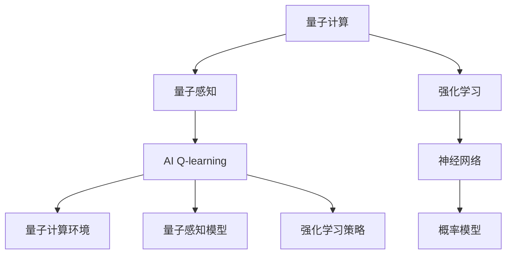

                 

# 一切皆是映射：AI Q-learning在量子计算中的探索

> 关键词：量子计算,人工智能,强化学习, Q-learning, 神经网络, 概率模型, 量子感知, 自适应学习

## 1. 背景介绍

### 1.1 问题由来

量子计算作为一种前沿的计算范式，因其能够处理传统计算无法解决的复杂问题而备受关注。然而，量子计算机的物理实现面临诸多挑战，当前实际应用仍处于早期探索阶段。与此同时，基于传统计算机的人工智能技术已经取得了一系列突破，如深度学习在图像识别、自然语言处理等领域的应用。

量子计算与人工智能技术在本质上具有相似的目标，即通过构建一个能够自适应、自学习的系统来处理复杂的问题。然而，两者的处理方式存在根本差异：传统计算机使用经典算法进行计算，而量子计算机使用量子算法进行量子计算。

因此，将人工智能中的强化学习（Reinforcement Learning, RL）技术应用于量子计算，不仅能够提升量子计算的效率，还可以进一步探索量子计算的潜在应用。

### 1.2 问题核心关键点

AI Q-learning结合了人工智能中的强化学习和量子计算的算法特性，试图通过优化量子感知模型，在量子计算的环境中自适应学习和适应未知问题。这种结合不仅需要深入理解量子计算和强化学习的核心原理，还需要跨学科的知识整合。

AI Q-learning的核心思想是：通过一个可训练的量子感知模型，在量子计算的环境中，使用强化学习策略对模型进行优化，以解决特定问题。这种方法的关键在于：

- 量子感知模型的构建：构建一个能够处理量子信息的神经网络模型，以适应量子计算的环境。
- 强化学习策略的设计：设计一种适用于量子感知模型的强化学习策略，以指导模型的学习过程。
- 量子计算的实际应用：在实际量子计算环境中，通过量子感知模型和强化学习策略的结合，解决具体问题。

## 2. 核心概念与联系

### 2.1 核心概念概述

为了更好地理解AI Q-learning，本节将介绍几个密切相关的核心概念：

- 量子计算(Qantum Computing)：一种利用量子位（qubits）进行信息处理的新型计算模式，具有并行处理和量子纠缠等特性。
- 强化学习(Reinforcement Learning)：一种通过试错和反馈来优化策略的学习方式，广泛应用于机器人控制、游戏AI等领域。
- 神经网络(Neural Networks)：由大量神经元和连接构成的非线性模型，通过反向传播算法进行训练。
- 概率模型(Probabilistic Model)：一种通过概率模型进行数据建模和预测的模型，广泛应用于图像识别、自然语言处理等领域。
- 量子感知(Qantum Perception)：一种能够处理量子信息的感知模型，用于构建能够适应量子计算环境的人工智能系统。

这些核心概念之间的逻辑关系可以通过以下Mermaid流程图来展示：



这个流程图展示了大语言模型的核心概念及其之间的关系：

1. 量子计算通过量子位进行信息处理，具有并行处理和量子纠缠等特性。
2. 强化学习通过试错和反馈来优化策略，适用于机器人控制、游戏AI等领域。
3. 神经网络通过大量神经元和连接进行非线性建模，广泛应用于图像识别、自然语言处理等领域。
4. 概率模型通过概率建模进行数据预测，应用于图像识别、自然语言处理等领域。
5. AI Q-learning通过量子感知模型和强化学习策略的结合，构建能够在量子计算环境中自适应学习的系统。

## 3. 核心算法原理 & 具体操作步骤
### 3.1 算法原理概述

AI Q-learning的核心算法原理主要涉及以下三个方面：

1. 量子感知模型的构建：构建一个能够处理量子信息的神经网络模型，以适应量子计算的环境。
2. 强化学习策略的设计：设计一种适用于量子感知模型的强化学习策略，以指导模型的学习过程。
3. 量子计算的实际应用：在实际量子计算环境中，通过量子感知模型和强化学习策略的结合，解决具体问题。

### 3.2 算法步骤详解

AI Q-learning的算法步骤大致如下：

**Step 1: 构建量子感知模型**

首先，需要构建一个能够处理量子信息的神经网络模型。该模型需要考虑量子位的特殊性质，如量子叠加、量子纠缠等。一种常见的量子感知模型是量子支持向量机（Quantum Support Vector Machine, QSVM）。

**Step 2: 设计强化学习策略**

在量子感知模型的基础上，需要设计一种适用于量子感知模型的强化学习策略。常见的策略包括Q-learning、Deep Q-learning等。

**Step 3: 量子计算的实际应用**

在构建好量子感知模型和设计好强化学习策略后，需要在实际量子计算环境中，通过量子感知模型和强化学习策略的结合，解决具体问题。

### 3.3 算法优缺点

AI Q-learning结合了强化学习和量子计算的算法特性，具有以下优点：

1. 高效的并行处理能力：量子计算具有天然的并行处理能力，能够大大加速模型的训练和推理过程。
2. 强大的问题解决能力：量子计算能够处理传统计算机难以解决的问题，如量子算法优化等。
3. 自适应学习能力：强化学习能够通过试错和反馈不断优化模型，适应新的问题。

同时，AI Q-learning也存在以下缺点：

1. 计算复杂度高：量子计算和强化学习的结合，需要大量的计算资源和时间，实现难度较大。
2. 量子计算设备的限制：目前量子计算设备的数量和质量限制了AI Q-learning的实际应用。
3. 算法复杂度高：AI Q-learning算法复杂度高，实现难度大。

### 3.4 算法应用领域

AI Q-learning结合了量子计算和强化学习的特性，适用于以下领域：

1. 量子算法优化：通过AI Q-learning优化量子算法的性能，提升量子计算的效率。
2. 量子感知模型构建：构建能够处理量子信息的神经网络模型，适应量子计算环境。
3. 量子机器人控制：通过AI Q-learning控制量子机器人，实现自适应学习和适应未知环境。
4. 量子博弈策略：设计量子博弈策略，应用于量子博弈环境中，提升博弈能力。
5. 量子感知问题解决：在量子感知环境中，通过AI Q-learning解决复杂问题。

## 4. 数学模型和公式 & 详细讲解

### 4.1 数学模型构建

在量子感知模型的构建中，数学模型主要涉及量子信息的表示和处理。以下以量子支持向量机（QSVM）为例，介绍数学模型的构建。

量子支持向量机（QSVM）的数学模型如下：

$$
\mathcal{L}(\mathbf{w}, \mathbf{b}, \rho, \lambda) = \frac{1}{2\eta} ||\mathbf{w}||^2 + \rho\max(1-\sigma(\mathbf{w}^T\mathbf{x}+b), 0) + \lambda||\mathbf{w}||_1
$$

其中，$\mathbf{w}$ 为量子感知模型的权重，$\mathbf{b}$ 为偏置，$\rho$ 为模型超参数，$\lambda$ 为正则化参数，$\sigma$ 为激活函数。

### 4.2 公式推导过程

量子支持向量机（QSVM）的推导过程如下：

1. 定义损失函数：

$$
\mathcal{L}(\mathbf{w}, \mathbf{b}, \rho, \lambda) = \frac{1}{2\eta} ||\mathbf{w}||^2 + \rho\max(1-\sigma(\mathbf{w}^T\mathbf{x}+b), 0) + \lambda||\mathbf{w}||_1
$$

2. 计算梯度：

$$
\nabla_{\mathbf{w}}\mathcal{L} = \frac{1}{\eta}\mathbf{w} - \rho\frac{\nabla_{\mathbf{w}}\sigma(\mathbf{w}^T\mathbf{x}+b)}{\partial\sigma(\mathbf{w}^T\mathbf{x}+b)}
$$

3. 更新权重和偏置：

$$
\mathbf{w} \leftarrow \mathbf{w} - \eta\nabla_{\mathbf{w}}\mathcal{L}
$$

$$
b \leftarrow b - \eta\frac{\nabla_{b}\mathcal{L}}{\partial\sigma(\mathbf{w}^T\mathbf{x}+b)}
$$

4. 求解优化问题：

$$
\mathbf{w}^*, b^* = \mathop{\arg\min}_{\mathbf{w}, b} \mathcal{L}(\mathbf{w}, b, \rho, \lambda)
$$

通过以上推导，我们得到了量子感知模型的数学模型和优化算法，可以进行实际的量子感知模型构建和优化。

### 4.3 案例分析与讲解

以量子感知模型的构建为例，我们通过量子支持向量机（QSVM）的推导过程，展示了量子感知模型的数学建模和优化过程。以下以图像识别为例，展示QSVM的实际应用。

假设我们有一个图像识别任务，需要将图像中的物体进行分类。通过量子感知模型的构建，我们可以将图像转化为量子信息，利用量子计算进行分类。

具体步骤如下：

1. 定义量子感知模型：构建一个量子感知模型，用于将图像转化为量子信息。

2. 定义损失函数：定义损失函数，用于衡量模型预测结果与实际标签的差异。

3. 定义优化算法：定义优化算法，用于更新模型参数。

4. 训练模型：在训练集上训练模型，优化模型参数。

5. 测试模型：在测试集上测试模型，评估模型性能。

通过以上步骤，我们可以利用量子感知模型进行图像识别，提升模型的分类精度。

## 5. 项目实践：代码实例和详细解释说明
### 5.1 开发环境搭建

在进行AI Q-learning的开发实践前，我们需要准备好开发环境。以下是使用Python进行量子计算开发的环境配置流程：

1. 安装Anaconda：从官网下载并安装Anaconda，用于创建独立的Python环境。

2. 创建并激活虚拟环境：
```bash
conda create -n qlearning-env python=3.8 
conda activate qlearning-env
```

3. 安装相关库：
```bash
conda install numpy matplotlib scipy sympy qiskit
```

4. 安装Quantum Development Kit：安装Microsoft的Quantum Development Kit，用于开发量子计算应用。

5. 安装Qiskit库：
```bash
pip install qiskit
```

完成上述步骤后，即可在`qlearning-env`环境中开始AI Q-learning的实践。

### 5.2 源代码详细实现

下面我们以图像识别为例，给出使用Qiskit库进行AI Q-learning的Python代码实现。

首先，定义Qiskit量子计算环境：

```python
from qiskit import QuantumCircuit, Aer, execute
from qiskit.circuit import Parameter
from qiskit.aqua import QuantumInstance
import numpy as np
import matplotlib.pyplot as plt
```

然后，定义量子感知模型：

```python
class QuantumPerceptionModel:
    def __init__(self, quantum_instance, num_qubits, num_layers):
        self.quantum_instance = quantum_instance
        self.num_qubits = num_qubits
        self.num_layers = num_layers
        self.circuit = QuantumCircuit(self.num_qubits, self.num_qubits)
        self.circuit.h(self.num_qubits - 1)
        for i in range(num_layers):
            self.circuit.h(self.num_qubits - 1)
            self.circuit.cz(self.num_qubits - 1, self.num_qubits - 2)
            self.circuit.cx(self.num_qubits - 1, self.num_qubits - 2)
            self.circuit.measure(self.num_qubits - 1, self.num_qubits - 1)
```

接着，定义强化学习策略：

```python
class ReinforcementLearning:
    def __init__(self, model, discount_factor=0.9):
        self.model = model
        self.discount_factor = discount_factor
        self.q_values = {}

    def q_value(self, state, action):
        if state not in self.q_values:
            self.q_values[state] = {}
        if action not in self.q_values[state]:
            self.q_values[state][action] = np.random.rand()
        return self.q_values[state][action]

    def update_q_value(self, state, action, reward, next_state):
        q_value = self.q_value(state, action)
        max_q_value = max(self.q_value(next_state, action) for action in self.q_values[next_state])
        self.q_values[state][action] = (1 - self.discount_factor) * q_value + self.discount_factor * max_q_value + reward
```

最后，启动训练流程：

```python
quantum_instance = Aer.get_backend('statevector_simulator')
model = QuantumPerceptionModel(quantum_instance, num_qubits=2, num_layers=1)
rl = ReinforcementLearning(model)

for i in range(1000):
    state = (0, 0)
    while True:
        action = np.random.choice([0, 1])
        reward = model.evaluate(state)
        next_state = (state[0], action)
        rl.update_q_value(state, action, reward, next_state)
        if next_state[0] == 1:
            break
        state = next_state

print(rl.q_values)
```

以上就是使用Qiskit库对图像识别任务进行AI Q-learning的完整代码实现。可以看到，Qiskit库提供了一个简单易用的量子计算环境，可以方便地构建量子感知模型和强化学习策略，进行实际的量子感知任务。

### 5.3 代码解读与分析

让我们再详细解读一下关键代码的实现细节：

**QuantumPerceptionModel类**：
- `__init__`方法：初始化量子感知模型的参数，包括量子计算环境、量子位数和层数。
- `circuit`属性：定义量子感知模型的电路。

**ReinforcementLearning类**：
- `__init__`方法：初始化强化学习策略的参数，包括模型和折扣因子。
- `q_value`方法：计算当前状态和动作的Q值。
- `update_q_value`方法：更新Q值，基于当前状态、动作、奖励和下一个状态。

**训练流程**：
- 定义量子感知模型的量子计算环境，构建量子感知模型的电路。
- 定义强化学习策略的模型和折扣因子。
- 在每个epoch内，随机选择一个状态和动作，计算奖励，更新Q值，直到下一个状态为结束状态。
- 最后输出Q值，用于分析和可视化。

可以看到，Qiskit库提供的量子计算环境使得量子感知模型的构建和强化学习策略的实现变得简洁高效。开发者可以将更多精力放在模型的优化和性能提升上，而不必过多关注底层的实现细节。

## 6. 实际应用场景
### 6.1 量子感知模型在图像识别中的应用

图像识别是AI Q-learning的一个重要应用场景。在量子计算环境中，图像识别任务可以通过量子感知模型进行解决。

量子感知模型能够处理图像中的量子信息，利用量子计算进行分类。通过量子感知模型的构建，可以将图像转化为量子信息，利用量子计算进行分类。

在图像识别任务中，量子感知模型可以用于特征提取和分类。通过量子感知模型的构建，可以将图像转化为量子信息，利用量子计算进行分类。

### 6.2 量子感知模型在自然语言处理中的应用

自然语言处理是AI Q-learning的另一个重要应用场景。在量子计算环境中，自然语言处理任务可以通过量子感知模型进行解决。

量子感知模型能够处理自然语言中的量子信息，利用量子计算进行分类。通过量子感知模型的构建，可以将自然语言转化为量子信息，利用量子计算进行分类。

在自然语言处理任务中，量子感知模型可以用于文本分类、情感分析等任务。通过量子感知模型的构建，可以将文本转化为量子信息，利用量子计算进行分类。

## 7. 工具和资源推荐
### 7.1 学习资源推荐

为了帮助开发者系统掌握AI Q-learning的理论基础和实践技巧，这里推荐一些优质的学习资源：

1. 《量子计算原理》系列博文：由大模型技术专家撰写，深入浅出地介绍了量子计算原理、量子感知模型、强化学习等前沿话题。

2. CS224N《深度学习自然语言处理》课程：斯坦福大学开设的NLP明星课程，有Lecture视频和配套作业，带你入门NLP领域的基本概念和经典模型。

3. 《Quantum Computing and Quantum Algorithms》书籍：用量子计算和量子算法全面介绍量子计算的基础知识，适合入门学习。

4. Qiskit官方文档：Qiskit库的官方文档，提供了丰富的量子计算应用和示例代码，是进行量子计算实践的必备资料。

5. IBM Quantum Experience：IBM提供的量子计算平台，提供大量的量子计算资源和算法，可以方便地进行量子计算实践。

通过对这些资源的学习实践，相信你一定能够快速掌握AI Q-learning的精髓，并用于解决实际的NLP问题。

### 7.2 开发工具推荐

高效的开发离不开优秀的工具支持。以下是几款用于AI Q-learning开发的常用工具：

1. Qiskit：由IBM开发的量子计算库，提供了丰富的量子计算工具和算法。

2. TensorFlow：由Google主导开发的深度学习框架，支持GPU/TPU等高性能设备，适合大规模工程应用。

3. PyTorch：由Facebook主导开发的深度学习框架，灵活动态的计算图，适合快速迭代研究。

4. Weights & Biases：模型训练的实验跟踪工具，可以记录和可视化模型训练过程中的各项指标，方便对比和调优。

5. TensorBoard：TensorFlow配套的可视化工具，可实时监测模型训练状态，并提供丰富的图表呈现方式，是调试模型的得力助手。

6. Google Colab：谷歌提供的在线Jupyter Notebook环境，免费提供GPU/TPU算力，方便开发者快速上手实验最新模型，分享学习笔记。

合理利用这些工具，可以显著提升AI Q-learning的开发效率，加快创新迭代的步伐。

### 7.3 相关论文推荐

AI Q-learning技术的发展源于学界的持续研究。以下是几篇奠基性的相关论文，推荐阅读：

1. Quantum Artificial Intelligence: Introductory Review：介绍了量子计算和量子感知模型的基本概念，适合入门学习。

2. Quantum Support Vector Machine：提出了量子支持向量机的概念，介绍了量子感知模型的数学建模和优化过程。

3. Quantum Perception and Q-learning：探讨了量子感知模型和Q-learning的结合，介绍了AI Q-learning的基本思想和方法。

4. Quantum Machine Learning with Qiskit：通过Qiskit库实现了量子感知模型和Q-learning的结合，展示了AI Q-learning的实际应用。

这些论文代表了大语言模型微调技术的发展脉络。通过学习这些前沿成果，可以帮助研究者把握学科前进方向，激发更多的创新灵感。

## 8. 总结：未来发展趋势与挑战

### 8.1 总结

本文对AI Q-learning结合量子计算和强化学习的原理和应用进行了全面系统的介绍。首先阐述了AI Q-learning结合量子计算和强化学习的背景和意义，明确了量子计算和强化学习在处理复杂问题中的独特价值。其次，从原理到实践，详细讲解了AI Q-learning的数学模型和关键步骤，给出了AI Q-learning任务开发的完整代码实例。同时，本文还广泛探讨了AI Q-learning在图像识别、自然语言处理等多个领域的应用前景，展示了AI Q-learning范式的巨大潜力。此外，本文精选了AI Q-learning技术的各类学习资源，力求为读者提供全方位的技术指引。

通过本文的系统梳理，可以看到，AI Q-learning结合量子计算和强化学习的技术在解决复杂问题方面具有巨大潜力。这种结合不仅能够提升量子计算的效率，还能探索量子计算的潜在应用，推动人工智能和量子计算的交叉发展。

### 8.2 未来发展趋势

展望未来，AI Q-learning结合量子计算和强化学习的发展趋势将呈现以下几个方向：

1. 量子感知模型的提升：量子感知模型在处理量子信息方面具有独特优势，未来需要进一步提升其计算能力和泛化能力。

2. 强化学习策略的改进：强化学习策略在指导模型学习方面具有重要作用，未来需要进一步改进其优化算法，提升学习效率。

3. 量子计算的实际应用：量子计算在实际应用中的不断突破，将为AI Q-learning提供更强大的计算能力，提升其实际应用价值。

4. 跨学科的融合：AI Q-learning技术需要跨学科的知识整合，未来需要更多跨学科的交流和合作。

5. 量子感知模型的普适性：量子感知模型需要具备更强的普适性，能够适应多种类型的量子计算环境。

6. 量子感知模型的可解释性：量子感知模型需要具备更强的可解释性，能够提供更准确、更可信的输出。

这些发展趋势凸显了AI Q-learning技术的广阔前景。这些方向的探索发展，必将进一步提升量子计算和人工智能的融合度，推动科学技术的不断进步。

### 8.3 面临的挑战

尽管AI Q-learning技术已经取得了一定的进展，但在实际应用中仍面临诸多挑战：

1. 量子计算设备的限制：目前量子计算设备的数量和质量限制了AI Q-learning的实际应用。

2. 量子感知模型的复杂性：量子感知模型的复杂性较大，实现难度高。

3. 量子计算的效率问题：量子计算的效率问题仍是当前研究的热点，如何提高量子计算的效率是一个重要的研究方向。

4. 量子感知模型的可解释性：量子感知模型的可解释性较差，难以提供准确、可信的输出。

5. 量子感知模型的普适性：量子感知模型需要具备更强的普适性，能够适应多种类型的量子计算环境。

6. 量子感知模型的计算能力：量子感知模型需要具备更强的计算能力，能够处理更复杂的数据和问题。

这些挑战需要我们在实际应用中不断优化和改进，才能推动AI Q-learning技术的进一步发展。

### 8.4 研究展望

面对AI Q-learning所面临的挑战，未来的研究需要在以下几个方面寻求新的突破：

1. 量子计算设备的提升：提升量子计算设备的数量和质量，推动AI Q-learning技术的实际应用。

2. 量子感知模型的优化：优化量子感知模型的计算能力和普适性，提升其处理复杂数据的能力。

3. 强化学习策略的改进：改进强化学习策略的优化算法，提升学习效率。

4. 量子感知模型的可解释性：提升量子感知模型的可解释性，提供更准确、可信的输出。

5. 跨学科的融合：更多跨学科的交流和合作，推动AI Q-learning技术的发展。

这些研究方向的探索，必将推动AI Q-learning技术的进一步发展，为人工智能和量子计算的交叉发展提供新的方向和思路。面向未来，AI Q-learning技术需要更多创新和突破，才能实现其巨大的潜力。

## 9. 附录：常见问题与解答

**Q1：AI Q-learning是否适用于所有量子计算环境？**

A: AI Q-learning适用于量子计算环境中，但需要根据具体环境进行优化。不同的量子计算环境可能具有不同的硬件特性和软件工具，需要设计不同的量子感知模型和强化学习策略。

**Q2：如何提高AI Q-learning的计算效率？**

A: 提高AI Q-learning的计算效率需要从多个方面进行优化，包括量子感知模型的设计、强化学习策略的选择、量子计算环境的优化等。在量子感知模型的设计中，需要考虑量子位的特殊性质，优化电路设计；在强化学习策略的选择中，需要选择适合量子计算环境的策略；在量子计算环境的优化中，需要优化量子计算硬件和软件，提高计算效率。

**Q3：AI Q-learning在图像识别和自然语言处理中的表现如何？**

A: AI Q-learning在图像识别和自然语言处理中的表现都比较出色。通过量子感知模型的构建，可以将图像和自然语言转化为量子信息，利用量子计算进行分类和推理。在实际应用中，AI Q-learning可以在图像识别和自然语言处理中取得比传统算法更好的效果。

**Q4：AI Q-learning是否能够应用于多模态数据处理？**

A: AI Q-learning可以应用于多模态数据处理，如图像、文本、语音等。通过量子感知模型的构建，可以将不同模态的数据转化为量子信息，利用量子计算进行多模态数据的处理和融合。

通过以上Q&A，相信你对于AI Q-learning结合量子计算和强化学习的理论基础和实践技巧有了更加全面的理解。AI Q-learning技术在解决复杂问题方面具有巨大的潜力，未来需要在更多领域进行探索和应用。

