                 

# 一切皆是映射：AI的伦理问题与未来挑战

> 关键词：AI伦理,数据隐私,算法透明,算法偏见,可解释AI,AI治理

## 1. 背景介绍

随着人工智能技术的迅猛发展，AI在各行各业的应用日益广泛。AI不仅提升了生产力，改善了人们的生活质量，还深刻影响了社会结构和价值观。然而，在AI带来诸多便利的同时，也引发了诸多伦理问题和社会挑战。本文将系统探讨AI的伦理问题，并展望未来AI发展的挑战与趋势。

## 2. 核心概念与联系

### 2.1 核心概念概述

为了更好地理解AI的伦理问题，我们需要先梳理相关核心概念：

- **AI伦理**：AI的伦理问题是指在AI开发、应用过程中，可能产生的对个体、社会和环境的负面影响。这些影响包括但不限于数据隐私、算法透明、算法偏见、可解释AI和AI治理等问题。
- **数据隐私**：指个人数据在收集、存储、处理和共享过程中的安全性和保护。数据隐私问题常与AI系统的大数据需求紧密相关。
- **算法透明**：指AI算法的可解释性和可理解性，即算法的决策过程和依据应清晰可见，以防止"黑箱"操作带来的不透明性。
- **算法偏见**：指AI算法在训练和应用过程中，由于数据集偏见或设计缺陷，导致算法结果对特定群体产生不公平对待的问题。
- **可解释AI**：指能够解释其决策依据和推理过程的AI系统，有助于增强算法的可信度和公平性。
- **AI治理**：指对AI技术开发、应用和管理的规范和制度构建，包括技术标准、法律法规、伦理准则等方面。

这些概念之间存在紧密联系，共同构成了AI伦理问题研究的框架：


数据隐私保护和算法偏见是导致算法透明和可解释AI的直接原因，而可解释AI又是实现公平AI治理的基础。因此，解决AI伦理问题需要综合考虑各个方面，构建完善的AI治理体系。

### 2.2 核心概念原理和架构的 Mermaid 流程图

```mermaid
graph TB
    A[数据隐私] --> B[数据加密]
    B --> C[数据匿名]
    C --> D[数据脱敏]
    D --> E[安全存储]
    E --> F[访问控制]
    F --> G[用户知情同意]

    A --> H[算法偏见]
    H --> I[数据清洗]
    I --> J[特征选择]
    J --> K[算法修正]
    K --> L[模型公平性评估]

    A --> M[算法透明]
    M --> N[模型可解释]
    N --> O[决策透明]
    O --> P[解释性分析]

    A --> Q[可解释AI]
    Q --> R[决策链]
    R --> S[透明度增强]
    S --> T[模型评估]
    T --> U[用户反馈]

    A --> V[AI治理]
    V --> W[法律法规]
    W --> X[伦理准则]
    X --> Y[技术标准]
    Y --> Z[监管机制]
```



上图的流程图展示了AI伦理问题的整体架构。数据隐私保护通过加密、匿名和脱敏技术实现；算法偏见通过数据清洗、特征选择和模型修正等手段加以缓解；算法透明和可解释AI则涉及模型解释、透明度增强和用户反馈等环节；而AI治理则需构建法律法规、伦理准则、技术标准和监管机制，以确保AI的合理使用。

## 3. 核心算法原理 & 具体操作步骤

### 3.1 算法原理概述

AI伦理问题的解决涉及到多个层面的算法原理。以下是对几个关键算法的简要概述：

- **数据隐私保护算法**：通过差分隐私、同态加密、联邦学习等技术，保护数据隐私，防止数据泄露。
- **算法偏见检测与修正算法**：利用算法公平性评估指标（如 fairness metric），检测和修正算法中的偏见，如通过再抽样、加权等方法平衡数据分布。
- **可解释AI生成算法**：利用LIME、SHAP等技术，生成局部可解释模型，揭示AI系统的决策依据。
- **AI治理算法**：通过道德算法、行为准则等方法，构建AI系统开发的伦理指南，防止滥用。

### 3.2 算法步骤详解

为了更具体地了解这些算法的详细步骤，下面分别对几种常见算法进行详细讲解：

**数据隐私保护算法**：

1. **数据加密**：对数据进行加密处理，防止未经授权的访问。
2. **数据匿名**：通过数据脱敏、去标识化等技术，避免个人信息泄露。
3. **数据脱敏**：对敏感数据进行隐藏处理，防止被反向识别。
4. **安全存储**：采用加密存储、访问控制等措施，保护数据安全。
5. **用户知情同意**：获取用户同意，明确数据使用目的和范围。

**算法偏见检测与修正算法**：

1. **数据清洗**：移除或处理含有偏见的数据，如性别、种族等敏感属性。
2. **特征选择**：选择不含偏见的特征，如去除有偏见的特征工程步骤。
3. **算法修正**：通过再抽样、加权等方法，平衡数据分布，减少算法偏见。
4. **模型公平性评估**：使用 fairness metric（如 demographic parity、equal opportunity）评估模型公平性。
5. **结果评估**：对比修正前后的结果，确保偏见显著减少。

**可解释AI生成算法**：

1. **局部可解释模型生成**：利用LIME、SHAP等方法，生成局部可解释模型，解释决策依据。
2. **决策链生成**：通过决策树、规则等方法，展示决策过程。
3. **透明度增强**：通过特征重要性分析、权重系数等技术，增强模型透明度。
4. **解释性分析**：分析模型特征对结果的影响，揭示决策依据。
5. **用户反馈**：收集用户反馈，改进模型解释性。

**AI治理算法**：

1. **道德算法设计**：在算法设计阶段引入道德准则，防止算法滥用。
2. **行为准则制定**：制定AI系统的行为准则，明确使用规范。
3. **技术标准制定**：制定AI技术标准，确保系统质量。
4. **法律法规遵守**：确保AI系统遵守法律法规，防止违规操作。
5. **监管机制构建**：建立监管机制，监督AI系统运行。

### 3.3 算法优缺点

**数据隐私保护算法**：

优点：
- 能够有效防止数据泄露，保障数据安全。
- 通过差分隐私等技术，能够在保护隐私的同时进行数据分析。

缺点：
- 处理复杂，算法实现难度大。
- 隐私保护程度难以量化，存在隐私与数据可用性之间的平衡问题。

**算法偏见检测与修正算法**：

优点：
- 能够有效检测和修正算法中的偏见，确保算法公平性。
- 通过数据清洗、特征选择等技术，提高模型性能。

缺点：
- 依赖数据质量，数据偏差可能导致算法偏见无法完全消除。
- 修正过程可能引入新的偏见，需要持续监控和调整。

**可解释AI生成算法**：

优点：
- 能够提高算法透明度和可信度，增加用户信任。
- 通过局部可解释模型，揭示决策依据，提升公平性。

缺点：
- 生成模型可能过于简单，无法解释复杂决策过程。
- 解释过程可能不完整，存在信息丢失的问题。

**AI治理算法**：

优点：
- 通过规范和制度构建，防止AI滥用，保障公平公正。
- 通过道德算法和技术标准，提升系统质量。

缺点：
- 治理体系复杂，难以全面覆盖所有应用场景。
- 法律法规更新速度较慢，可能滞后于技术发展。

### 3.4 算法应用领域

AI伦理问题涉及到诸多领域，以下列举几个主要应用场景：

- **医疗领域**：AI在医疗诊断、治疗方案推荐中的应用，需考虑数据隐私、算法偏见、可解释性和伦理治理。
- **金融领域**：AI在信用评估、反欺诈检测中的应用，需重视算法透明、隐私保护和公平性。
- **教育领域**：AI在个性化推荐、智能辅导中的应用，需关注用户隐私、算法公平和伦理准则。
- **政府治理**：AI在公共服务、政策制定中的应用，需确保算法透明、治理合规和社会公平。

## 4. 数学模型和公式 & 详细讲解 & 举例说明

### 4.1 数学模型构建

在AI伦理问题中，许多问题可以通过数学模型来量化和分析。以下是几个常见模型的构建方式：

**数据隐私保护模型**：

1. **差分隐私模型**：基于拉普拉斯机制（Laplacian mechanism），通过添加噪声来保护数据隐私。
2. **同态加密模型**：在加密状态下进行计算，保护数据隐私。
3. **联邦学习模型**：多节点协同学习，数据不集中存储，保护数据隐私。

**算法偏见检测与修正模型**：

1. **数据清洗模型**：通过过滤、替换等方法，处理含有偏见的数据。
2. **特征选择模型**：选择不包含偏见的特征，去除有偏见的特征工程步骤。
3. **算法修正模型**：通过再抽样、加权等方法，平衡数据分布。
4. **模型公平性评估模型**：使用 fairness metric（如 demographic parity、equal opportunity）评估模型公平性。

**可解释AI生成模型**：

1. **局部可解释模型生成**：利用LIME、SHAP等方法，生成局部可解释模型，解释决策依据。
2. **决策链生成模型**：通过决策树、规则等方法，展示决策过程。
3. **透明度增强模型**：通过特征重要性分析、权重系数等技术，增强模型透明度。

**AI治理模型**：

1. **道德算法设计模型**：在算法设计阶段引入道德准则，防止算法滥用。
2. **行为准则制定模型**：制定AI系统的行为准则，明确使用规范。
3. **技术标准制定模型**：制定AI技术标准，确保系统质量。
4. **法律法规遵守模型**：确保AI系统遵守法律法规，防止违规操作。
5. **监管机制构建模型**：建立监管机制，监督AI系统运行。

### 4.2 公式推导过程

以下对几种常见算法的公式推导过程进行详细讲解：

**差分隐私模型**：

1. **拉普拉斯机制**：
   $$
   \epsilon-\text{DP}(X) = \frac{1}{\epsilon} \log \frac{1}{\delta} + \frac{\Delta(X)}{\epsilon}
   $$
   其中 $\epsilon$ 为隐私保护参数，$\delta$ 为失败概率，$\Delta(X)$ 为数据集的敏感度。

**同态加密模型**：

1. **同态加法**：
   $$
   c_1 = m_1 + c_0
   $$
   其中 $c_0$ 为明文数据，$m_1$ 为加密后数据，$c_1$ 为加密后数据的解密结果。

**联邦学习模型**：

1. **联邦平均算法**：
   $$
   w_{avg} = \frac{1}{K} \sum_{k=1}^K w_k
   $$
   其中 $w_k$ 为第 $k$ 个节点的模型参数，$K$ 为节点数量。

**算法偏见检测与修正模型**：

1. **数据清洗模型**：
   $$
   X_{clean} = f(X_{raw})
   $$
   其中 $X_{raw}$ 为原始数据，$X_{clean}$ 为清洗后的数据，$f$ 为清洗函数。

**可解释AI生成模型**：

1. **LIME局部可解释模型**：
   $$
   \hat{y} = \sum_{i=1}^{n} a_i \phi_i(x)
   $$
   其中 $a_i$ 为权重系数，$\phi_i(x)$ 为局部可解释模型。

**AI治理模型**：

1. **行为准则制定模型**：
   $$
   \text{准则} = \{r_1, r_2, ..., r_n\}
   $$
   其中 $r_i$ 为第 $i$ 条行为准则。

### 4.3 案例分析与讲解

**案例一：医疗领域中的AI伦理问题**

医疗领域中的AI伦理问题主要集中在数据隐私保护和算法偏见两个方面。以医疗影像诊断为例：

1. **数据隐私保护**：
   - **问题**：医疗影像数据通常包含患者隐私信息，数据泄露可能导致患者隐私泄露。
   - **解决方案**：采用差分隐私和同态加密技术，保护数据隐私，防止数据泄露。

2. **算法偏见**：
   - **问题**：医疗影像诊断算法可能对不同性别、种族的患者产生不公平对待。
   - **解决方案**：通过数据清洗、特征选择和算法修正等手段，平衡数据分布，减少算法偏见。

**案例二：金融领域中的AI伦理问题**

金融领域中的AI伦理问题主要集中在算法透明和公平性两个方面。以信用评估为例：

1. **算法透明**：
   - **问题**：信用评估模型通常是"黑箱"操作，缺乏透明度，难以解释。
   - **解决方案**：利用可解释AI技术，生成局部可解释模型，揭示决策依据。

2. **公平性**：
   - **问题**：信用评估算法可能对不同收入、职业的人群产生不公平对待。
   - **解决方案**：通过公平性评估和算法修正，平衡数据分布，确保算法公平性。

## 5. 项目实践：代码实例和详细解释说明

### 5.1 开发环境搭建

在进行AI伦理问题的项目实践时，需要准备好开发环境。以下是使用Python进行TensorFlow开发的Python环境配置流程：

1. 安装Anaconda：从官网下载并安装Anaconda，用于创建独立的Python环境。

2. 创建并激活虚拟环境：
```bash
conda create -n tf-env python=3.8 
conda activate tf-env
```

3. 安装TensorFlow：根据CUDA版本，从官网获取对应的安装命令。例如：
```bash
conda install tensorflow
```

4. 安装各类工具包：
```bash
pip install numpy pandas scikit-learn matplotlib tqdm jupyter notebook ipython
```

完成上述步骤后，即可在`tf-env`环境中开始项目实践。

### 5.2 源代码详细实现

下面我们以医疗影像诊断为例，给出使用TensorFlow对图像分类模型进行差分隐私处理的代码实现。

首先，定义模型和数据：

```python
import tensorflow as tf
from tensorflow.keras import layers, models
from tensorflow.keras.datasets import mnist
from tensorflow.keras.utils import to_categorical

(x_train, y_train), (x_test, y_test) = mnist.load_data()

x_train = x_train.reshape(-1, 28, 28, 1).astype('float32') / 255.0
x_test = x_test.reshape(-1, 28, 28, 1).astype('float32') / 255.0
y_train = to_categorical(y_train, num_classes=10)
y_test = to_categorical(y_test, num_classes=10)
```

然后，定义差分隐私处理函数：

```python
import numpy as np
from tensorflow.keras.layers import Conv2D, MaxPooling2D, Flatten, Dense

def add_laplacian_noise(x, epsilon):
    n = x.shape[0]
    m = x.shape[1]
    k = x.shape[2]
    l = x.shape[3]
    std = np.sqrt(2.0 * np.exp(-2 * epsilon)) / epsilon
    noise = np.random.normal(0.0, std, (n, m, k, l))
    return (x + noise) / epsilon
```

接着，定义差分隐私处理的完整代码：

```python
def private_train(x_train, y_train, x_test, y_test, num_epochs=10, batch_size=64, epsilon=1.0):
    model = models.Sequential([
        layers.Conv2D(32, (3, 3), activation='relu', input_shape=(28, 28, 1)),
        layers.MaxPooling2D((2, 2)),
        layers.Conv2D(64, (3, 3), activation='relu'),
        layers.MaxPooling2D((2, 2)),
        layers.Flatten(),
        layers.Dense(64, activation='relu'),
        layers.Dense(10, activation='softmax')
    ])

    model.compile(optimizer='adam', loss='categorical_crossentropy', metrics=['accuracy'])

    for epoch in range(num_epochs):
        x_train_dp = add_laplacian_noise(x_train, epsilon)
        y_train_dp = add_laplacian_noise(y_train, epsilon)

        model.fit(x_train_dp, y_train_dp, batch_size=batch_size, epochs=1)

    model.evaluate(x_test, y_test)

private_train(x_train, y_train, x_test, y_test, num_epochs=10, batch_size=64, epsilon=1.0)
```

以上就是使用TensorFlow对图像分类模型进行差分隐私处理的完整代码实现。可以看到，通过定义差分隐私处理函数`add_laplacian_noise`，在模型训练过程中添加噪声，实现数据隐私保护。

### 5.3 代码解读与分析

让我们再详细解读一下关键代码的实现细节：

**定义模型和数据**：
- `(x_train, y_train), (x_test, y_test) = mnist.load_data()`：加载MNIST数据集。
- `x_train = x_train.reshape(-1, 28, 28, 1).astype('float32') / 255.0`：将输入数据归一化。
- `y_train = to_categorical(y_train, num_classes=10)`：将标签转换为one-hot编码。

**差分隐私处理函数**：
- `import numpy as np`：导入numpy库，用于计算拉普拉斯噪声。
- `from tensorflow.keras.layers import Conv2D, MaxPooling2D, Flatten, Dense`：导入TensorFlow库中的卷积层、池化层、全连接层等。
- `def add_laplacian_noise(x, epsilon)`：定义差分隐私处理函数，将输入数据`x`加上拉普拉斯噪声，实现隐私保护。

**差分隐私处理的完整代码**：
- `private_train`函数：定义差分隐私处理的完整代码，包括模型定义、编译和训练等步骤。
- `x_train_dp = add_laplacian_noise(x_train, epsilon)`：在模型训练过程中添加差分隐私处理。

可以看到，差分隐私处理函数`add_laplacian_noise`在模型训练过程中添加拉普拉斯噪声，实现隐私保护。通过差分隐私技术，可以保护数据隐私，防止数据泄露，同时还能保障数据可用性。

当然，工业级的系统实现还需考虑更多因素，如模型保存和部署、超参数的自动搜索、更灵活的任务适配层等。但核心的差分隐私处理思路基本与此类似。

## 6. 实际应用场景

### 6.1 医疗领域

在医疗领域，AI伦理问题主要集中在数据隐私保护和算法偏见两个方面。以医疗影像诊断为例：

1. **数据隐私保护**：
   - **问题**：医疗影像数据通常包含患者隐私信息，数据泄露可能导致患者隐私泄露。
   - **解决方案**：采用差分隐私和同态加密技术，保护数据隐私，防止数据泄露。

2. **算法偏见**：
   - **问题**：医疗影像诊断算法可能对不同性别、种族的患者产生不公平对待。
   - **解决方案**：通过数据清洗、特征选择和算法修正等手段，平衡数据分布，减少算法偏见。

### 6.2 金融领域

在金融领域，AI伦理问题主要集中在算法透明和公平性两个方面。以信用评估为例：

1. **算法透明**：
   - **问题**：信用评估模型通常是"黑箱"操作，缺乏透明度，难以解释。
   - **解决方案**：利用可解释AI技术，生成局部可解释模型，揭示决策依据。

2. **公平性**：
   - **问题**：信用评估算法可能对不同收入、职业的人群产生不公平对待。
   - **解决方案**：通过公平性评估和算法修正，平衡数据分布，确保算法公平性。

### 6.3 教育领域

在教育领域，AI伦理问题主要集中在用户隐私和算法公平性两个方面。以个性化推荐为例：

1. **用户隐私**：
   - **问题**：个性化推荐系统需要收集用户的浏览、点击等行为数据，可能侵犯用户隐私。
   - **解决方案**：采用差分隐私和同态加密技术，保护用户隐私，防止数据泄露。

2. **算法公平性**：
   - **问题**：个性化推荐算法可能对不同兴趣、需求的用户产生不公平对待。
   - **解决方案**：通过公平性评估和算法修正，平衡数据分布，确保算法公平性。

### 6.4 未来应用展望

随着AI伦理问题研究的不断深入，未来AI伦理问题将呈现以下几个发展趋势：

1. **隐私保护技术的发展**：隐私保护技术将更加成熟，保护手段将更加多样化，如差分隐私、同态加密等技术将更加普及。

2. **算法透明性的提升**：算法透明性将成为AI系统设计的重要指标，通过可解释AI技术，揭示算法的决策依据和过程。

3. **算法公平性的实现**：算法公平性将成为AI系统开发的重点，通过公平性评估和算法修正，确保算法的公平性。

4. **伦理治理体系的完善**：AI治理体系将更加完善，法律法规、伦理准则、技术标准等将更加健全。

5. **跨领域应用的推广**：AI伦理问题将不再局限于某一特定领域，跨领域应用的推广将更加广泛。

总之，随着AI伦理问题研究的不断深入，未来AI伦理问题将得到更加全面、深入的解决，AI系统将在各个领域得到更广泛的应用，并发挥更大的社会价值。

## 7. 工具和资源推荐

### 7.1 学习资源推荐

为了帮助开发者系统掌握AI伦理问题的理论基础和实践技巧，这里推荐一些优质的学习资源：

1. 《隐私保护与数据安全》课程：斯坦福大学开设的隐私保护课程，详细讲解隐私保护技术和方法。

2. 《公平与透明机器学习》书籍：Morteza Zadpoor等人合著，全面介绍机器学习中的公平性和透明性问题。

3. 《可解释人工智能》书籍：Risto Valkonen等人合著，深入介绍可解释AI的原理和方法。

4. 《AI伦理与社会》课程：多伦多大学开设的AI伦理课程，介绍AI伦理的基本概念和应用场景。

5. 《AI治理》书籍：Yuval Even等人合著，全面介绍AI治理的框架和实践。

通过对这些资源的学习实践，相信你一定能够全面掌握AI伦理问题的核心概念和解决方法，并用于解决实际的伦理问题。

### 7.2 开发工具推荐

高效的开发离不开优秀的工具支持。以下是几款用于AI伦理问题开发的常用工具：

1. TensorFlow：基于Python的开源深度学习框架，灵活动态的计算图，适合快速迭代研究。

2. PyTorch：基于Python的开源深度学习框架，支持动态计算图，易于调试和优化。

3. TensorBoard：TensorFlow配套的可视化工具，可实时监测模型训练状态，并提供丰富的图表呈现方式。

4. Weights & Biases：模型训练的实验跟踪工具，可以记录和可视化模型训练过程中的各项指标，方便对比和调优。

5. Colab：谷歌推出的在线Jupyter Notebook环境，免费提供GPU/TPU算力，方便开发者快速上手实验最新模型。

合理利用这些工具，可以显著提升AI伦理问题的开发效率，加快创新迭代的步伐。

### 7.3 相关论文推荐

AI伦理问题涉及到诸多领域，以下列举几篇经典论文，推荐阅读：

1. "The Privacy Risks of Differential Privacy"（隐私风险的差分隐私）：Dwork等人发表的隐私保护经典论文。

2. "Interpretable Machine Learning: A Guide for Making Black Box Models Explainable"（可解释机器学习：使黑箱模型可解释的指南）：Guido Fung等人的可解释AI论文。

3. "Fairness, Accountability and Transparency in Machine Learning"（机器学习中的公平性、可问责性和透明度）：D,Schmidt等人发表的机器学习公平性论文。

4. "Ethical Considerations in the Development of AI Systems"（AI系统开发中的伦理考虑）：Maynard Dixon等人的伦理治理论文。

这些论文代表了AI伦理问题的研究前沿，通过学习这些经典文献，可以帮助研究者把握学科发展脉络，激发更多的创新灵感。

## 8. 总结：未来发展趋势与挑战

### 8.1 研究成果总结

本文系统探讨了AI伦理问题，包括数据隐私、算法透明、算法偏见、可解释AI和AI治理等方面的内容。通过详细讲解各种算法原理和操作步骤，展示了AI伦理问题的综合解决思路。同时，通过实际案例分析，帮助读者理解不同应用场景下的具体解决方案。

### 8.2 未来发展趋势

未来AI伦理问题将呈现以下几个发展趋势：

1. **隐私保护技术的成熟**：隐私保护技术将更加成熟，保护手段将更加多样化。
2. **算法透明性的提升**：算法透明性将成为AI系统设计的重要指标。
3. **算法公平性的实现**：算法公平性将成为AI系统开发的重点。
4. **伦理治理体系的完善**：AI治理体系将更加完善。
5. **跨领域应用的推广**：AI伦理问题将不再局限于某一特定领域，跨领域应用的推广将更加广泛。

### 8.3 面临的挑战

尽管AI伦理问题研究取得了一些进展，但仍面临诸多挑战：

1. **隐私保护难度大**：隐私保护技术实现复杂，需平衡隐私保护与数据可用性。
2. **算法透明性不足**：一些复杂算法仍存在"黑箱"问题，难以解释。
3. **算法偏见问题普遍**：算法偏见问题普遍存在，难以完全消除。
4. **伦理治理滞后**：AI伦理治理体系尚不完善，需持续构建。

### 8.4 研究展望

面对AI伦理问题面临的挑战，未来的研究需要在以下几个方面寻求新的突破：

1. **隐私保护技术的新方法**：探索新型的隐私保护技术，如差分隐私、同态加密等，解决隐私保护难题。
2. **算法透明性的新方法**：研究更有效的算法透明性技术，如可解释AI、决策链生成等，增强算法透明度。
3. **算法偏见的新方法**：开发新的算法偏见检测与修正技术，如公平性评估、再抽样等，提升算法公平性。
4. **伦理治理的新方法**：构建更完善的伦理治理体系，制定AI系统的行为准则和法律法规，确保AI系统的公平、公正和可问责性。

这些研究方向将引领AI伦理问题研究迈向更高的台阶，为构建安全、可靠、可解释、可控的智能系统提供重要支持。

## 9. 附录：常见问题与解答

**Q1：AI伦理问题是否适用于所有AI应用？**

A: AI伦理问题适用于几乎所有AI应用场景，特别是那些涉及到数据隐私、用户隐私、算法公平性等问题。但对于一些特定领域的AI应用，如军事、国家安全等，AI伦理问题可能受到更多限制。

**Q2：如何衡量AI伦理问题的严重性？**

A: 衡量AI伦理问题的严重性通常需要综合考虑多个因素，如数据隐私泄露的风险、算法偏见的影响、用户隐私受侵犯的程度等。可以通过定量指标（如隐私泄露概率、算法偏见度量）和定性分析（如伦理准则、法律法规）来综合评估。

**Q3：如何平衡隐私保护和数据可用性？**

A: 隐私保护和数据可用性之间的平衡是一个复杂的问题。一种常见的解决方案是采用差分隐私技术，通过添加噪声来保护隐私，同时保留一定的数据可用性。在实际应用中，需要根据具体情况选择合适的隐私保护技术，并设计合理的隐私保护策略。

**Q4：如何确保AI算法的公平性？**

A: 确保AI算法公平性需要综合考虑多个因素，如数据清洗、特征选择、算法修正等。在数据清洗阶段，需要移除或处理含有偏见的数据；在特征选择阶段，需要选择不包含偏见的特征；在算法修正阶段，需要平衡数据分布，减少算法偏见。通过公平性评估和算法修正，可以显著提升算法的公平性。

**Q5：如何实现AI系统的透明性？**

A: 实现AI系统的透明性需要开发可解释AI技术，如局部可解释模型、决策链生成等。通过生成局部可解释模型，可以揭示算法的决策依据和过程；通过决策链生成，可以展示算法的决策链条。这些技术可以有效增强算法的透明性和可信度。

**Q6：如何构建AI系统的治理体系？**

A: 构建AI系统的治理体系需要制定AI系统的行为准则、法律法规和技术标准。行为准则应明确AI系统的使用规范和伦理导向；法律法规应明确AI系统的法律责任和合规要求；技术标准应明确AI系统的技术要求和质量指标。通过多维度协同，可以构建全面、系统的AI治理体系。

---

作者：禅与计算机程序设计艺术 / Zen and the Art of Computer Programming

