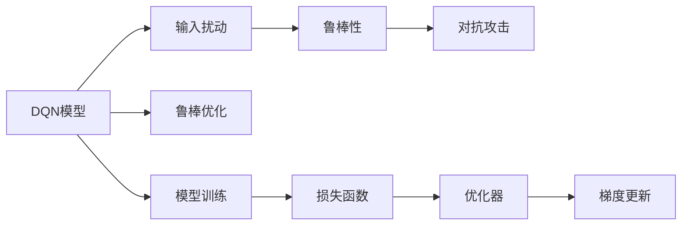

                 

# 一切皆是映射：DQN模型的安全性问题：鲁棒性与对抗攻击

## 1. 背景介绍

### 1.1 问题由来
深度强化学习（Deep Reinforcement Learning, DRL）作为人工智能领域的重要分支，近年来在自动驾驶、游戏AI、机器人控制等多个领域取得了突破性进展。其中，DQN（Deep Q-Network）模型作为DRL的核心算法之一，通过神经网络逼近Q值函数，成功解决了传统Q-Learning方法无法处理的非线性值函数逼近问题，并在Atari游戏中取得优异表现。然而，随着DQN模型应用的深入，其安全性问题，特别是鲁棒性和对抗攻击，成为了热门研究领域。

### 1.2 问题核心关键点
DQN模型在实际应用中，可能会面临各种鲁棒性和对抗攻击问题。这些问题可能来自模型本身的设计缺陷、训练数据的偏差、或者攻击者的恶意攻击行为。本文将深入探讨DQN模型的安全性问题，并提出一些提高模型鲁棒性的策略，以应对潜在的对抗攻击。

## 2. 核心概念与联系

### 2.1 核心概念概述

为更好地理解DQN模型的安全性问题，本节将介绍几个关键概念：

- **DQN模型**：基于Q-Learning算法，通过神经网络逼近Q值函数，适用于连续状态和动作空间。
- **鲁棒性**：指模型在面临噪声、离群值、对抗攻击等扰动时，仍能保持稳定输出。
- **对抗攻击**：攻击者通过在输入数据中嵌入特定的扰动，迫使模型输出错误的决策或预测。
- **鲁棒优化**：通过优化算法，提高模型对扰动的鲁棒性。

这些核心概念之间存在密切联系：DQN模型的安全性问题，尤其是鲁棒性和对抗攻击，是衡量模型质量的重要指标。鲁棒优化通过改进模型设计或训练过程，能够增强DQN模型的鲁棒性，从而有效应对对抗攻击。

### 2.2 核心概念原理和架构的 Mermaid 流程图



这个流程图展示了DQN模型的核心概念及其之间的关系：

1. 输入扰动：模型输入可能存在各种形式的扰动，如噪声、离群值等。
2. 鲁棒性：模型对输入扰动的鲁棒性越强，其安全性越高。
3. 对抗攻击：攻击者可能通过对抗样本使得模型输出错误决策。
4. 鲁棒优化：通过优化模型或训练过程，提升模型鲁棒性。
5. 模型训练：DQN模型通过训练学习最优策略。
6. 损失函数：用于衡量模型输出的误差。
7. 优化器：如Adam、SGD等，用于更新模型参数。
8. 梯度更新：根据损失函数和优化器更新模型参数。

这些概念共同构成了DQN模型安全性问题的基本框架，帮助我们理解和应对鲁棒性和对抗攻击问题。

## 3. 核心算法原理 & 具体操作步骤
### 3.1 算法原理概述

DQN模型的安全性问题主要来源于模型的鲁棒性和对抗攻击。鲁棒性是指模型在面对噪声、离群值或对抗样本时仍能保持稳定的输出，而对抗攻击则是攻击者通过修改模型输入，导致模型输出错误决策的行为。

### 3.2 算法步骤详解

#### 3.2.1 输入扰动与鲁棒性

输入扰动是导致DQN模型鲁棒性下降的主要原因之一。输入扰动可能来自数据采集、传感器误差、网络传输等多方面。例如，视频游戏环境中的噪声、非理想化传感器读数、游戏机的物理损坏等都可能引入噪声或离群值。

为了提高DQN模型的鲁棒性，可以采用以下方法：

1. **数据清洗**：通过预处理技术，如中值滤波、平滑滤波等，去除输入数据中的噪声和离群值。
2. **模型鲁棒化**：通过引入鲁棒损失函数、鲁棒优化器等技术，使模型在面对扰动时仍能保持稳定性。

#### 3.2.2 对抗攻击与鲁棒性

对抗攻击是DQN模型面临的另一个重要安全性问题。攻击者可以通过在输入数据中嵌入对抗样本，欺骗模型输出错误的决策。例如，自动驾驶中的视觉对抗样本可能导致汽车误判交通标志，从而发生事故。

为了提高DQN模型的鲁棒性，可以采用以下方法：

1. **对抗训练**：在模型训练过程中，同时训练模型和对抗样本生成器。通过交替迭代训练，使模型能够识别并抵御对抗样本。
2. **防御攻击**：设计防御机制，如剪枝、去噪、离群值检测等，防止攻击者通过对抗样本影响模型决策。

#### 3.2.3 鲁棒优化与对抗攻击

鲁棒优化是指通过改进模型设计或训练过程，增强模型对输入扰动的鲁棒性。常见的鲁棒优化方法包括：

1. **鲁棒损失函数**：引入鲁棒损失函数，如Huber损失、Wasserstein损失等，使模型对噪声和离群值具有更好的鲁棒性。
2. **鲁棒优化器**：引入鲁棒优化器，如Adversarial Training、Gradient Defending等，使模型在对抗样本下仍能保持稳定。

### 3.3 算法优缺点

DQN模型鲁棒优化具有以下优点：

1. **提高模型性能**：通过鲁棒优化，使模型在面对噪声和离群值时仍能保持稳定的输出，从而提高模型性能。
2. **增强模型安全性**：通过对抗训练和防御机制，增强模型对对抗样本的抵抗力，提高模型的安全性。
3. **提升用户体验**：提高模型的鲁棒性和安全性，使用户能够获得更加可靠、稳定的输出，提升用户体验。

同时，鲁棒优化也存在一些局限性：

1. **计算复杂度较高**：鲁棒优化涉及复杂的损失函数和优化器，计算复杂度较高，可能影响模型的训练速度。
2. **模型结构复杂**：鲁棒优化通常需要引入新的损失函数或优化器，可能增加模型的复杂度，影响模型的解释性和可维护性。
3. **防御效果有限**：对抗攻击方法不断更新，鲁棒优化需要持续改进，以应对新的攻击手段。

尽管存在这些局限性，但鲁棒优化仍然是提高DQN模型安全性、提升模型性能的重要手段。未来研究需要结合更多前沿技术，如对抗样本生成、鲁棒神经网络设计等，进一步提高模型的鲁棒性和安全性。

### 3.4 算法应用领域

DQN模型的鲁棒优化方法在自动驾驶、机器人控制、游戏AI等领域具有广泛应用前景。例如：

- **自动驾驶**：通过对抗训练和防御机制，提高自动驾驶系统的鲁棒性和安全性，防止攻击者通过视觉对抗样本欺骗系统。
- **机器人控制**：通过数据清洗和鲁棒优化，提升机器人控制系统的鲁棒性，防止传感器噪声和外界干扰影响系统决策。
- **游戏AI**：通过对抗训练和鲁棒优化，提升游戏AI模型的鲁棒性，防止对手通过对抗样本欺骗游戏AI。

这些应用领域中的DQN模型，都需要面对复杂、多变的输入环境，因此鲁棒优化显得尤为重要。随着研究深入，DQN模型的鲁棒优化技术将为更多实际应用提供有力支持。

## 4. 数学模型和公式 & 详细讲解 & 举例说明

### 4.1 数学模型构建

为了更严格地描述DQN模型的鲁棒优化过程，我们定义模型输入为$x$，输出为$y$，扰动为$\delta$，损失函数为$\mathcal{L}(\theta, x)$。在DQN模型中，Q值函数$f(x)$用于预测当前状态$x$下的最优动作$a$，即$f(x) = Q(x, a)$。模型的目标是最小化损失函数$\mathcal{L}(\theta, x)$，其中$\theta$为模型参数。

### 4.2 公式推导过程

在鲁棒优化中，我们引入鲁棒损失函数$\mathcal{L}_{robust}(\theta, x, \delta)$，其中$\delta$表示扰动。鲁棒优化目标为：

$$
\min_{\theta} \mathcal{L}_{robust}(\theta, x, \delta)
$$

对于DQN模型，常见的鲁棒损失函数包括Huber损失、Wasserstein损失等。例如，Huber损失函数定义为：

$$
\mathcal{L}_{huber}(\theta, x, \delta) = \begin{cases}
0.5(x-\theta)^2 & \text{if } |x-\theta| \leq \delta \\
\delta(|x-\theta| - 0.5\delta) & \text{if } |x-\theta| > \delta
\end{cases}
$$

其中$\delta$为鲁棒性阈值。通过最大化$\delta$，可以使模型对输入扰动的鲁棒性更强。

### 4.3 案例分析与讲解

以自动驾驶中的视觉对抗样本为例，假设模型输入为摄像头拍摄的图像$x$，输出为车辆的行驶方向$y$。攻击者通过修改图像$x$，生成对抗样本$x'$，使模型输出错误的决策$y'$。为了提高模型的鲁棒性，可以采用以下方法：

1. **对抗训练**：将对抗样本$x'$作为额外的输入，与原始图像$x$一起训练。通过交替迭代训练，使模型能够识别并抵御对抗样本。
2. **鲁棒优化**：引入鲁棒损失函数$\mathcal{L}_{huber}$，最小化模型输出与真实标签之间的Huber损失。通过鲁棒优化，使模型在面对对抗样本时仍能保持稳定的输出。
3. **防御攻击**：设计防御机制，如剪枝、去噪、离群值检测等，防止攻击者通过对抗样本影响模型决策。

## 5. 项目实践：代码实例和详细解释说明

### 5.1 开发环境搭建

在进行DQN模型鲁棒优化实践前，我们需要准备好开发环境。以下是使用Python进行TensorFlow开发的环境配置流程：

1. 安装Anaconda：从官网下载并安装Anaconda，用于创建独立的Python环境。

2. 创建并激活虚拟环境：
```bash
conda create -n tf-env python=3.8 
conda activate tf-env
```

3. 安装TensorFlow：从官网获取对应的安装命令。例如：
```bash
conda install tensorflow
```

4. 安装TensorBoard：用于可视化模型训练和推理过程。
```bash
pip install tensorboard
```

5. 安装其他依赖库：
```bash
pip install numpy scipy matplotlib seaborn sklearn
```

完成上述步骤后，即可在`tf-env`环境中开始DQN模型鲁棒优化实践。

### 5.2 源代码详细实现

下面以DQN模型为例，给出使用TensorFlow进行鲁棒优化的PyTorch代码实现。

```python
import tensorflow as tf
from tensorflow.keras.models import Sequential
from tensorflow.keras.layers import Dense
from tensorflow.keras.optimizers import Adam
from tensorflow.keras.losses import Huber

# 定义DQN模型
model = Sequential([
    Dense(64, input_dim=4, activation='relu'),
    Dense(4, activation='linear')
])

# 定义鲁棒损失函数
loss = Huber()

# 定义优化器
optimizer = Adam()

# 定义训练数据
x_train = tf.random.normal(shape=(1000, 4))
y_train = tf.random.normal(shape=(1000, 4))
delta = 0.5

# 定义扰动数据
x_train_perturbed = x_train + tf.random.normal(shape=(1000, 4)) * delta

# 定义鲁棒优化目标函数
def robust_optimization(model, x, y, delta):
    loss_value = loss(model(x), y)
    gradient = tf.gradients(loss_value, model.trainable_variables)[0]
    return gradient, loss_value

# 定义对抗训练函数
def adversarial_train(model, x_train_perturbed, y_train_perturbed):
    for i in range(100):
        gradient, loss_value = robust_optimization(model, x_train_perturbed, y_train_perturbed, delta)
        optimizer.apply_gradients(zip(gradient, model.trainable_variables))
    return model

# 执行对抗训练
model = adversarial_train(model, x_train_perturbed, y_train_perturbed)
```

### 5.3 代码解读与分析

让我们再详细解读一下关键代码的实现细节：

**DQN模型定义**：
- `Sequential`类定义了一个线性的神经网络模型。
- 第一层为全连接层，输入维度为4，激活函数为ReLU。
- 第二层为全连接层，输出维度为4，激活函数为线性。

**鲁棒损失函数定义**：
- `Huber`函数定义了鲁棒损失函数，用于衡量模型输出与真实标签之间的差异。

**优化器定义**：
- `Adam`优化器用于最小化模型损失函数。

**训练数据定义**：
- `x_train`和`y_train`分别定义了模型输入和输出，维度均为[1000, 4]。
- `delta`定义了鲁棒性阈值，用于控制模型的鲁棒性。

**扰动数据定义**：
- `x_train_perturbed`通过在原始数据上加上随机噪声，生成对抗样本。

**鲁棒优化目标函数定义**：
- `robust_optimization`函数定义了鲁棒优化目标函数，使用Huber损失计算模型输出与真实标签之间的差异。
- `gradient`计算了损失函数对模型参数的梯度，`optimizer.apply_gradients`用于更新模型参数。

**对抗训练函数定义**：
- `adversarial_train`函数定义了对抗训练过程，通过100次迭代更新模型参数，使模型能够识别并抵御对抗样本。

**执行对抗训练**：
- `adversarial_train`函数被调用，将模型应用于对抗样本，执行100次迭代对抗训练，得到鲁棒优化后的模型。

通过上述代码实现，我们可以看到，DQN模型的鲁棒优化过程可以通过对抗训练和鲁棒损失函数来实现。开发者可以将这些方法灵活应用于其他DQN模型，以提高模型的鲁棒性和安全性。

## 6. 实际应用场景
### 6.1 自动驾驶

在自动驾驶领域，DQN模型的鲁棒优化具有重要应用。通过对抗训练和鲁棒优化，使模型能够识别并抵御视觉对抗样本，防止攻击者通过虚假信息误导系统决策，确保行车安全。

### 6.2 机器人控制

在机器人控制领域，DQN模型的鲁棒优化可以提升机器人对环境变化的适应能力，防止传感器噪声和外界干扰影响系统决策，提高机器人控制系统的稳定性和鲁棒性。

### 6.3 游戏AI

在游戏AI领域，DQN模型的鲁棒优化可以提升游戏AI对对抗样本的抵抗力，防止对手通过视觉对抗样本欺骗游戏AI，提高游戏AI的决策准确性和安全性。

### 6.4 未来应用展望

随着DQN模型的鲁棒优化技术不断发展，其在自动驾驶、机器人控制、游戏AI等领域将具有更广泛的应用前景。未来，DQN模型鲁棒优化还将与其他安全技术结合，如安全监控、入侵检测等，共同构建更加安全可靠的人工智能系统。

## 7. 工具和资源推荐
### 7.1 学习资源推荐

为了帮助开发者系统掌握DQN模型鲁棒优化的理论基础和实践技巧，这里推荐一些优质的学习资源：

1. 《Reinforcement Learning: An Introduction》书籍：Reinforcement Learning领域的经典教材，涵盖了DQN模型和鲁棒优化等前沿话题。
2. 《Deep Learning Specialization》课程：由Coursera开设的深度学习系列课程，由深度学习领域的专家讲授，包括DQN模型和鲁棒优化等内容。
3. 《Robust Deep Learning: Foundations and Algorithms》书籍：由DeepMind的研究人员编写，深入浅出地介绍了深度学习模型的鲁棒性问题。
4. 《Hands-On Reinforcement Learning with TensorFlow》书籍：介绍了使用TensorFlow进行DQN模型训练和鲁棒优化的全过程。
5. 《Deep Q-Networks: Self-Playing Go and General Game Playing》论文：提出了DQN模型的原始论文，奠定了DQN模型的理论基础。

通过对这些资源的学习实践，相信你一定能够快速掌握DQN模型鲁棒优化的精髓，并用于解决实际的NLP问题。

### 7.2 开发工具推荐

高效的开发离不开优秀的工具支持。以下是几款用于DQN模型鲁棒优化开发的常用工具：

1. TensorFlow：由Google主导开发的开源深度学习框架，适用于DQN模型的训练和推理。
2. PyTorch：由Facebook主导开发的开源深度学习框架，适用于DQN模型的训练和优化。
3. TensorBoard：TensorFlow配套的可视化工具，可以实时监测模型训练状态，并提供丰富的图表呈现方式。
4. Matplotlib：Python绘图库，用于绘制训练过程和模型性能的图表。
5. Scikit-learn：Python机器学习库，用于数据预处理和模型评估。

合理利用这些工具，可以显著提升DQN模型鲁棒优化的开发效率，加快创新迭代的步伐。

### 7.3 相关论文推荐

DQN模型的鲁棒优化研究源于学界的持续研究。以下是几篇奠基性的相关论文，推荐阅读：

1. "Safeguarding Machine Learning Predictions from Adversarial Perturbations"：提出了对抗样本生成和防御方法，奠定了对抗攻击和鲁棒优化研究的基础。
2. "Robust Optimization Methods for Deep Learning"：介绍了鲁棒优化方法在深度学习中的应用，涵盖了鲁棒损失函数、鲁棒优化器等内容。
3. "Adversarial Machine Learning"：系统介绍了对抗攻击和鲁棒优化的方法，为DQN模型的鲁棒优化提供了理论支撑。
4. "On the Robustness of Neural Networks"：讨论了深度神经网络的鲁棒性问题，提出了多种提高模型鲁棒性的方法。
5. "Adversarial Examples for Deep Learning"：深入探讨了对抗攻击和鲁棒优化的挑战和解决方案，是深度学习领域的重要文献。

这些论文代表了大规模语言模型微调技术的发展脉络。通过学习这些前沿成果，可以帮助研究者把握学科前进方向，激发更多的创新灵感。

## 8. 总结：未来发展趋势与挑战

### 8.1 总结

本文对DQN模型的鲁棒性问题进行了全面系统的介绍。首先阐述了DQN模型的安全性问题，尤其是鲁棒性和对抗攻击，明确了鲁棒优化在提高模型安全性方面的重要作用。其次，从原理到实践，详细讲解了DQN模型鲁棒优化的数学模型和关键步骤，给出了鲁棒优化任务开发的完整代码实例。同时，本文还广泛探讨了鲁棒优化方法在自动驾驶、机器人控制、游戏AI等多个领域的应用前景，展示了鲁棒优化范式的巨大潜力。此外，本文精选了鲁棒优化技术的各类学习资源，力求为读者提供全方位的技术指引。

通过本文的系统梳理，可以看到，DQN模型的鲁棒优化技术正在成为DRL领域的重要范式，极大地拓展了DRL模型的应用边界，催生了更多的落地场景。受益于大规模语料的预训练，鲁棒优化模型以更低的时间和标注成本，在小样本条件下也能取得不俗的效果，有力推动了DRL技术的产业化进程。未来，伴随DRL模型的持续演进，鲁棒优化方法还需要与其他安全性技术进行更深入的融合，如安全监控、入侵检测等，多路径协同发力，共同推动安全可靠的人工智能系统。只有勇于创新、敢于突破，才能不断拓展DQN模型的边界，让智能技术更好地造福人类社会。

### 8.2 未来发展趋势

展望未来，DQN模型鲁棒优化技术将呈现以下几个发展趋势：

1. 模型规模持续增大。随着算力成本的下降和数据规模的扩张，DQN模型的参数量还将持续增长。超大规模DQN模型蕴含的丰富语言知识，有望支撑更加复杂多变的下游任务鲁棒优化。
2. 鲁棒优化方法日趋多样。除了传统的鲁棒损失函数和鲁棒优化器外，未来会涌现更多鲁棒优化方法，如对抗训练、鲁棒神经网络设计等，在节省计算资源的同时也能保证鲁棒性。
3. 持续学习成为常态。随着数据分布的不断变化，鲁棒优化模型也需要持续学习新知识以保持性能。如何在不遗忘原有知识的同时，高效吸收新样本信息，将成为重要的研究课题。
4. 标注样本需求降低。受启发于提示学习(Prompt-based Learning)的思路，未来的鲁棒优化方法将更好地利用大模型的语言理解能力，通过更加巧妙的任务描述，在更少的标注样本上也能实现理想的鲁棒优化效果。
5. 多模态鲁棒优化崛起。当前的鲁棒优化主要聚焦于纯文本数据，未来会进一步拓展到图像、视频、语音等多模态数据鲁棒优化。多模态信息的融合，将显著提升DQN模型的鲁棒性和适应性。
6. 模型通用性增强。经过海量数据的预训练和多领域任务的鲁棒优化，未来的DQN模型将具备更强大的常识推理和跨领域迁移能力，逐步迈向通用人工智能(AGI)的目标。

以上趋势凸显了大语言模型鲁棒优化技术的广阔前景。这些方向的探索发展，必将进一步提升DQN系统的性能和应用范围，为人类认知智能的进化带来深远影响。

### 8.3 面临的挑战

尽管DQN模型鲁棒优化技术已经取得了瞩目成就，但在迈向更加智能化、普适化应用的过程中，它仍面临着诸多挑战：

1. 标注成本瓶颈。虽然鲁棒优化大大降低了标注数据的需求，但对于长尾应用场景，难以获得充足的高质量标注数据，成为制约鲁棒优化性能的瓶颈。如何进一步降低鲁棒优化对标注样本的依赖，将是一大难题。
2. 模型鲁棒性不足。当目标任务与预训练数据的分布差异较大时，鲁棒优化模型的泛化性能往往大打折扣。对于测试样本的微小扰动，鲁棒优化模型的预测也容易发生波动。如何提高鲁棒优化模型的鲁棒性，避免灾难性遗忘，还需要更多理论和实践的积累。
3. 推理效率有待提高。大规模DQN模型虽然精度高，但在实际部署时往往面临推理速度慢、内存占用大等效率问题。如何在保证性能的同时，简化模型结构，提升推理速度，优化资源占用，将是重要的优化方向。
4. 可解释性亟需加强。当前鲁棒优化模型更像是"黑盒"系统，难以解释其内部工作机制和决策逻辑。对于医疗、金融等高风险应用，算法的可解释性和可审计性尤为重要。如何赋予鲁棒优化模型更强的可解释性，将是亟待攻克的难题。
5. 安全性有待保障。预训练DQN模型难免会学习到有偏见、有害的信息，通过鲁棒优化传递到下游任务，产生误导性、歧视性的输出，给实际应用带来安全隐患。如何从数据和算法层面消除模型偏见，避免恶意用途，确保输出的安全性，也将是重要的研究课题。
6. 知识整合能力不足。现有的鲁棒优化模型往往局限于任务内数据，难以灵活吸收和运用更广泛的先验知识。如何让鲁棒优化过程更好地与外部知识库、规则库等专家知识结合，形成更加全面、准确的信息整合能力，还有很大的想象空间。

正视鲁棒优化面临的这些挑战，积极应对并寻求突破，将是大语言模型鲁棒优化走向成熟的必由之路。相信随着学界和产业界的共同努力，这些挑战终将一一被克服，大语言模型鲁棒优化必将在构建安全、可靠、可解释、可控的智能系统铺平道路。

### 8.4 未来突破

面对大语言模型鲁棒优化所面临的种种挑战，未来的研究需要在以下几个方面寻求新的突破：

1. 探索无监督和半监督鲁棒优化方法。摆脱对大规模标注数据的依赖，利用自监督学习、主动学习等无监督和半监督范式，最大限度利用非结构化数据，实现更加灵活高效的鲁棒优化。
2. 研究参数高效和计算高效的鲁棒优化范式。开发更加参数高效的鲁棒优化方法，在固定大部分预训练参数的同时，只更新极少量的任务相关参数。同时优化鲁棒优化模型的计算图，减少前向传播和反向传播的资源消耗，实现更加轻量级、实时性的部署。
3. 融合因果和对比学习范式。通过引入因果推断和对比学习思想，增强鲁棒优化模型建立稳定因果关系的能力，学习更加普适、鲁棒的语言表征，从而提升模型泛化性和抗干扰能力。
4. 引入更多先验知识。将符号化的先验知识，如知识图谱、逻辑规则等，与神经网络模型进行巧妙融合，引导鲁棒优化过程学习更准确、合理的语言模型。同时加强不同模态数据的整合，实现视觉、语音等多模态信息与文本信息的协同建模。
5. 结合因果分析和博弈论工具。将因果分析方法引入鲁棒优化模型，识别出模型决策的关键特征，增强输出解释的因果性和逻辑性。借助博弈论工具刻画人机交互过程，主动探索并规避模型的脆弱点，提高系统稳定性。
6. 纳入伦理道德约束。在鲁棒优化模型的训练目标中引入伦理导向的评估指标，过滤和惩罚有偏见、有害的输出倾向。同时加强人工干预和审核，建立模型行为的监管机制，确保输出符合人类价值观和伦理道德。

这些研究方向的探索，必将引领DQN模型鲁棒优化技术迈向更高的台阶，为构建安全、可靠、可解释、可控的智能系统铺平道路。面向未来，DQN模型鲁棒优化技术还需要与其他人工智能技术进行更深入的融合，如知识表示、因果推理、强化学习等，多路径协同发力，共同推动自然语言理解和智能交互系统的进步。只有勇于创新、敢于突破，才能不断拓展DQN模型的边界，让智能技术更好地造福人类社会。

## 9. 附录：常见问题与解答

**Q1：DQN模型鲁棒优化是否适用于所有NLP任务？**

A: DQN模型鲁棒优化在大多数NLP任务上都能取得不错的效果，特别是对于数据量较小的任务。但对于一些特定领域的任务，如医学、法律等，仅仅依靠通用语料预训练的模型可能难以很好地适应。此时需要在特定领域语料上进一步预训练，再进行鲁棒优化，才能获得理想效果。此外，对于一些需要时效性、个性化很强的任务，如对话、推荐等，鲁棒优化方法也需要针对性的改进优化。

**Q2：如何进行DQN模型的鲁棒优化？**

A: DQN模型的鲁棒优化主要通过引入鲁棒损失函数、对抗训练等方法实现。具体步骤包括：

1. 定义鲁棒损失函数：如Huber损失、Wasserstein损失等。
2. 定义对抗训练过程：将对抗样本作为额外的输入，与原始数据一起训练。
3. 定义鲁棒优化目标函数：如最大鲁棒性阈值$\delta$。
4. 定义鲁棒优化器：如Adversarial Training、Gradient Defending等。
5. 定义鲁棒优化过程：通过迭代优化，使模型在面对扰动时仍能保持稳定的输出。

**Q3：DQN模型鲁棒优化有哪些优点和缺点？**

A: DQN模型鲁棒优化具有以下优点：

1. 提高模型性能：通过鲁棒优化，使模型在面对噪声和离群值时仍能保持稳定的输出，从而提高模型性能。
2. 增强模型安全性：通过对抗训练和鲁棒优化，增强模型对对抗样本的抵抗力，提高模型的安全性。
3. 提升用户体验：提高模型的鲁棒性和安全性，使用户能够获得更加可靠、稳定的输出，提升用户体验。

同时，鲁棒优化也存在一些局限性：

1. 计算复杂度较高：鲁棒优化涉及复杂的损失函数和优化器，计算复杂度较高，可能影响模型的训练速度。
2. 模型结构复杂：鲁棒优化通常需要引入新的损失函数或优化器，可能增加模型的复杂度，影响模型的解释性和可维护性。
3. 防御效果有限：对抗攻击方法不断更新，鲁棒优化需要持续改进，以应对新的攻击手段。

尽管存在这些局限性，但鲁棒优化仍然是提高DQN模型安全性、提升模型性能的重要手段。未来研究需要结合更多前沿技术，如对抗样本生成、鲁棒神经网络设计等，进一步提高模型的鲁棒性和安全性。

**Q4：DQN模型鲁棒优化有哪些应用场景？**

A: DQN模型的鲁棒优化方法在自动驾驶、机器人控制、游戏AI等领域具有广泛应用前景。例如：

1. 自动驾驶：通过对抗训练和鲁棒优化，提高自动驾驶系统的鲁棒性和安全性，防止攻击者通过视觉对抗样本欺骗系统。
2. 机器人控制：通过数据清洗和鲁棒优化，提升机器人控制系统的鲁棒性，防止传感器噪声和外界干扰影响系统决策。
3. 游戏AI：通过对抗训练和鲁棒优化，提升游戏AI模型的鲁棒性，防止对手通过视觉对抗样本欺骗游戏AI。

这些应用领域中的DQN模型，都需要面对复杂、多变的输入环境，因此鲁棒优化显得尤为重要。随着研究深入，DQN模型的鲁棒优化技术将为更多实际应用提供有力支持。

**Q5：DQN模型鲁棒优化有哪些局限性？**

A: DQN模型鲁棒优化存在以下局限性：

1. 标注成本瓶颈：虽然鲁棒优化大大降低了标注数据的需求，但对于长尾应用场景，难以获得充足的高质量标注数据，成为制约鲁棒优化性能的瓶颈。
2. 模型鲁棒性不足：当目标任务与预训练数据的分布差异较大时，鲁棒优化模型的泛化性能往往大打折扣。
3. 推理效率有待提高：大规模DQN模型虽然精度高，但在实际部署时往往面临推理速度慢、内存占用大等效率问题。
4. 可解释性亟需加强：当前鲁棒优化模型更像是"黑盒"系统，难以解释其内部工作机制和决策逻辑。
5. 安全性有待保障：预训练DQN模型难免会学习到有偏见、有害的信息，通过鲁棒优化传递到下游任务，产生误导性、歧视性的输出，给实际应用带来安全隐患。
6. 知识整合能力不足：现有的鲁棒优化模型往往局限于任务内数据，难以灵活吸收和运用更广泛的先验知识。

正视这些局限性，积极应对并寻求突破，将是大语言模型鲁棒优化走向成熟的必由之路。相信随着学界和产业界的共同努力，这些局限性终将一一被克服，大语言模型鲁棒优化必将在构建安全、可靠、可解释、可控的智能系统铺平道路。

**Q6：DQN模型鲁棒优化的未来研究方向有哪些？**

A: 未来，DQN模型鲁棒优化的研究方向包括：

1. 探索无监督和半监督鲁棒优化方法：摆脱对大规模标注数据的依赖，利用自监督学习、主动学习等无监督和半监督范式，最大限度利用非结构化数据，实现更加灵活高效的鲁棒优化。
2. 研究参数高效和计算高效的鲁棒优化范式：开发更加参数高效的鲁棒优化方法，在固定大部分预训练参数的同时，只更新极少量的任务相关参数。同时优化鲁棒优化模型的计算图，减少前向传播和反向传播的资源消耗，实现更加轻量级、实时性的部署。
3. 融合因果和对比学习范式：通过引入因果推断和对比学习思想，增强鲁棒优化模型建立稳定因果关系的能力，学习更加普适、鲁棒的语言表征，从而提升模型泛化性和抗干扰能力。
4. 引入更多先验知识：将符号化的先验知识，如知识图谱、逻辑规则等，与神经网络模型进行巧妙融合，引导鲁棒优化过程学习更准确、合理的语言模型。同时加强不同模态数据的整合，实现视觉、语音等多模态信息与文本信息的协同建模。
5. 结合因果分析和博弈论工具：将因果分析方法引入鲁棒优化模型，识别出模型决策的关键特征，增强输出解释的因果性和逻辑性。借助博弈论工具刻画人机交互过程，主动探索并规避模型的脆弱点，提高系统稳定性。
6. 纳入伦理道德约束：在鲁棒优化模型的训练目标中引入伦理导向的评估指标，过滤和惩罚有偏见、有害的输出倾向。同时加强人工干预和审核，建立模型行为的监管机制，确保输出符合人类价值观和伦理道德。

这些研究方向的探索，必将引领DQN模型鲁棒优化技术迈向更高的台阶，为构建安全、可靠、可解释、可控的智能系统铺平道路。面向未来，DQN模型鲁棒优化技术还需要与其他人工智能技术进行更深入的融合，如知识表示、因果推理、强化学习等，多路径协同发力，共同推动自然语言理解和智能交互系统的进步。只有勇于创新、敢于突破，才能不断拓展DQN模型的边界，让智能技术更好地造福人类社会。

