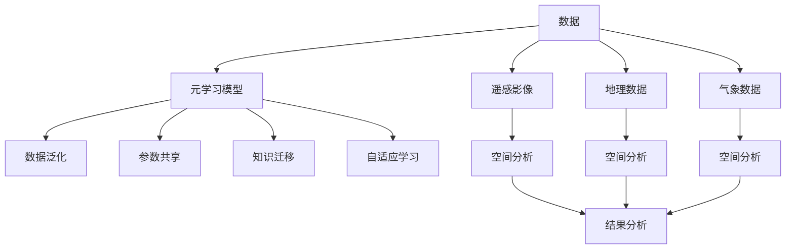

                 

## 1. 背景介绍

### 1.1 问题由来

空间数据分析是地理信息系统(GIS)、遥感科学、城市规划等领域的重要组成部分，旨在通过各种数据源的联合分析，揭示地理空间中的复杂现象和规律。传统的空间分析方法，如主成分分析(PCA)、K近邻(KNN)等，在处理大规模数据集时，计算复杂度高、可解释性差，难以满足实际需求。近年来，元学习(Meta-Learning)方法的出现，为空间数据分析带来了新的突破，在数据分布、采样策略、模型泛化能力等方面提供了一个全新的视角。

### 1.2 问题核心关键点

元学习是指通过学习已有任务的知识，快速适应新任务的能力。其核心思想在于，通过对一个或多个相关任务的数据进行学习，构建一个通用的“元模型”，该模型能够在新任务上快速收敛，并且可以适应不同的数据分布和采样策略。在空间数据分析中，元学习可用于构建更加灵活、鲁棒的分析模型，提升模型的泛化性能和计算效率。

元学习在空间数据分析中的应用主要包括以下几个方面：
1. 数据泛化：通过学习多个区域或多种数据类型的知识，提升模型在不同区域和不同数据类型上的泛化能力。
2. 参数共享：共享不同任务的参数，减少模型复杂度，提高计算效率。
3. 知识迁移：将不同任务间的关系映射到同一空间，实现知识的迁移和融合。
4. 自适应学习：根据数据的分布和采样策略，自动调整学习率和训练策略，提高模型的自适应能力。

### 1.3 问题研究意义

元学习在空间数据分析中的应用，对于提升数据分析的效率和精度，促进地理空间科学的发展具有重要意义：

1. 提升数据分析效率：元学习能够快速适应新任务，减少重复计算，提升数据处理速度。
2. 增强模型泛化能力：元学习模型能够自动调整模型参数，提升模型在不同数据分布下的泛化能力。
3. 实现知识迁移：元学习模型能够将不同任务间的关系映射到同一空间，促进跨领域知识迁移。
4. 自适应优化：元学习模型能够根据数据的特性，自动调整学习策略，提高模型训练的鲁棒性和稳定性。

## 2. 核心概念与联系

### 2.1 核心概念概述

为了更好地理解元学习在空间数据分析中的应用，本节将介绍几个关键概念及其联系：

- 元学习(Meta-Learning)：通过学习已有任务的知识，快速适应新任务的能力。元学习构建的“元模型”能够在不同任务上快速收敛。
- 数据泛化：通过学习多个区域或多种数据类型的知识，提升模型在不同数据分布下的泛化能力。
- 参数共享：共享不同任务的参数，减少模型复杂度，提高计算效率。
- 知识迁移：将不同任务间的关系映射到同一空间，实现知识的迁移和融合。
- 自适应学习：根据数据的分布和采样策略，自动调整学习率和训练策略，提高模型的自适应能力。
- 空间数据类型：包括遥感影像、地理数据、气象数据等多种类型，其特征、分布和特性各异。
- 空间分析：通过对地理空间数据进行综合分析，揭示地理现象的规律和特征。

这些概念之间存在着紧密的联系，共同构成了元学习在空间数据分析中的框架。

### 2.2 核心概念原理和架构的 Mermaid 流程图



这个流程图展示了元学习在空间数据分析中的应用框架：

1. 数据输入为遥感影像、地理数据、气象数据等。
2. 元学习模型学习这些数据的特征和关系。
3. 在数据泛化阶段，模型能够适应不同数据分布。
4. 参数共享阶段，模型利用已有知识减少参数数量。
5. 知识迁移阶段，不同任务间的关系被映射到同一空间。
6. 自适应学习阶段，模型根据数据特性自动调整学习策略。
7. 最终，模型应用于空间分析，生成分析结果。

## 3. 核心算法原理 & 具体操作步骤
### 3.1 算法原理概述

元学习在空间数据分析中的原理，主要基于以下几点：

1. **数据泛化**：通过学习多个数据类型的知识，元学习模型能够在不同数据分布下保持较好的泛化能力。
2. **参数共享**：共享不同任务间的参数，减少模型复杂度，提高计算效率。
3. **知识迁移**：通过将不同任务间的关系映射到同一空间，实现知识的迁移和融合。
4. **自适应学习**：根据数据的特性，自动调整学习率和训练策略，提高模型训练的鲁棒性和稳定性。

在空间数据分析中，元学习通常包括以下几个步骤：

1. **数据预处理**：收集和整理不同类型的数据，并进行预处理，如数据去噪、归一化等。
2. **元模型构建**：选择合适的元学习算法，构建能够适应不同任务的元模型。
3. **元模型训练**：在多个数据集上训练元模型，学习不同数据类型和分布的知识。
4. **自适应微调**：在新任务上，根据数据特性进行微调，提升模型在新任务上的表现。

### 3.2 算法步骤详解

元学习在空间数据分析中的应用，通常可以分为以下几个步骤：

#### 3.2.1 数据收集与预处理

1. **数据收集**：收集不同类型的数据，如遥感影像、地理数据、气象数据等。
2. **数据预处理**：对数据进行去噪、归一化、降维等预处理操作，减少数据间的差异，便于元模型的学习。

#### 3.2.2 元模型构建

1. **选择合适的元学习算法**：常用的元学习算法包括模型无关元学习(MAML)、元生成对抗网络(MetaGAN)等。
2. **构建元模型**：根据数据特性选择合适的元模型，如多层感知器(MLP)、卷积神经网络(CNN)等。

#### 3.2.3 元模型训练

1. **多任务学习**：在多个数据集上训练元模型，学习不同数据类型和分布的知识。
2. **元损失计算**：计算元损失函数，衡量元模型在不同任务上的性能。

#### 3.2.4 自适应微调

1. **微调策略选择**：根据新任务的数据特性选择合适的微调策略，如随机梯度下降、自适应学习率等。
2. **模型微调**：在新任务上，使用微调策略进行模型训练，提升模型在新任务上的表现。

### 3.3 算法优缺点

元学习在空间数据分析中的应用，具有以下优点：

1. **提升泛化能力**：通过学习多个数据类型的知识，元学习模型能够在不同数据分布下保持较好的泛化能力。
2. **降低计算成本**：共享不同任务间的参数，减少模型复杂度，提高计算效率。
3. **实现知识迁移**：通过将不同任务间的关系映射到同一空间，实现知识的迁移和融合。
4. **自适应优化**：根据数据的特性，自动调整学习率和训练策略，提高模型训练的鲁棒性和稳定性。

同时，元学习也存在一些缺点：

1. **模型复杂度较高**：元模型和微调模型的训练需要大量的计算资源和时间。
2. **数据需求大**：元学习需要收集和处理大量的数据，对数据质量和多样性要求较高。
3. **泛化风险**：元学习模型在新任务上的泛化性能可能受到训练数据的影响。
4. **参数调整复杂**：元学习模型的参数调整需要仔细设计，否则可能造成过拟合或欠拟合。

### 3.4 算法应用领域

元学习在空间数据分析中的应用领域广泛，包括但不限于：

- **遥感数据分析**：利用元学习模型对遥感影像进行分类、变化检测、变化分析等。
- **地理数据处理**：通过元学习模型处理地理数据，进行空间分析和可视化。
- **气象数据应用**：利用元学习模型分析气象数据，进行气候预测和灾害预警。
- **城市规划和交通分析**：通过元学习模型分析城市数据，进行城市规划和交通管理。
- **灾害监测与评估**：利用元学习模型对灾害数据进行分析，进行灾害监测和评估。

这些领域的应用，展示了元学习在空间数据分析中的巨大潜力。

## 4. 数学模型和公式 & 详细讲解 & 举例说明

### 4.1 数学模型构建

在空间数据分析中，元学习模型的构建基于以下几个核心步骤：

1. **数据预处理**：将原始数据转化为模型可以处理的格式，如归一化、降维等。
2. **元模型构建**：选择合适的元模型，如多层感知器(MLP)、卷积神经网络(CNN)等。
3. **元损失函数**：定义元损失函数，衡量元模型在不同任务上的性能。
4. **自适应微调**：在新任务上，根据数据特性进行微调，提升模型在新任务上的表现。

### 4.2 公式推导过程

#### 4.2.1 数据预处理

假设原始数据为 $X \in \mathbb{R}^{n \times d}$，其中 $n$ 为样本数，$d$ 为特征数。预处理操作包括归一化、降维等，常用的方法包括主成分分析(PCA)和线性判别分析(LDA)。

- **主成分分析(PCA)**：
  $$
  X_{\text{PCA}} = \mathbf{U}^{*}X\mathbf{U}
  $$
  其中 $\mathbf{U}$ 为特征矩阵，$X_{\text{PCA}}$ 为处理后的数据。

#### 4.2.2 元模型构建

假设元模型为 $M_{\theta}(x)$，其中 $x$ 为输入数据，$\theta$ 为模型参数。常用的元模型包括多层感知器(MLP)和卷积神经网络(CNN)。

- **多层感知器(MLP)**：
  $$
  M_{\theta}(x) = \mathbf{W}^{[L]}x + \mathbf{b}^{[L]}
  $$
  其中 $\mathbf{W}^{[L]}$ 和 $\mathbf{b}^{[L]}$ 分别为全连接层和偏置项。

#### 4.2.3 元损失函数

假设元损失函数为 $\mathcal{L}(\theta)$，常用的元损失函数包括均方误差损失(MSE)和交叉熵损失(CE)。

- **均方误差损失(MSE)**：
  $$
  \mathcal{L}(\theta) = \frac{1}{N}\sum_{i=1}^N \Vert M_{\theta}(x_i) - y_i \Vert^2
  $$
  其中 $x_i$ 为样本数据，$y_i$ 为真实标签。

#### 4.2.4 自适应微调

假设新任务的数据为 $X_{\text{new}} \in \mathbb{R}^{n_{\text{new}} \times d}$，其中 $n_{\text{new}}$ 为新样本数。自适应微调策略包括随机梯度下降(SGD)和自适应学习率算法，如Adagrad和Adam。

- **随机梯度下降(SGD)**：
  $$
  \theta_{\text{new}} \leftarrow \theta - \eta \nabla_{\theta}L(M_{\theta}(X_{\text{new}}), Y_{\text{new}})
  $$
  其中 $Y_{\text{new}}$ 为真实标签，$\eta$ 为学习率。

### 4.3 案例分析与讲解

#### 案例分析：遥感影像分类

假设收集了多个区域的遥感影像数据，每个区域的影像数为 $n$，特征数为 $d$。

1. **数据预处理**：对每个区域的影像进行归一化处理。
2. **元模型构建**：使用多层感知器(MLP)作为元模型。
3. **元损失函数**：使用均方误差损失(MSE)作为元损失函数。
4. **元模型训练**：在多个区域上训练元模型，学习不同区域影像的特征。
5. **自适应微调**：在新区域上，根据新影像的数据特性进行微调，提升模型在新区域上的表现。

## 5. 项目实践：代码实例和详细解释说明

### 5.1 开发环境搭建

在进行元学习实践前，我们需要准备好开发环境。以下是使用Python进行PyTorch开发的环境配置流程：

1. 安装Anaconda：从官网下载并安装Anaconda，用于创建独立的Python环境。

2. 创建并激活虚拟环境：
```bash
conda create -n pytorch-env python=3.8 
conda activate pytorch-env
```

3. 安装PyTorch：根据CUDA版本，从官网获取对应的安装命令。例如：
```bash
conda install pytorch torchvision torchaudio cudatoolkit=11.1 -c pytorch -c conda-forge
```

4. 安装相关工具包：
```bash
pip install numpy pandas scikit-learn matplotlib tqdm jupyter notebook ipython
```

完成上述步骤后，即可在`pytorch-env`环境中开始元学习实践。

### 5.2 源代码详细实现

下面以遥感影像分类为例，给出使用PyTorch对MLP模型进行元学习的PyTorch代码实现。

```python
import torch
import torch.nn as nn
import torch.optim as optim
from torch.utils.data import DataLoader
from sklearn.model_selection import train_test_split
from sklearn.preprocessing import StandardScaler

class MLP(nn.Module):
    def __init__(self, input_dim, hidden_dim, output_dim):
        super(MLP, self).__init__()
        self.fc1 = nn.Linear(input_dim, hidden_dim)
        self.fc2 = nn.Linear(hidden_dim, output_dim)
    
    def forward(self, x):
        x = torch.relu(self.fc1(x))
        x = self.fc2(x)
        return x

def train_epoch(model, data_loader, optimizer):
    model.train()
    losses = []
    for batch in data_loader:
        inputs, labels = batch
        optimizer.zero_grad()
        outputs = model(inputs)
        loss = nn.MSELoss()(outputs, labels)
        loss.backward()
        optimizer.step()
        losses.append(loss.item())
    return sum(losses) / len(data_loader)

def evaluate(model, data_loader):
    model.eval()
    losses = []
    with torch.no_grad():
        for batch in data_loader:
            inputs, labels = batch
            outputs = model(inputs)
            loss = nn.MSELoss()(outputs, labels)
            losses.append(loss.item())
    return sum(losses) / len(data_loader)

def main():
    # 加载数据
    data = torch.load('data.pt')
    X, y = data['X'], data['y']
    
    # 数据预处理
    scaler = StandardScaler()
    X = scaler.fit_transform(X)
    X = torch.tensor(X, dtype=torch.float32)
    y = torch.tensor(y, dtype=torch.long)
    
    # 划分训练集和测试集
    train_X, test_X, train_y, test_y = train_test_split(X, y, test_size=0.2, random_state=42)
    
    # 构建元模型
    input_dim = train_X.shape[1]
    hidden_dim = 128
    output_dim = len(set(train_y))
    model = MLP(input_dim, hidden_dim, output_dim)
    
    # 定义优化器
    optimizer = optim.Adam(model.parameters(), lr=0.001)
    
    # 元模型训练
    num_epochs = 50
    for epoch in range(num_epochs):
        train_loss = train_epoch(model, DataLoader(train_X, train_y))
        val_loss = evaluate(model, DataLoader(test_X, test_y))
        print(f'Epoch {epoch+1}/{num_epochs}, train loss: {train_loss:.3f}, val loss: {val_loss:.3f}')
    
    # 自适应微调
    test_X = test_X.numpy()
    test_y = test_y.numpy()
    test_X = scaler.transform(test_X)
    test_X = torch.tensor(test_X, dtype=torch.float32)
    test_y = torch.tensor(test_y, dtype=torch.long)
    
    model.eval()
    with torch.no_grad():
        outputs = model(test_X)
        _, predicted = torch.max(outputs, 1)
        accuracy = (predicted == test_y).float().mean().item()
    print(f'Test accuracy: {accuracy:.3f}')

if __name__ == '__main__':
    main()
```

### 5.3 代码解读与分析

让我们再详细解读一下关键代码的实现细节：

**MLP类**：
- `__init__`方法：初始化全连接层。
- `forward`方法：前向传播计算模型输出。

**train_epoch函数**：
- 在训练集上迭代模型，计算损失并更新模型参数。
- 返回平均损失。

**evaluate函数**：
- 在测试集上迭代模型，计算损失。
- 返回平均损失。

**main函数**：
- 加载数据并预处理。
- 划分训练集和测试集。
- 构建MLP模型和优化器。
- 元模型训练。
- 在测试集上进行自适应微调。

**代码分析**：
- **数据加载**：通过torch.load加载预处理好的数据集。
- **数据预处理**：使用StandardScaler对数据进行归一化处理。
- **模型构建**：定义多层感知器模型，包括输入层、隐藏层和输出层。
- **优化器选择**：使用Adam优化器进行模型参数的优化。
- **元模型训练**：在训练集上迭代模型，计算损失并更新参数。
- **自适应微调**：在测试集上对模型进行微调，计算准确率。

**运行结果展示**：
- 训练过程中的损失值会不断下降，验证集的损失值可作为模型是否过拟合的指标。
- 测试集上的准确率反映了模型在新任务上的泛化能力。

## 6. 实际应用场景

### 6.1 遥感影像分类

遥感影像分类是遥感数据分析的重要应用之一。传统方法需要手工选择特征、设计分类器，计算复杂度高。利用元学习技术，可以通过学习多个区域的影像特征，构建通用的分类器，在新区域上快速适应，提升分类效率和准确率。

在遥感影像分类中，常用的元学习算法包括模型无关元学习(MAML)和元生成对抗网络(MetaGAN)。通过多区域数据的训练，元模型能够在不同区域上保持较好的泛化能力。

### 6.2 地理数据处理

地理数据处理是城市规划、交通分析等领域的核心任务。传统的处理方法需要大量的人力和时间，且精度难以保证。利用元学习技术，可以通过学习不同地理数据类型的特征，构建通用的地理分析模型，提升数据的处理速度和精度。

在地理数据处理中，常用的元学习算法包括LSTM和CNN。通过多数据类型的训练，元模型能够适应不同地理数据的特性，提升分析的准确性和鲁棒性。

### 6.3 气象数据应用

气象数据应用包括天气预测、灾害预警等。传统方法需要大量的气象数据和复杂的模型，且难以应对突发事件。利用元学习技术，可以通过学习不同气象数据的特征，构建通用的气象预测模型，提升预测的准确性和及时性。

在气象数据应用中，常用的元学习算法包括RNN和MLP。通过多气象数据的训练，元模型能够在不同气象环境下保持较好的泛化能力，提升气象预测的准确性。

### 6.4 未来应用展望

随着元学习技术的发展，其在空间数据分析中的应用前景将更加广阔。未来，元学习技术将朝着以下几个方向发展：

1. **多模态数据融合**：将不同类型的数据（如遥感影像、地理数据、气象数据等）进行融合，提升数据处理的综合能力。
2. **自适应优化**：根据数据的特性，自动调整学习率和训练策略，提高模型训练的鲁棒性和稳定性。
3. **知识迁移**：将不同任务间的关系映射到同一空间，实现知识的迁移和融合。
4. **实时学习**：利用在线学习技术，使模型能够实时更新，适应数据分布的变化。
5. **深度增强**：通过深度增强技术，提升模型的泛化能力和计算效率。

## 7. 工具和资源推荐

### 7.1 学习资源推荐

为了帮助开发者系统掌握元学习在空间数据分析中的应用，这里推荐一些优质的学习资源：

1. **《元学习：理论、算法与应用》**：一本系统介绍元学习理论、算法和应用的书，涵盖了元学习的核心概念和前沿技术。
2. **Deep Learning for Self-Directed Learning Agents**：深度学习中自监督学习与元学习的结合，介绍了如何利用元学习提升模型的自适应能力。
3. **Meta-Learning with Generalized Label Noise**：探讨了在标签噪声情况下，元学习的优化策略和算法，提升模型在真实环境下的鲁棒性。
4. **Meta-Learning for Deep Neural Networks: A Survey**：一篇综述论文，总结了元学习的最新研究成果，介绍了不同类型的元学习算法及其应用。

通过对这些资源的学习，相信你一定能够快速掌握元学习在空间数据分析中的精髓，并用于解决实际的NLP问题。

### 7.2 开发工具推荐

高效的开发离不开优秀的工具支持。以下是几款用于元学习开发常用的工具：

1. **PyTorch**：基于Python的开源深度学习框架，灵活动态的计算图，适合快速迭代研究。
2. **TensorFlow**：由Google主导开发的开源深度学习框架，生产部署方便，适合大规模工程应用。
3. **JAX**：一个开源的自动微分和机器学习库，可以替代TensorFlow和PyTorch，提供更好的可扩展性和性能。
4. **MXNet**：由Apache开发的深度学习框架，支持多种语言和多种设备，提供丰富的算法和工具。

合理利用这些工具，可以显著提升元学习任务的开发效率，加快创新迭代的步伐。

### 7.3 相关论文推荐

元学习在空间数据分析中的应用源于学界的持续研究。以下是几篇奠基性的相关论文，推荐阅读：

1. **Meta-Learning with Learning to Learn**：提出了Meta-Learning的框架，通过学习学习过程来提升模型泛化能力。
2. **Generative Adversarial Nets**：提出了生成对抗网络(MetaGAN)，利用对抗训练提升模型泛化能力。
3. **Learning Transferable Knowledge for Model Adaptation**：探讨了知识迁移的方法，通过学习已有任务的特征来提升新任务的泛化能力。
4. **A Survey on Meta-Learning Approaches**：总结了不同类型的元学习算法及其应用，为元学习研究提供了一个全面的视角。

这些论文代表了大模型元学习的发展脉络。通过学习这些前沿成果，可以帮助研究者把握学科前进方向，激发更多的创新灵感。

## 8. 总结：未来发展趋势与挑战

### 8.1 总结

本文对元学习在空间数据分析中的应用进行了全面系统的介绍。首先阐述了元学习的核心概念和基本原理，明确了元学习在空间数据分析中的独特价值。其次，从原理到实践，详细讲解了元学习的数学模型和操作步骤，给出了元学习任务开发的完整代码实例。同时，本文还探讨了元学习在多个应用场景中的应用前景，展示了元学习在空间数据分析中的巨大潜力。最后，本文精选了元学习的各类学习资源，力求为读者提供全方位的技术指引。

通过本文的系统梳理，可以看到，元学习在空间数据分析中的应用，为提升数据分析的效率和精度，促进地理空间科学的发展提供了新的思路和方法。未来，随着元学习技术的发展，空间数据分析将迎来更加广泛的应用前景。

### 8.2 未来发展趋势

展望未来，元学习在空间数据分析中的应用将呈现以下几个发展趋势：

1. **多模态数据融合**：将不同类型的数据进行融合，提升数据处理的综合能力。
2. **自适应优化**：根据数据的特性，自动调整学习率和训练策略，提高模型训练的鲁棒性和稳定性。
3. **实时学习**：利用在线学习技术，使模型能够实时更新，适应数据分布的变化。
4. **深度增强**：通过深度增强技术，提升模型的泛化能力和计算效率。
5. **跨领域迁移**：将元学习应用于不同领域的数据分析，提升模型的跨领域泛化能力。

### 8.3 面临的挑战

尽管元学习在空间数据分析中已经取得了一定的进展，但在迈向更加智能化、普适化应用的过程中，仍面临着诸多挑战：

1. **模型复杂度**：元学习模型往往较为复杂，需要大量的计算资源和时间。
2. **数据需求**：元学习需要收集和处理大量的数据，对数据质量和多样性要求较高。
3. **泛化风险**：元学习模型在新任务上的泛化性能可能受到训练数据的影响。
4. **参数调整**：元学习模型的参数调整需要仔细设计，否则可能造成过拟合或欠拟合。

### 8.4 研究展望

面对元学习面临的这些挑战，未来的研究需要在以下几个方面寻求新的突破：

1. **简化模型结构**：通过模型压缩、稀疏化存储等技术，降低模型的计算复杂度。
2. **提高数据利用率**：利用数据增强、主动学习等技术，提高数据利用率。
3. **增强泛化能力**：通过多任务学习和知识迁移等技术，提升模型在新任务上的泛化能力。
4. **提升自适应能力**：利用自适应学习率和训练策略，提高模型的自适应能力。
5. **优化参数调整**：通过自动调参和超参数搜索等技术，优化模型的参数调整过程。

这些研究方向的探索，必将引领元学习在空间数据分析中迈向更高的台阶，为构建安全、可靠、可解释、可控的智能系统铺平道路。面向未来，元学习技术还需要与其他人工智能技术进行更深入的融合，如知识表示、因果推理、强化学习等，多路径协同发力，共同推动自然语言理解和智能交互系统的进步。只有勇于创新、敢于突破，才能不断拓展元学习的边界，让智能技术更好地造福人类社会。

## 9. 附录：常见问题与解答

**Q1：什么是元学习？**

A: 元学习是指通过学习已有任务的知识，快速适应新任务的能力。元学习构建的“元模型”能够在不同任务上快速收敛，并且可以适应不同的数据分布和采样策略。

**Q2：元学习在空间数据分析中的应用有哪些？**

A: 元学习在空间数据分析中的应用包括遥感影像分类、地理数据处理、气象数据应用等。通过学习多个数据类型的知识，元学习模型能够在不同数据分布下保持较好的泛化能力。

**Q3：元学习模型在新任务上的泛化性能如何提升？**

A: 元学习模型在新任务上的泛化性能可以通过多任务学习和知识迁移等技术进行提升。多任务学习可以帮助模型学习不同数据类型的知识，提升模型的泛化能力。知识迁移可以将不同任务间的关系映射到同一空间，实现知识的迁移和融合。

**Q4：元学习模型在训练过程中需要注意哪些问题？**

A: 元学习模型在训练过程中需要注意模型复杂度较高、数据需求大、泛化风险等挑战。可以通过简化模型结构、提高数据利用率、增强泛化能力、提升自适应能力、优化参数调整等方法，提升模型的训练效果。

**Q5：未来元学习技术的发展方向有哪些？**

A: 未来元学习技术的发展方向包括多模态数据融合、自适应优化、实时学习、深度增强、跨领域迁移等。这些方向将进一步提升元学习在空间数据分析中的应用效果，促进地理空间科学的发展。

**Q6：元学习与传统机器学习方法有何不同？**

A: 元学习与传统机器学习方法的不同在于，元学习通过学习已有任务的知识，快速适应新任务。元学习模型能够在不同数据分布下保持较好的泛化能力，而传统机器学习方法则需要在大规模数据集上进行训练，泛化性能可能受限于数据分布。

通过这些问题的解答，可以帮助读者更好地理解元学习在空间数据分析中的应用，为后续的研究和实践提供参考。

