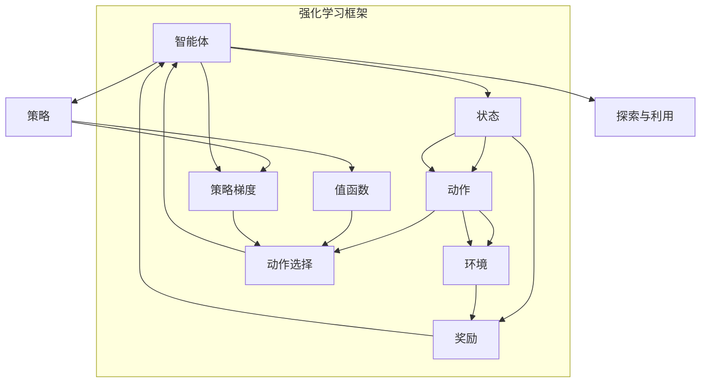

                 

## 1. 背景介绍

### 1.1 问题由来

强化学习（Reinforcement Learning, RL）作为人工智能的三个主要分支之一，近年在学术界和产业界取得了飞速发展，成功应用于游戏、机器人、自动驾驶、金融预测、推荐系统等领域。但相对于深度学习（Deep Learning, DL）和传统机器学习（Machine Learning, ML），强化学习依旧是一门相对年轻和复杂的学科。

强化学习的核心思想是通过智能体（Agent）与环境的交互，不断学习和优化决策策略，使智能体获得最大化的累积奖励。这一过程通常被描述为一个动态博弈，即智能体以一定的策略在每个时间步做出动作（Action），环境根据该动作改变自身状态（State），并给予智能体一个反馈（Reward），智能体根据这个反馈调整策略，以期最终最大化总奖励。

### 1.2 问题核心关键点

强化学习的核心在于理解智能体与环境之间的动态交互机制，以及如何通过环境反馈指导智能体做出最优决策。这其中涉及几个核心概念：

- 状态（State）：环境的状态表示智能体所处的具体情境，是决策的基础。
- 动作（Action）：智能体在某个状态下可能采取的行动或策略，通常是离散的、可执行的决策。
- 奖励（Reward）：环境对智能体当前动作的即时反馈，通常是一个标量值。
- 值函数（Value Function）：表示智能体在特定状态下或采取特定动作后的价值或预期回报。
- 策略（Policy）：定义智能体在每个状态下采取动作的概率分布。
- 探索与利用（Exploration vs Exploitation）：在智能体选择动作时，如何在探索新动作和利用已有知识之间进行权衡。

强化学习的目标，即通过学习或优化策略，使得智能体在复杂环境中能够实现长期奖励最大化。这通常需要通过求解状态-动作值函数（Q函数）或状态值函数（V函数）来实现。

### 1.3 问题研究意义

研究强化学习的基础概念和核心算法，对于推动智能体的决策理论、构建智能系统的框架体系、探索新的学习范式具有重要意义：

- 揭示智能决策的原理：强化学习提供了对智能体决策行为深入理解的理论框架，对建立自主、灵活的决策系统具有指导意义。
- 推动智能技术的落地应用：强化学习算法通过模仿智能体的行为，可以应用于自动驾驶、游戏AI、智能推荐等复杂场景，提升技术应用效能。
- 拓展新学习范式：强化学习与深度学习、传统机器学习的融合，为解决学习中的探索与利用问题提供了新的方法论，如Q学习、蒙特卡洛方法、策略梯度等。

## 2. 核心概念与联系

### 2.1 核心概念概述

强化学习涉及多个关键概念，它们之间通过交互和映射实现智能决策。这些概念通过强化学习框架整合在一起，形成了智能体与环境交互的动态模型。

- 智能体（Agent）：执行决策和动作的主体，可以是人、机器或软件系统。
- 环境（Environment）：智能体与环境互动的对象，通常是具体场景的模拟环境或物理环境。
- 状态（State）：智能体感知环境的当前状况，状态可以是连续的、离散的、多维的。
- 动作（Action）：智能体在给定状态下可能执行的操作，可以是离散的、连续的。
- 奖励（Reward）：环境对智能体当前动作的反馈，通常为正或负值，用于评估智能体的决策质量。
- 值函数（Value Function）：智能体在特定状态下的预期总奖励，表示从该状态开始执行特定动作后的累积奖励。
- 策略（Policy）：智能体在每个状态下采取动作的概率分布，反映了智能体的决策策略。
- 策略梯度（Policy Gradient）：通过梯度上升策略函数，使智能体在给定状态下采取最优动作的算法。

这些概念通过强化学习框架有机结合，构成了智能体与环境交互的基本机制，从而实现了学习与决策。

### 2.2 核心概念原理和架构的 Mermaid 流程图



以上流程图展示了强化学习的基本架构，通过智能体与环境的交互，智能体根据策略选择动作，环境根据动作给予奖励和状态反馈，同时值函数学习状态-动作对的预期总奖励，策略通过值函数和策略梯度进行优化。

### 2.3 核心概念之间的联系

各核心概念之间通过交互映射形成动态循环，智能体不断根据环境反馈调整策略和动作，优化值函数，从而在复杂的动态环境中实现最优决策。

- **状态和动作的映射**：智能体在每个状态下可能采取多个动作，动作的选择依赖于当前状态。
- **奖励和策略的映射**：环境通过奖励信号对智能体的动作进行反馈，智能体根据奖励信号调整策略，优化决策。
- **策略和值函数的映射**：策略指导动作选择，值函数预测动作的累积奖励，两者共同构成智能体的学习机制。
- **探索与利用的映射**：在智能体的决策过程中，需要在探索新动作和利用已有知识之间进行权衡，通过平衡策略，提升智能体的学习能力。

这些概念之间的联系和映射关系，构成了强化学习的核心机制，通过不断学习和调整策略，智能体在复杂环境中能够实现长期奖励最大化。

## 3. 核心算法原理 & 具体操作步骤

### 3.1 算法原理概述

强化学习的主要目标是最大化累积奖励，即在每个时间步选择最优动作，使得从当前状态开始，通过一系列动作获得的总奖励最大。这通常通过求解值函数或策略来实现。

- **值函数（Q函数）**：表示在特定状态下采取特定动作后的预期总奖励，即 $Q(s, a) = r + \gamma \max_{a'} Q(s', a')$，其中 $s$ 为状态，$a$ 为动作，$r$ 为即时奖励，$\gamma$ 为折扣因子，$s'$ 为下一个状态。
- **状态值函数（V函数）**：表示在特定状态下采取最优动作后的预期总奖励，即 $V(s) = \max_a Q(s, a)$。
- **策略**：定义智能体在每个状态下采取动作的概率分布，即 $P(a|s) = \pi(a|s)$。

强化学习的目标是最大化长期总奖励，即 $J(\pi) = \mathbb{E}_{\pi} \sum_{t=0}^{\infty} \gamma^t r_t$，其中 $\pi$ 为策略，$r_t$ 为第 $t$ 步的即时奖励。

### 3.2 算法步骤详解

强化学习的核心算法包括Q学习和蒙特卡洛方法。以下详细介绍这两种方法的具体步骤：

#### Q学习算法（Q-Learning）

Q学习的核心思想是通过环境反馈更新动作-状态值函数，以指导智能体在每个状态下选择最优动作。具体步骤如下：

1. **初始化**：
   - 初始化状态 $s_0$。
   - 初始化动作值函数 $Q(s_0, a)$。
   - 设定学习率 $\alpha$ 和折扣因子 $\gamma$。

2. **状态-动作选择**：
   - 根据当前状态 $s_t$ 和策略 $\pi(a|s_t)$ 选择动作 $a_t$。

3. **状态-动作更新**：
   - 根据当前状态和动作执行后得到的新状态 $s_{t+1}$ 和即时奖励 $r_{t+1}$，计算下一个状态-动作值函数 $Q(s_{t+1}, a)$。
   - 根据贝尔曼方程 $Q(s, a) \leftarrow Q(s, a) + \alpha (r_{t+1} + \gamma \max_{a'} Q(s_{t+1}, a'))$ 更新当前状态-动作值函数 $Q(s_t, a_t)$。

4. **循环**：
   - 重复步骤2和3，直到达到终止状态或达到预设迭代次数。

#### 蒙特卡洛方法（Monte Carlo Methods）

蒙特卡洛方法通过模拟智能体与环境的交互过程，收集大量实验数据，计算状态值函数。具体步骤如下：

1. **模拟**：
   - 随机初始化智能体状态 $s_0$。
   - 根据策略 $\pi$ 模拟智能体与环境交互，执行一系列动作，直至达到终止状态或预设迭代次数。
   - 收集每个状态-动作对的即时奖励。

2. **值函数计算**：
   - 对于每个状态 $s_t$，计算其值函数 $V(s_t) = \frac{1}{N} \sum_{i=1}^{N} r_i$，其中 $N$ 为模拟次数，$r_i$ 为第 $i$ 次模拟中从状态 $s_t$ 开始执行策略 $\pi$ 的累积奖励。

3. **策略优化**：
   - 使用值函数 $V(s)$ 更新策略 $\pi(a|s)$，如 $\pi(a|s) \leftarrow \frac{e^{Q(s, a)}}{\sum_{a'} e^{Q(s, a')}}$。

#### 算法优缺点

**Q学习的优点**：
- 无需环境模型，适用于任何环境。
- 收敛速度快，对于小规模问题效果较好。
- 简单易实现，计算复杂度低。

**Q学习的缺点**：
- 状态值函数更新基于单一动作，无法利用其他动作的信息。
- 易受状态空间维度和动作空间维度的限制。
- 在高度动态的环境中可能收敛较慢。

**蒙特卡洛方法的优点**：
- 适用于连续状态空间和动作空间。
- 计算值函数基于大量模拟数据，具有较高的统计准确性。

**蒙特卡洛方法的缺点**：
- 需要大量模拟次数，计算复杂度较高。
- 对于高维状态空间和动作空间，模拟效率较低。

### 3.3 算法应用领域

强化学习已经在多个领域展示了其强大的应用潜力，以下是几个典型应用场景：

1. **游戏AI**：如AlphaGo、AlphaStar等，通过强化学习训练深度神经网络，使得智能体能够在复杂的游戏中实现自我学习，达到或超越人类水平。
2. **机器人控制**：通过强化学习训练机器人控制策略，使得机器人能够在复杂环境中自主导航、抓取物体等。
3. **自动驾驶**：通过强化学习训练车辆决策策略，使得车辆能够在不同道路和交通条件下进行自主驾驶。
4. **金融预测**：通过强化学习预测股票价格、市场波动等金融指标，为投资者提供决策支持。
5. **推荐系统**：通过强化学习优化推荐策略，提高推荐效果，提升用户体验。

这些应用场景展示了强化学习在不同领域中的强大适应性和创新潜力。随着强化学习技术的发展，其在更多复杂场景中的应用前景将更加广阔。

## 4. 数学模型和公式 & 详细讲解

### 4.1 数学模型构建

强化学习的数学模型通常包括状态-动作值函数、策略和奖励函数。以下详细介绍这些模型的构建方法：

1. **状态-动作值函数**：
   - 定义状态-动作值函数 $Q(s, a)$，表示在状态 $s$ 下采取动作 $a$ 的预期累积奖励。
   - 根据贝尔曼方程，状态-动作值函数可以递归地表示为 $Q(s, a) = r + \gamma \max_{a'} Q(s', a')$，其中 $s'$ 为下一个状态，$r$ 为即时奖励，$\gamma$ 为折扣因子。

2. **策略**：
   - 定义策略 $\pi(a|s)$，表示在状态 $s$ 下采取动作 $a$ 的概率。
   - 常见的策略表示方法包括概率模型、策略梯度方法等。

3. **奖励函数**：
   - 定义奖励函数 $R(s, a)$，表示智能体在状态 $s$ 下采取动作 $a$ 的即时奖励。

### 4.2 公式推导过程

以下推导Q学习和蒙特卡洛方法的数学公式，并进行详细解释：

**Q学习公式推导**：
- 根据贝尔曼方程，状态-动作值函数 $Q(s, a)$ 可以递归地表示为 $Q(s, a) = r + \gamma \max_{a'} Q(s', a')$。
- 通过不断迭代，可以得到 $Q(s, a) = r + \gamma Q(s', a')$。

**蒙特卡洛方法公式推导**：
- 对于每个状态 $s_t$，计算其值函数 $V(s_t) = \frac{1}{N} \sum_{i=1}^{N} r_i$，其中 $N$ 为模拟次数，$r_i$ 为第 $i$ 次模拟中从状态 $s_t$ 开始执行策略 $\pi$ 的累积奖励。

### 4.3 案例分析与讲解

以一个简单的游戏环境为例，分析强化学习的应用过程。

假设智能体在一个2x2网格中移动，目标是到达终点。环境根据智能体的动作给出奖励和状态转移。

1. **状态表示**：
   - 状态 $s$ 可以表示为 $(s_1, s_2)$，其中 $s_1, s_2 \in \{0, 1\}$，表示智能体当前在网格中的位置。

2. **动作表示**：
   - 动作 $a$ 可以表示为 $\{U, D, L, R\}$，表示向上、向下、向左、向右移动。

3. **奖励函数**：
   - 当智能体到达终点 $(1, 1)$ 时，给予即时奖励 $+1$；否则，给予即时奖励 $-0.1$。

4. **状态-动作值函数**：
   - 根据贝尔曼方程，状态-动作值函数可以递归地计算。例如，在状态 $(0, 0)$ 下，采取动作 $U$ 后，智能体转移到状态 $(0, 1)$，此时 $Q(0, 0, U) = -0.1 + \gamma Q(0, 1, R) = -0.1 + \gamma Q(0, 1, U) + \gamma Q(0, 1, D) + \gamma Q(0, 1, L) + \gamma Q(0, 1, R)$。

通过上述数学模型和公式，可以实现智能体在网格游戏中的自主学习和策略优化。

## 5. 项目实践：代码实例和详细解释说明

### 5.1 开发环境搭建

以下介绍使用Python进行强化学习的开发环境配置流程：

1. 安装Anaconda：从官网下载并安装Anaconda，用于创建独立的Python环境。

2. 创建并激活虚拟环境：
   ```bash
   conda create -n reinforcement-env python=3.8 
   conda activate reinforcement-env
   ```

3. 安装相关库：
   ```bash
   pip install numpy scipy matplotlib gym gymnasium
   ```

4. 安装OpenAI Gym库：
   ```bash
   pip install gym[atari] --upgrade
   ```

完成上述步骤后，即可在`reinforcement-env`环境中开始强化学习实践。

### 5.2 源代码详细实现

以下给出使用Python实现Q学习的样例代码，包括环境配置、算法实现和结果展示。

**1. 导入库和配置环境**

```python
import gym
import numpy as np
import matplotlib.pyplot as plt

env = gym.make('CartPole-v1')
env = env.unwrapped
```

**2. Q学习算法实现**

```python
def q_learning(env, alpha=0.8, gamma=0.99, epsilon=0.1, num_episodes=1000):
    num_states = env.observation_space.shape[0]
    num_actions = env.action_space.n
    
    Q = np.zeros((num_states, num_actions))
    rewards = []
    
    for episode in range(num_episodes):
        state = env.reset()
        done = False
        
        while not done:
            # 探索与利用
            if np.random.rand() < epsilon:
                action = env.action_space.sample()
            else:
                action = np.argmax(Q[state, :])
            
            next_state, reward, done, _ = env.step(action)
            
            # Q函数更新
            Q[state, action] += alpha * (reward + gamma * np.max(Q[next_state, :]) - Q[state, action])
            
            state = next_state
            rewards.append(reward)
    
    return Q, rewards

Q, rewards = q_learning(env, alpha=0.8, gamma=0.99, epsilon=0.1, num_episodes=1000)
```

**3. 结果展示**

```python
plt.plot(rewards)
plt.xlabel('Episode')
plt.ylabel('Reward')
plt.title('Q-Learning Episodic Rewards')
plt.show()
```

### 5.3 代码解读与分析

以下是关键代码的详细解释：

**Q学习算法步骤**：
- 初始化状态 $s_0$，并定义学习率 $\alpha$、折扣因子 $\gamma$ 和探索概率 $\epsilon$。
- 在每个时间步，智能体根据当前状态和策略选择动作 $a_t$，并从环境获取即时奖励 $r_{t+1}$ 和下一个状态 $s_{t+1}$。
- 根据贝尔曼方程，更新状态-动作值函数 $Q(s_t, a_t)$。

**探索与利用**：
- 在动作选择时，使用 $\epsilon$-greedy策略，即在一定概率下随机选择动作，以增加探索性；其余时间选择当前状态下值最大的动作，以利用已有知识。

**结果展示**：
- 使用matplotlib绘制每集的累积奖励变化，直观展示了强化学习的效果。

通过上述代码实现，可以观察到智能体通过不断学习和调整策略，逐步掌握了在复杂环境中的决策能力。

## 6. 实际应用场景

### 6.1 智能驾驶

强化学习在智能驾驶中的应用主要集中在车辆路径规划、避障、自适应巡航控制等方面。智能体可以通过学习交通规则和环境反馈，优化驾驶策略，实现自动驾驶功能。

**技术实现**：
- 智能体通过感知车辆位置、速度、方向等状态信息，学习如何在不同道路条件下选择最优动作，如加速、减速、转向等。
- 环境通过交通信号灯、其他车辆、行人等动态因素提供状态反馈，智能体根据这些反馈调整策略，避免碰撞和违规。

**实际应用**：
- 自动驾驶汽车通过强化学习优化驾驶策略，提升驾驶安全和效率。
- 自动驾驶出租车系统通过学习交通规则和路线规划，实现高效调度。

### 6.2 机器人控制

强化学习在机器人控制中的应用主要集中在移动、抓取、路径规划等方面。智能体可以通过学习动作和环境反馈，优化控制策略，实现自主导航和操作。

**技术实现**：
- 智能体通过感知机器人的位置、速度、姿态等状态信息，学习如何在复杂环境中选择最优动作，如行走、抓取、避障等。
- 环境通过传感器反馈机器人的位置和环境状态，智能体根据这些反馈调整策略，实现精确控制。

**实际应用**：
- 工业机器人通过强化学习优化操作策略，提高生产效率和质量。
- 家用机器人通过学习环境互动，实现自主导航和操作。

### 6.3 推荐系统

强化学习在推荐系统中的应用主要集中在用户行为预测、个性化推荐等方面。智能体可以通过学习用户行为和环境反馈，优化推荐策略，提高推荐效果。

**技术实现**：
- 智能体通过感知用户的历史行为、偏好、时间等状态信息，学习如何在不同用户环境下选择最优动作，如推荐电影、音乐、商品等。
- 环境通过用户反馈、点击率等动态因素提供状态反馈，智能体根据这些反馈调整策略，提升推荐效果。

**实际应用**：
- 在线视频平台通过强化学习优化推荐策略，提高用户粘性和满意度。
- 电商平台通过学习用户行为，实现个性化商品推荐，提升用户体验。

### 6.4 未来应用展望

强化学习在未来将广泛应用于更多领域，推动智能系统的普及和进步。以下展望几个未来方向：

1. **复杂系统控制**：强化学习将拓展到更复杂的系统控制，如智能电网、能源管理等领域，通过学习系统动态和环境反馈，优化控制策略，提升系统效率和稳定性。
2. **动态环境适应**：强化学习将增强对动态环境的适应能力，如实时交通管理、紧急医疗响应等，通过学习环境变化和用户需求，实现动态决策和优化。
3. **多智能体协作**：强化学习将实现多智能体协作，如无人协作物流、智能城市管理等，通过学习个体和群体互动，提升系统协调性和效能。

这些应用场景展示了强化学习在复杂系统中的强大潜力和创新方向。随着技术的发展，强化学习将在更多领域发挥重要作用，推动智能系统的深度应用和广泛落地。

## 7. 工具和资源推荐

### 7.1 学习资源推荐

为了帮助开发者系统掌握强化学习的基本概念和核心算法，以下推荐一些优质的学习资源：

1. **《强化学习》课程**：由斯坦福大学李飞飞教授开设的Coursera课程，系统讲解了强化学习的基本原理、算法实现和应用案例。
2. **《强化学习》书籍**：Richard S. Sutton和Andrew G. Barto合著的经典教材，全面介绍了强化学习的理论基础、算法实现和应用案例。
3. **《深度强化学习》课程**：由DeepMind的Jash Shah等人开设的Coursera课程，深入讲解了强化学习与深度学习结合的最新进展。
4. **《强化学习实战》书籍**：John Schulman等合著的书籍，通过实际案例和代码实现，介绍了强化学习的实践技巧和工具库使用。

通过对这些资源的学习实践，相信你一定能够掌握强化学习的基础概念和核心算法，并将其应用到实际项目中。

### 7.2 开发工具推荐

高效的开发离不开优秀的工具支持。以下是几款用于强化学习开发的常用工具：

1. **PyTorch**：基于Python的开源深度学习框架，提供了丰富的张量计算和自动微分功能，适合实现复杂的强化学习算法。
2. **TensorFlow**：由Google主导开发的开源深度学习框架，支持分布式计算和GPU加速，适合大规模工程应用。
3. **Gym**：OpenAI开发的强化学习环境库，提供了多种模拟环境和评估工具，方便开发者测试和调试算法。
4. **Reinforcement Learning Toolkit**：开源的强化学习工具包，集成了多种算法和优化器，方便开发者快速搭建和调试模型。
5. **Morality**：开源的强化学习模拟器，支持多智能体协作和动态环境适应，适用于复杂系统控制和优化。

合理利用这些工具，可以显著提升强化学习任务的开发效率，加速创新迭代的步伐。

### 7.3 相关论文推荐

强化学习的研究领域日新月异，以下是几篇奠基性的相关论文，推荐阅读：

1. **Q-Learning**：W.S. R Jetson和J.H. Kanal提出的Q-Learning算法，奠定了强化学习的基础。
2. **SARSA**：G. Tesauro提出的SARSA算法，提供了强化学习的另一种学习方式。
3. **Deep Q-Learning**：Ian Goodfellow等提出的Deep Q-Learning，展示了强化学习与深度学习结合的潜力。
4. **Proximal Policy Optimization**：John Schulman等提出的Proximal Policy Optimization算法，为策略梯度方法提供了新的优化思路。
5. **Actor-Critic Methods**：Richard S. Sutton和Marek S. Barto提出的Actor-Critic方法，为强化学习提供了新的理论框架。

这些论文代表了强化学习的发展历程和前沿方向，通过学习这些经典成果，可以帮助研究者深入理解强化学习的基础理论和方法论。

## 8. 总结：未来发展趋势与挑战

### 8.1 研究成果总结

强化学习作为人工智能的重要分支，在多个领域展示了其强大的应用潜力和创新能力。通过理解强化学习的基本概念和核心算法，研究者可以构建更加灵活、智能的决策系统，推动技术在更广泛的场景中落地应用。

### 8.2 未来发展趋势

展望未来，强化学习将面临以下几个主要发展趋势：

1. **多智能体协作**：强化学习将拓展到多智能体系统，通过学习个体和群体互动，实现更加复杂的协作和优化。
2. **动态环境适应**：强化学习将增强对动态环境的适应能力，通过学习环境变化和用户需求，实现动态决策和优化。
3. **复杂系统控制**：强化学习将拓展到更复杂的系统控制，通过学习系统动态和环境反馈，优化控制策略，提升系统效率和稳定性。
4. **混合学习范式**：强化学习将与其他学习范式（如深度学习、传统机器学习）结合，形成更加全面的学习体系。
5. **伦理和安全**：强化学习将引入伦理和安全约束，确保模型行为符合人类价值观和法律规范。

这些趋势展示了强化学习未来的广阔应用前景，推动其向着更加智能化、普适化的方向发展。

### 8.3 面临的挑战

尽管强化学习取得了显著进展，但在实际应用中仍面临多个挑战：

1. **探索与利用平衡**：如何在探索新动作和利用已有知识之间进行权衡，是强化学习中的经典问题。
2. **高维状态空间**：高维状态空间和动作空间可能导致算法效率低下，需要高效的压缩和表示方法。
3. **环境建模**：对于复杂环境，如何高效建模和训练模型，是强化学习面临的重要难题。
4. **鲁棒性和可解释性**：如何增强模型的鲁棒性和可解释性，是强化学习未来需要解决的关键问题。
5. **计算资源消耗**：大规模强化学习任务需要大量的计算资源，如何优化算法和资源使用，是未来需要探索的方向。

### 8.4 研究展望

面对强化学习面临的挑战，未来的研究需要在以下几个方面寻求新的突破：

1. **探索与利用平衡**：通过引入强化学习与深度学习的结合，如价值网络和策略网络分离，优化探索与利用之间的平衡。
2. **高维状态空间**：通过引入稀疏化、压缩等技术，提高算法在高维状态空间中的效率。
3. **环境建模**：通过引入符号化先验知识，如知识图谱、逻辑规则等，提高环境建模的效率和准确性。
4. **鲁棒性和可解释性**：通过引入可解释性模型和鲁棒性优化技术，增强模型的稳定性和透明性。
5. **计算资源优化**：通过分布式计算、混合精度训练等技术，优化算法和资源使用，提高强化学习任务的效率和可扩展性。

这些研究方向展示了强化学习未来的创新潜力，推动其向更加智能化、普适化的方向发展，为构建更加智能的决策系统奠定坚实基础。

## 9. 附录：常见问题与解答

**Q1：强化学习中的探索与利用如何平衡？**

A: 强化学习中的探索与利用平衡是一个经典问题。常用的方法包括$\epsilon$-greedy策略、Softmax策略、Thompson Sampling等。通过调整$\epsilon$和温度参数，可以在探索和利用之间进行权衡。

**Q2：强化学习中如何选择动作？**

A: 在强化学习中，智能体通常采用$\epsilon$-greedy策略选择动作，即在一定概率下随机选择动作，以增加探索性；其余时间选择当前状态下值最大的动作，以利用已有知识。

**Q3：强化学习中的状态空间和动作空间如何表示？**

A: 状态空间和动作空间可以是连续的、离散的、多维的。常用的表示方法包括向量、矩阵、神经网络等。

**Q4：强化学习中的奖励函数如何设计？**

A: 强化学习中的奖励函数需要满足几个关键条件：立即奖励、累积奖励、稀疏性等。常用的设计方法包括基于经验设计、学习奖励函数、多目标奖励函数等。

**Q5：强化学习中的Q学习和蒙特卡洛方法如何选择？**

A: Q学习适用于简单的环境，收敛速度快；蒙特卡洛方法适用于连续状态空间和动作空间，统计准确性高。在实际应用中，可以根据具体场景选择合适的算法。

通过上述文章，相信你对强化学习的基础概念、核心算法及其应用有了更深入的理解。未来，随着强化学习技术的不断进步，它将在更多复杂系统中发挥重要作用，推动人工智能技术的深入应用和广泛落地。

