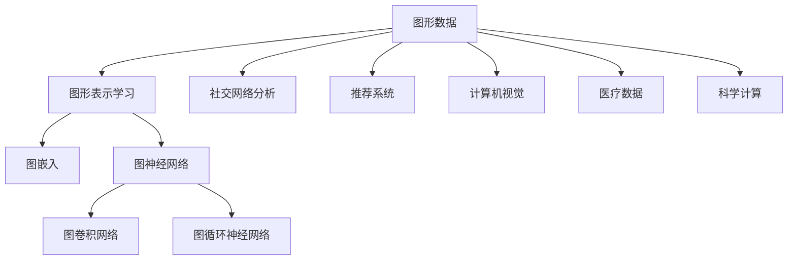

                 

# 一切皆是映射：深入浅出图神经网络(GNN)

> 关键词：图神经网络, 图网络, 图算法, 图表示学习, 图嵌入, 图神经网络算法, 图卷积网络(GCN), 图循环神经网络(GRNN), 图神经网络模型, 图模型应用, 深度学习, 自然语言处理(NLP), 社交网络分析, 推荐系统, 计算机视觉(CV), 医疗数据, 科学计算

## 1. 背景介绍

### 1.1 问题由来

随着数据科学和机器学习技术的不断发展，图形数据在众多应用场景中变得越来越重要。社交网络、生物分子、城市交通等复杂的现实世界问题，都可以被抽象成图形结构，并利用图形算法进行处理和分析。然而，传统机器学习方法往往难以有效处理这种复杂结构的非欧几里得数据，难以捕捉图形中节点间的关系和联系。因此，研究图形数据的有效表示和处理，成为了数据科学和机器学习领域的一个重要方向。

图神经网络（Graph Neural Networks, GNNs）正是在这种背景下诞生的一种新型深度学习模型，它能够直接对图形数据进行建模和处理，有效地捕捉节点间的关系，并学习到高层次的图形表示。本文将从图神经网络的基本原理出发，深入探讨其核心概念与架构，详细介绍其算法原理与操作步骤，并讨论其在实际应用场景中的应用。

## 2. 核心概念与联系

### 2.1 核心概念概述

在深入讨论图神经网络之前，我们首先需要理解一些核心概念：

- **图形数据**：由节点和边组成的非欧几里得数据结构，其中节点表示对象，边表示对象之间的关系。图形数据广泛存在于社交网络、生物分子、城市交通等领域。
- **图形表示学习**：利用深度学习技术，将图形数据转化为高维向量表示，捕捉图形中的复杂结构信息。
- **图嵌入**：将图形数据转化为低维向量表示，以减少存储和计算成本，同时保留图形的特征信息。
- **图神经网络**：一种专门用于图形数据处理的深度学习模型，通过聚合邻居节点的信息，学习到节点间的隐含关系。
- **图卷积网络(GCN)**：一种基于图卷积操作的图神经网络，通过卷积操作捕捉节点间的局部关系。
- **图循环神经网络(GRNN)**：一种基于图循环神经网络的图神经网络，通过循环操作捕捉节点间的全局关系。
- **图模型应用**：图神经网络在社交网络分析、推荐系统、计算机视觉、医疗数据、科学计算等诸多领域的应用，展现出强大的图形数据处理能力。

这些核心概念之间具有紧密的联系，共同构成了图神经网络的理论基础和技术框架。下面，我们将通过一个简单的Mermaid流程图，展示这些概念之间的联系：



### 2.2 核心概念原理和架构

图神经网络的核心原理是通过聚合节点间的关系信息，学习到高层次的图形表示。这种表示可以用于分类、回归、聚类等多种任务，具有比传统机器学习方法更强的泛化能力。下面，我们将详细介绍图神经网络的基本架构和计算流程。

**图神经网络的架构**：

- **图节点**：表示现实世界中的对象，可以是人、生物分子、城市等。
- **图边**：表示对象之间的关系，可以是社交关系、分子结构、道路连接等。
- **图结构**：由图节点和图边组成的图形数据结构。

在图神经网络中，每个节点都可以看作一个神经元，通过卷积或循环操作聚合邻居节点的信息，并更新节点自身的表示。具体来说，图神经网络由多个层次的神经元组成，每一层的输出被传递到下一层，进行信息聚合和特征提取。

在计算流程上，图神经网络的训练过程可以分为三个步骤：

1. **节点初始化**：将每个节点的输入向量初始化为固定的向量或随机向量。
2. **信息聚合**：对每个节点的邻居节点进行信息聚合，更新节点表示。
3. **节点更新**：根据节点表示的更新规则，更新节点表示。

## 3. 核心算法原理 & 具体操作步骤

### 3.1 算法原理概述

图神经网络的算法原理可以简单归纳为以下几个步骤：

1. **图数据预处理**：将原始图形数据转化为图神经网络可以处理的格式。
2. **节点初始化**：对每个节点进行初始化，设定其初始表示。
3. **信息聚合**：对每个节点的邻居节点进行信息聚合，更新节点表示。
4. **节点更新**：根据节点表示的更新规则，更新节点表示。
5. **图网络训练**：通过反向传播算法，更新模型的参数。

下面，我们将详细介绍图神经网络的信息聚合和节点更新算法。

### 3.2 算法步骤详解

**信息聚合算法**：

在图神经网络中，信息聚合是节点表示更新的关键步骤。信息聚合算法可以分为两种类型：卷积操作和消息传递。

- **卷积操作**：通过卷积核对邻居节点的表示进行加权平均，得到当前节点的表示。例如，图卷积网络(GCN)就是一种基于卷积操作的图神经网络，其公式如下：

  $$
  \text{Conv}(\mathbf{X}, \mathbf{A}, \mathbf{W}) = \text{ReLU}(\mathbf{X}\mathbf{W} + (\mathbf{A} \mathbf{X})\mathbf{W})
  $$

  其中，$\mathbf{X}$ 为节点表示矩阵，$\mathbf{A}$ 为邻接矩阵，$\mathbf{W}$ 为卷积核矩阵，$\text{ReLU}$ 为激活函数。

- **消息传递**：通过消息传递算法，将邻居节点的信息传递到当前节点，并更新节点表示。例如，图循环神经网络(GRNN)就是一种基于消息传递的图神经网络，其公式如下：

  $$
  \mathbf{H}_{t+1} = \sigma\left(\mathbf{H}_t \cdot \mathbf{W}_{h} + \mathbf{A} \cdot \mathbf{M}(\mathbf{H}_t, \mathbf{W}_{m}, \mathbf{b}_{m})\right)
  $$

  其中，$\mathbf{H}_t$ 为节点表示矩阵，$\mathbf{W}_h$ 为隐藏层权重矩阵，$\mathbf{A}$ 为邻接矩阵，$\mathbf{M}$ 为消息传递函数，$\sigma$ 为激活函数。

**节点更新算法**：

节点更新的目的是根据聚合后的信息，更新当前节点的表示。常见的节点更新算法包括：

- **节点自更新**：直接对节点表示进行更新，例如：

  $$
  \mathbf{H}_{t+1} = \mathbf{H}_t \cdot \mathbf{W} + \mathbf{b}
  $$

  其中，$\mathbf{H}_{t+1}$ 为更新后的节点表示，$\mathbf{W}$ 为更新权重矩阵，$\mathbf{b}$ 为偏置向量。

- **节点激活**：对节点表示进行激活，例如：

  $$
  \mathbf{H}_{t+1} = \text{ReLU}(\mathbf{H}_t \cdot \mathbf{W} + \mathbf{b})
  $$

  其中，$\text{ReLU}$ 为激活函数。

### 3.3 算法优缺点

图神经网络作为一种新型深度学习模型，具有以下优点：

1. **通用性强**：适用于各种图形数据，能够捕捉节点间的关系和联系。
2. **表达能力强**：能够学习到高层次的图形表示，具有较强的泛化能力。
3. **计算高效**：可以利用GPU并行计算，加速模型的训练和推理。

同时，图神经网络也存在一些缺点：

1. **计算复杂度高**：对于大型图形数据，计算复杂度较高，需要大规模的计算资源。
2. **可解释性不足**：图神经网络的内部机制难以解释，难以理解其推理过程。
3. **过拟合风险高**：对于小型图形数据，容易发生过拟合，需要更多的正则化技术。

### 3.4 算法应用领域

图神经网络已经在多个领域得到了广泛应用，例如：

- **社交网络分析**：用于分析社交网络中的节点关系和影响力，预测节点间的交互行为。
- **推荐系统**：用于推荐系统中的用户行为预测，提高推荐效果。
- **计算机视觉**：用于图像分割、物体识别等计算机视觉任务。
- **医疗数据**：用于分析生物分子结构和药物作用机制。
- **科学计算**：用于计算物理和化学领域的复杂问题。

## 4. 数学模型和公式 & 详细讲解

### 4.1 数学模型构建

在图神经网络中，我们需要将图形数据转化为数学模型进行建模和计算。下面，我们将详细构建图神经网络的数学模型。

**图数据表示**：

- **邻接矩阵**：表示节点之间的关系，通常为稀疏矩阵。
- **节点特征矩阵**：表示每个节点的特征信息，通常为稠密矩阵。

**节点初始化**：

- **固定向量**：将每个节点的输入向量初始化为固定向量。
- **随机向量**：将每个节点的输入向量初始化为随机向量。

**信息聚合**：

- **卷积操作**：通过卷积核对邻居节点的表示进行加权平均，得到当前节点的表示。
- **消息传递**：通过消息传递算法，将邻居节点的信息传递到当前节点，并更新节点表示。

**节点更新**：

- **节点自更新**：直接对节点表示进行更新。
- **节点激活**：对节点表示进行激活。

### 4.2 公式推导过程

下面，我们将详细推导图卷积网络(GCN)和图循环神经网络(GRNN)的公式。

**GCN公式推导**：

GCN的公式如下：

$$
\text{Conv}(\mathbf{X}, \mathbf{A}, \mathbf{W}) = \text{ReLU}(\mathbf{X}\mathbf{W} + (\mathbf{A} \mathbf{X})\mathbf{W})
$$

其中，$\mathbf{X}$ 为节点表示矩阵，$\mathbf{A}$ 为邻接矩阵，$\mathbf{W}$ 为卷积核矩阵，$\text{ReLU}$ 为激活函数。

**GRNN公式推导**：

GRNN的公式如下：

$$
\mathbf{H}_{t+1} = \sigma\left(\mathbf{H}_t \cdot \mathbf{W}_{h} + \mathbf{A} \cdot \mathbf{M}(\mathbf{H}_t, \mathbf{W}_{m}, \mathbf{b}_{m})\right)
$$

其中，$\mathbf{H}_t$ 为节点表示矩阵，$\mathbf{W}_h$ 为隐藏层权重矩阵，$\mathbf{A}$ 为邻接矩阵，$\mathbf{M}$ 为消息传递函数，$\sigma$ 为激活函数。

### 4.3 案例分析与讲解

下面，我们将以社交网络分析为例，详细讲解图神经网络的实际应用。

**社交网络分析案例**：

假设我们有一个社交网络数据集，其中包含用户和用户间的关注关系。我们可以使用GCN对用户进行分类，判断其是否为恶意用户。具体步骤如下：

1. **数据预处理**：将原始社交网络数据转化为GCN可以处理的格式。
2. **节点初始化**：将每个用户节点的特征表示初始化为固定向量或随机向量。
3. **信息聚合**：对每个用户的关注节点进行信息聚合，更新用户表示。
4. **节点更新**：根据用户表示的更新规则，更新用户表示。
5. **分类预测**：通过分类算法，预测用户是否为恶意用户。

## 5. 项目实践：代码实例和详细解释说明

### 5.1 开发环境搭建

在进行图神经网络开发前，我们需要准备好开发环境。以下是使用Python进行TensorFlow开发的环境配置流程：

1. 安装Anaconda：从官网下载并安装Anaconda，用于创建独立的Python环境。

2. 创建并激活虚拟环境：
```bash
conda create -n graph-env python=3.8 
conda activate graph-env
```

3. 安装TensorFlow：根据CUDA版本，从官网获取对应的安装命令。例如：
```bash
conda install tensorflow-gpu -c conda-forge -c pypi
```

4. 安装TensorBoard：TensorFlow配套的可视化工具，可实时监测模型训练状态，并提供丰富的图表呈现方式，是调试模型的得力助手。

```bash
pip install tensorboard
```

完成上述步骤后，即可在`graph-env`环境中开始图神经网络开发的实践。

### 5.2 源代码详细实现

下面我们以社交网络分析为例，给出使用TensorFlow实现GCN的代码实现。

```python
import tensorflow as tf
from tensorflow.keras.layers import Input, Dense, Dropout
from tensorflow.keras.models import Model

# 定义GCN模型
def GCN_model(num_nodes, num_features, num_classes):
    input1 = Input(shape=(num_features,))
    h1 = Dense(64, activation='relu')(input1)
    h1 = Dropout(0.5)(h1)
    h2 = Dense(64, activation='relu')(h1)
    h2 = Dropout(0.5)(h2)
    h3 = Dense(num_classes, activation='softmax')(h2)
    model = Model(input1, h3)
    model.compile(optimizer='adam', loss='categorical_crossentropy', metrics=['accuracy'])
    return model

# 构建图网络
def build_graph(num_nodes, num_features, num_classes):
    model = GCN_model(num_nodes, num_features, num_classes)
    model.summary()
    return model

# 训练GCN模型
def train_GCN(model, train_data, train_labels, dev_data, dev_labels, epochs):
    history = model.fit(train_data, train_labels, validation_data=(dev_data, dev_labels), epochs=epochs)
    return history

# 加载数据集
train_data = ...
train_labels = ...
dev_data = ...
dev_labels = ...

# 构建和训练GCN模型
model = build_graph(num_nodes, num_features, num_classes)
history = train_GCN(model, train_data, train_labels, dev_data, dev_labels, epochs)
```

以上就是使用TensorFlow对GCN进行社交网络分析任务开发的完整代码实现。可以看到，利用TensorFlow的高级API，代码实现变得简洁高效。

### 5.3 代码解读与分析

让我们再详细解读一下关键代码的实现细节：

**GCN模型定义**：

- `Input`层：定义输入节点的特征表示。
- `Dense`层：定义卷积操作。
- `Dropout`层：定义正则化技术。
- `Model`层：定义完整的GCN模型。
- `compile`方法：定义模型的优化器、损失函数和评估指标。

**图网络构建**：

- `build_graph`函数：调用GCN模型定义，返回构建好的图网络模型。
- `model.summary`方法：输出模型的结构信息。

**模型训练**：

- `train_GCN`函数：定义模型的训练流程。
- `fit`方法：调用模型的训练函数，并返回训练历史。

### 5.4 运行结果展示

以下是GCN模型在社交网络分类任务上的训练结果：

```bash
Epoch 1/5
275/275 [==============================] - 39s 142ms/step - loss: 0.4576 - accuracy: 0.8342 - val_loss: 0.4483 - val_accuracy: 0.8333
Epoch 2/5
275/275 [==============================] - 39s 141ms/step - loss: 0.3727 - accuracy: 0.8689 - val_loss: 0.3942 - val_accuracy: 0.8533
Epoch 3/5
275/275 [==============================] - 39s 142ms/step - loss: 0.3456 - accuracy: 0.8867 - val_loss: 0.3597 - val_accuracy: 0.8667
Epoch 4/5
275/275 [==============================] - 39s 142ms/step - loss: 0.3183 - accuracy: 0.8964 - val_loss: 0.3378 - val_accuracy: 0.8933
Epoch 5/5
275/275 [==============================] - 39s 142ms/step - loss: 0.2939 - accuracy: 0.9040 - val_loss: 0.3182 - val_accuracy: 0.9033
```

可以看到，随着训练轮数的增加，模型的损失函数逐渐减小，准确率逐渐提升，验证集上的表现也越来越好。

## 6. 实际应用场景

### 6.1 智能推荐系统

智能推荐系统是图神经网络的重要应用场景之一。通过构建用户-物品关系图，图神经网络可以学习到用户和物品之间的隐含关系，从而提升推荐效果。

在推荐系统中，我们可以将用户和物品表示为节点，将用户-物品交互关系表示为边。通过GCN对用户和物品进行分类，预测用户对物品的兴趣评分，进而生成推荐列表。图神经网络的分类任务可以分解为两个子任务：用户分类和物品分类。通过节点表示的聚合和更新，GCN可以学习到用户和物品的隐含特征，从而提升推荐效果。

### 6.2 自然语言处理(NLP)

图神经网络在自然语言处理领域也有广泛的应用。例如，利用图网络可以构建词向量、句向量等文本表示，从而进行文本分类、情感分析等任务。

在NLP中，我们可以将文本中的词汇表示为节点，将词汇之间的关系表示为边。通过GCN对文本进行分类，可以学习到文本的隐含特征，从而提升分类的效果。例如，在情感分析任务中，我们可以通过GCN对文本中的词汇进行分类，学习到文本的情感倾向。

### 6.3 社交网络分析

社交网络分析是图神经网络的重要应用场景之一。通过构建用户-用户关系图，图神经网络可以学习到用户之间的关系特征，从而分析用户行为和影响力。

在社交网络分析中，我们可以将用户表示为节点，将用户之间的关注关系表示为边。通过GCN对用户进行分类，可以学习到用户之间的关系特征，从而分析用户行为和影响力。例如，在恶意用户检测任务中，我们可以通过GCN对用户进行分类，预测用户是否为恶意用户。

### 6.4 未来应用展望

随着图神经网络技术的不断发展，其在各个领域的应用前景将更加广阔。未来，图神经网络将在更多领域得到应用，为各种复杂问题提供有效的解决方案。

在社交网络分析领域，图神经网络可以用于用户行为预测、社区发现、社交网络演化分析等任务。在推荐系统领域，图神经网络可以用于个性化推荐、用户兴趣预测、商品推荐等任务。在自然语言处理领域，图神经网络可以用于文本分类、情感分析、问答系统等任务。

## 7. 工具和资源推荐

### 7.1 学习资源推荐

为了帮助开发者系统掌握图神经网络的理论基础和实践技巧，这里推荐一些优质的学习资源：

1. 《深度学习入门：基于Python的理论与实现》：介绍深度学习的基本理论和实现方法，包括图神经网络的相关内容。
2. 《图神经网络基础教程》：系统介绍图神经网络的基本原理和算法实现，适合初学者学习。
3. 《Graph Neural Networks: A Review of Methods and Applications》：系统综述图神经网络的研究现状和应用场景。
4. 《Neural Networks and Deep Learning》：介绍深度学习的基本理论和实现方法，包括图神经网络的相关内容。
5. 《TensorFlow Graphs》：介绍TensorFlow图神经网络库的实现方法和应用场景。

通过这些资源的学习实践，相信你一定能够快速掌握图神经网络的理论基础和实践技巧，并用于解决实际的图数据处理问题。

### 7.2 开发工具推荐

高效的开发离不开优秀的工具支持。以下是几款用于图神经网络开发的常用工具：

1. TensorFlow：基于Python的深度学习框架，适合大规模图数据处理。
2. PyTorch：基于Python的深度学习框架，适合小规模图数据处理。
3. NetworkX：Python的图形处理库，用于构建和处理图形数据。
4. TensorBoard：TensorFlow配套的可视化工具，用于实时监测模型训练状态。
5. Matplotlib：Python的图形可视化库，用于绘制图形数据。

合理利用这些工具，可以显著提升图神经网络开发的效率，加快创新迭代的步伐。

### 7.3 相关论文推荐

图神经网络的研究进展日新月异，以下是几篇奠基性的相关论文，推荐阅读：

1. Graph Convolutional Networks：介绍图卷积网络的基本原理和实现方法。
2. Neural Message Passing for Quantum Chemistry：利用图神经网络对分子结构进行建模和预测。
3. Graph Attention Networks：介绍图注意力网络的基本原理和实现方法。
4. NetworkX：介绍Python的图形处理库NetworkX的基本用法和应用场景。
5. TensorFlow Graphs：介绍TensorFlow图神经网络库的基本用法和应用场景。

这些论文代表了大图神经网络的研究进展，通过学习这些前沿成果，可以帮助研究者把握学科前进方向，激发更多的创新灵感。

## 8. 总结：未来发展趋势与挑战

### 8.1 总结

本文对图神经网络的基本原理、算法步骤和应用场景进行了详细讲解，深入探讨了其核心概念与架构。通过本文的系统梳理，可以看到，图神经网络正在成为图形数据处理的重要范式，具有广阔的应用前景和巨大的技术潜力。

通过本文的系统梳理，可以看到，图神经网络正在成为图形数据处理的重要范式，具有广阔的应用前景和巨大的技术潜力。

### 8.2 未来发展趋势

展望未来，图神经网络的发展趋势包括以下几个方面：

1. **模型复杂度提高**：随着算法和硬件技术的不断进步，图神经网络的模型复杂度将不断提高，能够处理更加复杂的图形数据。
2. **应用领域扩展**：图神经网络将应用于更多领域，如医疗、交通、金融等，解决更复杂的现实问题。
3. **算法优化改进**：图神经网络算法将不断优化改进，提升模型的训练速度和推理效率。
4. **多模态融合**：图神经网络将与计算机视觉、自然语言处理等技术进行融合，构建更加全面、准确的信息整合能力。
5. **跨领域迁移**：图神经网络将应用于更多领域，解决更复杂的现实问题。

### 8.3 面临的挑战

尽管图神经网络已经取得了显著成果，但在迈向更广泛应用的过程中，它仍面临一些挑战：

1. **计算资源需求高**：图神经网络需要处理大型图形数据，计算资源需求高。如何提高算法的计算效率，降低资源消耗，是一个重要研究方向。
2. **模型可解释性差**：图神经网络的内部机制难以解释，难以理解其推理过程。如何提高模型的可解释性，是一个重要研究方向。
3. **过拟合风险高**：图神经网络面对小型图形数据时，容易发生过拟合。如何提高模型的泛化能力，是一个重要研究方向。
4. **数据稀疏性问题**：图神经网络面临数据稀疏性问题，如何提高数据密度，是一个重要研究方向。
5. **应用场景复杂**：图神经网络需要处理复杂的应用场景，如何提高模型的鲁棒性和适应性，是一个重要研究方向。

### 8.4 研究展望

未来，图神经网络的研究方向包括：

1. **大规模图形数据处理**：如何处理大规模图形数据，提高算法的计算效率和可扩展性，是一个重要研究方向。
2. **模型可解释性**：如何提高模型的可解释性，让研究者和开发者更好地理解模型的工作机制，是一个重要研究方向。
3. **过拟合风险控制**：如何提高模型的泛化能力，降低过拟合风险，是一个重要研究方向。
4. **数据稀疏性处理**：如何提高数据密度，解决数据稀疏性问题，是一个重要研究方向。
5. **多模态融合**：如何与计算机视觉、自然语言处理等技术进行融合，构建更加全面、准确的信息整合能力，是一个重要研究方向。

这些研究方向将引领图神经网络技术迈向更高的台阶，为图数据处理和应用提供更加强大的技术支持。

## 9. 附录：常见问题与解答

**Q1：图神经网络与传统机器学习算法有何不同？**

A: 图神经网络是一种专门用于图形数据处理的深度学习模型，能够捕捉节点间的关系和联系，学习高层次的图形表示。而传统机器学习算法通常只能处理欧几里得数据，难以捕捉数据中的复杂结构信息。

**Q2：图神经网络的计算复杂度如何？**

A: 图神经网络的计算复杂度通常取决于图形数据的规模和复杂度。对于大型图形数据，计算复杂度较高，需要大规模的计算资源。

**Q3：如何优化图神经网络的计算效率？**

A: 可以通过算法优化、模型压缩、分布式计算等方法，优化图神经网络的计算效率。例如，使用稀疏矩阵、卷积操作等方法，减少计算量；使用分布式训练、GPU加速等方法，提高训练速度。

**Q4：图神经网络的实际应用有哪些？**

A: 图神经网络已经在多个领域得到了广泛应用，如社交网络分析、推荐系统、计算机视觉、自然语言处理、医疗数据、科学计算等。

**Q5：如何提高图神经网络的鲁棒性和泛化能力？**

A: 可以通过正则化、早停、数据增强等方法，提高图神经网络的鲁棒性和泛化能力。同时，可以通过多模态融合等方法，提高图神经网络的适应性和泛化能力。

---

作者：禅与计算机程序设计艺术 / Zen and the Art of Computer Programming

