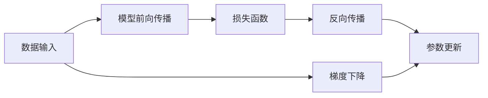

                 

# 一切皆是映射：深度学习中的反向传播和梯度下降

> 关键词：深度学习,反向传播,梯度下降,神经网络,损失函数,优化算法,机器学习

## 1. 背景介绍

在深度学习领域，反向传播(Backpropagation)和梯度下降(Gradient Descent)是两种核心的算法，它们共同构成了神经网络模型训练的基石。通过反向传播，网络能够计算每个参数对损失函数的贡献，而梯度下降则用于根据这些贡献不断调整参数，使损失函数最小化。本文将深入探讨这两种算法的原理、实现步骤和应用场景，帮助读者更好地理解和应用深度学习模型。

## 2. 核心概念与联系

### 2.1 核心概念概述

反向传播和梯度下降是深度学习中的两个核心概念，它们的作用是通过不断调整模型参数，最小化模型在训练集上的损失函数，从而提升模型在测试集上的预测性能。下面将分别介绍这两个概念，并阐明它们之间的联系。

- **反向传播(Backpropagation)**：是一种计算神经网络中各层参数对损失函数贡献的方法。通过链式法则，反向传播能够将损失函数对输出层的梯度逐层传递到输入层，从而计算出每个参数的梯度。
- **梯度下降(Gradient Descent)**：是一种通过迭代更新模型参数以最小化损失函数的优化算法。梯度下降通过计算损失函数的梯度，更新参数，逐步接近损失函数的最小值。

### 2.2 核心概念原理和架构的 Mermaid 流程图



在图中，数据输入经过模型前向传播后得到输出，损失函数衡量预测结果与真实标签之间的差异。反向传播计算损失函数对模型参数的梯度，梯度下降根据梯度更新模型参数，不断迭代直至收敛。

## 3. 核心算法原理 & 具体操作步骤

### 3.1 算法原理概述

深度学习模型的训练过程可以概括为以下几个步骤：

1. **数据预处理**：对输入数据进行标准化、归一化等预处理操作。
2. **模型前向传播**：将数据输入模型，通过逐层计算得到输出结果。
3. **计算损失函数**：将模型输出与真实标签进行比较，计算损失函数。
4. **反向传播**：通过链式法则计算损失函数对每个参数的梯度。
5. **梯度下降**：根据梯度更新模型参数，使损失函数逐渐减小。

### 3.2 算法步骤详解

接下来，我们将详细介绍每个步骤的具体操作。

**Step 1: 数据预处理**
- 对输入数据进行标准化和归一化处理，以便模型更好地学习。
- 将数据分为训练集、验证集和测试集。

**Step 2: 模型前向传播**
- 将输入数据输入模型，通过逐层计算得到模型输出。
- 前向传播过程中，每个参数都会参与计算，计算过程为：

$$
y = g(\alpha \cdot x + \beta)
$$

其中 $g$ 为激活函数，$\alpha$ 和 $\beta$ 为权重和偏置。

**Step 3: 计算损失函数**
- 将模型输出与真实标签进行比较，计算损失函数。
- 常用的损失函数包括均方误差(MSE)、交叉熵损失等。

**Step 4: 反向传播**
- 通过链式法则计算损失函数对每个参数的梯度。
- 梯度计算公式为：

$$
\frac{\partial \mathcal{L}}{\partial \theta} = \frac{\partial \mathcal{L}}{\partial y} \cdot \frac{\partial y}{\partial \theta}
$$

其中 $\mathcal{L}$ 为损失函数，$\frac{\partial \mathcal{L}}{\partial y}$ 为输出层对损失函数的梯度，$\frac{\partial y}{\partial \theta}$ 为输出层对参数的梯度。

**Step 5: 梯度下降**
- 根据梯度更新模型参数。
- 常用的梯度下降算法包括批量梯度下降(BGD)、随机梯度下降(SGD)和动量梯度下降(Momentum)。

### 3.3 算法优缺点

反向传播和梯度下降算法具有以下优点：

- **高效性**：反向传播和梯度下降可以高效地计算梯度，更新模型参数。
- **普适性**：适用于各种类型的神经网络模型。
- **收敛性**：在适当的条件下，梯度下降算法能够收敛到最优解。

然而，这些算法也存在一些缺点：

- **高计算成本**：计算梯度需要大量的计算资源，特别是对于大型神经网络。
- **梯度消失/爆炸**：在深度网络中，梯度可能消失或爆炸，影响训练效果。
- **局部最优解**：梯度下降算法可能陷入局部最优解，无法找到全局最优解。

### 3.4 算法应用领域

反向传播和梯度下降算法广泛应用于深度学习模型的训练中。以下是一些常见的应用领域：

- **计算机视觉**：在图像分类、目标检测等任务中，反向传播和梯度下降算法用于训练卷积神经网络(CNN)。
- **自然语言处理**：在机器翻译、文本生成等任务中，反向传播和梯度下降算法用于训练循环神经网络(RNN)和Transformer模型。
- **语音识别**：在自动语音识别(ASR)任务中，反向传播和梯度下降算法用于训练深度神经网络。
- **推荐系统**：在协同过滤、基于内容的推荐等任务中，反向传播和梯度下降算法用于训练神经网络模型。

## 4. 数学模型和公式 & 详细讲解 & 举例说明

### 4.1 数学模型构建

在深度学习中，模型的训练过程可以用以下公式来表示：

$$
\min_{\theta} \mathcal{L}(\theta) = \frac{1}{N}\sum_{i=1}^N \ell(y_i, f_{\theta}(x_i))
$$

其中 $\theta$ 为模型参数，$N$ 为样本数量，$\ell$ 为损失函数，$f_{\theta}$ 为模型前向传播函数。

### 4.2 公式推导过程

接下来，我们将以简单的线性回归模型为例，详细推导反向传播和梯度下降算法的公式。

**线性回归模型**
假设我们有一个线性回归模型 $f_{\theta}(x) = \theta_0 + \theta_1x$，其中 $\theta_0$ 和 $\theta_1$ 为模型参数。模型的损失函数为均方误差(MSE)：

$$
\mathcal{L}(\theta) = \frac{1}{2N}\sum_{i=1}^N (y_i - f_{\theta}(x_i))^2
$$

**反向传播**
假设我们有一个样本 $(x_i, y_i)$，通过前向传播得到预测值 $y_{\hat{i}} = \theta_0 + \theta_1x_i$。模型的损失函数对 $y_{\hat{i}}$ 的梯度为：

$$
\frac{\partial \mathcal{L}}{\partial y_{\hat{i}}} = -(y_i - y_{\hat{i}})
$$

根据链式法则，损失函数对 $\theta_0$ 和 $\theta_1$ 的梯度分别为：

$$
\frac{\partial \mathcal{L}}{\partial \theta_0} = -(y_i - y_{\hat{i}})
$$

$$
\frac{\partial \mathcal{L}}{\partial \theta_1} = -2x_i(y_i - y_{\hat{i}})
$$

**梯度下降**
假设我们采用随机梯度下降(SGD)算法，每次选择一个样本 $(x_i, y_i)$，其更新公式为：

$$
\theta_0 \leftarrow \theta_0 - \eta \cdot \frac{\partial \mathcal{L}}{\partial \theta_0}
$$

$$
\theta_1 \leftarrow \theta_1 - \eta \cdot \frac{\partial \mathcal{L}}{\partial \theta_1}
$$

其中 $\eta$ 为学习率，用于控制每次更新的步长。

### 4.3 案例分析与讲解

假设我们有一个二元分类问题，使用一个简单的神经网络模型进行训练。模型的结构如下：


**输入层**：包含4个输入神经元。
**隐藏层**：包含4个神经元。
**输出层**：包含1个神经元，使用Sigmoid激活函数。

假设我们的损失函数为交叉熵损失：

$$
\mathcal{L}(\theta) = -\frac{1}{N}\sum_{i=1}^N (y_i \cdot \log(y_{\hat{i}}) + (1 - y_i) \cdot \log(1 - y_{\hat{i}}))
$$

其中 $y_i$ 为真实标签，$y_{\hat{i}}$ 为模型预测值。

**前向传播**
假设我们的输入数据为 $(x_1, x_2, x_3, x_4) = (1, 2, 3, 4)$，通过前向传播得到预测值 $y_{\hat{1}}$。

**反向传播**
假设我们的真实标签为 $y_1 = 0.6$，通过反向传播计算损失函数对每个参数的梯度。

**梯度下降**
假设我们采用批量梯度下降(BGD)算法，每次更新所有样本的梯度，其更新公式为：

$$
\theta_{0,j} \leftarrow \theta_{0,j} - \eta \cdot \frac{\partial \mathcal{L}}{\partial \theta_{0,j}}
$$

$$
\theta_{1,j} \leftarrow \theta_{1,j} - \eta \cdot \frac{\partial \mathcal{L}}{\partial \theta_{1,j}}
$$

$$
\theta_{2,j} \leftarrow \theta_{2,j} - \eta \cdot \frac{\partial \mathcal{L}}{\partial \theta_{2,j}}
$$

$$
\theta_{3,j} \leftarrow \theta_{3,j} - \eta \cdot \frac{\partial \mathcal{L}}{\partial \theta_{3,j}}
$$

## 5. 项目实践：代码实例和详细解释说明

### 5.1 开发环境搭建

在进行反向传播和梯度下降的实践时，我们需要准备好开发环境。以下是使用Python进行TensorFlow开发的简单环境配置流程：

1. 安装Anaconda：从官网下载并安装Anaconda，用于创建独立的Python环境。

2. 创建并激活虚拟环境：
```bash
conda create -n tf-env python=3.8 
conda activate tf-env
```

3. 安装TensorFlow：根据CUDA版本，从官网获取对应的安装命令。例如：
```bash
conda install tensorflow -c tf -c conda-forge
```

4. 安装各类工具包：
```bash
pip install numpy pandas scikit-learn matplotlib tqdm jupyter notebook ipython
```

完成上述步骤后，即可在`tf-env`环境中开始项目实践。

### 5.2 源代码详细实现

下面我们以线性回归为例，给出使用TensorFlow进行反向传播和梯度下降的代码实现。

```python
import tensorflow as tf

# 定义模型参数
theta_0 = tf.Variable(tf.zeros([1]), name='theta_0')
theta_1 = tf.Variable(tf.zeros([1]), name='theta_1')

# 定义输入和输出
x = tf.placeholder(tf.float32, [None, 1], name='x')
y = tf.placeholder(tf.float32, [None, 1], name='y')

# 定义模型前向传播
y_hat = theta_0 + theta_1 * x

# 定义损失函数
loss = tf.reduce_mean(tf.nn.sigmoid_cross_entropy_with_logits(logits=y_hat, labels=y))

# 定义优化器
optimizer = tf.train.GradientDescentOptimizer(learning_rate=0.01)

# 定义训练操作
train_op = optimizer.minimize(loss)

# 定义会话
with tf.Session() as sess:
    sess.run(tf.global_variables_initializer())

    # 训练模型
    for i in range(1000):
        batch_x = np.random.rand(64, 1)
        batch_y = np.random.rand(64, 1)
        sess.run(train_op, feed_dict={x: batch_x, y: batch_y})

    # 测试模型
    test_x = np.array([[1.0], [2.0], [3.0], [4.0]])
    test_y = np.array([[0.0], [0.5], [1.0], [1.0]])
    y_hat_test = sess.run(y_hat, feed_dict={x: test_x})
    loss_test = sess.run(loss, feed_dict={x: test_x, y: test_y})
    print('Test Loss:', loss_test)
```

在这个代码中，我们定义了一个简单的线性回归模型，使用TensorFlow实现反向传播和梯度下降的训练过程。通过多次迭代，模型能够逐步优化参数，最终得到较好的预测效果。

### 5.3 代码解读与分析

让我们再详细解读一下关键代码的实现细节：

**变量定义**
- `theta_0` 和 `theta_1` 为模型参数，使用 `tf.Variable` 创建变量，并设置初始值为0。

**输入和输出**
- `x` 和 `y` 为占位符，使用 `tf.placeholder` 创建输入和输出的占位符。

**模型前向传播**
- `y_hat` 为模型的前向传播结果，通过线性变换得到。

**损失函数**
- 使用 `tf.nn.sigmoid_cross_entropy_with_logits` 函数计算交叉熵损失。

**优化器**
- 使用 `tf.train.GradientDescentOptimizer` 创建梯度下降优化器，设置学习率为0.01。

**训练操作**
- 使用 `optimizer.minimize` 方法定义训练操作，传入损失函数。

**会话**
- 使用 `tf.Session` 创建会话，通过 `sess.run` 方法执行训练和测试操作。

## 6. 实际应用场景

### 6.1 计算机视觉

在计算机视觉领域，反向传播和梯度下降算法广泛应用于图像分类、目标检测等任务。卷积神经网络(CNN)通过对图像特征的逐层提取，将复杂的视觉信息映射为高维向量，从而实现对图像的分类和识别。通过反向传播和梯度下降，CNN能够不断优化参数，提升分类准确率。

### 6.2 自然语言处理

在自然语言处理领域，反向传播和梯度下降算法也得到了广泛应用。循环神经网络(RNN)和Transformer模型通过反向传播和梯度下降，能够学习语言的语义表示，实现对文本的分类、生成和翻译等任务。在机器翻译任务中，模型通过反向传播和梯度下降，优化参数，提升翻译质量。

### 6.3 语音识别

在语音识别领域，反向传播和梯度下降算法用于训练深度神经网络。模型通过反向传播和梯度下降，不断优化参数，提升语音识别的准确率。例如，在自动语音识别(ASR)任务中，模型能够将语音信号映射为文本，实现对语音的识别和转写。

### 6.4 未来应用展望

随着反向传播和梯度下降算法的不断发展，其在深度学习模型的训练和优化中的应用将更加广泛。未来的应用场景可能包括：

- **自适应学习**：根据不同的任务和数据，自动调整学习率和优化策略，提高模型的泛化能力。
- **分布式训练**：通过分布式计算和优化，提升大规模模型的训练效率。
- **强化学习**：结合强化学习算法，通过奖励机制引导模型学习最优策略。
- **混合学习**：结合无监督学习和监督学习，提升模型的鲁棒性和泛化能力。

这些应用场景将进一步拓展反向传播和梯度下降算法的应用范围，推动深度学习技术在更多领域的落地和应用。

## 7. 工具和资源推荐

### 7.1 学习资源推荐

为了帮助开发者深入理解反向传播和梯度下降算法，以下是一些优质的学习资源：

1. 《Deep Learning》课程：由吴恩达教授开设的深度学习入门课程，讲解了深度学习的核心概念和算法。
2. 《Neural Networks and Deep Learning》书籍：深度学习领域的经典书籍，详细介绍了反向传播和梯度下降算法的原理和应用。
3. 《Deep Learning with Python》书籍：结合Python编程语言，讲解了深度学习模型的构建和优化。
4. Coursera和Udacity上的深度学习课程：这些平台提供了丰富的深度学习课程，包括反向传播和梯度下降算法的内容。

通过对这些资源的学习实践，相信你一定能够深入理解反向传播和梯度下降算法的原理和应用。

### 7.2 开发工具推荐

在反向传播和梯度下降的开发过程中，我们需要一些工具来帮助我们高效地进行模型训练和优化。以下是一些常用的工具：

1. TensorFlow：由Google开发的深度学习框架，支持分布式训练和优化，适用于大规模模型训练。
2. PyTorch：由Facebook开发的深度学习框架，支持动态计算图和自动微分，适用于研究和实验。
3. Keras：基于TensorFlow和Theano的高级深度学习框架，支持快速模型构建和训练。
4. Jupyter Notebook：基于Web的交互式笔记本，支持代码执行和可视化，方便调试和分享。

合理利用这些工具，可以显著提升反向传播和梯度下降的开发效率，加速模型的迭代和优化。

### 7.3 相关论文推荐

反向传播和梯度下降算法的发展源于学界的持续研究。以下是几篇奠基性的相关论文，推荐阅读：

1. Backpropagation: Application to Feedforward Networks and Simple Adaptive Systems（反向传播算法）：反向传播算法的提出者Yoshua Bengio、Geoffrey Hinton和Ronald J. Williams。
2. Gradient Descent Methods for Nonlinear Programming（梯度下降算法）：由W. S. Johnson提出的梯度下降算法基础理论。
3. Levenberg-Marquardt Algorithm for Backpropagation in Neural Networks（梯度下降算法在神经网络中的应用）：由S. Brezis等人提出的梯度下降算法在神经网络中的应用。

这些论文代表了大规模反向传播和梯度下降算法的发展脉络。通过学习这些前沿成果，可以帮助研究者把握学科前进方向，激发更多的创新灵感。

## 8. 总结：未来发展趋势与挑战

### 8.1 总结

本文对反向传播和梯度下降算法进行了全面系统的介绍。首先阐述了这两种算法在深度学习模型训练中的重要性，明确了反向传播和梯度下降在神经网络模型参数优化中的核心地位。其次，从原理到实践，详细讲解了反向传播和梯度下降算法的数学原理和具体实现步骤，给出了代码实例和详细解释。同时，本文还广泛探讨了这两种算法在计算机视觉、自然语言处理、语音识别等领域的广泛应用，展示了其巨大的潜力和应用价值。

通过本文的系统梳理，可以看到，反向传播和梯度下降算法是深度学习模型的核心，为模型的训练和优化提供了强大的工具。未来的研究需要在算法优化、硬件加速、分布式计算等方向进行深入探索，以更好地应对深度学习模型训练的挑战，推动人工智能技术的进一步发展。

### 8.2 未来发展趋势

展望未来，反向传播和梯度下降算法将呈现以下几个发展趋势：

1. **自动化调参**：随着自动化调参技术的发展，反向传播和梯度下降算法的参数优化将更加高效和智能。
2. **硬件加速**：随着GPU、TPU等硬件设备的不断发展，反向传播和梯度下降算法的计算效率将进一步提升。
3. **混合学习**：结合无监督学习和监督学习，反向传播和梯度下降算法将具有更强的泛化能力和鲁棒性。
4. **分布式训练**：随着分布式计算技术的发展，反向传播和梯度下降算法的分布式训练将更加高效和灵活。
5. **混合优化**：结合优化算法，如自适应优化、元优化等，反向传播和梯度下降算法将具有更强的优化能力和泛化能力。

### 8.3 面临的挑战

尽管反向传播和梯度下降算法已经取得了瞩目成就，但在迈向更加智能化、普适化应用的过程中，它们仍面临着诸多挑战：

1. **高计算成本**：大规模反向传播和梯度下降算法需要大量的计算资源，对于资源有限的环境可能难以负担。
2. **模型收敛速度慢**：在复杂模型和大型数据集上，反向传播和梯度下降算法可能需要较长的训练时间。
3. **梯度消失/爆炸**：在深度神经网络中，反向传播和梯度下降算法可能面临梯度消失或梯度爆炸的问题，影响模型训练。
4. **模型过拟合**：在训练过程中，反向传播和梯度下降算法可能使得模型在训练集上表现良好，但在测试集上表现较差。
5. **超参数调优困难**：反向传播和梯度下降算法的参数设置需要精心调优，才能获得最佳效果。

### 8.4 研究展望

面对反向传播和梯度下降算法所面临的挑战，未来的研究需要在以下几个方向寻求新的突破：

1. **自动化调参技术**：通过自动化调参技术，优化反向传播和梯度下降算法的参数设置，提升模型训练效率。
2. **硬件加速**：结合硬件加速技术，提升反向传播和梯度下降算法的计算效率，支持更大规模模型的训练。
3. **混合优化算法**：结合多种优化算法，提升反向传播和梯度下降算法的优化能力，避免单一算法的局限性。
4. **模型压缩技术**：通过模型压缩技术，减小模型规模，提高模型训练和推理效率。
5. **分布式训练**：结合分布式计算技术，提升反向传播和梯度下降算法的训练效率，支持更大规模数据集的处理。

这些研究方向的探索，必将引领反向传播和梯度下降算法迈向更高的台阶，为深度学习模型的训练和优化提供更强大的工具。

## 9. 附录：常见问题与解答

**Q1: 反向传播和梯度下降算法是否适用于所有深度学习模型？**

A: 反向传播和梯度下降算法适用于大多数深度学习模型，包括前馈神经网络、卷积神经网络、循环神经网络等。但某些特殊模型，如深度强化学习模型，可能需要结合其他算法进行训练。

**Q2: 反向传播和梯度下降算法是否易于理解和实现？**

A: 反向传播和梯度下降算法虽然原理复杂，但通过结合代码实例和详细讲解，可以更好地理解和实现。掌握这一算法需要一定的数学和编程基础，但并不复杂。

**Q3: 反向传播和梯度下降算法在实际应用中是否存在缺点？**

A: 反向传播和梯度下降算法存在一些缺点，如高计算成本、模型收敛速度慢、梯度消失/爆炸等。但这些问题可以通过优化算法和硬件加速等技术得到缓解。

**Q4: 反向传播和梯度下降算法在深度学习中的应用前景如何？**

A: 反向传播和梯度下降算法在深度学习中的应用前景广阔，未来将在更多领域得到应用，如计算机视觉、自然语言处理、语音识别等。

**Q5: 反向传播和梯度下降算法在实际应用中需要注意哪些问题？**

A: 在实际应用中，需要注意超参数调优、硬件加速、分布式训练等问题，以提升模型训练效率和效果。

---

作者：禅与计算机程序设计艺术 / Zen and the Art of Computer Programming

