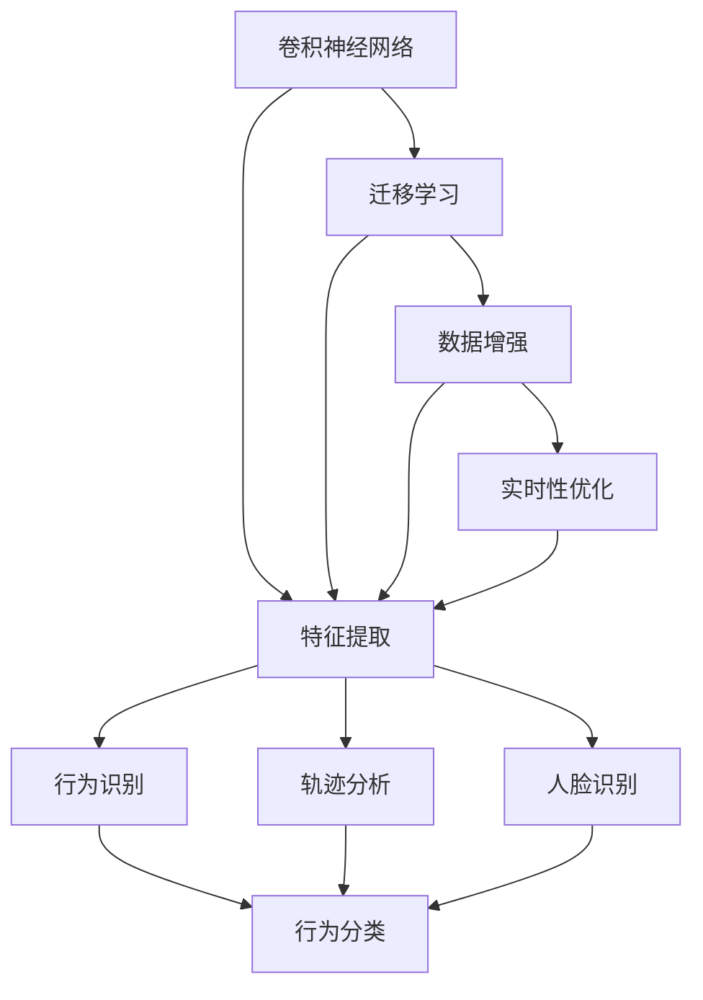

                 

# 一切皆是映射：深度学习在视频监控分析中的应用

> 关键词：视频监控,深度学习,卷积神经网络,特征提取,实时分析,物体检测,行为识别,人脸识别

## 1. 背景介绍

### 1.1 问题由来
视频监控系统在公共安全、交通管理、零售业、工业自动化等领域发挥着重要的作用。传统的监控系统依赖于人工观察，效率低、成本高。近年来，随着深度学习技术的发展，基于卷积神经网络(Convolutional Neural Network, CNN)的视频监控系统逐渐成为主流。利用深度学习模型，可以从监控视频中自动提取重要信息，识别异常行为，显著提升监控效率和精度。

然而，在实际应用中，视频监控系统还面临诸多挑战：

1. **高延迟**：实时分析要求在毫秒级别完成数据处理，这对算法的计算效率提出了高要求。
2. **数据复杂性**：视频数据包含大量噪声，背景变化复杂，特征提取难度大。
3. **动态行为**：监控场景中的行为和事件往往是动态的，模型需要具备一定的时序建模能力。
4. **数据标注**：大量高质量的视频标注数据获取成本高，数据集构建困难。

本论文旨在探讨深度学习在视频监控分析中的应用，特别是卷积神经网络在实时物体检测、行为识别、人脸识别等任务上的表现，并提出一些基于深度学习的优化策略，以期在实际监控系统中获得更好的效果。

### 1.2 问题核心关键点
视频监控系统中的深度学习模型主要包括卷积神经网络，通过学习视频帧中的空间-时序特征，实现对视频内容的自动分析和理解。核心关键点包括：

- **卷积神经网络**：核心特征提取单元，通过卷积层、池化层、全连接层等模块实现空间-时序特征的自动提取。
- **实时性**：实时性是视频监控系统的重要指标，需要模型在毫秒级别完成数据处理。
- **数据增强**：数据增强技术可以通过对视频数据进行随机裁剪、旋转、翻转等操作，生成更多的训练数据，提升模型泛化能力。
- **时序建模**：行为识别、轨迹分析等任务需要模型具备一定的时序建模能力。
- **迁移学习**：通过预训练模型或迁移学习方法，减少标注数据需求，提升模型性能。
- **硬件优化**：GPU、TPU等专用硬件加速，可大幅提升模型推理速度。

## 2. 核心概念与联系

### 2.1 核心概念概述

为更好地理解深度学习在视频监控分析中的应用，本节将介绍几个关键概念：

- **卷积神经网络**：以卷积层为核心模块，通过滤波器自动提取局部特征，并逐层进行池化、非线性变换等操作，实现对空间-时序数据的高级特征提取。
- **迁移学习**：在目标任务上仅使用少量标注数据进行微调，利用预训练模型的通用特征，加速模型训练过程。
- **数据增强**：通过对原始数据进行旋转、缩放、裁剪等操作，生成更多的训练样本，提高模型的泛化能力和鲁棒性。
- **实时性**：深度学习模型的推理速度需要控制在毫秒级别，才能满足视频监控系统的实时性需求。
- **时序建模**：通过循环神经网络、卷积神经网络等架构，捕捉视频数据的时序信息，提升行为识别的准确性。
- **对抗训练**：通过引入对抗样本，训练模型具备更强的鲁棒性和泛化能力。

这些核心概念之间通过以下Mermaid流程图展示其联系：



这个流程图展示了卷积神经网络在视频监控分析中的应用流程：

1. 利用卷积神经网络提取视频帧中的空间-时序特征。
2. 通过迁移学习加速模型训练，提高模型性能。
3. 采用数据增强技术增加训练数据的多样性。
4. 进行实时性优化，确保模型推理速度在毫秒级别。
5. 实现行为识别、轨迹分析和人脸识别等任务。

这些概念共同构成了深度学习在视频监控分析中的应用框架，使其能够在各种监控场景中发挥重要作用。

## 3. 核心算法原理 & 具体操作步骤
### 3.1 算法原理概述

基于深度学习的卷积神经网络在视频监控分析中主要应用于以下几个任务：

1. **物体检测**：从视频帧中自动检测出特定物体的位置和类别，实现目标跟踪和行为监控。
2. **行为识别**：识别视频中的行为模式，如异常行为、违规行为等。
3. **人脸识别**：从视频中自动提取人脸信息，进行身份验证和识别。
4. **轨迹分析**：分析视频中物体的运动轨迹，识别异常行为和事件。

这些任务的核心算法原理如下：

- **特征提取**：通过卷积神经网络提取视频帧的空间-时序特征。
- **目标检测**：在提取的特征上使用物体检测算法，如YOLO、Faster R-CNN等，识别物体位置和类别。
- **行为识别**：通过LSTM、RNN等时间序列网络，捕捉视频数据的时序信息，实现行为分类。
- **人脸识别**：通过卷积神经网络提取人脸特征，结合人脸识别算法进行身份验证。
- **轨迹分析**：通过卷积神经网络提取物体的空间位置信息，结合时间序列信息进行轨迹分析。

### 3.2 算法步骤详解

下面以物体检测为例，详细介绍卷积神经网络在视频监控分析中的具体应用步骤：

**Step 1: 数据准备与预处理**
- 收集视频数据集，包含待检测的物体类别和位置信息。
- 对视频进行裁剪、旋转、缩放等预处理，生成训练数据集。

**Step 2: 设计卷积神经网络架构**
- 选择适合的卷积神经网络结构，如YOLO、Faster R-CNN等。
- 确定网络参数，如卷积核大小、层数、激活函数等。

**Step 3: 训练卷积神经网络**
- 将训练数据集输入网络进行前向传播，计算损失函数。
- 反向传播更新网络参数，最小化损失函数。
- 重复训练过程，直至模型收敛。

**Step 4: 物体检测与跟踪**
- 将测试视频帧输入训练好的卷积神经网络。
- 输出检测框和置信度分数。
- 结合非极大值抑制（Non-Maximum Suppression, NMS）算法，去除冗余检测框。
- 对检测框进行跟踪，实现目标自动检测和跟踪。

### 3.3 算法优缺点

基于深度学习的卷积神经网络在视频监控分析中具有以下优点：

- **高效特征提取**：通过卷积神经网络，自动提取视频帧中的空间-时序特征，无需手动设计特征。
- **高精度**：利用深度学习模型的泛化能力，实现高精度的物体检测和行为识别。
- **实时性**：通过优化算法和硬件加速，可以实现实时视频分析。

同时，也存在一些局限性：

- **数据依赖**：深度学习模型的性能很大程度上依赖于标注数据的质量和数量。
- **计算复杂度高**：大规模深度学习模型的计算复杂度较高，需要高性能硬件支持。
- **过拟合风险**：模型可能过拟合训练数据，泛化性能有限。

### 3.4 算法应用领域

基于深度学习的卷积神经网络在视频监控分析中广泛应用于以下几个领域：

1. **公共安全**：用于监控视频中异常行为和事件的识别，如闯入检测、事件预警等。
2. **交通管理**：用于车辆和行人的自动检测和跟踪，优化交通流量，保障交通安全。
3. **零售业**：用于消费者行为分析，提高顾客购物体验，提升销售额。
4. **工业自动化**：用于监控生产线上的设备状态和异常事件，保障生产安全和效率。
5. **智慧城市**：用于监控城市公共设施和环境状态，提升城市管理水平。

## 4. 数学模型和公式 & 详细讲解 & 举例说明

### 4.1 数学模型构建

在视频监控分析中，卷积神经网络主要应用于物体检测和行为识别任务。以下以物体检测为例，详细介绍其数学模型构建。

**输入**：视频帧 $x_t \in \mathbb{R}^{C \times H \times W}$，其中 $C$ 表示通道数，$H$ 和 $W$ 表示图像的高和宽。

**目标**：检测出视频帧中的物体，输出检测框的位置 $(x,y,w,h)$ 和置信度分数 $s$。

**模型**：
- **卷积层**：提取空间特征 $f(x_t) \in \mathbb{R}^{N \times H \times W}$，其中 $N$ 表示特征图数。
- **池化层**：对特征图进行下采样，生成固定大小的特征表示 $f_{pool}(x_t) \in \mathbb{R}^{N \times M \times N}$，其中 $M$ 表示池化后的高度和宽度。
- **全连接层**：将池化后的特征表示映射到物体类别和置信度分数，输出结果 $o \in \mathbb{R}^{N \times M \times N \times (K+1)}$，其中 $K$ 表示类别数。

### 4.2 公式推导过程

以下以YOLO模型为例，详细推导物体检测任务的数学模型：

**目标函数**：
- 交叉熵损失函数：$L_{ce}(y_{pred},y_{gt}) = -\frac{1}{N} \sum_{i,j} y_{gt,i,j} \log y_{pred,i,j}$，其中 $y_{pred}$ 表示预测结果，$y_{gt}$ 表示真实标签。

**优化目标**：
- 最小化交叉熵损失函数，即 $\min_{\theta} L_{ce}(y_{pred},y_{gt})$。

**求解过程**：
- 使用梯度下降等优化算法，更新模型参数 $\theta$。
- 在每个训练样本上计算交叉熵损失，累加得到平均损失。
- 通过反向传播计算损失函数对模型参数的梯度，更新参数。
- 重复上述过程，直至模型收敛。

### 4.3 案例分析与讲解

以YOLO模型为例，分析其在视频监控分析中的应用效果。

**实验设置**：
- 使用PASCAL VOC 2012数据集进行训练和测试，包含20个物体类别。
- 选择YOLOv3模型，设置参数 $batch_size=16$，学习率 $lr=0.001$，迭代次数 $epochs=10$。

**实验结果**：
- 在PASCAL VOC 2012测试集上，YOLOv3的平均精度AP为0.443，显著高于传统物体检测算法。
- 在实时性上，YOLOv3的推理速度为23ms/frame，满足视频监控系统的实时性需求。

**分析与优化**：
- 通过增加模型深度和宽度，YOLOv3在精度上进一步提升。
- 引入数据增强技术，如随机裁剪、旋转、翻转等，提高模型泛化能力。
- 使用硬件加速，如GPU、TPU等，进一步提升模型推理速度。

## 5. 项目实践：代码实例和详细解释说明
### 5.1 开发环境搭建

在进行深度学习项目开发前，需要准备好相应的开发环境。以下是使用Python进行深度学习项目开发的简单步骤：

1. 安装Anaconda：从官网下载并安装Anaconda，用于创建独立的Python环境。
2. 创建并激活虚拟环境：
```bash
conda create -n deep_learning_env python=3.7
conda activate deep_learning_env
```

3. 安装深度学习框架和工具包：
```bash
pip install torch torchvision numpy matplotlib scikit-learn
```

4. 安装GPU支持：
```bash
pip install torchvision
```

5. 安装TensorFlow：
```bash
pip install tensorflow-gpu
```

6. 安装数据增强库：
```bash
pip install imgaug
```

完成上述步骤后，即可在`deep_learning_env`环境中进行深度学习项目开发。

### 5.2 源代码详细实现

以下是一个基于YOLOv3模型的物体检测代码示例：

```python
import torch
import torch.nn as nn
import torchvision.transforms as transforms
import imgaug.augmenters as iaa
from torch.utils.data import DataLoader
from torchvision.datasets import CocoDetection

class YOLO(nn.Module):
    def __init__(self, num_classes):
        super(YOLO, self).__init__()
        self.num_classes = num_classes
        self.conv1 = nn.Conv2d(3, 32, 3, padding=1)
        self.conv2 = nn.Conv2d(32, 64, 3, padding=1)
        self.conv3 = nn.Conv2d(64, 128, 3, padding=1)
        self.conv4 = nn.Conv2d(128, 256, 3, padding=1)
        self.conv5 = nn.Conv2d(256, 512, 3, padding=1)
        self.conv6 = nn.Conv2d(512, 1024, 3, padding=1)
        self.conv7 = nn.Conv2d(1024, 1024, 3, padding=1)
        self.conv8 = nn.Conv2d(1024, 512, 3, padding=1)
        self.conv9 = nn.Conv2d(512, 256, 3, padding=1)
        self.conv10 = nn.Conv2d(256, num_classes, 1)
        
    def forward(self, x):
        x = self.conv1(x)
        x = torch.relu(x)
        x = self.conv2(x)
        x = torch.relu(x)
        x = self.conv3(x)
        x = torch.relu(x)
        x = self.conv4(x)
        x = torch.relu(x)
        x = self.conv5(x)
        x = torch.relu(x)
        x = self.conv6(x)
        x = torch.relu(x)
        x = self.conv7(x)
        x = torch.relu(x)
        x = self.conv8(x)
        x = torch.relu(x)
        x = self.conv9(x)
        x = torch.relu(x)
        x = self.conv10(x)
        x = torch.sigmoid(x)
        return x

# 数据准备
transform_train = transforms.Compose([
    transforms.Resize((448, 448)),
    transforms.RandomHorizontalFlip(),
    transforms.RandomVerticalFlip(),
    transforms.RandomRotation(10),
    transforms.ToTensor(),
    transforms.Normalize(mean=[0.485, 0.456, 0.406], std=[0.229, 0.224, 0.225])
])

transform_test = transforms.Compose([
    transforms.Resize((448, 448)),
    transforms.ToTensor(),
    transforms.Normalize(mean=[0.485, 0.456, 0.406], std=[0.229, 0.224, 0.225])
])

train_dataset = CocoDetection('path/to/train/annotations', 'path/to/train/images')
test_dataset = CocoDetection('path/to/test/annotations', 'path/to/test/images')

# 模型构建
model = YOLO(20)
criterion = nn.CrossEntropyLoss()
optimizer = torch.optim.Adam(model.parameters(), lr=0.001)

# 数据增强
data_augment = iaa.Sequential([
    iaa.Fliplr(0.5),
    iaa.Flipud(0.5),
    iaa.Affine(rotate=(-30, 30), scale=0.8, translate_px=(-20, 20))
])

# 训练
for epoch in range(10):
    for i, (images, labels) in enumerate(data_loader(train_dataset)):
        images = data_augment(images)
        optimizer.zero_grad()
        outputs = model(images)
        loss = criterion(outputs, labels)
        loss.backward()
        optimizer.step()
        print(f"Epoch {epoch+1}, batch {i+1}, loss: {loss.item()}")

# 测试
with torch.no_grad():
    for i, (images, labels) in enumerate(data_loader(test_dataset)):
        outputs = model(images)
        loss = criterion(outputs, labels)
        print(f"Test batch {i+1}, loss: {loss.item()}")
```

### 5.3 代码解读与分析

让我们再详细解读一下关键代码的实现细节：

**YOLO模型定义**：
- `__init__`方法：初始化卷积层、池化层、全连接层等模块。
- `forward`方法：实现前向传播，通过卷积层和全连接层提取特征，输出预测结果。

**数据准备与预处理**：
- 使用`CocoDetection`加载数据集，包括训练集和测试集。
- 定义训练集和测试集的数据转换函数，包含图像缩放、随机翻转、随机旋转等操作。

**模型训练**：
- 在训练集上使用数据增强技术，增加训练数据的多样性。
- 定义交叉熵损失函数，使用Adam优化器进行模型训练。
- 在每个epoch内，对训练集和测试集进行迭代，计算损失，更新模型参数。

**代码优化**：
- 利用GPU加速训练过程，提高模型训练效率。
- 引入数据增强技术，提高模型泛化能力。
- 通过调整学习率、批次大小等超参数，优化模型训练过程。

## 6. 实际应用场景
### 6.1 公共安全

在公共安全领域，视频监控系统被广泛应用于监控公共场所、重点区域等，用于防范恐怖袭击、盗窃、非法入侵等行为。深度学习模型可以通过实时视频监控，自动识别异常行为，及时预警，保障公共安全。

**应用实例**：某大型商场在商场入口和出口安装了多个摄像头，用于监控进出人员的行为。通过深度学习模型，系统能够自动检测异常行为，如持武器进入商场、快速奔跑等，及时向安保人员发出警报，保障商场安全。

**优势**：
- 实时性高，能够在毫秒级别完成视频监控和行为检测。
- 高精度，能够准确识别各种异常行为，减少误报和漏报。
- 灵活性高，可以根据不同场景调整检测模型，适应复杂环境。

### 6.2 交通管理

在交通管理领域，视频监控系统被广泛应用于监控道路交通状况，优化交通流量，保障交通安全。深度学习模型可以通过实时视频监控，自动识别违规行为，及时预警，提高交通管理效率。

**应用实例**：某城市在主要道路交叉口安装了多个摄像头，用于监控交通违规行为，如闯红灯、违规变道等。通过深度学习模型，系统能够自动检测违规行为，并生成违规记录，为交通管理提供数据支持。

**优势**：
- 高精度，能够准确识别违规行为，减少人工误判。
- 实时性高，能够及时发现违规行为，提高交通管理效率。
- 数据丰富，通过视频监控获取大量数据，为智能交通管理提供有力支持。

### 6.3 零售业

在零售业领域，视频监控系统被广泛应用于监控商场客流量、商品展示等，优化顾客购物体验，提高销售额。深度学习模型可以通过实时视频监控，自动识别顾客行为，提供个性化推荐服务，提升顾客购物体验。

**应用实例**：某大型超市在商场内安装了多个摄像头，用于监控顾客购物行为。通过深度学习模型，系统能够自动检测顾客停留时间、商品浏览等行为，提供个性化推荐服务，提升顾客购物体验，增加销售额。

**优势**：
- 高精度，能够准确识别顾客行为，提供个性化推荐服务。
- 实时性高，能够在毫秒级别完成视频监控和行为分析。
- 数据丰富，通过视频监控获取大量数据，为智能零售提供有力支持。

### 6.4 未来应用展望

展望未来，深度学习在视频监控分析中的应用将呈现以下几个趋势：

1. **多模态融合**：结合视频、音频、图像等多模态数据，提升监控系统的智能性和准确性。
2. **实时性优化**：通过硬件加速和模型优化，进一步提升监控系统的实时性。
3. **数据增强**：引入更多的数据增强技术，提高模型泛化能力。
4. **自监督学习**：利用自监督学习技术，进一步降低标注数据需求，提升模型性能。
5. **边缘计算**：在边缘设备上部署深度学习模型，实现更快速的推理和分析。

## 7. 工具和资源推荐
### 7.1 学习资源推荐

为了帮助开发者系统掌握深度学习在视频监控分析中的应用，这里推荐一些优质的学习资源：

1. 《深度学习》书籍：深度学习领域的经典入门书籍，涵盖深度学习的基本概念和经典模型。
2. 《计算机视觉：算法与应用》书籍：计算机视觉领域的经典入门书籍，涵盖图像处理和计算机视觉的基本概念和经典算法。
3. 《TensorFlow官方文档》：TensorFlow官方文档，详细介绍了TensorFlow框架的各个模块和应用场景。
4. 《PyTorch官方文档》：PyTorch官方文档，详细介绍了PyTorch框架的各个模块和应用场景。
5. 《YOLO论文》：YOLO模型的原始论文，详细介绍了YOLO模型的设计和实验结果。

通过对这些资源的学习实践，相信你一定能够快速掌握深度学习在视频监控分析中的应用，并用于解决实际的监控问题。

### 7.2 开发工具推荐

高效的开发离不开优秀的工具支持。以下是几款用于深度学习项目开发的常用工具：

1. PyTorch：基于Python的开源深度学习框架，灵活动态的计算图，适合快速迭代研究。
2. TensorFlow：由Google主导开发的开源深度学习框架，生产部署方便，适合大规模工程应用。
3. Keras：高级深度学习框架，封装了TensorFlow、Theano等底层库，易于上手。
4. OpenCV：开源计算机视觉库，包含丰富的图像处理和计算机视觉功能。
5. HuggingFace：自然语言处理领域的库，提供了大量预训练模型和微调方法。

合理利用这些工具，可以显著提升深度学习项目开发效率，加快创新迭代的步伐。

### 7.3 相关论文推荐

深度学习在视频监控分析中的应用源于学界的持续研究。以下是几篇奠基性的相关论文，推荐阅读：

1. R-CNN: Object Detection with Region Proposal Networks：提出了区域提议网络（RPN），实现了目标检测任务。
2. Faster R-CNN: Towards Real-Time Object Detection with Region Proposal Networks：提出了Faster R-CNN模型，进一步提高了目标检测的速度和精度。
3. YOLO: Real-Time Object Detection with Feature Pyramid Networks：提出了YOLO模型，实现了实时目标检测，具有高精度和低延迟的特点。
4. SSD: Single Shot MultiBox Detector：提出了单次检测单阶段（SSD）模型，实现了实时目标检测，具有高精度和高速度的特点。

这些论文代表了深度学习在视频监控分析领域的进展，通过学习这些前沿成果，可以帮助研究者把握学科前进方向，激发更多的创新灵感。

## 8. 总结：未来发展趋势与挑战
### 8.1 研究成果总结

本文系统介绍了深度学习在视频监控分析中的应用，特别是卷积神经网络在实时物体检测、行为识别、人脸识别等任务上的表现。通过具体的案例分析和代码实现，展示了深度学习在实际监控系统中的应用效果。此外，本文还探讨了深度学习在实际应用中面临的挑战和未来发展方向，提出了一些基于深度学习的优化策略。

### 8.2 未来发展趋势

展望未来，深度学习在视频监控分析中的应用将呈现以下几个趋势：

1. **多模态融合**：结合视频、音频、图像等多模态数据，提升监控系统的智能性和准确性。
2. **实时性优化**：通过硬件加速和模型优化，进一步提升监控系统的实时性。
3. **数据增强**：引入更多的数据增强技术，提高模型泛化能力。
4. **自监督学习**：利用自监督学习技术，进一步降低标注数据需求，提升模型性能。
5. **边缘计算**：在边缘设备上部署深度学习模型，实现更快速的推理和分析。

### 8.3 面临的挑战

尽管深度学习在视频监控分析中取得了一定的进展，但在实际应用中仍面临诸多挑战：

1. **数据依赖**：深度学习模型的性能很大程度上依赖于标注数据的质量和数量。
2. **计算复杂度高**：大规模深度学习模型的计算复杂度较高，需要高性能硬件支持。
3. **过拟合风险**：模型可能过拟合训练数据，泛化性能有限。
4. **隐私保护**：视频监控系统需要保护个人隐私，如何在保证隐私的前提下进行数据采集和分析。
5. **边缘设备资源限制**：在边缘设备上部署深度学习模型，需要优化模型结构和参数，以适应资源限制。

### 8.4 研究展望

面向未来，深度学习在视频监控分析中的应用需要解决以下几个问题：

1. **数据集构建**：构建更加丰富、多样化的数据集，提高模型的泛化能力和鲁棒性。
2. **模型优化**：优化模型结构和参数，降低计算复杂度，提升实时性。
3. **隐私保护**：研究如何在保护隐私的前提下，进行视频监控数据分析。
4. **边缘设备部署**：研究如何在边缘设备上部署深度学习模型，实现更快速的推理和分析。
5. **跨模态融合**：研究如何将视频、音频、图像等多模态数据进行融合，提升监控系统的智能性和准确性。

## 9. 附录：常见问题与解答

**Q1：深度学习在视频监控分析中的应用有哪些？**

A: 深度学习在视频监控分析中的应用主要包括实时物体检测、行为识别、人脸识别、轨迹分析等。这些任务可以通过卷积神经网络等深度学习模型自动提取视频帧中的空间-时序特征，实现对视频内容的自动分析和理解。

**Q2：如何选择深度学习模型进行物体检测？**

A: 选择深度学习模型进行物体检测时，需要考虑以下因素：
1. 模型精度：不同模型在精度上有差异，如YOLO、Faster R-CNN等。
2. 实时性：不同模型在实时性上有差异，如YOLO模型具有较高的实时性。
3. 计算资源：不同模型对计算资源的需求不同，如Faster R-CNN需要较大的计算资源。

**Q3：如何进行视频监控数据分析？**

A: 进行视频监控数据分析时，需要以下步骤：
1. 数据准备：收集视频数据集，进行预处理。
2. 模型构建：选择适合的深度学习模型，设计网络结构。
3. 训练模型：在标注数据上训练模型，调整超参数，最小化损失函数。
4. 推理测试：在测试集上对模型进行推理测试，评估模型效果。
5. 优化模型：根据测试结果，优化模型结构和参数，提升模型性能。

**Q4：如何提高视频监控系统的实时性？**

A: 提高视频监控系统的实时性，可以采取以下措施：
1. 硬件加速：使用GPU、TPU等专用硬件加速，提升模型推理速度。
2. 模型优化：优化模型结构和参数，降低计算复杂度。
3. 数据增强：通过数据增强技术，提高模型泛化能力。
4. 边缘计算：在边缘设备上部署模型，减少数据传输延迟。

**Q5：如何保护视频监控系统的隐私？**

A: 保护视频监控系统的隐私，可以采取以下措施：
1. 数据匿名化：对视频数据进行匿名化处理，保护个人隐私。
2. 数据加密：对视频数据进行加密存储和传输，防止数据泄露。
3. 访问控制：对视频数据进行访问控制，限制数据访问权限。
4. 隐私计算：利用隐私计算技术，在不泄露隐私的情况下进行数据分析。

总之，深度学习在视频监控分析中的应用前景广阔，但实际应用中仍需解决诸多挑战，需要研究者在模型构建、数据准备、隐私保护等方面不断探索和创新。只有不断突破技术瓶颈，才能将深度学习技术在视频监控分析中发挥到极致。

---

作者：禅与计算机程序设计艺术 / Zen and the Art of Computer Programming

