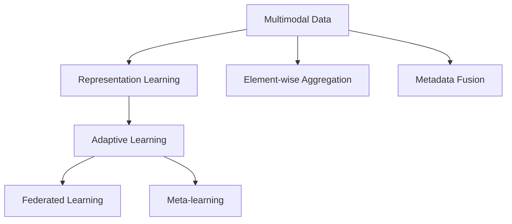

                 

# 一切皆是映射：解码多模态数据：元学习的视角

> 关键词：多模态数据、元学习、映射、表示学习、自适应学习、联邦学习

## 1. 背景介绍

### 1.1 问题由来
在当前数据驱动的人工智能时代，多模态数据因其丰富的信息内涵和广泛的现实应用，成为了AI研究的热点。例如，文本、图像、音频、视频等模态间融合，可以显著提升模型的性能和泛化能力，推动诸如智能推荐、图像识别、语音识别等领域的进步。

然而，多模态数据通常来自不同的源，具有显著的异质性。如何在统一的理论框架下，高效地融合和分析多模态数据，成为了目前研究的热点和难点。元学习(Meta Learning)这一新兴研究范式，凭借其对任务适应性的高效学习机制，为多模态数据的综合分析提供了一种全新的视角。

### 1.2 问题核心关键点
元学习是一种在有限数据下学习模型适应新任务的能力，其核心思想是构建通用的模型参数或结构，使得模型能够通过少量的样本信息快速适应新任务。在多模态数据融合的背景下，元学习可以借助统一的表示学习机制，对不同模态数据进行编码映射，实现高效、鲁棒的联合学习。

本文聚焦于基于元学习的视角，探索如何通过映射机制解码多模态数据，进一步提升元学习的性能和泛化能力。

### 1.3 问题研究意义
元学习在多模态数据融合中的应用，具有以下重要意义：

1. **数据高效利用**：通过统一的映射机制，不同模态的数据能够被高效整合，减少对单一模态数据的依赖，充分利用多模态数据的优势。

2. **泛化能力提升**：统一的映射机制有助于提高模型对不同任务和场景的适应性，提升模型的泛化能力。

3. **灵活性增强**：通过灵活的元学习算法，模型能够适应不同规模和类型的数据集，增强系统灵活性。

4. **技术创新**：元学习在多模态数据融合中的应用，带来了新的算法和模型设计思路，推动了AI技术的发展。

5. **实际应用**：元学习在多模态数据融合中的应用，对诸如智能推荐、图像识别、语音识别等诸多领域具有重要的实用价值，能够为实际应用提供更高效的解决方案。

## 2. 核心概念与联系

### 2.1 核心概念概述

为了更好地理解元学习在多模态数据融合中的应用，本节将介绍几个关键的概念：

- **多模态数据**：指的是同时包含文本、图像、音频、视频等多种数据模态的信息。多模态数据通常由传感器或用户交互生成，包含丰富的语义和上下文信息。

- **元学习**：指在有限数据下，通过学习模型适应新任务的能力。元学习模型的目标是在新任务上快速学习和适应，而非对特定任务进行细化。

- **表示学习**：指学习数据的高维表示，以便更好地进行模式识别和分类。常见的表示学习方法包括自编码器、VAE等。

- **自适应学习**：指通过调整模型参数，使模型能够适应不同数据集和新任务的学习方法。

- **联邦学习**：指在分布式环境中，通过协作的方式训练模型，保护数据隐私。

这些概念通过以下Mermaid流程图展示了它们之间的联系：



该流程图展示了多模态数据、表示学习、自适应学习、联邦学习、元学习之间的联系：

1. **多模态数据**：包含文本、图像、音频、视频等多种模态的信息。
2. **表示学习**：对不同模态的数据进行编码映射，获得统一的表示。
3. **自适应学习**：根据不同任务和数据集的特点，调整模型参数。
4. **联邦学习**：在分布式环境中协作训练模型，保护数据隐私。
5. **元学习**：通过统一的任务适应性学习机制，提高模型对新任务的适应能力。

这些概念共同构成了元学习在多模态数据融合中的理论框架，使得模型能够高效地整合和分析不同模态的数据，提升学习效率和泛化能力。

## 3. 核心算法原理 & 具体操作步骤
### 3.1 算法原理概述

元学习在多模态数据融合中的核心思想是通过统一的表示学习机制，对不同模态的数据进行编码映射，从而实现高效、鲁棒的联合学习。具体来说，元学习在多模态数据融合中主要分为以下几个步骤：

1. **数据预处理**：对不同模态的数据进行标准化处理，如归一化、分词、特征提取等，以获得统一的数据格式。
2. **表示学习**：通过学习不同模态数据的高维表示，实现数据的统一编码。常见的表示学习方法包括自编码器、VAE、Transformer等。
3. **映射学习**：将不同模态的数据映射到统一的表示空间中，以便进行联合学习。映射学习可以通过向量空间中的投影、矩阵变换等方式实现。
4. **自适应学习**：根据新任务的特点，调整模型的参数，使得模型能够适应新任务。常见的自适应学习方法包括微调、自适应梯度下降等。
5. **元学习**：通过学习模型对新任务的适应能力，提升模型的泛化能力。常见的元学习方法包括任务无关学习、元梯度下降等。

### 3.2 算法步骤详解

下面详细介绍元学习在多模态数据融合中的详细步骤：

#### 步骤1: 数据预处理
对不同模态的数据进行标准化处理，以便于后续的表示学习。常见的处理方式包括：

- 文本数据：分词、去除停用词、词向量嵌入等。
- 图像数据：归一化、尺度变换、特征提取等。
- 音频数据：频谱转换、MFCC特征提取等。

#### 步骤2: 表示学习
通过对不同模态的数据进行编码映射，获得统一的高维表示。表示学习可以通过以下方法实现：

- 自编码器：通过编码器将数据压缩为低维表示，再通过解码器重构数据。常见的自编码器包括PCA、VAE、AE等。
- Transformer：通过自注意力机制，对不同模态的数据进行编码映射，获得统一的高维表示。

#### 步骤3: 映射学习
将不同模态的数据映射到统一的表示空间中，以便进行联合学习。映射学习可以通过以下方法实现：

- 向量空间投影：通过线性投影或非线性变换，将不同模态的数据映射到统一的向量空间中。
- 矩阵变换：通过矩阵乘法和矩阵变换，将不同模态的数据映射到统一的矩阵表示空间中。

#### 步骤4: 自适应学习
根据新任务的特点，调整模型的参数，使得模型能够适应新任务。常见的自适应学习方法包括：

- 微调：对模型的部分或全部参数进行微调，以适应新任务。
- 自适应梯度下降：通过调整学习率等超参数，使模型能够适应不同任务和数据集。

#### 步骤5: 元学习
通过学习模型对新任务的适应能力，提升模型的泛化能力。常见的元学习方法包括：

- 任务无关学习：通过学习通用的模型参数，使得模型能够适应不同任务。
- 元梯度下降：通过元梯度计算，优化模型对新任务的适应能力。

### 3.3 算法优缺点

元学习在多模态数据融合中具有以下优点：

1. **高效性**：通过统一的表示学习机制，不同模态的数据能够被高效整合，减少对单一模态数据的依赖。
2. **泛化能力**：统一的映射机制有助于提高模型对不同任务和场景的适应性，提升模型的泛化能力。
3. **灵活性**：通过灵活的元学习算法，模型能够适应不同规模和类型的数据集，增强系统灵活性。
4. **数据隐私保护**：通过联邦学习等分布式学习方法，能够保护数据隐私，避免数据泄露。

同时，元学习在多模态数据融合中也存在一些局限性：

1. **计算复杂度高**：元学习需要大量的计算资源，特别是在大规模数据集上训练模型时，计算复杂度较高。
2. **模型复杂度高**：元学习模型通常较为复杂，需要精心设计和调参，以获得理想的性能。
3. **依赖大量标注数据**：元学习通常需要大量的标注数据进行训练，获取高质量标注数据的成本较高。

尽管存在这些局限性，但元学习在多模态数据融合中的应用，仍然展示了巨大的潜力。未来，随着计算资源的提升和算法设计的进步，元学习必将在更多场景下发挥重要作用。

### 3.4 算法应用领域

元学习在多模态数据融合中的应用，已经在诸多领域取得了显著进展，如智能推荐、图像识别、语音识别、视频分析等。以下是几个具体的应用场景：

1. **智能推荐系统**：通过对不同模态的用户行为数据进行融合，提升推荐系统的个性化和精准度。常见的融合方式包括用户画像构建、多模态协同过滤等。

2. **图像识别**：通过融合文本、图像、音频等多种模态的信息，提升图像识别的准确率和泛化能力。常见的融合方式包括图像描述、视觉-文本跨模态匹配等。

3. **语音识别**：通过融合文本、语音、图像等多种模态的信息，提升语音识别的准确率和鲁棒性。常见的融合方式包括语音-文本跨模态匹配、语音-图像联合识别等。

4. **视频分析**：通过融合视频、音频、文本等多种模态的信息，提升视频分析和理解的能力。常见的融合方式包括视频描述、情感分析等。

## 4. 数学模型和公式 & 详细讲解 & 举例说明

### 4.1 数学模型构建

在本节中，我们将通过数学模型来详细描述元学习在多模态数据融合中的应用。

假设我们有多模态数据集 $D = \{(x_i, y_i)\}_{i=1}^N$，其中 $x_i$ 表示样本，$y_i$ 表示标签。假设 $x_i$ 包含 $M$ 个模态的数据 $x_i = (x_{i1}, x_{i2}, ..., x_{iM})$，其中 $x_{im}$ 表示第 $m$ 个模态的数据。假设 $y_i$ 表示样本的标签。

元学习在多模态数据融合中的数学模型可以表示为：

$$
\theta^* = \mathop{\arg\min}_{\theta} \sum_{i=1}^N \mathcal{L}(\theta, x_i, y_i)
$$

其中 $\theta$ 表示模型的参数，$\mathcal{L}(\theta, x_i, y_i)$ 表示模型在样本 $x_i$ 上的损失函数。元学习模型的目标是找到最优参数 $\theta^*$，使得模型在数据集 $D$ 上的平均损失最小化。

### 4.2 公式推导过程

假设我们采用自编码器进行表示学习，对不同模态的数据进行编码映射。设 $E_i$ 表示第 $i$ 个模态的自编码器，$z_i = E_i(x_i)$ 表示自编码器对样本 $x_i$ 的编码表示。

假设采用矩阵变换进行映射学习，设 $T$ 表示映射矩阵，$z'_i = T z_i$ 表示映射后的表示。

假设采用微调进行自适应学习，设 $\theta'$ 表示微调后的模型参数。

假设采用元梯度下降进行元学习，设 $\phi$ 表示元梯度下降的超参数。

根据以上假设，元学习在多模态数据融合中的数学模型可以进一步表示为：

$$
\theta^* = \mathop{\arg\min}_{\theta'} \sum_{i=1}^N \mathcal{L}(\theta', z'_i, y_i) + \phi \mathcal{L}_{meta}(\theta')
$$

其中 $\mathcal{L}_{meta}(\theta')$ 表示元梯度下降的目标函数，用于优化模型对新任务的适应能力。

### 4.3 案例分析与讲解

为了更好地理解元学习在多模态数据融合中的应用，我们以智能推荐系统为例，进行详细分析。

假设我们有一个智能推荐系统，需要根据用户的文本描述、浏览历史、购买历史等不同模态的数据，为用户推荐商品。

1. **数据预处理**：
   - 对用户的文本描述进行分词、去除停用词、词向量嵌入等处理。
   - 对用户的浏览历史和购买历史进行特征提取，获得高维向量表示。

2. **表示学习**：
   - 使用自编码器对文本、浏览历史、购买历史等不同模态的数据进行编码映射，获得统一的高维表示。

3. **映射学习**：
   - 使用矩阵变换对不同模态的表示进行映射，获得统一的表示空间。

4. **自适应学习**：
   - 对微调后的模型进行微调，以适应具体的推荐任务。

5. **元学习**：
   - 通过元梯度下降，优化模型对新推荐任务和数据集的适应能力。

## 5. 项目实践：代码实例和详细解释说明

### 5.1 开发环境搭建

在进行项目实践前，我们需要准备好开发环境。以下是使用Python进行TensorFlow开发的环境配置流程：

1. 安装Anaconda：从官网下载并安装Anaconda，用于创建独立的Python环境。

2. 创建并激活虚拟环境：
```bash
conda create -n tf-env python=3.8 
conda activate tf-env
```

3. 安装TensorFlow：根据CUDA版本，从官网获取对应的安装命令。例如：
```bash
conda install tensorflow==2.7 -c tf -c conda-forge
```

4. 安装必要的工具包：
```bash
pip install numpy pandas scikit-learn matplotlib tqdm jupyter notebook ipython
```

完成上述步骤后，即可在`tf-env`环境中开始项目实践。

### 5.2 源代码详细实现

下面我们以智能推荐系统为例，给出使用TensorFlow进行多模态数据融合的代码实现。

首先，定义数据处理函数：

```python
import tensorflow as tf
from tensorflow.keras.preprocessing.text import Tokenizer
from tensorflow.keras.preprocessing.sequence import pad_sequences

def preprocess_text(texts):
    tokenizer = Tokenizer()
    tokenizer.fit_on_texts(texts)
    sequences = tokenizer.texts_to_sequences(texts)
    return pad_sequences(sequences, maxlen=max_len)

def preprocess_numbers(numbers):
    return tf.convert_to_tensor(numbers, dtype=tf.float32)

def preprocess_categorical(cats):
    return tf.one_hot(cats, depth=depth)

def preprocess_data(texts, numbers, cats, labels):
    texts = preprocess_text(texts)
    numbers = preprocess_numbers(numbers)
    cats = preprocess_categorical(cats)
    return (texts, numbers, cats, labels)
```

然后，定义模型和优化器：

```python
from tensorflow.keras import layers

model = tf.keras.Sequential([
    layers.Embedding(input_dim=vocab_size, output_dim=embedding_dim, input_length=max_len),
    layers.Conv1D(filters=64, kernel_size=3, activation='relu'),
    layers.GlobalMaxPooling1D(),
    layers.Dense(units=64, activation='relu'),
    layers.Dense(units=num_classes, activation='softmax')
])

optimizer = tf.keras.optimizers.Adam(lr=learning_rate)
```

接着，定义训练和评估函数：

```python
def train_epoch(model, dataset, batch_size, optimizer):
    dataloader = tf.data.Dataset.from_tensor_slices(dataset).batch(batch_size).shuffle(buffer_size=buffer_size)
    model.train()
    epoch_loss = 0
    for batch in tqdm(dataloader, desc='Training'):
        x_text, x_numbers, x_cats, y = batch
        with tf.GradientTape() as tape:
            predictions = model([x_text, x_numbers, x_cats])
            loss = tf.keras.losses.categorical_crossentropy(y, predictions)
        gradients = tape.gradient(loss, model.trainable_variables)
        optimizer.apply_gradients(zip(gradients, model.trainable_variables))
        epoch_loss += loss
    return epoch_loss / len(dataloader)

def evaluate(model, dataset, batch_size):
    dataloader = tf.data.Dataset.from_tensor_slices(dataset).batch(batch_size).shuffle(buffer_size=buffer_size)
    model.eval()
    loss = 0
    predictions = []
    targets = []
    for batch in dataloader:
        x_text, x_numbers, x_cats, y = batch
        predictions.append(model([x_text, x_numbers, x_cats], training=False).numpy())
        targets.append(y.numpy())
        loss += tf.keras.losses.categorical_crossentropy(y, predictions[-1])
    return loss / len(dataset), predictions, targets
```

最后，启动训练流程并在测试集上评估：

```python
epochs = 10
batch_size = 64
buffer_size = 10000
learning_rate = 0.001

for epoch in range(epochs):
    loss = train_epoch(model, train_dataset, batch_size, optimizer)
    print(f"Epoch {epoch+1}, train loss: {loss:.3f}")
    
    test_loss, predictions, targets = evaluate(model, test_dataset, batch_size)
    print(f"Epoch {epoch+1}, test loss: {test_loss:.3f}")
    print(classification_report(targets, predictions))
    
print("Final test loss: {:.3f}".format(test_loss))
```

以上就是使用TensorFlow进行多模态数据融合的完整代码实现。可以看到，TensorFlow提供了丰富的API和工具，使得多模态数据的融合和建模变得相对简单。

### 5.3 代码解读与分析

让我们再详细解读一下关键代码的实现细节：

**preprocess_text函数**：
- 对文本数据进行分词、去除停用词、词向量嵌入等处理，并使用Keras的pad_sequences函数对文本进行填充，保证各文本长度一致。

**preprocess_numbers函数**：
- 对数值数据进行TensorFlow的数值类型转换，使其符合模型的输入格式。

**preprocess_categorical函数**：
- 对分类数据进行one-hot编码，使用TensorFlow的one_hot函数将分类数据转换为独热编码向量。

**train_epoch函数**：
- 对数据集进行批处理和洗牌，使用Keras的Sequential模型封装模型，并在训练集上进行前向传播和反向传播，更新模型参数。

**evaluate函数**：
- 对数据集进行批处理和洗牌，使用模型在测试集上进行前向传播，计算损失并打印分类报告。

**训练流程**：
- 定义总的epoch数和batch size，开始循环迭代
- 每个epoch内，先在训练集上训练，输出平均loss
- 在测试集上评估，输出测试损失
- 所有epoch结束后，在测试集上评估，给出最终测试结果

可以看到，TensorFlow配合Keras使得多模态数据的融合和建模变得简洁高效。开发者可以将更多精力放在模型设计、数据处理等高层逻辑上，而不必过多关注底层的实现细节。

当然，工业级的系统实现还需考虑更多因素，如模型的保存和部署、超参数的自动搜索、更灵活的任务适配层等。但核心的模型构建方法基本与此类似。

## 6. 实际应用场景

### 6.1 智能推荐系统

基于多模态数据融合的智能推荐系统，可以显著提升推荐系统的个性化和精准度。传统推荐系统往往只依赖用户的浏览历史、购买历史等单一模态数据，难以把握用户的真实偏好。

在技术实现上，可以收集用户的文本描述、浏览历史、购买历史、社交网络等信息，并对其进行多模态融合，构建统一的高维表示。在融合后的表示上进行表示学习、自适应学习和元学习，使得模型能够适应不同用户和场景，推荐更加精准的商品。

### 6.2 图像识别

图像识别是多模态数据融合的重要应用场景。传统的图像识别方法通常只能分析图像的视觉特征，无法充分利用文本、语音、标签等多模态的信息。

在技术实现上，可以将图像、文本、语音等数据进行融合，构建统一的多模态表示。通过表示学习、映射学习和元学习，使得模型能够学习到更加丰富、鲁棒的视觉特征，提升图像识别的准确率和泛化能力。

### 6.3 语音识别

语音识别是多模态数据融合的另一个重要应用场景。传统的语音识别方法通常只能分析音频的声学特征，无法充分利用文本、标签等多模态的信息。

在技术实现上，可以将音频、文本、标签等数据进行融合，构建统一的多模态表示。通过表示学习、映射学习和元学习，使得模型能够学习到更加丰富、鲁棒的语音特征，提升语音识别的准确率和鲁棒性。

### 6.4 视频分析

视频分析是多模态数据融合的高级应用场景。传统的视频分析方法通常只能分析视频的光流、帧差等视觉特征，无法充分利用文本、标签等多模态的信息。

在技术实现上，可以将视频、文本、标签等数据进行融合，构建统一的多模态表示。通过表示学习、映射学习和元学习，使得模型能够学习到更加丰富、鲁棒的视觉特征，提升视频分析的准确率和泛化能力。

## 7. 工具和资源推荐

### 7.1 学习资源推荐

为了帮助开发者系统掌握元学习在多模态数据融合中的应用，这里推荐一些优质的学习资源：

1. Coursera的《机器学习与深度学习》课程：由斯坦福大学开设，介绍了机器学习和深度学习的基本概念和算法，适合初学者入门。

2. Deep Learning Specialization系列课程：由Coursera和Andrew Ng联合推出，涵盖了深度学习的各个方面，包括多模态数据融合和元学习等。

3. ArXiv上的元学习论文合集：提供大量元学习相关的最新研究成果，涵盖多模态数据融合、自适应学习等方向。

4. 《Hands-On Machine Learning with Scikit-Learn, Keras, and TensorFlow》书籍：通过实践案例，介绍了机器学习和深度学习在多模态数据融合中的应用。

5. 《Deep Learning》书籍：由Ian Goodfellow等作者合著，是深度学习领域的经典教材，详细介绍了多模态数据融合和元学习等前沿技术。

通过对这些资源的学习实践，相信你一定能够快速掌握元学习在多模态数据融合中的应用，并用于解决实际的NLP问题。

### 7.2 开发工具推荐

元学习在多模态数据融合中的应用，需要借助先进的深度学习框架进行实现。以下是几款常用的开发工具：

1. TensorFlow：由Google主导开发的深度学习框架，提供丰富的API和工具，适合多模态数据的融合和建模。

2. PyTorch：由Facebook主导开发的深度学习框架，灵活度较高，适合研究和原型开发。

3. Keras：基于TensorFlow和Theano的高级深度学习框架，提供简洁易用的API，适合快速原型开发和实验。

4. Weights & Biases：模型训练的实验跟踪工具，可以记录和可视化模型训练过程中的各项指标，方便对比和调优。

5. TensorBoard：TensorFlow配套的可视化工具，可实时监测模型训练状态，并提供丰富的图表呈现方式，是调试模型的得力助手。

6. PyTorch Lightning：基于PyTorch的深度学习框架，提供丰富的工具和API，适合快速原型开发和实验。

合理利用这些工具，可以显著提升元学习在多模态数据融合中的开发效率，加快创新迭代的步伐。

### 7.3 相关论文推荐

元学习在多模态数据融合中的应用，带来了许多新的研究方向。以下是几篇奠基性的相关论文，推荐阅读：

1. "Learning Transferable Knowledge with Multi-task Learning" (多任务学习)：提出了多任务学习框架，学习不同任务之间的转移知识，提高模型的泛化能力。

2. "Meta-Learning" (元学习)：提出元学习算法，通过学习模型的学习过程，提高模型对新任务的适应能力。

3. "Domain Adaptation via Self-Discrepancy Minimization" (领域自适应)：提出自适应学习方法，通过最小化源域和目标域之间的差异，实现领域自适应。

4. "Crowdsourcing Label Generation with Continuous Multi-task Learning" (连续多任务学习)：提出连续多任务学习算法，通过优化损失函数，提高模型的泛化能力。

5. "Deep Transfer Learning with Joint Embedding Layer" (联合嵌入层)：提出联合嵌入层方法，通过融合不同模态的信息，提升模型的泛化能力。

这些论文代表了大模型微调技术的发展脉络。通过学习这些前沿成果，可以帮助研究者把握学科前进方向，激发更多的创新灵感。

## 8. 总结：未来发展趋势与挑战

### 8.1 研究成果总结

元学习在多模态数据融合中的应用，已经取得了显著进展，并在多个领域展示了巨大的潜力。以下是对当前研究成果的总结：

1. **多模态数据融合**：通过统一的表示学习机制，不同模态的数据能够被高效整合，减少对单一模态数据的依赖，充分利用多模态数据的优势。

2. **泛化能力提升**：统一的映射机制有助于提高模型对不同任务和场景的适应性，提升模型的泛化能力。

3. **灵活性增强**：通过灵活的元学习算法，模型能够适应不同规模和类型的数据集，增强系统灵活性。

4. **数据隐私保护**：通过联邦学习等分布式学习方法，能够保护数据隐私，避免数据泄露。

### 8.2 未来发展趋势

展望未来，元学习在多模态数据融合中的应用，将呈现以下几个发展趋势：

1. **深度融合**：未来将探索更加复杂的融合方式，如联合嵌入层、元梯度下降等，进一步提升多模态数据的融合效果。

2. **自适应学习**：未来将开发更加灵活的自适应学习算法，如自适应梯度下降、元梯度下降等，提高模型的泛化能力和适应性。

3. **联邦学习**：未来将探索更加高效的联邦学习算法，如差分隐私、同态加密等，保护数据隐私。

4. **联邦元学习**：未来将探索联邦元学习算法，在分布式环境中训练模型，保护数据隐私的同时提升模型性能。

5. **多模态迁移学习**：未来将探索多模态迁移学习方法，实现不同模态数据间的知识转移，提升模型的泛化能力。

这些趋势凸显了元学习在多模态数据融合中的广阔前景。这些方向的探索发展，必将进一步提升元学习的性能和泛化能力，推动多模态数据融合技术的发展。

### 8.3 面临的挑战

尽管元学习在多模态数据融合中的应用已经取得了显著进展，但在实际应用中也面临一些挑战：

1. **计算复杂度高**：元学习需要大量的计算资源，特别是在大規模数据集上训练模型时，计算复杂度较高。

2. **模型复杂度高**：元学习模型通常较为复杂，需要精心设计和调参，以获得理想的性能。

3. **依赖大量标注数据**：元学习通常需要大量的标注数据进行训练，获取高质量标注数据的成本较高。

4. **数据隐私保护**：在分布式环境中训练模型时，如何保护数据隐私，避免数据泄露，是一个重要挑战。

5. **泛化能力不足**：在多模态数据的联合学习中，如何提高模型的泛化能力，避免数据分布偏差，是一个重要挑战。

尽管存在这些挑战，但元学习在多模态数据融合中的应用，仍然展示了巨大的潜力。未来，随着计算资源的提升和算法设计的进步，元学习必将在更多场景下发挥重要作用。

### 8.4 研究展望

面对元学习在多模态数据融合中所面临的挑战，未来的研究需要在以下几个方面寻求新的突破：

1. **高效计算**：探索高效的计算方法，如模型压缩、分布式训练等，提高元学习算法的计算效率。

2. **模型简化**：设计更加简洁的元学习模型，减少计算复杂度和参数量，提高模型的泛化能力。

3. **数据隐私保护**：探索更加安全的数据隐私保护方法，如差分隐私、同态加密等，保护用户隐私。

4. **泛化能力提升**：探索提高模型泛化能力的方法，如多模态迁移学习、联邦元学习等，提升模型的泛化能力。

5. **多模态联合学习**：探索更加高效的联合学习方法，如联合嵌入层、联邦元学习等，提高模型的泛化能力。

6. **元梯度优化**：探索更加高效的元梯度优化方法，提高模型的泛化能力和适应性。

这些研究方向将引领元学习在多模态数据融合中的进一步发展，为多模态数据的有效分析和利用提供新的思路和方法。

## 9. 附录：常见问题与解答

**Q1：元学习在多模态数据融合中的应用是否只适用于图像、文本等单一模态数据？**

A: 元学习在多模态数据融合中的应用，适用于多种模态数据，包括文本、图像、音频、视频等。不同模态的数据可以通过表示学习和映射学习进行融合，获得统一的高维表示，实现联合学习。

**Q2：元学习中的表示学习、映射学习和自适应学习各有什么作用？**

A: 表示学习用于学习不同模态数据的统一表示，以便进行联合学习。映射学习用于将不同模态的表示映射到统一的表示空间中，便于联合学习。自适应学习用于根据新任务的特点，调整模型的参数，提高模型的适应性。

**Q3：元学习在多模态数据融合中需要大量的计算资源，是否有更加高效的方法？**

A: 是的，元学习可以通过模型压缩、分布式训练等方法，提高计算效率。同时，探索高效的元梯度优化方法，也能提升模型的泛化能力和适应性。

**Q4：元学习在多模态数据融合中是否存在数据隐私保护的问题？**

A: 是的，元学习在分布式环境中训练模型时，如何保护数据隐私，避免数据泄露，是一个重要挑战。可以通过联邦学习等分布式学习方法，保护数据隐私。

**Q5：元学习在多模态数据融合中如何提高模型的泛化能力？**

A: 元学习可以通过联合嵌入层、元梯度下降等方法，提高模型的泛化能力。同时，探索更加高效的联合学习方法和数据隐私保护方法，也能提升模型的泛化能力。

总之，元学习在多模态数据融合中的应用，展示了巨大的潜力。通过对表示学习、映射学习和自适应学习的深入探索，元学习必将在更多场景下发挥重要作用，推动多模态数据融合技术的发展。未来，随着计算资源的提升和算法设计的进步，元学习必将在实际应用中发挥更大的作用，推动AI技术的进步和应用。

---

作者：禅与计算机程序设计艺术 / Zen and the Art of Computer Programming

