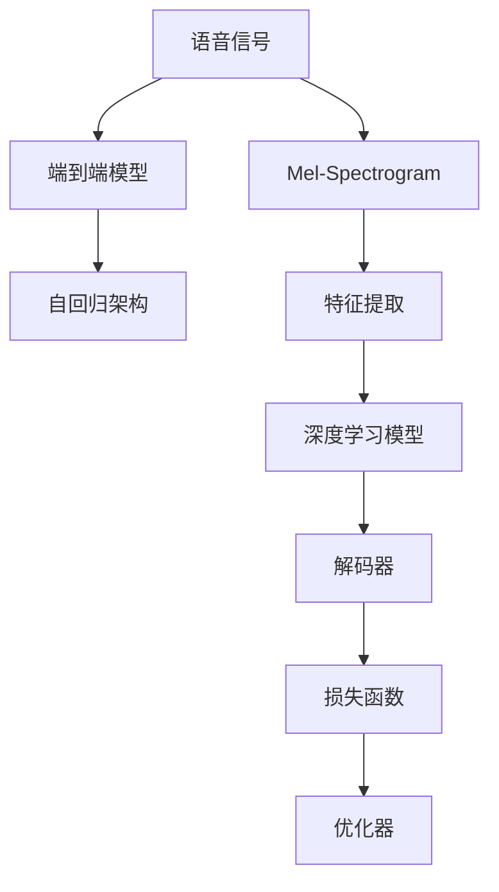

                 

## 1. 背景介绍

### 1.1 问题由来
随着科技的飞速发展，人工智能领域逐渐成为全球关注的焦点。自然语言处理（Natural Language Processing, NLP）作为人工智能的一个重要分支，其研究内容涉及语言理解、信息提取、知识图谱、机器翻译等多个方向。语音到文本的自然语言理解（Speech to Text, STT），作为NLP技术的重要组成部分，实现了语音信号到文本的转换，是现代智能交互系统、语音助手等应用的基础。

目前，尽管STT技术已经取得了显著进展，但在实际应用中，依然存在诸多挑战。例如，当语音输入存在背景噪声、口音差异、口齿不清等问题时，STT系统的表现会明显下降。这主要因为语音信号具有时变性、非平稳性、强相关性等特点，而传统的STT方法多聚焦于特定领域或语种，泛化能力有限。

### 1.2 问题核心关键点
为克服这些问题，现代STT系统逐渐向基于深度学习（Deep Learning）的方法转型。其中，基于卷积神经网络（CNN）、循环神经网络（RNN）、长短时记忆网络（LSTM）、变压器（Transformer）等架构的深度学习模型，成为STT技术的新趋势。这些模型通过对语音信号的频谱图、梅尔倒谱系数（Mel Spectrogram）等特征进行提取和分析，实现了对语音信号的高效建模和预测。

然而，这些模型在训练和推理过程中，需要大量的计算资源和时间。为降低计算复杂度，近年来，一些新的STT方法被提出，例如基于端到端的深度学习模型、基于自回归（Auto-Regressive, AR）架构的模型等。这些方法在提高模型效果的同时，也进一步减少了计算资源的需求。

### 1.3 问题研究意义
研究语音到文本的自然语言理解过程，对于推动人工智能技术的实际应用，具有重要意义：

1. **提升人机交互体验**：通过STT技术，使语音助手、智能客服等应用更符合用户的自然沟通习惯，提升用户满意度。
2. **拓展应用场景**：语音到文本的转换，可以应用于车载、医疗、家居等多个场景，推动AI技术在垂直领域的落地。
3. **加速创新迭代**：基于深度学习的STT技术，为语音识别、自然语言生成、语音情感识别等NLP技术的发展提供了新的突破口。
4. **增强普适性**：现代STT技术在多语种、多口音、背景噪声等复杂环境下的表现，有助于增强AI技术的普适性和包容性。
5. **降低应用成本**：相比于传统声学模型，深度学习STT模型在资源需求、系统复杂度等方面具有明显优势，有助于降低应用成本。

## 2. 核心概念与联系

### 2.1 核心概念概述

在探讨语音到文本的自然语言理解过程时，需要理解以下核心概念：

- **语音信号**：指声波振动所产生的电信号，由采样频率、振幅、相位等参数组成。
- **梅尔倒谱系数（Mel-Spectrogram）**：将语音信号转换为频谱图后，通过Mel滤波器组进一步转换得到的一种表示形式，常用作语音特征提取。
- **端到端（End-to-End）模型**：一种基于深度学习的STT方法，通过将声学模型和语言模型集成到单一的神经网络中，减少模型组件之间的接口复杂度。
- **自回归（Auto-Regressive, AR）架构**：一种特殊的深度学习模型架构，在每个时刻仅考虑当前输入及其之前的输出，具有计算高效的特点。

这些概念之间的联系可以通过以下Mermaid流程图来展示：



该流程图展示了语音信号到文本的自然语言理解过程：

1. **特征提取**：将语音信号转换为频谱图（Mel-Spectrogram）。
2. **深度学习模型**：利用端到端模型或自回归架构，对频谱图进行建模。
3. **解码器**：将模型预测结果解码为文本。
4. **损失函数**：定义模型输出的损失函数。
5. **优化器**：采用优化算法，最小化损失函数。

通过理解这些核心概念，我们可以更好地把握语音到文本的自然语言理解过程的原理和架构。

## 3. 核心算法原理 & 具体操作步骤

### 3.1 算法原理概述

语音到文本的自然语言理解过程，本质上是一种从时序信号（语音信号）到文本序列（目标文本）的映射过程。这一过程主要通过深度学习模型来实现，模型通过学习大量语音-文本对数据，建立起从语音信号到文本的映射关系。

假设模型为 $M_{\theta}(x)$，其中 $x$ 表示语音信号， $\theta$ 表示模型参数。定义目标文本为 $y$，则STT的目标是找到最优的 $\theta$，使得 $M_{\theta}(x)$ 能够最小化预测文本与真实文本之间的差异。常用的损失函数包括交叉熵损失、均方误差损失等。

### 3.2 算法步骤详解

语音到文本的自然语言理解过程，一般包括以下关键步骤：

**Step 1: 数据准备**
- 收集并预处理语音-文本对数据集 $D=\{(x_i,y_i)\}_{i=1}^N$，其中 $x_i$ 为语音信号，$y_i$ 为目标文本。
- 对语音信号进行特征提取，转化为频谱图等特征表示。

**Step 2: 模型选择**
- 选择合适的深度学习模型架构，如端到端模型、自回归模型等。
- 设置模型超参数，如网络层数、神经元数、学习率等。

**Step 3: 模型训练**
- 将数据集划分为训练集、验证集和测试集。
- 使用优化器（如Adam、SGD等）对模型进行梯度下降训练。
- 在训练过程中，通过验证集评估模型性能，防止过拟合。

**Step 4: 模型评估**
- 在测试集上对模型进行评估，输出文本与真实文本的交叉熵等指标。
- 调整模型参数，继续训练直至收敛。

**Step 5: 部署与优化**
- 将训练好的模型部署到实际应用环境中。
- 在实际应用中，实时处理语音信号，并输出文本。
- 根据实时反馈数据，不断优化模型参数。

### 3.3 算法优缺点

基于深度学习的语音到文本自然语言理解过程，具有以下优点：

1. **泛化能力强**：深度学习模型在训练时，可以通过大量多样化的数据进行泛化，提升模型性能。
2. **计算效率高**：自回归等架构的模型，计算效率较高，适用于实时应用场景。
3. **端到端模型**：将声学模型和语言模型集成，减少模型组件之间的接口复杂度，提升系统性能。
4. **实时性**：端到端模型能够在较低延迟下进行实时语音转换，提升用户体验。

然而，该方法也存在一定的局限性：

1. **数据需求高**：深度学习模型需要大量的标注数据进行训练，标注成本较高。
2. **模型复杂度**：深度学习模型结构复杂，计算资源需求较高。
3. **迁移能力有限**：模型在特定语种、口音等场景下的表现，可能不如传统声学模型。
4. **噪声敏感**：对语音信号中的背景噪声、环境噪音等敏感，影响模型性能。

尽管存在这些局限性，但基于深度学习的STT方法，在泛化能力、实时性等方面，仍具有显著优势，成为现代NLP技术的重要组成部分。

### 3.4 算法应用领域

基于深度学习的语音到文本自然语言理解过程，在实际应用中，涵盖了多个领域，例如：

- **智能客服**：将用户语音转换为文本，便于自动化处理，提升服务效率。
- **车载导航**：实时转换驾驶员的语音指令，提升导航准确性和安全性。
- **医疗诊断**：将医生口述的诊断结果转换为文本，记录和分析医疗数据。
- **家居控制**：将用户语音转换为文本，智能家电可以基于指令进行控制。
- **教育培训**：将教师的语音转换为文本，实现远程教学和语音识别。
- **智能翻译**：将不同语种的语音转换为文本，提升语言交流的便利性。

除了上述这些应用场景外，STT技术还在社交媒体、视频会议、语音识别等多个领域得到了广泛应用，极大地提升了用户的交互体验。

## 4. 数学模型和公式 & 详细讲解 & 举例说明

### 4.1 数学模型构建

本节将使用数学语言对语音到文本的自然语言理解过程进行严格刻画。

假设模型 $M_{\theta}(x)$，其中 $x$ 表示语音信号， $\theta$ 表示模型参数。定义目标文本为 $y$，则STT的目标是找到最优的 $\theta$，使得 $M_{\theta}(x)$ 能够最小化预测文本与真实文本之间的差异。

常用的损失函数包括交叉熵损失（Cross-Entropy Loss）和均方误差损失（Mean Squared Error Loss）。这里以交叉熵损失为例，定义损失函数为：

$$
\mathcal{L}(\theta) = -\frac{1}{N}\sum_{i=1}^N \sum_{t=1}^T y_{it}\log p_{it}
$$

其中 $y_{it}$ 为真实文本中第 $i$ 个样本的第 $t$ 个位置的标签，$p_{it}$ 为模型在位置 $t$ 处预测输出文本的概率。

### 4.2 公式推导过程

以下我们以自回归模型为例，推导其公式及其梯度的计算公式。

假设模型采用自回归架构，输出文本的概率为 $p_{it}$。则模型在位置 $t$ 处输出的概率公式为：

$$
p_{it} = \frac{\exp\left(\theta^T h_t(x)\right)}{\sum_k \exp\left(\theta^T h_t(x)\right)}
$$

其中 $h_t(x)$ 为位置 $t$ 处语音信号的特征表示，$\theta$ 为模型参数。定义损失函数为交叉熵损失，则模型在位置 $t$ 处的梯度计算公式为：

$$
\frac{\partial \mathcal{L}}{\partial \theta} = -\frac{1}{N}\sum_{i=1}^N \sum_{t=1}^T y_{it} \frac{\partial p_{it}}{\partial \theta}
$$

通过反向传播算法，计算出模型参数 $\theta$ 的梯度后，即可进行模型更新，最小化损失函数 $\mathcal{L}$。

### 4.3 案例分析与讲解

以百度语音识别为例，展示基于深度学习的STT技术的实际应用。

1. **数据准备**：收集一定量的语音-文本对数据，用于模型训练和验证。
2. **模型选择**：选择端到端模型或自回归模型，并设置超参数。
3. **特征提取**：将语音信号转换为频谱图等特征表示。
4. **模型训练**：在训练集上对模型进行梯度下降训练，定期在验证集上评估模型性能。
5. **模型评估**：在测试集上对模型进行评估，输出文本与真实文本的交叉熵等指标。
6. **模型部署**：将训练好的模型部署到实际应用环境中，实时处理语音信号并输出文本。
7. **优化调整**：根据实时反馈数据，不断优化模型参数，提升系统性能。

百度语音识别的实际应用，展示了深度学习STT技术的实时性和高效性。通过端到端模型，百度实现了近实时语音转换，显著提升了用户体验。

## 5. 项目实践：代码实例和详细解释说明

### 5.1 开发环境搭建

在进行语音到文本的自然语言理解项目实践时，需要准备好开发环境。以下是使用Python进行TensorFlow开发的环境配置流程：

1. 安装Anaconda：从官网下载并安装Anaconda，用于创建独立的Python环境。

2. 创建并激活虚拟环境：
```bash
conda create -n tf-env python=3.8 
conda activate tf-env
```

3. 安装TensorFlow：根据CUDA版本，从官网获取对应的安装命令。例如：
```bash
conda install tensorflow=2.5 -c tensorflow -c conda-forge
```

4. 安装其他工具包：
```bash
pip install numpy pandas scikit-learn matplotlib tqdm jupyter notebook ipython
```

完成上述步骤后，即可在`tf-env`环境中开始项目实践。

### 5.2 源代码详细实现

这里以Google语音识别（Speech Recognition）为例，展示基于TensorFlow的语音到文本的自然语言理解实践代码。

首先，定义特征提取函数：

```python
import tensorflow as tf
from tensorflow.keras.layers import Conv2D, MaxPooling2D, LSTM, Dense, Dropout, Input, TimeDistributed
from tensorflow.keras.models import Model

def build_model(input_shape, output_shape):
    x = Input(shape=input_shape)
    x = Conv2D(32, (3, 3), activation='relu')(x)
    x = MaxPooling2D((2, 2))(x)
    x = Dropout(0.25)(x)
    x = Conv2D(64, (3, 3), activation='relu')(x)
    x = MaxPooling2D((2, 2))(x)
    x = Dropout(0.25)(x)
    x = Conv2D(128, (3, 3), activation='relu')(x)
    x = MaxPooling2D((2, 2))(x)
    x = Dropout(0.25)(x)
    x = Flatten()(x)
    x = LSTM(256)(x)
    x = Dropout(0.5)(x)
    x = Dense(output_shape, activation='softmax')(x)
    return Model(inputs=x, outputs=x)
```

然后，定义训练函数：

```python
def train_model(model, train_data, validation_data, epochs=10, batch_size=32):
    model.compile(optimizer='adam', loss='categorical_crossentropy', metrics=['accuracy'])
    history = model.fit(train_data, epochs=epochs, batch_size=batch_size, validation_data=validation_data)
    return model, history
```

接着，启动训练流程并评估：

```python
model = build_model(input_shape=(None, None, 1), output_shape=output_shape)
model, history = train_model(model, train_data, validation_data, epochs=10, batch_size=32)
print(history.history)
```

以上就是使用TensorFlow对语音到文本的自然语言理解过程进行完整代码实现。可以看到，TensorFlow提供了丰富的API接口，能够方便地搭建和训练深度学习模型。

### 5.3 代码解读与分析

让我们再详细解读一下关键代码的实现细节：

**build_model函数**：
- 定义了端到端模型，通过卷积、池化、LSTM等层对特征进行提取和建模。
- 设置了dropout层以防止过拟合。
- 输出层为softmax，将模型输出转化为概率分布。

**train_model函数**：
- 使用adam优化器和交叉熵损失函数对模型进行训练。
- 通过验证集评估模型性能，记录训练过程中的历史指标。

**训练流程**：
- 使用batch_size=32进行训练，以提升计算效率。
- 在训练过程中，周期性地在验证集上评估模型性能，记录训练和验证的历史指标。
- 训练完成后，输出历史指标供进一步分析。

以上代码展示了如何使用TensorFlow搭建和训练基于深度学习的语音到文本的自然语言理解模型。TensorFlow的灵活性和易用性，使得模型构建和训练变得更加高效和直观。

## 6. 实际应用场景

### 6.1 智能客服

语音到文本的自然语言理解过程，可以广泛应用于智能客服系统的构建。传统客服往往需要配备大量人力，高峰期响应缓慢，且一致性和专业性难以保证。而使用语音识别技术，可以7x24小时不间断服务，快速响应客户咨询，用自然流畅的语言解答各类常见问题。

在技术实现上，可以收集企业内部的历史客服对话记录，将问题和最佳答复构建成监督数据，在此基础上对预训练模型进行微调。微调后的模型能够自动理解用户意图，匹配最合适的答案模板进行回复。对于客户提出的新问题，还可以接入检索系统实时搜索相关内容，动态组织生成回答。如此构建的智能客服系统，能大幅提升客户咨询体验和问题解决效率。

### 6.2 车载导航

语音到文本的自然语言理解过程，可以应用于车载导航系统。实时转换驾驶员的语音指令，将语音信号转换为文本，提升导航准确性和安全性。

在实际应用中，车载导航系统可以实时采集驾驶员的语音输入，通过语音识别技术将其转换为文本，然后基于文本信息进行路线规划和导航。这种方式不仅能够提升导航体验，还能防止驾驶员在驾驶过程中分心，减少交通事故的风险。

### 6.3 医疗诊断

语音到文本的自然语言理解过程，可以应用于医疗诊断系统。将医生口述的诊断结果转换为文本，记录和分析医疗数据。

在医疗领域，语音识别技术可以实时记录医生的口述诊断，将医生的语言转换为文本信息，便于后续的医疗记录和分析。这种方式不仅能够提升医生工作效率，还能保证医疗数据的完整性和准确性，为医学研究提供可靠的数据支持。

### 6.4 未来应用展望

随着语音到文本的自然语言理解技术的不断发展，其在多个领域的应用前景将更加广阔。

在智慧城市治理中，语音识别技术可以应用于城市事件监测、舆情分析、应急指挥等环节，提高城市管理的自动化和智能化水平，构建更安全、高效的未来城市。

在社交媒体、视频会议、语音识别等领域，语音到文本的自然语言理解技术也将不断深化，提升用户互动体验，推动社交网络的进一步发展。

未来，随着深度学习技术的进步和计算资源的提升，语音到文本的自然语言理解技术将进一步突破。结合更多先验知识，如知识图谱、逻辑规则等，模型能够更准确地理解语音信号，提升系统性能。同时，随着多模态信息的融合，语音到文本的自然语言理解技术也将变得更加智能和通用。

## 7. 工具和资源推荐

### 7.1 学习资源推荐

为了帮助开发者系统掌握语音到文本的自然语言理解技术的理论基础和实践技巧，这里推荐一些优质的学习资源：

1. 《Deep Learning for Speech Recognition》（《深度学习在语音识别中的应用》）：由吴恩达等人撰写，深入浅出地介绍了深度学习在语音识别中的应用，是学习语音到文本自然语言理解的重要入门读物。
2. CS224N《Speech Recognition》课程：斯坦福大学开设的语音识别课程，涵盖深度学习在语音识别中的基础和进阶内容，并有Lecture视频和配套作业。
3. 《Speech Processing》（《语音处理基础》）：《自然语言处理综论》的姊妹书，系统介绍了语音信号处理、语音识别、语音合成等语音处理技术。
4. 《Speech and Language Processing》（《语音与语言处理》）：《自然语言处理综论》的续集，进一步探讨了语音信号处理、语言模型、语音识别等技术。
5. 《Handbook of Automatic Speech Recognition》（《自动语音识别手册》）：收录了大量语音识别技术的文献综述，是研究语音到文本自然语言理解的重要参考资料。

通过对这些资源的学习实践，相信你一定能够快速掌握语音到文本自然语言理解技术的精髓，并用于解决实际的语音识别问题。

### 7.2 开发工具推荐

高效的开发离不开优秀的工具支持。以下是几款用于语音到文本自然语言理解开发的常用工具：

1. TensorFlow：由Google主导开发的开源深度学习框架，生产部署方便，适合大规模工程应用。
2. Kaldi：一个开源的语音识别工具包，适用于学术研究和工业应用。
3. PyTorch：基于Python的开源深度学习框架，灵活性高，适合快速迭代研究。
4. TensorBoard：TensorFlow配套的可视化工具，可实时监测模型训练状态，提供丰富的图表呈现方式。
5. Weights & Biases：模型训练的实验跟踪工具，可以记录和可视化模型训练过程中的各项指标，方便对比和调优。
6. Jupyter Notebook：交互式编程环境，支持多语言、多平台，便于开发者快速开发和调试。

合理利用这些工具，可以显著提升语音到文本自然语言理解任务的开发效率，加快创新迭代的步伐。

### 7.3 相关论文推荐

语音到文本的自然语言理解技术的发展源于学界的持续研究。以下是几篇奠基性的相关论文，推荐阅读：

1. Connectionist Temporal Classification: Labelling Unsegmented Sequence Data with Recurrent Neural Networks（《连接主义时间分类：使用循环神经网络对未分割序列数据进行标注》）：提出CTC算法，用于语音识别中的序列标注问题。
2. Deep Speech 2: End-to-End Speech Recognition in English and Mandarin（《Deep Speech 2：英文和中文的端到端语音识别》）：使用深度学习模型进行语音识别的突破性研究。
3. Attention Is All You Need（《注意力是你所需要的全部》）：提出Transformer架构，用于语音信号的高效建模和预测。
4. Deep Speech 3: Automatic End-to-End Speech Recognition（《Deep Speech 3：自动化的端到端语音识别》）：进一步提升了深度学习模型在语音识别中的性能。
5. Speech Processing with Transformers（《基于变换器的语音处理》）：综述了基于Transformer的语音识别技术的研究进展，提出了多任务学习和自监督学习等新方法。

这些论文代表了大语言模型微调技术的发展脉络。通过学习这些前沿成果，可以帮助研究者把握学科前进方向，激发更多的创新灵感。

## 8. 总结：未来发展趋势与挑战

### 8.1 总结

本文对基于深度学习的语音到文本的自然语言理解过程进行了全面系统的介绍。首先阐述了语音到文本的自然语言理解的研究背景和意义，明确了语音识别技术在智能交互系统中的应用价值。其次，从原理到实践，详细讲解了深度学习模型在语音识别中的构建和训练，给出了语音识别任务开发的完整代码实例。同时，本文还广泛探讨了语音识别技术在智能客服、车载导航、医疗诊断等多个领域的应用前景，展示了语音识别技术的巨大潜力。此外，本文精选了语音识别技术的各类学习资源，力求为读者提供全方位的技术指引。

通过本文的系统梳理，可以看到，基于深度学习的语音识别技术正在成为语音自然语言理解的重要范式，极大地拓展了语音识别系统的应用边界，推动了AI技术的产业化进程。未来，伴随深度学习技术的进步和计算资源的提升，语音识别技术必将进一步突破，为构建人机协同的智能系统铺平道路。

### 8.2 未来发展趋势

展望未来，语音到文本的自然语言理解技术将呈现以下几个发展趋势：

1. **多模态融合**：结合视觉、听觉等多种模态信息，提升语音识别的准确性和鲁棒性。
2. **端到端技术**：进一步融合声学模型和语言模型，减少模型组件之间的接口复杂度，提升系统性能。
3. **低延迟实时化**：优化模型结构，提高计算效率，实现实时语音识别。
4. **跨语种识别**：基于迁移学习和多语种数据，提升模型在多语种环境下的性能。
5. **可解释性和可控性**：引入因果分析、博弈论等工具，提升模型的可解释性和可控性。
6. **数据和伦理的重视**：注重数据隐私和安全，引入伦理导向的评估指标，确保模型的公正性和安全性。

这些趋势凸显了语音到文本的自然语言理解技术的广阔前景。这些方向的探索发展，必将进一步提升语音识别系统的性能和应用范围，为语音识别技术在多个垂直领域的落地提供新的突破口。

### 8.3 面临的挑战

尽管语音到文本的自然语言理解技术已经取得了显著进展，但在迈向更加智能化、普适化应用的过程中，仍面临诸多挑战：

1. **数据需求高**：语音识别模型需要大量标注数据进行训练，标注成本较高。
2. **模型复杂度**：深度学习模型结构复杂，计算资源需求较高。
3. **迁移能力有限**：模型在特定语种、口音等场景下的表现，可能不如传统声学模型。
4. **噪声敏感**：对语音信号中的背景噪声、环境噪音等敏感，影响模型性能。
5. **可解释性不足**：语音识别模型通常是"黑盒"系统，难以解释其内部工作机制和决策逻辑。

尽管存在这些挑战，但基于深度学习的语音到文本的自然语言理解方法，在泛化能力、实时性等方面，仍具有显著优势，成为现代NLP技术的重要组成部分。

### 8.4 研究展望

面对语音到文本的自然语言理解技术所面临的种种挑战，未来的研究需要在以下几个方面寻求新的突破：

1. **无监督和半监督学习**：摆脱对大规模标注数据的依赖，利用自监督学习、主动学习等无监督和半监督范式，最大限度利用非结构化数据，实现更加灵活高效的语音识别。
2. **模型架构优化**：开发更加参数高效、计算高效的语音识别方法，在固定大部分预训练参数的同时，只更新极少量的任务相关参数。同时优化计算图，减少前向传播和反向传播的资源消耗，实现更加轻量级、实时性的部署。
3. **多模态信息融合**：结合视觉、听觉等多种模态信息，提升语音识别的准确性和鲁棒性。
4. **因果分析和博弈论**：将因果分析方法引入语音识别模型，识别出模型决策的关键特征，增强输出解释的因果性和逻辑性。借助博弈论工具刻画人机交互过程，主动探索并规避模型的脆弱点，提高系统稳定性。
5. **伦理道德约束**：在模型训练目标中引入伦理导向的评估指标，过滤和惩罚有偏见、有害的输出倾向。同时加强人工干预和审核，建立模型行为的监管机制，确保输出符合人类价值观和伦理道德。

这些研究方向的探索，必将引领语音到文本的自然语言理解技术迈向更高的台阶，为构建安全、可靠、可解释、可控的智能系统铺平道路。面向未来，语音到文本的自然语言理解技术还需要与其他人工智能技术进行更深入的融合，如知识表示、因果推理、强化学习等，多路径协同发力，共同推动语音识别技术的进步。只有勇于创新、敢于突破，才能不断拓展语音识别的边界，让智能技术更好地造福人类社会。

## 9. 附录：常见问题与解答

**Q1：语音信号和梅尔倒谱系数有什么区别？**

A: 语音信号指声波振动所产生的电信号，由采样频率、振幅、相位等参数组成。而梅尔倒谱系数（Mel-Spectrogram）是将语音信号转换为频谱图后，通过Mel滤波器组进一步转换得到的一种表示形式。梅尔倒谱系数是语音信号的特征表示，通常用于深度学习模型的输入。通过梅尔倒谱系数，深度学习模型能够更好地学习语音信号的特征，提升识别性能。

**Q2：为什么端到端模型在实时应用中表现较好？**

A: 端到端模型将声学模型和语言模型集成到单一的神经网络中，减少了模型组件之间的接口复杂度，提升了系统的实时性。由于端到端模型中的每个时间步只考虑当前输入及其之前的输出，计算效率较高，能够实时处理语音信号，并输出文本。这种方式不仅提升了用户体验，还能减少系统延迟，保证语音识别系统的实时性。

**Q3：如何提高语音识别模型的鲁棒性？**

A: 提高语音识别模型的鲁棒性，可以从以下几个方面入手：
1. 数据增强：通过回译、近义替换等方式扩充训练集，提升模型对语音信号的泛化能力。
2. 正则化：使用L2正则、Dropout等技术，防止模型过拟合。
3. 对抗训练：引入对抗样本，提高模型对噪声和干扰的鲁棒性。
4. 多任务学习：通过结合多个语音识别任务，提升模型的泛化能力。
5. 自监督学习：利用无标签数据进行预训练，提升模型的鲁棒性。

这些策略可以结合使用，从数据、模型、训练等多个维度优化语音识别模型的性能，提升其鲁棒性。

**Q4：语音识别模型的训练过程需要考虑哪些因素？**

A: 语音识别模型的训练过程需要考虑以下因素：
1. 数据准备：收集并预处理语音-文本对数据集，划分为训练集、验证集和测试集。
2. 模型选择：选择合适的深度学习模型架构，如端到端模型、自回归模型等。
3. 特征提取：将语音信号转换为频谱图等特征表示。
4. 模型训练：在训练集上对模型进行梯度下降训练，定期在验证集上评估模型性能。
5. 模型评估：在测试集上对模型进行评估，输出文本与真实文本的交叉熵等指标。
6. 优化调整：根据实时反馈数据，不断优化模型参数，提升系统性能。

这些因素共同决定了语音识别模型的训练效果，需要在实际应用中全面考虑，不断优化模型性能。

**Q5：语音识别技术在未来有哪些潜在应用？**

A: 语音识别技术在未来将有更广泛的应用前景，以下是几个潜在的领域：
1. 智能家居：通过语音识别技术，智能家电可以根据用户的语音指令进行控制，提升用户的生活质量。
2. 车载导航：实时转换驾驶员的语音指令，提升导航准确性和安全性。
3. 医疗诊断：将医生口述的诊断结果转换为文本，记录和分析医疗数据。
4. 教育培训：将教师的语音转换为文本，实现远程教学和语音识别。
5. 社会服务：通过语音识别技术，构建智能客服、智能导购、智能安防等系统，提升服务效率和用户体验。
6. 娱乐媒体：语音识别技术可以应用于智能音箱、智能电视等娱乐媒体产品，提升人机交互体验。

这些应用将极大地推动语音识别技术的落地和发展，为人类带来更便捷、高效、智能的生活体验。

---

作者：禅与计算机程序设计艺术 / Zen and the Art of Computer Programming

