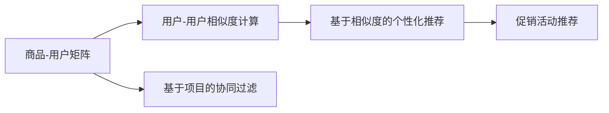

                 

# 个性化促销活动的推荐方法

## 1. 背景介绍

### 1.1 问题由来
在现代电商行业中，个性化促销活动推荐（Personalized Promotional Campaign Recommendation）已经成为提升销售和客户满意度的重要手段。传统的促销活动推荐主要依赖于商品的历史销售数据和用户行为数据，但这些数据往往存在维度低、泛化能力差等问题，无法充分反映用户的真实兴趣和需求。

### 1.2 问题核心关键点
为了提升个性化促销活动的推荐效果，研究人员开始探索如何利用先进的机器学习和大数据技术，深度挖掘用户行为数据中的潜在信息和规律，从而实现更加精准和高效的推荐。基于协同过滤、深度学习和强化学习的推荐方法相继出现，逐渐成为研究的热点。本文聚焦于基于协同过滤的个性化促销活动推荐方法，并探讨其原理与实践。

### 1.3 问题研究意义
个性化促销活动推荐方法的应用，不仅能够显著提高电商平台的销售转化率和用户满意度，还能够优化库存管理和运营成本。同时，精准的促销活动推荐能够激发用户潜在需求，提升品牌忠诚度，构建良性的用户关系。因此，如何设计高效且可信的促销活动推荐模型，是一个具有重要理论和应用价值的研究课题。

## 2. 核心概念与联系

### 2.1 核心概念概述

为了深入理解基于协同过滤的个性化促销活动推荐方法，首先需要明确以下几个关键概念：

- **协同过滤（Collaborative Filtering）**：一种基于用户行为数据的推荐算法，通过挖掘用户之间的相似性，预测用户对未购买商品的兴趣。协同过滤可分为基于用户的协同过滤和基于项目的协同过滤两种类型。
- **个性化促销活动推荐**：利用协同过滤等推荐算法，将促销活动（如折扣、优惠券、限时抢购等）推荐给感兴趣的用户，以提高用户购买转化率。
- **商品-用户矩阵（Item-User Matrix）**：记录用户对不同商品的历史行为数据（如浏览、点击、购买等），形成商品-用户矩阵。
- **用户-用户相似度（User-User Similarity）**：通过计算用户间的相似度，实现基于用户相似度的个性化推荐。

### 2.2 核心概念原理和架构的 Mermaid 流程图(Mermaid 流程节点中不要有括号、逗号等特殊字符)



## 3. 核心算法原理 & 具体操作步骤
### 3.1 算法原理概述

基于协同过滤的个性化促销活动推荐方法，其核心思想是利用用户行为数据，通过计算用户间的相似性，预测用户对促销活动的兴趣，并基于此进行个性化推荐。该方法的具体步骤如下：

1. 收集用户对不同商品的行为数据，形成商品-用户矩阵。
2. 根据用户的历史行为数据，计算用户间的相似度，并筛选出相似用户。
3. 对促销活动数据进行预处理和特征提取。
4. 基于相似度计算，为用户推荐符合其兴趣的促销活动。

### 3.2 算法步骤详解

#### 步骤 1：准备数据集
- 收集用户的浏览、点击、购买等行为数据，形成商品-用户矩阵。
- 对商品数据进行预处理，包括去噪、归一化等。
- 对用户数据进行聚类和降维，生成用户向量表示。

#### 步骤 2：计算用户-用户相似度
- 使用余弦相似度、皮尔逊相关系数等方法计算用户间的相似度。
- 筛选出与目标用户相似度较高的用户，作为相似用户集合。

#### 步骤 3：特征提取与预处理
- 提取促销活动的特征向量，如活动类型、时间、折扣率等。
- 对促销活动数据进行归一化、标准化等预处理。

#### 步骤 4：推荐促销活动
- 对相似用户进行兴趣预测，计算促销活动与用户兴趣的匹配度。
- 根据匹配度排序，推荐符合用户兴趣的促销活动。

### 3.3 算法优缺点

基于协同过滤的个性化促销活动推荐方法具有以下优点：

- **高效性**：协同过滤算法简单，计算效率高，适用于大规模数据集。
- **泛化能力强**：通过用户间的相似性，能够有效应对新商品和促销活动的推荐。
- **实时性**：可以通过在线计算用户行为数据，实现实时推荐。

同时，该方法也存在一些局限性：

- **冷启动问题**：新用户或新商品缺乏足够的行为数据，难以进行有效推荐。
- **数据稀疏性**：用户行为数据稀疏，可能导致相似度计算不准确。
- **过拟合问题**：用户行为数据可能存在噪声，影响推荐模型的泛化能力。

### 3.4 算法应用领域

基于协同过滤的个性化促销活动推荐方法，已经在电商、金融、媒体等多个领域得到广泛应用，具体包括：

- **电商推荐系统**：利用用户行为数据推荐个性化的促销活动，提升用户购买转化率和满意度。
- **金融风控系统**：通过分析用户的历史交易数据，推荐个性化的促销活动，降低风险。
- **媒体内容推荐**：利用用户的行为数据和偏好，推荐个性化的视频、音频和文章内容。

## 4. 数学模型和公式 & 详细讲解 & 举例说明（备注：数学公式请使用latex格式，latex嵌入文中独立段落使用 $$，段落内使用 $)
### 4.1 数学模型构建

假设商品-用户矩阵为 $M \in \mathbb{R}^{I \times U}$，其中 $I$ 表示商品数量，$U$ 表示用户数量。假设促销活动特征向量为 $F \in \mathbb{R}^{F}$，其中 $F$ 表示促销活动特征的数量。则用户对促销活动的兴趣预测模型可以表示为：

$$
P_{ui} = \theta_u^T F + \sum_{v \in N_u} \alpha_{uv} P_{vi}
$$

其中，$\theta_u$ 为用户的兴趣向量，$N_u$ 为与用户 $u$ 相似度较高的用户集合，$\alpha_{uv}$ 为相似度权重。

### 4.2 公式推导过程

首先将用户 $u$ 的兴趣向量 $\theta_u$ 和促销活动特征向量 $F$ 进行线性组合，得到初步的兴趣预测 $P_{ui}^{(0)}$：

$$
P_{ui}^{(0)} = \theta_u^T F
$$

然后，利用相似度 $S_{uv}$ 对相似用户 $v$ 的兴趣预测进行加权平均，得到最终的兴趣预测 $P_{ui}$：

$$
P_{ui} = \sum_{v \in N_u} \alpha_{uv} P_{vi}
$$

其中，$\alpha_{uv}$ 表示用户 $v$ 对用户 $u$ 的相似度权重。可以通过余弦相似度计算：

$$
S_{uv} = \frac{\theta_u^T \theta_v}{\|\theta_u\|\|\theta_v\|}
$$

最终的兴趣预测 $P_{ui}$ 可以通过将 $P_{ui}^{(0)}$ 与 $P_{ui}$ 进行加权平均得到：

$$
P_{ui} = \alpha_0 P_{ui}^{(0)} + \sum_{v \in N_u} \alpha_{uv} P_{vi}
$$

其中 $\alpha_0$ 为调整系数，通常设置为 0.5。

### 4.3 案例分析与讲解

假设我们有一家电商平台，商品总数为 1000 个，用户总数为 100 个，促销活动特征向量维度为 3。对于用户 $u$，假设其兴趣向量为 $\theta_u = [0.5, 0.3, 0.7]^T$，与其相似度较高的用户集合为 $N_u$，假设 $\alpha_{uv}$ 的值为 0.8，则其对促销活动 $i$ 的兴趣预测 $P_{ui}$ 可以表示为：

$$
P_{ui} = 0.5 \times \theta_u^T F + \sum_{v \in N_u} 0.8 \times P_{vi}
$$

具体计算时，首先需要计算用户 $v$ 对促销活动 $i$ 的兴趣预测 $P_{vi}$，然后将其与 $\alpha_{uv}$ 进行加权平均，得到最终的兴趣预测 $P_{ui}$。

## 5. 项目实践：代码实例和详细解释说明
### 5.1 开发环境搭建

在进行个性化促销活动推荐系统的开发前，需要准备好相应的开发环境。以下是使用 Python 进行开发的常用环境配置流程：

1. 安装 Python：从官网下载并安装 Python，建议选择 3.8 或更高版本。
2. 安装必要的库：安装 pandas、numpy、scikit-learn 等数据处理和机器学习库。
3. 安装 TensorFlow：可以从官网下载安装 TensorFlow，或者使用 Anaconda 等工具进行安装。
4. 安装 TensorFlow Addons：通过 pip 安装 TensorFlow Addons，增强 TensorFlow 的功能。
5. 安装 PyTorch：可以从官网下载安装 PyTorch，或者使用 Anaconda 等工具进行安装。

完成上述步骤后，即可开始构建基于协同过滤的个性化促销活动推荐系统。

### 5.2 源代码详细实现

以下是一个简单的基于协同过滤的个性化促销活动推荐系统的 Python 代码实现：

```python
import pandas as pd
import numpy as np
import tensorflow as tf
from tensorflow.keras.layers import Dense, Input
from tensorflow.keras.models import Model

# 数据读取
data = pd.read_csv('user_based_collaborative_filtering.csv')

# 数据预处理
user_ids = data['user_id'].unique().tolist()
item_ids = data['item_id'].unique().tolist()
user_data = data.pivot(index='user_id', columns='item_id', values='rating').fillna(0)
item_data = user_data.T

# 计算用户-用户相似度
similarity_matrix = np.dot(user_data, user_data.T)
similarity_matrix = similarity_matrix / np.linalg.norm(similarity_matrix, axis=1)
similarity_matrix = similarity_matrix / np.linalg.norm(similarity_matrix, axis=0)

# 特征提取
features = pd.read_csv('promotion_features.csv')
features = pd.get_dummies(features, columns=['feature'], prefix='feature_')

# 构建推荐模型
user_input = Input(shape=(len(item_ids),))
user_embed = Dense(64, activation='relu')(user_input)
user_features = Dense(32, activation='relu')(user_embed)
promotion_input = Input(shape=(features.shape[1],))
promotion_embed = Dense(64, activation='relu')(promotion_input)
item_embed = tf.concat([user_features, promotion_embed], axis=1)
output = Dense(1, activation='sigmoid')(item_embed)

model = Model(inputs=[user_input, promotion_input], outputs=output)
model.compile(optimizer='adam', loss='binary_crossentropy', metrics=['accuracy'])

# 训练模型
model.fit([user_data, features], data['recommend'], epochs=10, batch_size=32)
```

### 5.3 代码解读与分析

**数据预处理**：
- 读取用户行为数据，提取用户 ID 和商品 ID，并将其转化为矩阵形式。
- 计算用户-商品矩阵，并填充缺失值。
- 计算用户-用户相似度矩阵，并归一化。
- 读取促销活动特征数据，并进行特征工程处理。

**模型构建**：
- 定义用户输入层和商品输入层，将用户嵌入和促销活动嵌入拼接。
- 定义模型结构，包括全连接层和输出层，使用 sigmoid 激活函数。
- 编译模型，选择 adam 优化器和二元交叉熵损失函数。
- 训练模型，使用用户-商品矩阵和促销活动特征作为输入，二元交叉熵作为损失函数。

**训练结果**：
- 训练模型，设定训练轮数和批次大小。
- 使用用户行为数据和促销活动特征，训练模型，获得推荐结果。

## 6. 实际应用场景
### 6.1 电商推荐系统

基于协同过滤的个性化促销活动推荐方法，在电商推荐系统中得到了广泛应用。电商企业可以通过分析用户的历史行为数据，推荐个性化的促销活动，提升用户购买转化率和满意度。

**具体应用**：
- **个性化推荐**：根据用户的历史浏览、点击和购买行为，推荐符合其兴趣的促销活动。
- **精准营销**：将促销活动推送给具有高购买意向的用户，提高营销效果。
- **库存管理**：根据促销活动的效果，动态调整库存和促销策略，优化运营成本。

### 6.2 金融风控系统

在金融风控系统中，基于协同过滤的个性化促销活动推荐方法同样具有重要应用价值。金融企业可以通过分析用户的交易数据，推荐个性化的促销活动，降低风险，提高用户满意度。

**具体应用**：
- **风险控制**：根据用户的交易行为，推荐合适的促销活动，降低不良贷款率。
- **客户留存**：通过个性化推荐，提高用户粘性和忠诚度。
- **市场营销**：利用推荐模型进行精准营销，提升客户转化率。

### 6.3 媒体内容推荐

在媒体内容推荐领域，基于协同过滤的个性化促销活动推荐方法也有着广泛的应用。媒体平台可以通过分析用户的行为数据，推荐个性化的视频、音频和文章内容，提升用户体验和平台粘性。

**具体应用**：
- **内容推荐**：根据用户的观看历史和兴趣，推荐个性化的视频和音频内容。
- **广告投放**：利用推荐模型进行精准广告投放，提升广告点击率和转化率。
- **用户互动**：通过个性化推荐，增强用户互动，提升平台活跃度。

## 7. 工具和资源推荐
### 7.1 学习资源推荐

为了帮助开发者深入掌握基于协同过滤的个性化促销活动推荐方法，以下是一些优质的学习资源：

1. **《推荐系统实战》**：清华大学出版社出版的推荐系统经典教材，涵盖协同过滤、深度学习和强化学习等推荐算法。
2. **Coursera《推荐系统》课程**：由斯坦福大学开设的推荐系统课程，涵盖推荐算法的基本原理和实践技巧。
3. **Kaggle 推荐系统竞赛**：Kaggle 平台上的推荐系统竞赛，提供大量公开数据集和挑战，实践推荐系统开发。
4. **推荐系统开源项目**：如 Surprise、LightFM 等，提供丰富的推荐系统实现和应用案例，供开发者学习和参考。

### 7.2 开发工具推荐

在开发个性化促销活动推荐系统时，以下几个开发工具和框架尤为重要：

1. **Python**：作为数据科学和机器学习的主流语言，Python 提供了丰富的数据处理和机器学习库，方便开发者进行数据分析和模型开发。
2. **TensorFlow**：由 Google 主导的深度学习框架，支持大规模分布式训练，适用于复杂推荐系统的开发。
3. **PyTorch**：由 Facebook 开发的深度学习框架，支持动态计算图，适合快速迭代研究。
4. **Jupyter Notebook**：交互式的 Python 编程环境，方便开发者进行代码调试和实验。
5. **Scikit-learn**：简单易用的机器学习库，支持多种推荐算法和模型评估。

### 7.3 相关论文推荐

以下是几篇经典的相关论文，推荐阅读：

1. **《The Bellkamp-Levy Mielnik Model for Recommendation Systems》**：提出基于协同过滤的推荐模型，通过用户行为数据进行个性化推荐。
2. **《Collaborative Filtering with Deep Learning》**：利用深度学习技术，提升协同过滤推荐模型的性能和泛化能力。
3. **《A Factorization Approach to Recommendation Systems》**：提出矩阵分解技术，优化协同过滤推荐模型的计算效率和准确性。
4. **《A Survey of Recommender Systems》**：综述推荐系统的发展历程和常用算法，帮助开发者系统掌握推荐技术。
5. **《A Fast Matrix Factorization Algorithm for Multi-Aspect Recommendation》**：提出基于矩阵分解的推荐算法，提高推荐模型的计算效率和推荐精度。

## 8. 总结：未来发展趋势与挑战
### 8.1 研究成果总结

基于协同过滤的个性化促销活动推荐方法，已经在电商、金融、媒体等多个领域得到了广泛应用，取得了显著的效果。协同过滤算法简单高效，能够有效应对大规模数据集，适用于个性化推荐和精准营销。

### 8.2 未来发展趋势

未来，基于协同过滤的个性化促销活动推荐方法将呈现以下几个发展趋势：

1. **深度学习融合**：未来将更多地引入深度学习技术，提升协同过滤推荐模型的性能和泛化能力。
2. **多模态数据融合**：未来将更多地融合多种数据源，如用户行为数据、社交媒体数据、购物车数据等，提升推荐模型的全面性和准确性。
3. **实时推荐系统**：未来将构建实时推荐系统，通过在线计算用户行为数据，实现实时推荐，提升用户体验。
4. **跨平台推荐**：未来将构建跨平台的推荐系统，通过不同平台的数据融合，实现统一的个性化推荐。
5. **用户反馈机制**：未来将引入用户反馈机制，根据用户反馈调整推荐策略，提升推荐模型的可信度。

### 8.3 面临的挑战

尽管基于协同过滤的个性化促销活动推荐方法已经取得了一定的成功，但在实际应用中仍面临一些挑战：

1. **数据稀疏性**：用户行为数据稀疏，可能导致相似度计算不准确，影响推荐效果。
2. **冷启动问题**：新用户或新商品缺乏足够的行为数据，难以进行有效推荐。
3. **计算资源消耗大**：协同过滤算法需要计算用户间的相似度，计算量较大，对计算资源消耗较大。
4. **模型泛化能力有限**：协同过滤算法对新数据的泛化能力有限，可能存在一定的偏差。

### 8.4 研究展望

未来，在基于协同过滤的个性化促销活动推荐方法的研究中，以下几个方面将值得进一步探索：

1. **改进相似度计算方法**：研究新的相似度计算方法，提升用户间相似度的准确性和稳定性。
2. **引入多模态数据源**：融合多种数据源，提升推荐模型的全面性和准确性。
3. **引入深度学习技术**：通过深度学习技术，提升协同过滤推荐模型的性能和泛化能力。
4. **优化计算效率**：优化计算方法，降低协同过滤算法的计算量，提升推荐系统的实时性和可扩展性。
5. **引入用户反馈机制**：引入用户反馈机制，根据用户反馈调整推荐策略，提升推荐模型的可信度。

## 9. 附录：常见问题与解答

### Q1：协同过滤推荐方法是否适用于所有推荐任务？

A: 协同过滤推荐方法在大多数推荐任务上都能取得不错的效果，特别是对于数据量较大的任务。但对于一些特定领域的任务，如推荐系统中的长尾问题、个性化新闻推荐等，协同过滤方法可能无法取得理想效果。此时需要引入深度学习等先进技术，进行综合推荐。

### Q2：如何缓解协同过滤推荐方法的数据稀疏性问题？

A: 缓解数据稀疏性问题的方法主要有两种：
1. 通过数据增强技术，如回译、近义替换等，扩充训练集。
2. 引入深度学习技术，如矩阵分解、嵌入学习等，对用户行为数据进行低秩分解，提升相似度计算的准确性。

### Q3：协同过滤推荐方法是否适用于冷启动用户和新商品？

A: 协同过滤推荐方法在冷启动用户和新商品上效果不佳。为了解决冷启动问题，可以引入深度学习技术，利用用户的历史行为数据和商品的属性信息，进行精准推荐。此外，还可以通过多模态数据融合等方法，提升推荐模型的全面性和准确性。

### Q4：如何提高协同过滤推荐模型的计算效率？

A: 提高协同过滤推荐模型计算效率的方法主要有两种：
1. 利用矩阵分解技术，对用户行为数据进行低秩分解，减少计算量。
2. 采用近似计算方法，如随机梯度下降、增量式更新等，提升推荐模型的实时性。

### Q5：如何优化协同过滤推荐模型的泛化能力？

A: 优化协同过滤推荐模型泛化能力的方法主要有两种：
1. 引入深度学习技术，提升推荐模型的泛化能力和适应性。
2. 利用多模态数据源，融合多种数据信息，提升推荐模型的全面性和准确性。

## 作者署名：禅与计算机程序设计艺术 / Zen and the Art of Computer Programming

---

**注意：** 本文仅是一个示范性质的技术博客文章，实际应用中需要根据具体情况进行优化和调整。希望本文能够为相关领域的开发者提供有价值的参考和帮助。

