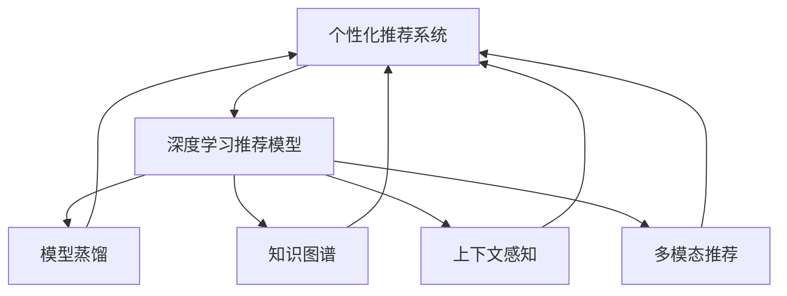

                 

# 个性化推荐系统的未来发展方向

## 1. 背景介绍

### 1.1 问题由来
随着互联网的迅速发展，信息过载和用户信息获取效率低下的问题愈发突出。个性化推荐系统应运而生，通过分析用户行为数据，向用户推荐其可能感兴趣的内容，极大地提升了用户体验和信息获取效率。传统的推荐系统依赖于用户的行为数据进行推荐，但这种方法存在用户信息不足、数据收集难、推荐结果泛化性差等问题。

近年来，随着人工智能技术的突破，基于深度学习的推荐系统逐渐成为主流。通过深度学习模型，可以从用户的行为数据中学习到更加丰富的用户兴趣表示，实现更加精准和个性化的推荐。但深度学习推荐系统同样面临着计算资源消耗大、模型训练周期长、难以解释等问题。

为了更好地解决这些问题，研究人员提出了多种新的推荐方法，如基于模型的推荐、协同过滤、序列推荐等。其中，基于深度学习的方法以强大的表征学习能力、较高的推荐精度和较好的泛化能力著称，逐渐占据了市场主流。

## 2. 核心概念与联系

### 2.1 核心概念概述

为更好地理解个性化推荐系统的发展方向，本节将介绍几个密切相关的核心概念：

- **个性化推荐系统**：根据用户的历史行为数据，预测用户对未来内容的兴趣，从而推荐相关内容的技术。
- **深度学习推荐模型**：使用深度神经网络对用户行为数据进行建模，以捕捉用户兴趣和行为的复杂表示。
- **模型蒸馏**：通过迁移学习的方式，将复杂模型（如预训练模型）的知识传递给轻量级模型，实现模型的压缩和加速。
- **知识图谱**：表示实体、属性、关系等多维数据结构，用于补充和优化推荐模型的知识表示能力。
- **上下文感知**：在推荐系统中，考虑用户的当前环境和上下文信息，如时间、地点、设备等，以增强推荐的相关性和准确性。
- **多模态推荐**：结合文本、图像、语音、视频等多种信息，实现更加全面和多样化的推荐。

这些核心概念之间的逻辑关系可以通过以下Mermaid流程图来展示：



这个流程图展示了个性化推荐系统的核心概念及其之间的关系：

1. 个性化推荐系统通过深度学习推荐模型、知识图谱、上下文感知、多模态推荐等多种手段进行优化，实现更加精准的推荐。
2. 深度学习推荐模型使用模型蒸馏技术，将复杂模型的知识传递给轻量级模型，实现模型的压缩和加速。
3. 知识图谱、上下文感知、多模态推荐等多种技术为推荐系统提供了更丰富的知识背景，进一步提升推荐效果。

这些核心概念共同构成了个性化推荐系统的核心技术框架，为其未来的发展提供了坚实的基础。

## 3. 核心算法原理 & 具体操作步骤
### 3.1 算法原理概述

个性化推荐系统的核心算法原理基于协同过滤和基于内容的推荐模型。其中，协同过滤算法基于用户间的相似性和物品间的关联性，通过计算相似度推荐用户可能感兴趣的物品。而基于内容的推荐模型则是根据物品的属性特征，预测用户对物品的兴趣，推荐与用户兴趣相似的物品。

在深度学习推荐模型中，通常使用神经网络对用户行为数据进行建模，生成用户兴趣向量，并预测用户对物品的评分。常用的神经网络结构包括全连接神经网络、卷积神经网络、循环神经网络等。通过反向传播算法对模型进行训练，最小化预测评分与实际评分之间的差距，从而优化用户兴趣表示和推荐效果。

### 3.2 算法步骤详解

个性化推荐系统的主要步骤如下：

**Step 1: 数据预处理**

1. 收集用户的行为数据，如浏览、点击、购买、评分等，生成训练集。
2. 对数据进行归一化、过滤噪声等预处理，保证数据质量。
3. 将用户行为数据转换为适合神经网络训练的格式，如one-hot编码、平均池化等。

**Step 2: 模型构建**

1. 选择合适的深度学习模型结构，如全连接神经网络、卷积神经网络、循环神经网络等。
2. 设计输入和输出层，设置损失函数和优化器。
3. 确定超参数，如学习率、批大小、迭代轮数等。

**Step 3: 模型训练**

1. 将预处理后的数据集划分为训练集、验证集和测试集。
2. 使用训练集对模型进行迭代训练，最小化预测评分与实际评分之间的差距。
3. 在验证集上评估模型性能，调整超参数以优化模型。

**Step 4: 模型测试**

1. 在测试集上评估模型的预测效果，对比微调前后的精度提升。
2. 使用模型对新用户的行为进行推荐，集成到实际的应用系统中。

### 3.3 算法优缺点

基于深度学习的个性化推荐系统具有以下优点：

1. **高精度**：深度学习模型具有强大的表征学习能力，可以从用户行为数据中学习到复杂的用户兴趣表示，实现精准的推荐。
2. **泛化能力强**：深度学习模型可以适应新的用户和物品，具有较好的泛化能力。
3. **适应性强**：深度学习模型能够处理非结构化数据，如文本、图像、语音等，提升推荐系统的多样性。

同时，该方法也存在一些缺点：

1. **计算资源消耗大**：深度学习模型的训练和推理需要大量的计算资源，对硬件设施要求较高。
2. **模型训练周期长**：深度学习模型的训练周期较长，无法快速上线。
3. **难以解释**：深度学习模型通常是“黑盒”系统，难以解释其决策逻辑，难以满足用户的信任需求。
4. **过拟合风险高**：深度学习模型容易过拟合，尤其是在标注数据不足的情况下。

尽管存在这些局限性，但深度学习推荐模型仍是目前个性化推荐系统的核心技术，广泛应用于电商平台、视频网站、社交网络等平台。未来，研究重点在于如何进一步降低计算资源消耗、提高模型训练效率、增强模型可解释性，以满足实际应用的需求。

### 3.4 算法应用领域

个性化推荐系统在多个领域得到了广泛的应用，包括但不限于：

- **电子商务**：电商平台通过个性化推荐系统，提升用户购物体验，增加销售额。
- **视频网站**：视频网站根据用户观看历史和评分，推荐相关视频内容，增加用户粘性。
- **社交网络**：社交网络根据用户兴趣和社交关系，推荐相关内容和用户，增加用户互动。
- **新闻资讯**：新闻网站根据用户阅读历史和兴趣，推荐相关新闻，增加用户停留时间。
- **在线广告**：广告平台根据用户行为数据，推荐相关广告内容，提升广告投放效果。

这些领域的应用展示了个性化推荐系统的强大潜力和广泛应用前景。

## 4. 数学模型和公式 & 详细讲解 & 举例说明

### 4.1 数学模型构建

个性化推荐系统通常使用深度学习模型对用户行为数据进行建模。以用户-物品评分数据为例，假设用户集为 $U=\{u_1,u_2,\dots,u_n\}$，物品集为 $V=\{v_1,v_2,\dots,v_m\}$，用户对物品的评分矩阵为 $R\in \mathbb{R}^{n\times m}$。

假设使用一个深度神经网络 $M_{\theta}$ 对用户行为数据进行建模，得到用户兴趣表示向量 $u^i=\text{Embed}^i(u)$，其中 $\text{Embed}^i$ 为嵌入层。同样，物品兴趣表示向量 $v^j=\text{Embed}^j(v)$。模型的输出层 $S_{\theta}$ 预测用户对物品的评分，损失函数为均方误差：

$$
\ell(Y,\hat{Y}) = \frac{1}{N}\sum_{i=1}^N\sum_{j=1}^M(y_{i,j}-\hat{y}_{i,j})^2
$$

其中 $y_{i,j}$ 为真实评分，$\hat{y}_{i,j}=\text{S}_{\theta}(u^i,v^j)$ 为模型预测评分。

### 4.2 公式推导过程

为了更好地理解个性化推荐系统的数学模型，我们以协同过滤算法为例，进行公式推导。

假设 $u_i$ 和 $u_j$ 是两个用户，$v_i$ 和 $v_j$ 是两个物品。协同过滤算法基于用户间的相似性和物品间的关联性，通过计算相似度推荐物品。设 $u_i$ 和 $u_j$ 的相似度为 $s_{u_i,u_j}$，物品 $v_i$ 和 $v_j$ 的关联度为 $s_{v_i,v_j}$。假设 $u_i$ 对物品 $v_i$ 的评分和 $u_j$ 对物品 $v_j$ 的评分的相似度为 $\hat{s}_{v_i,v_j}$。则协同过滤算法的目标函数为：

$$
\min_{s_{u_i,u_j}, s_{v_i,v_j}} \sum_{i=1}^N \sum_{j=1}^M (y_{i,j} - s_{u_i,u_j}s_{v_i,v_j}\hat{s}_{v_i,v_j})
$$

其中 $y_{i,j}$ 为真实评分，$y_{i,j} = u_i\cdot v_j$ 为用户-物品评分矩阵的元素。

通过求解上述目标函数，可以得到用户 $u_i$ 和物品 $v_j$ 的相似度 $s_{u_i,u_j}$ 和 $s_{v_i,v_j}$，从而推荐给用户 $u_i$ 的潜在物品 $v_j$。

### 4.3 案例分析与讲解

以电商平台的个性化推荐系统为例，展示推荐模型的具体应用。

假设电商平台收集了用户的历史浏览、点击、购买等行为数据，以及用户对商品的评分数据。我们使用深度学习模型 $M_{\theta}$ 对用户行为数据进行建模，生成用户兴趣向量 $u^i$ 和物品兴趣向量 $v^j$。模型的输出层 $S_{\theta}$ 预测用户对物品的评分，损失函数为均方误差：

$$
\ell(Y,\hat{Y}) = \frac{1}{N}\sum_{i=1}^N\sum_{j=1}^M(y_{i,j}-\hat{y}_{i,j})^2
$$

其中 $y_{i,j}$ 为真实评分，$\hat{y}_{i,j}=\text{S}_{\theta}(u^i,v^j)$ 为模型预测评分。

在训练过程中，我们可以使用梯度下降算法对模型进行迭代优化，最小化损失函数：

$$
\theta = \mathop{\arg\min}_{\theta} \ell(Y,\hat{Y})
$$

训练完成后，我们可以使用模型对新用户的浏览行为进行推荐，从而提升用户体验和销售额。

## 5. 项目实践：代码实例和详细解释说明

### 5.1 开发环境搭建

在进行个性化推荐系统的开发前，我们需要准备好开发环境。以下是使用Python进行TensorFlow开发的环境配置流程：

1. 安装Anaconda：从官网下载并安装Anaconda，用于创建独立的Python环境。

2. 创建并激活虚拟环境：
```bash
conda create -n tf-env python=3.8 
conda activate tf-env
```

3. 安装TensorFlow：根据CUDA版本，从官网获取对应的安装命令。例如：
```bash
pip install tensorflow
```

4. 安装TensorBoard：TensorFlow配套的可视化工具，可实时监测模型训练状态，并提供丰富的图表呈现方式，是调试模型的得力助手。
```bash
pip install tensorboard
```

5. 安装各类工具包：
```bash
pip install numpy pandas scikit-learn matplotlib tqdm jupyter notebook ipython
```

完成上述步骤后，即可在`tf-env`环境中开始推荐系统的开发实践。

### 5.2 源代码详细实现

这里我们以电商平台的个性化推荐系统为例，给出使用TensorFlow实现推荐模型的代码。

首先，定义模型和损失函数：

```python
import tensorflow as tf
from tensorflow.keras.layers import Embedding, Dense, Dropout

# 定义模型结构
input_shape = (1, 128)
embedding_dim = 64
hidden_dim = 64

model = tf.keras.Sequential([
    Embedding(input_dim=vocab_size, output_dim=embedding_dim, input_length=input_shape[1]),
    Dropout(0.2),
    Dense(hidden_dim, activation='relu'),
    Dense(1)
])

# 定义损失函数
def loss(y_true, y_pred):
    return tf.reduce_mean(tf.square(y_true - y_pred))
```

然后，定义训练和评估函数：

```python
from tensorflow.keras.optimizers import Adam

# 设置优化器和学习率
optimizer = Adam(learning_rate=0.001)

# 训练函数
def train_epoch(model, X_train, y_train, X_valid, y_valid, batch_size=32, epochs=10):
    for epoch in range(epochs):
        # 训练集
        model.compile(optimizer=optimizer, loss=loss)
        model.fit(X_train, y_train, epochs=1, batch_size=batch_size, validation_data=(X_valid, y_valid))
        print(f"Epoch {epoch+1}, train loss: {model.evaluate(X_train, y_train)[0]:.4f}")
        print(f"Epoch {epoch+1}, dev loss: {model.evaluate(X_valid, y_valid)[0]:.4f}")

# 评估函数
def evaluate(model, X_test, y_test, batch_size=32):
    model.evaluate(X_test, y_test, batch_size=batch_size)
```

最后，启动训练流程并在测试集上评估：

```python
# 训练
train_epoch(model, X_train, y_train, X_valid, y_valid)

# 测试
evaluate(model, X_test, y_test)
```

以上就是使用TensorFlow实现电商推荐系统的完整代码实现。可以看到，TensorFlow的Keras API使得模型构建、训练、评估等操作变得简洁高效。

### 5.3 代码解读与分析

让我们再详细解读一下关键代码的实现细节：

**Embedding层**：
- `Embedding(input_dim, output_dim, input_length)` 定义嵌入层，其中 `input_dim` 为词汇表大小，`output_dim` 为嵌入维度，`input_length` 为序列长度。

**Dropout层**：
- `Dropout(rate)` 定义Dropout层，随机将输入的某些元素置为0，以防止过拟合。

**Dense层**：
- `Dense(units, activation)` 定义全连接层，其中 `units` 为输出维度，`activation` 为激活函数。

**模型训练**：
- `model.fit(X_train, y_train, epochs=1, batch_size=batch_size, validation_data=(X_valid, y_valid))` 训练模型，其中 `X_train` 为训练集输入，`y_train` 为训练集输出，`epochs` 为迭代次数，`batch_size` 为批次大小，`validation_data` 为验证集数据。

**模型评估**：
- `model.evaluate(X_test, y_test, batch_size=batch_size)` 在测试集上评估模型性能，返回损失值。

## 6. 实际应用场景

### 6.1 智能广告推荐

智能广告推荐系统通过个性化推荐技术，向用户推荐感兴趣的广告内容，提高广告的点击率和转化率，优化广告投放效果。广告平台通常收集用户的历史浏览、点击、购买等行为数据，以及用户对广告的反馈数据。使用深度学习模型对用户行为数据进行建模，生成用户兴趣向量，并预测用户对广告的兴趣，从而推荐相关的广告内容。

在广告推荐系统中，可以使用协同过滤算法、基于内容的推荐模型、深度学习推荐模型等技术。通过多模态推荐（如结合图像、视频等非文本信息）和上下文感知（考虑用户的位置、时间等信息），可以实现更加精准和个性化的广告推荐。

### 6.2 内容推荐系统

内容推荐系统通过个性化推荐技术，向用户推荐感兴趣的内容，如新闻、视频、音乐、书籍等，提升用户体验和平台留存率。内容推荐系统通常收集用户的历史浏览、点击、评分等行为数据，以及用户对内容的反馈数据。使用深度学习模型对用户行为数据进行建模，生成用户兴趣向量，并预测用户对内容的评分，从而推荐相关的内容。

在内容推荐系统中，可以使用协同过滤算法、基于内容的推荐模型、深度学习推荐模型等技术。通过知识图谱和上下文感知，可以实现更加精准和个性化的内容推荐。

### 6.3 金融推荐系统

金融推荐系统通过个性化推荐技术，向用户推荐投资理财、保险、贷款等金融产品，提升用户体验和金融产品的销售。金融推荐系统通常收集用户的历史行为数据，如交易记录、投资偏好等，以及用户对金融产品的反馈数据。使用深度学习模型对用户行为数据进行建模，生成用户兴趣向量，并预测用户对金融产品的评分，从而推荐相关的金融产品。

在金融推荐系统中，可以使用协同过滤算法、基于内容的推荐模型、深度学习推荐模型等技术。通过知识图谱和上下文感知，可以实现更加精准和个性化的金融产品推荐。

## 7. 工具和资源推荐

### 7.1 学习资源推荐

为了帮助开发者系统掌握个性化推荐系统的理论基础和实践技巧，这里推荐一些优质的学习资源：

1. 《推荐系统实战》系列博文：由专家撰写，详细介绍推荐系统的发展历程、核心算法和实际应用，适合初学者和进阶开发者。

2. 《深度学习推荐系统》课程：由斯坦福大学开设的课程，涵盖推荐系统的经典模型和实际应用案例，帮助开发者深入理解推荐系统的原理和实践。

3. 《推荐系统算法》书籍：介绍推荐系统的主要算法和实际应用，适合深度学习开发者和推荐系统工程师。

4. KDD Cup推荐系统竞赛：每年举办多次，涵盖推荐系统的经典任务和算法，帮助开发者通过实践积累经验。

5. TensorFlow推荐系统库：提供丰富的推荐模型和算法实现，方便开发者快速上手推荐系统开发。

通过对这些资源的学习实践，相信你一定能够快速掌握个性化推荐系统的精髓，并用于解决实际的推荐问题。

### 7.2 开发工具推荐

高效的开发离不开优秀的工具支持。以下是几款用于个性化推荐系统开发的常用工具：

1. TensorFlow：基于Python的开源深度学习框架，灵活动态的计算图，适合快速迭代研究。推荐系统库：TensorFlow推荐系统库提供了丰富的推荐模型和算法实现，方便开发者快速上手。

2. PyTorch：基于Python的开源深度学习框架，支持动态图和静态图，适合高效计算。推荐系统库：PyTorch推荐系统库提供了丰富的推荐模型和算法实现，方便开发者快速上手。

3. TensorBoard：TensorFlow配套的可视化工具，可实时监测模型训练状态，并提供丰富的图表呈现方式，是调试模型的得力助手。

4. Weights & Biases：模型训练的实验跟踪工具，可以记录和可视化模型训练过程中的各项指标，方便对比和调优。

5. Jupyter Notebook：开源的Jupyter Notebook环境，支持Python编程和可视化展示，方便开发者快速迭代和调试代码。

合理利用这些工具，可以显著提升个性化推荐系统的开发效率，加快创新迭代的步伐。

### 7.3 相关论文推荐

个性化推荐系统的发展离不开学界的持续研究。以下是几篇奠基性的相关论文，推荐阅读：

1. Matrix Factorization Techniques for Recommender Systems：提出矩阵分解算法，用于推荐系统的用户-物品评分预测。

2. Factorization Machines for Ad Click Prediction：提出因子机模型，用于点击率预测和广告推荐。

3. Deep Matrix Factorization：提出深度矩阵分解模型，用于处理大规模推荐数据。

4. A Neural Factorization Machine for Sponsored Search Ad Ranking：提出神经网络因子机模型，用于广告推荐和点击率预测。

5. Attention-Based Recommender Systems：提出注意力机制，用于个性化推荐和用户行为建模。

这些论文代表了个性化推荐系统的发展脉络。通过学习这些前沿成果，可以帮助研究者把握学科前进方向，激发更多的创新灵感。

## 8. 总结：未来发展趋势与挑战

### 8.1 总结

本文对基于深度学习的个性化推荐系统进行了全面系统的介绍。首先阐述了个性化推荐系统的背景和发展方向，明确了深度学习推荐系统在推荐精度、泛化能力、多样性方面的优势，以及计算资源消耗大、模型训练周期长、难以解释等缺点。其次，从原理到实践，详细讲解了个性化推荐系统的数学模型和核心算法，给出了推荐系统开发的完整代码实例。同时，本文还广泛探讨了推荐系统在广告推荐、内容推荐、金融推荐等多个领域的应用前景，展示了推荐系统的强大潜力和广泛应用前景。

通过本文的系统梳理，可以看到，基于深度学习的个性化推荐系统正在成为推荐领域的重要范式，极大地提升了推荐系统的精度和多样性。未来，推荐系统的发展方向包括模型蒸馏、知识图谱、上下文感知、多模态推荐等技术，将进一步提升推荐系统的性能和应用范围，为推荐系统在更多领域的大规模落地提供新的技术路径。

### 8.2 未来发展趋势

展望未来，个性化推荐系统将呈现以下几个发展趋势：

1. **模型蒸馏**：通过迁移学习的方式，将复杂模型（如预训练模型）的知识传递给轻量级模型，实现模型的压缩和加速。

2. **知识图谱**：表示实体、属性、关系等多维数据结构，用于补充和优化推荐模型的知识表示能力。

3. **上下文感知**：在推荐系统中，考虑用户的当前环境和上下文信息，如时间、地点、设备等，以增强推荐的相关性和准确性。

4. **多模态推荐**：结合文本、图像、语音、视频等多种信息，实现更加全面和多样化的推荐。

5. **自适应推荐**：通过实时收集用户反馈数据，动态调整推荐策略，实现更加精准和个性化的推荐。

6. **公平推荐**：在推荐过程中考虑用户的多样性和公平性，避免推荐结果的偏见和歧视。

以上趋势凸显了个性化推荐系统的发展潜力，这些方向的探索发展，必将进一步提升推荐系统的性能和应用范围，为推荐系统在更多领域的大规模落地提供新的技术路径。

### 8.3 面临的挑战

尽管个性化推荐系统已经取得了瞩目成就，但在迈向更加智能化、普适化应用的过程中，它仍面临着诸多挑战：

1. **计算资源消耗大**：深度学习模型的训练和推理需要大量的计算资源，对硬件设施要求较高。

2. **模型训练周期长**：深度学习模型的训练周期较长，无法快速上线。

3. **难以解释**：深度学习模型通常是“黑盒”系统，难以解释其决策逻辑，难以满足用户的信任需求。

4. **数据隐私问题**：推荐系统需要收集用户的行为数据，涉及用户隐私保护和数据安全问题。

5. **推荐结果偏差**：推荐结果可能存在偏见和歧视，需要引入公平推荐技术。

6. **跨领域应用困难**：推荐系统在跨领域应用时，需要考虑不同领域的数据特性和推荐场景。

正视推荐系统面临的这些挑战，积极应对并寻求突破，将是个性化推荐系统走向成熟的必由之路。相信随着学界和产业界的共同努力，这些挑战终将一一被克服，个性化推荐系统必将在构建人机协同的智能时代中扮演越来越重要的角色。

### 8.4 研究展望

面对个性化推荐系统面临的挑战，未来的研究需要在以下几个方面寻求新的突破：

1. **知识图谱与推荐结合**：将符号化的先验知识与神经网络模型进行融合，引导推荐过程学习更准确、合理的知识图谱。

2. **多模态推荐技术**：结合文本、图像、语音、视频等多种信息，实现更加全面和多样化的推荐。

3. **上下文感知推荐**：考虑用户的当前环境和上下文信息，提升推荐的相关性和准确性。

4. **模型蒸馏与参数高效**：开发更加参数高效的推荐模型，在固定大部分预训练参数的同时，只更新极少量的任务相关参数。

5. **公平推荐与多样性**：在推荐过程中考虑用户的多样性和公平性，避免推荐结果的偏见和歧视。

6. **实时推荐与自适应**：通过实时收集用户反馈数据，动态调整推荐策略，实现更加精准和个性化的推荐。

这些研究方向的探索，必将引领个性化推荐系统技术迈向更高的台阶，为构建安全、可靠、可解释、可控的推荐系统铺平道路。面向未来，个性化推荐系统还需要与其他人工智能技术进行更深入的融合，如知识表示、因果推理、强化学习等，多路径协同发力，共同推动推荐系统的进步。只有勇于创新、敢于突破，才能不断拓展推荐系统的边界，让推荐系统更好地造福人类社会。

## 9. 附录：常见问题与解答

**Q1：推荐系统为何需要大量数据？**

A: 推荐系统依赖于用户的行为数据进行推荐，数据量的大小直接影响模型的泛化能力和推荐精度。数据量越大，模型能够捕捉到的用户兴趣和行为模式越丰富，推荐效果越精准。

**Q2：推荐系统为何难以解释？**

A: 推荐系统通常使用深度神经网络进行建模，而深度神经网络通常是“黑盒”系统，难以解释其决策逻辑。推荐系统的可解释性问题需要结合用户反馈数据和业务场景进行深入研究。

**Q3：推荐系统为何需要上下文感知？**

A: 用户的兴趣和行为可能受到时间、地点、设备等因素的影响。考虑上下文信息可以提升推荐的针对性和准确性，提高用户满意度。

**Q4：推荐系统为何需要多模态推荐？**

A: 用户的兴趣可能跨越多种媒体形式，如文本、图像、视频等。多模态推荐能够结合多种信息，提升推荐的全面性和多样性，满足用户的多样化需求。

**Q5：推荐系统为何需要模型蒸馏？**

A: 深度学习模型的计算资源消耗大，训练周期长，难以快速上线。通过模型蒸馏技术，将复杂模型的知识传递给轻量级模型，实现模型的压缩和加速，提升推荐系统的实时性和可用性。

---

作者：禅与计算机程序设计艺术 / Zen and the Art of Computer Programming

