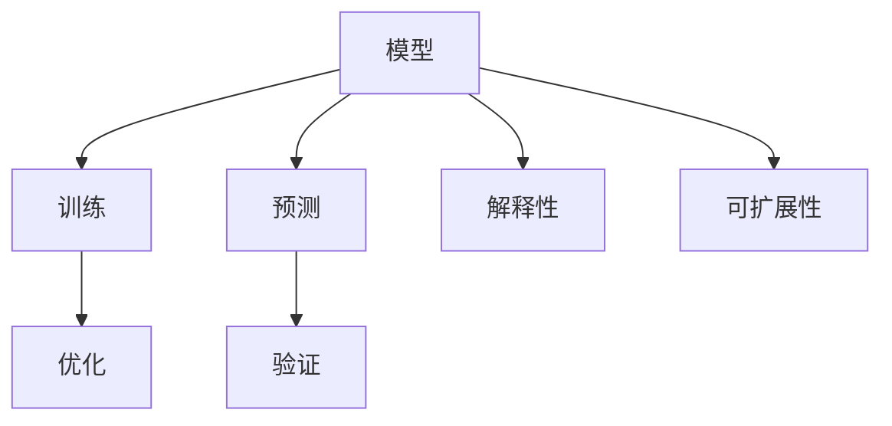

                 

# 丰富模型思维:增强管理者洞悉力

> 关键词：

## 1. 背景介绍

### 1.1 问题由来

在当今快速变化的商业环境中，企业管理者面临诸多挑战，如市场需求变动、竞争激烈、组织转型等。传统的决策模式和工具，如问卷调查、市场分析报告等，已经难以适应实时决策的需求。越来越多的企业开始探索新的手段，以提升决策速度和准确性，而基于模型的思维成为了一种前沿方法。

模型思维（Model Thinking）是一种基于数据的决策方法，通过构建并分析各类模型来洞察未来趋势、优化资源配置和提升决策质量。它是一种数据驱动的思维方式，能够将复杂的业务问题转化为可量化的模型，从而更好地理解和预测问题。

随着人工智能（AI）技术的发展，基于模型的思维方式得到了进一步的应用和扩展，特别是在大型企业的管理决策中，AI驱动的模型思维成为了一种新的趋势。

### 1.2 问题核心关键点

模型思维的核心在于构建和分析模型，以获取业务问题的洞察和预测。关键点包括：

- 数据获取和预处理：保证模型的输入数据质量，包括数据的完整性、准确性和代表性。
- 模型选择和训练：选择合适的模型架构和算法，并通过大量数据进行训练，确保模型的准确性和泛化能力。
- 结果分析和应用：将模型分析结果转化为实际的业务决策，包括目标优化、风险控制等。

### 1.3 问题研究意义

模型思维在企业管理中的应用，具有以下重要意义：

1. **决策准确性**：模型可以基于大量历史数据进行训练，预测未来趋势，为决策提供科学依据。
2. **决策速度**：模型自动化处理数据，极大地缩短了决策周期。
3. **资源优化**：模型能够动态调整资源配置，提升运营效率。
4. **风险控制**：通过预测和模拟，企业可以提前识别并控制风险。
5. **管理优化**：模型可以深入分析组织内部的瓶颈和优化点，提升管理水平。

本文将详细介绍模型思维在企业管理中的应用，重点关注模型的构建、训练和应用，帮助管理者更准确地理解和预测业务问题。

## 2. 核心概念与联系

### 2.1 核心概念概述

为了更好地理解模型思维，本节将介绍几个核心概念：

- **模型（Model）**：一种用于描述和预测业务问题的数学或统计方法，通过训练数据得到。
- **训练（Training）**：通过大量数据对模型进行优化，使其能够准确地预测新数据。
- **预测（Prediction）**：使用训练好的模型对新数据进行预测，以获取未来趋势或决策依据。
- **优化（Optimization）**：调整模型参数，使其在给定数据上表现最佳。
- **验证（Validation）**：通过独立于训练数据的数据集，评估模型的泛化能力。
- **解释性（Interpretability）**：模型的决策过程和结果可以被人理解，便于分析和解释。
- **可扩展性（Scalability）**：模型能够处理大规模数据和复杂问题，适应不同的业务场景。

这些概念之间的逻辑关系可以通过以下Mermaid流程图来展示：



这个流程图展示了模型思维的核心流程，即模型构建、训练、预测、验证、优化和解释。

## 3. 核心算法原理 & 具体操作步骤

### 3.1 算法原理概述

模型思维的核心是构建和分析模型，以预测未来趋势和优化决策。在企业管理中，常用的模型包括线性回归、决策树、随机森林、神经网络等。

模型构建和训练的流程如下：

1. **数据收集**：收集相关业务数据，包括销售数据、客户数据、市场数据等。
2. **数据预处理**：对数据进行清洗、标准化和转换，确保数据质量。
3. **模型选择**：选择适合的模型架构和算法，如线性回归、决策树、神经网络等。
4. **模型训练**：使用训练数据对模型进行优化，调整模型参数，使其能够准确预测新数据。
5. **模型验证**：使用验证数据评估模型预测的准确性和泛化能力。
6. **模型应用**：将训练好的模型应用到实际业务场景中，获取决策依据。

### 3.2 算法步骤详解

以下详细介绍模型思维在企业管理中的应用步骤：

**Step 1: 数据收集和预处理**

- 收集相关业务数据，包括销售数据、客户数据、市场数据等。
- 对数据进行清洗、标准化和转换，确保数据质量。

**Step 2: 模型选择和训练**

- 选择适合的模型架构和算法，如线性回归、决策树、神经网络等。
- 使用训练数据对模型进行优化，调整模型参数，使其能够准确预测新数据。

**Step 3: 结果分析和应用**

- 使用训练好的模型对新数据进行预测，以获取未来趋势或决策依据。
- 将模型分析结果转化为实际的业务决策，包括目标优化、风险控制等。

### 3.3 算法优缺点

模型思维在企业管理中的应用具有以下优点：

- **决策准确性**：模型可以基于大量历史数据进行训练，预测未来趋势，为决策提供科学依据。
- **决策速度**：模型自动化处理数据，极大地缩短了决策周期。
- **资源优化**：模型能够动态调整资源配置，提升运营效率。
- **风险控制**：通过预测和模拟，企业可以提前识别并控制风险。
- **管理优化**：模型可以深入分析组织内部的瓶颈和优化点，提升管理水平。

同时，该方法也存在一定的局限性：

- **数据依赖**：模型依赖高质量的数据，数据偏差会影响模型的预测准确性。
- **复杂度**：模型的构建和训练需要专业知识，复杂度较高。
- **解释性**：复杂的模型往往难以解释，管理者难以理解和信任。
- **维护成本**：模型的维护和更新需要持续投入。

尽管存在这些局限性，但就目前而言，基于模型的思维方式在企业管理中的应用，仍是提高决策质量和效率的有效手段。

### 3.4 算法应用领域

模型思维在企业管理中的应用，广泛涵盖以下领域：

- **销售预测**：使用历史销售数据预测未来的销售趋势，优化库存管理。
- **客户分析**：通过分析客户数据，识别高价值客户，提升客户满意度。
- **市场细分**：使用市场数据进行市场细分，制定差异化营销策略。
- **风险管理**：通过预测和模拟，识别潜在风险，制定应对措施。
- **供应链优化**：使用供应链数据优化供应链管理，提升运营效率。
- **人力资源管理**：使用员工数据优化人力资源配置，提升员工满意度。
- **财务管理**：使用财务数据进行预算管理和成本控制。

这些领域的应用展示了模型思维在企业管理中的广泛应用，帮助企业更好地理解和预测业务问题。

## 4. 数学模型和公式 & 详细讲解 & 举例说明

### 4.1 数学模型构建

在企业管理中，常用的数学模型包括线性回归、决策树、随机森林、神经网络等。以下以线性回归为例，介绍模型的构建过程。

**线性回归模型**：

$$
y = \beta_0 + \beta_1 x_1 + \beta_2 x_2 + \cdots + \beta_n x_n + \epsilon
$$

其中，$y$为预测值，$x_i$为自变量，$\beta_i$为回归系数，$\epsilon$为误差项。

### 4.2 公式推导过程

线性回归模型的推导过程如下：

1. **最小二乘法**：通过最小化误差项的平方和，求解回归系数$\beta_i$。

2. **梯度下降**：使用梯度下降算法优化模型参数，使其最小化损失函数。

3. **正则化**：通过L1正则或L2正则，避免过拟合。

4. **交叉验证**：使用交叉验证评估模型的泛化能力，选择最优模型。

### 4.3 案例分析与讲解

以一家零售企业为例，使用线性回归模型预测未来的销售趋势。

- **数据收集**：收集历史销售数据，包括销售量、促销活动、节假日等因素。
- **数据预处理**：对数据进行清洗、标准化和转换，确保数据质量。
- **模型选择**：选择线性回归模型。
- **模型训练**：使用历史销售数据对模型进行训练，调整回归系数。
- **模型验证**：使用独立数据集验证模型预测的准确性和泛化能力。
- **模型应用**：将训练好的模型应用到实际业务场景中，预测未来的销售趋势，制定营销策略。

## 5. 项目实践：代码实例和详细解释说明

### 5.1 开发环境搭建

在进行模型思维的实践前，我们需要准备好开发环境。以下是使用Python进行Pandas、Scikit-learn、TensorFlow等工具库的环境配置流程：

1. 安装Anaconda：从官网下载并安装Anaconda，用于创建独立的Python环境。

2. 创建并激活虚拟环境：
```bash
conda create -n model-env python=3.8 
conda activate model-env
```

3. 安装相关工具库：
```bash
conda install pandas scikit-learn tensorflow matplotlib
```

4. 安装相关依赖库：
```bash
pip install numpy statsmodels seaborn xgboost
```

完成上述步骤后，即可在`model-env`环境中开始模型思维的实践。

### 5.2 源代码详细实现

以下是使用Scikit-learn进行线性回归模型的Python代码实现：

```python
import pandas as pd
from sklearn.linear_model import LinearRegression
from sklearn.metrics import mean_squared_error, r2_score
from sklearn.model_selection import train_test_split

# 加载数据
data = pd.read_csv('sales_data.csv')

# 数据预处理
X = data[['promotion', 'holiday', 'date']].values
y = data['sales'].values

# 划分训练集和测试集
X_train, X_test, y_train, y_test = train_test_split(X, y, test_size=0.2, random_state=42)

# 模型训练
model = LinearRegression()
model.fit(X_train, y_train)

# 模型预测
y_pred = model.predict(X_test)

# 模型评估
mse = mean_squared_error(y_test, y_pred)
r2 = r2_score(y_test, y_pred)
print(f'MSE: {mse:.2f}, R^2: {r2:.2f}')
```

### 5.3 代码解读与分析

让我们再详细解读一下关键代码的实现细节：

**数据加载和预处理**：
- `pd.read_csv`：使用Pandas加载CSV文件。
- `X, y = data.drop('sales', axis=1).values, data['sales'].values`：将数据集分为自变量和因变量。

**模型训练**：
- `LinearRegression()`：创建线性回归模型。
- `model.fit(X_train, y_train)`：使用训练集对模型进行训练。

**模型预测和评估**：
- `y_pred = model.predict(X_test)`：使用测试集对模型进行预测。
- `mean_squared_error`和`r2_score`：计算预测值和真实值之间的均方误差和决定系数。

## 6. 实际应用场景

### 6.1 智能制造

模型思维在智能制造中的应用，可以显著提升生产效率和产品质量。例如，使用线性回归模型预测生产设备的维护周期，可以及时进行设备检修，避免生产中断。

### 6.2 供应链优化

在供应链管理中，使用机器学习模型预测需求波动，可以优化库存管理和物流规划，提升供应链的整体效率。

### 6.3 金融风控

在金融行业，使用模型预测信用风险和市场波动，可以提升风险控制能力，保护投资者利益。

### 6.4 未来应用展望

随着AI技术的发展，模型思维在企业管理中的应用将进一步扩展，以下是未来应用展望：

1. **深度学习模型**：使用深度学习模型，如神经网络、卷积神经网络等，处理更复杂的业务问题。
2. **自动化决策**：使用自动化决策工具，如强化学习、优化算法等，实时优化决策。
3. **多模态数据融合**：将文本、图像、视频等多种数据源融合，提升模型的预测准确性。
4. **联邦学习**：使用联邦学习技术，保护数据隐私，提升模型的安全性。
5. **因果推断**：使用因果推断模型，分析因果关系，提升决策的因果性和可信度。

这些方向的发展，将进一步丰富模型思维在企业管理中的应用，推动业务决策的科学化和智能化。

## 7. 工具和资源推荐

### 7.1 学习资源推荐

为了帮助管理者系统掌握模型思维的理论基础和实践技巧，这里推荐一些优质的学习资源：

1. **《统计学习方法》**：李航所著，全面介绍了统计学习的基本概念和经典算法。
2. **《机器学习实战》**：Peter Harrington所著，介绍了机器学习的基本原理和应用实践。
3. **Coursera《机器学习》课程**：斯坦福大学Andrew Ng教授的机器学习课程，系统讲解了机器学习的理论基础和算法实现。
4. **Kaggle数据科学竞赛平台**：提供丰富的数据集和竞赛任务，实践机器学习模型的构建和应用。
5. **Google AI开发者文档**：Google AI提供的各种机器学习工具和框架，包括TensorFlow、Scikit-learn等。

通过对这些资源的学习实践，相信管理者一定能够掌握模型思维的核心方法和应用技巧，提升业务决策的科学性和准确性。

### 7.2 开发工具推荐

高效的开发离不开优秀的工具支持。以下是几款用于模型思维开发的常用工具：

1. **Pandas**：用于数据处理和分析，提供了丰富的数据处理函数和操作接口。
2. **Scikit-learn**：提供了各种常用的机器学习算法和工具，易于使用和集成。
3. **TensorFlow**：由Google开发的深度学习框架，支持分布式计算和大规模模型训练。
4. **Keras**：基于TensorFlow的高级深度学习库，提供了简单易用的API接口。
5. **Jupyter Notebook**：用于编写和运行Python代码，支持代码编辑、结果展示和版本控制。
6. **Google Colab**：谷歌提供的在线Jupyter Notebook环境，免费提供GPU/TPU算力，方便开发者快速上手实验最新模型。

合理利用这些工具，可以显著提升模型思维的开发效率，加快创新迭代的步伐。

### 7.3 相关论文推荐

模型思维的发展源于学界的持续研究。以下是几篇奠基性的相关论文，推荐阅读：

1. **《统计学习基础》**：李航所著，介绍了统计学习的基本概念和常用方法。
2. **《机器学习》**：Tom Mitchell所著，全面介绍了机器学习的基本理论和应用。
3. **《深度学习》**：Ian Goodfellow等所著，介绍了深度学习的基本原理和应用实践。
4. **《因果推断》**：Rubin等所著，介绍了因果推断的基本概念和方法。
5. **《联邦学习》**：Cui等所著，介绍了联邦学习的原理和应用。

这些论文代表了大数据和人工智能领域的研究进展，对于深入理解模型思维的应用有着重要意义。

## 8. 总结：未来发展趋势与挑战

### 8.1 总结

本文对模型思维在企业管理中的应用进行了全面系统的介绍。首先阐述了模型思维的研究背景和意义，明确了模型思维在提高决策质量和效率方面的独特价值。其次，从原理到实践，详细讲解了模型思维的数学原理和关键步骤，给出了模型思维任务开发的完整代码实例。同时，本文还广泛探讨了模型思维在智能制造、供应链优化、金融风控等多个行业领域的应用前景，展示了模型思维的广泛应用。

通过本文的系统梳理，可以看到，模型思维在企业管理中的应用正在成为一种趋势，极大地提升决策的科学性和准确性。未来，伴随AI技术的不断演进，模型思维必将在更多领域发挥重要作用。

### 8.2 未来发展趋势

展望未来，模型思维在企业管理中的应用将呈现以下几个发展趋势：

1. **深度学习模型的普及**：深度学习模型将更广泛地应用于业务决策中，处理更复杂的业务问题。
2. **自动化决策的普及**：自动化决策工具，如强化学习、优化算法等，将更广泛地应用于实时决策中，提升决策速度和效率。
3. **多模态数据融合**：多模态数据的融合，将提升模型的预测准确性和决策的全面性。
4. **联邦学习的应用**：联邦学习技术，将保护数据隐私，提升模型的安全性。
5. **因果推断的普及**：因果推断模型，将提升决策的因果性和可信度。

这些趋势将进一步丰富模型思维在企业管理中的应用，推动业务决策的科学化和智能化。

### 8.3 面临的挑战

尽管模型思维在企业管理中的应用已经取得了显著进展，但在迈向更加智能化、普适化应用的过程中，仍面临诸多挑战：

1. **数据质量问题**：模型依赖高质量的数据，数据偏差会影响模型的预测准确性。
2. **模型复杂度问题**：复杂的模型往往难以理解和解释，管理者难以信任。
3. **资源限制问题**：模型的构建和训练需要大量资源，企业需要投入大量资金和人力。
4. **数据隐私问题**：模型训练需要大量的数据，涉及数据隐私和安全问题。
5. **模型维护问题**：模型的维护和更新需要持续投入，管理成本较高。

尽管存在这些挑战，但通过持续的技术创新和实践探索，这些难题终将逐一被克服，模型思维必将在企业管理中发挥更大的作用。

### 8.4 研究展望

面对模型思维面临的诸多挑战，未来的研究需要在以下几个方面寻求新的突破：

1. **提升数据质量**：通过数据清洗、数据增强等技术，提升数据质量，减少数据偏差。
2. **简化模型**：开发更简单、易于理解的模型，提升模型的解释性和可信度。
3. **降低资源消耗**：通过模型压缩、分布式计算等技术，降低模型的构建和训练成本。
4. **保护数据隐私**：使用联邦学习等技术，保护数据隐私，提升模型的安全性。
5. **提升模型维护性**：通过自动化工具和持续优化，提升模型的维护性和可扩展性。

这些研究方向将引领模型思维在企业管理中的应用走向成熟，推动业务决策的科学化和智能化。

## 9. 附录：常见问题与解答

**Q1: 模型思维在企业管理中的应用效果如何？**

A: 模型思维在企业管理中的应用效果显著。通过构建和分析模型，企业管理者能够更准确地预测未来趋势和优化决策。例如，在销售预测、客户分析、风险管理等领域，模型思维的应用已经取得了良好的效果。

**Q2: 模型思维是否适用于所有企业管理问题？**

A: 模型思维适用于各种企业管理问题，尤其是在数据量较大、问题复杂的情况下，效果更加显著。但对于一些简单的问题，使用传统方法可能更加高效。

**Q3: 模型思维的构建和应用需要哪些资源？**

A: 模型思维的构建和应用需要大量的数据、计算资源和专业知识。企业需要投入大量资金和人力，进行数据收集、数据处理、模型构建和模型应用。

**Q4: 模型思维在实际应用中需要注意哪些问题？**

A: 模型思维在实际应用中需要注意以下问题：
1. 数据质量：保证模型的输入数据质量，包括数据的完整性、准确性和代表性。
2. 模型选择：选择合适的模型架构和算法，保证模型的预测准确性。
3. 模型解释：确保模型的决策过程和结果可以被人理解，便于分析和解释。
4. 模型维护：持续维护和优化模型，确保模型的稳定性和可靠性。

**Q5: 如何提升模型思维在企业管理中的应用效果？**

A: 提升模型思维在企业管理中的应用效果，需要从数据、模型、算法和工程等多个方面进行优化。具体措施包括：
1. 数据清洗和增强：通过数据清洗和数据增强等技术，提升数据质量。
2. 模型选择和优化：选择合适的模型架构和算法，并进行优化和调整。
3. 自动化工具和系统：使用自动化工具和系统，提高模型的构建和应用效率。
4. 持续优化和迭代：持续优化和迭代模型，提升模型的性能和可靠性。

通过这些措施，可以进一步提升模型思维在企业管理中的应用效果，推动业务决策的科学化和智能化。

---

作者：禅与计算机程序设计艺术 / Zen and the Art of Computer Programming

