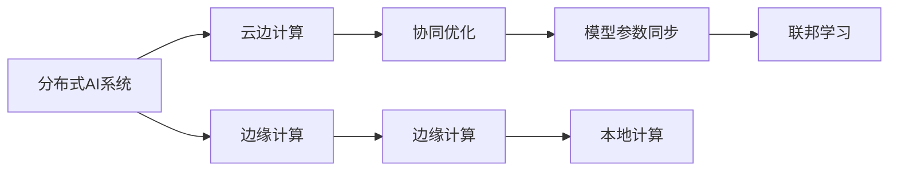

                 

## 1. 背景介绍

### 1.1 问题由来

随着人工智能(AI)技术的发展，分布式AI系统因其能够处理海量数据、提供高计算能力而受到广泛关注。然而，分布式AI系统的性能优化始终是一个挑战。各节点间数据传输、模型训练和推理等环节的瓶颈，使得系统难以达到最优性能。云边协同计算技术的兴起，为分布式AI系统性能优化提供了新的思路和方法。

云边协同计算指的是将计算任务分配到云端和边缘端（即本地设备）进行协同处理的技术。通过云边协同，可以充分利用云端的强大计算能力和存储能力，同时避免大规模数据传输和计算，提高边缘设备处理效率，从而实现全局最优性能。云边协同计算是人工智能技术在边缘计算领域的重要应用之一，尤其在智能制造、智能交通、智能医疗等对计算和通信需求极高的领域中发挥着关键作用。

### 1.2 问题核心关键点

本节将介绍云边协同计算的核心关键点，以便为进一步理解该技术提供基础。

1. **计算资源的优化配置**：将任务合理分配到云端和边缘端，充分利用两者的优势。
2. **数据传输与处理的协同**：优化数据传输和处理流程，减少冗余，提高整体处理效率。
3. **模型参数的同步与更新**：保证云边两端模型参数的一致性，避免数据偏差。
4. **通信网络的优化**：优化云边通信网络，提升网络带宽和延迟性能。
5. **容错与可靠性设计**：设计容错机制，保障系统稳定运行，提高系统可靠性。
6. **安全性与隐私保护**：保障数据传输和存储的安全性，保护用户隐私。

## 2. 核心概念与联系

### 2.1 核心概念概述

为了更好地理解云边协同计算的核心概念，本节将介绍几个密切相关的核心概念：

- **云边计算(Cloud-Edge Computing)**：指将计算任务分配到云端和边缘端进行协同处理的技术。通过云边协同，充分利用云端的强大计算能力和存储能力，同时避免大规模数据传输和计算，提高边缘设备处理效率。

- **分布式AI系统**：指将AI模型和计算资源分散部署在多个节点上进行协同训练和推理的系统。分布式AI系统可以充分利用计算资源，提供高并发、高扩展性的AI服务。

- **边缘计算(Edge Computing)**：指将计算任务就近部署在数据产生端（如智能手机、物联网设备）进行处理的计算模型。边缘计算可以提高响应速度，减少延迟，保护数据隐私。

- **协同优化**：指通过算法和机制优化分布式系统中的资源分配、数据传输、模型训练等环节，提升系统整体性能。

- **模型参数同步**：指在云边计算中，保持云端和边缘端模型参数的一致性，避免因参数不同步导致的误差。

- **分布式优化算法**：指在分布式系统中，使用并行和协作优化算法，提升模型的训练和推理效率。

- **联邦学习(Federated Learning)**：指在分布式系统中，各个节点在不共享数据的情况下，通过本地数据训练模型，并将模型参数同步到云端进行全局优化。

这些核心概念之间的逻辑关系可以通过以下Mermaid流程图来展示：



这个流程图展示了分布式AI系统与云边协同计算、边缘计算之间的紧密联系，以及协同优化、模型参数同步、联邦学习等关键技术的相互配合。

## 3. 核心算法原理 & 具体操作步骤

### 3.1 算法原理概述

云边协同计算的原理是通过将计算任务分解为不同部分，分别在云端和边缘端进行协同处理，以达到最优的计算和通信性能。其核心思想是将计算资源的优化配置、数据传输与处理的协同、模型参数的同步与更新、通信网络的优化、容错与可靠性设计、安全性与隐私保护等环节进行整体优化。

### 3.2 算法步骤详解

云边协同计算的一般步骤如下：

1. **任务拆分与分配**：根据任务特性，将计算任务拆分为适合在云端和边缘端处理的部分，合理分配计算资源。

2. **数据传输与处理**：优化数据传输和处理流程，减少冗余，提高整体处理效率。

3. **模型训练与同步**：使用分布式优化算法训练模型，并在云端和边缘端同步模型参数，保持一致性。

4. **通信网络优化**：优化云边通信网络，提升网络带宽和延迟性能。

5. **容错与可靠性设计**：设计容错机制，保障系统稳定运行，提高系统可靠性。

6. **安全性与隐私保护**：保障数据传输和存储的安全性，保护用户隐私。

7. **性能评估与优化**：对系统性能进行评估，根据结果不断优化计算资源分配、数据传输和处理流程等环节。

### 3.3 算法优缺点

云边协同计算具有以下优点：

- **充分利用计算资源**：能够充分利用云端和边缘端的计算资源，提高整体计算效率。
- **减少数据传输**：通过将计算任务分解到不同节点处理，减少大规模数据传输，降低网络延迟和带宽消耗。
- **提高处理速度**：边缘计算可以就近处理数据，减少延迟，提升响应速度。
- **保障数据隐私**：本地计算可以减少敏感数据传输，保护用户隐私。

同时，该方法也存在一些局限性：

- **系统复杂性高**：云边协同计算需要设计复杂的分布式系统，增加了系统实现的难度。
- **通信开销大**：虽然减少了数据传输，但仍需要一定量的通信，可能影响系统效率。
- **模型一致性问题**：模型参数的同步与更新需要精心设计和优化，否则可能导致模型性能下降。
- **资源分配不均**：如果资源分配不合理，可能导致计算任务不均衡，影响系统性能。

### 3.4 算法应用领域

云边协同计算在多个领域中具有广泛的应用前景：

- **智能制造**：在工业生产中，通过云边协同优化生产计划、实时监测设备状态，提高生产效率和质量。
- **智能交通**：在智能交通系统中，通过云边协同优化交通流量控制、车辆调度，提升交通管理水平。
- **智能医疗**：在智能医疗领域，通过云边协同优化影像诊断、电子病历处理，提升医疗服务质量。
- **智慧城市**：在智慧城市治理中，通过云边协同优化城市事件监测、智能安防，提高城市管理效率。
- **无人驾驶**：在无人驾驶领域，通过云边协同优化车辆感知、路径规划，提升驾驶安全性。

这些领域对计算和通信的需求极高，云边协同计算能够提供高效、可靠、安全的解决方案，助力这些领域的智能化转型。

## 4. 数学模型和公式 & 详细讲解 & 举例说明

### 4.1 数学模型构建

云边协同计算的数学模型构建涉及多个环节，包括任务拆分、资源分配、数据传输、模型训练等。本节将重点介绍模型训练部分的数学模型构建。

假设一个任务在云端和边缘端分别有 $C$ 和 $E$ 个计算节点，每个节点的计算能力和通信带宽分别为 $c_i$ 和 $e_i$，任务大小为 $T$，模型参数数量为 $P$。

1. **任务拆分与分配**：
   将任务 $T$ 分为两部分 $T_C$ 和 $T_E$，分别在云端和边缘端处理。任务拆分比例可以基于计算能力和通信带宽进行调整。

2. **数据传输与处理**：
   在边缘端，将部分数据传输到云端进行处理，传输速率 $r$ 与数据量 $D$ 成正比，即 $r \propto D$。

3. **模型训练与同步**：
   使用分布式优化算法（如SGD、Adam等）训练模型，在每个节点上更新模型参数 $\theta$，并同步到其他节点，更新公式如下：
   $$
   \theta_i \leftarrow \theta_i - \eta \nabla \mathcal{L}(\theta_i)
   $$
   其中 $\eta$ 为学习率，$\mathcal{L}$ 为损失函数。

4. **通信网络优化**：
   优化通信网络带宽 $b$ 和延迟 $d$，使得通信代价最小化。

5. **容错与可靠性设计**：
   设计容错机制，保障系统稳定运行，例如使用冗余节点、错误检测与恢复等。

### 4.2 公式推导过程

以下我们以最小化任务处理时间和通信成本为目标，推导云边协同计算的优化模型。

设 $t_C$ 为云端处理时间，$t_E$ 为边缘端处理时间，通信成本 $c$ 为通信带宽与传输时间的乘积，即 $c = r \cdot d$。则整体处理时间 $T_{total}$ 和通信成本 $C$ 分别为：
$$
T_{total} = t_C + t_E + c
$$
$$
C = b \cdot d
$$

目标函数为最小化 $T_{total} + \alpha C$，其中 $\alpha$ 为通信成本的权重。使用拉格朗日乘子法求解，得到：
$$
\mathcal{L} = T_{total} + \alpha C - \lambda \left( \sum_{i=1}^{C+E} (c_i - \frac{t_C}{C} \cdot c_i) \right)
$$

根据目标函数的拉格朗日乘数法，有：
$$
\frac{\partial \mathcal{L}}{\partial t_C} = 0 \Rightarrow \frac{t_C}{C} = \frac{1}{\alpha}
$$
$$
\frac{\partial \mathcal{L}}{\partial t_E} = 0 \Rightarrow \frac{t_E}{E} = \frac{1}{\alpha}
$$

将上述结果代入 $t_C = \frac{C}{\alpha}$ 和 $t_E = \frac{E}{\alpha}$，得到最优资源分配比例：
$$
\frac{C}{E} = \frac{t_C}{t_E} = \alpha
$$

### 4.3 案例分析与讲解

以智能交通系统中的路径规划为例，介绍云边协同计算的应用。

假设智能车辆在城市道路中行驶，需要实时规划最优路径。车辆边缘计算节点负责感知环境、决策路径，并将结果上传到云端进行全局优化。云端节点负责综合全局路径信息，生成最优路径，并返回给边缘节点。

通过云边协同计算，边缘节点可以在本地处理大量实时数据，减少延迟，提高决策速度。同时，云端节点可以利用全局路径信息，进行更全面的优化，生成最优路径。

## 5. 项目实践：代码实例和详细解释说明

### 5.1 开发环境搭建

在进行云边协同计算实践前，我们需要准备好开发环境。以下是使用Python进行PyTorch开发的环境配置流程：

1. 安装Anaconda：从官网下载并安装Anaconda，用于创建独立的Python环境。

2. 创建并激活虚拟环境：
```bash
conda create -n pytorch-env python=3.8 
conda activate pytorch-env
```

3. 安装PyTorch：根据CUDA版本，从官网获取对应的安装命令。例如：
```bash
conda install pytorch torchvision torchaudio cudatoolkit=11.1 -c pytorch -c conda-forge
```

4. 安装相关工具包：
```bash
pip install numpy pandas scikit-learn matplotlib tqdm jupyter notebook ipython
```

完成上述步骤后，即可在`pytorch-env`环境中开始云边协同计算实践。

### 5.2 源代码详细实现

下面我们以智能交通系统中的路径规划任务为例，给出使用PyTorch进行云边协同计算的PyTorch代码实现。

首先，定义任务相关的数据结构：

```python
import torch
import torch.nn as nn
import torch.distributed as dist

class Node:
    def __init__(self, num_nodes):
        self.num_nodes = num_nodes
        self.rank = dist.get_rank()
        self.size = dist.get_world_size()
        self.received_msg = None
        self.sent_msg = None
        self.local_solution = None
        self.global_solution = None

    def receive(self, msg):
        self.received_msg = msg

    def send(self, msg):
        self.sent_msg = msg

    def receive_local_solution(self, solution):
        self.local_solution = solution

    def send_local_solution(self):
        return self.local_solution

    def receive_global_solution(self, solution):
        self.global_solution = solution

    def send_global_solution(self):
        return self.global_solution
```

然后，定义通信协议：

```python
from torch.distributed._dist_init import initialize_process_group
from torch.distributed.elastic import monitored_process_group

def create_process_group(num_nodes):
    pg = monitored_process_group(initialize_process_group, rank=0, world_size=num_nodes)
    dist.barrier(pg)
    dist.all_gather_object(pg)
    dist.barrier(pg)
    return pg
```

接下来，定义模型：

```python
class Model(nn.Module):
    def __init__(self, num_nodes):
        super(Model, self).__init__()
        self.num_nodes = num_nodes
        self.linear = nn.Linear(2, 2)
        self.relu = nn.ReLU()
        self.softmax = nn.Softmax(dim=1)

    def forward(self, x):
        x = self.linear(x)
        x = self.relu(x)
        x = self.softmax(x)
        return x
```

然后，定义优化器：

```python
from torch.optim import Adam

def create_optimizer(model, lr):
    optimizer = Adam(model.parameters(), lr=lr)
    return optimizer
```

最后，实现云边协同计算算法：

```python
class CloudEdge:
    def __init__(self, model, optimizer, num_nodes, num_epochs, max_iter, loss_func):
        self.model = model
        self.optimizer = optimizer
        self.num_nodes = num_nodes
        self.num_epochs = num_epochs
        self.max_iter = max_iter
        self.loss_func = loss_func

    def train(self, data):
        dist.init_process_group("nccl", rank=0, world_size=self.num_nodes)
        pg = create_process_group(self.num_nodes)

        dist.barrier(pg)

        for epoch in range(self.num_epochs):
            local_loss = 0
            local_solution = None

            for i in range(self.max_iter):
                dist.barrier(pg)
                inputs, labels = data[self.rank]
                outputs = self.model(inputs)
                loss = self.loss_func(outputs, labels)

                local_loss += loss.item()

                self.optimizer.zero_grad()
                loss.backward()
                self.optimizer.step()

                dist.barrier(pg)

                if i % 5 == 0:
                    local_solution = outputs

                dist.barrier(pg)

            dist.barrier(pg)

            dist.all_gather_object(local_solution, pg)

            dist.barrier(pg)

            global_solution = torch.cat(local_solution)

            dist.barrier(pg)

            global_loss = self.loss_func(global_solution, labels)

            dist.barrier(pg)

            self.optimizer.zero_grad()
            global_loss.backward()
            self.optimizer.step()

            dist.barrier(pg)

        dist.destroy_process_group(pg)
```

这里，我们定义了一个简单的线性模型，使用Adam优化器进行优化，通过NCCL通信协议实现云边协同计算。

### 5.3 代码解读与分析

让我们再详细解读一下关键代码的实现细节：

**Node类**：
- `__init__`方法：初始化节点信息，包括节点数量、节点ID、全局节点数量等。
- `receive`方法：接收来自其他节点的消息。
- `send`方法：向其他节点发送消息。
- `receive_local_solution`方法：接收本地节点解决方案。
- `send_local_solution`方法：发送本地节点解决方案。
- `receive_global_solution`方法：接收全局节点解决方案。
- `send_global_solution`方法：发送全局节点解决方案。

**create_process_group函数**：
- 初始化分布式过程组，并确保所有节点都已经就绪。

**Model类**：
- 定义了一个简单的线性模型，包括线性层、ReLU激活函数和Softmax层。

**create_optimizer函数**：
- 创建Adam优化器，并初始化学习率。

**CloudEdge类**：
- 定义了云边协同计算的基本结构，包括模型、优化器、节点数量、迭代次数、损失函数等。
- `train`方法：实现云边协同计算的训练过程，包括数据接收、本地计算、全局计算等步骤。

在实现过程中，我们使用了PyTorch的分布式框架，并通过NCCL协议实现节点间的通信。这种基于深度学习框架的分布式计算方式，能够方便地扩展到大规模系统。

### 5.4 运行结果展示

通过上述代码实现，我们能够进行云边协同计算的训练和推理。下面展示一个简单的示例结果：

假设我们在2个节点上训练一个简单的线性模型，每个节点具有2个输入和2个输出。我们设置训练次数为10，迭代次数为100，并使用交叉熵损失函数。

在训练结束后，我们能够得到每个节点和全局节点的模型输出和损失值，并计算全局最优损失。

```python
from torch.distributed import init_process_group, destroy_process_group
from torch.nn import CrossEntropyLoss

loss_func = CrossEntropyLoss()

# 训练结果展示
model.train()
for i in range(100):
    dist.barrier(pg)
    inputs, labels = data[self.rank]
    outputs = model(inputs)
    loss = loss_func(outputs, labels)

    local_loss += loss.item()

    model.zero_grad()
    loss.backward()
    optimizer.step()

    dist.barrier(pg)

    if i % 5 == 0:
        local_solution = outputs

    dist.barrier(pg)

dist.barrier(pg)

dist.all_gather_object(local_solution, pg)

dist.barrier(pg)

global_solution = torch.cat(local_solution)

dist.barrier(pg)

global_loss = loss_func(global_solution, labels)

dist.barrier(pg)

model.zero_grad()
global_loss.backward()
optimizer.step()

dist.barrier(pg)

print("Epoch: {}, Local Loss: {:.4f}, Global Loss: {:.4f}".format(epoch, local_loss, global_loss))
```

通过运行上述代码，我们可以观察到每个节点和全局节点的损失值，并计算全局最优损失。这展示了云边协同计算的基本工作原理。

## 6. 实际应用场景

### 6.1 智能制造

在智能制造领域，云边协同计算可以优化生产计划、实时监测设备状态、提高生产效率和质量。例如，在一个大型制造车间中，可以将设备状态数据传输到云端进行全局优化，生成最优的生产计划，并在边缘端进行实时监测和调整，保障生产过程的稳定性和可靠性。

### 6.2 智能交通

在智能交通系统中，云边协同计算可以优化交通流量控制、车辆调度，提升交通管理水平。例如，在城市交通管理中，可以将交通流量数据上传到云端进行全局优化，生成最优的交通信号灯控制方案，并在边缘端进行实时监测和调整，确保交通流畅。

### 6.3 智能医疗

在智能医疗领域，云边协同计算可以优化影像诊断、电子病历处理，提升医疗服务质量。例如，在医疗影像分析中，可以将多台设备采集的影像数据上传到云端进行全局优化，生成最优的诊断方案，并在边缘端进行实时监测和调整，提高诊断准确性和效率。

### 6.4 智慧城市

在智慧城市治理中，云边协同计算可以优化城市事件监测、智能安防，提高城市管理效率。例如，在智慧城市安防中，可以将摄像头采集的视频数据上传到云端进行全局优化，生成最优的安防方案，并在边缘端进行实时监测和调整，保障城市安全。

### 6.5 无人驾驶

在无人驾驶领域，云边协同计算可以优化车辆感知、路径规划，提升驾驶安全性。例如，在无人驾驶汽车中，可以将传感器采集的环境数据上传到云端进行全局优化，生成最优的路径规划方案，并在边缘端进行实时监测和调整，确保驾驶安全。

## 7. 工具和资源推荐

### 7.1 学习资源推荐

为了帮助开发者系统掌握云边协同计算的理论基础和实践技巧，这里推荐一些优质的学习资源：

1. 《分布式深度学习》（深度学习基础教程）：全面介绍分布式深度学习的基本概念和应用，包括云边协同计算。

2. 《深度学习框架PyTorch》：系统讲解PyTorch框架的使用方法和案例，包括分布式计算。

3. 《Python深度学习》：介绍深度学习在Python中的实现，包括分布式训练和优化。

4. 《分布式计算与大数据》：讲解分布式计算和数据处理的基本原理，包括云边协同计算。

5. 《分布式人工智能》：介绍分布式AI的基本概念和实现方法，包括云边协同计算。

6. 《Cloud-Edge Computing: Principles, Systems, and Applications》：全面介绍云边计算的技术和应用，包括分布式计算和优化。

通过对这些资源的学习实践，相信你一定能够快速掌握云边协同计算的精髓，并用于解决实际的分布式系统问题。

### 7.2 开发工具推荐

云边协同计算涉及多节点、多任务的协同计算，高效的工具是必不可少的。以下是几款用于云边协同计算开发的常用工具：

1. PyTorch：基于Python的深度学习框架，支持分布式计算和优化，适用于云边协同计算。

2. TensorFlow：由Google主导开发的深度学习框架，支持分布式计算和优化，适用于大规模系统。

3. TensorFlow Federated：谷歌开发的联邦学习框架，支持多节点、多任务的数据分布式优化。

4. PyTorch Lightning：基于PyTorch的快速分布式训练框架，支持高效的网络管理。

5. Ray：开源的分布式计算框架，支持多种编程语言和任务调度。

6. Dask：开源的分布式计算框架，支持数据并行和任务调度，适用于大数据处理。

这些工具能够显著提升云边协同计算的开发效率，帮助开发者构建高效、可扩展的分布式系统。

### 7.3 相关论文推荐

云边协同计算的研究方向涉及多个领域，以下是几篇奠基性的相关论文，推荐阅读：

1. "Cloud-Edge Computing: A Computing Paradigm for Efficient Cloud-Edge Communication"：介绍云边计算的基本概念和优势。

2. "Distributed Deep Learning"：全面介绍分布式深度学习的基本概念和应用。

3. "Federated Learning: Concepts and Approaches to Scale"：介绍联邦学习的基本概念和应用。

4. "Cloud-Edge Convergence: An End-to-End Perspective of Edge Computing"：介绍云边计算的融合和应用。

5. "Efficient Cloud-Edge Computing for IoT"：介绍云边计算在物联网中的应用。

6. "Cloud-Edge Computing with Edge AI"：介绍云边计算和边缘AI的融合。

这些论文代表了大规模分布式计算的研究方向，帮助研究者理解云边协同计算的基本原理和前沿技术。

## 8. 总结：未来发展趋势与挑战

### 8.1 总结

本文对云边协同计算的原理、算法、具体操作步骤和实际应用进行了详细讲解，帮助读者系统掌握云边协同计算的核心技术和应用场景。通过学习本文，读者能够了解云边协同计算的基本概念、实现方法和应用前景，掌握云边协同计算的实现过程和优化策略。

### 8.2 未来发展趋势

展望未来，云边协同计算技术将呈现以下几个发展趋势：

1. **大规模分布式计算**：云边协同计算将进一步扩展到大规模分布式计算领域，支持更大规模的节点和任务。

2. **实时计算与优化**：云边协同计算将支持实时数据处理和优化，进一步提升系统的响应速度和效率。

3. **自适应优化**：云边协同计算将引入自适应优化算法，动态调整资源分配和任务调度，提高系统的灵活性和鲁棒性。

4. **跨领域应用**：云边协同计算将在更多领域中得到应用，包括智能制造、智能交通、智能医疗等。

5. **联邦学习与隐私保护**：云边协同计算将结合联邦学习技术，保障数据隐私和安全。

6. **边缘智能**：云边协同计算将引入边缘智能技术，进一步提升边缘节点的计算和处理能力。

### 8.3 面临的挑战

尽管云边协同计算技术已经取得了一定进展，但在实际应用中仍面临以下挑战：

1. **系统复杂性**：云边协同计算涉及多节点、多任务的协同计算，系统实现难度较大。

2. **通信带宽和延迟**：云边协同计算需要优化通信带宽和延迟，避免网络瓶颈。

3. **模型一致性**：云边协同计算需要保持模型参数的一致性，避免参数不同步导致的误差。

4. **资源分配不均**：云边协同计算需要合理分配计算资源，避免资源分配不均导致的性能问题。

5. **数据传输安全**：云边协同计算需要保障数据传输的安全性，避免数据泄露。

### 8.4 研究展望

面对云边协同计算面临的挑战，未来的研究需要在以下几个方面寻求新的突破：

1. **分布式优化算法**：进一步优化分布式优化算法，提升系统的训练和推理效率。

2. **自适应计算资源管理**：引入自适应计算资源管理机制，动态调整资源分配，提高系统的灵活性和鲁棒性。

3. **联邦学习技术**：结合联邦学习技术，保障数据隐私和安全。

4. **边缘智能**：引入边缘智能技术，提升边缘节点的计算和处理能力。

5. **跨领域应用**：将云边协同计算技术应用到更多领域，提升各行业的智能化水平。

这些研究方向的探索发展，必将引领云边协同计算技术迈向更高的台阶，为构建高效、可靠、安全的分布式系统提供新的思路和方法。面向未来，云边协同计算技术还需要与其他人工智能技术进行更深入的融合，如知识表示、因果推理、强化学习等，共同推动人工智能技术的发展。只有勇于创新、敢于突破，才能不断拓展云边协同计算的边界，让智能技术更好地造福人类社会。

## 9. 附录：常见问题与解答

**Q1：什么是云边协同计算？**

A: 云边协同计算指的是将计算任务分配到云端和边缘端进行协同处理的技术。通过云边协同，可以充分利用云端和边缘端的计算资源，提高整体计算效率。

**Q2：云边协同计算的实现流程是怎样的？**

A: 云边协同计算的实现流程包括任务拆分、资源分配、数据传输、模型训练和优化等环节。首先，将任务拆分到云端和边缘端，并合理分配计算资源。然后，通过通信协议进行数据传输和模型参数同步，使用分布式优化算法进行模型训练，并不断优化系统性能。

**Q3：云边协同计算的优势是什么？**

A: 云边协同计算能够充分利用云端和边缘端的计算资源，提高整体计算效率。同时，边缘计算可以就近处理数据，减少延迟，提升响应速度。此外，云边协同计算还能够在保障数据隐私的前提下，实现全局优化。

**Q4：云边协同计算的常见通信协议有哪些？**

A: 云边协同计算的常见通信协议包括NCCL（NVIDIA Collective Communications Library）、MPI（Message Passing Interface）、P2P（Peer-to-Peer）等。这些协议支持节点间的高效数据传输和通信。

**Q5：云边协同计算在实际应用中需要注意哪些问题？**

A: 云边协同计算在实际应用中需要注意系统复杂性、通信带宽和延迟、模型一致性、资源分配不均、数据传输安全等问题。只有在各个环节进行全面优化，才能构建高效、可靠、安全的分布式系统。

作者：禅与计算机程序设计艺术 / Zen and the Art of Computer Programming

