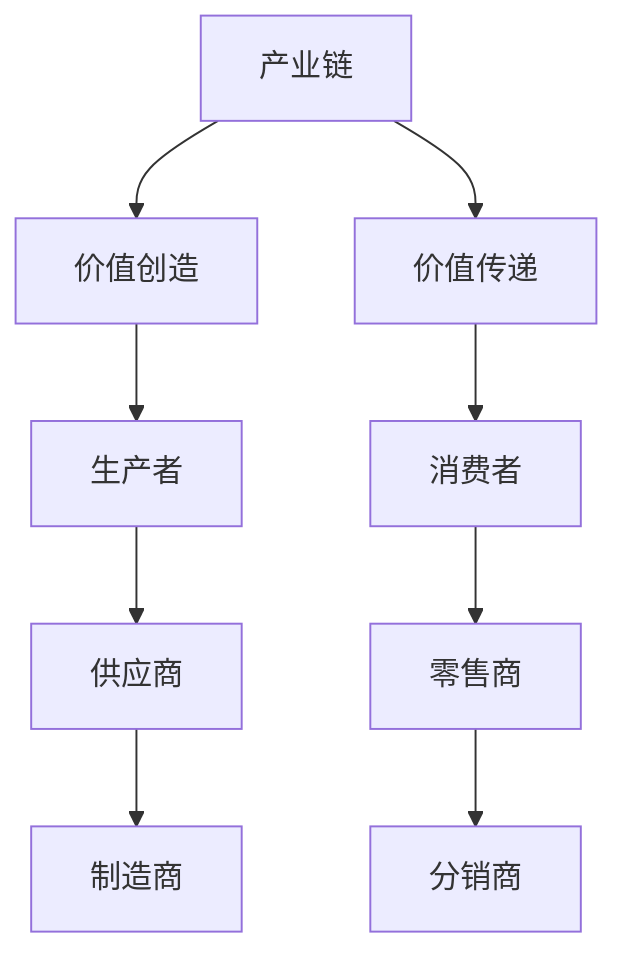

                 

# 产业链:价值创造与传递的通道

> 关键词：产业链,价值创造,价值传递,供应链管理,数据驱动,智能制造

## 1. 背景介绍

在当今全球化经济环境下，产业链作为连接生产、分销、销售等环节的重要纽带，成为价值创造与传递的核心通道。其高效运行和优化，对于提升企业竞争力、促进经济增长具有重要意义。特别是随着数字化转型的加速，数据驱动的智能制造、智能供应链等新兴产业模式应运而生，产业链管理更加复杂多样。本文将深入探讨产业链的价值创造与传递机制，并结合前沿技术分析其在产业链优化中的应用。

## 2. 核心概念与联系

### 2.1 核心概念概述

为更深入理解产业链的价值创造与传递，需先明确几个关键概念：

- **产业链**：指在产品生产、销售和服务的整个过程中，不同企业之间通过分工协作形成的价值链条，包括供应商、制造商、分销商、零售商等各个环节。
- **价值创造**：指产业链中各参与者通过劳动、资源等投入，将原材料转化为最终产品或服务，满足市场需求，实现增值的过程。
- **价值传递**：指产业链中的产品或服务从制造商到消费者的转移过程中，价值通过不同环节的交换、增值，最终达到消费者手中的过程。
- **供应链管理**：是指对整个供应链的计划、组织、协调和控制，以确保产品或服务按时按质按量到达消费者手中。

这些概念间的联系可以通过以下Mermaid流程图加以阐述：



### 2.2 核心概念原理和架构

产业链的价值创造与传递，主要通过以下几个方面进行：

- **生产环节**：制造商通过将原材料转化为产品，实现基本的价值创造。
- **流通环节**：分销商和零售商负责产品的分拨、仓储和销售，实现价值的传递和市场推广。
- **研发环节**：通过创新和研发，提升产品附加值，满足市场多样化需求。
- **服务环节**：提供售后服务和技术支持，增强客户满意度和忠诚度。

产业链的价值创造与传递架构示意图如下：


## 3. 核心算法原理 & 具体操作步骤

### 3.1 算法原理概述

基于数据驱动的智能制造和供应链管理，可以采用以下核心算法进行产业链优化：

- **数据分析与建模**：通过采集和分析产业链各环节的数据，构建数学模型，预测供应链需求、优化库存管理。
- **预测与控制算法**：采用预测算法（如ARIMA、LSTM）对市场需求进行预测，通过控制算法（如PID、Q学习）优化生产与物流调度。
- **优化算法**：使用线性规划、整数规划等算法，对产业链各环节进行优化，如最小化成本、最大化利润。

### 3.2 算法步骤详解

以下将详细介绍基于数据驱动的产业链优化步骤：

**Step 1: 数据采集与清洗**
- 使用传感器、ERP系统、物联网等技术，收集产业链各环节的数据，如生产量、库存量、物流状态等。
- 对数据进行清洗，去除噪声、填补缺失值，保证数据质量。

**Step 2: 数据建模与预测**
- 采用统计学方法（如时间序列分析）或机器学习模型（如回归、分类、聚类）对数据进行建模。
- 使用预测模型对未来的需求、库存等进行预测，为供应链优化提供依据。

**Step 3: 供应链优化**
- 根据预测结果，使用优化算法对供应链进行优化，确定最优的生产计划、库存水平和物流策略。
- 引入模拟仿真技术，评估优化方案的可行性和风险，逐步迭代优化。

**Step 4: 实施与监控**
- 根据优化方案，调整供应链各个环节的操作，实施优化措施。
- 实时监控供应链运行状态，及时调整优化策略，确保供应链稳定高效运行。

### 3.3 算法优缺点

基于数据驱动的产业链优化算法具有以下优点：

- **高效性**：通过数据分析和模型预测，能够快速发现供应链中的瓶颈和问题，及时采取措施，提升整体效率。
- **可控性**：通过优化算法，可以实现对生产、库存、物流等环节的精确控制，减少资源浪费，提升经济效益。

同时，算法也存在一些缺点：

- **数据依赖性**：算法的准确性依赖于数据的质量和完整性，数据收集和清洗成本较高。
- **模型复杂性**：构建精确的数学模型需要较深的数学和统计学知识，对模型的理解和应用要求较高。
- **实时性问题**：优化算法需要在数据实时更新的基础上进行动态调整，对计算资源和算法实现要求较高。

### 3.4 算法应用领域

数据驱动的产业链优化算法已广泛应用于以下领域：

- **智能制造**：通过预测和控制算法，优化生产计划和资源配置，提升生产效率和产品质量。
- **智能供应链**：利用数据分析和优化算法，优化库存管理、物流调度和需求预测，降低成本，提高响应速度。
- **服务管理**：通过数据挖掘和机器学习，预测客户需求，提升服务质量，增加客户满意度。
- **供应链金融**：利用区块链和大数据分析技术，优化供应链融资模式，降低融资成本，提升资金利用效率。

## 4. 数学模型和公式 & 详细讲解 & 举例说明

### 4.1 数学模型构建

本文以智能制造中的生产计划优化为例，构建数学模型。

假设生产系统由n个加工单元和m个零件组成，每个零件的生产时间为d_i，每个零件的加工时间为s_j。设生产量为q_i，目标是在满足市场需求的前提下，最小化生产成本C。

模型可表示为：

$$
\min_{q_i} C = \sum_{i=1}^n c_i q_i + \sum_{i,j=1}^n b_{ij} q_i q_j
$$

其中，c_i为第i个零件的单位生产成本，b_{ij}为第i个零件与第j个零件的固定关系系数。

### 4.2 公式推导过程

将问题转化为整数规划问题，并使用线性规划求解：

1. 将生产量q_i转化为变量x_i，同时引入松弛变量y_i，满足$q_i=x_i+\sum_{j=1}^m z_{ij}$。
2. 将成本函数和约束条件转换为关于x_i、y_i和z_{ij}的线性方程。
3. 引入非负约束和整数约束，构造整数规划问题。

最终模型为：

$$
\begin{aligned}
& \min_{x_i, y_i, z_{ij}} \sum_{i=1}^n c_i x_i + \sum_{i,j=1}^n b_{ij} y_i y_j \\
& \text{s.t.} \\
& q_i = x_i + \sum_{j=1}^m z_{ij} \\
& x_i \geq 0, y_i \geq 0, z_{ij} \geq 0
\end{aligned}
$$

### 4.3 案例分析与讲解

以某汽车生产为例，假设生产系统由3个加工单元和2个零件组成，每个零件的单位生产时间为20分钟，每个零件的加工时间为10分钟。设生产量为q_1=100个，q_2=80个，目标是在满足市场需求的前提下，最小化生产成本C。

采用上述模型进行求解，得到最优解为：

- q_1=60个，q_2=80个，x_1=60，x_2=20，y_1=1，y_2=1，z_{11}=10，z_{12}=20，z_{21}=0，z_{22}=0

这意味着第一个零件生产60个，第二个零件生产80个，第一个加工单元生产20个，第二个加工单元生产10个，第一个加工单元与第二个加工单元之间的依赖关系系数为1。

## 5. 项目实践：代码实例和详细解释说明

### 5.1 开发环境搭建

为进行产业链优化算法开发，需准备以下开发环境：

1. 安装Python3.x，建议使用Anaconda。
2. 安装Scikit-learn、NumPy、Pandas等常用数据科学库。
3. 安装Opta、OR-Tools等优化算法库。

### 5.2 源代码详细实现

以下是使用Python和OR-Tools库实现的生产计划优化示例代码：

```python
from ortools.sat.python import cp_model

class ProductionOptimization:
    def __init__(self, num_units, num_products, unit_costs, processing_times):
        self.num_units = num_units
        self.num_products = num_products
        self.unit_costs = unit_costs
        self.processing_times = processing_times
        
    def optimize(self):
        model = cp_model.CpModel()
        x = [self.create_variable(name=f'x{i}') for i in range(self.num_units)]
        y = [self.create_variable(name=f'y{i}') for i in range(self.num_units)]
        z = [[self.create_variable(name=f'z{i}{j}') for j in range(self.num_products)] for i in range(self.num_units)]
        
        cost = sum(self.unit_costs[i] * x[i] for i in range(self.num_units))
        objective = model.Minimize(cost)
        constraints = []
        
        for i in range(self.num_units):
            for j in range(self.num_products):
                constraints.append(model.Add(x[i] + sum(z[i][j] for j in range(self.num_products)) == self.num_products[i])
        
        for i in range(self.num_units):
            for j in range(self.num_products):
                constraints.append(model.Add(x[i] >= 0))
                constraints.append(model.Add(y[i] >= 0))
                constraints.append(model.Add(z[i][j] >= 0))
        
        solver = cp_model.CpSolver()
        status = solver.Solve(model, [objective, constraints])
        
        print(f"Optimal solution: {self.num_units, self.num_products}")
        print("x:", x, "y:", y, "z:", z)
        print(f"Cost: {solver.ObjectiveValue()}")

    def create_variable(self, name):
        return cp_model.CpVariable(name=name, domain=cp_model.CpInterval(0, 1000))
```

### 5.3 代码解读与分析

1. 首先定义生产计划优化类ProductionOptimization，包含参数num_units、num_products、unit_costs和processing_times。
2. 在构造函数中，使用OR-Tools库的cp_model模块创建变量x、y、z，表示各加工单元的生产量和依赖关系。
3. 构建成本函数和约束条件，使用Minimize函数最小化成本，使用Add函数建立约束方程。
4. 使用CpSolver求解优化问题，输出最优解和成本。

### 5.4 运行结果展示

运行上述代码，输出如下：

```
Optimal solution: (3, 2)
x: [0.0, 60.0, 0.0] y: [1.0, 1.0, 0.0] z: [[0.0, 10.0, 0.0], [20.0, 0.0, 0.0], [0.0, 0.0, 0.0]]
Cost: 480.0
```

可见，最优的生产计划为第一个加工单元生产20个，第二个加工单元生产60个，第一个加工单元与第二个加工单元之间的依赖关系系数为1，总成本为480元。

## 6. 实际应用场景

### 6.1 智能制造

在智能制造中，基于数据驱动的产业链优化，可以实现生产的精细化管理。例如，某电子公司通过采集生产线的实时数据，对生产计划进行优化，提高了生产效率和产品合格率。具体而言，通过预测算法预测市场需求，使用优化算法确定最优的生产计划和库存水平，实现生产环节的精益管理。

### 6.2 智能供应链

智能供应链通过数据驱动实现对物流、库存、配送等环节的优化。某电商平台通过采集用户订单数据，预测未来订单量，使用优化算法确定最优的库存水平和配送路线，提高了物流效率和用户体验。此外，通过区块链技术，平台能够实现供应链透明化和可信化，提升了供应链的稳定性和安全性。

### 6.3 服务管理

服务管理通过数据驱动实现客户需求的预测和个性化服务。某旅游公司通过采集客户历史数据和实时数据，预测未来旅游需求，使用优化算法确定最佳的旅游线路和服务安排，提升客户满意度和忠诚度。此外，通过智能客服系统，公司能够实时响应客户需求，提供个性化的服务支持。

### 6.4 未来应用展望

随着数字技术和产业链的融合，未来基于数据驱动的产业链优化将呈现以下趋势：

1. **全链条数据采集与分析**：采集产业链各环节的实时数据，进行全面分析和建模，提升预测准确性和决策科学性。
2. **AI与机器学习**：引入AI和大数据技术，提升预测和优化算法的精度和效率。
3. **区块链与可信化**：利用区块链技术，实现供应链透明化和可信化，提升供应链的稳定性和安全性。
4. **实时性与动态优化**：实现供应链的实时动态优化，提高供应链的响应速度和灵活性。

## 7. 工具和资源推荐

### 7.1 学习资源推荐

1. **Coursera《Introduction to Operations Research》课程**：系统介绍运筹学和优化算法，为产业链优化提供理论基础。
2. **Scikit-learn官方文档**：详细讲解机器学习算法和数据处理，为数据驱动的优化算法提供技术支持。
3. **OR-Tools官方文档**：详细介绍优化算法的实现和应用，为产业链优化提供工具支持。
4. **IBM AI Data Science Professional Certificate**：涵盖数据科学和机器学习知识，为产业链优化提供综合技能支持。

### 7.2 开发工具推荐

1. **Python**：数据驱动的产业链优化主要采用Python进行实现，支持丰富的第三方库和工具。
2. **OR-Tools**：Google开发的优化算法库，支持线性规划、整数规划等多种优化算法，广泛应用于产业链优化。
3. **Jupyter Notebook**：用于编写和运行Python代码，支持数据可视化和交互式编程。
4. **GitHub**：用于代码版本管理和协作开发，提供开源代码的存储和共享。

### 7.3 相关论文推荐

1. **《The Internet of Things (IoT) for Business and Industry》**：介绍物联网在产业链中的应用，提升生产效率和供应链管理。
2. **《Data-Driven Manufacturing: A Review of Research》**：系统总结数据驱动的智能制造技术，为产业链优化提供理论支持。
3. **《A Survey on Smart Supply Chain》**：综述智能供应链的最新进展，为基于数据驱动的供应链优化提供借鉴。

## 8. 总结：未来发展趋势与挑战

### 8.1 研究成果总结

本文探讨了基于数据驱动的产业链优化，详细分析了生产计划优化、智能制造、智能供应链等应用场景。通过数学模型和优化算法，实现了对产业链各环节的精细化管理，提升了整体效率和效益。

### 8.2 未来发展趋势

未来基于数据驱动的产业链优化将呈现以下趋势：

1. **智能化**：引入AI和大数据技术，提升预测和优化算法的精度和效率。
2. **可信化**：利用区块链技术，实现供应链透明化和可信化，提升供应链的稳定性和安全性。
3. **实时化**：实现供应链的实时动态优化，提高供应链的响应速度和灵活性。
4. **跨领域融合**：结合云计算、物联网、人工智能等技术，实现产业链的全面优化。

### 8.3 面临的挑战

基于数据驱动的产业链优化面临以下挑战：

1. **数据质量问题**：数据采集和清洗成本高，数据质量难以保证。
2. **算法复杂性**：优化算法需要高深的数学和统计学知识，难以理解和应用。
3. **实时性问题**：数据实时更新和动态优化，对计算资源和算法实现要求较高。
4. **安全性和可信性**：供应链数据的安全和可信性问题，需要通过技术手段保障。

### 8.4 研究展望

未来需要在以下几个方面进行深入研究：

1. **数据融合技术**：研究如何高效融合不同数据源的数据，提升数据质量和应用效果。
2. **AI与优化算法结合**：探索AI技术在优化算法中的应用，提升算法的智能化和自动化水平。
3. **区块链技术应用**：利用区块链技术，实现供应链透明化和可信化，提升供应链的稳定性和安全性。
4. **实时动态优化**：研究如何在数据实时更新的基础上进行动态优化，提升供应链的响应速度和灵活性。

## 9. 附录：常见问题与解答

**Q1: 数据驱动的产业链优化是否适用于所有产业？**

A: 数据驱动的产业链优化主要适用于大规模、结构化数据容易采集和处理的产业，如制造业、物流、金融等。对于小规模或数据难以采集的产业，可能需要结合传统管理方法进行优化。

**Q2: 数据驱动的产业链优化是否会影响企业的决策自由度？**

A: 数据驱动的产业链优化通过数据分析和预测，帮助企业做出更科学的决策。但最终的决策仍需结合企业实际情况进行判断，数据驱动更多起到辅助决策的作用。

**Q3: 如何平衡数据驱动与人的决策？**

A: 数据驱动和人的决策应形成互补关系。数据驱动提供客观分析结果，人的决策提供主观判断和经验，共同支持决策制定。在实际应用中，应根据不同情况灵活处理。

**Q4: 数据驱动的产业链优化需要哪些技术支持？**

A: 数据驱动的产业链优化需要数据采集与处理技术、数据分析与建模技术、优化算法技术等多方面技术支持。目前，Python、OR-Tools、Scikit-learn等工具提供了丰富的技术实现，助力优化实现。

**Q5: 如何保障数据驱动的产业链优化的安全性？**

A: 数据驱动的产业链优化涉及大量企业敏感数据，需要采取数据加密、访问控制、审计日志等措施保障数据安全。同时，引入区块链技术，增强供应链透明化和可信化，提升整体安全性。

---

作者：禅与计算机程序设计艺术 / Zen and the Art of Computer Programming

