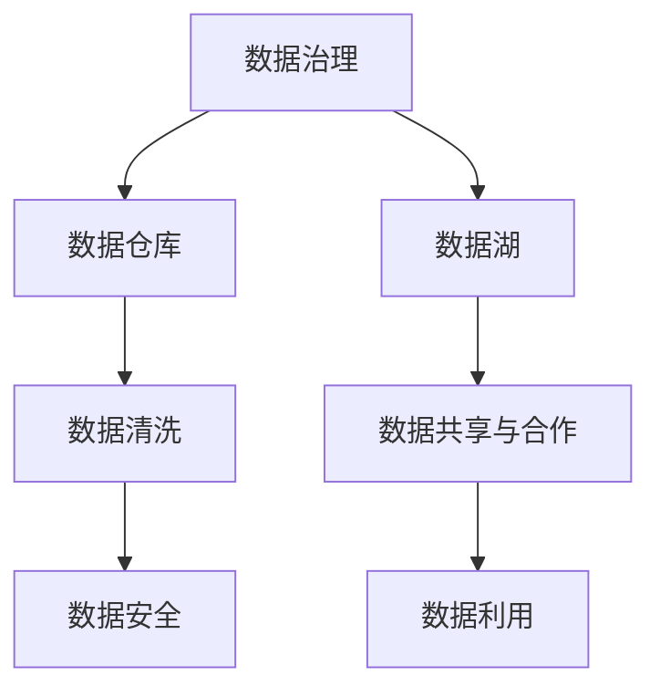

                 

# 人工智能创业数据管理的创新方案

> 关键词：数据管理,人工智能创业,创新方案,大数据,数据治理,数据安全

## 1. 背景介绍

在当今数字化转型的浪潮中，数据成为了企业核心竞争力的关键。对于人工智能(AI)创业公司而言，数据管理不仅是一项技术挑战，更是公司运营和创新的基石。数据的高效管理和合理应用，直接决定了AI系统的性能和商业价值的实现。本文将围绕AI创业公司的数据管理展开，探讨如何通过创新的数据管理方案，提升公司的人工智能产品和服务的竞争力。

### 1.1 数据的重要性

数据在人工智能中扮演着至关重要的角色，主要体现在以下几个方面：

1. **决策支持**：高质量的数据是训练AI模型的基础，直接影响模型的准确性和泛化能力。
2. **创新驱动**：通过大数据分析，可以揭示数据背后的趋势和模式，指导产品创新和市场策略。
3. **业务流程优化**：数据管理可以帮助优化业务流程，提高运营效率，降低成本。
4. **客户洞察**：深入分析客户数据，可以提供个性化的产品和服务，增强客户粘性。
5. **风险管理**：通过数据监控，及时发现和应对潜在风险，保障业务稳定运行。

### 1.2 数据管理面临的挑战

尽管数据的重要性不言而喻，但AI创业公司在数据管理过程中也面临诸多挑战：

1. **数据质量参差不齐**：数据来源多样化，格式各异，数据质量难以统一，导致模型训练困难。
2. **数据隐私与安全问题**：数据涉及用户隐私，需严格保护，同时也需防范数据泄露和滥用。
3. **数据整合与融合**：多源异构数据整合难度大，需要强大的数据治理能力。
4. **数据利用效率低**：数据利用不足，未能充分挖掘数据价值，资源浪费严重。
5. **数据管理和维护成本高**：数据管理和维护需投入大量资源，包括人力、技术等。

## 2. 核心概念与联系

### 2.1 核心概念概述

在进行数据管理方案设计时，需要理解以下核心概念：

- **数据治理(Data Governance)**：数据治理是确保数据质量、安全、完整性、一致性和可用性的管理实践。
- **数据仓库(Data Warehouse)**：数据仓库是一种集中式的数据存储环境，用于支持决策分析。
- **数据湖(Data Lake)**：数据湖是存储大规模、多样化数据的分布式存储环境，支持大数据分析和人工智能应用。
- **数据清洗(Data Cleaning)**：数据清洗是指处理数据中的噪声、重复、缺失等问题，提升数据质量。
- **数据安全(Data Security)**：数据安全涉及数据加密、访问控制、数据脱敏等多方面的安全措施。
- **数据共享与合作(Data Sharing & Collaboration)**：数据共享是企业间合作的重要环节，需建立数据共享机制，促进数据价值的最大化。

这些概念之间的关系可以通过以下Mermaid流程图展示：



## 3. 核心算法原理 & 具体操作步骤

### 3.1 算法原理概述

数据管理的核心在于构建一个高效、安全、可控的数据治理框架，确保数据的完整性、一致性和可用性。以下是基于数据治理的AI创业公司数据管理方案的核心算法原理：

- **数据集成与清洗**：通过ETL(Extract, Transform, Load)流程，将不同来源的数据进行清洗和整合，提升数据质量。
- **数据存储与管理**：采用数据仓库和数据湖，构建集中式和分布式的数据存储环境，支持大规模数据分析和机器学习应用。
- **数据治理与监控**：通过数据治理工具，建立数据质量、安全、访问控制等管理体系，实时监控数据状态。
- **数据安全与合规**：采用数据加密、访问控制等技术，保障数据安全，遵守相关法律法规。
- **数据利用与创新**：通过数据分析和机器学习模型，提取数据价值，驱动业务创新和决策支持。

### 3.2 算法步骤详解

基于上述算法原理，AI创业公司数据管理方案可以分为以下关键步骤：

**Step 1: 数据收集与评估**

1. **数据收集**：确定业务需求，收集相关数据源，如客户数据、交易数据、市场数据等。
2. **数据评估**：评估数据质量，包括数据完整性、准确性、一致性、时效性等。

**Step 2: 数据清洗与预处理**

1. **数据清洗**：处理数据中的噪声、重复、缺失等问题，提升数据质量。
2. **数据预处理**：进行数据归一化、特征提取等处理，为后续分析模型准备数据。

**Step 3: 数据存储与管理**

1. **数据仓库建立**：建立集中式数据仓库，存储结构化数据，支持传统的数据分析。
2. **数据湖构建**：采用分布式存储技术，构建数据湖，存储海量、多样化的大数据。
3. **数据分区与索引**：对数据进行分区和索引，优化查询效率。

**Step 4: 数据治理与监控**

1. **数据质量管理**：建立数据质量管理体系，定期评估数据质量。
2. **数据安全管理**：采用数据加密、访问控制等措施，保障数据安全。
3. **数据访问审计**：记录和监控数据访问行为，确保合规性。

**Step 5: 数据利用与创新**

1. **数据分析与建模**：通过数据分析和机器学习模型，提取数据价值。
2. **业务应用**：将数据分析结果应用于业务决策、产品创新等。
3. **持续优化**：根据业务反馈和数据分析结果，持续优化数据管理策略。

### 3.3 算法优缺点

基于数据治理的AI创业公司数据管理方案具有以下优点：

- **数据质量高**：通过严格的清洗和预处理，保证数据质量，提高模型训练效果。
- **灵活性高**：集中式和分布式存储环境，支持多样化数据源和复杂查询。
- **安全性好**：采用先进的数据安全技术，保障数据隐私和安全。
- **性能稳定**：通过数据治理和监控，实时发现和解决问题，确保系统稳定性。

但该方案也存在一定的局限性：

- **初期投入大**：数据清洗、存储和管理需投入大量资源。
- **技术门槛高**：需要专业的数据管理和数据分析团队。
- **数据共享困难**：企业间数据共享机制尚未完全建立，数据孤岛问题难以解决。

### 3.4 算法应用领域

基于数据治理的AI创业公司数据管理方案，适用于以下领域：

- **金融科技**：如风险管理、客户关系管理、智能投顾等。
- **电子商务**：如推荐系统、供应链优化、市场分析等。
- **智能制造**：如设备监控、质量控制、生产优化等。
- **健康医疗**：如患者管理、疾病预测、医疗影像分析等。
- **智能交通**：如交通流量分析、智能调度、交通安全监测等。

## 4. 数学模型和公式 & 详细讲解 & 举例说明

### 4.1 数学模型构建

数据管理方案的数学模型主要涉及数据清洗、数据治理和数据利用等方面。以下是一些关键的数学模型和公式：

- **数据清洗模型**：
  $$
  \text{Cleaned Data} = \text{Original Data} - \text{Noise} - \text{Duplicates} - \text{Missing Values}
  $$

- **数据治理模型**：
  $$
  \text{Data Quality} = \text{Data Completeness} \times \text{Data Accuracy} \times \text{Data Consistency} \times \text{Data Timeliness}
  $$

- **数据利用模型**：
  $$
  \text{Business Value} = \text{Data Insight} \times \text{Data Model} \times \text{Data Application}
  $$

### 4.2 公式推导过程

以数据清洗模型为例，推导数据清洗的数学过程：

1. **去噪声**：
  $$
  \text{Cleaned Data}_1 = \text{Original Data}_1 - \text{Noise}
  $$

2. **去重复**：
  $$
  \text{Cleaned Data}_2 = \text{Cleaned Data}_1 - \text{Duplicates}
  $$

3. **补缺失**：
  $$
  \text{Cleaned Data}_3 = \text{Cleaned Data}_2 + \text{Missing Values}
  $$

4. **标准化**：
  $$
  \text{Cleaned Data} = \text{Cleaned Data}_3 / \text{Standard Deviation}
  $$

通过以上步骤，可以将原始数据清洗为高质量的数据，提升后续分析和模型的性能。

### 4.3 案例分析与讲解

以下是一个具体的数据清洗案例：

**案例背景**：某电商公司收集了大量的用户购买数据，用于分析和推荐。原始数据包含多个字段，格式不一，数据质量参差不齐。

**数据清洗流程**：

1. **数据初步分析**：
  - 统计数据字段和数据类型，发现部分字段格式错误。
  - 发现数据中存在大量重复记录。
  - 发现部分用户信息缺失。

2. **数据清洗步骤**：
  - 去噪声：使用正则表达式去除数据中的非数字字符。
  - 去重复：通过唯一标识符去重，保留一条记录。
  - 补缺失：通过插值法填充缺失数据。
  - 标准化：对数值型数据进行归一化处理。

**数据清洗结果**：

- 数据格式统一，格式错误减少。
- 数据去重后，重复记录消失。
- 缺失数据填充完整，数据完整性提升。
- 数据标准化后，模型训练效果提升。

## 5. 项目实践：代码实例和详细解释说明

### 5.1 开发环境搭建

在进行数据管理方案开发前，需要搭建好开发环境。以下是使用Python进行数据管理方案开发的常见环境配置：

1. **安装Anaconda**：
  ```
  conda create -n data-env python=3.8
  conda activate data-env
  ```

2. **安装数据管理库**：
  ```
  pip install pandas numpy matplotlib scikit-learn 
  ```

3. **安装数据清洗库**：
  ```
  pip install pyjanitor faker pandas_profiling
  ```

4. **安装数据治理库**：
  ```
  pip install airflow apache-airflow flask-restful
  ```

5. **安装数据安全库**：
  ```
  pip install cryptography requests
  ```

6. **安装数据共享与协作工具**：
  ```
  pip install apache-kafka kafka-python
  ```

### 5.2 源代码详细实现

以下是一个使用Python进行数据清洗和预处理的具体代码实现：

```python
import pandas as pd
import pyjanitor as pj
from pyjanitor import clean_column, remove_duplicates, fill_missing

# 读取数据
data = pd.read_csv('raw_data.csv')

# 清洗数据
data = clean_column(data, 'timestamp', datetime=True)
data = remove_duplicates(data)
data = fill_missing(data, method='ffill', inplace=True)

# 数据预处理
data['price'] = data['price'] / data['price'].std()
data['date'] = pd.to_datetime(data['timestamp']).dt.date

# 输出清洗后数据
data.head()
```

### 5.3 代码解读与分析

**代码解读**：

- **导入库**：导入pandas、pyjanitor等数据处理库。
- **数据读取**：使用pandas读取原始数据文件。
- **数据清洗**：使用pyjanitor库进行数据清洗，包括处理时间戳、去重、填补缺失值。
- **数据预处理**：对价格数据进行标准化处理，将时间戳转换为日期格式。
- **数据输出**：使用head方法输出清洗后的数据样本。

**代码分析**：

- **清洗模块**：pyjanitor库提供了丰富的数据清洗函数，如clean_column处理日期时间戳，remove_duplicates去重，fill_missing填补缺失值等。
- **预处理模块**：标准化处理价格数据，将时间戳转换为日期格式，便于后续分析。
- **数据展示**：使用head方法输出清洗后的数据样本，验证清洗效果。

**运行结果展示**：

```python
import matplotlib.pyplot as plt

# 数据可视化
data['price'].hist(bins=10, figsize=(8, 6))
plt.title('Price Distribution')
plt.show()
```

```python
import seaborn as sns

# 数据可视化
sns.pairplot(data, hue='category')
plt.show()
```

通过数据清洗和预处理，原始数据格式得到统一，数据质量显著提升，为后续分析和建模打下良好的基础。

## 6. 实际应用场景

### 6.1 金融科技

在金融科技领域，数据管理方案可以应用于以下场景：

- **风险管理**：通过分析客户历史交易数据和行为数据，构建风险评估模型，预测客户违约概率。
- **智能投顾**：利用用户交易数据和市场行情数据，进行投资策略优化和组合管理。
- **客户关系管理**：分析客户行为数据，提供个性化推荐和服务，提升客户满意度。

### 6.2 电子商务

在电子商务领域，数据管理方案可以应用于以下场景：

- **推荐系统**：通过分析用户购买和浏览数据，构建推荐模型，提高商品推荐准确性。
- **供应链优化**：分析销售数据和库存数据，优化供应链管理，降低运营成本。
- **市场分析**：利用客户数据和市场数据，进行市场细分和趋势分析，指导市场策略。

### 6.3 智能制造

在智能制造领域，数据管理方案可以应用于以下场景：

- **设备监控**：收集设备运行数据，构建设备健康评估模型，预测设备故障。
- **质量控制**：分析生产数据和质量数据，优化生产流程，提高产品质量。
- **生产优化**：通过数据分析，优化生产调度，提升生产效率。

### 6.4 健康医疗

在健康医疗领域，数据管理方案可以应用于以下场景：

- **患者管理**：分析患者历史诊疗数据，构建疾病预测模型，提供个性化诊疗建议。
- **医疗影像分析**：利用医学影像数据，进行疾病诊断和分析，提高诊断准确性。
- **健康管理**：分析用户健康数据，提供健康预警和个性化建议。

### 6.5 智能交通

在智能交通领域，数据管理方案可以应用于以下场景：

- **交通流量分析**：收集交通数据，分析交通流量和拥堵情况，优化交通管理。
- **智能调度**：利用交通数据和车辆数据，进行智能调度和路径规划，提高运输效率。
- **交通安全监测**：分析交通事故数据，进行风险预警和应对。

## 7. 工具和资源推荐

### 7.1 学习资源推荐

为了帮助开发者系统掌握数据管理方案的理论基础和实践技巧，以下是一些优质的学习资源：

1. **《大数据技术与应用》课程**：由北京大学讲授，全面介绍了大数据技术的基本概念和应用实践。
2. **《Python数据科学手册》书籍**：是一本全面介绍Python在数据科学中的应用的手册，包含丰富的数据处理和分析实例。
3. **《数据科学与工程》课程**：由清华大学开设，涵盖了数据科学和工程的基本理论和实践。
4. **《数据治理与质量管理》书籍**：详细介绍了数据治理和质量管理的理论和实践，适合深入学习。
5. **《数据安全与隐私保护》课程**：介绍了数据安全与隐私保护的基本概念和实践，适合数据安全领域的开发者学习。

### 7.2 开发工具推荐

以下是几款用于数据管理方案开发的常用工具：

1. **Jupyter Notebook**：用于数据处理和分析的交互式环境，支持Python、R等多种语言。
2. **Airflow**：用于数据治理和数据管理的分布式调度系统，支持大规模数据处理。
3. **Apache Kafka**：用于数据共享和协作的消息队列系统，支持高效的数据流传输。
4. **Cryptography**：用于数据加密和数字签名的Python库，保障数据安全。
5. **Pyjanitor**：用于数据清洗和处理的Python库，提供丰富的数据清洗函数。

### 7.3 相关论文推荐

数据管理方案的研究源于学界的持续研究。以下是几篇奠基性的相关论文，推荐阅读：

1. **《大数据科学与工程》论文**：介绍了大数据的基本概念、技术架构和应用实践。
2. **《数据治理：概念、模型与实践》论文**：详细介绍了数据治理的基本概念、模型和实践。
3. **《数据安全与隐私保护》论文**：介绍了数据安全与隐私保护的基本概念、技术和实践。
4. **《数据共享与协作》论文**：介绍了数据共享与协作的基本概念、技术和实践。
5. **《数据利用与创新》论文**：介绍了数据利用与创新的基本概念、技术和实践。

## 8. 总结：未来发展趋势与挑战

### 8.1 研究成果总结

本文系统介绍了基于数据治理的AI创业公司数据管理方案，包括数据收集、数据清洗、数据存储、数据治理、数据安全、数据利用等多个方面。通过实际案例和代码示例，展示了数据管理方案的实际应用效果。

### 8.2 未来发展趋势

未来，数据管理方案将呈现以下几个发展趋势：

1. **自动化数据治理**：通过机器学习和大数据技术，实现数据治理的自动化，提升数据治理效率。
2. **实时数据处理**：利用流式数据处理技术，实现实时数据清洗和分析，满足实时业务需求。
3. **数据共享与协作**：建立企业间的数据共享机制，促进数据价值的最大化。
4. **数据安全与隐私**：采用先进的数据加密和安全技术，保障数据隐私和安全。
5. **数据驱动决策**：通过数据驱动的决策支持系统，提升业务决策的准确性和效率。

### 8.3 面临的挑战

尽管数据管理方案在AI创业公司的应用中取得了显著效果，但在推广过程中仍面临诸多挑战：

1. **数据质量问题**：数据来源多样化，数据质量难以统一，导致模型训练困难。
2. **数据安全问题**：数据涉及用户隐私，需严格保护，同时也需防范数据泄露和滥用。
3. **技术门槛高**：数据管理和数据分析需专业团队支持，需投入大量资源。
4. **数据共享困难**：企业间数据共享机制尚未完全建立，数据孤岛问题难以解决。
5. **数据利用不足**：数据利用不足，未能充分挖掘数据价值，资源浪费严重。

### 8.4 研究展望

未来的研究需要在以下几个方面寻求新的突破：

1. **数据治理自动化**：通过机器学习和大数据技术，实现数据治理的自动化，提升数据治理效率。
2. **实时数据处理**：利用流式数据处理技术，实现实时数据清洗和分析，满足实时业务需求。
3. **数据安全与隐私**：采用先进的数据加密和安全技术，保障数据隐私和安全。
4. **数据驱动决策**：通过数据驱动的决策支持系统，提升业务决策的准确性和效率。

## 9. 附录：常见问题与解答

**Q1：数据管理方案如何提升AI模型的性能？**

A: 数据管理方案通过提高数据质量，使得AI模型在训练和推理过程中能够更好地反映数据的真实特征。高质量的数据可以提升模型的泛化能力，降低模型过拟合风险，提高模型性能。

**Q2：数据管理方案的开发需要哪些资源？**

A: 数据管理方案的开发需要数据科学家、数据工程师、IT技术人员等专业团队的协同合作，需投入大量时间、人力和资源。同时需要先进的数据处理工具和软件，如Jupyter Notebook、Airflow等。

**Q3：数据管理方案的挑战有哪些？**

A: 数据管理方案面临的主要挑战包括数据质量问题、数据安全问题、技术门槛高、数据共享困难和数据利用不足等。解决这些问题需要综合运用数据治理、数据安全、数据共享等多方面的技术手段。

**Q4：如何实现数据驱动的决策支持？**

A: 实现数据驱动的决策支持需要构建数据仓库和数据湖，收集和整合海量数据，进行数据分析和挖掘，构建数据驱动的决策支持系统。通过实时数据流处理和机器学习模型，提升业务决策的准确性和效率。

---

作者：禅与计算机程序设计艺术 / Zen and the Art of Computer Programming

